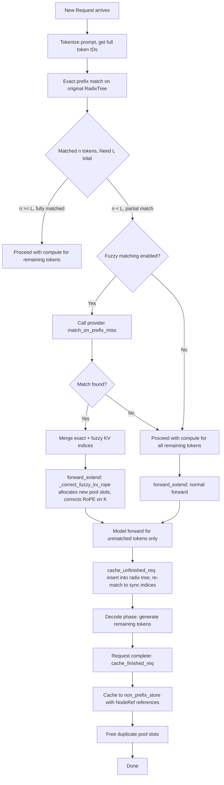
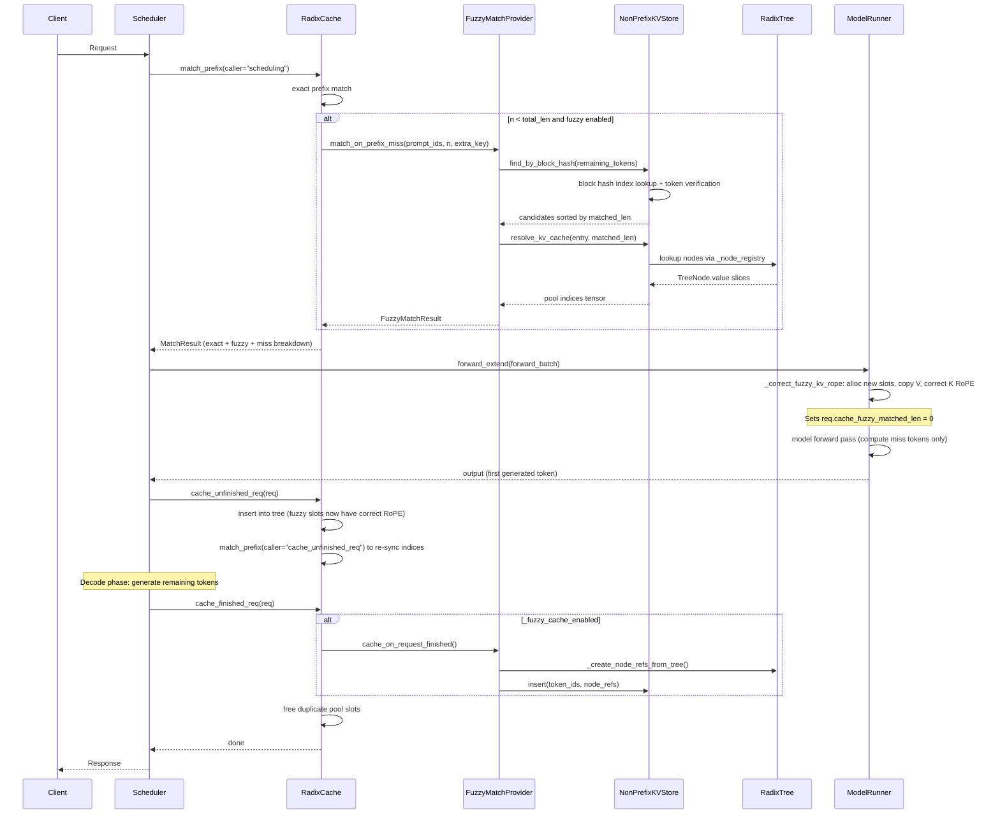

# Draft: Fuzzy Prefix Matching for SGLang RadixCache

---

## 1. Overview

This document describes the design for **fuzzy prefix matching** in SGLang's RadixCache system. Current prefix matching is strictly exact (token-by-token comparison from the beginning). Fuzzy matching extends this capability to handle two additional scenarios:

1.  **Token-Level Matching**: Token sequences with identical token IDs and count, but at different positions within the cached prompt (non-prefix substrings).
    
2.  **Semantic Matching**: Token sequences that are semantically similar but differ in token IDs and/or token count (e.g., "Hello, how are you?" vs "Hi, how are you doing?").
    

Note: This document focuses on an experimental implementation of **Token-Level Matching**; **Semantic Matching** is not yet included.

### 1.1 Motivation

In real-world workloads, exact prefix matches are often insufficient:

*   Different prompts may share common sub-sequences that are not prefixes
    
*   Multi-turn conversations may re-use middle segments of previous prompts
    

Fuzzy matching allows reusing previously computed KV cache for these near-miss scenarios, reducing recomputation and improving throughput.

### 1.2 Key Design Principles

1.  **Non-pollution**: Fuzzy-matched KV cache must not contaminate the original radix tree used for exact prefix matching. The new-slot allocation approach ensures original pool locations (owned by the source request's radix tree) are never mutated.
    
2.  **Config-driven**: Fuzzy matching is opt-in via configuration, with configurable thresholds and provider selection.
    
3.  **Position-aware**: When matched tokens come from non-prefix positions, RoPE correction is applied at the model executor level before the forward pass.
    
4.  **No double-counting**: Pool indices are stored only in the radix tree. The fuzzy store references radix tree nodes instead of duplicating indices.
    

## 2. Architecture

### 2.1 Prompt Token Decomposition

When fuzzy prefix matching is enabled, a prompt of `total_len` tokens is decomposed into three contiguous regions by `match_prefix`:

```plaintext
|<-- exact_matched_len -->|<-- fuzzy_matched_len -->|<--- miss_len --->|
       exact match              fuzzy match             new tokens
     (from radix tree)    (from non_prefix_store)     (need compute)

```

*   **exact prefix tokens**: Matched from the radix tree. KV indices are shared directly, no recomputation needed.
    
*   **fuzzy prefix tokens**: Matched from `NonPrefixKVStore`. The KV data exists in the pool but with RoPE applied at the original cached positions. Before the forward pass, `_correct_fuzzy_kv_rope` allocates new pool slots, performs reverse-RoPE + apply-RoPE to correct the positional encoding, then updates `req_to_token_pool` to point to the new slots.
    
*   **miss tokens**: No cached KV available. These tokens are computed during the forward pass.
    

When `fuzzy_matched_len = 0`, the behavior is identical to standard chunk prefill (only exact prefix + miss tokens). When `fuzzy_matched_len > 0`, the only additional work before the forward pass is allocating new pool slots and correcting RoPE on the fuzzy tokens' K values.

### 2.2 Storage Architecture

The original RadixTree for exact prefix matching remains untouched. A single additional storage structure is introduced for fuzzy matching.

```plaintext
+---------------------------------------------------------------+
|                        Request arrives                          |
+---------------------------------------------------------------+
                              |
                              v
+---------------------------------------------------------------+
|                    Matching Order (priority)                    |
|                                                                 |
|  +----------------------+                                       |
|  |  1. Exact Prefix     |  <- Original RadixTree (unchanged)    |
|  |     RadixTree        |    Existing SGLang logic, no mods     |
|  +----------+-----------+                                       |
|             | miss (matched n < L-1)                            |
|             v                                                   |
|  +----------------------+                                       |
|  |  2. Non-Prefix       |  <- NEW: flat store for non-prefix    |
|  |     KV Cache Store   |     cached segments (semantic/token)  |
|  +----------------------+                                       |
+---------------------------------------------------------------+


```

#### Storage 1 (existing): Original RadixTree

No changes needed. SGLang's existing `RadixCache` handles exact prefix matching.

#### Storage 2: `NonPrefixKVStore`

*   **Purpose**: Stores all cached segments (both prefix-complete sequences and mid-prompt subsequences) for fuzzy matching.
    
*   **Data structure**: Flat list with block-hash indexing. Stores `NodeRef` objects (references to radix tree nodes) instead of duplicating pool indices.
    
*   **Write condition**: When `RadixCache.cache_finished_req()` completes and fuzzy caching is enabled, `cache_on_request_finished` is called to store the request's token sequence and node references into the `NonPrefixKVStore`.
    
*   **Why NodeRef-based**: Pool indices are stored only in the radix tree's `TreeNode.value`. The fuzzy store references nodes by ID/offset/length, avoiding double-counting in memory accounting.
    

### 2.3 Component Overview

```plaintext
+----------------------------------------------------------+
|                    FuzzyMatchConfig                        |
|  +----------------------------------------------------+  |
|  |  enable_fuzzy_match: bool                            |  |
|  |  fuzzy_min_match_length: int                         |  |
|  |  fuzzy_semantic_threshold: float                     |  |
|  |  fuzzy_match_provider: str                           |  |
|  |  cache_fuzzy_results: bool                           |  |
|  |  fuzzy_non_prefix_max_entries: int                   |  |
|  |  fuzzy_block_size: int                               |  |
|  |  embedding_model_name: str                           |  |
|  +----------------------------------------------------+  |
+----------------------------------------------------------+

+----------------------------------------------------------+
|                  FuzzyMatchProvider (abstract)             |
|  +----------------------------------------------------+  |
|  |  cache_on_request_finished(req, tokens, kv_cache,   |  |
|  |      cache_start_pos, cache_end_pos, radix_tree)    |  |
|  |                                                     |  |
|  |  match_on_prefix_miss(prompt_token_ids,             |  |
|  |      already_matched_len, extra_key) -> Result      |  |
|  |                                                     |  |
|  |  set_min_match_length(length)                       |  |
|  +----------------------------------------------------+  |
+----------------------------------------------------------+

+----------------------------------------------------------+
|                   FuzzyMatchResult                         |
|  +----------------------------------------------------+  |
|  |  cached_token_count: int                             |  |
|  |  cached_token_ids: List[int]                         |  |
|  |  prompt_token_count: int                             |  |
|  |  kv_cache_indices: torch.Tensor                      |  |
|  |  position_offset: int                                |  |
|  |  cached_start_pos: int  (for RoPE reversal)          |  |
|  |  _match_entry: any      (internal reference)         |  |
|  +----------------------------------------------------+  |
+----------------------------------------------------------+

+----------------------------------------------------------+
|                  MatchPrefixParams                         |
|  +----------------------------------------------------+  |
|  |  key: RadixKey                                       |  |
|  |  cow_mamba: bool = False                             |  |
|  |  req: Optional[Req] = None                           |  |
|  |  caller: str = ""   (for logging identification)     |  |
|  +----------------------------------------------------+  |
+----------------------------------------------------------+

```

## 3. FuzzyMatchProvider Interface

The `FuzzyMatchProvider` is a pluggable interface that allows community implementations for different fuzzy matching strategies.

### 3.1 Abstract Base Class

```python
from abc import ABC, abstractmethod
from dataclasses import dataclass
from typing import List, Optional
import torch

from sglang.srt.mem_cache.fuzzy_match.config import FuzzyMatchConfig


@dataclass
class FuzzyMatchResult:
    """Result returned by fuzzy matching."""
    cached_token_count: int           # Tokens found in cache for reuse
    cached_token_ids: List[int]       # The matched token IDs
    prompt_token_count: int           # Prompt tokens this replaces (may differ for semantic)
    kv_cache_indices: torch.Tensor    # KV indices to reuse (after-RoPE, from memory pool)
    position_offset: int              # Position offset for reuse
    cached_start_pos: int = 0         # Original start position (for RoPE reversal)
    _match_entry: any = None          # Internal reference to matched NonPrefixEntry


class FuzzyMatchProvider(ABC):
    """Abstract interface for fuzzy/semantic prefix matching.

    This provider is ONLY invoked when exact prefix matching fails to cover
    the full prompt (matched n < total_len). Its sole responsibility is to manage
    fuzzy KV cache: lookup, read, and write.
    """

    def __init__(self, config: FuzzyMatchConfig):
        self.config = config
        self.min_match_length = config.fuzzy_min_match_length

    def set_min_match_length(self, length: int) -> None:
        self.min_match_length = length

    @abstractmethod
    def cache_on_request_finished(
        self,
        request,
        token_ids: List[int],
        kv_cache: torch.Tensor,
        cache_start_pos: int,
        cache_end_pos: int,
        radix_tree=None,
    ) -> bool:
        """Called when a request completes. Decides whether to cache its KV
        into the fuzzy-matching storage.

        Args:
            request: The completed request object (Req).
            token_ids: Full token sequence of the request.
            kv_cache: KV cache tensor (after-RoPE) for this request.
            cache_start_pos: Starting position of the cacheable segment.
            cache_end_pos: Ending position (exclusive) of the cacheable segment.
            radix_tree: Radix tree instance for creating node references.

        Returns:
            True if the KV cache was stored, False otherwise.
        """
        pass

    @abstractmethod
    def match_on_prefix_miss(
        self,
        prompt_token_ids: List[int],
        already_matched_len: int,
        extra_key: Optional[str] = None,
    ) -> Optional[FuzzyMatchResult]:
        """Called when exact prefix matching falls short.

        Args:
            prompt_token_ids: Complete token IDs of the current prompt.
            already_matched_len: Tokens already matched by the exact radix tree.
            extra_key: Optional namespace key (e.g., lora_id) for filtering.

        Returns:
            FuzzyMatchResult if a match is found, None otherwise.
        """
        pass


```

### 3.2 Provider Factory

```python
def create_fuzzy_match_provider(config: FuzzyMatchConfig) -> Optional[FuzzyMatchProvider]:
    """Create a fuzzy match provider based on configuration."""
    if not config.enable_fuzzy_match:
        return None

    if config.fuzzy_match_provider == "TokenBlockMatch":
        from sglang.srt.mem_cache.fuzzy_match.token_block_match import TokenBlockMatchProvider
        return TokenBlockMatchProvider(config)
    elif config.fuzzy_match_provider == "SemanticEmbedding":
        raise NotImplementedError("SemanticEmbeddingProvider is not yet implemented.")
    else:
        raise ValueError(f"Unknown fuzzy match provider: {config.fuzzy_match_provider}")


```

### 3.3 Provider Implementation: TokenBlockMatchProvider

This provider uses exact token ID matching but allows matching at **any starting position** in the prompt (not just the beginning). Block hashing accelerates the comparison.

**Example:**

```plaintext
Cached sequence (length 8):    [A, B, C, D, E, F, G, H]
Prompt sequence (length 12):   [X, Y, Z, W, A, B, C, D, E, F, M, N]

Exact prefix match: 4 tokens [X, Y, Z, W] via radix tree.
Remaining from position 4: [A, B, C, D, E, F, M, N]

Fuzzy matching finds [A, B, C, D, E, F] (6 tokens) matches.
Total matched: 4 (exact) + 6 (fuzzy) = 10 tokens


```
```python
class TokenBlockMatchProvider(FuzzyMatchProvider):
    """Token-level matching accelerated by non-overlapping block hashing."""

    def __init__(self, config: FuzzyMatchConfig):
        super().__init__(config)
        self.block_size = config.fuzzy_block_size

        # Single unified store for all cached segments
        self.non_prefix_store = NonPrefixKVStore(
            max_entries=config.fuzzy_non_prefix_max_entries,
            block_size=self.block_size,
        )

    def cache_on_request_finished(
        self,
        request,
        token_ids: List[int],
        kv_cache: torch.Tensor,
        cache_start_pos: int,
        cache_end_pos: int,
        radix_tree=None,
    ) -> bool:
        """Cache a completed request for future fuzzy matching."""
        if not self.config.cache_fuzzy_results:
            return False

        segment_tokens = token_ids[cache_start_pos:cache_end_pos]

        if len(segment_tokens) < self.min_match_length:
            return False

        # Create NodeRef objects by traversing the radix tree
        node_refs = self._create_node_refs_from_tree(
            radix_tree=radix_tree,
            cache_start_pos=cache_start_pos,
            cache_end_pos=cache_end_pos,
        )

        # Insert into non_prefix_store (NodeRef-based, not direct KV storage)
        self.non_prefix_store.insert(
            token_ids=segment_tokens,
            node_refs=node_refs,
            extra_key=request.extra_key,
            start_pos=cache_start_pos,
            radix_tree=radix_tree,
        )

        return True

    def _create_node_refs_from_tree(
        self, radix_tree, cache_start_pos: int, cache_end_pos: int,
    ) -> List[NodeRef]:
        """Create NodeRef objects by walking the radix tree."""

        node_refs = [ ]

        node = radix_tree.root_node
        stack = [(node, 0)]  # (node, start_offset_in_tokens)

        while stack:
            node, offset = stack.pop()
            node_value_len = len(node.value) if node.value is not None else 0

            for child_key, child in node.children.items():
                child_offset = offset + node_value_len
                stack.append((child, child_offset))

            if node.value is None or node_value_len == 0:
                continue

            node_start = offset
            node_end = offset + node_value_len
            overlap_start = max(node_start, cache_start_pos)
            overlap_end = min(node_end, cache_end_pos)

            if overlap_start < overlap_end:
                node_refs.append(NodeRef(
                    node_id=node.id,
                    offset=overlap_start - node_start,
                    length=overlap_end - overlap_start,
                ))

        return node_refs

    def match_on_prefix_miss(
        self,
        prompt_token_ids: List[int],
        already_matched_len: int,
        extra_key: Optional[str] = None,
    ) -> Optional[FuzzyMatchResult]:
        """Find fuzzy match for the remaining prompt tokens."""
        remaining = prompt_token_ids[already_matched_len:]

        if len(remaining) < self.min_match_length:
            return None

        # Search non_prefix_store via block hash index
        candidates = self.non_prefix_store.find_by_block_hash(
            query_tokens=remaining,
            min_length=self.min_match_length,
            extra_key=extra_key,
        )

        if not candidates:
            return None

        matched_len, entry, _ = candidates[0]

        if matched_len < self.min_match_length:
            return None

        # Resolve pool indices from node references
        kv_cache_indices = self.non_prefix_store.resolve_kv_cache(entry, matched_len)

        return FuzzyMatchResult(
            cached_token_count=matched_len,
            cached_token_ids=entry.token_ids[:matched_len],
            prompt_token_count=matched_len,  # 1:1 for token-level matching
            kv_cache_indices=kv_cache_indices,
            position_offset=already_matched_len,
            cached_start_pos=entry.start_pos,
            _match_entry=entry,
        )


```

### 3.4 Supporting Data Structures

```python
@dataclass
class NodeRef:
    """Reference to a segment within a radix tree node.

    Instead of storing pool indices directly, we store a reference to
    the radix tree node and the range within it. Pool indices are only
    stored in the radix tree, avoiding double-counting.
    """
    node_id: int      # ID of the TreeNode in the radix tree
    offset: int       # Starting offset within the node's value array
    length: int       # Number of tokens this reference covers


@dataclass
class NonPrefixEntry:
    """Entry for a cached segment in the fuzzy matching store."""
    id: int
    token_ids: List[int]
    node_refs: List[NodeRef]
    extra_key: Optional[str]
    timestamp: float
    block_hashes: Optional[List[int]] = None
    semantic_metadata: Optional[Dict[str, any]] = None
    start_pos: int = 0          # Original start position (for RoPE reversal)
    num_full_blocks: int = 0    # Number of complete blocks (for matching optimization)


class NonPrefixKVStore:
    """Flat store for cached segments with block-hash acceleration.

    Stores token IDs (for matching) and node references to the radix tree.
    Pool indices are resolved on-demand from the radix tree.
    """

    def __init__(self, max_entries: int = 10000, block_size: int = 32):
        self.max_entries = max_entries
        self.block_size = block_size

        self.entries: List[NonPrefixEntry] = [ ]

        self.block_index: Dict[int, List[Tuple[int, int]]] = defaultdict(list)
        self._entry_id_counter = 0
        self._node_registry: Dict[int, any] = {}

    def set_node_registry(self, registry: Dict[int, any]):
        """Set the node registry from RadixCache for resolving node references."""
        self._node_registry = registry

    def insert(
        self,
        token_ids: List[int],
        node_refs: List[NodeRef],
        extra_key: Optional[str],
        semantic_metadata: Optional[Dict[str, any]] = None,
        start_pos: int = 0,
        radix_tree=None,
    ) -> int:
        """Insert a non-prefix segment into the store."""
        if len(self.entries) >= self.max_entries:
            self._evict(radix_tree=radix_tree)

        entry_id = self._entry_id_counter
        self._entry_id_counter += 1

        block_hashes = self._compute_block_hashes(token_ids)

        entry = NonPrefixEntry(
            id=entry_id,
            token_ids=token_ids,
            node_refs=node_refs,
            extra_key=extra_key,
            timestamp=time.monotonic(),
            block_hashes=block_hashes,
            semantic_metadata=semantic_metadata,
            start_pos=start_pos,
        )

        self.entries.append(entry)

        for i, block_hash in enumerate(block_hashes):
            self.block_index[block_hash].append((entry_id, i * self.block_size))

        return entry_id

    def resolve_kv_cache(self, entry: NonPrefixEntry, matched_len: int) -> torch.Tensor:
        """Resolve pool indices from node references for the matched portion."""

        indices = [ ]

        remaining = matched_len

        for ref in entry.node_refs:
            if remaining <= 0:
                break

            node = self._node_registry.get(ref.node_id)
            if node is None or node.value is None:
                continue

            start = ref.offset
            end = min(ref.offset + ref.length, ref.offset + remaining)
            actual_len = end - start

            if actual_len > 0:
                node_indices = node.value[start:end]
                indices.append(node_indices)
                remaining -= actual_len

        if not indices:
            return torch.empty(0, dtype=torch.int64)

        return torch.cat(indices)

    def find_by_block_hash(
        self,
        query_tokens: List[int],
        min_length: int,
        extra_key: Optional[str] = None,
    ) -> List[Tuple[int, NonPrefixEntry, int]]:
        """Find entries that share a block with the query.

        Returns list of (matched_len, entry, query_matched_start),
        sorted by matched_len descending.
        """

        candidates = [ ]

        num_query_blocks = len(query_tokens) // self.block_size

        if num_query_blocks == 0:
            return self._find_by_linear_scan(query_tokens, min_length, extra_key)

        for query_block_idx in range(num_query_blocks):
            start = query_block_idx * self.block_size
            block = tuple(query_tokens[start:start + self.block_size])
            block_hash = hash(block)

            if block_hash not in self.block_index:
                continue

            for entry_id, cached_pos in self.block_index[block_hash]:
                entry = self.entries[entry_id]

                if extra_key is not None and entry.extra_key != extra_key:
                    continue

                count = self._count_match_from_position(
                    entry.token_ids, cached_pos, query_tokens, start,
                )

                if count >= min_length:
                    candidates.append((count, entry, start))

        candidates.sort(key=lambda x: x[0], reverse=True)
        return candidates

    def find_by_semantic(
        self,
        query_tokens: List[int],
        min_similarity: float,
        extra_key: Optional[str] = None,
    ) -> List[Tuple[float, NonPrefixEntry]]:
        """TODO: Not yet implemented. Reserved for future embedding-based matching."""
        raise NotImplementedError("Semantic matching is not yet implemented.")


```

## 4. Integration with RadixCache

### 4.1 Modified `match_prefix` Flow

The existing `RadixCache.match_prefix()` is extended to invoke fuzzy matching when exact matching falls short.

```python
class RadixCache:
    def __init__(self, params: CacheInitParams):
        # ... existing initialization ...
        self.fuzzy_config: Optional[FuzzyMatchConfig] = None
        self.fuzzy_match_provider: Optional[FuzzyMatchProvider] = None
        self._fuzzy_cache_enabled: bool = False  # Pre-computed from config
        self._node_registry: Dict[int, TreeNode] = {}

    def init_fuzzy_match(self, config: FuzzyMatchConfig, provider: FuzzyMatchProvider):
        """Initialize fuzzy matching support."""
        self.fuzzy_config = config
        self.fuzzy_match_provider = provider
        self._fuzzy_cache_enabled = config.cache_fuzzy_results

        # Wire node registry to non_prefix_store for resolving pool indices
        if hasattr(self.fuzzy_match_provider, 'non_prefix_store'):
            self.fuzzy_match_provider.non_prefix_store.set_node_registry(self._node_registry)

    def match_prefix(self, params: MatchPrefixParams) -> MatchResult:
        # Step 1: Exact prefix matching (existing logic)
        value, last_node = self._match_prefix_helper(self.root_node, key)
        value = torch.cat(value) if value else torch.empty((0,), dtype=torch.int64)

        exact_matched_len = len(value)
        total_len = len(key.token_ids)
        caller_tag = f" caller={params.caller}" if params.caller else ""

        # Step 2: If exact match is incomplete AND fuzzy is enabled, try fuzzy matching
        fuzzy_matched_len = 0
        if exact_matched_len < total_len:
            logger.info(
                f"[FUZZY RADIX] match_prefix:{caller_tag} exact={exact_matched_len}, fuzzy=0, "
                f"miss={total_len - exact_matched_len}, total={total_len}, attempting fuzzy..."
            )

            if self.fuzzy_match_provider is not None:
                fuzzy_result = self.match_prefix_fuzzy(
                    params=MatchPrefixParams(key=key),
                    exact_matched_len=exact_matched_len,
                )

                if fuzzy_result is not None:
                    fuzzy_matched_len = fuzzy_result.cached_token_count
                    miss_len = total_len - exact_matched_len - fuzzy_matched_len
                    logger.info(
                        f"[FUZZY RADIX] match_prefix:{caller_tag} exact={exact_matched_len}, "
                        f"fuzzy={fuzzy_matched_len}, miss={miss_len}, total={total_len}, "
                        f"cached_start_pos={fuzzy_result.cached_start_pos}"
                    )

                    # Merge exact + fuzzy KV indices
                    fuzzy_kv_indices = torch.tensor(
                        fuzzy_result.kv_cache_indices,
                        device=value.device,
                        dtype=value.dtype,
                    )

                    # Mark request as fuzzy-matched
                    if params.req is not None:
                        params.req.fuzzy_match_result = fuzzy_result

                    merged_value = torch.cat([value, fuzzy_kv_indices])

                    return MatchResult(
                        device_indices=merged_value,
                        last_device_node=last_node,
                        last_host_node=last_node,
                        fuzzy_matched_len=fuzzy_result.cached_token_count,
                        cache_protected_len=exact_matched_len + fuzzy_result.cached_token_count,
                    )
                else:
                    logger.info(
                        f"[FUZZY RADIX] match_prefix:{caller_tag} exact={exact_matched_len}, fuzzy=0, "
                        f"miss={total_len - exact_matched_len}, total={total_len}, fuzzy match failed"
                    )
        else:
            logger.info(
                f"[FUZZY RADIX] match_prefix:{caller_tag} exact={exact_matched_len}, fuzzy=0, "
                f"miss=0, total={total_len}"
            )

        return MatchResult(
            device_indices=value,
            last_device_node=last_node,
            last_host_node=last_node,
            fuzzy_matched_len=0,
        )

    def match_prefix_fuzzy(
        self,
        params: MatchPrefixParams,
        exact_matched_len: int,
    ) -> Optional[FuzzyMatchResult]:
        """Perform fuzzy prefix matching when exact matching falls short."""
        if exact_matched_len > 0 and exact_matched_len < self.fuzzy_config.fuzzy_min_match_length:
            return None

        try:
            result = self.fuzzy_match_provider.match_on_prefix_miss(
                prompt_token_ids=params.key.token_ids,
                already_matched_len=exact_matched_len,
                extra_key=params.key.extra_key,
            )
            return result
        except Exception as e:
            logger.error(f"Exception during fuzzy matching: {e}")
            return None


```

### 4.2 `cache_finished_req`: Caching to NonPrefixKVStore

When a request finishes, `cache_finished_req` performs standard radix tree insert (unchanged from baseline SGLang). The fuzzy-specific behavior is the call to `cache_on_request_finished`, which stores the completed request's token sequence and radix tree node references into `NonPrefixKVStore` for future fuzzy matching:

```python
def cache_finished_req(self, req: Req, is_insert: bool = True):
    """Cache request when it finishes."""
    # ... standard radix tree insert (unchanged) ...

    # Fuzzy-specific: cache to NonPrefixKVStore for future fuzzy matching.
    # This is called BEFORE freeing duplicate indices, since non_prefix_store
    # stores NodeRef references that must point to valid tree nodes.
    if self._fuzzy_cache_enabled:
        self.fuzzy_match_provider.cache_on_request_finished(
            request=req,
            token_ids=token_ids,
            kv_cache=kv_indices,
            cache_start_pos=cache_start,
            cache_end_pos=cache_end,
            radix_tree=self,
        )

    # ... standard duplicate slot freeing (unchanged) ...

```

Note: Fuzzy token realization (new pool slots + RoPE correction) has already been done by `model_runner._correct_fuzzy_kv_rope` before the forward pass. By the time `cache_finished_req` runs, and the KV indices in `req_to_token_pool` already point to the correctly RoPE-corrected new slots.

## 5. RoPE Handling

### 5.1 The Problem

SGLang applies RoPE at the model layer during forward pass. The KV cache stores **after-RoPE** key vectors. This means:

*   Cached K at position `p` has rotation `R(p)` already applied: `K_cached = R(p) * K_raw`
    
*   If we want to reuse this cache at a different position `q`, we need: `K_new = R(q) * K_raw`
    
*   We can recover `K_raw` by reverse rotation: `K_raw = R(-p) * K_cached`
    
*   Then apply new rotation: `K_new = R(q) @ R(-p) @ K_cached = R(q-p) @ K_cached`
    

There are two ways to achieve this. 1、**Reverse at Storage:** Apply `reverse-RoPE` when storing the cache to save it in a pre-RoPE state. During inference, the model applies RoPE according to its original logic (though this may require adjusting `position_ids` outside the model layer). 2、**Reverse at Runtime:** Store the post-RoPE KVCache directly. During inference, perform a `reverse-RoPE` followed by an `apply-RoPE` operation.

Currently we adopt Reverse at Runtime, which means the start and end positions of the stored KVCache must also be persisted.

### 5.2 Reverse at Runtime by New-Slot Allocation with RoPE Correction

Before the forward pass, `model_runner._correct_fuzzy_kv_rope` handles RoPE correction for fuzzy-matched tokens:

1.  **Allocate new pool slots** for the fuzzy tokens (preserving original pool locations which belong to the source request's radix tree).
    
2.  **Copy V** directly from old slots to new slots (V has no positional encoding).
    
3.  **Copy K with RoPE correction**: For each layer, reverse the old RoPE at `cached_start_pos` and apply new RoPE at `exact_matched_len` (the target position in the current request).
    
4.  **Update** `**req_to_token_pool**` to point to the new slots.
    

Core logic (simplified from `model_runner._correct_fuzzy_kv_rope`):

```python
# Locate fuzzy tokens in the pool
fuzzy_start = exact_matched_len
fuzzy_end = exact_matched_len + cache_fuzzy_matched_len
old_indices = req_to_token_pool[req_pool_idx, fuzzy_start:fuzzy_end]

# 1. Allocate new pool slots
new_indices = token_to_kv_pool.alloc(cache_fuzzy_matched_len)

# 2. Compute cos/sin for old and new positions
cos_old, sin_old = cos_sin_cache[cached_start_pos : cached_start_pos + cache_fuzzy_matched_len]
cos_new, sin_new = cos_sin_cache[exact_matched_len : exact_matched_len + cache_fuzzy_matched_len]

# 3. Per-layer: copy V directly, copy K with RoPE correction
for layer_id in range(num_layers):
    v_old = token_to_kv_pool.get_value(layer_id, old_indices)
    token_to_kv_pool.set_value(layer_id, new_indices, v_old)          # V: direct copy

    k_old = token_to_kv_pool.get_key(layer_id, old_indices)
    k_no_rope = reverse_rotary_emb(k_old, cos_old, sin_old, is_neox)  # undo old RoPE
    k_new = apply_rotary_emb(k_no_rope, cos_new, sin_new, is_neox)    # apply new RoPE
    token_to_kv_pool.set_key(layer_id, new_indices, k_new)

# 4. Update req_to_token_pool to point to new slots
req_to_token_pool[req_pool_idx, fuzzy_start:fuzzy_end] = new_indices
```
---

## 6. Request Flow

### 6.1 Flowchart



### 6.2 Sequence Diagram


---

## 7. Configuration

### 7.1 Server Arguments

```python
@dataclass
class FuzzyMatchConfig:
    enable_fuzzy_match: bool = False
    fuzzy_min_match_length: int = 16
    fuzzy_semantic_threshold: float = 0.85
    fuzzy_match_provider: str = "TokenBlockMatch"
    cache_fuzzy_results: bool = True
    fuzzy_eviction_policy: str = "LRU"       # TODO: Not yet implemented
    fuzzy_non_prefix_max_entries: int = 10000
    fuzzy_block_size: int = 16
    embedding_model_name: str = "all-MiniLM-L6-v2"


```

### 7.2 Example Usage

```bash
python3 -m sglang.launch_server \
    --model-path /mnt/models/Qwen/Qwen3-4B \
    --port 30000 \
    --enable-fuzzy-match \
    --fuzzy-min-match-length 1 \
    --fuzzy-match-provider TokenBlockMatch \
    --cache-fuzzy-results

#case1: Cache a segment starting from position 4, then fuzzy-match it
curl http://127.0.0.1:30000/v1/completions     -H "Content-Type: application/json"     -d '{
        "model": "/mnt/models/Qwen/Qwen3-4B",
        "prompt": "书上说：人工智能是计算机科学的一个分支，它试图理解智能的实质。",
        "max_tokens": 100,
        "cache_start_pos": 4,
        "cache_end_pos": -1,
        "temperature": 0
    }'

curl http://127.0.0.1:30000/v1/completions     -H "Content-Type: application/json"     -d '{
        "model": "/mnt/models/Qwen/Qwen3-4B",
        "prompt": "人工智能是计算机科学的一个分支，它试图理解智能的实质。",
        "max_tokens": 100,
        "temperature": 0
    }

#case2: Three-request scenario testing exact + fuzzy reuse
curl http://127.0.0.1:30000/v1/completions     -H "Content-Type: application/json"     -d '{
        "model": "/mnt/models/Qwen/Qwen3-4B",
        "prompt": "人工智能是计算机科学的一个分支，它试图理解智能的实质。",
        "max_tokens": 100,
        "temperature": 0
    }'

curl http://127.0.0.1:30000/v1/completions     -H "Content-Type: application/json"     -d '{
        "model": "/mnt/models/Qwen/Qwen3-4B",
        "prompt": "书上说：",
        "max_tokens": 100,
        "temperature": 0
    }'

curl http://127.0.0.1:30000/v1/completions     -H "Content-Type: application/json"     -d '{
        "model": "/mnt/models/Qwen/Qwen3-4B",
        "prompt": "书上说：人工智能是计算机科学的一个分支，它试图理解智能的实质。",
        "max_tokens": 100,
        "temperature": 0
    }'


```
---

## Appendix: File Locations

```plaintext
python/sglang/srt/
+-- mem_cache/
|   +-- radix_cache.py              # Modified: fuzzy match integration, match_prefix with
|   |                                  caller logging, cache_on_request_finished in cache_finished_req
|   +-- base_prefix_cache.py        # Modified: MatchPrefixParams.caller field,
|   |                                  fuzzy_matched_len, cache_protected_len
|   +-- fuzzy_match/
|       +-- __init__.py             # Package exports
|       +-- config.py               # FuzzyMatchConfig
|       +-- fuzzy_match_provider.py # Abstract FuzzyMatchProvider, FuzzyMatchResult
|       +-- token_block_match.py    # TokenBlockMatchProvider implementation
|       +-- non_prefix_store.py     # NonPrefixKVStore, NonPrefixEntry, NodeRef
+-- managers/
|   +-- schedule_batch.py           # Modified: cache_fuzzy_matched_len, cache_protected_len,
|   |                                  match_prefix caller="scheduling"
|   +-- schedule_policy.py          # Modified: match_prefix caller="schedule_policy"
+-- model_executor/
|   +-- model_runner.py             # Modified: _correct_fuzzy_kv_rope (new-slot allocation),
|   |                                  called in forward_extend
|   +-- forward_batch_info.py       # Modified: fuzzy_matched_len, fuzzy_cached_start_pos,
|                                      reqs field for signaling cache_fuzzy_matched_len=0
+-- layers/
    +-- rotary_embedding/
        +-- utils.py                # New: apply_rotary_emb, reverse_rotary_emb helpers


```
