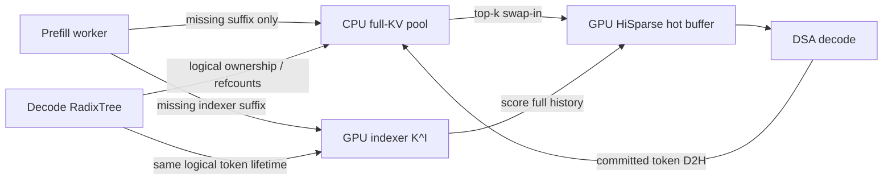

# Radix HiSparse for PD Decode

> Experimental prototype for reusing decode-side sparse KV prefixes in
> prefill-decode (PD) disaggregated serving.

## Motivation

Legacy HiSparse keeps the complete attention KV history in CPU pinned memory,
the indexer history on GPU, and only a small hot attention buffer on GPU. This
greatly reduces decode HBM use, but the decode worker uses a request-local cache
lifetime. When a later request shares a prefix, the prefill worker still sends
that prefix again because the decode worker cannot publish or match the existing
host KV through RadixCache.

This prototype applies normal RadixCache ownership and prefix-matching semantics
to HiSparse's existing host-backed KV allocation. It targets workloads such as
coding agents, where many requests share a large system/tool prefix and each
conversation then grows independently.

## Design

The design keeps one logical allocation per cached token:

- **Radix-managed canonical payload:** CPU full-attention KV plus GPU indexer
  history (`K^I`) share one logical lifetime and one set of token IDs.
- **HiSparse L0:** the existing per-request GPU hot buffer remains transient and
  is populated by HiSparse's top-k swap-in path.
- **No duplicate full-KV cache:** RadixCache owns the canonical slots; HiSparse
  consumes those slots for swapping instead of maintaining a second request-
  private host allocation.

Here, "L0" and "canonical layer" describe this prototype's execution hierarchy.
They intentionally avoid HiCache's established L1=GPU and L2=host numbering.

### Request lifecycle

1. The decode RadixTree matches and pins the longest reusable prefix.
2. The allocator reserves logical slots only for the missing suffix.
3. The prefill worker sends only that suffix: full KV lands in the decode CPU
   pool while indexer state lands in the corresponding GPU slots.
4. During decode, HiSparse scores the full GPU indexer history and swaps selected
   full-KV rows from the CPU pool into its GPU hot buffer.
5. A committed decode token is copied from the hot buffer back to its canonical
   CPU slot. The D2H completion fence is observed before Radix publication, so a
   later prefix hit cannot read partially written KV.
6. When a request finishes, RadixCache—not the request—retains or evicts the
   canonical prefix using its normal reference-count and eviction semantics.

The prefill-side hit length and decode-side hit length remain independent. A
prefill hit avoids computation; a decode hit avoids P-to-D KV transfer. Only the
decode hit determines the transferred suffix.

## Important invariants

- A logical token ID names both its CPU full-KV row and GPU indexer row.
- Radix publication happens only after transfer or decode write-back completes.
- The GPU hot buffer is an execution cache, never the owner of a reusable prefix.
- Radix capacity and eviction are based on the canonical pool; L0 availability is
  a separate per-request admission constraint.
- Prefix matching may return a full hit, so empty KV and indexer suffix transfers
  are valid protocol states.

## Current scope

Supported and exercised:

- PD decode with ordinary DeepSeek Sparse Attention (DSA) models;
- decode-side RadixCache with legacy HiSparse's CPU-canonical full KV;
- overlap scheduling and full decode CUDA graph replay;
- tensor/data-parallel GLM-5.2 execution;
- Mooncake TCP end-to-end transfer, plus focused NIXL protocol unit tests.

Not currently claimed:

- speculative decoding;
- HiCache or decode KV offload in the same process;
- hybrid SWA or Mamba/SSM models;
- DeepSeek-V4's mixed C4/C128/SWA cache layout;
- pipeline parallelism;
- production RDMA or NIXL end-to-end validation.

## End-to-end evaluation

The production-shaped comparison used GLM-5.2 W4AFP8 on two nodes with eight
H100 SXM GPUs each: one prefill node and one decode node. Both arms used full
decode CUDA graph replay with batch size 1 on every decode rank.

The workload modeled concurrent coding-agent conversations:

- 25,600-token shared system/tool prefix;
- 16 independent conversation branches;
- three monotonically growing turns per branch;
- 512 new unique input tokens and 1,024 output tokens per turn;
- closed-loop submission, keeping the decode node saturated;
- 48 measured requests after a separate cold-prefix seed.

The only A/B change was the decode cache policy: legacy HiSparse with ChunkCache
versus this Radix-backed HiSparse path.

| Metric | Legacy HiSparse | Radix HiSparse | Delta |
|---|---:|---:|---:|
| TTFT mean | 28,790.3 ms | 26,508.1 ms | -7.93% |
| TTFT p95 | 37,007.3 ms | 33,473.8 ms | -9.55% |
| TPOT mean | 32.277 ms | 30.114 ms | -6.70% |
| Wall time / 48 requests | 201.867 s | 187.574 s | -7.08% |
| Output throughput | 243.49 tok/s | 262.04 tok/s | +7.62% |
| Decode GPU utilization | 92.38% | 97.51% | +5.13 pp |
| Logical KV rows transferred | 1,327,104 | 24,576 | -98.15% |

The cold-prefix seed differed by only +0.27% between the two arms. All 48
requests in each arm generated the requested 1,024 tokens with no retractions,
transfer failures, cache exceptions, or CUDA errors. First tokens matched for
47/48 requests; the tested quantized MoE/DP-attention configuration was already
observed to be non-bitwise-deterministic in baseline self-repeats, so a standard
accuracy benchmark remains follow-up work.

This is intentionally a workload-specific optimization. In a separate
single-rank eager-decode experiment with only 1K-4K prefixes, the Radix path made
the complete conversation chain 10.44% slower: the saved transfer was too small
to amortize D2H publication and cache bookkeeping. The expected benefit is for
large reusable prefixes, repeated conversations, or memory-pressure regimes—not
for every HiSparse request.

## Implementation map

- `python/sglang/srt/mem_cache/allocator/radix_hisparse.py`: facade that exposes
  one Radix-visible logical allocator backed by CPU full KV and GPU indexer
  storage.
- `python/sglang/srt/managers/hisparse_coordinator.py`: L0 admission, swap-in,
  decode write-back, and publication fencing.
- `python/sglang/srt/disaggregation/decode.py`: decode-prefix matching and
  suffix-only transfer planning.
- `python/sglang/kernels/jit/csrc/hisparse.cuh`: int32/int64 location support for
  the swap kernels.
- `test/registered/unit/mem_cache/test_radix_hisparse_*.py`: allocator, admission,
  lifetime, and write-back tests.

## Relationship to HiSparse V2

[HiSparse V2 PR #32314](https://github.com/sgl-project/sglang/pull/32314)
uses HiCache as a GPU-first logical KV pool and writes attention KV to host under
memory pressure. This prototype explores a different PD-specific policy: the
existing CPU full-KV pool is canonical from arrival, while GPU memory is reserved
for indexer history and the HiSparse hot buffer. The shared product goal is
prefix reuse; the ownership policy and transfer path are different.

## Next steps

- Rebase onto current SGLang main and rerun the submitted tree.
- Add a registered small-model 1P1D GPU smoke test and a standard accuracy A/B.
- Either reject pipeline parallelism initially or add explicit PP coverage.
- Validate a production RDMA/NIXL path and quantify the transport-dependent
  breakeven point.
