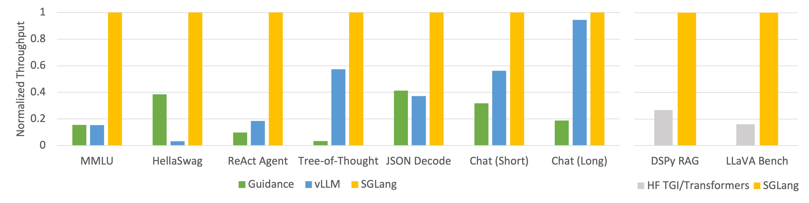
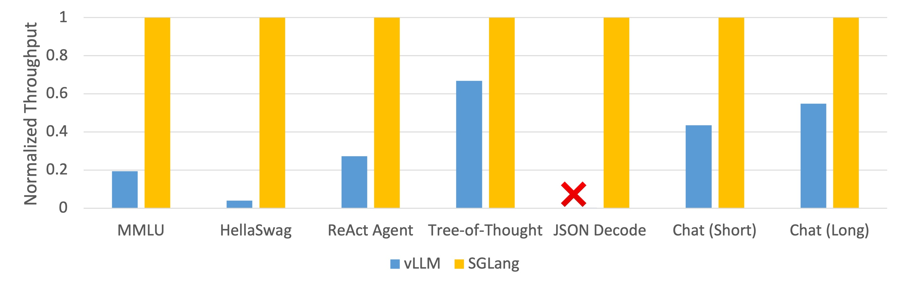

# SGLang
| [**Blog**](https://lmsys.org/blog/2024-01-17-sglang/) | [**Paper**](https://arxiv.org/abs/2312.07104) |

SGLang is a structured generation language designed for large language models (LLMs).
It makes your interaction with LLMs faster and more controllable by co-designing the frontend language and the runtime system.

The core features of SGLang include:
- **A Flexible Front-End Language**: This allows for easy programming of LLM applications with multiple chained generation calls, advanced prompting techniques, control flow, multiple modalities, parallelism, and external interaction.
- **A High-Performance Runtime with RadixAttention**: This feature significantly accelerates the execution of complex LLM programs by automatic KV cache reuse across multiple calls. It also supports other common techniques like continuous batching and tensor parallelism.

## News
- [2024/01] 🔥 SGLang powers the serving of the offical LLaVA v1.6 release demo ([blog](https://llava-vl.github.io/blog/2024-01-30-llava-1-6/)).
- [2024/01] SGLang provides up to 5x faster inference with RadixAttention ([blog](https://lmsys.org/blog/2024-01-17-sglang/)).

## Contents
- [Install](#install)
- [Quick Start](#quick-start)
- [Frontend: Structured Generation Language (SGLang)](#frontend-structured-generation-language-sglang)
- [Backend: SGLang Runtime (SRT)](#backend-sglang-runtime-srt)
- [Benchmark And Performance](#benchmark-and-performance)
- [Roadmap](#roadmap)
- [Citation And Acknowledgment](#citation-and-acknowledgment)

## Install

### Method 1: With pip
```
pip install "sglang[all]"
```

### Method 2: From source
```
git clone git@github.com:sgl-project/sglang.git
cd sglang

pip install --upgrade pip
pip install -e "python[all]"
```

### Notes
- If you are using older GPUs (NVIDIA V100, T4), please pick the correct triton compiler version to avoid some known bugs.
  - For NVIDIA T4, please use `pip install "triton>=2.2.0"`.
  - For NVIDIA V100, please install the [nightly](https://triton-lang.org/main/getting-started/installation.html) version.
- If you only need to use the OpenAI backend, you can avoid installing other dependencies by using `pip install "sglang[openai]"`


## Quick Start
The example below shows how to use sglang to answer a mulit-turn question.

### Using Local Models
First, launch a server with
```
python -m sglang.launch_server --model-path meta-llama/Llama-2-7b-chat-hf --port 30000
```

Then, connect to the server and answer a multi-turn question.

```python
from sglang import function, system, user, assistant, gen, set_default_backend, RuntimeEndpoint

@function
def multi_turn_question(s, question_1, question_2):
    s += system("You are a helpful assistant.")
    s += user(question_1)
    s += assistant(gen("answer_1", max_tokens=256))
    s += user(question_2)
    s += assistant(gen("answer_2", max_tokens=256))

set_default_backend(RuntimeEndpoint("http://localhost:30000"))

state = multi_turn_question.run(
    question_1="What is the capital of the United States?",
    question_2="List two local attractions.",
)

for m in state.messages():
    print(m["role"], ":", m["content"])

print(state["answer_1"])
```

### Using OpenAI Models
Set the OpenAI API Key
```
export OPENAI_API_KEY=sk-******
```

Then, answer a multi-turn question.
```python
from sglang import function, system, user, assistant, gen, set_default_backend, OpenAI

@function
def multi_turn_question(s, question_1, question_2):
    s += system("You are a helpful assistant.")
    s += user(question_1)
    s += assistant(gen("answer_1", max_tokens=256))
    s += user(question_2)
    s += assistant(gen("answer_2", max_tokens=256))

set_default_backend(OpenAI("gpt-3.5-turbo"))

state = multi_turn_question.run(
    question_1="What is the capital of the United States?",
    question_2="List two local attractions.",
)

for m in state.messages():
    print(m["role"], ":", m["content"])

print(state["answer_1"])
```

### More Examples

Anthropic and VertexAI (Gemini) models are also supported.
You can find more examples at [examples/quick_start](examples/quick_start).

## Frontend: Structured Generation Language (SGLang)

To begin with, import sglang.
```python
import sglang as sgl
```

`sglang` provides some simple primitives such as `gen`, `select`, `fork`, `image`.
You can implement your prompt flow in a function decorated by `sgl.function`.
You can then invoke the function with `run` or `run_batch`.
The system will manage the state, chat template, parallelism and batching for you.

The complete code for the examples below can be found at [readme_examples.py](examples/usage/readme_examples.py)

### Control Flow
You can use any Python code within the function body, including control flow, nested function calls, and external libraries.

```python
@sgl.function
def tool_use(s, question):
    s += "To answer this question: " + question + ". "
    s += "I need to use a " + sgl.gen("tool", choices=["calculator", "search engine"]) + ". "

    if s["tool"] == "calculator":
        s += "The math expression is" + sgl.gen("expression")
    elif s["tool"] == "search engine":
        s += "The key word to search is" + sgl.gen("word")
```

### Parallelism
Use `fork` to launch parallel prompts.
Because `sgl.gen` is non-blocking, the for loop below issues two generation calls in parallel.

```python
@sgl.function
def tip_suggestion(s):
    s += (
        "Here are two tips for staying healthy: "
        "1. Balanced Diet. 2. Regular Exercise.\n\n"
    )

    forks = s.fork(2)
    for i, f in enumerate(forks):
        f += f"Now, expand tip {i+1} into a paragraph:\n"
        f += sgl.gen(f"detailed_tip", max_tokens=256, stop="\n\n")

    s += "Tip 1:" + forks[0]["detailed_tip"] + "\n"
    s += "Tip 2:" + forks[1]["detailed_tip"] + "\n"
    s += "In summary" + sgl.gen("summary")
```

### Multi Modality
Use `sgl.image` to pass an image as input.

```python
@sgl.function
def image_qa(s, image_file, question):
    s += sgl.user(sgl.image(image_file) + question)
    s += sgl.assistant(sgl.gen("answer", max_tokens=256)
```

See also [srt_example_llava.py](examples/quick_start/srt_example_llava.py).

### Constrained Decoding
Use `regex` to specify a regular expression as a decoding constraint.
This is only supported for local models.

```python
@sgl.function
def regular_expression_gen(s):
    s += "Q: What is the IP address of the Google DNS servers?\n"
    s += "A: " + sgl.gen(
        "answer",
        temperature=0,
        regex=r"((25[0-5]|2[0-4]\d|[01]?\d\d?).){3}(25[0-5]|2[0-4]\d|[01]?\d\d?)",
    )
```

### JSON Decoding
Use `regex` to specify a JSON schema with a regular expression.

```python
character_regex = (
    r"""\{\n"""
    + r"""    "name": "[\w\d\s]{1,16}",\n"""
    + r"""    "house": "(Gryffindor|Slytherin|Ravenclaw|Hufflepuff)",\n"""
    + r"""    "blood status": "(Pure-blood|Half-blood|Muggle-born)",\n"""
    + r"""    "occupation": "(student|teacher|auror|ministry of magic|death eater|order of the phoenix)",\n"""
    + r"""    "wand": \{\n"""
    + r"""        "wood": "[\w\d\s]{1,16}",\n"""
    + r"""        "core": "[\w\d\s]{1,16}",\n"""
    + r"""        "length": [0-9]{1,2}\.[0-9]{0,2}\n"""
    + r"""    \},\n"""
    + r"""    "alive": "(Alive|Deceased)",\n"""
    + r"""    "patronus": "[\w\d\s]{1,16}",\n"""
    + r"""    "bogart": "[\w\d\s]{1,16}"\n"""
    + r"""\}"""
)

@sgl.function
def character_gen(s, name):
    s += name + " is a character in Harry Potter. Please fill in the following information about him/her.\n"
    s += sgl.gen("json_output", max_tokens=256, regex=character_regex)
```

See also [json_decode.py](examples/usage/json_decode.py) for an additional example on specifying formats with Pydantic models.


### Batching
Use `run_batch` to run a batch of requests with continuous batching.

```python
@sgl.function
def text_qa(s, question):
    s += "Q: " + question + "\n"
    s += "A:" + sgl.gen("answer", stop="\n")

states = text_qa.run_batch(
    [
        {"question": "What is the capital of the United Kingdom?"},
        {"question": "What is the capital of France?"},
        {"question": "What is the capital of Japan?"},
    ],
    progress_bar=True
)
```

### Streaming
Add `stream=True` to enable streaming.

```python
@sgl.function
def text_qa(s, question):
    s += "Q: " + question + "\n"
    s += "A:" + sgl.gen("answer", stop="\n")

states = text_qa.run(
    question="What is the capital of France?",
    temperature=0.1,
    stream=True
)

for out in state.text_iter():
    print(out, end="", flush=True)
```

### Tips and Implementation Details
- The `choices` argument in `sgl.gen` is implemented by computing the normalized log probabilities of all choices and selecting the one with the highest probability.
- The `regex` argument in `sgl.gen` is implemented through autoregressive decoding with logit bias masking, according to the constraints set by the regex.

## Backend: SGLang Runtime (SRT)
The SGLang Runtime (SRT) is designed to work best with the SGLang frontend.
However, it can also be used as a standalone API server.
In this case, the [RadixAttention](https://arxiv.org/abs/2312.07104) can still greatly accelerate many use cases with automatic KV cache reuse.

### Usage
Launch a server
```
python -m sglang.launch_server --model-path meta-llama/Llama-2-7b-chat-hf --port 30000
```

Send a request
```
curl http://localhost:30000/generate \
  -H "Content-Type: application/json" \
  -d '{
    "text": "Once upon a time,",
    "sampling_params": {
      "max_new_tokens": 16,
      "temperature": 0
    }
  }'
```
Learn more about the argument format [here](docs/sampling_params.md).

### OpenAI Compatible API

In addition, the server supports an experimental OpenAI-compatible API.

```python
import openai
client = openai.Client(
    base_url="http://127.0.0.1:30000/v1", api_key="EMPTY")

# Text completion
response = client.completions.create(
	model="default",
	prompt="The capital of France is",
	temperature=0,
	max_tokens=32,
)
print(response)

# Chat completion
response = client.chat.completions.create(
    model="default",
    messages=[
        {"role": "system", "content": "You are a helpful AI assistant"},
        {"role": "user", "content": "List 3 countries and their capitals."},
    ],
    temperature=0,
    max_tokens=64,
)
print(response)
```

In above example, the server uses the chat template specified in the model tokenizer.
You can override the chat template if needed when launching the server:

```
python -m sglang.launch_server --model-path meta-llama/Llama-2-7b-chat-hf --port 30000 --chat-template llama-2
```

If the chat template you are looking for is missing, you are welcome to contribute it.
Meanwhile, you can also temporary register your chat template as follows:

```json
{
  "name": "my_model",
  "system": "<|im_start|>system",
  "user": "<|im_start|>user",
  "assistant": "<|im_start|>assistant",
  "sep_style": "CHATML",
  "sep": "<|im_end|>",
  "stop_str": ["<|im_end|>", "<|im_start|>"]
}
```

```
python -m sglang.launch_server --model-path meta-llama/Llama-2-7b-chat-hf --port 30000 --chat-template ./my_model_template.json
```

### Additional Arguments
- Add `--tp 2` to enable tensor parallelism.
```
python -m sglang.launch_server --model-path meta-llama/Llama-2-7b-chat-hf --port 30000 --tp 2
```
- If you see out-of-memory errors during serving, please try to reduce the memory usage of the KV cache pool by setting a smaller value of `--mem-fraction-static`. The default value is `0.9`
```
python -m sglang.launch_server --model-path meta-llama/Llama-2-7b-chat-hf --port 30000 --mem-fraction-static 0.7
```
- You can turn on [flashinfer](docs/flashinfer.md) to acclerate the inference by using highly optimized CUDA kernels.

### Supported Models
- Llama
- Mistral
- Mixtral
- Qwen / Qwen 2
- LLaVA
  - `python3 -m sglang.launch_server --model-path liuhaotian/llava-v1.5-7b --tokenizer-path llava-hf/llava-1.5-7b-hf --chat-template vicuna_v1.1 --port 30000`
- Yi-VL
  - see [srt_example_yi_vl.py](examples/quick_start/srt_example_yi_vl.py).
- AWQ quantization

## Benchmark And Performance

- Llama-7B on NVIDIA A10G, FP16, Tensor Parallelism=1


- Mixtral-8x7B on NVIDIA A10G, FP16, Tensor Parallelism=8


Learn more [here](docs/benchmark_results.md).

## Roadmap
- [ ] Function call APIs
- [ ] S-LoRA (expect by Feb. 5)
- [ ] Support more models
- [ ] Support more hardware backends

## Citation And Acknowledgment
```
@misc{zheng2023efficiently,
      title={Efficiently Programming Large Language Models using SGLang},
      author={Lianmin Zheng and Liangsheng Yin and Zhiqiang Xie and Jeff Huang and Chuyue Sun and Cody Hao Yu and Shiyi Cao and Christos Kozyrakis and Ion Stoica and Joseph E. Gonzalez and Clark Barrett and Ying Sheng},
      year={2023},
      eprint={2312.07104},
      archivePrefix={arXiv},
      primaryClass={cs.AI}
}
```

[](https://huggingface.co/papers/2312.07104)


We learned from the design and reused some code of the following projects: [Guidance](https://github.com/guidance-ai/guidance), [vLLM](https://github.com/vllm-project/vllm), [LightLLM](https://github.com/ModelTC/lightllm), [FlashInfer](https://github.com/flashinfer-ai/flashinfer), [Outlines](https://github.com/outlines-dev/outlines), [LMQL](https://github.com/eth-sri/lmql).
