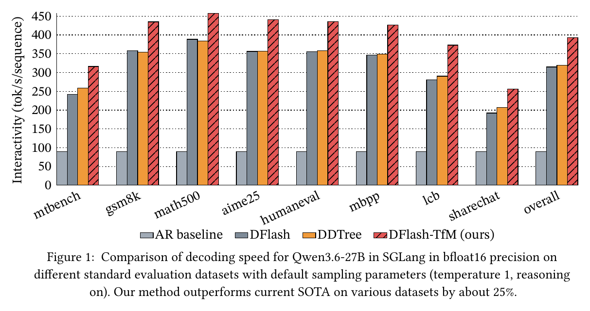
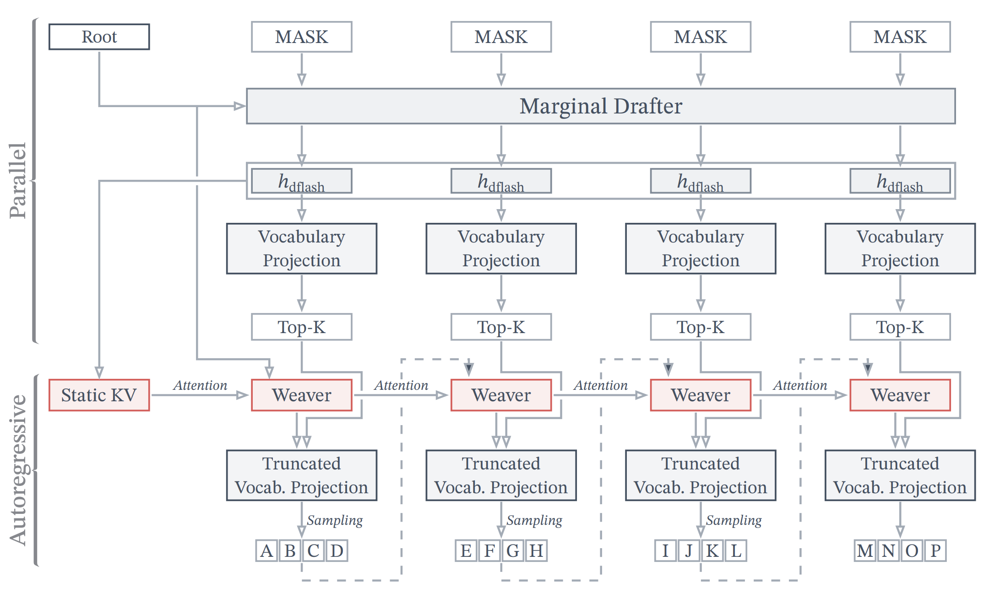
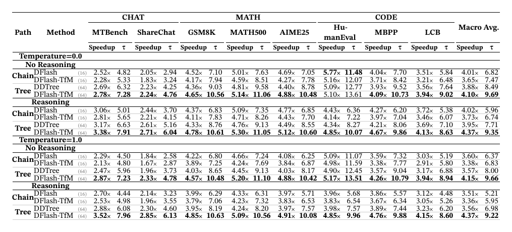

<h1>Trees from Marginals: DFlash-TfM</h1>

<a href="https://trymirai.com"></a>

<p>An implementation of DFlash-TfM, a tree-based speculative decoding method. A DFlash drafter produces factorized token marginals; Weaver, a lightweight autoregressive Transformer, expands them into a proposal tree; and fused, rollback-free kernels verify it against hybrid Gated Delta Net target models. On Qwen3.6-27B, DFlash-TfM reaches 392.8 tokens/s per sequence on a single B200: 4.37× over autoregressive decoding and 24.7% over tuned DFlash.</p>

<p>
  <a href="https://arxiv.org/abs/2607.06763"></a>
  <a href="https://huggingface.co/trymirai/weaver"></a>
</p>

<p align="center">
  
</p>

### Method

Weaver has 56.7M trainable parameters. At inference time, DFlash produces future-state lookaheads in one forward pass; Weaver conditions on the realized draft tokens and scores only the top-512 marginal candidates instead of projecting over the full vocabulary.

<p align="center">
  
</p>

### Results

We evaluate on Qwen3.6-27B over chat, math, and code workloads: MTBench, ShareChat, GSM8K, MATH500, AIME25, HumanEval, MBPP, and LiveCodeBench. All runs use BF16 precision on a single B200 with batch size 1, temperature 1.0, reasoning enabled, maximum output length 4096, and the server cache flushed between requests.

Throughput is computed as total generated tokens divided by wall-clock runtime, including prefill, scheduling, and decoding. Speedup is measured against autoregressive decoding under the same dataset, temperature, and reasoning setting. Macro Avg. is the unweighted average across datasets.

| Method | Setting | Throughput | Speedup |
| --- | --- | ---: | ---: |
| Autoregressive | BF16 target only | 89.9 tok/s/seq | 1.00x |
| DFlash | tuned chain baseline | 315.0 tok/s/seq | 3.50x |
| DFlash-TfM + Weaver | tree budget 64 | 392.8 tok/s/seq | 4.37x |

<p align="center">
  
</p>

DFlash-TfM with Weaver is the fastest configuration on every task in this sweep. The gap comes from acceptance: Weaver's trees lengthen the mean accepted draft by 77% relative to the chain DFlash baseline and by 32% relative to DDTree at the same tree size.

### Reproducing the headline number

To run it, you also need:

- the Qwen3.6-27B target model;
- the Qwen3.6-27B DFlash drafter;
- the Qwen3.6-27B [Weaver checkpoint](https://huggingface.co/trymirai/);

> See [`reproduction.sh`](./reproduction.sh) for the pinned reproduction commands.

#### 1. Install the SGLang fork

```bash
git clone https://github.com/trymirai/sglang
cd sglang
```

We recommend using the release container. The experiments were done with the CUDA 13 SGLang development image:

```bash
docker pull lmsysorg/sglang@sha256:1d8d7976fe11a8341408b92527200502e93dd69df0a63a81c57b92e70ec6fada

docker run -it --rm --shm-size 32g --gpus all \
  -v ~/.cache/huggingface:/root/.cache/huggingface \
  -v "$PWD":/sgl-workspace/sglang \
  -v "$PWD/artifacts":/artifacts \
  -w /sgl-workspace/sglang \
  -e PYTHONPATH=/sgl-workspace/sglang/python \
  --ipc=host --network=host --privileged \
  lmsysorg/sglang@sha256:1d8d7976fe11a8341408b92527200502e93dd69df0a63a81c57b92e70ec6fada \
  /bin/zsh
```

If you cannot use Docker, build from source instead:

```bash
python3 -m venv .venv
source .venv/bin/activate
python3 -m pip install -U pip
python3 -m pip install -e "python[all]"
```

The source build path expects Python 3.11, the CUDA 13 runtime expected by the package, `torch==2.11.0`, FlashInfer `0.6.12`, and the TensorRT-LLM / FA4 kernels installed by the tagged SGLang package.

#### 2. Select the model artifacts

```bash
export TARGET_MODEL=Qwen/Qwen3.6-27B
export TARGET_REV=6a9e13bd6fc8f0983b9b99948120bc37f49c13e9
export DFLASH_MODEL=z-lab/Qwen3.6-27B-DFlash
export DFLASH_REV=0919688658996800f86b895034249700e9481106
export WEAVER_REV=309ceb4b1a6c44e6a3dfaeab8db1547e904254f8
export WEAVER_CKPT=/artifacts/weaver/weaver/qwen36_27b_weaver.pth

hf download trymirai/weaver \
  weaver/qwen36_27b_weaver.pth \
  --revision "$WEAVER_REV" \
  --local-dir /artifacts/weaver
```

- The DFlash drafter checkpoint is `model.safetensors` from `z-lab/Qwen3.6-27B-DFlash` at revision `0919688658996800f86b895034249700e9481106`. Its SHA-256 is `e0c050b34798d32728a164d2c3f1681746ff85c11945701b0205b654e2f1fdbe`.
- The Weaver checkpoint is the `weaver/qwen36_27b_weaver.pth` file in this repository at the same release tag. Its SHA-256 is `71f540b143fb6bab14ba724c20e97a72ce198de103cfd228d31c3ce339227833`.

#### 3. Launch the three serving configurations

**Setup**
- Runtime: 1x NVIDIA B200 SXM, tensor parallel size 1, `concurrency=1`, `bfloat16`, CUDA graph max batch size 32, page size 64, radix cache disabled.
- Backends: TRT-LLM MHA decode attention, FlashInfer prefill attention, and FA4 draft attention unless specified.
- Acceptance length: `τ = completion_tokens / verify_steps per request` (bonus token included); reported values are the unweighted mean over requests, then over datasets for Macro Avg.
- Throughput: `total generated tokens / wall-clock time per dataset` (prefill and scheduling included; reasoning tokens counted). Macro Avg. averages the eight datasets unweighted.

**Autoregressive baseline:**

```bash
python3 -m sglang.launch_server \
  --model-path "$TARGET_MODEL" \
  --revision "$TARGET_REV" \
  --dtype bfloat16 \
  --tp-size 1 \
  --max-running-requests 1 \
  --cuda-graph-max-bs 32 \
  --mem-fraction-static 0.75 \
  --page-size 64 \
  --disable-radix-cache \
  --decode-attention-backend trtllm_mha \
  --prefill-attention-backend flashinfer \
  --host 127.0.0.1 \
  --port 30000
```

**DFlash baseline:**

> Note: DFlash uses `--attention-backend trtllm_mha` rather than split decode/prefill backends, because, in our experiments, the FlashInfer prefill reduced the DFlash acceptance length. This configuration gave the best DFlash tokens/step and throughput.

```bash
python3 -m sglang.launch_server \
  --model-path "$TARGET_MODEL" \
  --revision "$TARGET_REV" \
  --dtype bfloat16 \
  --tp-size 1 \
  --max-running-requests 1 \
  --cuda-graph-max-bs 32 \
  --mem-fraction-static 0.75 \
  --page-size 64 \
  --disable-radix-cache \
  --attention-backend trtllm_mha \
  --speculative-draft-attention-backend fa4 \
  --speculative-algorithm DFLASH \
  --speculative-draft-model-path "$DFLASH_MODEL" \
  --speculative-draft-model-revision "$DFLASH_REV" \
  --speculative-dflash-block-size 16 \
  --speculative-num-draft-tokens 16 \
  --host 127.0.0.1 \
  --port 30000
```

**DFlash-TfM with Weaver:**

```bash
python3 -m sglang.launch_server \
  --model-path "$TARGET_MODEL" \
  --revision "$TARGET_REV" \
  --dtype bfloat16 \
  --tp-size 1 \
  --max-running-requests 1 \
  --cuda-graph-max-bs 32 \
  --mem-fraction-static 0.75 \
  --page-size 64 \
  --disable-radix-cache \
  --decode-attention-backend trtllm_mha \
  --prefill-attention-backend flashinfer \
  --speculative-draft-attention-backend fa4 \
  --speculative-algorithm DFLASH_TFM \
  --speculative-draft-model-path "$DFLASH_MODEL" \
  --speculative-draft-model-revision "$DFLASH_REV" \
  --speculative-dflash-tfm-path "$WEAVER_CKPT" \
  --speculative-dflash-tfm-tree-budget 64 \
  --speculative-gdn-verify-kernel chunk \
  --disable-overlap-schedule \
  --host 127.0.0.1 \
  --port 30000
```

#### 4. Run the paper benchmark harness

Run the benchmark harness included with the DFlash-TfM SGLang fork against each server configuration. Use the same dataset list for all three runs; the macro table above is computed from the per-dataset throughputs printed by the harness.

```bash
python3 -m sglang.bench_dflash_tfm \
  --base-url http://127.0.0.1:30000 \
  --model "$TARGET_MODEL" \
  --datasets mtbench sharechat gsm8k math500 aime25 humaneval mbpp livecodebench \
  --temperature 1.0 \
  --reasoning on \
  --max-new-tokens 4096 \
  --concurrency 1 \
  --flush-cache-between-requests
```

Repeat this command once for the autoregressive server, once for the DFlash server, and once for the DFlash-TfM server. To print speedup rows, pass the per-dataset `tok/s/seq` values from the autoregressive run via `--baseline mtbench=... gsm8k=...`; without `--baseline` the speedup column prints `-`.

### Citation

If you find our work helpful, feel free to give us a cite.

```bibtex
@misc{dflash-tfm,
    title  = {{Trees from Marginals}: Autoregressive Drafting with Factorized Priors},
    author = {Yuma Oda and Ryan Mathieu and Roman Knyazhitskiy and Artur Chakhvadze},
    note   = {In collaboration with others at Mirai Labs},
    month  = {July},
    year   = {2026}
}
```

---

The following is the README of the original SGLang.

<div align="center" id="sglangtop">
</img>

[](https://pypi.org/project/sglang)

[](https://github.com/sgl-project/sglang/tree/main/LICENSE)
[](https://github.com/sgl-project/sglang/issues)
[](https://github.com/sgl-project/sglang/issues)
[](https://deepwiki.com/sgl-project/sglang)

</div>

--------------------------------------------------------------------------------

<p align="center">
<a href="https://lmsys.org/blog/"><b>Blog</b></a> |
<a href="https://docs.sglang.io/"><b>Documentation</b></a> |
<a href="https://roadmap.sglang.io/"><b>Roadmap</b></a> |
<a href="https://slack.sglang.io/"><b>Join Slack</b></a> |
<a href="https://meet.sglang.io/"><b>Weekly Dev Meeting</b></a> |
<a href="https://github.com/sgl-project/sgl-learning-materials?tab=readme-ov-file#slides"><b>Slides</b></a>
</p>

## News
- [2026/06] 🔥 The next generation of speculative decoding: DFlash and Spec V2 ([blog](https://lmsys.org/blog/2026-06-15-next-generation-speculative-decoding-dflash-v2/)).
- [2026/04] 🔥 DeepSeek-V4 on Day 0: From Fast Inference to Verified RL with SGLang and Miles ([blog](https://lmsys.org/blog/2026-04-25-deepseek-v4/)).
- [2026/06] SGLang provides day-0 support for latest open models ([Nemotron 3 Ultra](https://lmsys.org/blog/2026-06-04-nvidia-run-nemotron-3-ultra/), [Nemotron 3 Super](https://lmsys.org/blog/2026-03-11-run-nvidia-nemotron-3-super/), [Higgs Audio v3 TTS](https://lmsys.org/blog/2026-06-04-higgs-audio-v3-tts/)).
- [2026/02] 🔥 Unlocking 25x Inference Performance with SGLang on NVIDIA GB300 NVL72 ([blog](https://lmsys.org/blog/2026-02-20-gb300-inferencex/)).
- [2026/01] SGLang Diffusion accelerates video and image generation ([blog](https://lmsys.org/blog/2026-01-16-sglang-diffusion/)).
- [2025/12] SGLang provides day-0 support for latest open models ([MiMo-V2-Flash](https://lmsys.org/blog/2025-12-16-mimo-v2-flash/), [Nemotron 3 Nano](https://lmsys.org/blog/2025-12-15-run-nvidia-nemotron-3-nano/), [Mistral Large 3](https://github.com/sgl-project/sglang/pull/14213), [LLaDA 2.0 Diffusion LLM](https://lmsys.org/blog/2025-12-19-diffusion-llm/), [MiniMax M2](https://lmsys.org/blog/2025-11-04-miminmax-m2/)).
- [2025/10] SGLang now runs natively on TPU with the SGLang-Jax backend ([blog](https://lmsys.org/blog/2025-10-29-sglang-jax/)).

<details>
<summary>More</summary>

- [2025/09] Deploying DeepSeek on GB200 NVL72 with PD and Large Scale EP (Part II): 3.8x Prefill, 4.8x Decode Throughput ([blog](https://lmsys.org/blog/2025-09-25-gb200-part-2/)).
- [2025/09] SGLang Day 0 Support for DeepSeek-V3.2 with Sparse Attention ([blog](https://lmsys.org/blog/2025-09-29-deepseek-V32/)).
- [2025/08] SGLang x AMD SF Meetup on 8/22: Hands-on GPU workshop, tech talks by AMD/xAI/SGLang, and networking ([Roadmap](https://github.com/sgl-project/sgl-learning-materials/blob/main/slides/amd_meetup_sglang_roadmap.pdf), [Large-scale EP](https://github.com/sgl-project/sgl-learning-materials/blob/main/slides/amd_meetup_sglang_ep.pdf), [Highlights](https://github.com/sgl-project/sgl-learning-materials/blob/main/slides/amd_meetup_highlights.pdf), [AITER/MoRI](https://github.com/sgl-project/sgl-learning-materials/blob/main/slides/amd_meetup_aiter_mori.pdf), [Wave](https://github.com/sgl-project/sgl-learning-materials/blob/main/slides/amd_meetup_wave.pdf)).

- [2025/11] SGLang Diffusion accelerates video and image generation ([blog](https://lmsys.org/blog/2025-11-07-sglang-diffusion/)).
- [2025/10] PyTorch Conference 2025 SGLang Talk ([slide](https://github.com/sgl-project/sgl-learning-materials/blob/main/slides/sglang_pytorch_2025.pdf)).
- [2025/10] SGLang x Nvidia SF Meetup on 10/2 ([recap](https://x.com/lmsysorg/status/1975339501934510231)).
- [2025/08] SGLang provides day-0 support for OpenAI gpt-oss model ([instructions](https://github.com/sgl-project/sglang/issues/8833))
- [2025/06] SGLang, the high-performance serving infrastructure powering trillions of tokens daily, has been awarded the third batch of the Open Source AI Grant by a16z ([a16z blog](https://a16z.com/advancing-open-source-ai-through-benchmarks-and-bold-experimentation/)).
- [2025/05] Deploying DeepSeek with PD Disaggregation and Large-scale Expert Parallelism on 96 H100 GPUs ([blog](https://lmsys.org/blog/2025-05-05-large-scale-ep/)).
- [2025/06] Deploying DeepSeek on GB200 NVL72 with PD and Large Scale EP (Part I): 2.7x Higher Decoding Throughput ([blog](https://lmsys.org/blog/2025-06-16-gb200-part-1/)).
- [2025/03] Supercharge DeepSeek-R1 Inference on AMD Instinct MI300X ([AMD blog](https://rocm.blogs.amd.com/artificial-intelligence/DeepSeekR1-Part2/README.html))
- [2025/03] SGLang Joins PyTorch Ecosystem: Efficient LLM Serving Engine ([PyTorch blog](https://pytorch.org/blog/sglang-joins-pytorch/))
- [2025/02] Unlock DeepSeek-R1 Inference Performance on AMD Instinct™ MI300X GPU ([AMD blog](https://rocm.blogs.amd.com/artificial-intelligence/DeepSeekR1_Perf/README.html))
- [2025/01] SGLang provides day one support for DeepSeek V3/R1 models on NVIDIA and AMD GPUs with DeepSeek-specific optimizations. ([instructions](https://github.com/sgl-project/sglang/tree/main/benchmark/deepseek_v3), [AMD blog](https://www.amd.com/en/developer/resources/technical-articles/amd-instinct-gpus-power-deepseek-v3-revolutionizing-ai-development-with-sglang.html), [10+ other companies](https://x.com/lmsysorg/status/1887262321636221412))
- [2024/12] v0.4 Release: Zero-Overhead Batch Scheduler, Cache-Aware Load Balancer, Faster Structured Outputs ([blog](https://lmsys.org/blog/2024-12-04-sglang-v0-4/)).
- [2024/10] The First SGLang Online Meetup ([slides](https://github.com/sgl-project/sgl-learning-materials?tab=readme-ov-file#the-first-sglang-online-meetup)).
- [2024/09] v0.3 Release: 7x Faster DeepSeek MLA, 1.5x Faster torch.compile, Multi-Image/Video LLaVA-OneVision ([blog](https://lmsys.org/blog/2024-09-04-sglang-v0-3/)).
- [2024/07] v0.2 Release: Faster Llama3 Serving with SGLang Runtime (vs. TensorRT-LLM, vLLM) ([blog](https://lmsys.org/blog/2024-07-25-sglang-llama3/)).
- [2024/02] SGLang enables **3x faster JSON decoding** with compressed finite state machine ([blog](https://lmsys.org/blog/2024-02-05-compressed-fsm/)).
- [2024/01] SGLang provides up to **5x faster inference** with RadixAttention ([blog](https://lmsys.org/blog/2024-01-17-sglang/)).
- [2024/01] SGLang powers the serving of the official **LLaVA v1.6** release demo ([usage](https://github.com/haotian-liu/LLaVA?tab=readme-ov-file#demo)).

</details>

## About
SGLang is a high-performance serving framework for large language models and multimodal models.
It is designed to deliver low-latency and high-throughput inference across a wide range of setups, from a single GPU to large distributed clusters.
Its core features include:

- **Fast Runtime**: Provides efficient serving with RadixAttention for prefix caching, a zero-overhead CPU scheduler, prefill-decode disaggregation, speculative decoding, continuous batching, paged attention, tensor/pipeline/expert/data parallelism, structured outputs, chunked prefill, quantization (FP4/FP8/INT4/AWQ/GPTQ), and multi-LoRA batching.
- **Broad Model Support**: Supports a wide range of language models (Llama, Qwen, DeepSeek, Kimi, GLM, GPT, Gemma, Mistral, etc.), embedding models (e5-mistral, gte, mcdse), reward models (Skywork), and diffusion models (WAN, Qwen-Image), with easy extensibility for adding new models. Compatible with most Hugging Face models and OpenAI APIs.
- **Extensive Hardware Support**: Runs on NVIDIA GPUs (GB200/B300/H100/A100/Spark/5090), AMD GPUs (MI355/MI300), Intel Xeon CPUs, Google TPUs, Ascend NPUs, and more.
- **Active Community**: SGLang is open-source and supported by a vibrant community with widespread industry adoption, powering over 400,000 GPUs worldwide.
- **RL & Post-Training Backbone**: SGLang is a proven rollout backend used for training many frontier models, with native RL integrations and adoption by well-known post-training frameworks such as [**AReaL**](https://github.com/inclusionAI/AReaL), [**Miles**](https://github.com/radixark/miles), [**slime**](https://github.com/THUDM/slime), [**Tunix**](https://github.com/google/tunix), [**verl**](https://github.com/volcengine/verl) and more.

## Getting Started
- [Install SGLang](https://docs.sglang.io/get_started/install.html)
- [Quick Start](https://docs.sglang.io/basic_usage/send_request.html)
- [Backend Tutorial](https://docs.sglang.io/basic_usage/openai_api_completions.html)
- [Frontend Tutorial](https://docs.sglang.io/references/frontend/frontend_tutorial.html)
- [Contribution Guide](https://docs.sglang.io/developer_guide/contribution_guide.html)

## Benchmark and Performance
Learn more in the release blogs: [v0.2 blog](https://lmsys.org/blog/2024-07-25-sglang-llama3/), [v0.3 blog](https://lmsys.org/blog/2024-09-04-sglang-v0-3/), [v0.4 blog](https://lmsys.org/blog/2024-12-04-sglang-v0-4/), [Large-scale expert parallelism](https://lmsys.org/blog/2025-05-05-large-scale-ep/), [GB200 rack-scale parallelism](https://lmsys.org/blog/2025-09-25-gb200-part-2/), [GB300 long context](https://lmsys.org/blog/2026-02-19-gb300-longctx/).

## Adoption and Sponsorship
SGLang has been deployed at large scale, generating trillions of tokens in production each day. It is trusted and adopted by a wide range of leading enterprises and institutions, including xAI, AMD, NVIDIA, Intel, LinkedIn, Cursor, Oracle Cloud, Google Cloud, Microsoft Azure, AWS, Atlas Cloud, Voltage Park, Nebius, DataCrunch, Novita, InnoMatrix, Modal, MIT, UCLA, the University of Washington, Stanford, UC Berkeley, Tsinghua University, Jam & Tea Studios, Baseten, and other major technology organizations.
As an open-source LLM inference engine, SGLang has become the de facto industry standard, with deployments running on over 400,000 GPUs worldwide.
SGLang is currently hosted under the non-profit open-source organization [LMSYS](https://lmsys.org/about/).

</img>

## Contact Us
For enterprises interested in adopting or deploying SGLang at scale, including technical consulting, sponsorship opportunities, or partnership inquiries, please contact us at [sglang@lmsys.org](mailto:sglang@lmsys.org).

Long-term active SGLang contributors are eligible for coding agent sponsorship, such as Cursor, Claude Code, or OpenAI Codex. Email [sglang@lmsys.org](mailto:sglang@lmsys.org) with your most important commits or pull requests.

## Acknowledgment
We learned the design and reused code from the following projects: [Guidance](https://github.com/guidance-ai/guidance), [vLLM](https://github.com/vllm-project/vllm), [LightLLM](https://github.com/ModelTC/lightllm), [FlashInfer](https://github.com/flashinfer-ai/flashinfer), [Outlines](https://github.com/outlines-dev/outlines), and [LMQL](https://github.com/eth-sri/lmql).
