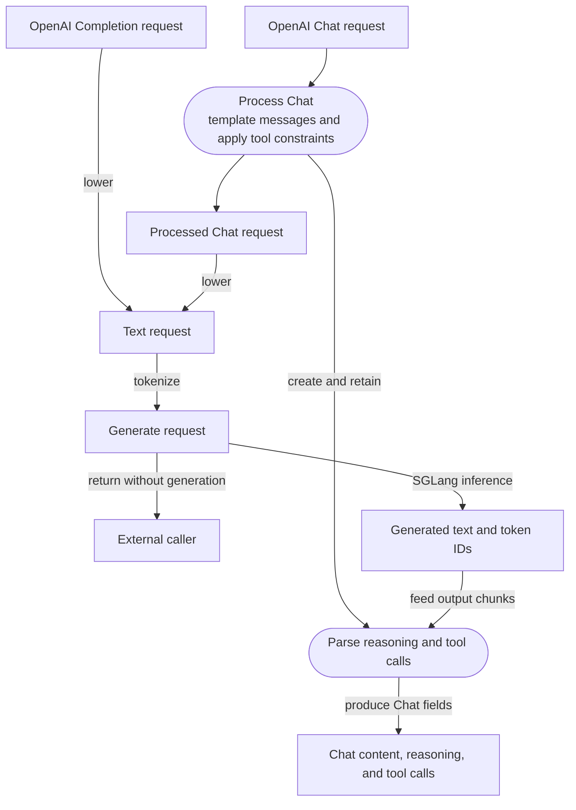

# Proposal: Share Rust request rendering

## Problems

- Duplicated HTTP, gRPC, and inference lowering can produce different requests.
- KV routing needs the same token IDs, cache salt, and multimodal hashes as
  inference.
- Reasoning and tool parsing must keep state across output chunks.

## Proposed boundary

Chat first goes through Chat-only processing, which applies the template and
tool constraints. The processed Chat request and the Completion request then
enter `OpenAIRequestProcessor`, which lowers either one to the same text request.
Both paths then share tokenization.

Tokenization produces a generate request with required token IDs. Full
inference generates output from it; the renderer service returns it without
running generation.

Generation options include maximum output tokens, stop rules, temperature,
top-p, penalties, and seed.

Chat processing also creates a response processor. Full Chat inference retains it
while the prepared request is generated, then feeds generated chunks to it to
parse reasoning and tool calls. Completion does not create or use one.

## Proposed contracts

| Boundary | Rust contract |
| --- | --- |
| OpenAI lowering | `OpenAIRequestProcessor` |
| Text or token-ID prompt plus generation options | `TextRequest` |
| Prepared request with required `input_ids` | `PreparedGenerateRequest` |
| Generated chunks to content, reasoning, and tool calls | `ChatResponseProcessor` |
