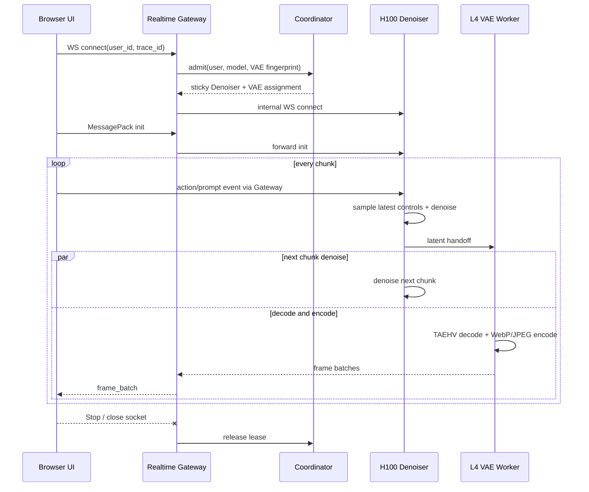

# MinWM Realtime 后端接口说明

本文面向实现自定义 UI 的客户端开发者，描述当前 `codex/minwm-async-vae-multiuser` 分支的公网协议。示例中的域名用 `REALTIME_ORIGIN` 表示；生产环境应使用 HTTPS/WSS。

## 1. 接口总览

| 方法 | 路径 | 用途 |
| --- | --- | --- |
| `GET` | `/healthz` | Gateway 进程存活检查 |
| `GET` | `/readyz` | Gateway 与 Coordinator 就绪检查 |
| `GET` | `/v1/models` | 查询当前部署的模型 revision |
| `WS` | `/v1/realtime_video/generate` | 初始化会话、发送控制事件、接收视频帧与必要控制消息 |
| `GET` | `/v1/realtime_video/traces/{trace_id}` | 按需查询最近 5 分钟 CloudWatch Trace 阶段聚合与增量事件 |
| `POST` | `/v1/realtime_video/traces/{trace_id}/client-events` | 批量上报浏览器端 Trace 事件 |
| `GET` | `/runtime-config.js` | WebUI 运行时配置；自定义 UI 通常不需要 |

公网 UI 只应调用上述接口。`/v1/internal/realtime_output`、`/v1/realtime_vae/decode`、`/v1/workers/*` 和 `/v1/sessions/*` 是集群内部接口，不属于客户端协议。

### 1.1 集群内部控制接口

这些接口只暴露在 ClusterIP/Pod 网络中，由 Gateway、Coordinator、GPU Worker 和容量控制器调用。UI 和业务客户端不得直接依赖它们。

| 服务 | 方法与路径 | 用途 |
| --- | --- | --- |
| Coordinator | `POST /v1/workers/heartbeat` | 上报 Worker epoch、生命周期、活动/排队会话与服务时间 |
| Coordinator | `POST /v1/sessions/admit` | 原子申请粘性 Denoiser + VAE 配对与有界等待 |
| Coordinator | `POST /v1/sessions/renew` | 续租并校验 Worker epoch，防止旧 Worker/旧 Lease 继续运行 |
| Coordinator | `DELETE /v1/sessions/release` | 按 owner/token 释放会话与两个 Worker reservation |
| Coordinator | `GET /v1/capacity` | 返回两个角色的 waiting/active/queued/free/draining 聚合，供事件扩容器使用 |
| GPU Worker | `POST /v1/realtime_worker/reserve` | 预留带 TTL 的有界会话槽 |
| GPU Worker | `POST /v1/realtime_worker/consume` | 首次连接消费 reservation；token 不可重放 |
| GPU Worker | `POST /v1/realtime_worker/release` | 仅 reservation owner 可释放已消费槽 |
| GPU Worker | `POST /v1/realtime_worker/drain` | 停止新准入，等待在途 Session 后退出 |
| GPU Worker | `GET /v1/realtime_worker/state` | 返回 epoch、生命周期和本地负载，用于 heartbeat 与故障判定 |

Coordinator 的 Session/Worker 元数据使用 DynamoDB TTL 保存；GPU KV、latent history 和 TAEHV context 只保存在绑定 Worker 本地。Worker epoch 变化或 heartbeat 过期后，旧 Lease 的续租会失败，客户端建立新会话重试。

## 2. 传输与身份

### 2.1 编码

- WebSocket 的客户端请求、控制事件和服务端控制消息均使用 **MessagePack 二进制帧**。
- 服务端不会在视频 WebSocket 中发送 Trace 数据；Trace 使用独立 HTTP 接口。
- 大体积媒体采用“一个 MessagePack header + 紧随其后的一个原始二进制 payload”，小体积媒体采用一个包含 `payload` 字段的 MessagePack 消息。
- 建议浏览器使用 `@msgpack/msgpack`，并设置 WebSocket `binaryType = "arraybuffer"`。

### 2.2 用户身份和粘性

连接时按以下优先级确定用户身份：

1. 查询参数 `user_id`；
2. 请求头 `x-user-id`；
3. 客户端 IP。

推荐使用业务侧不可变用户 ID：

```text
wss://REALTIME_ORIGIN/v1/realtime_video/generate?user_id=user-123&trace_id=trace-abc
```

同一个 `user_id` 同时只能拥有一个活动分配。每个会话由 Coordinator 分配一个 Denoiser Worker 和一个 VAE Worker，并在会话生命周期内保持粘性。

### 2.3 Trace ID

- 推荐由客户端生成 1 到 128 字符的 `trace_id`，字符集限字母、数字、`_ . : -`。
- 同一个值同时放入 WebSocket 查询参数和 init 消息的 `trace_id`。
- 不传时 Gateway 会生成会话 ID 作为 Trace ID。

## 3. 会话生命周期



客户端必须先建立 WebSocket，再发送且只发送一个有效 init。之后可持续发送事件。有限 T2V 生成完成后服务端以 code `1000`、reason `generation complete` 正常关闭；连续生成由客户端主动关闭。

## 4. 初始化消息

### 4.1 通用字段

| 字段 | 类型 | 必填 | 说明 |
| --- | --- | --- | --- |
| `type` | string | 是 | 固定为 `init` |
| `generation_mode` | `i2v` / `t2v` | 建议 | 省略时按 `first_frame` 是否存在推断 |
| `model` | string | 建议 | 模型名；实际 revision 由部署固定，可先通过 `/v1/models` 查询 |
| `prompt` | string | 是 | 初始 prompt |
| `size` | string | 建议 | 当前验证规格为 `832x480` |
| `fps` | int | 建议 | 客户端目标播放帧率，不会直接令模型计算加速 |
| `seed` | int | 否 | 默认 42 |
| `num_inference_steps` | int | 建议 | MinWM DMD 必须为 4 |
| `guidance_scale` | number | 建议 | MinWM 会归一化为 0，客户端建议直接传 0 |
| `first_frame` | bytes / string | I2V 必填 | 图片二进制、HTTP(S) URL 或 `data:image/...` URL |
| `num_frames` | int | 有限 T2V | 必须满足 `1 + N * 4`；连续 T2V 必须省略 |
| `max_chunks` | int >= 1 | 否 | 有限 T2V 建议省略并让服务端从 `num_frames` 推导；连续模式必须省略 |
| `condition_inputs` | object | 否 | 初始 action、chunk seed 和 prompt schedule |
| `realtime_output_format` | `raw` / `webp` / `jpeg` | 建议 | 浏览器推荐 `webp` |
| `realtime_preview_max_width` | int | 否 | 预览缩放最大宽度，例如 560；省略则使用输出尺寸 |
| `realtime_output_pacing` | bool | 建议 | 低延迟 UI 建议 `false` |
| `output_compression` | int | 否 | WebP/JPEG quality；当前低延迟配置使用 55 |
| `realtime_causal_sink_size` | int | 否 | 因果 KV sink 帧数，通常沿用服务默认值 |
| `realtime_causal_kv_cache_num_frames` | int | 否 | 因果 KV 窗口，通常沿用服务默认值 |
| `trace_id` | string | 建议 | 与 URL 查询参数一致 |

服务端 Pydantic 模型允许额外字段，但自定义 UI 不应依赖未在本文声明的字段。

### 4.2 连续 T2V

连续 T2V **不要发送** `num_frames` 和 `max_chunks`：

```js
const init = {
  type: "init",
  generation_mode: "t2v",
  model: "wan22-5b-stage3-dmd-30-gs1800",
  prompt: "A smooth forward camera move through a mountain valley",
  size: "832x480",
  fps: 24,
  seed: 42,
  num_inference_steps: 4,
  guidance_scale: 0,
  realtime_output_format: "webp",
  realtime_preview_max_width: 560,
  realtime_output_pacing: false,
  output_compression: 55,
  trace_id: traceId,
};
socket.send(encode(init));
```

### 4.3 有限 T2V

例如 121 帧：

```js
socket.send(encode({
  ...init,
  generation_mode: "t2v",
  num_frames: 121,
}));
```

121 帧生成完毕后服务端正常关闭，这不是异常。不要同时传一个不匹配的 `max_chunks`。

### 4.4 I2V

```js
socket.send(encode({
  ...init,
  generation_mode: "i2v",
  first_frame: new Uint8Array(await imageFile.arrayBuffer()),
}));
```

约束：

- `i2v` 缺少 `first_frame` 会收到 `invalid generate request`。
- `t2v` 携带 `first_frame` 同样无效。
- 图片 URL 由服务端预取，生产 UI 更推荐直接发送已校验大小的图片 bytes，避免外部 URL 可用性影响首帧时间。

### 4.5 初始化 condition_inputs

```js
condition_inputs: {
  camera_actions: [["w"], ["w", "a"], []],
  chunk_seeds: [101, 102, 103],
  minwm_prompt_schedule: [
    { target_chunk: 3, kind: "prompt", prompt: "Turn into a snowy valley" },
    { target_chunk: 6, kind: "scene_cut", prompt: "A sunset ocean scene" },
  ],
}
```

初始 action 只允许三选一：`camera_actions`、`action_labels`、`action_weights`。`chunk_seeds` 在有限会话中长度必须等于 `max_chunks`；schedule 的 `target_chunk` 从 1 开始且必须在有限会话范围内。

## 5. 动态事件

统一消息结构：

```js
{
  type: "event",
  kind: "camera_actions",
  event_id: 42,
  trace_id: traceId,
  client_sent_perf_ms: performance.now(),
  client_sent_epoch_ms: Date.now(),
  payload: ...,
}
```

`event_id` 应在一个连接内严格递增。服务端在每个 chunk 上采样已收到的最新控制，并把实际采用的 `event_id` 放入 `frame_batch`，UI 可据此对齐“用户输入”和“模型实际采用”。阶段耗时不通过视频 WebSocket 返回。

### 5.1 摄像机按键：状态模式

实时 UI 推荐状态模式。按住 W：

```js
socket.send(encode({
  type: "event",
  kind: "camera_actions",
  event_id: 1,
  client_sent_epoch_ms: Date.now(),
  payload: {
    mode: "state",
    transitions: [{ actions: ["w"], client_ts_ms: Date.now() }],
  },
}));
```

松开所有键：

```js
socket.send(encode({
  type: "event",
  kind: "camera_actions",
  event_id: 2,
  client_sent_epoch_ms: Date.now(),
  payload: {
    mode: "state",
    transitions: [{ actions: [], client_ts_ms: Date.now() }],
  },
}));
```

状态是电平触发的：一直按住时不需要不断重发，最后一个非空状态会跨 chunk 保持，直到收到新的 transition。UI 应在 keydown/keyup 后发送当前完整按键集合，并在窗口失焦、页面隐藏或 Stop 时补发空集合，避免“粘键”。

有效键：

| 动作 | 键 |
| --- | --- |
| 前 / 左 / 后 / 右 | `w` / `a` / `s` / `d` |
| Pitch+ / Yaw- / Pitch- / Yaw+ | `i` / `j` / `k` / `l` |
| 方向键别名 | `up` / `left` / `down` / `right` |

同一状态最多包含一个前后方向、一个横移方向、一个 pitch 和一个 yaw；例如 `["w", "a", "i", "j"]` 合法，`["w", "s"]` 非法。

### 5.2 摄像机按键：脚本模式

离线回放可直接发送逐帧脚本：

```js
{
  type: "event",
  kind: "camera_actions",
  event_id: 10,
  payload: [["w"], ["w"], ["w", "a"], []],
}
```

脚本按顺序消费，耗尽后补 no-op。新的状态事件会清空脚本，新的脚本会清空状态，二者不会合并。

### 5.3 动态 prompt 与 scene cut

```js
socket.send(encode({
  type: "event",
  kind: "prompt",
  event_id: 11,
  payload: "Continue forward into a bright snowy forest",
}));
```

`kind: "prompt"` 在下一个可用 chunk 边界更新条件；`kind: "scene_cut"` 表示显式场景切换。服务端只保留尚未消费的最新 condition switch，因此快速连续多次更新时以最新输入为准。

### 5.4 原生 action

- `kind: "action_labels"`：`payload` 为 `list[int]`，每个值范围 `[0, 80]`。
- `kind: "action_weights"`：`payload` 为逐输出帧的二维数组，每行固定 8 个 `[0,1]` 数值，顺序为 `[w,a,s,d,i,j,k,l]`。

收到任一原生 action 后，会话切换到对应模式并清空其他 action 队列。

### 5.5 Seed

```js
{ type: "event", kind: "seed", event_id: 20, payload: 12345 }
{ type: "event", kind: "chunk_seeds", event_id: 21, payload: [12345, 12346] }
```

Seed 必须是 `[0, 2^63)` 内的整数。

### 5.6 Heartbeat

```js
{ type: "event", kind: "heartbeat", event_id: 100, trace_id: traceId }
```

Heartbeat 只刷新会话活跃时间，不进入模型控制队列。建议空闲 UI 每 10 到 20 秒发送一次。

## 6. 服务端 WebSocket 消息

### 6.1 小 payload：frame_batch

```js
{
  type: "frame_batch",
  request_id: "...",
  trace_id: "...",
  chunk_index: 12,
  event_id: 42,
  content_type: "image/webp",
  num_frames: 8,
  total_size: 123456,
  frame_batch_index: 0,
  num_frame_batches: 2,
  is_final_frame_batch: false,
  width: 560,
  height: 323,
  source_width: 832,
  source_height: 480,
  payload_lengths: [15000, 15100, ...],
  payload: Uint8Array,
}
```

WebP/JPEG 的 `payload` 是多张独立图片简单拼接，必须按 `payload_lengths` 切片后逐张解码。不要把整段 payload 当成一张图片。

### 6.2 大 payload：frame_batch_header + raw payload

第一条消息为 MessagePack `frame_batch_header`，字段与上面相同但没有 `payload`；下一条 WebSocket 二进制消息就是对应 payload。客户端收到 header 后必须进入 `awaitingPayload` 状态，禁止把下一条 raw bytes 再做 MessagePack 解码。

内容类型：

| `content_type` | 解码方式 |
| --- | --- |
| `image/webp` | 按 `payload_lengths` 切片后 `createImageBitmap` / WebCodecs |
| `image/jpeg` | 同上 |
| `application/x-raw-rgb` | RGB24，按 `width * height * 3` 切帧 |

`frame_batch_index` 在一个 chunk 内从 0 递增；收到 `is_final_frame_batch=true` 才表示该 chunk 的媒体已发完。

### 6.3 Trace 与媒体链路隔离

视频 WebSocket 不发送 `trace_event`、`trace_events`、Trace 查询响应或 `chunk_stats` 耗时明细。客户端只需从 URL/init 的 `trace_id`、媒体消息的 `trace_id`、`session_id`、`chunk_index` 和 `event_id` 建立关联；诊断数据通过第 7 节 REST 接口按需查询。

这项约束避免 CloudWatch 查询、Trace 序列化或 UI 诊断刷新对视频传输形成反压。自定义 UI 不应等待 Trace 接口后再解码或播放视频。

### 6.4 error

```js
{ type: "error", content: "invalid generate request" }
```

- init 无效时服务端发送 error 后继续等待另一个有效 init。
- event 无效时发送 `invalid event`，连接继续存在。
- 容量不足时发送带 `reason=CAPACITY_EXHAUSTED`、`retry_after_s` 的 error，随后以可重试
  code `1013` 关闭；用户配额或协议错误使用 code `1008`。
- Gateway/Worker 内部错误通常以 code `1011` 关闭。

## 7. Trace HTTP API

### 7.1 查询

```http
GET /v1/realtime_video/traces/trace-abc?after=0&limit=220
```

响应：

```json
{
  "trace_id": "trace-abc",
  "stale": false,
  "observed_at": "2026-08-06T04:00:00Z",
  "window": {
    "seconds": 300,
    "start_epoch_ms": 1785988500000,
    "end_epoch_ms": 1785988800000
  },
  "stages": [
    {
      "id": "denoise",
      "title": "Denoising",
      "count": 18,
      "avg_ms": 372.4,
      "p50_ms": 368.1,
      "p95_ms": 401.7,
      "max_ms": 417.2
    }
  ],
  "events": [
    {
      "event": "server.model_denoise_complete",
      "trace_seq": 123,
      "chunk_index": 4,
      "cuda_ms": 364.2
    }
  ],
  "next_cursor": 123,
  "window_s": 300
}
```

- `after`：只返回 `trace_seq > after` 的事件。
- `limit`：1 到 500，默认 220。
- `stages`：固定返回 Browser、Gateway、Realtime API、Scheduler、VAE Encode、Denoising、VAE Decode、Transport、Frontend；当前窗口没有可用样本的阶段 `count=0`，其余统计字段为 `null`。
- `window`：聚合窗口，当前固定为最近 300 秒；`observed_at` 是这份有效聚合的观测时间。
- `stale=false` 表示本轮查询得到有效聚合。CloudWatch 暂无新结果或发生短暂查询失败时，服务端返回上一次有效聚合并标记 `stale=true`、`stale_reason=no_results|query_failed`，不会把已有阶段值清空。
- 查询面是 CloudWatch，存在秒级最终一致性；不要在视频渲染热路径同步等待它。
- 服务端对相同 Trace/窗口启用 15 秒缓存和 in-flight 去重，并限制同时执行的 CloudWatch 查询数；客户端无需高频轮询。
- 当前查询窗口是最近 5 分钟，日志保留期由 CloudWatch 配置为 5 天；若要查询更老数据应由运维/分析服务直接查日志组。

WebUI 只在用户打开 Trace 页时每 5 秒轮询；切回 Preview 后立即停止。浏览器自身网络错误时同样继续展示上一次有效聚合，并标记为 stale。

### 7.2 上报客户端事件

```http
POST /v1/realtime_video/traces/trace-abc/client-events
Content-Type: application/json

{
  "events": [
    {
      "name": "client.chunk_first_rendered",
      "seq": 1,
      "chunk_index": 4,
      "event_id": 42,
      "client_epoch_ms": 1780000000000,
      "display_lag_ms": 5.2
    }
  ]
}
```

单次最多 64 项，响应为 `{"accepted": 1}`。建议浏览器本地批量并异步上报，失败时丢弃诊断事件，不要阻塞媒体播放。

## 8. HTTP 状态与重试

| 场景 | HTTP / WS 结果 | 客户端策略 |
| --- | --- | --- |
| `/healthz` 正常 | 200 | 只表示进程存活 |
| `/readyz` Coordinator 不可用 | 503 | 指数退避 |
| Trace 未配置，或首次查询失败且没有可回退结果 | 503 | 不影响视频；稍后重试 |
| Trace 查询短暂失败且已有结果 | 200 + `stale=true` | 保留现有数值，后台继续轮询 |
| Trace ID 非法 | 400 | 修正客户端 ID |
| 准入容量耗尽/等待队列满 | WS error + close 1013 | 优先采用 `retry_after_s`，并增加抖动后建立新连接 |
| 有限生成完成 | close 1000 | 正常完成，不重连 |
| 服务器故障 | close 1011 | 新建会话重试；旧节点 KV 状态不保证恢复 |

## 9. 最小浏览器接入骨架

```js
import { encode, decode } from "@msgpack/msgpack";

const ws = new WebSocket(
  `wss://${origin}/v1/realtime_video/generate?user_id=${encodeURIComponent(userId)}&trace_id=${traceId}`,
);
ws.binaryType = "arraybuffer";

let pendingHeader = null;
ws.onopen = () => ws.send(encode(init));
ws.onmessage = async ({ data }) => {
  const bytes = new Uint8Array(data);
  if (pendingHeader) {
    consumePayload(pendingHeader, bytes);
    pendingHeader = null;
    return;
  }
  const message = decode(bytes);
  if (message.type === "frame_batch_header") {
    pendingHeader = message;
  } else if (message.type === "frame_batch") {
    consumePayload(message, message.payload);
  } else if (message.type === "error") {
    showError(message.content);
  }
};
```

实现播放器时建议：

1. 每个 chunk 内按 `frame_batch_index` 排序，按帧顺序进入有界队列。
2. 第一批数据到达即可播放，不等待完整 chunk。
3. 队列积压时丢弃过期帧，优先追上最新 action 对应的 `event_id`。
4. 在主线程之外解码图片，使用 `ImageBitmap` 或 WebCodecs，绘制后及时 `close()`。
5. 页面失焦时发送空按键状态；Stop 时先清空按键，再关闭 WebSocket。
6. Trace 页单独调用 REST 查询；Preview/媒体播放热路径不要轮询 CloudWatch。

## 10. 当前部署能力边界

- 每个 Denoiser Pod 使用 1 张 H100 并声明 4 个 reservation slot；8 个 Pod（8 张 H100）的 Denoiser 侧硬上限为 32。
- 当前单个 L4 VAE Worker 声明 16 个 reservation slot，因此一组 8×H100 + 1×L4 的完整链路硬准入上限为 16。这个数字只是内存/状态配额，不等于满足 SLO 的稳定并发，最终值以本轮压测报告为准。
- 超出上限不会无限排队，而是明确返回 `CAPACITY_EXHAUSTED`。
- 业务扩容时应同时按 Denoiser 和 VAE 的较小容量扩容，不能只增加 H100。
- 会话状态和因果 KV 位于被分配的 Denoiser 内存/GPU 上；节点故障后客户端应建立新会话重试。
