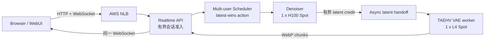
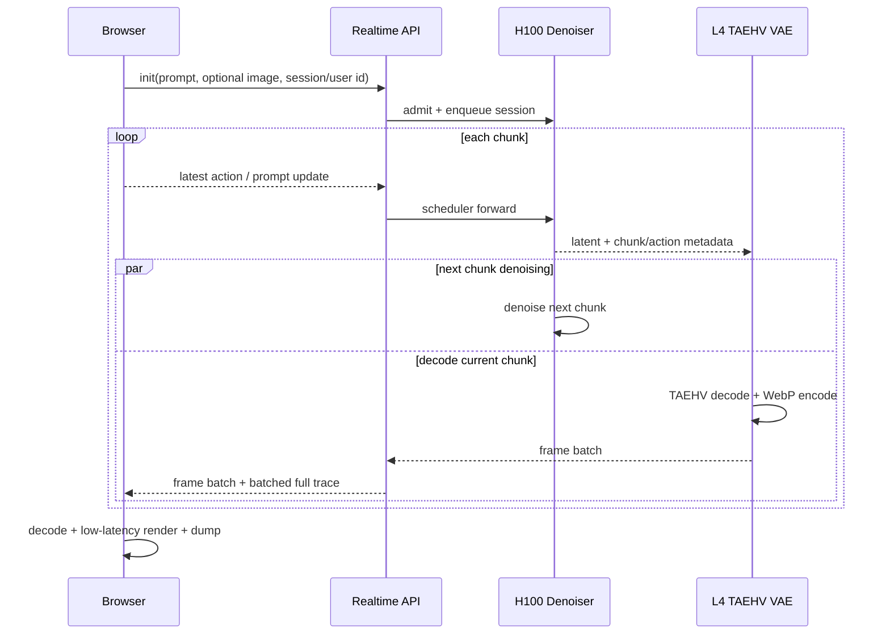

# MinWM 多用户与异步 VAE 端到端测试报告

## 测试结论

- 最终分支：`codex/minwm-async-vae-multiuser`
- A/B 压测代码：`633bb97e0fe002ccbe9c9317d71f21fd052278cd`
- 最终端到端代码：`5faecf80c2eea94595568f94b4a0f5f9fbbd3c1e`
- Denoiser 固定使用 `1 x NVIDIA H100 80GB` Spot；异步 VAE 使用 `1 x NVIDIA L4 24GB` Spot。
- 零错误压测容量为 4 个并发会话；按 `action P95 < 1s`、单会话 `>=16 FPS`、错误率为 0 的交互 SLO，单个 H100 实例建议严格配额为 2 个并发会话。
- 8 并发时同步和异步方案都出现 1/8 CUDA OOM，因此生产默认不能把单 H100 配额设为 8。
- 异步 VAE 在 2/4 并发时将 action P95 分别降低 6.83%/5.34%，chunk P95 分别降低 1.58%/2.75%。
- 单用户时低成本 L4 的 decode 比 H100 慢，action P95 由 472.4ms 增至 499.6ms；异步重叠仍使 chunk P95 降低 1.25%、吞吐提升 1.96%。这是成本与单用户尾延迟之间的明确权衡。
- 公网 NLB 浏览器验证通过：T2V、持续按键、后端 action 采样、WebP 播放、Trace 稳态显示及 WebM/JSON/HTML dump 均正常。

## 服务拓扑

每个用户拥有独立的 `session_id`、generation 状态、KV/latent 状态和 action 序号。准入层限制活跃会话数；latent handoff 使用 credit 和有界队列施加背压，不会因流量增长而无限缓存。action 更新采用 latest-wins 合并，并在下一个可取消的 chunk 边界生效。

## 请求流程

## 硬件与配置

| Profile | Denoiser | VAE | 实例 | GPU 实际占用 | 容量类型 |
|---|---|---|---|---:|---|
| 同步基线 | H100 80GB | 本地 H100 TAEHV `taew2_2.pth` | `p5.48xlarge` | 1 | Spot |
| 异步方案 | H100 80GB | 远端 L4 TAEHV `taew2_2.pth` | `p5.48xlarge` + `g6.2xlarge` | 1 + 1 | Spot |

`p5.48xlarge` 物理节点有 8 张 H100，但本次 Denoiser Pod 仅申请并使用 1 张。H100 与 B200 Spot 候选同时检查，H100 先成功调度，B200 候选立即释放；本次没有占用 B200 或 B300 Capacity Block。

模型为 832x480 MinWM checkpoint，压测使用 24 FPS、4 steps、3 个 warmup chunk 和 6 个统计 chunk。异步 VAE 队列有界，实时会话上限配置为 8，但根据压测结果建议生产硬限制调整为 4，交互流量目标配额为 2/H100。

## 并发压测

| 模式 | 并发 | 成功会话 | Action 到首帧 P95 | Chunk P95 | 最低单会话 FPS | 集群 FPS | 错误率 |
|---|---:|---:|---:|---:|---:|---:|---:|
| 同步 | 1 | 1/1 | 472.4ms | 481ms | 39.03 | 39.03 | 0% |
| 同步 | 2 | 2/2 | 940.4ms | 884ms | 20.19 | 37.38 | 0% |
| 同步 | 4 | 4/4 | 924.3ms | 1711ms | 10.10 | 36.04 | 0% |
| 同步 | 8 | 7/8 | 887.3ms | 2937ms | 5.78 | 35.56 | 12.5% |
| 异步 | 1 | 1/1 | 499.6ms | 475ms | 39.79 | 39.79 | 0% |
| 异步 | 2 | 2/2 | 876.2ms | 870ms | 20.40 | 37.78 | 0% |
| 异步 | 4 | 4/4 | 874.9ms | 1664ms | 10.38 | 36.97 | 0% |
| 异步 | 8 | 7/8 | 909.9ms | 2826ms | 5.99 | 36.84 | 12.5% |

## 异步收益

| 并发 | Action P95 改善 | Chunk P95 改善 | 集群吞吐改善 |
|---:|---:|---:|---:|
| 1 | -5.75% | +1.25% | +1.96% |
| 2 | +6.83% | +1.58% | +1.07% |
| 4 | +5.34% | +2.75% | +2.58% |
| 8 | -2.55% | +3.78% | +3.61% |

异步的主要价值是把当前 chunk 的 VAE decode/encode 与下一 chunk 的 Denoising 重叠，并把低成本 GPU 独立扩容。它不会让 L4 的单次 decode 比 H100 更快，所以单用户 action 尾延迟可能略有回退；并发提高后，重叠收益开始覆盖远端调用成本。

## 关键阶段

| 阶段 | 同步 H100 P95 | 异步 H100+L4 P95 | 说明 |
|---|---:|---:|---|
| Denoising | 387.2ms | 404.0ms | H100 DiT/model |
| VAE Encode | 0.082ms | 0.085ms | T2V 路径基本为空操作 |
| VAE Decode | 21.2ms | 57.0ms | H100 本地与 L4 远端 TAEHV |
| Latent serialize | - | 0.147ms | 远端协议序列化 |
| Latent send | - | 0.544ms | Denoiser 到 VAE |
| VAE queue wait | - | 0.422ms | 有界队列等待 |
| VAE credit wait | - | 3.251ms | 背压 credit |
| WebP encode | - | 171.8ms | 当前仍是主要可优化项 |
| 与下一 chunk 重叠 | 0 | 67.9ms | P95 overlap，比例 16.78% |

## 公网浏览器验证

最终 SHA `5faecf80...` 通过真实 NLB，而不是 `kubectl port-forward`，完成 121 帧 T2V 与持续 `W` 输入：

- WebSocket 在 6.67s 内完成；页面接收 121 帧，最终 source 15.0 FPS、render 16 FPS。
- 用户按键连续发送到 `event#38`；后端 chunk 3/4/5/6/7/8 分别采样 `event#11/#14/#18/#22/#26/#30`。
- 手工注入的 `key_down` 到首个实际采用该 action 的 chunk 首帧渲染约 1.18s；从该 chunk 采用的 `event#11` 发出到渲染约 0.87s。自动压测中单用户 action P95 为 499.6ms，差异主要来自手工按键落在 chunk 中段后的边界等待。
- 最后完整 chunk Trace：总计 413ms，Scheduler 378ms，Denoising 373ms，VAE Decode 45ms，Transport 1ms，Frontend decode/canvas 20ms。
- Trace 页间隔 3s 的两次快照保持相同最后值，没有退回 `-` 或发生闪烁。
- 录屏 dump 包含视频、prompt history、T2V 无参考图状态、前端 key down/up、连续 action 发送、后端 chunk 采样和完整 Trace；WebM/JSON/HTML 均成功下载并可回放。

## 代码验证

- Realtime Python tests：306 passed。
- Benchmark tests：17 passed。
- WebUI Node tests：codec、低延迟默认值、多用户生命周期、Trace dump、录屏回放、Trace topology 共 6 组通过。
- Python compileall 与 `git diff --check` 通过。

## 生产建议

1. 当前单 H100 硬配额设为 4，交互 SLO 调度目标设为 2；超过后快速拒绝并让客户端重试，不允许排队无限增长。
2. H100 Denoiser 和低成本 VAE worker 分别弹性扩容。先按定时弹性覆盖高峰，再逐步引入基于活跃会话、queue wait、credit wait 的指标扩容。
3. 优先优化 WebP encode（P95 171.8ms），它已经明显大于 L4 TAEHV decode（57.0ms）。可评估 GPU 编码、独立 CPU 编码池或更低开销的分块传输格式。
4. 保留全量 Trace 5 天；重点告警 session admission、H100 OOM、VAE queue/credit wait、action-to-first-frame 和各 profile 的错误率。
5. 当前部署启动时仍会动态 clone/pip install，冷启动较长。生产镜像应固化依赖、TAEHV 权重和 checkpoint 转换产物，缩短 Spot 中断后的恢复时间。
