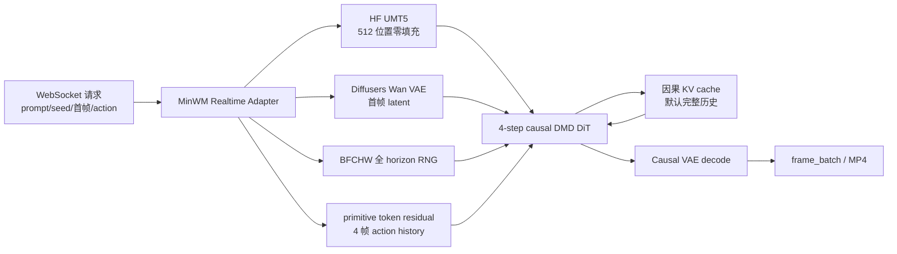

# MinWM Realtime API 变更阅读指南

这份报告面向代码评审者和后续维护者。它解释这次变更为什么存在、实现背后的直觉、
哪些地方为了数值一致性没有采用 SGLang 的常规快速路径，以及应该按什么顺序阅读代码。
更完整的运行命令、逐项决策日志和实验记录见
[`MinWM-Realtime.zh-CN.mdx`](../../docs_new/cookbook/diffusion/MinWM/MinWM-Realtime.zh-CN.mdx)。

## 1. 一句话结论

这次变更把 minWM `main` 分支的 Wan2.2 5B DMD 模型接入 SGLang realtime
WebSocket API，支持首帧、prompt、seed 和 `primitive_token_residual` action。
在同一运行时、相同输入和确定性 kernel 配置下，正式的十用例 B200 验证达到了
generated frame 逐字节相同；H200 上的三组 1248x704、129 帧长视频也逐字节相同。

当前实现仍是 batch-one 的 causal session，但已经接通第一阶段 causal Ulysses
sequence parallel：支持 `sp_degree == ulysses_degree > 1`、`ring_degree == 1`，
并要求 24 个 attention head 能被 Ulysses degree 整除。优先验收拓扑是 SP2/SP4/SP8。
Ring、TP+SP、FSDP+SP 和 whole-DiT compile+SP 仍会被显式拒绝。

本地单测覆盖了 uniform/varlen shard、帧内 shard 边界、packed QKV collective 和
local-head KV ownership；`us-east-1-atl-2a` Local Zone 的 8×B300 Spot 正式矩阵
也已完成。SP2/SP4/SP8 相对 SP1 的 generated uint8 frame 全部逐字节相同，但这个
720p workload 的单流吞吐没有提升：SP2 约慢 4.30%，SP4 约慢 4.40%，SP8 约慢
4.92%。

## 2. 背景和真正的兼容性目标

目标不是“让一个相似的 Wan 模型可以出视频”，而是复现下面这条完整推理合同：

- minWM 源码固定在 `main`；
- 权重固定为 0721 checkpoint：
  `wan22-5B-stage3-dmd-8-0721-6a531f0e067/global_step_003200/ema_student/model.pt`；
- action type 是 `primitive_token_residual`，不是 camera pose/Plücker ray；
- 输入合同是同 prompt、seed、首帧和逐帧 action；
- 首选 bitwise equality，只有无法达到时才允许使用事先声明的数值误差范围。

最新 checkpoint 的原生训练配置是无首帧 processor 的 causal T2V。这次产品/API
合同需要首帧，因此正式首帧测试明确使用 V3 compatibility path。它证明的是该权重在
指定 API 合同下的兼容性，不应被描述成 checkpoint 原生 eval。

## 3. 从请求到视频的数据流



最重要的状态边界有三个：

1. session 保存 action history，两个 kernel-size-3 causal Conv1d 需要四帧历史；
2. session 保存每层 self-attention K/V，默认合同是 `local_attn_size=-1` 的完整历史；
3. bounded session 会一次性预抽取完整 horizon 的 BFCHW noise，再按 chunk 切 view，
   从而保持与 baseline 相同的随机数消费顺序。

## 4. 为什么不能直接复用 LingBot World 2.0

LingBot World 提供了可复用的 realtime session、WebSocket 控制流和 causal pipeline
骨架，但模型语义不同：

- LingBot 的首帧条件会形成 20-channel I2V condition；MinWM V3 使用一个干净的
  reference latent，生成 chunk 保持 48 channels；
- MinWM 使用 81 类离散 action 或八维连续 primitive 权重；
- MinWM 的 action residual 在 patch embedding 之后注入；
- 两者的 conditioning、cache 和数值边界不能只通过改 config 互换。

所以实现复用了服务框架和 causal Wan 基础设施，同时为 MinWM 增加专用 config、
adapter、action encoder、DiT block/head 和 pipeline stages。

## 5. Action 的直觉与精确定义

一个 action label 是两个九状态轴的笛卡尔积：

- translation primitive 顺序：`[w, a, s, d]`，加 idle 共九种组合状态；
- look primitive 顺序：`[i, j, k, l]`，加 idle 共九种组合状态；
- 总 label 空间是 `9 × 9 = 81`，合法范围 `[0, 80]`；
- label `0` 是 noop。

API 也接受 `[w,a,s,d,i,j,k,l]` 顺序的八维连续权重，范围 `[0,1]`。因此 `w=0.8`
必须作为 `action_weights` 中第一维的 `0.8` 发送；只发送 label 无法表达幅度。
每个 latent frame 对应四个 pixel-frame action，encoder 看到四帧历史和四帧当前窗口，
只把最后四个 encoded state 注入当前 patch token。

## 6. Bitwise 一致性为什么比“公式相同”更难

GPU 数值合同不仅包括值、shape 和 dtype，还包括随机数分配 shape、tensor stride、
materialization、算子边界和 attention backend。以下改动看似细小，却都曾产生可观测差异：

- 随机数先按 baseline 的 `[B,F,C,H,W]` 生成，再转成 SGLang layout；
- UMT5 保留 512 个位置，真实 token 后是零，而不是缩短 sequence；
- 首帧 VAE 保留 BF16→FP16→BF16 的隐藏 wire boundary；
- RMSNorm 必须先把 FP32 normalized value round 到 BF16，再乘 BF16 weight；
- RoPE 使用 baseline 的 FP32 interleaved 实/虚部公式；
- AdaLN、gate 和 residual 按 baseline 的 promotion/rounding 顺序执行；
- patch embed 使用原生 `Conv3d`，action 后用 `torch.cat` 形成相同 contiguous stride；
- self/cross attention 使用与设备匹配的 source-shaped packed-varlen backend：
  Blackwell 优先 FA4，Hopper 按 baseline 回退到 FA2；
- MinWM 禁用通用 autocast，只保留 baseline 本身使用的局部 compiled fused segments。

一个很有用的排错原则是：先证明某个 operator 的输入在 value、dtype、shape 和 stride
上完全相同，再讨论替换它的 kernel。否则下游误差抵消可能让错误实现暂时看起来更接近。

## 7. Realtime、KV 和 TTFF

每个模型 chunk 生成 16 个 RGB frame；第一个 chunk 还返回一张 reference frame。
`frame_batch` 是传输分包，不等同于模型 chunk，所以延迟统计必须等到该 chunk 的
`is_final` batch 才结束。

TTFF（Time To First Frame）是请求开始到收到第一批可显示帧的时间。第一次 shape
会包含局部 fused graph 的编译和 cache 初始化，因此应分别报告 cold TTFF、warm TTFF
和 steady-state chunk throughput。

MinWM `main` 的 KV 合同是 `local_attn_size=-1, sink_size=0`，也就是完整历史。
bounded 请求按完整 horizon 预分配；unbounded 请求允许 cache 增长。历史测试中的
45/128-frame window 只能作为显式性能实验，不能静默替换默认模型语义。

## 8. 性能结果应该怎样读

所有 FPS 都必须和 GPU、分辨率、chunk、KV 合同、编译 profile 绑定：

| 设备和 profile | 分辨率 | 结果 | 一致性含义 |
| --- | ---: | ---: | --- |
| B200 exact | 832x480 | 23.075 FPS | 正式 bitwise 路径 |
| B200 dense-native | 832x480 | 24.713 FPS | attention ablation |
| B200 optimized components | 832x480 | 25.541 FPS | 不再保持同一 native boundary |
| B200 whole-DiT compile | 832x480 | 32.222 FPS | 非 parity 性能上限 |
| H200 exact、完整历史 KV | 1248x704 | 10.393 client FPS | 720p 长视频正式 bitwise 路径 |
| H200 triptych bitwise | 1248x704 | 10.822 client FPS | 同 case、warm full-clip exact lane |
| H200 optimized eager | 1248x704 | 10.853 client FPS | 与下一行只差 whole-DiT compile |
| H200 optimized compiled | 1248x704 | 12.711 client FPS | 非 parity、组合性能 lane |
| B300 SP1 exact | 1248x704 | 15.891 client FPS | Local Zone Spot SP reference |
| B300 SP2 exact | 1248x704 | 15.207 client FPS | bitwise；相对 SP1 为 0.957x |
| B300 SP4 exact | 1248x704 | 15.191 client FPS | bitwise；相对 SP1 为 0.956x |
| B300 SP8 exact | 1248x704 | 15.109 client FPS | bitwise；相对 SP1 为 0.951x |

在相同 720p case 的 warm full-case 口径下，minWM baseline 约为 8.20 generated FPS，
SGLang API 约为 10.095 generated FPS，API 快约 23%。不要把 832x480 的 23 FPS
和 1248x704 的 10 FPS 直接比较：像素数、token 数、GPU 和 KV 历史都不同。

最新三路复测把同一张 H200、同一 0721 checkpoint、同一 129 帧 case 固定后，bitwise
lane 为 `10.822 client FPS`，保持其他 speed 设置不变但关闭 whole-DiT compile 的
optimized eager control 为 `10.853 FPS`，compiled speed lane 为 `12.711 FPS`。
因此本次 720p 上 whole-DiT compile 的受控增量为 `17.12%`，compiled speed lane
相对 bitwise 总增量为 `17.46%`；两者不能混写。首次 compiled chunk 的 scheduler
时间为 `235.6 s`，完整 warmup 请求约四分钟；预热后的 TTFF 为 `1.701 s`。

三路 lossless 比较中，bitwise generated frames 仍为 `max_abs=0、RMSE=0、SSIM=1`；
optimized generated frames 为 `RMSE=29.466、SSIM=0.838568、PSNR=18.744 dB`，所以
性能 lane 明确不是 tolerance-parity lane。bitwise/optimized 峰值显存分别为
`53,159/51,269 MiB`。

页面所列 minWM baseline 是一次完整 clip 的端到端计时，当前复测为 `6.138 output
FPS`；同一哈希的前一次 H200 重跑为 `8.612 FPS`。这个单次整体计时包含 encode、
全 horizon、decode 等，重复波动明显，不能与排除 chunk 0 后的 SGLang steady FPS
当成同口径 microbenchmark。

为了 bitwise 所付的正式 B200 税可拆为：

- source-shaped packed attention 相对 dense attention：约 `6.63%`；
- native VAE/T5 boundary：约 `3.24%`；
- exact profile 相对已测非 exact 优化组合：合计约 `9.65%`。

Whole-DiT compile 现在可以在 1248x704 的非 parity 性能 profile 中完成。这里的
“whole-DiT”表示对整个 transformer module 调用 `module.compile`；SGLang 当前传入
`fullgraph=False`，所以 Dynamo 仍允许内部 graph break，它不是单一的无断点巨图。
性能 profile 同时关闭 minWM 的小粒度动态 segment compile，避免嵌套编译边界引入
重复 graph break/recompile；这组配置不再复现早期 Torch 2.11 的
`FakeTensor * Node` 失败。

这不意味着可以把 compile 打开成 bitwise 默认值。正式 exact lane 仍关闭 whole-DiT
compile，并保留与 minWM `main` 相同的局部 fused-segment compile；性能 lane 则同时
采用 dense attention、SGLang VAE/T5、非确定性执行和 whole-DiT compile。三路页面
因此用于比较“已验收 exact”与“组合性能上限”，不能把总差值全部归因给 compile。
832x480 的受控矩阵中，compile 在相同 dense/优化组件上单独贡献了约 `26.16%`。

最新 SP 矩阵固定在一台 `p6-b300.48xlarge` Spot，区域为
`us-east-1-atl-2a`，8 张 B300 之间均为 `NV18`。四档使用相同 checkpoint、输入、
seed、完整历史 KV、deterministic packed attention、一次完整 warmup，再统计七个
steady chunk。SP1/2/4/8 的 scheduler FPS 分别是
`15.896/15.191/15.158/15.107`，client FPS 分别是
`15.891/15.207/15.191/15.109`。所有 SP lane 的 generated frames 都满足
`max_abs=0、RMSE=0、SSIM=1、changed_value_fraction=0`。

这组结果验证了功能和数值合同，但否定了“SP>1 会提高当前 720p 单流 FPS”的假设。
SP 只分摊 sequence attention 与 causal KV；权重、FFN、VAE 和 RGB/output 路径没有
随 degree 等比例分摊，all-to-all 反而成为净开销。峰值显存/GPU 从 SP1 的
`51,588 MiB` 降到 SP2/4/8 的 `50,560/48,826/48,918 MiB`，降幅仅
`1.99%/5.35%/5.18%`，而节点总显存随 replica 数增加。它适合扩大可承载 sequence，
不应在这个 shape 上作为低延迟吞吐优化默认打开。

## 9. Sequence Parallel 审计与 24 FPS 上限

MinWM 现在复用 LingBot 的 varlen Ulysses collective 骨架，并补齐以下 causal 合同：

1. patch token 与完整 action residual 相加后，按 flattened sequence 做 contiguous
   varlen shard；边界可以落在一帧中间；
2. Q/K 完成 absolute RoPE 后与 V 合并，只做一次 input all-to-all；
3. 每个 rank 只保存连续的 local-head causal KV，token cursor 仍使用全局坐标；
4. reverse all-to-all 恢复 local sequence，output projection 后再做 varlen all-gather，
   让 scheduler、re-noise RNG 和 VAE 继续看到完整 latent。

当前只允许 `sp_degree == ulysses_degree > 1` 且 `ring_degree == 1`。Sampling params
必须保持 `enable_sequence_shard=True`；SP>1 却显式关闭 shard 会直接报错。Ring、
TP+SP、FSDP+SP 和 whole-DiT compile+SP 尚未实现。正式多卡矩阵已经覆盖一个
bounded 129-frame 连续 action 请求中的 reference clean commit、四次 DMD forward、
clean-final KV 写入和完整历史，并验收 SP2/SP4/SP8；prompt update、unbounded
history、跨更多 case 的多卡回归仍需补齐。

即使已经接通 Ulysses，单靠 SP 也无法让当前 720p 串行 pipeline 到 24 FPS。H200
24-chunk profile 的中位时间约为：

- DiT：637.35 ms；
- VAE decode：474.10 ms；
- RGB/output：314.44 ms；
- 其他串行开销：187.80 ms。

假设 Ulysses 对 DiT **理想线性加速且通信为零**，乐观上限为：

| Ulysses degree | 估算 chunk 时间 | 乐观 FPS |
| ---: | ---: | ---: |
| 1 | 1613.69 ms | 9.92 |
| 2 | 1294.99 ms | 12.36 |
| 4 | 1135.68 ms | 14.09 |
| 8 | 1056.01 ms | 15.15 |
| 无限 | 976.34 ms | 16.39 |

24 FPS 要求 16-frame chunk 不超过 666.67 ms，但现有非 DiT 串行部分已经约
976.34 ms。因此答案是：**没有任何 Ulysses SP degree 能让当前结构达到 24 FPS**；
实际 all-to-all 开销只会让表中数字更低。要达到目标，至少还要并行化/流水化 VAE，
减少 RGB materialization/传输，重叠 decode 与下一 chunk 的 DiT，并在此基础上再评估
SP2/SP4。MinWM 有 24 个 attention heads；未来 Ulysses degree 还必须满足 head
可分以及 token padding 条件，但这只是必要条件，不是性能保证。

## 10. 代码阅读顺序

建议按下面顺序阅读，每一步都回答一个明确问题：

1. `configs/pipeline_configs/minwm.py`：模型合同是什么，哪些 component 必须 native？
2. `configs/sample/minwm.py`：API 默认分辨率、步数和 realtime 参数是什么？
3. `runtime/entrypoints/openai/realtime/adapters/minwm_realtime_adapter.py`：
   WebSocket action 怎样变成 chunk condition？
4. `runtime/models/dits/minwm_action.py`：81 类 label 和连续权重怎样形成 token residual？
5. `runtime/pipelines_core/stages/model_specific_stages/minwm/`：
   RNG、cache、DMD 和 VAE chunk 状态怎样维护？
6. `runtime/models/dits/minwm.py`：为了 parity 覆盖了哪些 Wan operator boundary？
7. `runtime/pipelines/minwm_causal_dmd_pipeline.py`：这些 stage 怎样串起来，哪些并行参数被拒绝？
8. `tools/convert_minwm_checkpoint.py`：原始 `model.pt` 怎样变成自包含 serving tree？
9. `test/unit/realtime/test_minwm_realtime.py`：每条关键合同由什么回归测试保护？
10. `benchmark/minwm_realtime_parity/`：怎样生成 baseline/API、比较 lossless arrays、
    汇总吞吐并生成同步播放器？

## 11. 变更边界和后续工作

这次 PR 已覆盖 checkpoint 转换、模型注册、realtime adapter、action conditioning、
causal KV、数值 parity、benchmark、同步播放器、中英文文档和第一阶段 causal
Ulysses 实现。它没有声称完成：

- Ring Attention，以及 Ulysses 与 TP/FSDP/whole-DiT compile 的组合；
- 多 session dynamic batching；
- 720p 24 FPS；
- whole-DiT compile 的 strict parity；
- 0721 checkpoint 的原生首帧训练合同。

推荐的下一阶段顺序是：先用 Nsight 分开记录 attention compute、input/reverse
all-to-all 与 final all-gather，解释 B300 上约 4–5% 的负加速；再 profile VAE/RGB，
做 decode/DiT pipeline overlap；然后补 prompt update、unbounded history 和多 case
的多卡回归；最后评估 Ring 或混合并行是否值得。
Whole-DiT performance profile 若要成为产品默认值，也必须单独定义并通过数值 tolerance
和冷启动预算，而不能继承 eager exact lane 的 bitwise 结论。

## 必须通过的测验

通过标准：总分至少 `19/22`，并且标有“关键”的第 2、5、8、12、15、17、19、21 题必须
全部正确。回答时必须用自己的话解释；只写“是/否”不得分。评审者可以要求指出对应
代码或实验字段。

1. 这次实现复用了 LingBot World 的哪些部分，又为什么不能直接复用它的 conditioning？
2. **关键：** 最新 0721 checkpoint 的原生 eval 合同与本次首帧 API 合同有什么区别？
3. 为什么默认分辨率是 832x480，而 720p 测试使用 1248x704 而不是 1280x720？
4. `primitive_token_residual` 的 primitive 顺序是什么？label 合法范围是什么？
5. **关键：** 要表达 `w=0.8` 应发送 label 还是 `action_weights`？给出具体八维 row。
6. 为什么 action encoder 每个 chunk 既需要历史四帧，也需要当前四帧？
7. 同一个 seed 下，把一次 BFCHW 抽样拆成多个 chunk 抽样为什么可能得到不同视频？
8. **关键：** bounded session 怎样复现 baseline 的随机数消费顺序？
9. 为什么 512-position zero-padded context 不能简单裁剪到真实 prompt 长度？
10. BF16→FP16→BF16 的 reference-latent boundary 为什么不能因“最终仍是 BF16”而删掉？
11. 为什么 value/shape/dtype 相等仍不足以推出两个 CUDA 路径 bitwise 相等？
12. **关键：** 排查第一个数值漂移时，为什么要先比较 operator input 的 stride？
13. H200 为什么使用 FA2，而 B200 可以使用 FA4？这对 parity 有什么影响？
14. TTFF、warm chunk latency 和 steady-state FPS 分别回答什么问题？
15. **关键：** MinWM 默认 KV window 是多少？bounded 和 unbounded session 怎样分配 cache？
16. 为什么 `frame_batch` 不能直接作为模型 chunk 的延迟完成条件？
17. **关键：** 当前设置 SP2/Ulysses2 会怎样分配 sequence 与 causal KV？哪些不受支持
    的组合仍然 fail-fast？
18. 在“DiT 理想无限加速”的假设下，720p pipeline 的 FPS 上限约是多少？
19. **关键：** 为什么任何有限 Ulysses degree 都不能单独达到 720p 24 FPS？
20. 如果由你负责下一轮优化，请列出三个按优先级排序的工作，并说明每项如何验证性能
    和数值一致性没有回退。
21. **关键：** 三路页面里的 optimized lane 为什么不能叫“compiled bitwise”？列出
    它相对 bitwise lane 同时改变的四项执行边界。
22. 为什么必须把首次 compile/autotune 时间、warm TTFF 和 steady FPS 分开？若三路
    总加速为 18%，为什么不能宣称 “torch.compile 单独加速 18%”？

答题模板：

```text
1. ...
2. ...
...
22. ...
```
