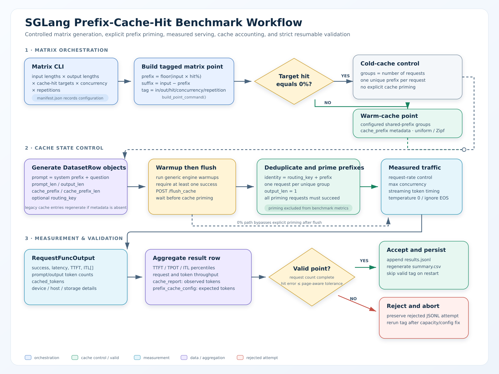
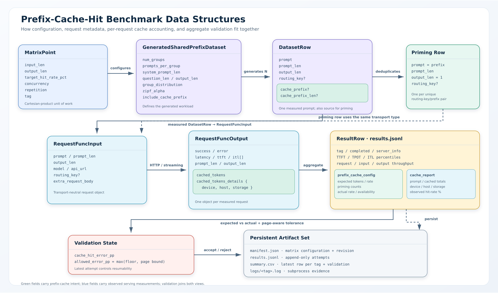

# Prefix-cache benchmark

This benchmark measures how controlled prefix-cache hit rates affect online serving
latency and throughput. It builds a resumable matrix on top of
`sglang.benchmark.serving`, explicitly primes each shared-prefix group, records the
achieved cache-hit rate, and rejects points that miss their target beyond the allowed
page-aware tolerance.





## Prerequisite

Start an SGLang server with cache reporting enabled. Keep the model, parallelism,
KV-cache dtype, chunked-prefill settings, and scheduler configuration fixed across
compared runs.

```bash
python3 -m sglang.launch_server \
  --model-path MODEL_PATH \
  --enable-cache-report
```

Check that the KV pool can hold the shared prefixes plus the active suffix/output
working set. If it cannot, the benchmark measures eviction pressure rather than the
requested cache-hit rate.

## Run one controlled point

Use `bench_serving` directly when you need one workload point rather than a matrix:

```bash
python3 -m sglang.bench_serving \
  --backend sglang \
  --host 127.0.0.1 \
  --port 30000 \
  --model MODEL_PATH \
  --dataset-name generated-shared-prefix \
  --gsp-num-groups 8 \
  --gsp-prompts-per-group 8 \
  --gsp-system-prompt-len 7168 \
  --gsp-question-len 1024 \
  --gsp-output-len 256 \
  --warmup-requests 1 \
  --flush-cache \
  --gsp-prewarm-prefixes \
  --gsp-prewarm-concurrency 1 \
  --cache-report \
  --output-details
```

- `--gsp-prewarm-prefixes` primes every generated prefix group after cache flushing and
  before measured traffic. Priming requests are excluded from benchmark metrics.
- `--gsp-prewarm-concurrency` limits concurrent priming requests; its default is `1`.

The example targets an approximately 87.5% shared prefix before cache-page rounding.
Use `cache_report.cache_hit_rate_pct` as the achieved rate and
`prefix_cache_config.expected_hit_rate_pct` as the generated expectation. When a legacy
on-disk GSP dataset lacks prefix metadata, the benchmark regenerates it automatically.
Explicit prewarming requires accurate, single-turn requests and is incompatible with
`--gsp-fast-prepare` and `--gsp-num-turns` greater than one.

## Run a matrix

```bash
python3 benchmark/prefix_cache/bench_prefix_cache.py \
  --base-url http://127.0.0.1:30000 \
  --model MODEL_PATH \
  --tokenizer MODEL_PATH \
  --input-lens 32768 65536 \
  --output-lens 512 1024 \
  --cache-hit-percentages 0 30 50 70 90 \
  --concurrencies 1 8 \
  --num-prompts 50 \
  --num-groups 2 \
  --warmup-requests 5 \
  --repetitions 3 \
  --result-dir prefix-cache-results \
  --quiet
```

## Point lifecycle

For every matrix point, the runner:

1. Derives the shared-prefix and unique-suffix lengths from total input length and the
   requested hit percentage.
2. Generates `DatasetRow` requests with exact `cache_prefix` metadata.
3. Runs generic server warmups and flushes the prefix cache.
4. For nonzero hit targets, sends one successful priming request per unique prefix
   group. Priming requests are excluded from benchmark metrics.
5. Sends measured traffic with the configured request rate and concurrency.
6. Aggregates TTFT, TPOT, ITL, throughput, and server-reported cached tokens.
7. Validates request completion and expected-versus-actual cache-hit accuracy.

For a 0% cold control, every request receives a unique group and no prefix is primed.

## Cache-hit validation

A point is complete only when all requested responses succeed and:

```text
abs(actual_hit_rate - expected_hit_rate)
  <= max(
       configured_tolerance_floor,
       100 * server_page_size / average_prompt_tokens
     )
```

The default tolerance floor is `0.5` percentage points. Change it with
`--cache-hit-tolerance`. Missing cache reports and out-of-tolerance results abort the
matrix. Restarting the same command skips valid tags and reruns invalid or missing
ones.

## Artifacts

```text
prefix-cache-results/
├── manifest.json       # Matrix parameters and SGLang revision
├── results.jsonl       # Append-only result attempts
├── summary.csv         # Latest result and validation columns per tag
└── logs/
    └── TAG.log         # Full output for each matrix point
```

Use `--output-details` to include per-request lengths, TTFTs, ITLs, generated text,
errors, and cached-token details in JSONL. Use `--dry-run` to inspect generated commands
without contacting a server.

For all `bench_serving` dataset and metric options, see the
[Bench Serving guide](../../docs/docs/developer_guide/bench_serving.mdx).
