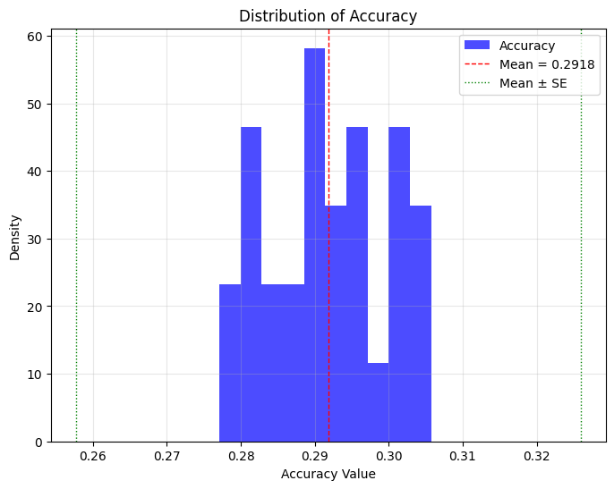
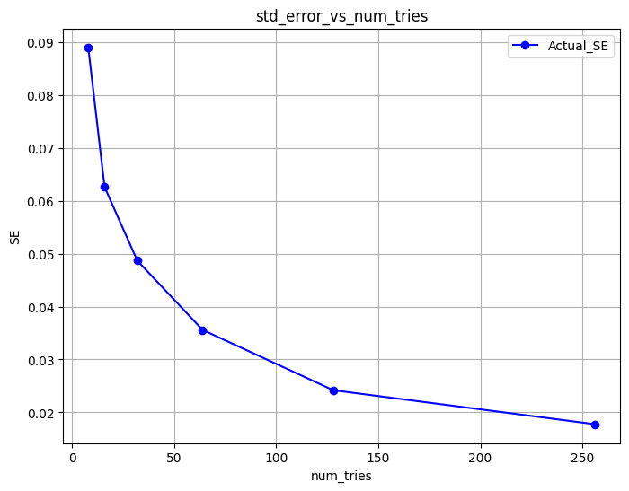

# Run benchmark

This benchmark is primarily intended to be used with reasoning models like `DeepSeek-R1` and its distilled models like `DeepSeek-R1-Distill-Qwen-1.5B`. Please use

```bash
pip install antlr4-python3-runtime
```

for `parse_latex` which we use for symbolic equality check.

## Benchmark sglang

1. Launch the Server
```bash
python3 -m sglang.launch_server --model-path deepseek-ai/DeepSeek-R1-Distill-Qwen-1.5B --port 30000
```

Note that depending on the GPU this benchmark will take quiet some time. To employ data parallelism please use:

```bash
python3 -m sglang_router.launch_server --model-path deepseek-ai/DeepSeek-R1-Distill-Qwen-1.5B --port 30000 --dp-size 4
```


2. Benchmarking

We use [suggested](https://github.com/deepseek-ai/DeepSeek-R1) parameters of `temperature=0.6`, `top_p=.95`, `max_new_tokens=32768`. The command line argument `num-tries` can be used to evaluate the model multiple times on the same question. We use the suggested `64` from the repo for AIME 2024. For LIMO, we use `8` as the number of tries due to the size of the dataset.

By default evaluate on LIMO dataset.

```bash
python3 bench_sglang.py --parallel 256 --num-tries 64 --port 30000
```

Evaluate on AIME 2024 dataset.

```bash
python3 bench_sglang.py --parallel 256 --port 30000 --data-path Maxwell-Jia/AIME_2024 --question-key Problem --answer-key Answer --num-tries 64
```

Evaluate on [AIME 2025 I dataset](https://huggingface.co/datasets/opencompass/AIME2025). For benchmark result see [here](https://matharena.ai/).

```bash
python3 bench_sglang.py --parallel 256 --port 30000 --data-path opencompass/AIME2025 --question-key question --answer-key answer --num-tries 64
```
## Results

### Evaluation Results
| Dataset    | Num Tries | Accuracy | Reference | Standard Error |
|------------|-----------|----------|-----------|-----------|
| LIMO       | 8         | 47.7%    | ?         | ?         |
| AIME 2024  | 64        | 33.2%    | 28.9%     | 3.4%       |
| AIME 2025 I| 64        | 29.9%    | 25.0%     |  ?        |

### Statistic Analysis Results
Set up SGLang engine for statistic analysis, for high efficiency we use `--dp-size 8` for data parallelism:
```bash
python3 -m sglang_router.launch_server --model-path deepseek-ai/DeepSeek-R1-Distill-Qwen-1.5B --port 30000 --dp-size 8
```
**Experiment 1**:
We fixed the number of attempts (num_tries) and conducted multiple runs to assess the consistency of the model's performance. The results show that all recorded accuracies lie within ± one standard error deviation from the mean. This suggests that **our metric serves as an effective upper bound for the deviation of reported accuracy**.

To collect the accuracy, run the following command 30 times:
```bash
python3 bench_sglang.py --parallel 64 --port 30000 --data-path Maxwell-Jia/AIME_2024 --question-key Problem --answer-key Answer --num-tries 64
```




**Experiment 2**: We explored the relationship between the number of attempts (num_tries) and the standard error (SE) by varying num_tries across a range (e.g., 8, 16, 32, ..., 256) and performing a single run for each value. The results demonstrate that as the number of attempts increases, the standard error decreases, leading to **greater stability in answer accuracy**.

To reveal the relationship, run the command 6 times and adjust the parameter `--num-tries` for each run:
```bash
python3 bench_sglang.py --parallel 64 --port 30000 --data-path Maxwell-Jia/AIME_2024 --question-key Problem --answer-key Answer --num-tries <num_tries>
```

