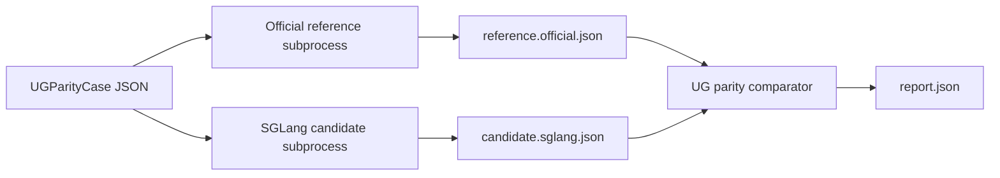

# UG Runtime Architecture

## 1. Scope

UG runtime is the experimental path for BAGEL-style unified generation in SGLang. The long-term shape is still SRT-owned: SRT owns session state, KV cache, and model execution; diffusion-side code can request G-segment denoise work but must not own BAGEL model state or KV pages.

This document records the stable architecture facts after Phase 1 of `ug-official-alignment`: the official-vs-SGLang parity harness. It does not claim that VLM, text-to-image, image-edit, or interleaved outputs already match official BAGEL. Those result-parity items live in Phase 2 of the roadmap.

## 2. Parity Harness Boundary

The parity harness is an offline comparison layer, not a serving path. Its job is to run the same reproducible case through two isolated runners and write structured artifacts that can be diffed later.

The core schema and comparator live in `python/sglang/srt/ug/parity.py`:

- `UGParityCase` describes one fixed input case, including task kind, prompt/messages, optional image, seed, sampling params, dump points, and metadata.
- `UGParityArtifact` describes one runner output, including text, image summaries, tensor summaries, debug counters, metadata, and error.
- `UGParityReport` records pass/fail and field-level differences.
- `run_ug_parity_case` and `compare_ug_parity_artifacts` are pure SGLang helpers and do not load official BAGEL code.

The opt-in live entry is `test/registered/scheduler/test_bagel_official_parity_harness.py`. It only runs when the caller provides:

- `SGLANG_TEST_BAGEL_OFFICIAL_REPO`
- `SGLANG_TEST_BAGEL_QWEN2_MOT_MODEL`
- optional `SGLANG_TEST_BAGEL_PARITY_OUTPUT`

## 3. Import Discipline

Official BAGEL or seed repository functions are allowed only in opt-in tests or external comparison scripts. They must not enter the runtime import chain under `python/sglang/**`.

Current guard:

- `python/sglang/multimodal_gen/test/unit/test_ug_official_parity.py` scans runtime Python files for known official BAGEL import hooks and fails if they appear.
- The live harness loads the official repo in a subprocess by manipulating that subprocess `sys.path`, so the main SGLang process does not inherit official module state.

This is a hard boundary. If a future result-parity step requires importing official BAGEL runtime code from `python/sglang/**`, stop and redesign that step.

## 4. Phase Ownership

Phase 1 owns only the harness substrate. A passing Phase 1 report proves:

- the artifact protocol is serializable and deterministic;
- CPU fake runners can pass and fail with actionable differences;
- the opt-in live shell can find official BAGEL and SGLang runners in isolated subprocesses;
- official code stays outside SGLang runtime imports.

Phase 1 does not prove:

- VLM logits or text are aligned;
- denoise CFG semantics are aligned;
- text-to-image or image-edit images are aligned;
- generated images can be appended back into a shared SRT UG session.

Those checks start in Phase 2, using this harness as the shared evidence format.
