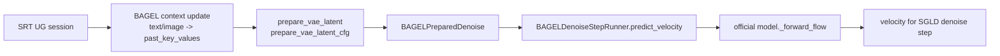

# BAGEL Denoise Step Spike

## 速答

官方 BAGEL 的 interleave 上下文由 `InterleaveInferencer` 维护，文本和图像输入都会更新同一个 `gen_context.past_key_values`。图像生成时，`gen_image` 先用当前上下文构造 VAE latent query，再调用 `Bagel.generate_image`；真正的 per-step velocity seam 是 `Bagel.generate_image` 循环里的 `_forward_flow(...)` 调用。

这次 SGLang spike 已把这个 seam 固化为 `BAGELDenoiseStepRunner.predict_velocity(...)`：它不拥有 KV，只接收 SRT/BAGEL 已准备好的 denoise context 和当前 latent/timestep，然后调用官方形状的 `_forward_flow` 返回 velocity。

## 关键证据

- 官方 `InterleaveInferencer.init_gen_context` 创建 `kv_lens / ropes / past_key_values`，其中 `past_key_values` 是 `NaiveCache`。证据：`inferencer.py:31-36`，官方 commit `056b5fd51a88c1eb4547318609e25d40080fcf87`。
- 官方 `update_context_text` 调用 `prepare_prompts` 后用 `forward_cache_update_text` 更新同一个 `past_key_values`。证据：`inferencer.py:40-58`。
- 官方 `update_context_image` 对 VAE/VIT 图像输入分别调用 `forward_cache_update_vae` 和 `forward_cache_update_vit`，仍然更新同一个 context。证据：`inferencer.py:61-95`。
- 官方 `gen_image` 在生成前调用 `prepare_vae_latent`、`prepare_vae_latent_cfg`，然后把主上下文和 CFG 上下文都传给 `model.generate_image`。证据：`inferencer.py:99-168`。
- 官方 `Bagel.prepare_vae_latent` 输出了 `_forward_flow` 所需的 `packed_*`、`key_values_lens`、`packed_key_value_indexes` 等张量。证据：`modeling/bagel/bagel.py:552-608`。
- 官方 `Bagel.generate_image` 构造 shifted timesteps，在每步根据 `cfg_interval` 决定 CFG scale，调用 `_forward_flow` 得到 `v_t`，然后 `x_t = x_t - v_t * dt`。证据：`modeling/bagel/bagel.py:643-754`。
- 官方 `_forward_flow` 接收 latent、timestep、packed query、主/CFG past key values，返回 velocity，并在函数内完成 CFG renorm。证据：`modeling/bagel/bagel.py:756-907`。

## 本次 SGLang 落点

- `python/sglang/srt/ug/bagel.py` 新增 `BAGELPreparedDenoise`，用于保存官方 `prepare_vae_latent*` 产物和主/CFG BAGEL cache。
- `python/sglang/srt/ug/bagel.py` 新增 `BAGELDenoiseStepRunner.predict_velocity(...)`，按官方 `generate_image` 的单步参数映射调用 `_forward_flow`。
- `python/sglang/srt/ug/bagel.py` 新增 `BAGELInterleaveContextBackend`，可包住一个已经加载好的官方 `InterleaveInferencer`，把 `init/update_context_* -> prepare_vae_latent* -> _forward_flow -> append image -> gen_text` 接到 UG adapter 边界。
- `python/sglang/srt/ug/bagel.py` 的真 BAGEL loader 已开始按官方 `app.py` 的结构构造 `InterleaveInferencer`：加载 config/AE/tokenizer，`init_empty_weights` 下建 Bagel，再用 `load_checkpoint_and_dispatch` 加载 `ema.safetensors`，最后交给 `BAGELInterleaveContextBackend`。
- 真权重 smoke 已在 `sgl_flamingo` 容器里用 `/data/models/BAGEL-7B-MoT` 和 `CUDA_VISIBLE_DEVICES=0` 跑通：`U prefill -> image marker -> predict_velocity_from_session` 返回 `velocity_shape=(4, 64)`、`velocity_dtype=torch.bfloat16`、`velocity_device=cuda:0`。
- 真权重多步 UGPipeline 已跑通：`UGContextStage -> UGLatentStage -> UGDenoiseStage -> UGDecodeStage`，`num_inference_steps=4` 时输出 `trajectory_latents_shape=(3, 1, 4, 64)`，debug counter 为 `prefill_count=1`、`velocity_count=3`、`append_image_count=1`、`decode_count=2`，状态回到 `u_decode`。这证明当前路径已经不是一次性 image edit，而是 `U prefill -> G denoise 多步 -> append image -> U decode text`。
- 真权重多步路径暴露了两个真实集成点：SGLD 侧 latent/timestep 初始在 CPU，需要在 BAGEL adapter 内迁到模型 runtime device；BAGEL 官方 image/text context update 和 `gen_text` 依赖 bfloat16 autocast，否则 append generated image 会在 `update_context_image` 里触发 Float/BFloat16 matmul dtype mismatch。
- G decode 又向真实路径推进了一步：`UGDecodeStage` 新增 `decode_latents` 窄接口，SRT-backed BAGEL adapter 通过官方 `InterleaveInferencer.decode_image(...)` 走 VAE decode。真权重脚本输出 `output_shape=(1, 32, 32, 3)`、`output_dtype=uint8`、`output_minmax=0..197`、`output_mean=96.56`，随后同一 session append image 并继续 U decode。
- G init latent 也已交给模型侧定义：`UGLatentStage` 先通过 `SRTBackedUGDenoiserBridge.prepare_latents(...)` 询问 UG runtime，BAGEL backend 复用同一个 `BAGELPreparedDenoise` 里的官方 `packed_init_noises` 和 `packed_vae_position_ids`。真权重脚本输出 `latents_shape=(4, 64)`、`latent_position_ids_shape=(4,)`、`ug_latent_shape=(2, 2, 64)`、`trajectory_latents_shape=(3, 4, 64)`，不再使用 SGLD config 自行拼出的 `(1, 4, 64)` batch latent。
- `python/sglang/multimodal_gen/test/unit/test_ug_bagel_adapter.py` 用 fake official model 验证 `_forward_flow` 只调用一次、CFG interval 规则一致、timestep 会扩展到 latent batch。
- `python/sglang/multimodal_gen/test/unit/test_ug_bagel_adapter.py` 用 fake official inferencer 验证 U-G-U 闭环：同一 session prefill 一次、denoise 多步复用 prepared context、BAGEL decode latents 到 image、append image 后继续 U decode，并且追加新 U 输入后能进入下一轮 G marker。
- `python/sglang/multimodal_gen/test/unit/test_ug_bagel_adapter.py` 用 fake loader symbols 验证真 loader 的官方构造形状和单卡 device-map pinning，不需要真实 7B 权重。
- `python/sglang/multimodal_gen/test/unit/test_ug_diffusion_pipeline.py` 固定了 diffusion decode 边界：`UGDecodeStage` append 回 UG session 的是单张 `PIL.Image`，不是 numpy batch。

## 仍未解决

- 真权重已证明同 session 的 `U -> G 多步 -> append image -> U text` 控制流，但还没有把这套路径挂进 SRT engine 的真实 request/scheduler 入口。
- CFG/text/image 三份上下文现在仍在 BAGEL adapter 内用官方 `NaiveCache` 表达；还没有落到 SRT paged KV allocator 的真实 page/slot 生命周期。
