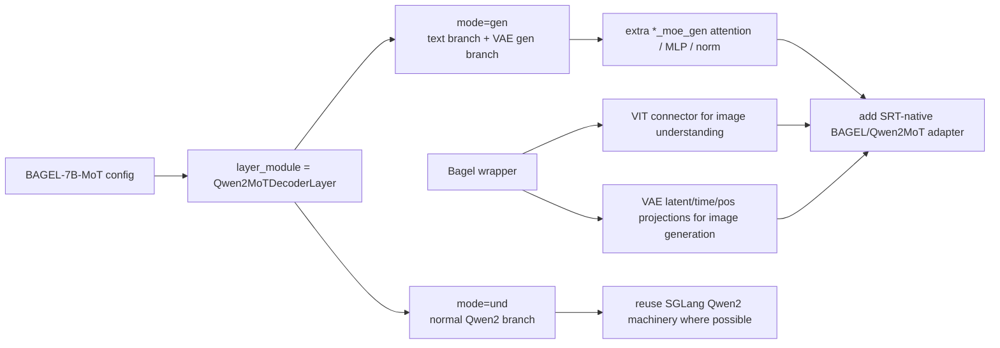

## 问题与范围

这次只回答一个问题：BAGEL 的 `language_model` 是否可以直接当作普通 Qwen2 dense 模型接入 SGLang；如果不能，我们到底需要自己实现到什么粒度。

范围限定在官方 BAGEL repo 的 `modeling/bagel/`、其携带的 vanilla Qwen2 对照实现，以及当前 SGLang 的 `python/sglang/srt/models/qwen2.py`。

## 速答

BAGEL 不是“只是一个 Qwen2 dense 模型”。它确实用 `Qwen2ForCausalLM` 这个壳和 Qwen2 的 backbone 形状，但 BAGEL-7B-MoT 在初始化时把 `llm_config.layer_module` 改成了 `Qwen2MoTDecoderLayer`，每层除了普通 Qwen2 分支，还多了一套 generation branch：`q/k/v/o_proj_moe_gen`、`q/k_norm_moe_gen`、`mlp_moe_gen`、`*_layernorm_moe_gen`，并且 forward 依赖 `mode="und"/"gen"` 和 packed text/VAE indexes 做路由。

所以结论是：

- 不需要从零“拆一遍 Qwen2 dense”。SGLang 现有 Qwen2 的 embedding、attention/MLP 权重加载、paged KV、ModelRunner/ForwardBatch 路径都应该尽量复用。
- 但需要一个 SGLang-native 的 BAGEL/Qwen2MoT model class 或 adapter layer。普通 `sglang.srt.models.qwen2.Qwen2ForCausalLM` 表达不了 MoT gen branch、packed VAE latent token 路由、BAGEL 外层的 VIT/VAE/connector/time/latent projection。
- U understanding 路径最接近普通 Qwen2：`mode="und"` 主要走普通 Qwen2 分支。因此下一步应该先把 `mode="und"` 的 BAGEL U forward 映射到 SRT Qwen2-compatible 层；G velocity 再补 `mode="gen"` 的 MoT 分支。

## 关键证据

- 官方 BAGEL app 读取 `llm_config.json` 后显式设置 `qk_norm=True`、`tie_word_embeddings=False`，并把 `layer_module` 改成 `"Qwen2MoTDecoderLayer"`；随后仍以 `Qwen2ForCausalLM(llm_config)` 创建 language model。证据：`/tmp/BAGEL-official/app.py:39-65`。
- `Bagel` wrapper 不只是包一个 LLM：图像生成侧有 `time_embedder`、`vae2llm`、`llm2vae`、`latent_pos_embed`；图像理解侧有 `vit_model`、`connector`、`vit_pos_embed`。证据：`/tmp/BAGEL-official/modeling/bagel/bagel.py:57-87`。
- BAGEL 自己的 `Qwen2Config` 比 vanilla Qwen2 多 `qk_norm`、`layer_module`、`freeze_und`，并在 `Qwen2Model` 里按 `Decoder_layer_dict[config.layer_module]` 选层类型。证据：`/tmp/BAGEL-official/modeling/bagel/qwen2_navit.py:160-204`、`/tmp/BAGEL-official/modeling/bagel/qwen2_navit.py:939-958`。
- `PackedAttentionMoT` 在普通 Qwen2 attention projection 外额外定义 `q_proj_moe_gen/k_proj_moe_gen/v_proj_moe_gen/o_proj_moe_gen` 和 gen branch q/k norm；训练与推理时会按 token index 把 understanding token 与 generation token 路由到不同 projection。证据：`/tmp/BAGEL-official/modeling/bagel/qwen2_navit.py:381-399`、`/tmp/BAGEL-official/modeling/bagel/qwen2_navit.py:514-548`、`/tmp/BAGEL-official/modeling/bagel/qwen2_navit.py:590-598`。
- `Qwen2MoTDecoderLayer` 每层除普通 `self_attn/mlp/input_layernorm/post_attention_layernorm` 外，还定义 `mlp_moe_gen`、`input_layernorm_moe_gen`、`post_attention_layernorm_moe_gen`；推理接口接收 `mode`、`packed_vae_token_indexes`、`packed_text_indexes`。证据：`/tmp/BAGEL-official/modeling/bagel/qwen2_navit.py:687-705`、`/tmp/BAGEL-official/modeling/bagel/qwen2_navit.py:757-831`。
- BAGEL forward 会先把 text embedding、VIT embedding、VAE latent embedding pack 到同一 `packed_sequence`，再在 `use_moe` 时传入 `packed_und_token_indexes` 和 `packed_gen_token_indexes`。证据：`/tmp/BAGEL-official/modeling/bagel/bagel.py:151-215`。
- BAGEL 的 text cache update 在 `use_moe` 时传 `mode="und"`，说明 U 路径可以先映射普通分支，但仍运行在 BAGEL 的 packed-cache API 上。证据：`/tmp/BAGEL-official/modeling/bagel/bagel.py:267-295`。
- vanilla Qwen2 的 decoder layer 只有一套 attention、MLP、两个 RMSNorm；官方 vanilla `Qwen2Model` 固定构造 `Qwen2DecoderLayer`，没有 `layer_module` 和 MoT 路由。证据：`/tmp/BAGEL-official/modeling/qwen2/modeling_qwen2.py:447-461`、`/tmp/BAGEL-official/modeling/qwen2/modeling_qwen2.py:654-673`。
- 当前 SGLang Qwen2 同样是普通 decoder layer：`Qwen2DecoderLayer` 只有 `Qwen2Attention`、`Qwen2MLP`、两处 RMSNorm；`Qwen2Model` 默认 `decoder_layer_type=Qwen2DecoderLayer`。证据：`python/sglang/srt/models/qwen2.py:194-258`、`python/sglang/srt/models/qwen2.py:261-286`。

## 细节展开

从命名看，BAGEL 的 `language_model = Qwen2ForCausalLM(llm_config)` 很容易误导我们以为“直接走 SGLang Qwen2 就行”。但这个 `Qwen2ForCausalLM` 是 BAGEL repo 里的 `modeling/bagel/qwen2_navit.py`，不是 transformers 原生 Qwen2；它的 `Qwen2Model` 会根据 `config.layer_module` 实例化不同 decoder layer。BAGEL-7B-MoT 的 app/eval/train 入口都把这个字段设成 `Qwen2MoTDecoderLayer`。

MoT 的核心不是普通 dense MoE router，而是按 token 类型分支：understanding text/image token 走普通 Qwen2 branch，generation VAE latent token 走额外的 `_moe_gen` branch。这样会导致两个直接后果：

- 权重层面：普通 Qwen2 checkpoint key 只能覆盖 normal branch；BAGEL checkpoint 还会有 `_moe_gen`、VIT、VAE bridge、latent/time projection 等 key。把它当 vanilla Qwen2 加载，要么 missing/unexpected key，要么丢掉生成分支能力。
- runtime 层面：SGLang 的普通 Qwen2 forward 只有 `positions/hidden_states/forward_batch/residual`，没有 `mode`、`packed_text_indexes`、`packed_vae_token_indexes` 这些路由参数；G velocity 所需的 latent token forward 无法用普通 Qwen2 layer 表达。

因此，“自己拆”的正确粒度应该很窄：不是重写 Qwen2，而是在 SGLang Qwen2 旁边新增 BAGEL/Qwen2MoT 适配层，让 normal branch 复用 Qwen2 组件和权重映射，让 gen branch 补齐 `_moe_gen` 模块与 packed token routing。BAGEL 外层的 VIT/VAE/connector/latent projection 也应该作为 BAGEL model wrapper 的前后处理进入 SRT，而不是留在 observer 里偷偷调官方 Python inferencer。

## 未决问题

- BAGEL checkpoint 的真实 key 分布还需要用权重文件跑一次分类：`qwen2_shared`、`mot_gen_branch`、`bagel_outer`、`vit/vae`、`unknown`。这能量化“可直接复用 SGLang Qwen2 加载器”的比例。
- SGLang native `Qwen2MoTDecoderLayer` 应该直接继承/组合现有 `Qwen2DecoderLayer`，还是先做一个更小的 `mode="und"` only variant，需要结合 ForwardBatch 里的 token index 表达决定。
- `mode="gen"` 的 packed VAE latent token 与 SRT paged KV 的位置映射是否能完全复用当前 `UGSRTKVTokenBinding`，还要通过真实 BAGEL 权重 forward 验证。

## 后续建议

下一步先写一个 BAGEL checkpoint key classifier，再基于分类结果做最小 SRT-native `Qwen2MoTDecoderLayer(mode="und")` spike；如果 `mode="und"` 都无法贴上 SRT Qwen2 的 ForwardBatch/KV 语义，就应该立即停下重审模型边界。

## 相关文档

- `codestable/compound/2026-04-29-explore-bagel-denoise-step.md`
- `codestable/features/2026-04-28-ug-g-runtime-proof/ug-g-runtime-proof-design.md`
