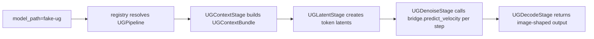

# ug-g-runtime-proof design

## 0. 术语约定

- **UG**：本文指 BAGEL-like unified understanding/generation 模型族。U 负责文本/图像理解与上下文预填充，G 负责图像生成 denoise 预测。
- **G 路径**：本文只指 SGLang-Diffusion 中从 request/config/registry 进入 pipeline stages，再在 denoise loop 调用 UG velocity predictor，最后产出 image-shaped output 的路径。
- **SRT bridge**：Diffusion runtime 调用 SRT/UG 能力的窄接口，不等于真实 BAGEL 模型实现。第一阶段只放 `FakeUGDenoiserBridge`。
- **fake-ug**：第一阶段 CI/本地小验证专用 model id，不下载权重，不加载真实 BAGEL。

术语 grep 结果：

- `UGPipeline`、`UGDenoiserBridge`、`fake-ug` 在现有代码中没有历史定义，只有本次新增代码和 `docs/superpowers/plans/2026-04-28-ug-srt-diffusion-hybrid.md` 命中。
- `DenoisingStage` 是已有 DiT-oriented stage，本文不把 UG 硬塞进它，避免把 SRT KV/context 语义混入普通 DiT stage。
- `BAGEL` 只作为 model family detector 和后续真实 bridge 的占位，不在第一阶段声明支持真实权重。

## 1. 决策与约束

### 需求摘要

这一步给 SGLang-Diffusion 维护者一个最小闭环：在没有 BAGEL 权重、没有 GPU 的情况下，也能证明 UG 的 G 路径可以挂在 diffusion runtime 上。成功标准是：

- `sglang-internal/fake-ug` 能解析到 `UGPipeline`、`UGSamplingParams`、`UGPipelineConfig`。
- `UGPipeline` stage 顺序固定为 `UGContextStage -> UGLatentStage -> UGDenoiseStage -> UGDecodeStage`。
- `UGDenoiseStage` 每一步通过 `UGDenoiserBridge.predict_velocity(...)` 获得 velocity，而不是直接调用普通 DiT transformer。
- fake pipeline forward 能产出 shape 为 `(1, height, width, 3)` 的 image array，并能返回 trajectory tensors。

明确不做：

- 不接真实 BAGEL checkpoint。
- 不实现真实 SRT KV cache 复用。
- 不支持 multi-GPU、CFG parallel、disaggregation。
- 不改普通 `DenoisingStage` 的模型调用契约。
- 不承诺 HTTP/OpenAI API serving 已可用。

本 feature 是内部技术验证，不新增用户可感能力，无对应 requirement。

### 挂载点清单

- `python/sglang/srt/ug/`：新增 SRT-side UG bridge contract 和 fake bridge。
- `python/sglang/multimodal_gen/configs/sample/ug.py`：新增 UG runtime sampling params。
- `python/sglang/multimodal_gen/configs/sample/__init__.py`：导出 `UGSamplingParams`。
- `python/sglang/multimodal_gen/configs/pipeline_configs/ug.py`：新增 UG pipeline static config 和 runtime guard。
- `python/sglang/multimodal_gen/configs/pipeline_configs/__init__.py`：导出 `UGPipelineConfig`。
- `python/sglang/multimodal_gen/runtime/pipelines/ug.py`：新增 `UGPipeline` 和 bridge factory。
- `python/sglang/multimodal_gen/runtime/pipelines_core/stages/ug.py`：新增 UG-specific context/latent/denoise/decode stages。
- `python/sglang/multimodal_gen/registry.py`：注册 `fake-ug` 和 BAGEL-like model ids 到 UG config。
- `python/sglang/utils.py`：把 `fake-ug`/`bagel` 作为 non-diffusers diffusion model pattern 路由到 `UGPipeline`。
- `python/sglang/multimodal_gen/test/unit/test_ug_*.py`：新增第一阶段 proof tests。

### 复杂度档位

仓库当前没有 `codestable/reference/code-dimensions.md`，无法套用项目内档位表。本文按内部技术 proof 默认处理：可读性面向 team，健壮性到输入/运行模式 guard，性能只验证路径正确，不做吞吐/显存预算。

### 关键决策

- 第一阶段用 fake bridge 固化 diffusion runtime 与 SRT UG 的边界，再替换真实 BAGEL bridge。
- G 路径复用 SGLang-Diffusion 的 `ComposedPipelineBase`、`PipelineStage`、`Req`、registry、sampling/config 体系。
- U/SRT 代码只暴露 `UGDenoiserBridge` contract，不把 BAGEL `NaiveCache` 或模型内部状态泄漏给 diffusion stages。
- BAGEL model id 可以解析到 `UGPipeline`，但 `_load_ug_bridge("bagel")` 必须显式 `NotImplementedError`，避免误报已支持真实模型。

### 主流程概述

正常路径：



关键边界：

- `num_gpus != 1`、`enable_cfg_parallel=True`、`disagg_mode=True` 时早失败。
- 输入 image 只接受 0 或 1 张 PIL image/path；多 image 暂不支持。
- `batch.latents is None` 进入 denoise 时早失败，说明 stage 顺序坏了。

## 2. 接口契约

### SRT bridge contract

正常示例：

```python
bridge = FakeUGDenoiserBridge()
contexts = bridge.build_contexts(prompt="text and image", image=pil_image)
velocity = bridge.predict_velocity(
    contexts=contexts,
    latent_tokens=torch.zeros(1, 4, 64),
    timestep=torch.tensor([0.5]),
    latent_position_ids=torch.arange(4),
    sampling_params=UGSamplingParams(),
)
assert velocity.shape == (1, 4, 64)
# 来源：python/sglang/srt/ug/denoiser.py FakeUGDenoiserBridge
```

错误语义：

```python
_load_ug_bridge("ByteDance-Seed/BAGEL-7B-MoT")
# raises NotImplementedError until the real SRT UG bridge lands
# 来源：python/sglang/multimodal_gen/runtime/pipelines/ug.py _load_ug_bridge
```

### Pipeline contract

正常示例：

```python
info = get_model_info("sglang-internal/fake-ug", backend="sglang")
assert info.pipeline_cls is UGPipeline
assert info.sampling_param_cls is UGSamplingParams
assert info.pipeline_config_cls is UGPipelineConfig
# 来源：python/sglang/multimodal_gen/registry.py get_model_info
```

Forward proof 示例：

```python
batch = Req(
    sampling_params=UGSamplingParams(
        prompt="text and image",
        width=32,
        height=32,
        num_inference_steps=4,
        return_trajectory_latents=True,
    ),
    condition_image=Image.new("RGB", (16, 16)),
)
result = pipeline.forward(batch, server_args)
assert result.output.shape == (1, 32, 32, 3)
assert result.trajectory_latents.shape[0] == 3
# 来源：python/sglang/multimodal_gen/test/unit/test_ug_diffusion_pipeline.py TestUGDiffusionPipeline
```

## 3. 实现提示

### 目标文件状况评估

- 新增 UG 逻辑适合放新文件，避免继续扩大已有 `denoising.py` 和具体模型 pipeline 文件。
- `registry.py` 和 `utils.py` 已是中心挂载点，第一阶段只追加 model-family routing，不做结构性重构。
- `UGPipeline` 和 `UG stages` 当前很小，职责清楚，可以直接承接 proof 代码。

### 推进顺序

1. **锁定 SRT bridge contract**：新增 `UGContextHandle`、`UGContextBundle`、`UGDenoiserBridge`、`FakeUGDenoiserBridge`。
   退出信号：bridge 单测能验证 context split 和 velocity shape/value。
2. **新增 UG sampling/config**：新增 `UGSamplingParams` 和 `UGPipelineConfig`，包含 CFG/shift 参数和 runtime guard。
   退出信号：参数校验覆盖 interval、renorm type、runtime unsupported modes。
3. **新增 fake UG pipeline stages**：新增 context、latent、denoise、decode 四段 stage，denoise loop 只通过 bridge 预测 velocity。
   退出信号：单测直接串 stages 或 pipeline forward 后产出 image-shaped output。
4. **接入 pipeline registry**：`fake-ug` 和 BAGEL-like id 能解析到 UG pipeline/config/params，BAGEL bridge 仍显式未实现。
   退出信号：registry 单测不读 `model_index.json` 也能解析 `sglang-internal/fake-ug` 和 `ByteDance-Seed/BAGEL-7B-MoT`。
5. **跑小范围验证**：在有 torch/diffusers 的环境执行 UG 单测和 py_compile。
   退出信号：`test_ug_srt_bridge.py`、`test_ug_registry.py`、`test_ug_diffusion_pipeline.py` 通过；若本地环境缺依赖，记录缺失依赖并保证 py_compile 通过。
6. **停在小闭环边界**：不继续接真实 BAGEL，等有卡后单独推进真实 SRT bridge。
   退出信号：代码中 BAGEL path 仍为清晰 `NotImplementedError`，没有半成品真实模型分支。

### 实现风险与约束

- `ComposedPipelineBase` import 链较重，unit test 需要完整 Python env；本地系统 Python 缺 numpy，bundled Python 缺 torch/diffusers 时只能做 syntax proof。
- `SyncExecutor` 可以用于 unit proof，避免未初始化分布式环境影响 `ParallelExecutor`。
- `UGContextStage` 当前把 fake context 放进 `batch.extra["ug_contexts"]`，真实 KV 生命周期以后必须补 release/error cleanup。
- 第一阶段 output 是 fake decode，不代表图像质量或真实 VAE decode 正确。

### 测试设计

- Bridge contract：`FakeUGDenoiserBridge.build_contexts` 正确生成 full/text_cfg/image_cfg token counts；`predict_velocity` 输出 shape 和 deterministic value。
- Sampling/config：`UGSamplingParams` 拒绝非法 `cfg_interval`、`cfg_renorm_type`、非有限数值；`UGPipelineConfig.validate_runtime` 拒绝 multi-GPU/CFG/disagg。
- Pipeline forward：使用 32x32 fake image、4 denoise steps，验证 stage 顺序、output shape、latent shape、trajectory length。
- Registry：`sglang-internal/fake-ug` 和 `ByteDance-Seed/BAGEL-7B-MoT` 在 `backend="sglang"` 下解析到 `UGPipeline`，无需 `model_index.json`。
- Syntax proof：对新增 UG 文件和测试文件运行 `python -m py_compile`。

## 4. 与项目级架构文档的关系

仓库当前没有 `codestable/architecture/DESIGN.md`。本 feature 与现有文档的关系如下：

- 关联 `docs/diffusion/support_new_models.md`：UG 选择 model-specific stages，因为它的 denoise model-call contract 不是普通 DiT/UNet。
- 关联 `docs/diffusion/disaggregation.md`：第一阶段明确不支持 disagg，`UGPipelineConfig.validate_runtime` 需要早失败。
- 后续真实 BAGEL bridge 落地后，需要把 UG 作为 native non-diffusers diffusion pipeline family 写入 diffusion support docs。
- 本阶段对系统级架构的稳定变化是新增 SRT/Diffusion bridge 边界；acceptance 时应确认是否把该边界归并到未来架构文档。
