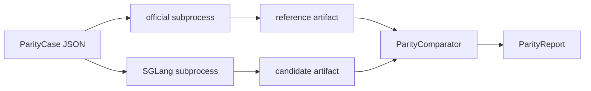

# ug-official-parity-harness design

## 0. 术语约定

- **Official reference runner**：只在测试/手工脚本里加载官方 BAGEL repo 的 runner，用来产生 reference artifact；不能被 `python/sglang/**` runtime import。
- **SGLang candidate runner**：用当前 SGLang UG runtime/native BAGEL path 产生 candidate artifact。
- **Parity case**：一组可重复输入，包含 task kind、prompt、可选 image、seed、sampling params、dump points。
- **Parity artifact**：reference/candidate runner 的结构化输出，包含文本、图像文件指纹、tensor summary、debug counters 和错误状态。
- **Import firewall**：官方 BAGEL/seed 仓库函数只能出现在 opt-in 测试或手工 parity 脚本中，不能出现在 SGLang package runtime 中。

术语 grep 结果：

- `parity` 在 UG 相关代码里还没有稳定实现，适合作为本 feature 的新命名空间。
- `official` 目前只剩测试说明/注释语义，runtime 中没有官方 BAGEL 动态 import。
- `SGLANG_TEST_BAGEL_QWEN2_MOT_MODEL` 已用于真权重 live smoke；本 harness 复用该 env 指向本地 checkpoint。

## 1. 决策与约束

### 需求摘要

本 feature 新增一个离线 parity harness，让后续 feature 能用同一套协议比较官方 BAGEL 与 SGLang UG 的结果。成功标准是：

- 能定义并序列化 `ParityCase`，覆盖 `vlm`、`text_to_image`、`image_edit`、`interleaved` 四类 task kind。
- 能定义并序列化 `ParityArtifact`，至少记录文本输出、图像 sha256/尺寸、tensor stats、runner metadata、debug counters、error。
- 能比较两个 artifact，输出 pass/fail、指标差异和失败原因。
- 能用 fake reference/candidate runners 在 CPU 单测里跑完整 harness。
- 能提供一个 opt-in live entry，只有设置官方 repo 和 BAGEL checkpoint env 时才加载官方框架。
- 能用测试或 grep guard 证明 `python/sglang/**` runtime 没有 import 官方 BAGEL/seed 仓库函数。

本 feature 不新增用户可感产品能力，无对应 requirement。

### 挂载点清单

- `python/sglang/srt/ug/parity.py` — 新增纯 SGLang schema/comparator/artifact helpers，不 import 官方代码。
- `python/sglang/multimodal_gen/test/unit/test_ug_official_parity.py` — 新增 CPU 单测，使用 fake runners 验证 schema、artifact、comparison、import firewall。
- `test/registered/scheduler/test_bagel_official_parity_harness.py` — 新增 disabled/opt-in live harness 入口，env 齐全时才用 subprocess 加载官方 repo 和 SGLang runner。
- `codestable/roadmap/ug-official-alignment/ug-official-alignment-items.yaml` — 设计批准后把 `ug-official-parity-harness` 标为 `in-progress` 并填 feature 目录。

### 复杂度档位

本 feature 是内部测试工具链，走 team-readable / L2 robustness / reasonable performance 默认档位。偏离点：

- 可观测性要求高于普通内部工具：artifact 必须稳定、可 diff、能给后续真权重 parity 留证据。

### 关键决策

- 官方 BAGEL reference runner 与 SGLang candidate runner 通过 subprocess 和 JSON artifact 交互，避免污染主进程 `sys.path` 和模块缓存。
- `python/sglang/srt/ug/parity.py` 只放通用 schema/comparator，不放官方 loader。官方 loader 只能在 `test/` 或 `scripts/` 侧出现。
- 第一版 harness 只提供“能比较”的基础能力，不在本 feature 里承诺 VLM/T2I/Edit 的最终阈值；阈值由后续 parity feature 根据真实结果定。
- 图像 artifact 默认保存文件路径、尺寸和 sha256；tensor artifact 默认保存 shape/dtype/min/max/mean/std/sha256，必要时允许 sidecar `.pt`，但默认不 dump 巨量张量。

### 主流程概述



异常边界：

- 官方 repo env 缺失时 opt-in live test skip，不 fallback 到 runtime import。
- reference/candidate 任一侧报错时 artifact 保留 error，comparator 输出 fail，而不是吞异常。
- artifact schema 变更必须保持向后兼容字段，避免后续历史对齐结果无法读取。

停下条件：

- 如果 harness 需要在 `python/sglang/**` runtime import 官方 BAGEL/seed 函数，暂停重审。
- 如果两个 runner 无法在同一 checkpoint/seed/sampling params 下复现同一 case，暂停后续 VLM/T2I/Edit parity。

## 2. 接口契约

### Parity case

```python
case = UGParityCase(
    case_id="vlm-smoke-001",
    task="vlm",
    prompt="Describe this image.",
    image_path="/data/ug_parity/cat.png",
    seed=123,
    sampling_params={"max_new_tokens": 16},
    dump_points=("text", "logits"),
)
# 来源：python/sglang/srt/ug/parity.py UGParityCase
```

错误语义：

```python
UGParityCase(case_id="", task="vlm")
# raises ValueError: case_id must be non-empty

UGParityCase(case_id="bad", task="audio")
# raises ValueError: unsupported task
# 来源：python/sglang/srt/ug/parity.py UGParityCase.validate
```

### Artifact and report

```python
reference = UGParityArtifact(
    case_id="vlm-smoke-001",
    runner="official",
    text="a white cat",
    tensors={"logits": UGTensorSummary.from_tensor(logits)},
    metadata={"checkpoint": "/data/models/BAGEL-7B-MoT"},
)
candidate = UGParityArtifact(...)
report = compare_ug_parity_artifacts(reference, candidate)
assert report.case_id == "vlm-smoke-001"
assert report.passed in {True, False}
# 来源：python/sglang/srt/ug/parity.py compare_ug_parity_artifacts
```

### Opt-in live entry

```bash
SGLANG_TEST_BAGEL_OFFICIAL_REPO=/data/repos/BAGEL \
SGLANG_TEST_BAGEL_QWEN2_MOT_MODEL=/data/models/BAGEL-7B-MoT \
SGLANG_TEST_BAGEL_PARITY_OUTPUT=/tmp/ug-parity \
python3 test/registered/scheduler/test_bagel_official_parity_harness.py
# 来源：test/registered/scheduler/test_bagel_official_parity_harness.py
```

预期行为：

- env 缺失：测试 skip。
- env 齐全：写出 reference/candidate/report 三类 JSON artifact。
- live entry 只验证 harness 能运行、能产物化、能比较；具体 VLM/T2I/Edit 阈值后续 feature 补。

## 3. 实现提示

### 改动计划

- 新建 `python/sglang/srt/ug/parity.py`，放 dataclass schema、tensor/image summary、artifact JSON roundtrip、comparator。
- 新建 `python/sglang/multimodal_gen/test/unit/test_ug_official_parity.py`，用 fake runners 验证完整 compare flow。
- 新建 `test/registered/scheduler/test_bagel_official_parity_harness.py`，作为 disabled opt-in live entry，复用 SGLang 真权重 env 和新增官方 repo env。
- 补 import firewall 单测或 grep-style 测试，保证 runtime 代码不含官方 repo import 入口。

### 实现风险与约束

- 官方 BAGEL repo 可能要求特定 transformers/accelerate 版本；subprocess 隔离可以降低对当前 SGLang 进程的污染，但不能消除环境不兼容，需要把错误写进 artifact。
- 真权重 runner 可能占用 GPU；live entry 必须默认 disabled/skip，并允许 `CUDA_VISIBLE_DEVICES` 或 `SGLANG_TEST_BAGEL_QWEN2_MOT_GPU_ID` 指定单卡。
- artifact 不能默认写巨大 tensor；只写摘要和 sha256，后续需要深查时才打开 sidecar dump。

### 推进顺序

1. **Schema/comparator**：新增 parity case、artifact、tensor/image summary、report 比较。
   退出信号：CPU 单测能构造 reference/candidate artifact 并输出 deterministic report。
2. **Fake runner harness**：新增一个不依赖官方 repo/真权重的 runner 协议和 fake runner 测试。
   退出信号：单测证明同 case 下 fake reference/candidate 可 pass，也能制造 mismatch fail。
3. **Import firewall**：新增测试限制官方 BAGEL/seed import 只能出现在 opt-in test/script。
   退出信号：单测或 grep 测试在当前代码上通过。
4. **Opt-in live shell**：新增 disabled live test，env 齐全时分别启动 official/SGLang runner subprocess 并写 artifact。
   退出信号：env 缺失时 skip；fake/subprocess dry-run 能产出 report JSON。
5. **Roadmap/design 回写**：方案批准后回写 roadmap item，并生成 checklist。
   退出信号：`ug-official-parity-harness` item 进入 `in-progress`，checklist 与推进顺序一致。

### 测试设计

- `test_case_roundtrip`：`UGParityCase` JSON roundtrip 保持字段不变。
- `test_tensor_summary_is_stable`：同一 tensor 的 shape/dtype/stats/sha256 稳定。
- `test_report_passes_for_matching_fake_artifacts`：文本、图像指纹、tensor summary 都匹配时 pass。
- `test_report_fails_with_actionable_diff`：文本或 tensor 超阈值时 fail，并给出字段级 diff。
- `test_import_firewall_blocks_runtime_official_imports`：扫描 `python/sglang/**`，禁止官方 BAGEL/seed 动态 import 模式。
- `test_live_harness_skips_without_env`：env 缺失时 opt-in test skip，不触发官方 import。

## 4. 与项目级架构文档的关系

本 feature 新增的是测试/对齐基础设施，不改变 SRT runtime 用户路径。后续 acceptance 时建议把以下系统级信息归并到 UG 架构文档：

- **名词**：ParityCase、ParityArtifact、ParityReport、Official reference runner、SGLang candidate runner。
- **动词骨架**：官方 reference 与 SGLang candidate 通过 subprocess 产出 artifact，再由 comparator 汇总 report。
- **跨层纪律**：官方 BAGEL/seed 仓库函数不得进入 `python/sglang/**` runtime import 链，只能出现在 opt-in 对照 harness。

当前仓库没有 `codestable/architecture/` 总入口，acceptance 时应新建或补充 UG runtime 架构现状，而不是继续扩写早期 proof design。
