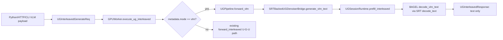

# ug-vlm-entrypoint-official-smoke design

## 0. 术语约定

- **VLM-only request**：输入为 `image + text`，输出只包含 text segment；不进入 latent prepare、G denoise、VAE decode 或 append image。
- **入口 smoke**：通过用户可调用入口验证同一条 VLM U path，而不是只跑测试内部 helper。
- **mode=vlm**：experimental UG payload 的内部模式开关。它不承诺 OpenAI-compatible API，只用于把请求分流到 VLM-only path。

## 1. 决策与约束

### 需求摘要

Phase 2 已经证明短 greedy VLM token/text 能和官方 BAGEL 对齐。Phase 3 要把这条 U path 接到真实入口：

- Python API：`DiffGenerator.generate_vlm(...)`。
- HTTP：`POST /v1/ug/vlm`。
- CLI：`--ug-vlm-input` / `--ug-vlm-output`。
- Worker/Pipeline：复用现有 `UGInterleavedGenerateReq` transport，按 `request.metadata["mode"] == "vlm"` 分流。

本 feature 不做：

- 不跑 G denoise，不生成图，不做编辑。
- 不修改普通 diffusion generate 路径。
- 不把 official BAGEL/seed 仓库函数 import 到 runtime。
- 不产品化多 session batching；只保持 per-request session 隔离和释放。
- 不要求完整 logits parity；本阶段验收看短 greedy text/token smoke。

### 挂载点清单

- `python/sglang/srt/ug/runtime.py` — 新增 VLM text generation result 类型和 fake runner 窄口。
- `python/sglang/srt/ug/adapter.py` — 透传可选 `decode_vlm_text` adapter hook。
- `python/sglang/srt/ug/bagel.py` — BAGEL backend 实现 official-like VLM greedy decode hook。
- `python/sglang/srt/ug/denoiser.py` — SRT-backed bridge 增加 `generate_vlm_text(...)`，只做 prefill + U decode。
- `python/sglang/multimodal_gen/runtime/pipelines/ug.py` — 增加 `forward_vlm(...)` 和 batch helper。
- `python/sglang/multimodal_gen/runtime/managers/gpu_worker.py` — 根据 `mode=vlm` 分流。
- `python/sglang/multimodal_gen/runtime/entrypoints/utils.py` — payload 解析支持 top-level `mode` / `max_new_tokens`。
- `python/sglang/multimodal_gen/runtime/entrypoints/diffusion_generator.py` — 增加 Python API convenience method。
- `python/sglang/multimodal_gen/runtime/entrypoints/http_server.py` — 增加 `/v1/ug/vlm` route。
- `python/sglang/multimodal_gen/runtime/entrypoints/cli/generate.py` — 增加 CLI VLM 输入输出参数。
- `python/sglang/multimodal_gen/test/unit/test_ug_diffusion_pipeline.py` — CPU 单测覆盖 VLM 分流、序列化和 worker route。

### 主流程

## 2. 验收闭环

最小闭环：

1. CPU 单测证明 `mode=vlm` 不进入 G stages，输出 text-only response。
2. Worker 单测证明同一 transport 能把 VLM 和 interleaved batch 分开执行。
3. CLI/HTTP/Python API 的 payload 构造都能把 `mode=vlm` 和 `max_new_tokens` 写入 request metadata。
4. 远端真权重 smoke 通过 `UGPipeline.forward_vlm` 或 Python API 得到和 Phase 2 相同的短 greedy文本。

Stop signal：

- 如果 VLM endpoint 需要走 `build_contexts_from_messages` 的 image-marker wait loop，说明仍然被 G pipeline 绑住，暂停重审。
- 如果 request 进入 latent/G denoise stage，暂停重审。
- 如果 session 释放无法保证，暂停重审。
