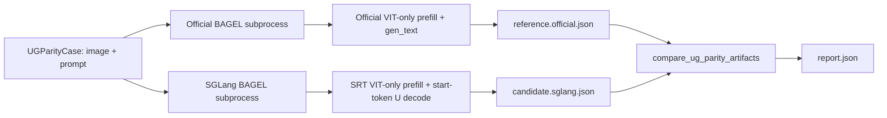

# ug-vlm-official-parity design

## 0. 术语约定

- **VLM parity case**：`UGParityCase(task="vlm")`，包含一张输入图、一个文本问题、固定 seed 和 greedy 文本生成参数。
- **VIT-only image prefill**：BAGEL 官方 `understanding_output=True` 时只把输入图走 VIT semantic branch，不走 VAE branch；SGLang VLM 对齐必须能表达这个模式。
- **BAGEL prompt packing**：BAGEL 官方 `prepare_prompts` 对每段文本使用 `[<|im_start|>] + tokenizer.encode(prompt) + [<|im_end|>]`，position ids 连续递增。
- **BAGEL text start token**：官方 `prepare_start_tokens` 在 VLM decode 前追加 `<|im_start|>` 作为 query token，然后才预测文本 token。
- **VLM generated token ids**：为了避免只看自然语言字符串掩盖差异，本 feature 在 parity artifact 里显式记录 generated token id 序列。

术语 grep 结果：

- `UGParityCase` / `UGParityArtifact` 已在 Phase 1 harness 中稳定。
- `ug_vlm` 当前没有旧实现，适合作为新 registered live test 命名。
- `prepare_prompts` 只存在于官方 BAGEL 代码，SGLang runtime 里还没有等价文本 packing；这是本 feature 的主要补齐点。

## 1. 决策与约束

### 需求摘要

本 feature 启动 Phase 2 第一条：对齐 image+text 到 text 的 VLM 路径。成功标准是：

- Phase 1 artifact schema 能显式记录 token id 序列，并能做字段级 exact diff。
- SGLang native BAGEL U-prefill 能表达官方 VLM 的 VIT-only image branch。
- SGLang native BAGEL U-prefill 的文本段按官方 BAGEL prompt packing 进入 SRT session，而不是走通用 tokenizer 占位逻辑。
- SGLang 能用 SRT session/KV 上下文追加 `<|im_start|>` 并做短 greedy U-decode，产出可比较的 token ids/text。
- 新增 opt-in live test，分别用 official BAGEL subprocess 和 SGLang subprocess 对同一 VLM case 写出 artifact/report。

本 feature 不做：

- 不对齐 text-to-image、image-edit、CFG、denoise sampling。
- 不引入 official BAGEL/seed repo import 到 `python/sglang/**` runtime。
- 不改变普通 OpenAI-compatible server API。
- 不做多卡、多 session batching 或吞吐优化。
- 不把 VLM mismatch 偷偷吞掉；live test 要么 pass，要么留下可读 report 作为 stop signal。

本 feature 不新增用户可感产品能力，无对应 requirement。

### 挂载点清单

- `python/sglang/srt/ug/parity.py` — 修改：`UGParityArtifact` 增加 token id artifact 字段和 comparator。
- `python/sglang/srt/ug/runtime.py` — 修改：新增窄口 SRT U text decode，支持 BAGEL `<|im_start|>` 这类显式 start token。
- `python/sglang/srt/ug/bagel.py` — 修改：native BAGEL backend 增加官方文本 packing 和 VIT-only image prefill 模式。
- `python/sglang/multimodal_gen/test/unit/test_ug_official_parity.py` — 修改：补 token id diff 单测。
- `python/sglang/multimodal_gen/test/unit/test_ug_bagel_adapter.py` — 修改：补官方文本 packing / VIT-only image prefill 单测。
- `test/registered/scheduler/test_bagel_vlm_official_parity.py` — 新增：disabled/opt-in 真权重 VLM official parity smoke。
- `codestable/roadmap/ug-official-alignment/ug-official-alignment-items.yaml` — 修改：本 item 进入 `in-progress` 并绑定 feature 目录。

### 复杂度档位

本 feature 是内部对齐测试 + runtime 窄口修正，走 team-readable / L2 robustness / reasonable performance 默认档位。偏离点：

- 对 live test 的可观测性要求更高：失败时必须写出 official/candidate/report artifact，方便判断是不是继续推进还是停下重审。

### 关键决策

- VLM 对齐先跑 greedy 短文本，不先做采样质量对齐；采样和 CFG 留给后续 roadmap item。
- SGLang candidate 不通过 BAGEL Python inferencer 走捷径；U-prefill/U-decode 都必须经过 SRT session 和 ModelRunner。
- VLM 输入图默认用 VIT-only mode，只有生成/编辑路径才继续默认 VAE+VIT。
- Token id exact diff 是主证据；text exact diff 作为人读方便的补充证据。
- 如果 live report mismatch，先停在 VLM 语义差异分析，不继续推进 T2I/Edit。

### 主流程概述



## 2. 接口契约

### Token id artifact

```python
reference = UGParityArtifact(
    case_id="vlm-smoke",
    runner="official",
    task="vlm",
    text="a woman standing by the sea",
    token_ids={"generated": (151644, 264, 3491)},
)
candidate = UGParityArtifact(
    case_id="vlm-smoke",
    runner="sglang",
    task="vlm",
    text="a woman standing by the sea",
    token_ids={"generated": (151644, 264, 3491)},
)
report = compare_ug_parity_artifacts(reference, candidate)
assert report.passed
# 来源：python/sglang/srt/ug/parity.py UGParityArtifact / compare_ug_parity_artifacts
```

### VIT-only UG message

```python
messages = [
    UGInterleavedMessage(
        type="image",
        content={"image": pil_image, "vae": False, "vit": True},
    ),
    UGInterleavedMessage(type="text", content="Describe the image."),
]
handle = runtime.prefill_interleaved(messages, session_id="vlm-parity")
# 来源：python/sglang/srt/ug/bagel.py BAGELInterleaveContextBackend.prepare_srt_u_message_inputs
```

### SRT U text decode

```python
decode = runtime.decode_text(
    handle,
    max_new_tokens=7,
    start_token_id=adapter.backend.inferencer.new_token_ids["bos_token_id"],
)
generated_token_ids = (start_token_id,) + decode.output_ids
# 来源：python/sglang/srt/ug/runtime.py UGSessionRuntime.decode_text
```

### Opt-in live entry

```bash
CUDA_VISIBLE_DEVICES=6 \
SGLANG_TEST_BAGEL_OFFICIAL_REPO=/data/BAGEL \
SGLANG_TEST_BAGEL_QWEN2_MOT_MODEL=/data/models/BAGEL-7B-MoT \
SGLANG_TEST_BAGEL_PARITY_OUTPUT=/tmp/ug-vlm-parity \
python3 test/registered/scheduler/test_bagel_vlm_official_parity.py
# 来源：test/registered/scheduler/test_bagel_vlm_official_parity.py
```

预期行为：

- env 缺失：skip，不加载官方 repo。
- env 齐全：依次跑 official subprocess 和 SGLang subprocess，写出 `case.json`、`reference.official.json`、`candidate.sglang.json`、`report.json`。
- report pass：VLM 最小结果闭环完成。
- report fail：保留 token/text diff，暂停 Phase 2 后续 T2I/Edit。

## 3. 实现提示

### 改动计划

- 扩展 Phase 1 artifact schema 的 token id 表达能力。
- 把 BAGEL 文本 U-prefill 从通用 UG tokenizer 改成官方 prompt packing。
- 给 image message 增加 BAGEL modality hint，支持 VLM 的 VIT-only branch。
- 增加 SRT-owned U text decode 窄口，支持显式 start token。
- 新增真权重 opt-in VLM parity registered test。

### 实现风险与约束

- 官方 `generate_text(max_length=N)` 返回的序列包含起始 `<|im_start|>`，SGLang candidate 需要用 `max_new_tokens=N-1` 并把 start token 拼回 artifact 后再比较。
- 如果 SGLang session append 时错误剥离 `<|im_start|>`，第一 token 会直接错；测试要记录完整 token ids。
- VLM parity 必须用 VIT-only image prefill；如果误走 VAE+VIT，会把生成/编辑语义混进理解路径。
- 远端真权重测试只能使用空卡；默认 disabled，手工运行前必须检查 `nvidia-smi`。

### 推进顺序

1. **Artifact token ids**：扩展 `UGParityArtifact` 和 comparator。
   退出信号：CPU 单测能制造 token id mismatch 并得到字段级 diff。
2. **Native BAGEL U input parity**：实现官方文本 packing 和 VIT-only image prefill。
   退出信号：unit test 证明 text input ids 是 `[bos] + encode(text) + [eos]`，VLM image 只生成 VIT segment。
3. **SRT U text decode narrow口**：新增 `UGSessionRuntime.decode_text(...)`。
   退出信号：unit test 证明 start token request 进入 SRT session，返回 output ids 并更新 debug counters。
4. **VLM live parity entry**：新增 opt-in registered test，复用 Phase 1 artifact/report。
   退出信号：env 缺失 skip；env 齐全时 official/SGLang subprocess 都能写 artifact。
5. **真权重验证与收口**：在空卡上跑一次 live test。
   退出信号：report passed 则本 item 可进入 acceptance；report failed 则把 diff 作为 stop signal，不继续 T2I/Edit。

### 测试设计

- `test_report_fails_with_token_id_diff`：token id 不同时 comparator 输出 `token_ids.generated` diff。
- `test_native_srt_text_prefill_uses_bagel_prompt_packing`：文本段不走通用 tokenizer，input ids/position ids/rope 与官方 packing 一致。
- `test_native_srt_vlm_image_prefill_can_use_vit_only`：`{"vae": False, "vit": True}` 只创建 VIT SRT segment。
- `test_decode_text_materializes_start_token_request`：显式 start token 进入 U-decode request，output ids 可读。
- `test_bagel_vlm_official_parity.py`：opt-in 真权重 official vs SGLang VLM smoke。

### 2026-04-30 验证收口

- text-only 真权重路径 exact match，证明 SRT native BAGEL/Qwen text packing、显式 start token decode、logical rope decode 窄口方向正确。
- image+text 路径里 `vit_packed_sequence` 与官方 bitwise match，证明 VIT preprocessing、SigLIP、connector 和 VIT position embedding 输入已经对齐。
- live harness 曾发现 SRT 将 UG non-causal image block 按 `chunked_prefill_size=256` 切开，导致 candidate `image_block_hidden` 只有 `[256, 3584]`；已改为 UG non-causal query request 不走 chunked prefill，并补 CPU 单测。
- 修复后 candidate `image_block_hidden` 形状对齐到 `[3852, 3584]`，但 hidden 数值与 greedy token 仍未对齐；这是当前 stop signal，不能继续进入 T2I/Edit。

## 4. 与项目级架构文档的关系

Acceptance 时需要更新 `codestable/architecture/ug-runtime.md`：

- **名词**：VLM parity case、VIT-only image prefill、BAGEL prompt packing、BAGEL text start token、token id artifact。
- **动词骨架**：SRT candidate 的 VLM flow：VIT-only image prefill -> official text packing -> start-token U decode -> parity artifact。
- **跨层纪律**：VLM 对齐不得走 VAE image branch；不得 import official BAGEL runtime 到 `python/sglang/**`；token id mismatch 是 Phase 2 stop signal。
