# Phase 1 — Cross-Implementation Survey: Three "Double Sparsity" Codebases

> **Scope.** Phase 1 deliverable per `development/past_implementations/plan.md` §"Required Content For `00-survey.md`" (lines 58–72). Audience: an ML engineer aiming to bring a *minimal yet highly performant, sglang-native* double-sparsity (DS) path to modern models like **DeepSeek-V3.2** and **GLM-5.1**, reusing sglang infrastructure but treating performance as a first-class concern.
>
> Every non-trivial claim cites a file path (and where useful, a line range or symbol). **Observed** = directly visible in code/config/tests. **Inferred** = strongly suggested by structure but not explicitly stated. **Unknown** = not establishable from these repos.
>
> **Diagrams.** Mermaid sources are committed under `diagrams/*.mmd` (the editable source of truth per the plan). They're embedded as fenced ```mermaid blocks below — GitHub and most Markdown viewers render them natively. To export `.svg` locally: `npx -p @mermaid-js/mermaid-cli mmdc -i diagrams/01-paper-ds-concept.mmd -o diagrams/01-paper-ds-concept.svg` (requires Chromium for Puppeteer; SVG render was attempted in this environment but the headless-browser dep wasn't available).

---

## 1. The Paper's Intended Concept (reference: 2408.07092)

"Post-Training Sparse Attention with Double Sparsity" combines **two orthogonal axes of sparsity** at decode time:

1. **Offline channel sparsity** (per-head, static).
   - For each attention head, only a small subset of the `head_dim` channels carries most of the dot-product signal of `Q·Kᵀ`.
   - The channel index set is precomputed once per checkpoint on a small calibration set (e.g. Pile val, 256 samples × 512 tokens) by collecting `mean(|Q · K|)` per channel and taking the top-`r` per head.
   - Output is a JSON `{layer.proj : [[ch...] per head]}` artifact.

2. **Online token sparsity** (per-decode-step, dynamic).
   - At each decode step, project the current `Q` onto its head's heavy channels (yielding `Q_label`).
   - Cheaply estimate full attention logits via `Q_label · K_labelᵀ` over the entire past, where `K_label` is a precomputed compressed cache `[B, S, H, r]` built channel-wise during prefill.
   - Top-k those approximate logits → a small set of past-token indices.
   - Run real (full-channel) attention only on the selected indices.

3. **Optional CPU-offloaded full KV cache** (paper §"DS-Offload").
   - The label cache is GPU-resident and small (`H·r` instead of `H·D`).
   - The full `K,V` lives in pinned CPU memory; selected rows are gathered to GPU per step.
   - GPU only ever materializes the heavy slice, enabling larger contexts.

**Key property.** Both axes are *post-training*; no fine-tuning. The "double" in double sparsity refers specifically to **(channel-axis sparsity) × (token-axis sparsity)** — two cuts of the same `Q·Kᵀ` matrix.

### 1.1 Concept diagram (paper)

Source: [`diagrams/01-paper-ds-concept.mmd`](diagrams/01-paper-ds-concept.mmd). Rendered inline:

```mermaid
flowchart TB
    classDef offline fill:#e8f5e9,stroke:#2e7d32,color:#1b5e20
    classDef online  fill:#e3f2fd,stroke:#1565c0,color:#0d47a1
    classDef offload fill:#fff3e0,stroke:#e65100,color:#bf360c,stroke-dasharray: 4 4

    subgraph OFF [Offline · once per checkpoint]
        Calib["Calibration<br/>Pile val 256 × 512<br/>collect mean&#124;Q·K&#124; per channel"]
        CC["Channel config (JSON)<br/>{layer.proj → [[ch...] per head]}"]
        Calib --> CC
    end
    class Calib,CC offline

    subgraph PRE [Online · Prefill]
        K["Full K cache<br/>shape B·H·S·D"]
        KL["Label cache K_label<br/>shape B·H·S·r  (r ≪ D)"]
        K -->|"gather r heavy channels"| KL
    end
    class K,KL online

    subgraph DEC [Online · Decode step t]
        Q["Query Qₜ"]
        QL["Q_label  (B·H·r)"]
        Q -->|"gather r heavy channels"| QL
        SCORE["approx scores<br/>Q_label · K_labelᵀ<br/>shape B·H·S"]
        QL --> SCORE
        KL --> SCORE
        TK["top-k token indices<br/>B·H·k"]
        SCORE -->|"torch.topk (k tokens)"| TK
        OUT["sparse attention<br/>softmax(Q·K[TK]ᵀ)·V[TK]"]
        TK --> OUT
        Q --> OUT
        K --> OUT
    end
    class Q,QL,SCORE,TK,OUT online

    CC -.->|"per-head ch indices"| KL
    CC -.-> QL

    subgraph OFL [Optional · DS-Offload]
        CPUKV["CPU pinned K,V<br/>full size"]
        GATHER["DGL gather_pinned_tensor_rows"]
        CPUKV -->|"selected rows only"| GATHER
    end
    class CPUKV,GATHER offload
    K -.->|"materialize only top-k"| CPUKV
    GATHER -.-> OUT
```



Reading the diagram. **Observed (paper):** the offline branch (green) is run once per checkpoint and produces a static JSON. The online branch (blue) consumes the JSON to maintain `K_label` (a per-prefill compressed K) and to compute approximate scores → top-k → sparse attention at every decode step. The DS-Offload branch (orange, dashed) is optional: it keeps the full `K,V` on pinned CPU and gathers only the top-k rows per step. **Mapping to the three repos:** A implements the green + blue + orange branches; B implements green (via A) + blue (GPU-only) and **omits orange**; C implements blue but uses a selector/pruner pipeline rather than the paper's direct top-k (see §5.1).

---

## 2. Repository Maps

### 2.1 Implementation A — `DoubleSparse` (the paper-authors' research repo)
- **Kind.** Standalone, research-grade. Loosely modelled on Meta GPT-Fast. PyTorch 2.5.1 + Triton 3.1.0.
- **Three coexisting flavours** of the algorithm in one repo:
  - **Standalone (GPT-Fast style)** — `models/model.py`, especially `Attention.sparse_forward()` at lines 265–294, with custom `KVCache` (71–96) and `init_model_channel_config` / `permute_channel_config` (348–366).
  - **HF-transformers adapter** — `evaluation/modify_llama.py` `LlamaAttention_heavy_hitter.forward()` (83–273), plus `convert_kvcache_llama_heavy_recent()` and `convert_llama_channel_config()` (277–307); analogues for Mistral, Mixtral, Qwen2.
  - **CPU-offload** — `offloading/model.py:82–148 KVCache` with GPU label cache + CPU-pinned full KV; DGL `gather_pinned_tensor_rows()` (138–142).
- **Entry points.**
  - Calibration: `config/offline_calibration.py` (hook captures `mean(|Q·K|)` per channel; `get_qk_hook()` lines 91–93).
  - Standalone gen: `models/generate.py`.
  - HF eval: `evaluation/perplexity_eval.py`, `evaluation/mmlu.py`, `evaluation/retrieval_eval.py`, `AIME/aime.py`, `LongBench/pred.py`.
  - Kernel micro-bench: `scripts/run_attn.sh` → `models/triton_kernels/attention.py`.
- **Custom Triton kernels.** `models/triton_kernels/channel.py:get_label_tensor()`; `models/triton_kernels/sparse.py:fwd_sparse_no_mask()` (kernel at 107–152). No CUDA C++.
- **Artifacts shipped.** 13+ pre-computed channel-config JSONs under `config/<owner>/<model>.json` (e.g. `config/meta-llama/Llama-2-7b-hf.json` ~3.1 MB).

### 2.2 Implementation B — `sglang-last-with-double-sparsity` (sglang fork)
- **Kind.** A snapshot of SGLang main *immediately before* the DS removal commit `44e67c683` (#23009, 2026-04-17). All DS code present and readable. Total DS LOC: ~1,700.
- **DS git history (relevant only).** `061e54631` initial (#1459), `ea34350d8` config rename (#2188), `ad26f298e` init fix (#6905), `44e67c683` removal (#23009).
- **Surface area.**
  - CLI flags: `python/sglang/srt/server_args.py:595–600` (dataclass), `5641–5673` (argparse): `--enable-double-sparsity`, `--ds-channel-config-path`, `--ds-heavy-channel-num`, `--ds-heavy-channel-type`, `--ds-heavy-token-num`, `--ds-sparse-decode-threshold`.
  - KV pool: `python/sglang/srt/mem_cache/memory_pool.py:1972–2060` `DoubleSparseTokenToKVPool` (adds `label_buffer`).
  - Attention backend: `python/sglang/srt/layers/attention/double_sparsity_backend.py` (258 lines).
  - Triton kernels: `python/sglang/srt/layers/attention/triton_ops/double_sparsity_attention.py` (1,106 lines).
  - Channel-config loader: `python/sglang/srt/model_executor/model_runner.py:2160–2171 init_double_sparsity_channel_config()`.
  - Backend dispatch: `python/sglang/srt/layers/attention/attention_registry.py:101–106`.
  - Hard constraints in model-runner (line 927–932): `attention_backend = "triton"`, `disable_cuda_graph = True`.
- **Test.** `test/manual/test_double_sparsity.py` (66 lines, Llama-3.1-8B-Instruct, MMLU-64 ≥ 0.65); config at `test/manual/double-sparsity-config-Llama-3.1-8B-Instruct.json`.
- **No calibration code** — config generation is delegated to repo A.
- **DS-Offload not ported.** `DoubleSparseTokenToKVPool` (`memory_pool.py:1972–2060`) allocates all three buffers (k, v, label) with `device=device` (GPU). No CPU-pinned twin, no double-buffer prefetch stream, no `gather_pinned_tensor_rows` analogue. The parent `MHATokenToKVPool` does have `cpu_offloading_chunk_size = 8192` (`memory_pool.py:676`) and `alt_stream` (line 98) but `DoubleSparseTokenToKVPool` does **not** override anything to use them — they serve the non-DS chunked-prefill path. The paper's DS-Offload variant exists only in repo A (`offloading/model.py:82–148`).

### 2.3 Implementation C — `Twilight` (follow-up generalization framework)
- **Kind.** A research framework that generalizes DS into a pipeline. Not a direct DS reimplementation. PyTorch 2.5 + flashinfer-python 0.2.0.post1 + flash-attn 2.6.3.
- **Surface.**
  - Orchestrator: `twilight/pyimpl/attention.py:attention_forward()` (60–339) — monkey-patches `LlamaAttention.forward` / `MistralAttention.forward` via `enable_sparse_attention()` (484–494).
  - Selectors (`IndexSelectorType`): `pyimpl/quest.py` (Quest, 17–122), `pyimpl/double_sparse.py` (DS, 22–122), `pyimpl/sparq.py` (SparQ, 16–59), `pyimpl/top_k.py` (Oracle), `pyimpl/streaming_llm.py`, `pyimpl/tidal_decode.py`.
  - **Weight pruner (the novelty)**: `pyimpl/top_p.py:10–15 top_p_unnormalized()`, `pyimpl/elementwise_threshold.py:9–18`. CUDA: `csrc/src/sampling.cu:22–63` + `csrc/include/sampling.cuh:121 TopPReturnMask<T>`, loaded via FlashInfer JIT at `twilight/kernel/cuda/sampling.py:49–106`.
  - Weight estimators: `pyimpl/quantize.py:4–25` (min-max / max per-token quant).
  - Triton kernels: `twilight/kernel/triton/channel.py:11–79 get_label_tensor_kernel`, `bgemv_int8.py:12–73`, `qk_int8_per_block.py:23–97`.
  - Config blocks: `compressor`, `selector`, `weight_estimator`, `weight_pruner` (see `benchmark/configs/config_ds_twi.json`, `config_quest_twi.json`).
  - **`flash-topk-attention/` git submodule** — empty until `git submodule update --init`; populated from `tsinghua-ideal/flash-topk-attention` (pinned commit `d8803b2`). Kernels (CUDA via FlashInfer JIT + Triton; TileLang backend is a stub) DID land upstream but Twilight's runtime never imports them — the only call site is `benchmark/efficiency/bench_gemv.py:8–10` (GEMV microbench). See `05-flash-topk-attention.md`.
  - **No calibration code.** Configs hardcoded to external paths like `/data/chaofan/DoubleSparse/config/…`.
- **Entry points.** `benchmark/LongBench/pred.py`, `benchmark/passkey/passkey.py`, `benchmark/RULER/scripts/`, `benchmark/efficiency/bench_gemv.py`.

---

## 3. Side-by-Side Comparison

| Axis | **A — DoubleSparse (research)** | **B — sglang-last (production-integrated)** | **C — Twilight (framework)** |
|---|---|---|---|
| Apparent purpose | Paper artifact; multi-flavour reference | Production decode-time speedup in SGLang | Generalize selector/pruner pipeline |
| What is sparse | Channels (offline, static) × tokens (online, dynamic) | Channels (offline, static) × tokens (online, dynamic) | Selector mask × pruner mask (a *different* pair of axes) |
| Sparse object granularity | Per-head channel indices; per-step token top-k | Per-head channel indices; per-step token top-k | Per-step token mask from selector; per-step element-wise mask from pruner |
| Sparsity structure | Index-based (top-k token indices + heavy-channel index list) | Index-based (top-k indices via `torch.topk`) | Two boolean masks combined with AND (`mask = mask & pruned_mask`, `attention.py:280–281`) |
| When applied — calibration | Yes: `config/offline_calibration.py` | **External** (re-uses A's tool, `test/manual/test_double_sparsity.py:25` cites A) | **External** (delegated to A; configs hardcoded to local paths) |
| When applied — prefill | Builds label cache; attention is dense (HF adapter does soft-mask on layers ≥ 2 even at prefill) | Always dense; label cache populated at extend (`double_sparsity_backend.py:128–139`) | Full flash-attn prefill; optional `snap_kv` compressor |
| When applied — decode | Sparse: top-k token select + gather + sparse Triton attn | Sparse: 3-stage Triton (estimate → CPU topk → gather+attn → reduce) **iff** `max_seq_len ≥ sparse_decode_threshold AND min_seq_len ≥ heavy_token_num` (lines 211–214) | Mask-driven full attention: `mask_score = softmax(QKᵀ); mask = mask & pruned_mask` then re-softmax |
| When applied — offload | Yes: `offloading/model.py` with DGL `gather_pinned_tensor_rows` (sync-ness uncertain) | **DS-Offload deferred.** `DoubleSparseTokenToKVPool` keeps k/v/label all on GPU; parent's `cpu_offloading_chunk_size` / `alt_stream` not used by DS path | **No** offload path |
| Sparse storage? | A-Standalone & A-Offload: yes (compressed K labels separate; offload: KV on CPU). HF adapter: dense + mask. | Yes for the label cache (`label_buffer[size+1, head_num, r]`, ~`r/D` of full size). Full KV still resident. | Yes (compressed `K_label` int8) — for the *selector* only. Full KV is kept and attended dense. |
| Sparse compute? | Yes: dedicated `fwd_sparse_no_mask` kernel reads only top-k positions | Yes: stage-2 kernel reads only top-k positions (`_sparse_fwd_kernel_flash_decode_stage2`) | **No fused sparse-compute kernel wired into runtime** — pruner mask is applied to a *dense* attention; speedup rests on un-fused path. The `flash-topk-attention` (ftka) library exists upstream (CUDA + Triton; TileLang stub) but is invoked only from the GEMV microbenchmark — see `05-flash-topk-attention.md`. |
| Kernel surface | Triton only | Triton only (HIP path present too) | Triton (selector) + CUDA C++ via FlashInfer JIT (pruner `TopPReturnMask`) |
| CUDA graphs | N/A | **Disabled** (`model_runner.py:932`) | N/A (monkey-patched HF model) |
| Models supported | LLaMA / Mistral / Mixtral / Qwen2 / DeepSeek-R1-Distill-Qwen-32B via per-model `modify_*.py` adapters | Any model whose attention layers are named `model.layers.<i>.self_attn.{q,k}_proj` and that uses the standard Triton attn backend — **no MLA / DeepSeek-V3.2 / GLM coverage** | LLaMA / Mistral (monkey-patched) |
| TP / PP | None | Untested (likely transparent for Triton path) | None |
| Tests / accuracy gates | WikiText-2 PPL, MMLU, LongBench, AIME, IfEval, LCB | One MMLU-64 ≥ 0.65 manual test | LongBench / Passkey / RULER (eval scripts, no accuracy gates) |
| Pinned deps | torch 2.5.1, triton 3.1.0, transformers 4.47.1, DGL/cu121, xformers 0.0.28.post3 | inherits sglang | torch 2.5.0, flashinfer 0.2.0.post1, transformers 4.45.2, flash-attn 2.6.3 |
| Evidence confidence | High (multiple flavours all readable; some open Qs on offload async) | High (small surface; one master orchestrator + 3 kernels) | High for what *is* there; the missing fused kernel limits performance reasoning |
| Major open question | Why was "Method 1" (mean \|Q·K\|) chosen over alternatives 3–5 still commented in `get_qk_hook()`? Is offload `gather_pinned_tensor_rows` truly async? | Why was DS removed in #23009? (No rationale in commit msg.) How would label-cache & dynamic top-k interact with CUDA graphs and MLA's latent KV? | Why are ftka kernels orphaned (built but never imported by the runtime)? Un-fused vs fused perf numbers? Channel-config provenance? |

---

### 3.1 Side-by-side pipeline diagram

Source: [`diagrams/02-three-impls-pipelines.mmd`](diagrams/02-three-impls-pipelines.mmd). Rendered inline:

```mermaid
flowchart LR
    classDef good   fill:#e8f5e9,stroke:#2e7d32,color:#1b5e20
    classDef caveat fill:#fff3e0,stroke:#e65100,color:#bf360c
    classDef bad    fill:#ffebee,stroke:#c62828,color:#b71c1c
    classDef ext    fill:#f3e5f5,stroke:#6a1b9a,color:#4a148c,stroke-dasharray:3 3

    subgraph A ["A — DoubleSparse (research)"]
        A1["calibration<br/>config/offline_calibration.py"]:::good
        A2["JSON channel config<br/>config/*.json (13+ shipped)"]:::good
        A3["label cache (GPU)<br/>models/model.py KVCache.k_label"]:::good
        A4["sparse Triton kernel<br/>triton_kernels/sparse.py fwd_sparse_no_mask"]:::good
        A5["[opt] CPU-pinned K,V<br/>offloading/model.py + DGL gather"]:::caveat
        A1 --> A2 --> A3 --> A4
        A2 -.-> A5 -.-> A4
    end

    subgraph B ["B — sglang fork (decode-only)"]
        B1["external JSON config<br/>(reuses A's tool)"]:::ext
        B2["DoubleSparseTokenToKVPool<br/>memory_pool.py:1972-2060<br/>k+v+label ALL GPU"]:::good
        B3["3-stage Triton<br/>BGEMV → torch.topk (host) → sparse attn → reduce"]:::caveat
        B4["DS-Offload<br/>NOT PORTED"]:::bad
        B5["CUDA graphs<br/>DISABLED (model_runner.py:927-932)"]:::bad
        B1 --> B2 --> B3
        B2 -.x B4
        B3 -.x B5
    end

    subgraph C ["C — Twilight (framework)"]
        C1["external JSON config<br/>(hardcoded /data/chaofan/...)"]:::ext
        C2["selector<br/>DS or Quest or SparQ ...<br/>(internal r-channel quant)"]:::good
        C3["weight_estimator<br/>(quantize full K → approx scores)<br/>NOT paper-DS"]:::caveat
        C4["pruner<br/>top-p mask (CUDA TopPReturnMask)<br/>or threshold"]:::good
        C5["mask = selector & pruner<br/>applied to DENSE attn (un-fused)"]:::caveat
        C6["ftka kernels (raft_topk, sparse-GEMV)<br/>EXIST UPSTREAM but never imported"]:::bad
        C1 --> C2 --> C3 --> C4 --> C5
        C5 -.x C6
    end
```

**Legend.** Green = paper-faithful & wired. Orange = present but with caveats (caveats noted in the node). Red = absent / disabled / orphaned. Purple-dashed = external dependency. **Headline observations:** A is the only repo that ships calibration AND end-to-end sparse compute AND optional offload; B implements the GPU-resident half and explicitly disables CUDA graphs because of host-side `torch.topk`; C never wires the ftka kernel library into its runtime path and applies its masks to a dense attention.

---

## 4. Proposed Common Vocabulary

> Used consistently across the Phase-2 documents. Where a repo uses a different name, we will annotate.

| Term | One-line definition |
|---|---|
| **Sparse object** | The tensor or index set whose representation is sparser than the dense baseline (here: heavy-channel index list; top-k past-token index list; or boolean mask). |
| **Sparse representation** | The actual on-device storage: index tensor `[H, r]`, top-k tensor `[H, B, k]`, or boolean mask `[B, H, S]`. |
| **Label cache** | The per-layer compressed K projection used to *estimate* attention scores cheaply; shape `[S, H, r]` (or with batch). Populated during prefill. (A: `KVCache.k_label`; B: `label_buffer`; C: `K_Label` int8.) |
| **Channel config** | The static, offline-calibrated per-layer, per-head index set of heavy channels. Shape `[L][num_heads, r]` of int. |
| **Token budget** (`heavy_token_num`, `heavy_const`) | Number of past tokens kept per decode step after the selector. |
| **Heavy channel count** (`r`, `heavy_channel_num`) | Number of channels retained per head for the label cache. |
| **Selector** | Stage that produces a candidate set of past-token indices to attend over. (A: top-k of `Q_label·K_labelᵀ`; B: same, in 3-stage Triton; C: pluggable — Quest/DS/SparQ/StreamingLLM/etc.) |
| **Pruner** | A *second* stage that further removes mask entries from the selector's candidates (Twilight-specific; e.g. top-p over cumulative softmax, or threshold). |
| **Weight estimator** | The cheap proxy used to score candidates (raw `Q_label·K_label`, or quantized variants). |
| **Decode threshold** | Minimum sequence length (or condition) at which the sparse path activates; below it the implementation falls through to dense decode. (B: `--ds-sparse-decode-threshold`, default 4096.) |
| **Dense fallback** | The non-sparse decode kernel used when the threshold is not met or for the first layer(s) of the network. (A HF adapter skips sparsity for `layer_idx < 2`; C has `skip_first_two_layers`.) |
| **Sparse storage** | Whether KV (or its label) is materially smaller than dense KV. |
| **Sparse compute** | Whether the attention kernel actually reads only the selected indices (vs dense attn × boolean mask). |
| **Static sparsity** | Determined offline once (channels). |
| **Dynamic sparsity** | Determined per-step (top-k tokens, masks). |

### 4.1 Clarification — Twilight has *two* distinct quantization steps (only one of which is paper-DS)

This is a frequent source of confusion in the Twilight code and configs. They sit on different sides of the selector boundary and operate on different tensor shapes.

| | **Step 1 — selector-internal quant** | **Step 2 — `weight_estimator` quant** |
|---|---|---|
| Paper-DS native? | **Yes** — this is "store the label cache in 4-bit" (paper §4.2) | **No** — Twilight's own machinery for feeding the pruner |
| Knob | `selector.quant_bit` (DS configs set this to 2) | `weight_estimator.quant_bit` (typically 4) |
| Tensor quantized | `key_label` — heavy-channel slice of K, shape `[B, H, S, r]` (r ≪ head_dim) | `key_states` — **full K**, shape `[B, H, S, head_dim]` |
| Code | `pyimpl/double_sparse.py:86–87`: `if quant_bit < 32: key_label = min_max_per_token_quant_kv(key_label, quant_bit)` | `pyimpl/attention.py:247–254`: `quantized_key = min_max_per_token_quant_kv(key_states, ...); estimated_weights = Q @ quantized_keyᵀ` |
| Purpose | Feed the **selector**'s cheap BGEMV → top-k indices | Feed the **pruner** (top-p / threshold) with un-normalized score-like values that approximate the real `Q·Kᵀ` |
| Active when | DS selector is selected | `weight_pruner.type ≠ NONE` (any selector) |

**Paper-DS does not have Step 2.** A Twilight config with `weight_pruner.type = none` reduces DS to vanilla paper-DS — `weight_estimator` is never invoked. The whole `weight_estimator + weight_pruner` pipeline is Twilight's contribution layered on top of any selector.

The pyimpl reference computes the **real** `attn_weights` anyway (`pyimpl/attention.py:188`) because, per the file header comment at `pyimpl/double_sparse.py:3`, *"this Python version is just for testing accuracy, not for efficiency"*. In a fused production implementation, Step 1 would produce the selector mask, Step 2 would compute approximate scores **only over the selector-surviving tokens**, and the real attention would never be computed — the two quantizations exist on different tensor shapes precisely because they sit on opposite sides of the selector boundary.

---

## 5. Initial Finding — The Three Are NOT Directly Comparable Without Qualification

The three repos all label themselves "double sparsity" but mean *materially different things*. An honest cross-comparison must reduce them to a common axis first.

### 5.1 The three definitions of "double"

| | First axis | Second axis | Are these orthogonal axes of `Q·Kᵀ`? |
|---|---|---|---|
| **A (paper)** | Channels (offline, static, per-head) | Tokens (online, dynamic, per-step) | **Yes** — channel-cut × token-cut |
| **B (sglang)** | Channels (offline, static, per-head) | Tokens (online, dynamic, per-step) | **Yes** — same as A, decode-only |
| **C (Twilight)** | Selector mask (token-cut) | Pruner mask (element-wise mask, possibly *within* the selected tokens) | **No** — these are *sequential refinements of the same token-axis mask*. The "double" here means "two stages of attention-mask construction," not "two sparsity dimensions." |

This is the single most important framing to carry into Phase 2: **C is not a double-sparsity implementation in the A/B sense.** It is a generalized sparse-attention framework that subsumes DS as one of seven selectors and adds a pruner pipeline. Engineers porting "DS from C" to sglang would in fact be porting Twilight's selector+pruner abstraction, not the paper's channel×token decomposition.

### 5.2 Production-vs-research character

- **A** is research-grade and standalone: multiple flavours (HF adapter / GPT-fast standalone / CPU-offload) coexist with calibration scripts, micro-bench scripts, and 13+ shipped configs. It is the most complete *algorithmic* reference but is not designed to drop into a serving stack.
- **B** is a *minimal, decode-only, triton-only*, sglang-integrated path that takes ~1,700 LOC across one backend + one Triton file + one KV-pool subclass. **It was removed from main on 2026-04-17 (commit `44e67c683`, PR #23009) with no rationale in the commit message.** This is the closest thing to a working "production" DS in SGLang, and inspecting *why* it was removed (maintenance? coverage? MLA?) is a critical Phase-2 question.
- **C** is a framework whose central perf promise — fused sparse attention — was never wired into the runtime path. The `flash-topk-attention` kernels DO exist upstream (now fetched: `csrc/` CUDA via FlashInfer JIT + `ftka/triton_ops/`; TileLang backend is an empty file) and are invoked only by `benchmark/efficiency/bench_gemv.py`. The Twilight accuracy numbers in the README were therefore produced with the un-fused path. See `05-flash-topk-attention.md` for the kernel-level analysis, including which ftka kernels are most reusable for the sglang-on-MLA port (headline: `raft_topk` solves B's CUDA-graph-blocking host-side `torch.topk` problem).

### 5.3 Coverage gaps for the stated target (DeepSeek-V3.2 / GLM-5.1)

None of the three repositories supports MLA-style attention out of the box:
- A's adapter files (`modify_llama.py`, `modify_qwen2.py`, …) all assume `q_proj` / `k_proj` are independent linear layers producing `[B, H, S, D]` K and V. MLA collapses K and V into a low-rank latent and reconstructs per-head views; the calibration target (per-head, per-channel `mean(|Q·K|)`) and the label-cache layout (`[S, H, r]`) need redesign.
- B's channel config keys are literally `"model.layers.<i>.self_attn.<q|k>_proj"`; MLA layers have different module names and shapes. The label buffer is shaped against `head_num` and `head_dim` of the dense projection.
- C inherits A's config format and only supports LLaMA / Mistral via monkey-patch.

**Inferred consequence.** A minimal sglang-native DS for DeepSeek-V3.2 / GLM-5.1 cannot be a literal port of any of the three; it requires (i) redefining "channel" in the MLA latent space (or in the per-head reconstructed Q), (ii) a new label-cache layout that respects MLA's shared-KV factorization, and (iii) a decode-time selector kernel that integrates with sglang's MLA attention backend rather than the dense Triton path B used.

### 5.4 Sparse-storage vs sparse-compute breakdown

This is the cleanest single-axis comparison and the one we'll carry to Phase 2:

| | Sparse storage | Sparse compute |
|---|---|---|
| A-Standalone | label cache (~r/D smaller) | yes — `fwd_sparse_no_mask` |
| A-HF-adapter | none (dense + soft mask) | no — dense attn with `-inf` mask |
| A-Offload | full KV on CPU (largest storage win) | yes — sparse Triton on gathered slice |
| B | label cache | yes — 3-stage sparse Triton |
| C-DS-selector | int8 label cache | **no** — dense attn × bool mask |
| C-pruner stage | n/a | no |

**Observed.** Only A-Standalone, A-Offload, and B realize *both* sparse storage and sparse compute. C realizes neither end-to-end (the int8 label cache is per-step transient, and the final attention is dense-masked).

---

## 6. What This Tells the Phase-2 Reader

1. **A is the algorithmic ground truth.** Read A's `models/triton_kernels/sparse.py` and `config/offline_calibration.py` to fix the meaning of "channel sparsity" and "label cache".
2. **B is the engineering ground truth.** Read B's `double_sparsity_backend.py` (258 lines) and `triton_ops/double_sparsity_attention.py` (1,106 lines, esp. lines 329–558 for the 3-stage sparse kernels). The whole DS surface in sglang is there.
3. **C is a *different* idea wearing the same name.** Treat it as a source of *abstractions* (selector / weight-estimator / pruner) and of one CUDA primitive (`TopPReturnMask`), not as a DS implementation.
4. **The commit that removed DS from sglang (#23009, `44e67c683`)** is the single most important external piece of evidence for the Phase-2 recommendation. Its rationale should be recovered from the PR thread (not just the commit message) before recommending a port path.
5. **MLA coverage is missing everywhere.** A clean Phase-2 recommendation must either redefine "channel" for MLA or restrict the proposed port to non-MLA attention layers (e.g. dense layers in GLM, or specific sub-paths of DeepSeek-V3.2).

---

## 7. Evidence Confidence Roll-Up

| Claim area | Confidence | Why |
|---|---|---|
| What the paper intends (channel × token, optional offload) | High | Mirrored consistently in A's calibration + standalone + offload code |
| A's three flavours and their kernels | High | All files present and self-contained |
| B's surface, kernel shapes, routing logic | High | Code is small and explicit |
| B's removal rationale | **Low** | Commit msg silent; PR thread not inspected here |
| C's pipeline and pruner CUDA op | High | Code present and runnable |
| C's perf claims | **Low–Med** | Fused kernel submodule empty; speedup numbers come from un-fused path |
| MLA / DeepSeek-V3.2 / GLM-5.1 fit | **Low** (no direct evidence) — explicitly *uncovered* by all three repos | None of the repos has MLA support |
| CPU-offload async-ness in A | **Low** | DGL `gather_pinned_tensor_rows` may be sync in practice |

---

## 8. Phase-2 Document Plan (preview)

Carrying this survey into Phase 2:
- `01-doublesparse.md` — A, the algorithm reference (with sub-sections for each of the three flavours).
- `02-sglang-last.md` — B, the minimal integrated path; emphasis on why it was small and why it was removed.
- `03-twilight.md` — C, with a sharp up-front disclaimer that "double" here means selector+pruner.
- `04-comparison-and-recommendations.md` — A vs B vs C against the engineer's stated goal (sglang-native, performance-first, modern MLA models). Expected headline: **port B's structure, adopt A's calibration, ignore C's "double" naming, redesign label cache for MLA.**

---

## 9. Open Questions Carried Forward (for the user to confirm before Phase 2 begins)

1. Is "double sparsity" in *your* target sense the A/B meaning (channel × token), or are you also interested in C's selector+pruner abstraction as a separate dimension?
2. For DeepSeek-V3.2 / GLM-5.1: do you want DS only on the dense attention layers (where applicable), or are you committing to a label-cache redesign for MLA?
3. Is CPU-offload (A's third flavour) in scope, or is a pure GPU-resident path acceptable for v1?
4. Should we recover the rationale behind `44e67c683` / PR #23009 (DS removal in sglang main) before proposing a port, or is it sufficient to design forward?
5. Performance budget — is "match B's measured speedup" the bar, or "exceed it materially via fused kernel / MLA-aware design"?

These five answers materially shape Phase 2.

### 9.1 Empirical open question — Calibration sensitivity

**Question.** Does the choice of calibration set materially affect the channel rankings, and therefore downstream accuracy on workloads other than the calibration distribution?

**What the code says (Observed).** The calibration procedure is identical across all three repos and entirely hardcoded:

- Dataset: `mit-han-lab/pile-val-backup` (`config/offline_calibration.py:19`). No CLI flag.
- Seed: `shuffle(seed=42)` (line 20). No CLI flag.
- Budget: 256 samples × 512 tokens = ~131K total tokens (lines 18, 152). Samples whose tokenized length > 512 are silently dropped (lines 27–28), excluding long-form documents.
- Scoring: "Method 1" only — per-token `(q ⊙ k).abs().mean(dim=0)` post-RoPE (lines 91–93). Methods 2–5 are commented out with no author note on why.
- Output: per-head sorted channel indices; only the first `r` are kept downstream.

**Provenance across the three repos.**
- **A** owns the script; 13+ shipped configs under `config/<owner>/<model>.json` all come from this exact recipe.
- **B (sglang-last)** has no in-tree calibration. The test (`test/manual/test_double_sparsity.py:25`) cites `https://github.com/andy-yang-1/DoubleSparse/blob/main/evaluation/group_channel_config.py` — a path that does **not** exist in this DoubleSparse snapshot (likely renamed to `config/offline_calibration.py`). The shipped JSON was produced by the same Pile-val seed-42 Method-1 pipeline.
- **C (Twilight)** hardcodes `selector.config_path` to A's `/data/chaofan/DoubleSparse/config/…` in its benchmark configs. Same recipe, inherited.

**No ablation evidence anywhere.** No seed flag, no dataset flag, no sensitivity script, no domain-specific config (code/math/multilingual/instruct), no README discussion of robustness. Both confirms and refutes "agnostic" are absent from the code.

**Inferred priors (NOT in code).**
- Method 1 is *token-local* (no softmax, no cross-token interaction) — the least context-dependent of the five options — so **moderate** dataset robustness is plausible.
- 131K tokens is a small estimator budget; channels near the top-`r` boundary (e.g. at `r=8`) may be seed-unstable.
- Broader activation-channel-quant literature (SmoothQuant, AWQ, RTN) finds linear-projection channel rankings somewhat stable across diverse natural-language corpora but degraded on domain-shifted calibration. Whether this transfers to *attention-projection* channels selected by `|q ⊙ k|` is unverified.
- Pile-val configs are evaluated on AIME (math), LongBench, LiveCodeBench, MMLU with reportedly competitive results — suggests **practical robustness on tested workloads**, weaker than "agnostic".

**Suggested empirical test (Phase 2 candidate).**
1. Re-run calibration with ≥ 3 seeds (42 / 7 / 1337) on Llama-3.1-8B; measure top-`r` channel overlap per layer × head at `r ∈ {8, 16, 32}`.
2. Re-run with workload-matched datasets (e.g. Pile vs StarCoder vs Long-NQ vs ShareGPT); measure top-`r` overlap and downstream PPL / MMLU / LongBench / AIME deltas.
3. Decision rule: if top-`r` overlap > 80% **and** downstream accuracy delta < 1%, treat calibration as practically dataset-agnostic for natural language; otherwise require re-calibration on a workload-representative sample before deployment.

**Why this matters for the porting goal.** A DeepSeek-V3.2 / GLM-5.1 deployment on agentic / tool-call / code-heavy / Chinese / multilingual traffic would inherit the Pile-val bias of every shipped config. Re-calibration is cheap (~131K-token forward pass), so the safer deployment story is "always recalibrate on a representative sample" rather than "use whatever config ships".
