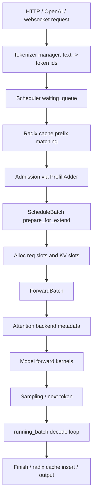
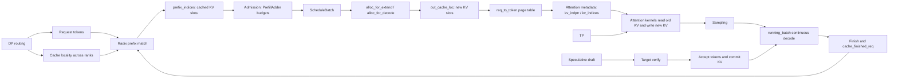

# SGLang AI Infra 学习路线：从单卡 Scheduler 到 DP Attention

这份文档按照一个推理服务工程师最容易建立直觉的顺序来读 SGLang：

1. 单卡 scheduler / KV / radix cache
2. admission / chunked prefill / continuous batching
3. attention backend 和 KV slot 读写
4. speculative decoding
5. TP
6. DP / DP attention / 跨 rank cache locality

目标不是背概念，而是通过 SGLang 的代码建立一套可迁移的 AI Infra 心智模型：以后你看其他推理服务、视频生成服务、GPU 调度、KV cache 优化、分布式推理部署时，知道该从哪些对象、哪些预算、哪些通信路径入手。

## 0. 总体心智模型

SGLang 的推理路径可以压缩成一句话：

> Scheduler 决定哪些请求进入 GPU；KV cache 决定哪些历史 token 不需要重算；attention backend 决定如何按 KV slot 高效读写显存；TP/DP 决定多 GPU 时计算和请求怎么拆。

一个请求从进入服务到生成 token，大致经过下面的路径：



这里有几个很重要的区分：

- token id 是模型词表里的逻辑 token。
- KV slot index 是 KV cache 显存池里的物理或虚拟位置。
- `req_to_token` 是请求维度的页表：它告诉 attention kernel 某个请求第 i 个 token 的 KV 在哪个 slot。
- radix cache 保存的是 prefix token sequence 到 KV slot indices 的映射，不保存完整文本，也不保存 K/V tensor 本体。
- DP 之后，cache locality 不再天然成立。相同前缀如果被打散到不同 DP rank，就会重复 warm cache。

如果放到你们的 LingBot 场景里，可以这样理解：

```text
LingBot / lingbot2 是模型和视频生成业务负载。
SGLang 是把这个模型服务化、批处理、GPU 化、分布式化的推理底座。
K8s / Ray / SQS 是外层任务编排和资源调度。
```

下面从单卡开始。

## 1. 单卡 Scheduler / KV / Radix Cache

### 1.1 为什么先看单卡

单卡是最小闭环。你只需要理解一个 scheduler、一个 KV pool、一个 radix tree、一组 attention backend，就能看懂推理服务的大部分本质问题：

- 请求如何排队？
- prompt 的哪些前缀可以复用？
- 显存里的 KV cache 如何分配和释放？
- 一个 token 的 K/V 写到哪里？
- decode 阶段为什么能持续滚动批处理？

分布式只是把这些问题放大：多个 rank、多个 scheduler、多个 cache 副本、多套通信 group。

### 1.2 Scheduler 维护什么状态

SGLang 的 scheduler 单卡状态里最核心的是：

```text
waiting_queue: 等待进入 prefill 的请求
running_batch: 已经进入 decode 阶段、每轮继续生成 token 的请求集合
cur_batch: 当前 forward batch
last_batch: 上一轮 forward batch
tree_cache: prefix/radix cache
req_to_token_pool: 请求到 KV slot 的映射表
token_to_kv_pool_allocator: KV slot allocator
```

源码锚点：

- `python/sglang/srt/managers/scheduler.py:975` 附近初始化 running 状态。
- 代码注释明确写到 `running_batch` 是 continuous batching 的 decoding batch。
- `waiting_queue` 是新请求入口，`running_batch` 是 decode 主循环里的长期状态。

这意味着 scheduler 不是简单地“凑一批请求跑一下”，而是在维护一个长期滚动的服务状态。

### 1.3 Req、ScheduleBatch、ForwardBatch 的分工

读 SGLang 时最容易混淆的是这几个对象：

```text
Req:
  单个请求的逻辑状态。
  包括 input ids、output ids、prefix_indices、last_node、KV committed length 等。

ScheduleBatch:
  scheduler 视角的一批请求。
  包括 reqs、forward_mode、req_pool_indices、out_cache_loc、seq_lens 等。

ForwardBatch:
  model worker / attention backend 视角的一次 forward 输入。
  它从 ScheduleBatch 派生，携带 kernel 真正需要的张量。
```

请求级 prefix 信息保存在 `Req` 上。`schedule_batch.py:848` 附近可以看到：

```text
prefix_indices: 已命中前缀对应的 KV slot indices
last_node: radix tree 中最后命中的 device node
last_host_node: host/L3 cache 命中的最后节点
best_match_node: 最佳命中节点
host_hit_length: host cache 命中长度
num_matched_prefix_tokens: device + host 总命中 token 数
```

这里非常关键：`prefix_indices` 不是 token id，而是 KV cache indices。

### 1.4 KV cache 的两层映射

SGLang 的 KV cache 可以理解成两张表：

```text
第一层：ReqToTokenPool
  req_pool_idx, token_position -> kv_slot_index

第二层：TokenToKVPool
  layer_id, kv_slot_index -> K/V tensor slice
```

`ReqToTokenPool` 的核心数据结构是：

```text
req_to_token: [max_num_reqs + 1, max_context_len]
```

源码锚点：

- `python/sglang/srt/mem_cache/memory_pool.py:242` 定义 `ReqToTokenPool`。
- `memory_pool.py:265` 创建 `req_to_token` 张量。
- `memory_pool.py:270` 的 `write()` 写请求到 token slot 的映射。

第二层 KV pool 通过抽象接口暴露：

```text
get_key_buffer(layer_id)
get_value_buffer(layer_id)
get_kv_buffer(layer_id)
set_kv_buffer(layer, loc, cache_k, cache_v)
```

源码锚点：

- `python/sglang/srt/mem_cache/memory_pool.py:1252` 附近定义这些抽象方法。

这两层分开非常重要。`req_to_token` 是页表，KV pool 是实际显存数据。radix cache 复用的是页表里的 slot index，而不是复制 K/V tensor。

### 1.5 KV slot indices 是什么

KV slot index 可以理解成 KV cache 显存池中的地址编号。

举例：

```text
请求 A:
  token positions: 0  1  2  3
  token ids:        10 20 30 40
  KV slots:        800 801 912 913

req_to_token[A, 0] = 800
req_to_token[A, 1] = 801
req_to_token[A, 2] = 912
req_to_token[A, 3] = 913
```

attention kernel 在计算第 4 个 token 时，不会重新根据 token id 找历史 K/V，而是通过 `req_to_token` 和 `kv_indices` 去 KV pool 读 slot `800, 801, 912, 913` 上的 K/V。

KV slot index 的意义：

- 解耦逻辑 token 序列和物理显存位置。
- 支持 prefix cache 复用：相同 prefix 的请求可以共享同一批 KV slot。
- 支持 paged allocation：KV slots 不要求连续。
- 支持 eviction：释放 slot 后可以被新请求复用。

### 1.6 Radix cache 保存什么

Radix cache 保存的是：

```text
RadixKey(token_ids, extra_key) -> KV slot indices
```

源码锚点：

- `python/sglang/srt/mem_cache/radix_cache.py:280` 定义 `RadixCache`。
- `radix_cache.py:355` 的 `match_prefix()` 查找最长 cached prefix。
- `radix_cache.py:437` 的 `cache_finished_req()` 在请求完成时插入缓存。

`match_prefix()` 的注释里有几个重点：

- prefix matching 的 namespace 由 token ids 和可选 `extra_key` 共同决定。
- `extra_key` 可以隔离 LoRA、adapter、sampling salt、cache version、RAG 上下文等不应共享状态的请求。
- 如果 page size 大于 1，key 会按 page size 对齐。
- 返回的 `device_indices` 是一维 `torch.int64`，代表命中的 KV cache indices。

所以 prefix matching 主要依赖：

```text
token id 序列
extra_key namespace
radix tree
page alignment
```

不是依赖原始字符串，也不是依赖 embedding 相似度。

### 1.7 Radix cache 的插入和释放

请求完成后，SGLang 会把 committed KV 插入 radix cache。

`cache_finished_req()` 做的事情可以概括为：

```text
1. 取 req 已 committed 的 token 长度。
2. 从 req_to_token_pool.req_to_token 里取这些 token 对应的 KV slot indices。
3. 构造 RadixKey(origin_input_ids + output_ids, req.extra_key)。
4. page align。
5. 把 token prefix -> KV slot indices 插入 radix tree。
```

源码锚点：

- `radix_cache.py:451` 组装 token ids。
- `radix_cache.py:452` 读取 `req_to_token` 中的 KV indices。
- `radix_cache.py:456` 创建 `RadixKey`。
- `radix_cache.py:463` 开始插入。

释放逻辑在 `evict()`：

```text
1. 从 evictable leaves 里按 eviction policy 取候选节点。
2. free 节点保存的 KV slot indices。
3. 从 radix tree 删除叶子。
4. 如果父节点也变成可释放叶子，继续加入 heap。
```

源码锚点：

- `radix_cache.py:563` 定义 `evict()`。
- `radix_cache.py:579` 调用 allocator 释放 `x.value`。

### 1.8 KV 保存时长

SGLang 的 radix/KV cache 通常没有一个简单的固定 TTL。它的生命周期主要由以下因素决定：

```text
进程生命周期:
  服务重启，cache 消失。

显存容量:
  KV pool 满了，需要 eviction。

引用计数:
  正在被 running request 使用的 prefix 节点通过 lock_ref 保护，不能随便 evict。

eviction policy:
  常见是 LRU 或策略化优先级。

是否启用 hierarchical cache:
  有些 KV 可能被转移到 host/L3 storage，但 device cache 仍受容量约束。
```

源码锚点：

- `radix_cache.py:592` 的 `inc_lock_ref()` 把节点从 evictable 变成 protected。
- `radix_cache.py:607` 的 `dec_lock_ref()` 释放保护。

这解释了为什么你不能把 KV cache 理解成普通 Redis key：它是 GPU memory pool 上的运行时资源，能否保存取决于显存压力和引用状态。

### 1.9 本章阅读练习

建议按这个顺序读：

1. `scheduler.py:init_running_status`
2. `schedule_batch.py:Req` 里 prefix 字段
3. `memory_pool.py:ReqToTokenPool`
4. `radix_cache.py:match_prefix`
5. `radix_cache.py:cache_finished_req`
6. `radix_cache.py:evict`

读完后你应该能回答：

- 一个请求的 prefix 命中结果保存在哪里？
- KV slot index 和 token id 有什么区别？
- radix cache 为什么只保存 slot index，不保存 K/V tensor？
- 正在使用中的 prefix 为什么不会被 evict？

## 2. Admission / Chunked Prefill / Continuous Batching

### 2.1 为什么需要 admission

在推理服务中，prefill 和 decode 的资源形态不同：

```text
Prefill:
  一次处理很多 prompt token。
  计算量大，吞吐高，但可能造成长延迟。

Decode:
  每个请求每轮通常只生成一个 token。
  计算粒度小，但需要低延迟持续推进。
```

如果没有 admission，长 prompt 会一次性吞掉 KV 和计算预算，decode 请求就会排队，tail latency 变差。SGLang 的 admission 就是在每一轮决定：

```text
哪些 waiting requests 可以进入 prefill？
哪些必须继续等？
已有 running decode 请求还要预留多少未来 KV？
当前 batch 是否还能混入新 prefill？
```

核心入口：

- `python/sglang/srt/managers/scheduler.py:2731` 的 `get_new_batch_prefill()`。
- 它调用 `_get_new_batch_prefill_raw()`，创建 `PrefillAdder`，再扫描 waiting queue。

### 2.2 PrefillAdder 的预算模型

`PrefillAdder` 是 admission 的核心。源码锚点：

- `python/sglang/srt/managers/schedule_policy.py:433` 定义 `PrefillAdder`。

它维护几类预算：

```text
rem_input_tokens:
  本轮 prefill batch 还允许加入多少输入 token。

rem_chunk_tokens:
  如果启用 chunked prefill，本轮 chunk 剩余多少 token。

rem_total_tokens:
  KV pool 中可用 + 可 evict 的总 token 数，再扣掉 running requests 未来可能生成的 token。

cur_rem_tokens:
  当前这一次 forward 还能分配多少 token。

rem_swa_tokens / rem_mamba_slots:
  SWA、Mamba 等特殊 cache 结构的额外预算。
```

为什么要扣 running request 的未来 token？因为 decode 不是只分配当前一个 token。一个 running request 未来还可能继续生成很多 token，如果 admission 不保守，当前 prefill 把 KV pool 塞满，下一轮 decode 就会 OOM。

源码锚点：

- `schedule_policy.py:548` 估算 running request 的未来 token offset。
- `schedule_policy.py:557` 的 `rem_total_tokens` 把 allocator 可用空间和 radix evictable 空间相加，再扣掉 offset。
- `schedule_policy.py:677` 的 `_update_prefill_budget()` 在接受一个请求后扣预算。

### 2.3 Admission 会检查哪些条件

一个新请求能否进 prefill，大致要过这些检查：

```text
请求 slot 是否够:
  req_to_token_pool.available_size()

KV token 是否够:
  token_to_kv_pool_allocator.available_size()
  + tree_cache.evictable_size()

本轮 prefill token budget 是否够:
  max_prefill_tokens
  chunked_prefill_size

running batch 是否已满:
  max_running_requests
  pp_max_micro_batch_size

特殊约束:
  LoRA 是否能同时调度
  grammar 是否 ready
  SWA/Mamba/HiCache 是否有额外预算
  priority/preemption 是否允许
```

源码锚点：

- `scheduler.py:2726` 的 `get_num_allocatable_reqs()` 同时看 PP micro batch 和 req slot。
- `scheduler.py:2767` 如果 running batch 已满且没有 chunked request，则不做 prefill。
- `schedule_policy.py:968` 的 `add_one_req()` 是单请求 admission 的核心。
- `schedule_policy.py:1013` 如果 total tokens 超过 `rem_total_tokens`，返回 `NO_TOKEN`。

### 2.4 Chunked prefill 解决什么

Chunked prefill 解决长 prompt 阻塞问题。

没有 chunked prefill：

```text
请求 A prompt 64k tokens
请求 B/C/D 已在 decode

如果 A 一次性 prefill，GPU 会长时间服务 A。
B/C/D 的 decode step 被拖住，用户看到卡顿。
```

有 chunked prefill：

```text
A 的 64k prompt 被切成多个 chunk。
每轮只 prefill 一段，比如 8k 或 16k。
中间可以穿插 running decode。
```

源码锚点：

- `scheduler.py:996` 初始化 `chunked_prefill_size`。
- `scheduler.py:2806` 为当前 batch 决定 chunk size。
- `schedule_policy.py:797` 的 `add_chunked_req()` 处理已经被切过、还没完成的 chunked request。
- `schedule_policy.py:949` 附近处理新请求进入 chunked prefill。

关键逻辑：

```text
cand_extend_input_len = full prompt remaining length
_rem_tokens = min(rem_chunk_tokens, rem_total_tokens)
truncated = cand_extend_input_len > _rem_tokens
req.set_extend_range(prefix_len, prefix_len + new_len)
如果 truncated，保留为 chunked_req，下轮继续。
```

Chunked prefill 的代价是 scheduler 状态复杂度提高：

- chunked request 需要保留中间状态。
- KV 已经写了一部分，但请求还没进入正常 decode。
- 如果中途 abort，要确保不泄漏 KV slot。
- overlap scheduler / pipeline parallel 下还要处理跨 microbatch 的一致性。

### 2.5 Continuous batching 解决什么

Continuous batching 是 decode 阶段保持 GPU 利用率的核心。

传统 static batch：

```text
一批请求一起开始。
短请求结束后，batch 里出现空洞。
新请求要等整批结束才能进来。
```

Continuous batching：

```text
每一轮 decode 后：
  完成的请求退出。
  没完成的请求留在 running_batch。
  新 prefill 完成的请求加入 running_batch。
  下一轮继续 decode。
```

源码锚点：

- `scheduler.py:979` 把 `running_batch` 定义为 continuous batching 的 decoding batch。
- `schedule_batch.py:2618` 的 `prepare_for_decode()` 为每个 running request 准备下一步 decode。
- `schedule_batch.py:2646` 调用 `alloc_for_decode()` 给每个 request 分配新 token 的 KV slot。
- `scheduler.py:3447` 的 `process_batch_result()` 按 forward mode 处理 prefill/decode 结果。

### 2.6 Admission、chunked prefill、continuous batching 的关系

这三个概念是一套组合拳：

```text
Admission:
  控制新请求能不能进，避免 OOM 和延迟爆炸。

Chunked prefill:
  控制长 prompt 每次进多少，避免 prefill 独占 GPU。

Continuous batching:
  控制 decode 请求持续滚动，避免 GPU 空转和 batch 空洞。
```

推理服务的吞吐和延迟就是在这三者之间做平衡：

- prefill 太激进：decode tail latency 变差，KV 容易紧张。
- prefill 太保守：GPU 可能 decode batch 太小，吞吐不高。
- chunk 太大：长 prompt 仍然卡住 decode。
- chunk 太小：调度 overhead 变大，prefill kernel 效率下降。

### 2.7 本章阅读练习

建议顺序：

1. `scheduler.py:get_new_batch_prefill`
2. `schedule_policy.py:PrefillAdder.__init__`
3. `schedule_policy.py:rem_total_tokens`
4. `schedule_policy.py:add_one_req`
5. `schedule_policy.py:add_chunked_req`
6. `schedule_batch.py:prepare_for_decode`

读完后你应该能回答：

- 为什么 admission 要预估 running request 的未来 token？
- 为什么 chunked prefill 能降低 tail latency？
- continuous batching 和普通 batch 最大区别是什么？
- 为什么 decode 每轮也要分配新的 KV slot？

## 3. Attention Backend 和 KV Slot 读写

### 3.1 Attention backend 的职责

Attention backend 不是模型结构本身，而是 attention kernel 的执行适配层。

它负责：

```text
1. 根据 ForwardBatch 准备 attention metadata。
2. 把 req_to_token 映射转成 kernel 需要的 kv_indices / page table。
3. 调用具体 attention kernel。
4. 在 forward 时把新 K/V 写入 KV cache。
5. 支持 decode / extend / cuda graph / speculative verify 等不同模式。
```

源码锚点：

- `python/sglang/srt/layers/attention/base_attn_backend.py:18` 定义 `AttentionBackend`。
- `base_attn_backend.py:45` 的 `init_forward_metadata()` 是 eager metadata 入口。
- `base_attn_backend.py:53` 和 `base_attn_backend.py:75` 区分 cuda graph 外和 graph 内 metadata。

这个抽象很重要，因为不同硬件、不同模型、不同 attention kernel 的 metadata 需求不同。SGLang 用 backend 层把 scheduler 和 kernel 细节解耦。

### 3.2 ForwardBatch 携带哪些核心字段

`ForwardBatch` 是 attention backend 和 model runner 的共同输入。核心字段：

```text
forward_mode:
  EXTEND / DECODE / TARGET_VERIFY / IDLE 等。

batch_size:
  当前 batch 请求数或 token 组织方式。

input_ids:
  本轮要计算的 token ids。

req_pool_indices:
  每个请求在 ReqToTokenPool 里的行号。

seq_lens:
  每个请求当前序列长度。

out_cache_loc:
  本轮新 token 的 KV 写入 slot。

seq_lens_sum:
  所有请求序列长度之和，用来构造 kv_indices buffer。
```

源码锚点：

- `python/sglang/srt/model_executor/forward_batch_info.py:322` 定义 `ForwardBatch`。
- `forward_batch_info.py:337` 注释说明 `out_cache_loc` 是 output tokens 在 `token_to_kv_pool` 中的 indices。

### 3.3 Extend 阶段如何写 KV slot

Prefill/extend 阶段，一次可能处理多个 token。流程是：

```text
1. batch.prepare_for_extend()
2. 计算每个请求未命中的 prompt token。
3. alloc_for_extend() 分配 req slots 和 KV slots。
4. write_cache_indices() 把 prefix slots + new slots 写进 req_to_token。
5. ForwardBatch 进入 model forward。
6. 每层 attention 用 out_cache_loc 写新 K/V。
```

源码锚点：

- `schedule_batch.py:2011` 的 `prepare_for_extend()`。
- `schedule_batch.py:2020` 从 `r.get_fill_ids()[len(r.prefix_indices):]` 取未命中的输入 token。
- `schedule_batch.py:2056` 调用 `alloc_for_extend()`。
- `mem_cache/common.py:452` 定义 `alloc_for_extend()`。
- `mem_cache/common.py:502` 调用 `write_cache_indices()`。

`write_cache_indices()` 会把两段内容写入 `req_to_token`：

```text
prefix 部分:
  直接写 radix cache 命中的 prefix_indices。

extend 部分:
  写本轮新分配的 out_cache_loc。
```

如果当前 attention backend 支持 Triton，会走 `write_req_to_token_pool_triton()`：

- `python/sglang/srt/mem_cache/triton_ops/common.py:8`
- kernel 先写 prefix，再写 extend 部分。

### 3.4 Decode 阶段如何写 KV slot

Decode 阶段通常每个请求每轮只生成一个新 token。流程：

```text
1. running_batch.prepare_for_decode()
2. alloc_for_decode() 给每个请求分配 token_per_req 个 KV slot。
3. 写 req_to_token[req_pool_idx, seq_len] = out_cache_loc。
4. model forward 计算当前 token 的 K/V。
5. attention backend 调 set_kv_buffer 写入 KV pool。
6. attention kernel 读取历史 KV slots 计算输出。
```

源码锚点：

- `schedule_batch.py:2618` 的 `prepare_for_decode()`。
- `schedule_batch.py:2646` 调用 `alloc_for_decode()`。
- `mem_cache/common.py:581` 定义 `alloc_for_decode()`。
- `mem_cache/common.py:620` 写 `req_to_token_pool.write((req_pool_indices, locs), out_cache_loc)`。

decode 和 extend 的共同点是都会分配 `out_cache_loc`；区别是 extend 一次写一段 token，decode 通常每请求写一个 token。

### 3.5 kv_indices 是怎么来的

attention kernel 通常不直接吃二维 `req_to_token`。它需要更紧凑的 metadata，比如：

```text
kv_indptr:
  CSR 风格的前缀和数组，表示每个请求的 KV indices 在扁平数组中的范围。

kv_indices:
  所有请求历史 KV slot indices 的扁平数组。
```

以 `wave_backend` 为例：

- `python/sglang/srt/layers/attention/wave_backend.py:197` 的 `init_forward_metadata()` 准备 metadata。
- `wave_backend.py:204` 如果是 decode，会根据 `seq_lens` 构造 `kv_indptr`。
- `wave_backend.py:211` 调用 `create_flashinfer_kv_indices_triton()`，从 `req_to_token` 中收集 `kv_indices`。

可以把这个过程理解为：

```text
req_to_token:
  request-major page table

kv_indices:
  attention-kernel-friendly flattened page table
```

### 3.6 每层 attention 如何写新 K/V

以 `wave_backend` 的 decode 为例：

```text
if save_kv_cache:
    token_to_kv_pool.set_kv_buffer(layer, out_cache_loc, k, v)

decode_attention_fwd(
    q,
    key_buffer[layer_id],
    value_buffer[layer_id],
    kv_indptr,
    kv_indices,
    ...
)
```

源码锚点：

- `wave_backend.py:521` 定义 `forward_decode()`。
- `wave_backend.py:540` 调用 `set_kv_buffer()` 写新 K/V。
- `wave_backend.py:545` 调用 decode attention kernel。
- `wave_backend.py:547` 和 `wave_backend.py:548` 传入当前 layer 的 key/value buffer。
- `wave_backend.py:550` 和 `wave_backend.py:551` 传入 `kv_indptr` / `kv_indices`。

extend 阶段类似：

- `wave_backend.py:475` 定义 `forward_extend()`。
- `wave_backend.py:490` 写 KV。
- `wave_backend.py:502` 调 extend attention kernel。

### 3.7 Kernel / 算子在这里有什么

这里的 kernel 可以分几类：

```text
调度辅助 kernel:
  写 req_to_token。
  构造 kv_indices / page table。

KV 写入 kernel 或张量写:
  把当前层计算出来的 K/V 写到 KV pool。

Attention kernel:
  decode attention
  extend/prefill attention
  paged attention
  MLA / MHA / GQA backend 特化

模型算子:
  GEMM
  QKV projection
  RoPE
  RMSNorm
  MLP
  sampling

通信算子:
  TP all-reduce / all-gather
  DP attention group communication
  MoE all-to-all
```

对学习 GPU 优化来说，你要训练自己看到一个 kernel 时立刻问：

```text
它处理的是 token 维度、request 维度、head 维度、layer 维度，还是 rank 维度？
它读写的是 activation、weight、KV cache，还是 metadata？
它是 compute-bound、memory-bound，还是 communication-bound？
```

### 3.8 本章阅读练习

建议顺序：

1. `model_executor/forward_batch_info.py:ForwardBatch`
2. `mem_cache/common.py:alloc_for_extend`
3. `mem_cache/common.py:alloc_for_decode`
4. `mem_cache/triton_ops/common.py:write_req_to_token_pool_triton`
5. `layers/attention/base_attn_backend.py:AttentionBackend`
6. 任意一个具体 backend，比如 `wave_backend.py`

读完后你应该能回答：

- `out_cache_loc` 是谁分配的？
- `req_to_token` 和 `kv_indices` 有什么关系？
- 新 token 的 K/V 是在哪里写入 KV pool 的？
- attention backend 为什么要分 graph 外 metadata 和 graph 内 metadata？

## 4. Speculative Decoding

### 4.1 基本思想

Speculative decoding 的目标是减少大模型 target forward 的平均次数。

普通 decode：

```text
target model forward -> 1 token
target model forward -> 1 token
target model forward -> 1 token
...
```

Speculative decode：

```text
draft model 先猜多个 token
target model 一次验证这些 token
如果连续猜对，就一次接受多个 token
```

性能收益来自：

```text
accepted tokens per target forward > 1
```

如果 draft 猜得准，target 模型一次 forward 可以推进多个输出 token。如果 draft 猜得差，额外 draft 和 verify 开销可能抵消收益。

### 4.2 SGLang 支持哪些算法

源码锚点：

- `python/sglang/srt/speculative/spec_info.py:28` 定义 `SpeculativeAlgorithm`。

内置算法包括：

```text
EAGLE:
  利用 target hidden states 的 draft 模型，常见于高性能 speculative decoding。

EAGLE3:
  EAGLE 的变体，可能使用更多辅助 hidden state。

STANDALONE:
  独立 draft model。

NGRAM:
  基于 n-gram 的轻量 draft，适合重复模式明显的文本。

DFLASH / FROZEN_KV_MTP:
  其他 speculative/MTP 方向的实现。
```

`spec_info.py:193` 的 `create_worker()` 会根据算法选择具体 worker，比如 EAGLE 选择 `EAGLEWorkerV2`。

### 4.3 EAGLE 的工程流程

EAGLE 的核心路径：

```text
1. target prefill/decode 产生 hidden states。
2. draft worker 用 hidden states 生成 draft token tree 或 chain。
3. target verify 一次性验证 draft tokens。
4. 根据 target logits 判断接受多少 token。
5. accepted tokens 的 KV 被移动或 commit 到 target KV cache。
6. scheduler 更新请求的 output_ids、seq_lens、KV committed length。
```

源码锚点：

- `python/sglang/srt/speculative/eagle_worker_v2.py:155` 读取 `speculative_num_steps` 和 `speculative_num_draft_tokens`。
- `eagle_worker_v2.py:171` 开始加载 draft model worker。
- `eagle_worker_v2.py:600` 的 `draft_forward()` 多步生成 draft token。
- `eagle_worker_v2.py:1465` 的 `verify()` 做 target verify。
- `eagle_utils.py:458` 的 `eagle_prepare_for_verify()` 准备 target verify batch。

### 4.4 Draft forward 在做什么

`draft_forward()` 里有一个循环：

```text
for i in range(speculative_num_steps):
  select_top_k_tokens(...)
  如果不是最后一步：
    设置 forward_batch.input_ids
    设置 forward_batch.out_cache_loc
    用 draft attention backend 跑一步 draft model forward
    得到下一步 draft logits/topk
```

源码锚点：

- `eagle_worker_v2.py:634` 开始循环。
- `eagle_worker_v2.py:635` 调 `select_top_k_tokens()`。
- `eagle_worker_v2.py:647` 设置下一步输入 token。
- `eagle_worker_v2.py:655` 设置当前 draft step 的 `out_cache_loc`。
- `eagle_worker_v2.py:674` 调 draft runner forward。

这里的重点是：speculative decoding 也需要 KV cache。draft 有 draft 的 KV 路径，target 有 target 的 KV 路径，verify 后还要处理 accepted tokens 的 KV commit。

### 4.5 Target verify 在做什么

`verify()` 会先调用 `eagle_prepare_for_verify()`。

它做几件事：

```text
1. 把 batch.input_ids 替换成 draft tokens。
2. 为 draft tokens 分配 verify 阶段的 out_cache_loc。
3. 设置 forward_mode = TARGET_VERIFY。
4. 构造 ForwardBatch。
5. 初始化 target attention backend metadata。
```

源码锚点：

- `eagle_utils.py:477` 设置 `batch.input_ids = verify_input.draft_token`。
- `eagle_utils.py:485` 分配 verify 阶段的 `batch.out_cache_loc`。
- `eagle_utils.py:508` 设置 `ForwardMode.TARGET_VERIFY`。
- `eagle_utils.py:517` 创建 `ForwardBatch`。

target verify 之后，会根据 target logits 和 draft candidates 算出 accepted tokens。`eagle_utils.py:539` 附近的 verify 函数负责判断接受情况，`spec_utils.py:527` 附近有把 accepted tokens 移到 target KV cache 的逻辑。

### 4.6 正确性直觉

Speculative decoding 的正确性来自“target 是最终裁判”。

对于 greedy 场景：

```text
draft 猜 token。
target 算自己的 greedy token。
如果一致，接受。
遇到第一个不一致，用 target 的 token。
```

对于 sampling 场景，通常需要 rejection sampling 或类似校正机制，才能保持 target distribution。简单说：

```text
draft 负责提出候选。
target 概率负责接受/拒绝和修正。
最终分布应以 target 为准。
```

工程上你要关心：

- acceptance rate 是否够高。
- draft forward 开销是否足够小。
- verify batch 是否能高效走 cuda graph。
- accepted KV 的移动/commit 是否正确。
- grammar、sampling penalties、top-p/top-k、Mamba state 等额外状态是否同步。

### 4.7 什么时候 speculative decoding 有用

适合：

- target 模型很大，单步 decode 贵。
- draft 模型明显更便宜。
- 生成任务有较强局部可预测性。
- batch size 不太大，decode latency 是瓶颈。
- acceptance rate 高。

不适合或收益不稳定：

- draft 与 target 分布差异大。
- 业务 sampling temperature 很高，draft 难猜。
- batch 很大时 target GPU 已经很满，draft/verify 额外开销不划算。
- KV 和 metadata 管理复杂，导致实现开销或 bug 风险高。

### 4.8 本章阅读练习

建议顺序：

1. `speculative/spec_info.py:SpeculativeAlgorithm`
2. `speculative/eagle_worker_v2.py:EAGLEWorkerV2.__init__`
3. `speculative/eagle_worker_v2.py:draft_forward`
4. `speculative/eagle_worker_v2.py:forward_batch_generation`
5. `speculative/eagle_worker_v2.py:verify`
6. `speculative/eagle_utils.py:eagle_prepare_for_verify`
7. `speculative/spec_utils.py:move_accept_tokens_to_target_kvcache`

读完后你应该能回答：

- draft 模型和 target 模型分别做什么？
- 为什么 speculative decoding 不应该改变 target 输出分布？
- accepted tokens 的 KV 为什么需要特殊处理？
- `speculative_num_steps` 和 `speculative_num_draft_tokens` 分别控制什么？

## 5. TP

### 5.1 TP 解决什么

TP 是 tensor parallelism。它解决的是单张 GPU 放不下模型，或者单张 GPU 算一个请求太慢的问题。

TP 的基本思想：

```text
同一个模型层的权重矩阵被切到多张 GPU。
同一个请求同时在多个 rank 上计算。
每个 rank 得到部分结果。
必要时通过 all-gather / all-reduce 合并。
```

SGLang 参数入口：

- `python/sglang/srt/server_args.py:812` 的 `tp_size`。

分布式 group 初始化：

- `python/sglang/srt/distributed/parallel_state.py:1979` 的 `initialize_model_parallel()`。

### 5.2 ColumnParallelLinear

Column parallel 是按输出维度切权重。

数学形式：

```text
Y = X A
A = [A1, A2, ..., Ap]

rank i:
  Yi = X Ai
```

如果后续层可以接受 sharded output，就不需要 gather；如果需要完整 Y，则 all-gather。

源码锚点：

- `python/sglang/srt/layers/linear.py:291` 定义 `ColumnParallelLinear`。
- 注释写明 A 的第二维被并行切分。
- `linear.py:338` 按 TP size 切 output dimension。
- `linear.py:472` 如果 `gather_output` 为真，调用 all-gather。

适用位置：

- QKV projection。
- MLP up/gate projection。
- 输出维度很大的线性层。

### 5.3 RowParallelLinear

Row parallel 是按输入维度切权重。

数学形式：

```text
Y = X A
X = [X1, X2, ..., Xp]
A = [A1; A2; ...; Ap]

rank i:
  Yi_partial = Xi Ai

最终:
  Y = sum(Yi_partial)
```

所以 RowParallelLinear 通常需要 all-reduce。

源码锚点：

- `python/sglang/srt/layers/linear.py:1339` 定义 `RowParallelLinear`。
- 注释写明 A 的第一维和 X 的第二维被切分。
- `linear.py:1519` 的 `forward()` 中，如果输入不是 parallel，会先 split input。
- `linear.py:1542` 如果 `reduce_results` 且 TP size 大于 1，会 all-reduce。

适用位置：

- attention output projection。
- MLP down projection。
- 需要把各 rank partial result 合并的地方。

### 5.4 TP 的通信代价

TP 的瓶颈通常不是算不动，而是通信。

常见通信：

```text
all-gather:
  把各 rank 的 output partition 拼成完整 activation。

all-reduce:
  把各 rank 的 partial output 求和。

reduce-scatter:
  一边 reduce 一边 scatter，减少输出冗余。

all-to-all:
  MoE expert routing 常见。
```

SGLang 中 row parallel 的 all-reduce 在：

- `linear.py:1544` DP attention reduce 时使用 attention TP group。
- `linear.py:1557` 普通 TP 使用 tensor model parallel all-reduce。

性能分析时要看：

```text
TP size 越大:
  单卡权重和计算减少。
  通信次数不一定减少，通信 payload 和同步成本可能上升。

batch/token 越小:
  通信 latency 更显著。

batch/token 越大:
  GEMM 利用率更好，但显存和 KV 压力更大。
```

### 5.5 TP 和 attention heads

attention 里通常会按 head 维度切：

```text
total_num_heads / tp_size = 每个 rank 的 query heads
total_num_kv_heads / tp_size 或 replica = 每个 rank 的 KV heads
```

如果是 GQA/MQA，KV heads 数可能小于 Q heads，这时会出现 KV head replica 或特殊切分逻辑。读 TP 时不要只看 Linear，还要看具体模型 attention module 如何用 `get_parallel().tp_size` 或 `get_parallel().attn_tp_size` 设置 head 数。

### 5.6 TP 的学习方法

你可以用一个 transformer block 做跟踪：

```text
input hidden
  -> QKVParallelLinear / ColumnParallelLinear
  -> attention backend
  -> RowParallelLinear output projection
  -> MergedColumnParallelLinear gate/up
  -> RowParallelLinear down
  -> next block
```

每经过一个层，问：

- 当前 activation 是完整的还是 sharded 的？
- 权重按哪一维切？
- 这一层后有没有 all-gather/all-reduce？
- attention heads 怎么分到 rank？
- KV cache 是按 TP rank 各存一份局部 heads，还是有特殊 DP attention 逻辑？

### 5.7 本章阅读练习

建议顺序：

1. `server_args.py:tp_size`
2. `distributed/parallel_state.py:initialize_model_parallel`
3. `layers/linear.py:ColumnParallelLinear`
4. `layers/linear.py:RowParallelLinear`
5. 一个具体模型里的 attention block

读完后你应该能回答：

- Column parallel 和 row parallel 分别按哪一维切？
- 为什么 row parallel 常常需要 all-reduce？
- TP size 增大后，显存、计算、通信分别怎么变化？
- attention head 在 TP 下怎么分？

## 6. DP / DP Attention / 跨 Rank Cache Locality

### 6.1 普通 DP 解决什么

DP 是 data parallelism。它解决的是服务吞吐扩展问题：

```text
多个 worker / rank 各自能独立服务请求。
请求被 controller 路由到某个 DP rank。
每个 DP rank 维护自己的 scheduler、running batch、KV cache。
```

参数入口：

- `python/sglang/srt/server_args.py:838` 的 `dp_size`。
- `server_args.py:845` 的 `load_balance_method`。

Controller：

- `python/sglang/srt/managers/data_parallel_controller.py:129` 定义 `DataParallelController`。

它负责启动多个 DP scheduler，并把 tokenizer 侧请求转发给某个 DP worker。

### 6.2 DP load balance 方法

SGLang 支持的 DP load balance 方法：

```text
round_robin:
  轮询发请求，简单稳定，但不考虑负载和 cache locality。

total_requests:
  发给当前 running + waiting 请求数最少的 rank。

total_tokens:
  发给当前 token 负载最低的 rank，请求数作为 tie-breaker。

follow_bootstrap_room:
  PD disaggregation 场景下跟随 bootstrap room。
```

源码锚点：

- `data_parallel_controller.py:76` 定义 `LoadBalanceMethod`。
- `data_parallel_controller.py:93` 定义 `DPBudget`。
- `data_parallel_controller.py:111` 根据 total requests 或 total tokens 选 rank。
- `data_parallel_controller.py:612` 是 round-robin scheduler。
- `data_parallel_controller.py:639` 是 total requests scheduler。
- `data_parallel_controller.py:645` 是 total tokens scheduler。

默认策略：

- `server_args.py:2839` 的 `_handle_load_balance_method()`。
- 非 PD 默认 `round_robin`。
- PD prefill 默认 `follow_bootstrap_room`。
- PD decode 默认 `round_robin`。

### 6.3 外部指定 DP rank

SGLang 支持外部直接指定 DP rank。

源码锚点：

- `data_parallel_controller.py:605` 的 `maybe_external_dp_rank_routing()`。
- 如果 `req.routed_dp_rank` 不为空，直接发送到该 rank。
- `python/sglang/srt/entrypoints/openai/serving_base.py:277` 支持 HTTP header `X-Data-Parallel-Rank`。

这对 cache locality 很有用。比如同一个 session、同一个用户、同一个长系统 prompt、同一个 RAG prefix，最好稳定路由到同一个 DP rank。

### 6.4 跨 rank cache locality 为什么重要

普通 DP 下，每个 DP rank 通常有自己的 KV cache 和 radix cache。也就是说：

```text
DP rank 0 有自己的 radix tree 和 KV slots。
DP rank 1 有自己的 radix tree 和 KV slots。
DP rank 2 有自己的 radix tree 和 KV slots。
```

如果相同 prefix 的请求被 round-robin 发到不同 rank：

```text
request 1 -> rank 0，warm prefix cache
request 2 -> rank 1，rank 1 没命中，需要重算
request 3 -> rank 2，rank 2 没命中，需要重算
request 4 -> rank 0，rank 0 命中
```

整体 prefix hit rate 被稀释了。

所以跨 rank cache locality 的本质是路由问题：

```text
相同或相似 prefix 的请求，应该尽量稳定落到同一个 DP rank。
```

但这会和负载均衡冲突：

```text
sticky routing:
  cache hit 好，但可能造成某个 rank 过热。

load-aware routing:
  负载均匀，但可能牺牲 cache hit。

prefix-aware routing:
  尝试在 cache hit 和负载之间做权衡。
```

### 6.5 routing key 的思路

一个实用策略：

```text
routing_key = hash(session_id 或 prompt_prefix_id 或 cache_namespace)
target_dp_rank = routing_key % dp_size
```

优点：

- 实现简单。
- 相同 session 能稳定命中同 rank。
- 不需要 controller 全局知道所有 radix tree 内容。

缺点：

- rank 负载可能不均。
- 如果某个热门 prefix 很热，会导致热点 rank。
- dp_size 变化时 hash 映射改变，cache locality 会重置。

更复杂的策略：

```text
候选 rank = hash prefix 后的 top-k ranks
在候选 rank 中选择 total_tokens 最低的
如果某 rank 负载超过阈值，允许 spillover
```

这类策略就是 cache-aware load balancing。

### 6.6 DP attention 是什么

DP attention 不是普通 DP。普通 DP 是多份完整 serving worker；DP attention 是在同一个更大的 tensor parallel world 里，把 attention 和 FFN/MoE 的并行层级重新组织。

参数入口：

- `python/sglang/srt/server_args.py:895` 的 `enable_dp_attention`。
- 注释说明：attention 使用 data parallelism，FFN 使用 tensor parallelism；目前主要支持 DeepSeek-V2、Qwen 2/3 MoE 等模型家族。

SGLang 的并行层级可以理解为：

```text
Global TP world
  -> attention DP
    -> attention CP
      -> attention TP

Global TP world
  -> MoE DP
    -> expert parallel
      -> MoE TP
```

源码锚点：

- `data_parallel_controller.py:553` 的注释直接列出 attention 和 MoE 的 parallelism hierarchy。
- `data_parallel_controller.py:549` 设置 `attn_dp_size`。
- `data_parallel_controller.py:556` 计算 `attn_tp_size = tp_size // attn_dp_size // attn_cp_size`。
- `distributed/parallel_state.py:2133` 也计算同样的 `attn_dp_size`、`attn_cp_size`、`attn_tp_size`。

DP attention 的目标通常是：

- 对 MoE 模型，降低 attention 和 FFN/MoE 的不匹配开销。
- 减少某些 attention 通信或 KV 复制压力。
- 让 attention 维度可以按 DP 组织，而 FFN/MoE 仍走适合自己的并行方式。

### 6.7 DP attention 对 scheduler 的影响

开启 DP attention 后，SGLang 会调整一些调度参数。

源码锚点：

- `server_args.py:4837` 的 `_handle_data_parallelism()`。
- `server_args.py:4847` 如果开启 DP attention，会降低 `schedule_conservativeness`。
- `server_args.py:4850` 会把 `chunked_prefill_size` 除以 `dp_size`，注释说明是为了避免 MoE kernel 问题。

这说明 DP attention 不只是通信 group 的变化，也会反馈到 scheduler token budget 和 chunk 策略。

### 6.8 DP / DP attention / cache locality 的区别

三者不要混淆：

```text
DP:
  请求级并行。多个 rank/worker 服务不同请求。

DP attention:
  模型内部 attention 并行层级的变化。attention 有自己的 DP/TP/CP group。

跨 rank cache locality:
  请求路由策略问题。目标是让同前缀请求落到已有 cache 的 rank。
```

它们会互相影响：

- DP 越大，请求越容易被打散，cache locality 越需要路由策略。
- DP attention 改变 attention group 后，KV/cache/metadata 的 rank 语义更复杂。
- load balancing 如果只看请求数，不看 prefix hit，会损失缓存收益。

### 6.9 本章阅读练习

建议顺序：

1. `server_args.py:dp_size`
2. `server_args.py:load_balance_method`
3. `managers/data_parallel_controller.py:DataParallelController`
4. `data_parallel_controller.py:DPBudget`
5. `serving_base.py:extract_routed_dp_rank_from_header`
6. `server_args.py:enable_dp_attention`
7. `distributed/parallel_state.py:attention_data_parallel_size`

读完后你应该能回答：

- 普通 DP 和 TP 最大区别是什么？
- 为什么 round-robin 会损害 prefix cache locality？
- `X-Data-Parallel-Rank` 可以用来做什么？
- DP attention 为什么会影响 chunked prefill size？
- `attn_tp_size = tp_size // dp_size // attn_cp_size` 表示什么？

## 7. 推荐学习顺序和实战任务

### 7.1 第一阶段：单卡闭环

目标：能画出单请求从 prefill 到 decode 的完整 KV 路径。

任务：

```text
1. 找到一个请求进入 waiting_queue 的路径。
2. 跟踪它如何 match radix prefix。
3. 跟踪 prefix_indices 如何进入 ScheduleBatch。
4. 跟踪 alloc_for_extend 如何分配 out_cache_loc。
5. 跟踪 attention backend 如何写 KV。
6. 跟踪 decode 下一轮如何分配新 slot。
7. 跟踪请求结束后如何 cache_finished_req。
```

验收问题：

- 给定一个请求，能说出它的 prompt token 哪些被复用、哪些要新算。
- 能解释 `prefix_indices`、`out_cache_loc`、`kv_indices` 三者区别。
- 能解释为什么 running request 的 KV 不能随便 evict。

### 7.2 第二阶段：调度策略

目标：能解释吞吐、延迟、显存三者如何权衡。

任务：

```text
1. 改变 max_prefill_tokens，预测对 TTFT 和 decode latency 的影响。
2. 改变 chunked_prefill_size，预测长 prompt 场景下的影响。
3. 观察 waiting_queue 和 running_batch 的变化。
4. 阅读 retract_decode 逻辑，理解 OOM 压力下如何退请求。
```

验收问题：

- 为什么 prefill 太大可能让 decode 卡顿？
- 为什么 chunk 太小也不好？
- admission 为什么要考虑 max_new_tokens？

### 7.3 第三阶段：attention backend

目标：能看懂一个 attention backend 的 metadata 和 KV 读写。

任务：

```text
1. 选一个 backend，例如 wave_backend。
2. 跟踪 init_forward_metadata。
3. 找到 kv_indptr / kv_indices 的构造。
4. 找到 set_kv_buffer。
5. 找到 attention kernel 调用。
6. 对比 extend 和 decode 的差异。
```

验收问题：

- 为什么 kernel 不直接读二维 req_to_token？
- `kv_indptr` 为什么像 CSR？
- cuda graph 为什么需要静态 buffer 和 metadata 分离？

### 7.4 第四阶段：speculative decoding

目标：能解释 draft、verify、accept、KV commit 的完整链路。

任务：

```text
1. 阅读 SpeculativeAlgorithm。
2. 阅读 EAGLEWorkerV2 初始化。
3. 跟踪 target prefill 后如何 draft_extend。
4. 跟踪 draft_forward 多步生成。
5. 跟踪 eagle_prepare_for_verify。
6. 跟踪 accepted tokens 如何更新 target KV。
```

验收问题：

- speculative decoding 什么时候加速？
- acceptance rate 低时为什么可能变慢？
- 为什么 sampling 场景要注意 rejection/correction？

### 7.5 第五阶段：TP

目标：能看懂一层 transformer 在 TP 下的 shard 和通信。

任务：

```text
1. 阅读 ColumnParallelLinear。
2. 阅读 RowParallelLinear。
3. 找一个具体模型 block，标记每个 linear 是 column 还是 row。
4. 标记 all-gather / all-reduce 出现的位置。
5. 看 attention heads 如何按 tp_size 分。
```

验收问题：

- TP 减少了什么，增加了什么？
- 为什么 TP 对小 batch latency 不一定友好？
- row parallel 为什么需要 reduce？

### 7.6 第六阶段：DP / DP attention / locality

目标：能设计一个兼顾负载和 cache hit 的请求路由策略。

任务：

```text
1. 阅读 DataParallelController。
2. 对比 round_robin、total_requests、total_tokens。
3. 用 session_id 或 prompt hash 设计 sticky routing。
4. 思考热点 prefix 的 spillover 策略。
5. 阅读 enable_dp_attention 下 attn_tp_size 的计算。
```

验收问题：

- DP rank 本地 cache 为什么无法天然共享？
- prefix-aware routing 的收益和风险是什么？
- DP attention 和普通 DP 有什么本质区别？

## 8. 常见误区

### 8.1 把 radix cache 当成文本 cache

错误理解：

```text
相同字符串 -> 命中 cache。
```

更准确：

```text
相同 token ids + 相同 extra_key namespace + page alignment -> 命中 radix cache。
命中结果是 KV slot indices。
```

### 8.2 把 KV slot 当成 token id

错误理解：

```text
KV slot 912 表示 token id 912。
```

更准确：

```text
KV slot 912 表示 KV cache pool 中第 912 个位置。
这个位置保存某个 token 在某层的 K/V。
```

### 8.3 以为 DP 自动共享 cache

错误理解：

```text
dp_size=8，所以 cache 也是 8 个 rank 自动共享。
```

更准确：

```text
每个 DP rank 往往有自己的 scheduler/cache 状态。
想复用 prefix，必须通过路由策略保持 locality，或者引入更复杂的跨 rank/cache transfer 机制。
```

### 8.4 以为 chunked prefill 总是越小越好

错误理解：

```text
chunk 越小，latency 越好。
```

更准确：

```text
chunk 小能减少单次 prefill 阻塞，但会增加调度 overhead，降低大 prompt prefill kernel 效率。
需要结合 TTFT、decode latency、GPU 利用率调参。
```

### 8.5 以为 speculative decoding 一定加速

错误理解：

```text
开 speculative decoding 就会更快。
```

更准确：

```text
收益取决于 acceptance rate、draft 成本、verify 成本、batch size、sampling 参数、KV commit 开销。
```

## 9. 源码索引

这些路径按学习顺序整理。行号基于当前分支 `codex/lingbot-action-override`，后续代码变动后可能略有偏移。

### Scheduler / KV / Radix

```text
python/sglang/srt/managers/scheduler.py
  init_running_status
  get_new_batch_prefill
  run_batch
  process_batch_result

python/sglang/srt/managers/schedule_batch.py
  Req prefix fields
  ScheduleBatch
  prepare_for_extend
  prepare_for_decode

python/sglang/srt/mem_cache/memory_pool.py
  ReqToTokenPool
  TokenToKVPool interfaces

python/sglang/srt/mem_cache/radix_cache.py
  RadixCache
  match_prefix
  cache_finished_req
  evict
  inc_lock_ref / dec_lock_ref
```

### Admission / Chunked Prefill

```text
python/sglang/srt/managers/schedule_policy.py
  PrefillAdder
  rem_total_tokens
  add_one_req
  add_chunked_req
```

### Attention / KV Slot

```text
python/sglang/srt/model_executor/forward_batch_info.py
  ForwardBatch

python/sglang/srt/mem_cache/common.py
  alloc_for_extend
  alloc_for_decode
  write_cache_indices

python/sglang/srt/mem_cache/triton_ops/common.py
  write_req_to_token_pool_triton

python/sglang/srt/layers/attention/base_attn_backend.py
  AttentionBackend

python/sglang/srt/layers/attention/wave_backend.py
  init_forward_metadata
  forward_extend
  forward_decode
```

### Speculative Decoding

```text
python/sglang/srt/speculative/spec_info.py
  SpeculativeAlgorithm

python/sglang/srt/speculative/eagle_worker_v2.py
  EAGLEWorkerV2
  draft_forward
  forward_batch_generation
  verify

python/sglang/srt/speculative/eagle_utils.py
  eagle_prepare_for_verify

python/sglang/srt/speculative/spec_utils.py
  move_accept_tokens_to_target_kvcache
```

### TP / DP

```text
python/sglang/srt/server_args.py
  tp_size
  dp_size
  load_balance_method
  enable_dp_attention

python/sglang/srt/layers/linear.py
  ColumnParallelLinear
  RowParallelLinear

python/sglang/srt/distributed/parallel_state.py
  initialize_model_parallel
  attention DP/CP/TP group construction

python/sglang/srt/managers/data_parallel_controller.py
  LoadBalanceMethod
  DPBudget
  DataParallelController
  maybe_external_dp_rank_routing

python/sglang/srt/entrypoints/openai/serving_base.py
  X-Data-Parallel-Rank routing
```

## 10. 最后的一张图

把整份文档压缩成一张图：



如果你真正吃透这张图，SGLang 的 GPU 调度、KV cache、attention backend、speculative decoding、TP/DP 就不再是六个割裂概念，而是一条连续的数据和资源管理路径。
