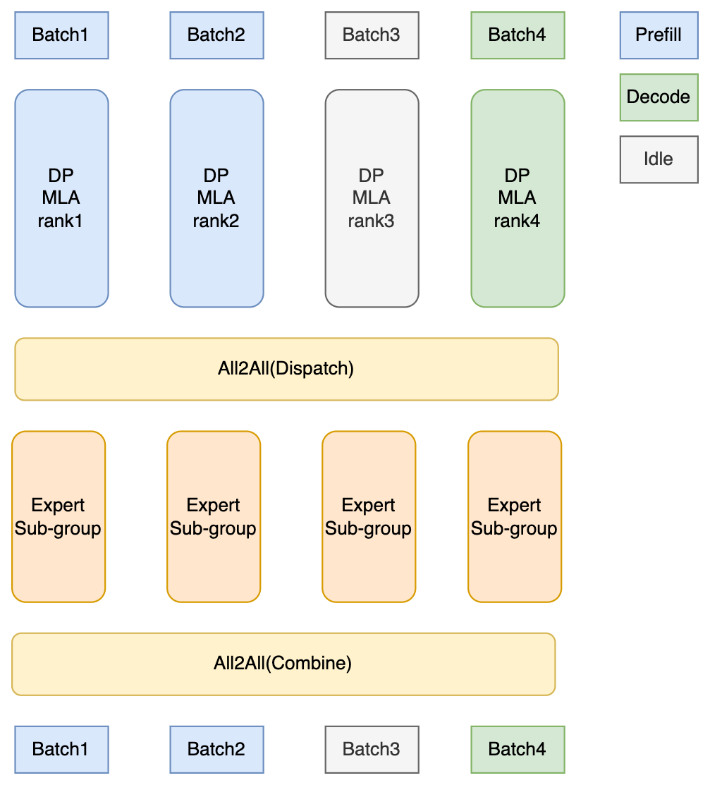

# DP, DPA and SGLang DP Router

This guide explains the difference between Data Parallelism (DP) and Data Parallelism Attention (DPA), how to enable each mode correctly, and how to use the SGLang Model Gateway (SMG) for production-grade DP deployments.

## Data Parallelism (DP)

**Data Parallelism (DP)** is the most common parallelism strategy that replicates the entire model across multiple GPU sets and processes different batches of requests in parallel. Each GPU set handles independent requests. With dedicated routing strategies, as we will introduce later, with those proper routing algorithms in SGLang Model Gateway, the throughput of your serving system could be multiplied nearly linearly.

### Key characteristics

- Each replica has a full copy of the model
- Requests are distributed/scattered across replicas
- No inter-replica communication during one request's inference (for simple DP)

## Data Parallelism Attention (DPA)

**Data Parallelism Attention (DPA)**, also known as DP Attention, is an advanced parallelism strategy. While DPA provides the most significant benefits for **Multi-Head Latent Attention (MLA)** models (such as DeepSeek, MiniMax, Kimi-K2), it also supports **standard attention models** like Qwen.

### The Problem with Tensor Parallelism for MLA Models

The most common parallelism strategy for inference is **Tensor Parallelism (TP)**. However, TP might not be the most efficient strategy for certain models. For example, DeepSeek models use MLA and only have **one KV head**. If we use tensor parallelism on 8 GPUs, it will lead to:

- **Duplicated KV cache** across all GPUs
- **Unwanted memory usage** that limits batch size
- **Reduced throughput** due to memory constraints

### How DPA Works

DPA addresses these limitations by applying **data parallelism specifically to the attention component**.

<table>
<tr>
<td width="50%">

</td>
<td width="50%" valign="top">

**Each DP replica:**

- Processes different batches independently (can be in different forward modes: prefill, decode, or idle)
- Maintains its own KV cache (no duplication)
- Enables significantly larger batch sizes due to memory savings

**Communication patterns in DPA + EP:**
-
-  **All2All (Dispatch)**: Routes tokens to expert sub-groups based on gating decisions
- **All2All (Combine)**: Gathers computed results from experts back to original token positions

</td>
</tr>
</table>

### Key benefits of DPA

1. **Significantly reduced KV cache memory**: Each DP replica only stores KV cache for its own batches
2. **Larger batch sizes**: Memory savings enable larger batch sizes
3. **Improved decoding throughput**: Significant throughput gains for MLA-based models
4. **Independent forward modes**: Each DP replica can be in different forward modes (prefill, decode, or idle) and handles its assigned batches independently during attention computation

### DPA with Expert Parallelism for MoE

For MoE models like DeepSeek, DPA is **often** paired with Expert Parallelism (EP) for best throughput at scale. However, **DPA does not require EP**: you can enable DPA without EP if your deployment does not need expert sharding.

- Distribute 256+ expert weights across GPUs (cannot fit on a single GPU)
- Enable efficient all-to-all token routing via DeepEP
- Scale to large clusters (up to 5x throughput improvement over vanilla TP)

### Recommended setup for DeepSeek

```bash
python -m sglang.launch_server \
    --model-path deepseek-ai/DeepSeek-V3 \
    --tp 8 \
    --dp-size 8 \
    --ep 8 \
    --enable-dp-attention \
    --moe-a2a-backend deepep \
    --moe-runner-backend deep_gemm
```

> **Note**: `--dp-size` must be explicitly set when using `--enable-dp-attention`. If `dp_size` is 1 (default), DPA will be disabled.

For detailed EP configuration (DeepEP, Two-Batch Overlap, EPLB), see [Expert Parallelism](expert_parallelism.md).

### Target Models

DPA supports the following model architectures:

- **MLA (Multi-Head Latent Attention) models** - where DPA provides the most significant benefits:
  - DeepSeek family (DeepSeek-V2, DeepSeek-V3, DeepSeek-R1)
  - MiniMax models
  - Kimi-K2
  - Other models using MLA architecture

- **Standard attention models** - also supported:
  - Qwen models (see [PR #6121](https://github.com/sgl-project/sglang/pull/6121))

For models like Llama, with standard GQA, standard DP, or TP is typically recommended.

To enable DPA, add `--enable-dp-attention` to your server launch command.

### Activation Logic

DPA is enabled explicitly via server arguments (CLI or config). You must set both `--dp-size` and `--enable-dp-attention`:

```bash
python -m sglang.launch_server \
    --model-path deepseek-ai/DeepSeek-V3 \
    --tp 8 \
    --dp-size 8 \
    --enable-dp-attention
```

**Important**: `--dp-size` must be greater than 1 for DPA to work. When `dp_size == 1` (default), `--enable-dp-attention` is automatically disabled. The constraint `tp_size % dp_size == 0` must also be satisfied.

### Standard DP for MLA models

Note that MLA models, of course, also support DP. Suppose you want to enable standard DP for MLA models. First, launch each MLA model's replica independently. You may launch these replicas one by one with DPA enabled. After launching each MLA model's replica, launch an SMG and connect all the replicas to the SMG. A detailed explanation of SMG is as follows.

## Modern Data Parallelism SGLang Model Gateway (SMG)

### Native DP Mode

Native DP (built-in Data Parallelism) in SGLang creates multiple worker processes within a single SGLang instance, under the control of `DataParallelController` with the launching parameter of `dp-size`.


```bash
# Native DP mode
python -m sglang.launch_server \
    --model-path meta-llama/Meta-Llama-3.1-8B-Instruct \
    --dp-size 4
```

**Limitations:**

- Built-in in-process load balancing only (e.g., `round_robin`, `total_requests`, `total_tokens`)
- No cache-aware routing
- Limited observability and metrics
- No fault tolerance or circuit breakers
- Not suitable for production workloads

⚠️ Native DP is **highly not recommended for use right now**. It is only used in some ancient/outdated RL frameworks. You can use SGLang Model Gateway (SMG) to power up your data parallelism in any use case.

### SMG-Based DP (Recommended)

Starting from September 2024, SGLang Model Gateway, i.e., SMG, formerly named as SGLang DP Router, was built especially as a production-ready DP routing system with Rust. It starts from DP routing, but later we further expanded its scope to coordinate RL, PD Disaggregation, and other scenarios. This doc only discusses SMG's usage in DP routing. For other usage, please refer to [SGLang Model Gateway Documentation](sgl_model_gateway.md).

> To achieve the best production-level routing performance and reduce the overhead to an extreme extent, we use Rust to build SMG, but not Python, since Python is never FAST enough.

**We strongly recommend using the SGLang Model Gateway (SMG) for production-grade Data Parallelism.** SMG provides significant advantages over native DP mode.

```bash
# SMG-based DP mode (Recommended)
python -m sglang_router.launch_server \
    --model-path meta-llama/Meta-Llama-3.1-8B-Instruct \
    --dp-size 4
```

⚠️ Note that **SMG and Naive DP share the same launching parameter, `--dp-size`**. But the entrypoint of Naive DP is `python -m sglang.launch_server`, and SMG's entrypoint is `python -m sglang_router.launch_server`.

**Advantages of SMG-Based DP:**

| Feature | Native DP | SMG-Based DP |
|---------|-----------|--------------|
| **Load Balancing** | Built-in in-process methods | Advanced policies (cache-aware, power-of-two, etc.) |
| **Cache Awareness** | ❌ No | ✅ Yes - significantly higher cache hit rate |
| **Throughput** | Baseline | Significant improvement |
| **Multi-Node Support** | Limited | ✅ Full support |
| **Worker Health Monitoring** | Basic | ✅ Circuit breakers, health checks |
| **Reliability** | Basic | ✅ Retries, rate limiting, queuing |
| **Observability** | Basic metrics | ✅ 40+ Prometheus metrics, OpenTelemetry |
| **Hot Worker Add/Remove** | ❌ No | ✅ Yes |

###  SMG's Performance

The cache-aware routing policy in SMG significantly improves performance for workloads with shared prefixes:

| Metric | Without Cache-Aware | With Cache-Aware SMG |
|--------|---------------------|----------------------|
| Throughput (token/s) | 82,665 | 158,596 (+92%) |
| Cache Hit Rate | 20% | 75% (+275%) |

*Benchmark from [SGLang v0.4 blog](https://lmsys.org/blog/2024-12-04-sglang-v0-4/), workload with multiple long prefix groups, 8x A100 80GB GPUs, dp-size=8*

### When to Use Each

**Use Native DP when:**

- ~Never use Native/Naive DP~
- Learning material of DP routing

**Use SMG-Based DP when:**

- In any case, when you think DP is needed
- Production deployments
- Multi-node distributed setups
- Workloads with shared prefixes (high cache reuse potential)
- You need high availability and reliability features
- You require detailed observability and metrics
- You want to have highly efficient RL rollout systems

Note that for RL rollout systems, **there are four crucial reasons that SMG-Based DP is far better than naive DP routing**. Details can be found at [Load Balancing Router in RL](./sglang_for_rl.md#load-balancing-router).

### Quick Start For SMG

**Installation**

```bash
pip install sglang-router
# or
pip install "sglang[all]"
```

**Option A: Co-launch Workers and SMG (Simplest)**

This is the easiest way to get started - SMG and workers are launched together:

```bash
python -m sglang_router.launch_server \
    --model-path meta-llama/Meta-Llama-3.1-8B-Instruct \
    --dp-size 4 \
    --host 0.0.0.0 \
    --port 30000
```

**Option B: Separate Launch (Multi-Node)**

For distributed deployments across multiple machines:

1. Launch workers on each node

```bash
# Node 1
python -m sglang.launch_server \
    --model-path meta-llama/Meta-Llama-3.1-8B-Instruct \
    --port 8000

# Node 2
python -m sglang.launch_server \
    --model-path meta-llama/Meta-Llama-3.1-8B-Instruct \
    --port 8000
```

2. Launch SMG pointing to workers

```bash
python -m sglang_router.launch_router \
    --worker-urls http://node1:8000 http://node2:8000 \
    --policy cache_aware \
    --host 0.0.0.0 \
    --port 30000
```

**Option C: Dynamic Worker Registration**

For elastic deployments where workers can be added/removed dynamically:

```bash
# Launch SMG first
python -m sglang_router.launch_router \
    --policy cache_aware \
    --host 0.0.0.0 \
    --port 30000

# Register workers dynamically
curl -X POST http://localhost:30000/workers \
    -H "Content-Type: application/json" \
    -d '{"url": "http://worker1:8000"}'

curl -X POST http://localhost:30000/workers \
    -H "Content-Type: application/json" \
    -d '{"url": "http://worker2:8000"}'
```

### Load Balancing Policies

SMG supports multiple load balancing policies:

| Policy | Description | Best For |
|--------|-------------|----------|
| `cache_aware` | Combines cache locality with load balancing | **Recommended for most workloads** |
| `round_robin` | Cycles through workers in order | Simple, predictable distribution |
| `random` | Random worker selection | Baseline, testing |
| `power_of_two` | Samples two workers, picks lighter one | Low latency requirements |

**Cache-Aware Policy (Default, Recommended)**

The cache-aware policy provides the best performance for most workloads:

```bash
python -m sglang_router.launch_router \
    --worker-urls http://worker1:8000 http://worker2:8000 \
    --policy cache_aware \
    --cache-threshold 0.5 \
    --balance-abs-threshold 32 \
    --balance-rel-threshold 1.5 \
    --eviction-interval-secs 120 \
    --max-tree-size 67108864
```

**How it works:**

1. Maintains an approximate radix tree for each worker based on request history
2. Routes requests to workers with the highest prefix match (cache hit)
3. Falls back to shortest-queue routing when load is imbalanced
4. Automatically evicts old entries to prevent memory overflow

### Best Practices

1. **Start with `cache_aware` policy** - It provides the best balance between cache locality and load distribution for most workloads
2. **Use SMG for production** - Prefer `sglang_router.launch_server` over `sglang.launch_server` for better reliability and observability
3. **Enable health checks** - Configure `--router-health-check-interval-secs` to detect and remove unhealthy workers automatically

**Recommended command with best practices applied:**

```bash
python -m sglang_router.launch_server \
    --model-path meta-llama/Meta-Llama-3.1-8B-Instruct \
    --dp-size 4 \
    --router-policy cache_aware \
    --router-health-check-interval-secs 30 \
    --router-prometheus-port 10001 \
    --host 0.0.0.0 \
    --port 30000
```

For advanced configuration (circuit breakers, retries, Prometheus metrics, K8s integration), see [SGLang Model Gateway Documentation](sgl_model_gateway.md).

### Verifying Traffic Distribution

After launching SMG, verify that traffic is being distributed correctly:

**1. Check worker status:**

```bash
curl http://localhost:30000/workers
```

**2. Check load distribution:**

```bash
curl http://localhost:30000/get_loads
```

**3. Monitor metrics (if Prometheus enabled):**

```bash
# Key metrics to check
smg_router_requests_total{model="..."}
smg_worker_requests_active{worker="..."}
sglang_cache_hit_rate{source="..."}
```

For detailed metrics and monitoring setup, see [SGLang Model Gateway Documentation](sgl_model_gateway.md).

## Reference

| Strategy | Use Case | Key Benefit |
|----------|----------|-------------|
| **Native DP** (`--dp-size`) | Never | Easy to understand, not rust based |
| **SMG-Based DP** | **Production (recommended)** | Cache-aware routing, high availability |
| **DPA** (`--dp-size N --enable-dp-attention`) | DeepSeek/MLA models | Eliminates KV cache duplication, improved throughput |
| **DPA + EP** | DeepSeek MoE models | Significant throughput improvement vs vanilla TP |

**Recommended production setup for DeepSeek:**
1. Enable **DPA** for attention layers (`--dp-size 8 --enable-dp-attention`)
2. Enable **EP** for MoE layers (`--ep 8 --moe-a2a-backend deepep`)
3. Use **SMG** with **cache_aware** policy

**Related documentation:**
- [Expert Parallelism](expert_parallelism.md) - DeepEP, Two-Batch Overlap, EPLB
- [SGLang Model Gateway Documentation](sgl_model_gateway.md) - SMG configuration & troubleshooting
- [Large-Scale EP Blog](https://lmsys.org/blog/2025-05-05-large-scale-ep/) - 96 GPU deployment guide
