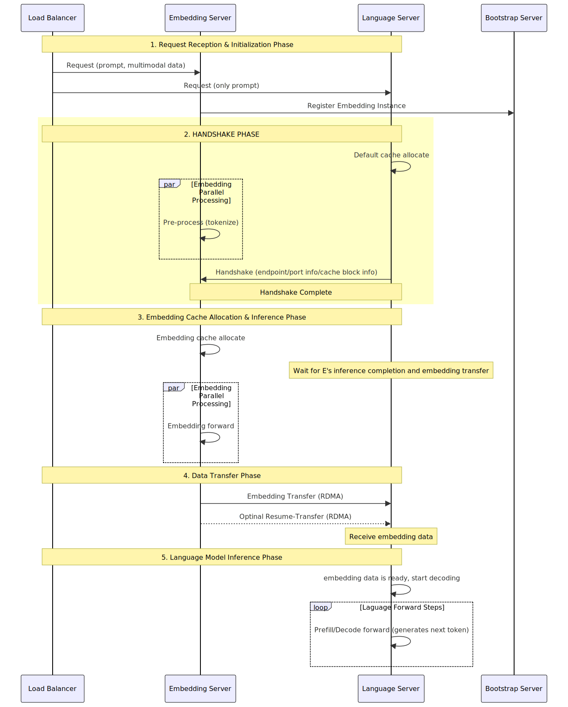

# Encode/Language 分离架构设计方案

> **版本**: 1.0
> **日期**: 2025-10-28

## 目录

1. [概述](#概述)
2. [架构设计](#架构设计)
3. [核心实现细节](#核心实现细节)
4. [关键特性](#关键特性)
5. [Demo示例](#demo示例)
6. [性能数据](#性能数据)
7. [未来优化方向](#未来优化方向)

---

## 概述

### 背景

在多模态大模型推理场景中，传统的单机推理架构存在以下问题：
1. **资源利用不均衡**：视觉编码器(Vision Encoder)和语言模型(Language Model)对计算资源的需求差异大
2. **扩展性受限**：无法独立扩展编码和生成部分
3. **延迟瓶颈**：Vision Encoder和Language Model串行执行，影响整体吞吐

### 设计目标

本方案实现了 **Encode/Language 分离架构**，将多模态推理分为两个独立的服务：
- **Encode侧**：负责图像/视频编码，生成embedding
- **Language侧**：负责文本生成，接收编码后的embedding


## 架构设计

### 整体架构





### 执行流程


```
1. Language实例/Encode实例同时接收请求：
Language实例接收请求：仅text部分
   ├─ 仅提取text部分
   └─ 加入MultimodalLanguagePreallocQueue

Encode实例接受请求：完整请求
   ├─ 提取text部分，multimodal执行预处理
   └─ 加入MultimodalEmbeddingBootstrapQueue

2. Language侧建立连接
   ├─ 通过Bootstrap Server查询Encode实例地址
   ├─ 创建MooncakeEmbeddingReceiver
   ├─ 分配接收缓冲区（16384 tokens）： 当前Language没有multimodal信息，默认按照default_allocated_tokens分配cache
   └─ 发送init消息到Encode侧

3. Encode实例接受请求：完整请求
   ├─ 接收到init消息
   ├─ 通过Vision Encoder编码图像 → 生成8000个token的embedding
   ├─ 按照实际的token长度分配块缓冲区（如：8000 tokens，需要2个块）
   └─ 写入: input_embeddings, fill_ids, mrope_positions, aux_datas

4. Encode → Language数据传输
   ├─ 通过Mooncake/RDMA传输8000 tokens
   ├─ 传输完成，发送Success状态；如果Language预分配的cache大小不够，则传输部分cache
   └─ 如Success, 则清理Encode侧缓冲区；如果部分传输，则等待下次resume-transfer，进入loop

5. Language处理接受请求：
5.1 Language侧接收完整结果：检测到Success状态
   ├─ 从缓冲区读取embedding数据 (如：8000 tokens)
   ├─ 构造input_embeds和multimodal_inputs
   ├─ 执行LLM prefill + decode
   └─ 流式返回生成结果
5.2 Language侧接收部分结果：检测到Transferring状态
   ├─ 从缓冲区读取embedding数据存到临时buffer
   └─ 申请新的cache，发起resume-transfer，等待下次resume-transfer结束,返回5.1

6. 清理资源
   ├─ Language侧释放接收缓冲区
   └─ 完成整个请求
```

### 核心组件

#### 1. Encode侧组件

```python
# 文件: python/sglang/srt/disaggregation/multimodal_embedding.py

class MultimodalEmbeddingBootstrapQueue:
    """
    管理Encode侧的连接建立和块分配
    - 处理bootstrap握手
    - 基于实际序列长度分配块
    - 初始化embedding sender
    """

class MooncakeEmbeddingSender:
    """
    负责发送embedding数据到Language侧
    - 支持块级别的数据传输
    - 自动处理传输失败和重试
    - 状态管理(Bootstrapping → WaitingForInput → Transferring → Success)
    """
```

**工作流程**：
1. 接收包含多模态数据的请求
2. 通过Vision Encoder处理图像/视频
3. 生成embedding并写入块级缓冲区
4. 通过MooncakeSender传输到Language侧
5. 监控传输状态并处理异常

#### 2. Language侧组件

```python
# 文件: python/sglang/srt/disaggregation/multimodal_language.py

class MultimodalLanguagePreallocQueue:
    """
    预分配阶段队列
    - 处理连接握手
    - 分配接收缓冲区块
    - 管理default_allocate_tokens配置
    """

class MultimodalLanguageTransferQueue:
    """
    传输阶段队列
    - 监控传输状态
    - 处理部分传输和resume-transfer
    - 合并embedding数据
    - 构造MultimodalInputs
    """

class MultimodalLanguageRequest:
    """
    Language侧请求状态
    - 维护部分传输的中间数据
    - 支持resume-transfer
    """
```

**工作流程**：
1. 从PreallocQueue接收请求
2. 分配块级缓冲区（基于配置的default_allocate_tokens）
3. 通过MooncakeReceiver接收embedding数据
4. 检测部分传输，必要时触发断点续传
5. 合并完整的embedding数据
6. 注入到Language Model进行文本生成


## 核心实现细节

### 1. Block-based Allocation

#### 实现方案

```python
# 文件: python/sglang/srt/disaggregation/utils.py

class ReqToMetadataBlockAllocator:
    """块级分配器"""

    def __init__(self, size: int, block_size: int):
        self.total_blocks = size
        self.block_size = block_size  # 每块的token数
        self.free_blocks = deque(list(range(size)))
        self.req_to_blocks = {}  # req_id -> [block_indices]

    def alloc(self, num_tokens: int, req_id: str) -> Optional[List[int]]:
        """基于实际token数分配块"""
        num_blocks_needed = (num_tokens + self.block_size - 1) // self.block_size

        if len(self.free_blocks) < num_blocks_needed:
            return None

        allocated_blocks = [
            self.free_blocks.popleft() for _ in range(num_blocks_needed)
        ]
        self.req_to_blocks[req_id] = allocated_blocks
        return allocated_blocks
```

**关键特性**：
- **按需分配**：根据实际序列长度计算所需块数, language侧为默认的blocks数目
- **Scatter/Gather**：支持非连续块的读写
- **自动回收**：请求完成后自动释放块

#### 缓冲区结构

```python
class MultimodalDataBuffers:
    def __init__(self, size: int, block_size: int, embedding_dim: int):
        # 每个缓冲区都是 [num_blocks, block_size * item_size]
        self.input_embeddings = torch.zeros(
            (size, block_size * embedding_dim),
            dtype=torch.bfloat16,
            device="cpu"
        )
        self.fill_ids = torch.zeros(
            (size, block_size),
            dtype=torch.int32,
            device="cpu"
        )
        self.mrope_positions = torch.zeros(
            (size, 3 * block_size),
            dtype=torch.int32,
            device="cpu"
        )
        self.aux_datas = torch.zeros(
            (size, 16),
            dtype=torch.int32,
            device="cpu"
        )
        # Deepstack支持 (Qwen3-VL-MoE)
        if num_deepstack_embeddings > 0:
            self.deepstack_embeddings = torch.zeros(
                (size, block_size * embedding_dim * num_deepstack_embeddings),
                dtype=torch.bfloat16,
                device="cpu"
            )
```

**缓冲区类型说明**：
- `input_embeddings`: 视觉编码后的embedding向量
- `fill_ids`: 对应的token ID序列
- `mrope_positions`: 多模态RoPE位置编码（3D位置信息）
- `aux_datas`: 辅助数据（embedding_length, mrope_position_delta等）
- `deepstack_embeddings`: Deepstack模型的额外embedding (可选, qwen3-vl系列)

### 2. Resume Transfer

#### 场景说明

当embedding数据量超过Language侧预分配的缓冲区时，需要分批传输：

```
Encode侧: [===========10000 tokens===========]
              ↓
Language侧初次分配: [====4096 tokens====]  (不够)
              ↓
检测到部分传输 (KVPoll.Transferring)
              ↓
Language侧追加分配: [====6000 tokens====]
              ↓
Encode侧继续传输剩余数据
              ↓
完成传输 (KVPoll.Success)
```

#### 实现机制

**Language侧检测逻辑**：

```python
# 文件: python/sglang/srt/disaggregation/multimodal_language.py

def pop_transferred(self):
    polls = poll_and_all_reduce([req.embedding_receiver for req in self.queue])

    for language_req, poll in zip(self.queue, polls):
        if poll == KVPoll.Transferring:
            # 从缓冲区读取已接收数据
            (embedding_data, fill_ids, mrope_positions,
             aux_datas, deepstack_embedding) = self.metadata_buffers.get_buf(
                block_indices=language_req.embedding_indices
            )

            actual_total_length = int(aux_datas[0])  # 真实总长度
            sent_tokens = len(fill_ids)  # 已发送tokens

            if actual_total_length > sent_tokens:
                # 需要断点续传
                remaining_tokens = actual_total_length - sent_tokens

                # 缓存已接收的部分数据
                language_req.partial_input_embeds = embedding_data
                language_req.partial_fill_ids = fill_ids.tolist()
                language_req.partial_mrope_positions = mrope_positions
                language_req.partial_aux_datas = aux_datas
                language_req.partial_sent_tokens = sent_tokens
                language_req.partial_deepstack_embedding = deepstack_embedding

                # 分配新的缓冲区接收剩余数据
                new_allocation = self.req_to_metadata_buffer_idx_allocator.alloc(
                    num_tokens=remaining_tokens,
                    req_id=language_req.req.rid
                )

                # 释放旧的缓冲区
                self.req_to_metadata_buffer_idx_allocator.free(
                    block_indices=language_req.embedding_indices,
                    req_id=language_req.req.rid
                )

                # 更新到新的缓冲区
                language_req.embedding_indices = new_allocation
                allocated_tokens = len(new_allocation) * block_size

                # 发送resume请求到Encode侧
                language_req.embedding_receiver.resume_transfer(
                    embedding_indices=new_allocation,
                    sent_tokens=sent_tokens,
                    allocated_tokens=allocated_tokens
                )
```

**Encode侧处理逻辑**：

```python
# 文件: python/sglang/srt/disaggregation/mooncake/conn_multimodal.py

def embedding_thread():
    """接收Language侧的resume请求"""
    while True:
        waiting_req_bytes = self.server_socket.recv_multipart()

        # 检查是否为resume请求 (8个字段)
        is_resume = len(waiting_req_bytes) >= 8

        if is_resume:
            transfer_info = TransferEmbeddingInfo.from_zmq(waiting_req_bytes)
            req = self.transfer_infos[room][mooncake_session_id]

            # 更新传输信息
            req.sent_tokens = transfer_info.sent_tokens
            req.allocated_tokens = transfer_info.allocated_tokens
            req.dst_embedding_indices = transfer_info.dst_embedding_indices
            req.resume_ready = True

            # 等待所有dst ranks准备好后重新触发传输
            if all(dst_req.resume_ready for dst_req in self.transfer_infos[room].values()):
                self.transfer_queues[shard_idx].put(
                    TransferEmbeddingChunk(
                        room=room,
                        embedding_indices=req.src_embedding_indices,
                        is_last=True,
                        total_tokens=req.total_tokens
                    )
                )
```

**传输函数的部分传输支持**：

```python
def send_embedding(
    self,
    mooncake_session_id: str,
    embedding_indices: List[int],
    dst_embedding_ptrs: List[int],
    dst_embedding_indices: List[int],
    total_tokens: int,
    block_size: int,
    sent_tokens: int = 0,
    allocated_tokens: int = None
) -> Tuple[int, bool]:
    """
    返回:
        (ret, is_partial)
        - ret: 0表示成功，1表示失败
        - is_partial: True表示部分传输，还有剩余数据
    """
    remaining_tokens = total_tokens - sent_tokens

    if remaining_tokens > allocated_tokens:
        tokens_to_send = allocated_tokens
        is_partial = True
    else:
        tokens_to_send = remaining_tokens
        is_partial = False

    # 计算起始块位置
    start_block = sent_tokens // block_size
    dst_blocks_needed = (tokens_to_send + block_size - 1) // block_size

    # 使用Mooncake/RDMA批量传输
    ret = self.engine.batch_transfer_sync(
        mooncake_session_id, src_addrs, dst_addrs, lengths
    )

    return ret, is_partial
```

## Demo示例

### 场景：Qwen3-VL-MoE多模态推理

#### 1. 启动Bootstrap Server

```bash
# 在某台机器上启动bootstrap server
python3 -m sglang.srt.disaggregation.mini_lb --host $HOST_IP \
--port $SERVER_PORT --vision http://${EMBEDDING_IP}:${EMBEDDING_PORT} \
--prefill http://${LANGUAGE_IP_LIST[0]}:${LANGUAGE_PORT} \
--enable-multimodal-disagg
```

#### 2. 启动Encode实例

```bash
export PORT=8001
export SGLANG_VLM_CACHE_SIZE_MB=40960
export TENSOR_PARALLEL_SIZE=2
export CHUNKED_PREFILL_SIZE=81920
export MAX_RUNNING_REQUESTS=128
export MEM_FRACTION_STATIC=0.85
export SGLANG_EMBEDDING_CACHE_BUFFER_SIZE=128
export SGLANG_EMBEDDING_CACHE_BLOCK_SIZE=16384
# Encode侧：负责视觉编码
python3 -m sglang.launch_server --model-path ${MODEL_PATH} --enable-torch-compile --max-prefill-tokens $CHUNKED_PREFILL_SIZE \
        --host $HOST_IP --port $PORT --trust-remote-code --tp-size ${TENSOR_PARALLEL_SIZE} --mem-fraction-static ${MEM_FRACTION_STATIC} \
        --enable-cache-report --log-level info --max-running-requests ${MAX_RUNNING_REQUESTS} \
        --chunked-prefill-size ${CHUNKED_PREFILL_SIZE} --attention-backend fa3 --json-model-override-args '{"is_multimodal_embedding": true}' \
        --mm-attention-backend fa3 --disaggregation-mode encode
```


#### 3. 启动Language实例

```bash
export PORT=8002
export TENSOR_PARALLEL_SIZE=8
export MAX_RUNNING_REQUESTS=128
export SGLANG_EMBEDDING_CACHE_BUFFER_SIZE=128
export SGLANG_EMBEDDING_CACHE_BLOCK_SIZE=16384
export MEM_FRACTION_STATIC=0.85
export CHUNKED_PREFILL_SIZE=8192
# 配置默认缓冲区大小
export SGLANG_EMBEDDING_DEFAULT_ALLOCATE_BUFFER_SIZE=16384

# Language侧：负责文本生成
# Qwen2.5-VL: "architectures": ["Qwen2ForCausalLM"]
python3 -m sglang.launch_server --model-path ${MODEL_PATH} --enable-torch-compile --disable-radix-cache \
        --host $HOST_IP --port $PORT --trust-remote-code --tp-size ${TENSOR_PARALLEL_SIZE} --served-model-name "qwen3-vl" \
        --enable-cache-report --log-level info  --max-running-requests ${MAX_RUNNING_REQUESTS} --json-model-override-args '{"architectures": ["Qwen3MoeForCausalLM"]}' \
        --mem-fraction-static ${MEM_FRACTION_STATIC} --chunked-prefill-size ${CHUNKED_PREFILL_SIZE} --attention-backend fa3 \
        --disaggregation-mode language
```

#### 4. 发送请求

```
python3 -m sglang.bench_serving \
                    --host ${HOST_IP} \
                    --port ${PORT} \
                    --model $MODEL_PATH \
                    --backend sglang-oai-chat \
                    --dataset-name "image" \
                    --random-input-len $input_len \
                    --random-output-len $output_len \
                    --random-range-ratio 1 \
                    --num-prompt $num_prompt \
                    --warmup-requests 0 \
                    --flush-cache \
                    --image-count 1 \
                    --image-resolution $image_size \
                    --image-format "jpeg" \
                    --image-content "random" \
                    --request-rate $qps \
                    --output-file $result_file \
                    --max-concurrency 128
```

---
## 性能数据

SLA: Mean TTFT< 4s; Mean TPOT< 100ms


### 单机（TP8）

| 模型               | 场景                                       | qps/gpu           | TTFT(Mean) | TPOT(Mean) |
|--------------------|--------------------------------------------|-------------------|------------|------------|
| qwen2.5-vl-72B     | 单图+文本 (2000x2000+1k), 输出300, qps: 0.52 | 0.06625 req/s/gpu | 3826.07 ms | 78.63 ms   |
| qwen3-vl-235B-A22B | 单图+文本 (2000x2000+1k), 输出300, qps: 0.85 | 0.1075 req/s/gpu  | 3738.24 ms | 91.24 ms   |

### 分离

| 配置项  | Encode侧         | Language侧       |
|---------|------------------|------------------|
| GPU型号 | NVIDIA H20 96GB  | NVIDIA H20 96GB  |
| GPU数量 | 2 (TP=2)         | 8 (TP=8)         |

| 模型               | 场景                                       | qps/gpu                  | TTFT(Mean)  | TPOT(Mean) |
|--------------------|--------------------------------------------|--------------------------|------------|-----------|
| qwen2.5-vl-72B     | 单图+文本 (2000x2000+1k), 输出300, qps: 0.78 | 0.07420 (+12%) req/s/gpu | 3632.70 ms | 95.61 ms  |
| qwen3-vl-235B-A22B | 单图+文本 (2000x2000+1k), 输出300, qps: 1.40 | 0.141 (+31.2%) req/s/gpu | 3831.58 ms | 95.34 ms  |


## 未来优化方向

### E/P/D分离

当前仅支持Encode/Language分离：Language当前实现可以和Prefill实现整合，支持后续Encode/Prefill/Decode分离

### 支持CachePool

MultimodalDataBuffers支持CachePool，支持D2D传输

### 支持chunk-prefill/transfer-embedding并行

### 迁移mini-lb router
