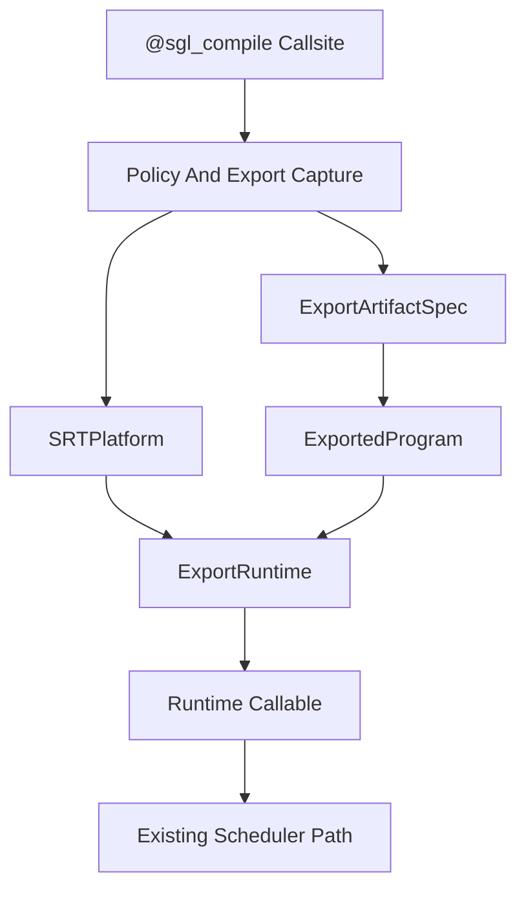

# Platform-Controlled Torch Compile And Export

This note documents the platform compile/export path for SRT platforms. It
introduces a single decorator, `@sgl_compile`, so individual callsites can be
compiled, skipped, or exported according to the active `SRTPlatform`.

## Design

The platform contract includes declarative compile/export hooks:

- `torch_compile_strategy()`: returns `compile`, `noop`, or `export`.
- `torch_compile_defaults()`: returns default `TorchCompileConfig` values for
  the platform.
- `get_export_runtime(config)`: returns an `ExportRuntime` backend for exported
  artifacts.

`@sgl_compile` is lazy. The wrapped callable is resolved on first use, after the
active platform is known. The decorator merges library defaults, platform
defaults, and callsite options, then either:

- returns the original function for `noop`,
- calls `torch.compile` for `compile`, or
- captures a `torch.export.ExportedProgram` for `export`, then optionally builds
  a runtime callable through the selected `ExportRuntime`.

In-tree platforms are now represented by explicit `SRTPlatform` subclasses in
`sglang.srt.platforms.builtin`. `SGLANG_PLATFORM` can select either an in-tree
platform such as `cuda` or `cuda_onnx`, or an out-of-tree plugin registered via
the existing platform entry point group.

`ExportArtifactSpec` records the graph key, artifact paths, export format,
shape policy, input schema, mutation contract, SGLang version, and PyTorch
version. Runtime conversion and execution live under
`sglang.srt.compilation.export_backends`, not in platform classes.

`CudaOnnxPlatform` demonstrates the export path. It selects the reusable
`OnnxExportRuntime`, which exports decorated callsites to ONNX, loads them with
ONNX Runtime, and executes them through `CUDAExecutionProvider` when available.
The built-in `OnnxPlatform` shows the same ONNX runtime selection without
inheriting CUDA graph support, which is the pattern ONNX-only vendors should
copy in out-of-tree plugins.



## In-Place Outputs

Some migrated callsites mutate inputs and return `None`. For example,
`apply_scaling_penalties(logits, scaling_penalties)` updates `logits` in place.
`TorchCompileConfig.copy_output_to_arg_index` handles this by returning the
mutated argument from the export wrapper and copying the runtime output back
into the original argument.

## Dynamic Shapes

The Qwen3-14B benchmark exposed a dynamic-shape issue: the first ONNX export of
`apply_scaling_penalties` could capture batch size 1, then fail when the SGLang
scheduler batched later requests at batch size 3.

For `shape_policy="infer_dynamic"`, `@sgl_compile` infers dynamic tensor shape
specs for positional tensor inputs. Batch-1 tensor examples are promoted during
export so PyTorch does not specialize that dimension to a constant. The runtime
still uses the real request tensors. `shape_policy="static"` leaves shapes fixed,
and callsites can still pass explicit `dynamic_shapes` for bounded or custom
per-dimension policies.

The exported Qwen3-14B ONNX artifact was verified to have symbolic input and
output dimensions:

```text
args_0 ['s33', 's50']
args_1 ['s33', 's50']
out slice_scatter ['s33', 's50']
```

## Artifact Modes

`TorchCompileConfig.export_artifact_mode` and `SGLANG_EXPORT_ARTIFACT_MODE`
support three modes:

- `build_if_missing`: load existing artifacts when present, otherwise export and
  save. This is the default local development mode.
- `export_only`: build artifacts, then run the original Python callable. This is
  intended for cloud builders that precompute artifacts without changing serving
  behavior.
- `load_only`: require prebuilt artifacts. This is intended for serving
  environments that should not run export/conversion work at startup.

Artifacts are written under `SGLANG_EXPORT_DIR`:

- `<safe_key>.pt2`: `torch.export.ExportedProgram`
- `<safe_key>.onnx`: ONNX Runtime artifact for `export_format="onnx"`
- `<safe_key>.metadata.json`: metadata used to validate key, format, shape
  policy, input schema, versions, and mutation contract

## ONNX Runtime Execution

`OnnxExportRuntime` first tries CUDA I/O binding when all inputs are contiguous
CUDA tensors, `CUDAExecutionProvider` is active, and the output buffer is known.
The current zero-copy path is enabled for mutation-style callsites using
`copy_output_to_arg_index`, such as `apply_scaling_penalties`. Other cases fall
back to the copied CPU/NumPy path.

## Qwen3-14B Benchmark Results

Hardware and model:

- GPU: NVIDIA H100 80GB HBM3
- Model: `Qwen/Qwen3-14B`
- Backend comparison: default CUDA platform vs `SGLANG_PLATFORM=cuda_onnx`
- Server flags: `--cuda-graph-max-bs 4 --disable-piecewise-cuda-graph`
- Request shape: prompt length about 27 tokens, `max_new_tokens=64`
- Sampling: `temperature=0.0`, `repetition_penalty=1.12`, `ignore_eos=true`
- Workload: 3 warmups, 12 sequential requests, 16 requests at concurrency 4

| Mode | Seq median latency | Seq completion tok/s | C4 median latency | C4 completion tok/s |
| --- | ---: | ---: | ---: | ---: |
| CUDA | `0.704s` | `90.9` | `0.718s` | `348.4` |
| `cuda_onnx` | `0.705s` | `90.8` | `0.718s` | `355.2` |

The initial ONNX prototype was slower because it copied tensors through
CPU/NumPy around a small sampling-side penalty kernel. After moving ONNX into
`OnnxExportRuntime` and adding CUDA I/O binding for in-place output callsites,
the same Qwen3-14B workload is effectively at parity with the default CUDA path
for sequential requests and slightly faster in this small concurrency-4 run.
This still measures a decorated sampling-side kernel, not full-model ONNX
deployment.

## Artifacts

Local benchmark outputs from the H100 run:

- `/tmp/qwen14_cuda_bench.json`
- `/tmp/qwen14_cuda_onnx_bench.json`
- `/tmp/qwen14_cuda_runtime_abstraction_bench.json`
- `/tmp/qwen14_cuda_onnx_runtime_abstraction_bench.json`
- `/tmp/sglang-qwen14-onnx-artifacts-dyn2/sglang.srt.sampling.penaltylib.repetition_penalty.apply_scaling_penalties.onnx`
- `/tmp/sglang-qwen14-onnx-runtime-abstraction/sglang.srt.sampling.penaltylib.repetition_penalty.apply_scaling_penalties.onnx`
- `/tmp/sglang-qwen14-onnx-runtime-abstraction/sglang.srt.sampling.penaltylib.repetition_penalty.apply_scaling_penalties.metadata.json`

The ONNX artifact is generated output and is not checked into the repository.

## Reproduction

The commands below assume the repository root as the working directory. They use
`uv` and the dependencies declared by `python/pyproject.toml`, then add ONNX
Runtime packages only for the `cuda_onnx` run.

If the local environment cannot build the editable package because Rust is not
installed, generate a temporary requirements file from the project metadata and
use `PYTHONPATH=python:.`:

```bash
python - <<'PY'
import tomllib

project = tomllib.load(open("python/pyproject.toml", "rb"))["project"]
deps = list(project.get("dependencies", []))
deps.extend(project.get("optional-dependencies", {}).get("test", []))
open("/tmp/sglang-pyproject-reqs.txt", "w").write("\n".join(deps) + "\n")
PY
```

Build a CUDA library path from the `uv` overlay:

```bash
LIB_PATHS=$(PYTHONPATH=python:. uv run --no-project \
  --with-requirements /tmp/sglang-pyproject-reqs.txt python - <<'PY'
import pathlib
import sys

paths = []
for path in sys.path:
    root = pathlib.Path(path) / "nvidia"
    if root.exists():
        paths.extend(str(lib) for lib in root.glob("*/lib"))
print(":".join(paths))
PY
)
```

Run the default CUDA server:

```bash
CUDA_VISIBLE_DEVICES=1 \
PYTHONPATH=python:. \
LD_LIBRARY_PATH="$LIB_PATHS:${LD_LIBRARY_PATH:-}" \
SGLANG_ENABLE_JIT_DEEPGEMM=0 \
uv run --no-project --with-requirements /tmp/sglang-pyproject-reqs.txt \
  python -m sglang.launch_server \
  --model-path Qwen/Qwen3-14B \
  --host 127.0.0.1 \
  --port 30000 \
  --cuda-graph-max-bs 4 \
  --disable-piecewise-cuda-graph \
  --trust-remote-code
```

Run the ONNX platform server:

```bash
CUDA_VISIBLE_DEVICES=1 \
PYTHONPATH=python:. \
LD_LIBRARY_PATH="$LIB_PATHS:${LD_LIBRARY_PATH:-}" \
SGLANG_ENABLE_JIT_DEEPGEMM=0 \
SGLANG_PLATFORM=cuda_onnx \
SGLANG_EXPORT_DIR=/tmp/sglang-qwen14-onnx-artifacts \
SGLANG_EXPORT_ARTIFACT_MODE=build_if_missing \
uv run --no-project --with-requirements /tmp/sglang-pyproject-reqs.txt \
  --with onnxruntime-gpu \
  --with onnxscript \
  --with nvidia-cublas-cu12 \
  --with nvidia-cuda-runtime-cu12 \
  --with nvidia-curand-cu12 \
  --with nvidia-cufft-cu12 \
  python -m sglang.launch_server \
  --model-path Qwen/Qwen3-14B \
  --host 127.0.0.1 \
  --port 30001 \
  --cuda-graph-max-bs 4 \
  --disable-piecewise-cuda-graph \
  --trust-remote-code
```

For an export-only artifact build, set:

```bash
SGLANG_EXPORT_ARTIFACT_MODE=export_only
```

For serving with prebuilt artifacts only, set:

```bash
SGLANG_EXPORT_ARTIFACT_MODE=load_only
```

Run the client benchmark against either port by changing `URL`:

```bash
uv run --no-project --with requests python - <<'PY'
import concurrent.futures
import json
import statistics
import time
import urllib.request

URL = "http://127.0.0.1:30000/generate"
PROMPT = (
    "Write a concise technical explanation of why benchmark methodology matters "
    "for comparing inference backends. Include one concrete example."
)
PARAMS = {
    "temperature": 0.0,
    "max_new_tokens": 64,
    "repetition_penalty": 1.12,
    "ignore_eos": True,
}


def call(i):
    payload = {
        "text": PROMPT + f"\nRequest id: {i}",
        "sampling_params": PARAMS,
    }
    req = urllib.request.Request(
        URL,
        data=json.dumps(payload).encode(),
        headers={"Content-Type": "application/json"},
        method="POST",
    )
    start = time.perf_counter()
    with urllib.request.urlopen(req, timeout=240) as response:
        body = response.read().decode()
    elapsed = time.perf_counter() - start
    obj = json.loads(body)
    meta = obj.get("meta_info", {})
    return {
        "latency_s": elapsed,
        "prompt_tokens": meta.get("prompt_tokens"),
        "completion_tokens": meta.get("completion_tokens"),
    }


def summarize(name, rows, wall=None):
    latencies = [row["latency_s"] for row in rows]
    completion_tokens = sum(row["completion_tokens"] or 0 for row in rows)
    total = wall if wall is not None else sum(latencies)
    return {
        "name": name,
        "requests": len(rows),
        "mean_latency_s": statistics.mean(latencies),
        "median_latency_s": statistics.median(latencies),
        "min_latency_s": min(latencies),
        "max_latency_s": max(latencies),
        "completion_tokens": completion_tokens,
        "wall_s": total,
        "completion_tok_per_s": completion_tokens / total,
    }


warmup = [call(f"warm-{i}") for i in range(3)]
sequential = [call(f"seq-{i}") for i in range(12)]
start = time.perf_counter()
with concurrent.futures.ThreadPoolExecutor(max_workers=4) as executor:
    concurrent_rows = list(executor.map(call, [f"conc-{i}" for i in range(16)]))
wall = time.perf_counter() - start

print(
    json.dumps(
        {
            "warmup": summarize("warmup", warmup),
            "sequential": summarize("sequential", sequential),
            "concurrency4": summarize("concurrency4", concurrent_rows, wall),
        },
        indent=2,
    )
)
PY
```

Run targeted unit coverage:

```bash
PYTHONPATH=python:. uv run --no-project \
  --with-requirements /tmp/sglang-pyproject-reqs.txt \
  python -m pytest \
  test/registered/unit/platforms/test_platform_interface.py \
  test/registered/unit/test_torch_compile_decorator.py \
  test/registered/unit/test_torch_compile_onnx.py
```
