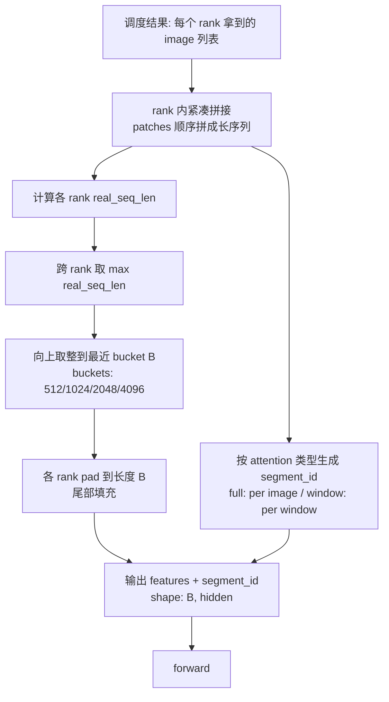

# VLM Image 级 DP 调度

## PR 调研记录

这份记录用于在 PR review 中对齐 VLM image 级 data parallel 调度方案。当前结论是：调度粒度应落在 image，而不是 request；vision encoder 前按 rank 本地紧凑拼接并做跨 rank bucketed padding；encoder 输出后按 image 语义回填，并用 per-pair 紧凑 payload 的 all-to-all 避免全量广播。

本调研主要覆盖三类 review 问题：

- **调度语义**：同一个 request 的多张 image 允许分散到不同 rank，纯文本 request 不进入 image 调度。
- **SPMD shape 对齐**：每个 rank 的真实 image patch 总量不同，但送入 vision encoder 的第 0 维必须统一，统一长度由本 batch 的跨 rank 最大真实长度向上取 bucket 得到。
- **回填语义**：回填仍以 image 为逻辑单元，传输时才按 `(src, dst)` pair 紧凑拼接；接收端依赖 metadata 恢复 request 内 image 顺序。

仍需要 reviewer 重点确认的部分：

- window attention 的真实 window 边界来源，以及 segment_id 是否应完全复用模型侧已有 metadata。
- bucket 档位是否只需要覆盖当前目标模型，还是要抽象成可配置策略。
- all-to-all metadata 的字段语义是否足够支撑后续 decoder 侧 merge、debug 与异常定位。

## 背景

**对于一个 batch 中的所有图片，决定每张图片由哪个 rank 负责处理。**

调度的基本单位是 **image**，不是 request。这一选择带来以下语义：

- 调度前先把 batch 中所有 request 的 image 平铺成一个列表。
- 每张 image 只分配给一个 rank，不会被拆分。
- 同一个 request 的多张 image 可以落到不同 rank 上。
- 一个 rank 可以分到 0、1 或多张 image。
- 纯文本 request 不参与调度。

由此，调度的输入和输出可以概括为：

- **输入**：batch 中的 request 列表（含各自的 image）、可处理 image 的 rank 数。
- **输出**：每个 rank 被分配到的 image 列表。

### 例子

设有 4 个 rank（rank0–rank3），均可处理 image。当前 batch 中有 6 个 request，刻意构造成同时覆盖三种边界情况：

- **request 数 > rank 数**：6 个 request，4 个 rank。
- **单 request 的 image 数 > rank 数**：req2 有 7 张 image。
- **每个 request 的 image 数都不同**，包含纯文本 request。

| Request | Images        | 说明            |
|---------|---------------|---------------|
| req0    | img0          | 单图            |
| req1    | img1, img2    |               |
| req2    | img3 – img9   | 7 张，超过 rank 数 |
| req3    | —             | 纯文本           |
| req4    | img10 – img12 |               |
| req5    | img13 – img16 |               |

调度时先把上面 17 张 image 平铺成一个列表，再按 `i mod W` 分配到 rank，结果为：

| Rank  | Assigned Images                              |
|-------|----------------------------------------------|
| rank0 | req0.img0, req2.img4, req2.img8, req4.img12, req5.img16 |
| rank1 | req1.img1, req2.img5, req2.img9, req5.img13  |
| rank2 | req1.img2, req2.img6, req4.img10, req5.img14 |
| rank3 | req2.img3, req2.img7, req4.img11, req5.img15 |


## 设计细节

### 一、调度策略

#### 分配算法

按平铺顺序 round-robin：

1. 把 batch 内所有 image 按 `(req_idx, image_idx_in_req)` 字典序平铺成有序列表 `[img_0, …, img_{N-1}]`。
2. 第 `i` 张 image 分配给 rank `i mod W`，`W` 为参与调度的 rank 数。
3. 当 `N < W` 时，前 `N` 个 rank 各拿一张，其余 rank 空载。


### 二、Padding

#### Padding 的对象

每个 rank 在送入 vision encoder 前要构造一个张量。该张量沿第 0 维（seq_len）拼接本 rank 分到的所有 image 的 patches：

- 单张 image 经预处理后 → `[patches_of_this_image, hidden]`
- 同 rank 多张 image 顺序拼接 → `[Σpatches, hidden]`
- 尾部补 0 向上取整到 bucket 长度 B → `[B, hidden]`
- 同步生成 segment_id → `[B]`

#### 整体流程



image DP 后每个 rank 拿到的 image 数与尺寸都不同，但 SPMD 与等长 collective 要求所有 rank 的 encoder 输入第 0 维一致。对齐遵循三条规则：

- **rank 内紧凑拼接 + 尾部 padding**：分到的 image patches 顺序拼成一个长序列，尾部追加 padding。
- **长度必须是 128 的整数倍**：pallas flash attention kernel 默认按 128 分 block，受此硬约束。
- **跨 rank bucketed 对齐**：预设若干档（如 512 / 1024 / 2048 / 4096，均为 128 的倍数），按本 batch 各 rank 真实 patch 总数的最大值向上取整到最近一档，所有 rank 统一 pad 到这个值。bucket 数有限，JIT cache 命中率高，避免 shape 抖动触发 recompile。

#### segment_id

逻辑形状为 `[seq_len]` 的整数张量，与 feature 同步生成、沿 seq_len 对齐。同段可见、跨段不可见。与 `tpu-inference` 保持一致，若当前 rank 真实 segment 数为 `K`，则真实 segment id 使用 `0..K-1`，padding 使用 reserved segment id `K`。

由控制面根据该层 attention 类型生成：

- **full attention**：每张 image 一个 segment id，跨 image 屏蔽。
- **window attention**：image 内部按 window 进一步切分，每个 window 一个 segment id，使同一 window 内 token 可见、跨 window token 隔离。TODO：这里需要确认目标模型的 window 边界来源和精确定义，例如是否完全沿用模型侧的空间 window metadata，再固化 segment_id 的生成规则。

送入 pallas flash attention kernel 前，适配层会把这条逻辑序列扩展为 Q/KV 两份 segment id。kernel 只按 segment id 是否相等判定可见性，不对某个固定 id 做特殊分支；因此 padding 的关键约束是 id 必须与所有真实 segment 隔离，padding 位置的输出由下游忽略。空载 rank（分到的 image 数为 0）时 `K = 0`，自然退化为「整序列全是 segment 0」，与正常 rank 形状一致，无需单独的 dummy 输入机制。

#### 例子

接续背景小节的 4-rank 分配表，给每张 image 标注真实 patch 数：

| Image         | patches |
|---------------|---------|
| img0          | 256     |
| img1, img2    | 196     |
| img3 – img9   | 320     |
| img10 – img12 | 144     |
| img13 – img16 | 256     |

代入分配表，逐 rank 算 padding 前的真实序列长度（`real_seq_len`，即本 rank 所有 image patch 数之和）：

| Rank  | Assigned Images (patches)                                       | real_seq_len |
|-------|-----------------------------------------------------------------|--------------|
| rank0 | img0 (256) + img4 (320) + img8 (320) + img12 (144) + img16 (256) | **1296**     |
| rank1 | img1 (196) + img5 (320) + img9 (320) + img13 (256)              | **1092**     |
| rank2 | img2 (196) + img6 (320) + img10 (144) + img14 (256)             | **916**      |
| rank3 | img3 (320) + img7 (320) + img11 (144) + img15 (256)             | **1040**     |

跨 rank max(real_seq_len) = 1296 → bucket 取 **2048** → 所有 rank pad 到 2048。

以 **rank0** 为基准（real_seq_len=1296，pad 到 2048）演示两种 attention：

**full attention** — 每张 image 一个 segment id：

| Image   | patches | segment id |
|---------|---------|------------|
| img0    | 256     | 0          |
| img4    | 320     | 1          |
| img8    | 320     | 2          |
| img12   | 144     | 3          |
| img16   | 256     | 4          |
| padding | 752     | 5          |

segment_id：

```
[0×256, 1×320, 2×320, 3×144, 4×256, 5×752]
```

**window attention**（示意）— 同一张 image 内部按窗口再切，每个窗口一个独立 id，不足一个窗口的尾部归为更小的一段。TODO：下面的切分长度只用于说明 segment_id 形态，后续需要替换为目标模型真实 window 边界：

| Image   | patches | 切分             | segment ids |
|---------|---------|----------------|-------------|
| img0    | 256     | 128 + 128      | 0, 1        |
| img4    | 320     | 128 + 128 + 64 | 2, 3, 4     |
| img8    | 320     | 128 + 128 + 64 | 5, 6, 7     |
| img12   | 144     | 128 + 16       | 8, 9        |
| img16   | 256     | 128 + 128      | 10, 11      |
| padding | 752     | —              | 12          |

segment_id：

```
[0×128, 1×128, 2×128, 3×128, 4×64, 5×128, 6×128, 7×64, 8×128, 9×16, 10×128, 11×128, 12×752]
```

两种 attention 下 feature 张量 shape、real_seq_len、bucket、padding 长度都一致，只有 segment_id 不同。

### 三、回填与顺序

#### 回填路径

vision encoder 输出后，每个 rank 上是 `[B, hidden]` 的 embedding 张量，前 `real_seq_len` 个位置有效，按 segment_id 标识各 image 边界。回填采用 **per-image 语义、per-pair 紧凑 payload 的 all-to-all**：

- **语义粒度 per-image**：每张 image 仍是独立回填单元，与调度单位一致。
- **传输 payload per-pair 紧凑拼接**：对每个 `(src, dst)`，发送端把发往同一 `dst` 的 image embedding 按 `(req_id, image_idx)` 排序后紧凑拼成一条 token 序列，只在尾部 padding。
- **原语 all-to-all**：每个 rank 直接把对应 payload 发给该 image 的 owner rank（该 request 在文本/decoder 侧所属的 rank），避免 all-gather 的全量广播带宽浪费。
- **随行 metadata**：metadata 以 image 为条目，按 payload 中的 image 顺序排列，记录有效标记、`req_id`、`image_idx`、`token_span`、payload 内 offset 与真实长度。接收端据此从 payload 切出每张 image 的真实 embedding。

SPMD 下 all-to-all 要求每对 `(src, dst)` 的 payload shape 固定。控制面在本 batch 内统计所有 pair 的真实发送 token 数，取统一的 `max_send_tokens_per_pair`，每个 pair 的 payload 都 pad 到这个长度；同时统计每个 pair 的 image 条目数，metadata 列表 pad 到统一的 `max_send_images_per_pair`。空 pair 发送全 padding payload 和全 invalid metadata。接收端只处理 valid metadata，用 offset 与真实长度切出 image embedding，再按 `(req_id, image_idx)` 查表 merge。

## Review checklist

- image 级 round-robin 是否符合目标 batch 语义与负载均衡预期。
- padding bucket 是否同时满足 pallas flash attention 的 128 block 约束和 JIT cache 稳定性要求。
- segment_id 对 padding 与空载 rank 的处理是否与现有 pallas flash attention 适配层一致。
- all-to-all 回填是否覆盖 request 数大于 rank 数、单 request image 数大于 rank 数、以及空 pair 的边界情况。
