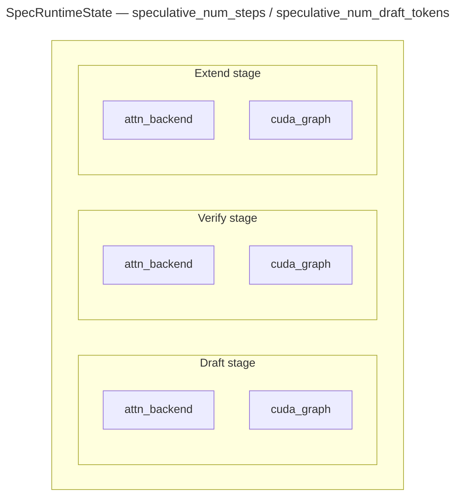
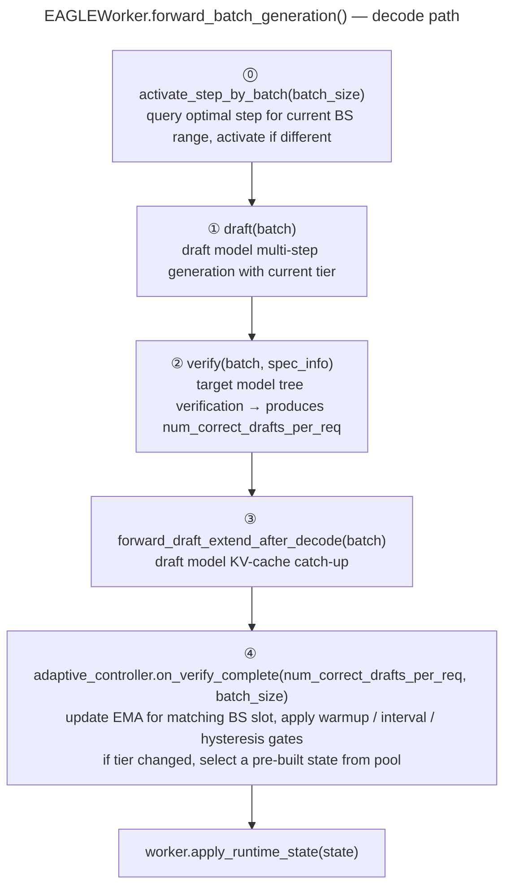

Adaptive speculative decoding lets SGLang adjust `speculative_num_steps/speculative_num_draft_tokens` at runtime instead of keeping a single fixed value for the whole server lifetime.
It is designed for workloads whose accept length changes over time, where one static step count is rarely optimal.

## Current support

- Only `--speculative-algorithm EAGLE` or `EAGLE3`
- Only `--speculative-eagle-topk 1`
- If either condition is not met, SGLang falls back to static speculative settings

## Why adaptive steps help

`speculative_num_steps` controls how many draft-model autoregressive steps run in each speculative round. In practice, the best value depends on the current workload.

- If `num_steps` is too small, the draft model could have produced more accepted tokens, but the round stops too early.
- If `num_steps` is too large, the draft model produces many candidate tokens that the target model rejects, so extra draft work is wasted.
- At **high batch sizes**, the cost of each wasted draft step is multiplied across all sequences in the batch, so the optimal step count is often lower than at low batch sizes.

Real traffic often moves between high-acceptance and low-acceptance phases, and batch sizes vary continuously. Adaptive mode follows both signals at runtime instead of hard-coding a single global `num_steps`.

## Design overview

The adaptive mechanism has three pieces:

- `AdaptiveSpeculativeParams`: the EMA-based policy
- `SpecRuntimeState`: the per-tier runtime state bundle
- `AdaptiveController`: the coordinator that queries the policy for the current batch size and activates the matching runtime state

### Per-batch-size independent tracking

The controller maintains **independent EMA trackers for each batch size range**, so observations at small BS don't pollute the large BS signal. Each BS range can have its own candidate steps, hysteresis thresholds, and ceiling coefficient.

BS ranges are defined as lower bounds in the config file (e.g., keys `"1"` and `"8"` mean BS 1–7 uses one slot, BS 8+ uses another). `SpecRuntimeState` objects are shared across BS ranges with the same step count — each state owns CUDA graphs captured for the reachable padded batch sizes of that step.



This matters because `CudaGraphRunner` is shape-dependent. Each candidate tier owns its own graph and backend state, so runtime switching is a reference swap, not an online graph recapture.

## Runtime flow

The adaptive update happens in two places:

1. **Pre-draft**: query the optimal step for the current batch size and activate if different
2. **Post-verify**: update the matching BS slot's EMA with observed accept lengths



> Tier switch happens after the current round completes. Backends and CUDA graphs are never swapped mid-round.

## How the policy decides

After each verify pass, SGLang reads the accepted draft length per request, computes the batch average, smooths it with an exponential moving average (EMA), and switches among the candidate tiers for the matching BS slot.

The decision logic is intentionally conservative:

- `warmup_batches` skips the first few batches
- `update_interval` avoids switching every batch
- `down_hysteresis` and `up_hysteresis` reduce oscillation
- `ceiling_coeff` — an optional EMA ceiling rule can cap `num_steps` proportionally to observed draft quality, preventing over-speculation at high BS

Conceptually, the policy probes one step beyond the observed acceptance:

```text
target_steps ≈ clamp(round(ema_accept_len) + 1, min(candidate_steps), max(candidate_steps))
```

So if recent requests consistently accept more drafted tokens, the policy tends to move up. If they start rejecting earlier, it tends to move down.

## Usage

`--speculative-adaptive-config` is optional, but the speculative setup still needs to be valid for adaptive mode.

```bash
python3 -m sglang.launch_server \
    --model meta-llama/Llama-2-7b-chat-hf \
    --speculative-algorithm EAGLE \
    --speculative-draft-model-path lmsys/sglang-EAGLE-llama2-chat-7B \
    --speculative-eagle-topk 1 \
    --speculative-num-steps 3 \
    --speculative-num-draft-tokens 4 \
    --speculative-adaptive
```

If you want to override the defaults, add `--speculative-adaptive-config /path/to/adaptive_spec.json`.

Example config:

```json
{
  "ema_alpha": 0.2,
  "warmup_batches": 10,
  "update_interval": 5,
  "1": {"candidate_steps": [1, 3, 7], "up_hysteresis": 0.0, "down_hysteresis": -0.25, "ceiling_coeff": 0},
  "8": {"candidate_steps": [1],       "up_hysteresis": 0.0, "down_hysteresis": 0.0,   "ceiling_coeff": 0}
}
```

Non-integer keys (`ema_alpha`, `warmup_batches`, `update_interval`) are global overrides applied to every BS slot. Integer keys (`"1"`, `"8"`) define per-BS slots.

## Config file reference

The config file is optional. When provided, each integer BS-slot key must specify `candidate_steps`; all other keys fall back to defaults.

### Per-BS slot parameters

<table style={{width: "100%", borderCollapse: "collapse", tableLayout: "fixed"}}>
  <colgroup>
    <col style={{width: "33.33%"}} />
    <col style={{width: "33.33%"}} />
    <col style={{width: "33.33%"}} />
  </colgroup>
  <thead>
    <tr>
      <th>Key</th>
      <th>Default</th>
      <th>Meaning</th>
    </tr>
  </thead>
  <tbody>
    <tr>
      <td><code>candidate_steps</code></td>
      <td><em>required</em></td>
      <td>Candidate <code>speculative_num_steps</code> tiers for this BS range. Must be a non-empty list of positive ints; a slot that omits it raises a config error</td>
    </tr>
    <tr>
      <td><code>down_hysteresis</code></td>
      <td><code>-0.25</code></td>
      <td>Extra margin before moving to a smaller step</td>
    </tr>
    <tr>
      <td><code>up_hysteresis</code></td>
      <td><code>0.0</code></td>
      <td>Extra margin before moving to a larger step</td>
    </tr>
    <tr>
      <td><code>ceiling_coeff</code></td>
      <td><code>0</code> (disabled)</td>
      <td>EMA ceiling coefficient; set &gt; 0 to cap steps proportionally to draft quality</td>
    </tr>
  </tbody>
</table>

### Global parameters

<table style={{width: "100%", borderCollapse: "collapse", tableLayout: "fixed"}}>
  <colgroup>
    <col style={{width: "33.33%"}} />
    <col style={{width: "33.33%"}} />
    <col style={{width: "33.33%"}} />
  </colgroup>
  <thead>
    <tr>
      <th>Key</th>
      <th>Default</th>
      <th>Meaning</th>
    </tr>
  </thead>
  <tbody>
    <tr>
      <td><code>ema_alpha</code></td>
      <td><code>0.2</code></td>
      <td>EMA smoothing factor for accepted draft length</td>
    </tr>
    <tr>
      <td><code>update_interval</code></td>
      <td><code>5</code></td>
      <td>Recompute interval, in verify batches, after warmup</td>
    </tr>
    <tr>
      <td><code>warmup_batches</code></td>
      <td><code>10</code></td>
      <td>Number of verify batches to observe before switching</td>
    </tr>
  </tbody>
</table>

## Monitoring

You can inspect the active tier and acceptance metric via `/server_info`:

```bash
curl -s http://127.0.0.1:30000/server_info | jq '.internal_states[0] | {speculative_num_steps, avg_spec_accept_length}'
```

- `speculative_num_steps` is the current active tier
- `avg_spec_accept_length` helps explain whether the server is likely to move up or down

## Tuning tips

- Start with the built-in default (conservative) — it is safe for all draft model qualities
- For strong draft models, use the aggressive config with ceiling rule
- Use fewer candidate steps if you want lower startup GPU memory overhead
- Increase `ema_alpha` to react faster, or lower it for more stability
- Increase `warmup_batches` or `update_interval` if tier switching is too noisy
- At high batch sizes, narrower ladders (e.g., `[1, 2]` or `[1]`) often outperform wide ones
- If your workload is already stable and one static setting is well tuned, adaptive mode may not help much

## Recommended configs

The built-in default is conservative — safe for all draft models but may under-speculate for strong ones. Save one of these as a JSON file and pass via `--speculative-adaptive-config`.

### Conservative (default) — for weak draft models

This is the built-in default: BS 8–31 allows `[1, 3]`, and BS≥32 locks to `step=1` to avoid wasted compute. Best for models like MiniMax-M2.5, DSV4.

```json
{
  "1":  {"candidate_steps": [1, 3, 7], "up_hysteresis": 0.0, "down_hysteresis": -0.25, "ceiling_coeff": 0},
  "8":  {"candidate_steps": [1, 3],    "up_hysteresis": 0.0, "down_hysteresis": 0.0,   "ceiling_coeff": 0},
  "32": {"candidate_steps": [1],       "up_hysteresis": 0.0, "down_hysteresis": 0.0,   "ceiling_coeff": 0}
}
```

### Aggressive — for strong or high-variance draft models

Uses wider ladders with ceiling rule to cap speculation at high BS. Best for models like GLM-4.7-FP8.

```json
{
  "1":   {"candidate_steps": [1, 3, 7], "up_hysteresis": 0.0, "down_hysteresis": -0.25, "ceiling_coeff": 0},
  "8":   {"candidate_steps": [1, 3, 7], "up_hysteresis": 0.0, "down_hysteresis": -0.25, "ceiling_coeff": 3.0},
  "64":  {"candidate_steps": [1, 3],    "up_hysteresis": 0.0, "down_hysteresis": -0.25, "ceiling_coeff": 1.67},
  "128": {"candidate_steps": [1, 3],    "up_hysteresis": 0.0, "down_hysteresis": -0.25, "ceiling_coeff": 1.2}
}
```

### Custom per-model config

For the best performance, benchmark your specific model across batch sizes with different static `num_steps` values, then build a per-BS config that matches each range's optimal step. A well-tuned per-model config might outperform the generic presets above.
