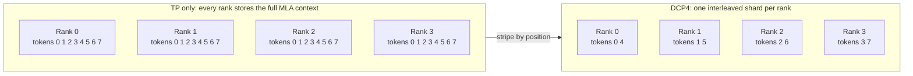
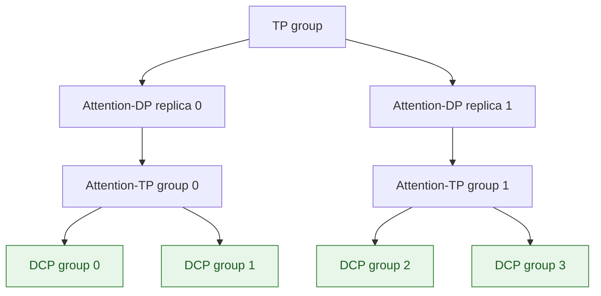
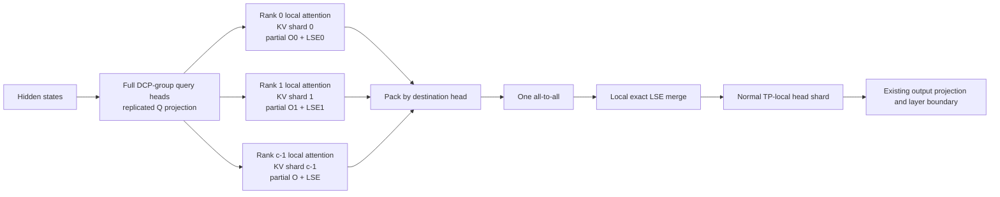
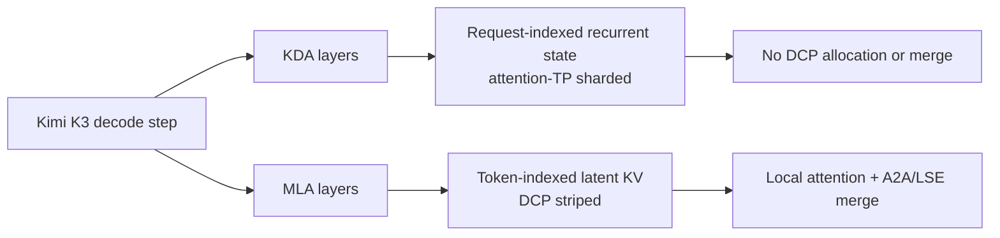
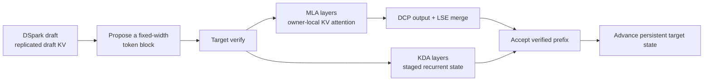
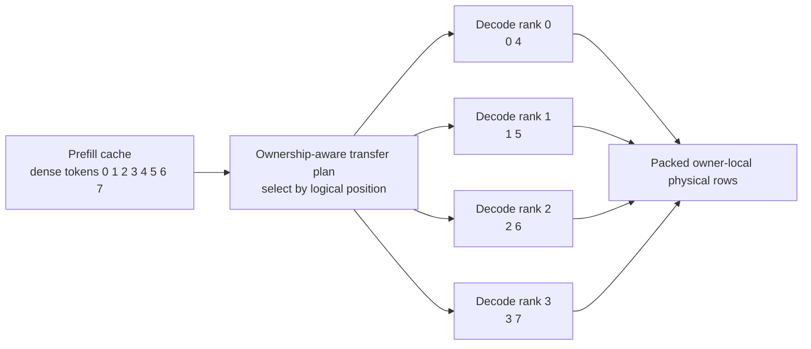
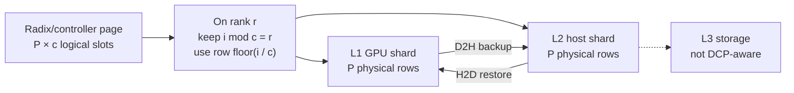

Decode context parallelism (DCP) adds context as a sharding dimension. Ranks in an existing tensor-parallel group split a request's KV cache by token position; with DCP size `c`, rank `r` owns position `p` when `p mod c = r`. In return, each rank stores and reads roughly `1/c` of the MLA KV cache.

The catch is that local attention now sees only part of the context. The MLA path therefore returns a partial output and log-sum-exp (LSE), exchanges both in one packed all-to-all, and merges them exactly. Kimi K3 applies this only to MLA layers; its request-indexed KDA state remains unchanged. DCP complements TP and [attention data parallelism (DPA)](/docs/advanced_features/dp_dpa_smg_guide) rather than replacing them.

The primary path is absorbed MLA decode and static target verification.

<Note>
DCP is implemented, with the limitations listed in [Configuration and current boundaries](#configuration-and-current-boundaries). `dcp_size=1` retains existing non-DCP behavior.
</Note>

## Enable DCP

| Setting | Behavior |
| --- | --- |
| `--dcp-size N` | Enables DCP and widens virtual capacity and page size by `N`. Alias: `--decode-context-parallel-size`. |
| `--dcp-comm-backend` | Selects the MLA partial-output merge: `ag_rs`, `a2a`, or `fi_a2a`. |
| `--dcp-replicate-q-proj` | Removes the query all-gather for supported MLA weights. Use `--no-dcp-replicate-q-proj` to disable a model-specific default. |
| `--enable-dp-attention` | Composes only when DCP groups nest inside attention TP. |

A DCP group must fit inside one attention-TP group and one attention-DP replica:

```text Topology
attn_tp_size = tp_size / attn_dp_size
attn_tp_size % dcp_size == 0
```

For example, `TP=64, DP=4, DCP=16` creates four valid 16-rank attention replicas. `DCP=32` would cross replica boundaries and is invalid.

<Warning>
Startup currently checks only `tp_size % dcp_size == 0`, not the stronger condition above. Until that check is fixed, DPA+DCP deployments must enforce containment when choosing the topology.
</Warning>

MLA decode on DeepSeek-V3.1 with DCP 8 inside TP 8:

```bash Command
sglang serve \
  --model-path deepseek-ai/DeepSeek-V3.1 \
  --trust-remote-code \
  --tp-size 8 \
  --dcp-size 8 \
  --host 0.0.0.0 \
  --port 30000
```

Kimi K3 on 32 GPUs with DPA and DCP 8. The model override enables replicated Q by default and picks `fi_a2a` on MNNVL systems, otherwise `a2a`:

```bash Command
sglang serve \
  --trust-remote-code \
  --model-path moonshotai/Kimi-K3 \
  --tp-size 32 \
  --ep-size 32 \
  --enable-dp-attention \
  --dp-size 4 \
  --dcp-size 8 \
  --host 0.0.0.0 \
  --port 30000
```

See the [Kimi K3 cookbook](/cookbook/autoregressive/Moonshotai/Kimi-K3) for large-scale presets that combine DCP with DPA and expert parallelism.

## Problem and decision

Absorbed MLA shares one latent KV representation across all query heads. TP can split the heads and weights, but not that cache, so every attention-TP rank stores and reads the same context.



The design has four parts:

1. Stripe MLA KV round-robin by logical token position.
2. Keep a shared virtual cache index space on every rank.
3. Run attention against the owner-local shard.
4. Merge partial outputs by LSE into the usual TP-local head layout.

### Goals and non-goals

| Goals | Non-goals |
| --- | --- |
| Increase logical MLA KV capacity by about `dcp_size` | Select a prefill parallel strategy |
| Preserve non-DCP attention semantics | Shard KDA recurrent state |
| Compose with TP, DPA, static verification, and PD | Model every expert, pipeline, or fused-collective cost |
| Keep the change inside attention | Apply the MLA cost model to MHA/GQA |
| Preserve `dcp_size=1` behavior | Support HiCache L3 in the current milestone |

## Architecture

### Process-group topology

A DCP group must fit inside one attention-TP group and one attention-DP replica.



### Virtual KV layout

Let each rank have physical token capacity `C` and physical page size `P`. DCP exposes a shared virtual allocator:

```text Layout
virtual capacity  = C * c
virtual page size = P * c
owner(v)          = v mod c
physical(v)       = floor(v / c)
```

Every rank sees the same request-to-token map. On write, it keeps its positions and compacts them into the local physical pool. One widened virtual page maps to one physical page on each rank:

```text Layout
v = page * P * c + local_offset * c + rank
floor(v / c) = page * P + local_offset
```

The round-robin layout stays balanced to within one token and needs no rebalancing as a sequence grows.

### MLA decode dataflow



For context partition `r`, the attention kernel returns locally normalized output `o_r` and `lse_r`. The global result is:

```text Merge
lse = logsumexp_r(lse_r)
o   = sum_r(exp(lse_r - lse) * o_r)
```

This is exact aside from normal floating-point reduction order. The merge uses the attention backend's LSE base, either base-e or base-2.

### Query-projection replication

Normally each layer all-gathers its absorbed and rotary query components. `--dcp-replicate-q-proj` gathers the query-projection and `w_kc` weights once at startup and computes the full DCP-group query locally. The trade is more weight memory and GEMM work for one fewer collective per layer. Only unquantized BF16/FP16 weights use this path; other layers fall back to the query all-gather.

### Communication backends

| Backend | DCP collectives per MLA layer | Notes |
| --- | --- | --- |
| `ag_rs` | Query AG + LSE AG + FP32 output RS | Generic fallback |
| `a2a`, gathered Q | Query AG + packed NCCL A2A | Two collectives |
| `a2a`, replicated Q | One packed NCCL A2A | Canonical low-latency path |
| `fi_a2a`, replicated Q | One FlashInfer MNNVL A2A | Requires CUDA, SM90+, and MNNVL fabric |

Kimi K3 enables replicated Q by default and picks `fi_a2a` on MNNVL systems, otherwise `a2a`. Its decode backend is `cutedsl_mla` or `tokenspeed_mla`. The generic defaults remain `ag_rs` and model-resolved query replication.

### Kimi K3 hybrid layers



`HybridLinearKVPool` keeps the two states separate. Only the MLA `full_kv_pool` uses widened token locations; the Mamba/KDA pool stays indexed by request slot. DCP grows long-context MLA capacity, but does not reduce the KDA state that eventually limits request concurrency.

### Extend-time prefix reconstruction

The constant-size collective applies to decode, not extend. Extend may gather cached prefix shards, pad them, restore token order, and append new tokens for the selected kernel. That work grows with prefix length and is outside the decode cost model below.

## Compositions

### DCP × DSpark

DSpark proposal remains replicated. DCP enters at target verification, where static mode gives every request the same candidate width and can reuse the decode-shaped path.



MLA verification builds rank-local lengths and block tables, then follows the same local-attention-and-merge path as decode. KDA instead stages recurrent state and commits only the accepted prefix. Draft KV is replicated and sized for the target allocator's widened location space, so DCP saves target MLA KV, not draft KV or KDA state. In the cost model, `T` includes all verify rows.

Current limits:

- Kimi K3 requires `SGLANG_RAGGED_VERIFY_MODE=static`; compact and cap-accept modes are not yet validated.
- Target verify and draft extend use the DCP-capable decode backend.
- HiCache+DCP currently rejects speculative decoding.

### DCP × PD disaggregation

A dense prefill page cannot be copied directly into striped decode storage. The PD sender uses the decode rank's DCP metadata to select and pack the right rows. See [PD disaggregation](/docs/advanced_features/pd_disaggregation) for the transfer engines.



The transfer policy is:

- equal DCP sizes require matching DCP ranks and use the existing page path
- DCP1 prefill to DCP decode uses token relayout for MLA/hybrid-MLA pools
- all other DCP-size transitions are rejected

The plan includes the exact token count, preventing stale rows from leaking out of a partial final page. Mooncake and NIXL use the same plan. KDA state keeps its attention-TP mapping and bypasses DCP filtering.

This composition requires Mooncake or NIXL, matching physical page size and KV dtype, prefill attention CP `1`, and decode chunk cache. Decode radix cache and HiCache are not supported here.

### DCP × HiCache L2

HiCache keeps one widened logical page space across L1 and L2. The controller sees `P * c` slots, while each GPU and host buffer stores only its `P` local rows. See [HiCache](/docs/advanced_features/hicache) for the cache hierarchy.



Before H2D or D2H, both index lists keep positions owned by this rank and map `i` to `floor(i / c)`. Applying the same rule on both sides preserves token pairing even after pages are reordered. Transfers cover whole widened pages, and every rank moves its shard independently, with no DCP collective.

For Kimi K3, this translation applies to MLA KV. KDA/Mamba state uses its own request-indexed host pool. The current scope is MLA L1/L2: L3, LMCache, HiSparse, non-MLA KV host pools, speculative decoding, and PD decode are not supported in this combination.

## Communication cost

These formulas estimate bytes sent per GPU and layer, assuming BF16/FP16 activations, FP32 LSE, and standard ring collectives.

| Symbol | Meaning |
| --- | --- |
| `T` | Query rows executed by one TP group before DPA partitioning, including padding that reaches attention |
| `d_model` | Hidden width |
| `h` | Model-total MLA query heads |
| `d_c` | `kv_lora_rank` / absorbed output width |
| `d_r` | Rotary query width |
| `tp`, `dp`, `c` | TP, attention-DP, and DCP sizes |

### Base TP and DPA

```text Cost
V_TP  = 8 * (1 - 1/tp) * T * d_model

V_DPA = 4 * (1 + 1/dp - 2/tp) * T * d_model
```

`dp=1` reduces to TP; `dp=tp` halves ideal ring volume. Without `SGLANG_DP_USE_GATHERV`, padding replaces `T` with `dp * max_rank_query_rows`.

### MLA DCP

Packed A2A with replicated Q:

```text Cost
V_DCP_A2A = 2 * (c - 1)/tp * T * h * (d_c + 2)
```

The `+2` packs one FP32 LSE as two 16-bit lanes. DPA cancels out: each replica has `T/dp` rows and `dp` times as many local heads.

Without replicated Q:

```text Cost
V_Q_AG = 2 * (c - 1)/tp * T * h * (d_c + d_r)

V_DCP_A2A_no_qrep = V_DCP_A2A + V_Q_AG
```

FlashInfer A2A carries two FP32 statistic lanes and replaces `(d_c + 2)` with `(d_c + 4)`. The AG/RS fallback is:

```text Cost
V_DCP_AG_RS = V_Q_AG
            + 4 * (c - 1)/tp * T * h * (d_c + c)
```

DCP is additive:

```text Cost
V_step = L * (V_TP or V_DPA) + L_dcp * V_DCP + V_other
```

`L_dcp` counts only DCP-enabled full-attention layers, so Kimi K3 excludes KDA. `V_other` covers expert, pipeline, and PD traffic. The key trade is simple: DCP adds context-independent decode communication while cutting context-dependent KV storage and reads by about `c`.

## Correctness contract

| Invariant | Required property |
| --- | --- |
| Unique ownership | Every logical KV position has one owner per DCP group |
| Read/write agreement | Virtual-page writes and attention block tables resolve to the same physical row |
| Group containment | DCP never crosses attention-TP or DPA boundaries |
| Exact merge | Partial output and LSE use the backend's actual log base |
| Stable output layout | Merge returns the ordinary TP-local head shard |
| KDA independence | KDA state never receives a widened token location |
| PD ownership | Transfer selects by logical position and exact final-page length |
| DCP1 identity | `dcp_size=1` retains existing behavior |

## Configuration and current boundaries

Current boundaries:

- Triton MHA/GQA DCP uses a separate, heavier path: Q all-gather, LSE all-gather, FP32 output all-reduce, and head slicing. Extend does not support score modifiers, sinks, custom masks, or sliding windows.
- Kimi K3 disables symmetric memory under DCP; its CUDA-graph combination is not yet validated.
- The formulas do not model one-shot multicast, NVLS, fused K3 collectives, or expert traffic. Profile real deployments, especially large MoE models.

## Validation and follow-up

Existing coverage:

| Area | Tests |
| --- | --- |
| Layout and allocator | `test_dcp_layout_unit.py` |
| TokenSpeed metadata | `test_tokenspeed_mla_dcp_metadata.py` |
| MLA accuracy/parity | `test_dsv31_dcp8_gsm8k.py` |
| Hybrid MLA decode | `test_kimi_linear_dcp4.py` |
| Static DSpark verify | `test_kimi_linear_dcp_dspark4.py` |
| HiCache L2 index translation | `test_hicache_dcp_host_pool.py` |
| HiCache L2 cache hits | `test_unified_radix_cache_kl_dcp.py` |
| Triton MHA/GQA | `test_qwen3p5_triton_dcp.py` |
| PD relayout | `test_kimi_linear_pd_dcp4.py` |

Remaining work, in priority order:

1. Enforce DCP containment in effective attention-TP groups.
2. Validate compact/cap-accept Kimi K3 verification under DCP.
3. Add DCP-aware HiCache L3 namespaces and ownership.
4. Expand backend/dtype coverage without weakening LSE-base or layout checks.
5. Measure long-context crossover and PD descriptor fragmentation.

## Implementation map

- Groups and runtime topology: `python/sglang/srt/distributed/parallel_state.py`, `python/sglang/srt/runtime_context.py`
- Layout and metadata: `python/sglang/srt/layers/dcp/layout.py`, `python/sglang/srt/layers/dcp/planner.py`
- Communication: `python/sglang/srt/layers/dcp/comm.py`
- MLA integration: `python/sglang/srt/models/deepseek_common/attention_forward_methods/forward_mla.py`
- MHA/GQA integration: `python/sglang/srt/layers/attention/triton_backend.py`
- Allocator and pools: `python/sglang/srt/mem_cache/kv_cache_configurator.py`, `python/sglang/srt/mem_cache/memory_pool.py`
- Kimi K3: `python/sglang/srt/models/kimi_k3.py`, `python/sglang/srt/arg_groups/overrides.py`
- PD relayout: `python/sglang/srt/disaggregation/common/utils.py`, Mooncake and NIXL `conn.py`
- HiCache L2 translation: `python/sglang/srt/mem_cache/pool_host/base.py`, `python/sglang/srt/mem_cache/pool_host/mla.py`

## References

- [SGLang and Miles Add Day-0 Support for Kimi K3](https://www.lmsys.org/blog/2026-07-27-kimi-k3-day0-support#decode-context-parallelism)
- [Original SGLang DCP design](https://docs.google.com/document/d/1pjBSID0palpuI7rx8Ck7Z0BcyzBXAgnkDrf9uQg0uqU/edit?tab=t.0)
- [DCP for Kimi K3: hybrid KDA + MLA](https://github.com/DarkSharpness/sglang-kimi/blob/k3-track/p0-context-parallel/dcp-spec-kimi-k3.md)
- [Kimi K3 PD disaggregation with DCP](https://github.com/DarkSharpness/sglang-kimi/blob/k3-track/p0-context-parallel/kimi-k3-pd-dcp-design.md)
