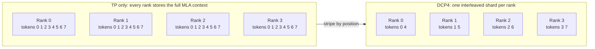
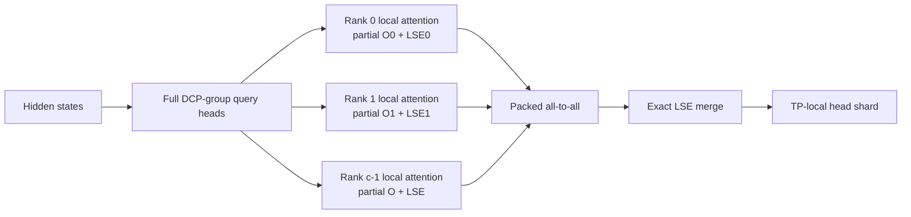

Decode context parallelism (DCP) stripes a request's MLA KV cache across ranks in an existing tensor-parallel group. With DCP size `c`, rank `r` owns position `p` when `p mod c = r`, so each rank stores and reads roughly `1/c` of the cache.

Local attention then sees only part of the context. The MLA path returns a partial output and log-sum-exp (LSE), exchanges both in one packed all-to-all, and merges them exactly. DCP complements TP and [attention data parallelism (DPA)](/docs/advanced_features/dp_dpa_smg_guide) rather than replacing them. The primary path is absorbed MLA decode and static target verification. `dcp_size=1` retains existing non-DCP behavior.

On Kimi K3, DCP applies only to MLA layers. Request-indexed KDA state is unchanged, so DCP grows long-context KV capacity but does not raise the KDA concurrency ceiling.

## Enable DCP

| Setting | Behavior |
| --- | --- |
| `--dcp-size N` | Enables DCP and widens virtual capacity and page size by `N`. Alias: `--decode-context-parallel-size`. |
| `--dcp-comm-backend` | Selects the MLA partial-output merge: `ag_rs`, `a2a`, or `fi_a2a`. Unset resolves to `fi_a2a` where the DCP group shares an MNNVL domain on Blackwell, otherwise `a2a` on CUDA/ROCm. |
| `--dcp-replicate-q-proj` | Removes the query all-gather for supported MLA weights. Use `--no-dcp-replicate-q-proj` to disable a model-specific default. |
| `--attn-dp-size N` | Composes only when DCP groups nest inside attention TP. |

A DCP group must fit inside one attention-TP group and one attention-DP replica:

```text Topology
attn_tp_size = tp_size / attn_dp_size
attn_tp_size % dcp_size == 0
```

For example, `TP=64, attention DP=4, DCP=16` creates four valid 16-rank attention replicas. `DCP=32` would cross replica boundaries and is invalid.

<Warning>
RoPE DSA models validate the stronger attention-TP condition at startup. Other model paths may check only `tp_size % dcp_size == 0`; enforce containment when choosing their topology.
</Warning>

MLA decode on DeepSeek-V3.1 with DCP 8 inside TP 8:

```bash Command
sglang serve \
  --model-path deepseek-ai/DeepSeek-V3.1 \
  --trust-remote-code \
  --tp-size 8 \
  --dcp-size 8 \
  --host 0.0.0.0 \
  --port 30000
```

Kimi K3 on 32 GPUs with DPA and DCP 8. The model override enables replicated Q by default; the communication backend resolves generically to `fi_a2a` on MNNVL systems, otherwise `a2a`:

```bash Command
sglang serve \
  --trust-remote-code \
  --model-path moonshotai/Kimi-K3 \
  --tp-size 32 \
  --ep-size 32 \
  --attn-dp-size 4 \
  --dcp-size 8 \
  --host 0.0.0.0 \
  --port 30000
```

See the [Kimi K3 cookbook](/cookbook/autoregressive/Moonshotai/Kimi-K3) for large-scale presets that combine DCP with DPA and expert parallelism.

### RoPE DSA on Blackwell

GLM-5.3, GLM-5.2, and DeepSeek-V3.2 use a replicated sparse-attention indexer with a striped target KV cache. Every rank selects the same global top-k, keeps the selected slots it owns, and returns a partial output and base-2 LSE. Decode and chunked prefill use the same query-gather and LSE-merge path. Fused top-k remains enabled.

| Configuration | CUDA RoPE DSA DCP |
| --- | --- |
| GPU and sparse backends | SM100/SM103; `trtllm` prefill and decode |
| KV dtype | `fp8_e4m3` (default) or `bfloat16` |
| Communication | `ag_rs`, `a2a`, `fi_a2a`; the usual Blackwell default is `fi_a2a` |
| Decode CUDA graphs, chunked prefill, radix cache, retraction | Supported |
| Expert parallelism | Composes with the default MoE path |
| Attention DP | Requires `attn_tp_size % dcp_size == 0` |
| EAGLE/MTP | Checkpoint-native draft, single chain; flags below |
| Replicated Q projection | Default with `a2a` / `fi_a2a` for BF16 Q projections; not available with LoRA |
| HiSparse, prefill CP, HiCache/L3, PD disaggregation, unified memory | Rejected at launch |
| Other CUDA sparse backends or GPU architectures | Rejected at launch |

This support applies to the RoPE DSA path; GLM-5.3-Flash uses a separate NoPE path. GLM-5.3 NVFP4 is the primary validation model. GLM-5.2 and DeepSeek-V3.2 share the implementation but require their own model accuracy validation.

On four B200/B300 GPUs with FlashInfer 0.7.0.post1:

```bash Command
sglang serve \
  --model-path nvidia/GLM-5.3-NVFP4 \
  --quantization modelopt_fp4 \
  --tp-size 4 \
  --dcp-size 2 \
  --reasoning-parser glm45
```

Use `--dcp-size 4` for a larger logical KV capacity. The indexer cache remains replicated, so total capacity grows by less than the DCP factor. Pool sizing includes the replicated index keys and extra workspace. DCP can increase per-token latency; compare the communication backends on your workload. With `ag_rs`, also measure `--enable-symm-mem`.

With `a2a` or `fi_a2a`, replicated Q projection is on by default and removes the per-layer query all-gather during decode. The gathered `q_b_proj` and `w_kc` copies take about 2.9 GiB per GPU at TP4/DCP2 and 5.8 GiB at TP4/DCP4 for GLM-5.3, which KV sizing reserves. Pass `--no-dcp-replicate-q-proj` to trade that latency back for KV capacity. Checkpoints with a quantized Q projection keep the all-gather.

#### Choose between TP, attention DP, and DCP

DCP raises KV capacity, not speed. Measured with GLM-5.3 NVFP4 on four B300 GPUs with `--no-dcp-replicate-q-proj` (FP8 KV, 1,024 output tokens per request, warm prefix cache, steady-state output tokens per second):

| Input tokens | Concurrency | TP4 | TP4 + attention DP4 | TP4 + DCP4 |
| ---: | ---: | ---: | ---: | ---: |
| 32,000 | 1 | 149 | 81 | 117 |
| 32,000 | 16 | 1,300 | 955 | 1,065 |
| 32,000 | 64 | 3,079 | 2,829 | 2,596 |
| 32,000 | 128 | over capacity | 4,710 | 3,808 |
| 32,000 | 256 | over capacity | 7,866 | 4,181 |
| 128,000 | 16 | 1,185 | 935 | 1,001 |
| 128,000 | 64 | over capacity | 2,605 | 2,273 |

- Use plain TP when the workload fits its KV cache. It is the fastest option at every point it can serve.
- Use attention DP when you need throughput beyond that capacity. It requires a router that keeps a session on one DP rank to reuse the prefix cache.
- Use DCP when you need the larger capacity at low concurrency, or one KV pool shared by all ranks. Its per-token latency sits between TP and attention DP at low concurrency and falls behind attention DP from about 64 concurrent requests.

Replicated Q projection lowers DCP per-token latency at concurrency 1 by about 9% at DCP2 and 5% at DCP4 relative to this table.

The replicated indexer cache bounds the capacity gain. For GLM-5.3 with FP8 KV, each token stores 44,928 bytes of sharded target KV and 2,772 bytes of replicated index keys, so equal memory gives 1.89x the TP capacity at DCP2, 3.41x at DCP4, and 5.69x at DCP8. The DCP workspace reservation lowers the measured values to 1.85x and 3.22x at DCP2 and DCP4, and the replicated Q weights to 1.80x and 3.07x.

The current DCP launch policy disables prefill CUDA graphs. Decode graph capture remains enabled. FP8 partial attention can differ slightly from unsharded attention because each shard quantizes its softmax numerator using a local maximum; validate model accuracy alongside latency.

For checkpoint-native MTP, add these flags to the launch above:

```bash
  --speculative-algorithm EAGLE \
  --speculative-num-steps 5 \
  --speculative-eagle-topk 1 \
  --speculative-num-draft-tokens 6
```

The draft cache is replicated over the full virtual address space; only target KV is sharded. The supported chain requires explicit positive steps, top-k 1, and draft tokens equal to steps plus one. Other speculative algorithms, branching trees, adaptive or multi-layer EAGLE, external draft checkpoints, non-DSA draft backends, and draft-only KV dtype overrides are rejected at launch. This configuration was validated with GLM-5.3 NVFP4 at TP4/DCP2.

## Why decode context parallelism?

Absorbed MLA shares one latent KV representation across all query heads. TP can split the heads and weights, but not that cache, so every attention-TP rank stores and reads the same context.


```mermaid
flowchart LR
    subgraph TP["TP only: every rank stores the full MLA context"]
        direction TB
        T0["Rank 0<br/>tokens 0 1 2 3 4 5 6 7"]
        T1["Rank 1<br/>tokens 0 1 2 3 4 5 6 7"]
        T2["Rank 2<br/>tokens 0 1 2 3 4 5 6 7"]
        T3["Rank 3<br/>tokens 0 1 2 3 4 5 6 7"]
    end

    TP -- "stripe by position" --> DCP

    subgraph DCP["DCP4: one interleaved shard per rank"]
        direction TB
        D0["Rank 0<br/>tokens 0 4"]
        D1["Rank 1<br/>tokens 1 5"]
        D2["Rank 2<br/>tokens 2 6"]
        D3["Rank 3<br/>tokens 3 7"]
    end
```

DCP stripes that cache round-robin by logical token position, keeps a shared virtual index on every rank, runs attention against the owner-local shard, and merges partial outputs by LSE into the usual TP-local head layout.

## Architecture

### Virtual KV layout

Let each rank have physical token capacity `C` and physical page size `P`. DCP exposes a shared virtual allocator:

```text Layout
virtual capacity  = C * c
virtual page size = P * c
owner(v)          = v mod c
physical(v)       = floor(v / c)
```

Every rank sees the same request-to-token map. On write, it keeps its positions and compacts them into the local physical pool. One widened virtual page maps to one physical page on each rank, so the layout stays balanced to within one token as a sequence grows.

### MLA decode dataflow


```mermaid
flowchart LR
    H["Hidden states"] --> Q["Full DCP-group query heads"]

    Q --> A0["Rank 0 local attention<br/>partial O0 + LSE0"]
    Q --> A1["Rank 1 local attention<br/>partial O1 + LSE1"]
    Q --> AN["Rank c-1 local attention<br/>partial O + LSE"]

    A0 --> A2A["Packed all-to-all"]
    A1 --> A2A
    AN --> A2A
    A2A --> MERGE["Exact LSE merge"]
    MERGE --> OUT["TP-local head shard"]
```

For context partition `r`, the kernel returns locally normalized output `o_r` and `lse_r`. The global result is `lse = logsumexp_r(lse_r)` and `o = sum_r(exp(lse_r - lse) * o_r)`. This is exact aside from floating-point reduction order. The merge uses the attention backend's LSE base, either base-e or base-2.

### Query-projection replication

Normally each layer all-gathers its absorbed and rotary query components. `--dcp-replicate-q-proj` gathers the query-projection and `w_kc` weights once at startup and computes the full DCP-group query locally. The trade is more weight memory and GEMM work for one fewer collective per layer. Only unquantized BF16/FP16 weights use this path; other layers fall back to the query all-gather.

### Communication backends

| Backend | DCP collectives per MLA layer | Notes |
| --- | --- | --- |
| `ag_rs` | Query AG + LSE AG + FP32 output RS | Fallback for platforms without the a2a path; opt in with `--dcp-comm-backend ag_rs` |
| `a2a`, gathered Q | Query AG + packed NCCL A2A | Two collectives |
| `a2a`, replicated Q | One packed NCCL A2A | Canonical low-latency path |
| `fi_a2a`, replicated Q | One FlashInfer MNNVL A2A | Requires Blackwell and a DCP group inside one MNNVL domain (GB200/GB300 fabric, or a single node) |

When `--dcp-comm-backend` is unset, every DCP launch resolves it the same way: `fi_a2a` where the DCP group shares one MNNVL domain on Blackwell, otherwise `a2a` on CUDA/ROCm, and `ag_rs` only on platforms without the a2a path. Query replication stays model-resolved: Kimi K3 enables it by default on the a2a family, and its decode backend is `cutedsl_mla`.

DCP adds a context-independent decode collective while cutting context-dependent KV storage and reads by about `c`. Extend is outside that decode cost model: it may gather cached prefix shards, restore token order, and append new tokens, and that work grows with prefix length.

## Compositions

### DCP × speculative decoding

The draft KV cache is replicated: every DCP rank stores the full draft context. DCP only stripes the target MLA KV, so it saves target cache, not draft cache.

Target verify and decode use the DCP-aware MLA kernel `cutedsl_mla`. It:

1. Builds a rank-local page table from the cyclic token map (`owner(p) = p mod c`).
2. Runs attention against that shard, passing `cp_world`, `cp_rank`, and the global KV lengths so causality still sees the full sequence.
3. Returns a rank-local `(output, LSE)` that the usual DCP all-to-all merge combines.

Draft steps use the same backend against the replicated draft cache, so they skip DCP metadata. Kimi K3 DCP selects `cutedsl_mla` automatically.

### DCP × PD disaggregation

A dense prefill page cannot be copied directly into striped decode storage. The PD sender uses the decode rank's DCP metadata to select and pack the right rows. See [PD disaggregation](/docs/advanced_features/pd_disaggregation) for the transfer engines.

- Equal DCP sizes require matching DCP ranks and use the existing page path.
- DCP1 prefill to DCP decode uses token relayout for MLA and hybrid-MLA pools.
- All other DCP-size transitions are rejected.

The plan includes the exact token count, so stale rows do not leak out of a partial final page. Mooncake and NIXL use the same plan. KDA state keeps its attention-TP mapping and bypasses DCP filtering.

This composition requires Mooncake or NIXL, matching physical page size and KV dtype, prefill attention CP `1`, and decode chunk cache. Decode radix cache and HiCache are not supported here.

### DCP × HiCache L2

HiCache keeps one widened logical page space across L1 and L2. The controller sees `P * c` slots, while each GPU and host buffer stores only its `P` local rows. See [HiCache](/docs/advanced_features/hicache) for the cache hierarchy.

Before H2D or D2H, both index lists keep positions owned by this rank and map `i` to `floor(i / c)`. Transfers cover whole widened pages, and every rank moves its shard independently, with no DCP collective. For Kimi K3 this applies to MLA KV; KDA/Mamba state uses its own request-indexed host pool.

The current scope is MLA L1/L2. L3, LMCache, HiSparse, non-MLA KV host pools, speculative decoding, and PD decode are not supported in this combination.

## References

- [DCP and Helix Parallelism roadmap](https://github.com/sgl-project/sglang/issues/29736)
- [SGLang and Miles Add Day-0 Support for Kimi K3](https://www.lmsys.org/blog/2026-07-27-kimi-k3-day0-support#decode-context-parallelism)
- [Original SGLang DCP design](https://docs.google.com/document/d/1pjBSID0palpuI7rx8Ck7Z0BcyzBXAgnkDrf9uQg0uqU/edit?tab=t.0)
