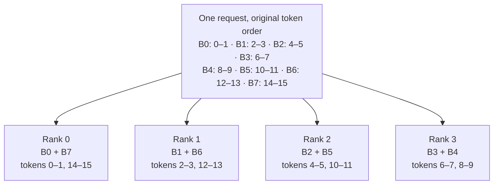
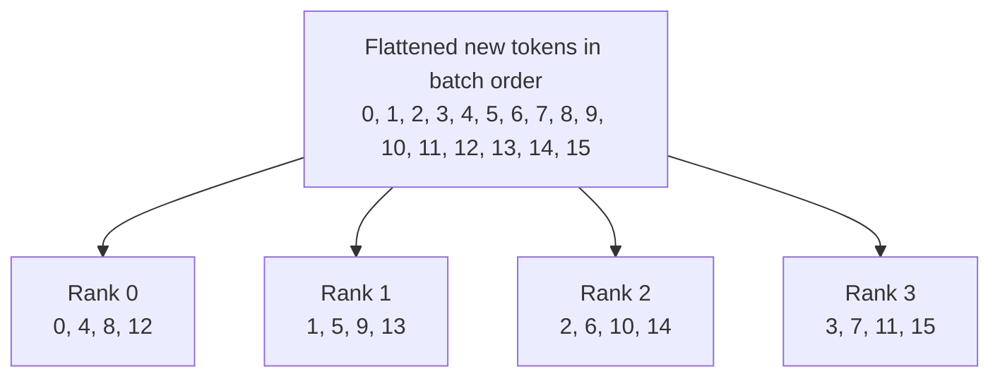
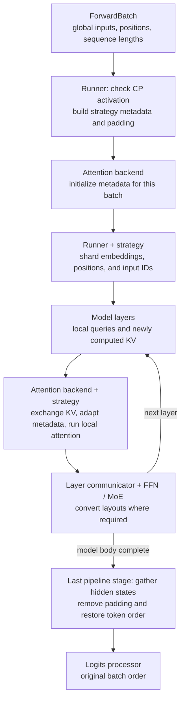

Prefill context parallelism (CP) distributes the tokens of a prompt across an attention CP group. Each rank computes attention for its local queries, while CP communication makes the required keys and values available. This lets multiple GPUs share the work of processing a long prompt.

Unlike tensor parallelism (TP), which partitions attention heads and weights, prefill CP partitions the token dimension. Unlike [decode context parallelism (DCP)](/docs/advanced_features/dcp), it targets prefill computation rather than dividing the decode KV-cache scan and merging partial attention results. The two features have separate configuration and support constraints.

## Enable prefill CP

Use NVIDIA CUDA GPUs and select a strategy supported by your model and attention backend. The in-tree implementation does not enable prefill CP on AMD ROCm, Ascend NPU, or MUSA. The examples below target a single Linux host with Hopper GPUs and an [SGLang installation](/docs/get-started/install) that includes the selected backend.

| Argument | Default | Description |
| --- | --- | --- |
| `--enable-prefill-cp` | `False` | Enable context-parallel prefill. |
| `--cp-strategy` | Unset | Required when enabling prefill CP. Choose `zigzag` or `interleave`. |
| `--attn-cp-size` | `1` | Number of ranks in an attention CP group. Use a value greater than 1 to distribute work; model-specific argument resolution may adjust it. |

CP subdivides the existing TP world; it does not add another GPU multiplier. With attention DP enabled, the attention topology is:

```text
TP world size = attention DP size × attention CP size × attention TP size

Example: --tp 4 --dp 1 --attn-cp-size 2
         → one attention DP group, CP=2, attention TP=2
```

The server requires `--tp` to be divisible by `--dp × --attn-cp-size`. The attention layout does not by itself specify the dense FFN or MoE layout; those use their own parallelism settings.

<Warning>
Strategy availability is model- and backend-specific. For DeepSeek V3.2 and GLM-5/5.1/5.2/5.3, use `interleave` with `--dp 1`; zigzag is currently unavailable. DSA argument resolution sets attention CP size to TP size for this configuration, leaving attention TP size at 1, and requires TP size at most 8 within one machine. Do not use a smaller `--attn-cp-size` to request hybrid attention TP/CP for these models.
</Warning>

### Zigzag example: GQA with attention TP and CP

This Qwen3 configuration uses four Hopper GPUs, with attention TP=2, CP=2, and EP=4 for the MoE layers. The model is a Hugging Face repository ID passed to `--model-path`.

```bash
python -m sglang.launch_server \
  --model-path Qwen/Qwen3-30B-A3B-FP8 \
  --tp 4 \
  --ep 4 \
  --attn-cp-size 2 \
  --enable-prefill-cp \
  --cp-strategy zigzag \
  --attention-backend fa3 \
  --cuda-graph-backend-prefill disabled \
  --max-running-requests 32
```

### Interleave example: DSA

This GLM-5.2 configuration uses eight H200 GPUs with attention CP=8 and attention TP=1. The DSA backend is selected automatically for this model; the command makes that choice explicit.

```bash
python -m sglang.launch_server \
  --model-path zai-org/GLM-5.2-FP8 \
  --tp 8 \
  --dp 1 \
  --attn-cp-size 8 \
  --enable-prefill-cp \
  --cp-strategy interleave \
  --attention-backend dsa \
  --trust-remote-code \
  --mem-fraction-static 0.85 \
  --max-running-requests 32
```

For model-specific deployment combinations, see the [DeepSeek V3.2 cookbook](/cookbook/autoregressive/DeepSeek/DeepSeek-V3_2).

## Why prefill context parallelism?

Long prompts create substantial prefill work. With causal dense attention, later queries attend to more tokens than earlier queries, so assigning each rank one consecutive chunk can leave the ranks with very different amounts of attention work.

CP distributes queries across GPUs. Both strategies spread early and late positions across ranks, but use different token layouts to fit their attention kernels. Zigzag pairs contiguous blocks from opposite ends of each request; interleave distributes individual tokens cyclically.

CP introduces communication, including exchanging newly computed KV and restoring output order. It is most useful when the prefill work saved outweighs that cost. Benchmark time to first token and prefill throughput with your prompt lengths, concurrency, backend, and GPU interconnect; increasing CP size is not automatically faster.

<Note>
Splitting prefill queries does not imply that each GPU stores only `1 / CP` of the persistent KV cache. The standard CP paths gather newly computed KV into the token order needed by attention and cache storage. DSA cache LayerSplit is a separate memory optimization described below.
</Note>

## Architecture

### Strategy interface

`ContextParallelStrategy` separates token-layout policy from model execution and attention kernels. Server argument resolution initializes one strategy per process. Per-forward state lives in `ForwardBatch.attn_cp_metadata`, rather than in the model's token-layout logic.

| Responsibility | Strategy interface |
| --- | --- |
| Decide whether a batch can use CP | `can_apply` |
| Describe the token layout, lengths, and padding | `build_metadata` |
| Select rank-local model inputs | `shard_hidden_states`, `shard_position_ids` |
| Restore full token order | `gather_hidden_states`, `gather_kv_cache` |
| Prepare KV for the attention implementation | `materialize_full_kv`, `materialize_full_mla_kv`, and backend-specific hooks |
| Adapt attention execution or metadata | `run_attention`, `reindex_attn_metadata`, and per-request sharding hooks |

These interfaces are extension points, not a guarantee that every strategy implements every attention path. The runner owns input/output sharding, the strategy owns the layout, and the attention backend owns its cache representation and kernels. Layer communicators handle transitions between the attention and FFN/MoE parallel layouts.

CP activation is checked for each batch. The normal activation check accepts extend and mixed forward modes, not decode or target verification. Zigzag requires each request's newly extended token count to be at least `2 × CP`; interleave requires at least `CP` newly extended tokens across the batch. Batches that do not meet the strategy's conditions use the non-CP execution path.

### Zigzag strategy

For a CP group of size `C`, split each request's newly extended tokens into `2C` contiguous blocks. Rank `r` receives block `r` and block `2C - 1 - r`. The split restarts for every request in a batch.

For example, with CP=4 and 16 new tokens, each block has two tokens:



Pairing an early, cheaper block with a late, more expensive block balances causal attention work while retaining contiguous query blocks. Lengths need not divide evenly: early blocks receive the remainder, and communication buffers are padded as needed.

The metadata records separate query and KV lengths for the early and late blocks, including any cached prefix. Each block therefore attends to the correct causal history, not just the other tokens assigned to its rank. The FlashAttention path runs the two block groups separately; `trtllm_mha` combines them into one variable-length attention call using a synthetic batch with two entries per original request.

### Interleave strategy

For CP size `C`, rank `r` receives flattened token indices `r, r+C, r+2C, ...`. The index runs across the batch's newly extended tokens; it does not reset at request boundaries. Position IDs keep their original values.

With CP=4 and 16 new tokens:



This gives each rank queries spread across the context. For a batch containing requests of lengths 5 and 3, rank 0 owns flattened indices 0 and 4, while rank 1 owns indices 1 and 5; index 5 is the first new token of the second request. Per-request sharding metadata preserves those boundaries and each query's causal extent.

Interleave supports the DSA integration through rank-local query/indexer metadata and KV exchange. Its `run_attention` hook does not wrap the attention kernel: the DSA backend executes attention itself after preparing the local metadata. This differs from zigzag's early/late attention dispatch. Interleave's generic dense `materialize_full_kv` path is not implemented, so it is not a drop-in alternative to zigzag for arbitrary dense-attention models.

### Model runner and attention dataflow

The eager extend runner coordinates CP around the model body:



1. `prepare_cp_forward` constructs the strategy metadata before attention metadata initialization. It distinguishes logical tokens from physical padded buffers.
2. `cp_shard_model_inputs` selects local embeddings, positions, and input IDs. The runner invokes the model body with those inputs; auxiliary token-order state is maintained for consumers such as MoE routing.
3. At attention layers, the backend uses the strategy to exchange and reorder newly computed KV and to describe the rank's local queries. Cached prefix tokens remain part of the attention history. The FFN/MoE layout need not match the attention layout, so layer communicators perform any required gathers, scatters, or reductions.
4. On the last pipeline stage, `cp_gather_after_forward` restores hidden states, including supported auxiliary outputs, to original token order before logits processing. Intermediate pipeline stages forward their hidden states without this final gather.

The model does not need to implement the zigzag or interleave token permutation itself. Backend integration is still required: kernels must consume the correct local query lengths, positions, page tables, and global KV order.

### Attention backend integration

| Path | Integration |
| --- | --- |
| Zigzag with FlashAttention | Gather and reorder new KV; execute attention for the early and late query blocks with their respective sequence lengths. |
| Zigzag with `trtllm_mha` | Materialize KV, build zigzag page tables, and execute a combined variable-length attention call. |
| Interleave with DSA | Shard query/indexer metadata by request, gather indexer keys and MLA KV as required, and execute sparse attention in the backend. |
| DeepSeek V4 interleave | Uses model-specific sparse-attention integration; the CP regression suite includes DeepSeek-V4-Flash on B200. Do not infer its backend requirements from the dense zigzag path. |

See [attention backends](/docs/advanced_features/attention_backend) for hardware requirements. A backend being available on your GPU does not establish that it supports your model's CP strategy.

## Compositions

### Prefill CP × TP, DP, and EP

Attention TP splits heads within each CP partition; attention DP separates request batches. Dense FFNs and MoE layers can use a different layout, bridged by layer communicators. The Qwen3 example above combines CP=2 with attention TP=2 and EP=4. For interleave DSA on DeepSeek V3.2 and the GLM-5 family listed above, keep DP=1 and use the resolved attention CP=TP topology.

### Prefill CP × pipeline parallelism

The eager runner preserves CP-local hidden states between pipeline stages and gathers on the final stage. This supports model-specific PP+CP deployments, such as the [DeepSeek V3.2 recipes](/cookbook/autoregressive/DeepSeek/DeepSeek-V3_2). PP can place stages on different nodes while keeping each DSA attention CP group within one node; it does not remove the single-machine DSA CP restriction.

### Prefill CP × speculative decoding

Prefill CP can coexist with supported speculative-decoding configurations. The CP runner handles aligned speculative hidden-state inputs and gathers supported auxiliary outputs. This does not make decode or target verification context-parallel through the prefill strategy. The registered CP tests include GLM-5.2 with EAGLE and DeepSeek-V4-Flash speculative configurations; use model-specific recipes for draft-worker and graph settings.

### Prefill CP × CUDA graphs

The shared CP breakable-prefill-graph path currently requires `zigzag`, the `trtllm_mha` prefill backend, PP=1, and attention CP size equal to TP size. It uses CP-local static input buffers and selects capture buckets large enough for each rank's padded input. A working eager CP configuration does not imply prefill graph support. The `fa3` example above explicitly disables prefill graphs.

### Prefill CP × PD disaggregation and DSA cache LayerSplit

In supported DSA deployments, `--enable-dsa-cache-layer-split` distributes GPU KV/indexer cache layers across CP ranks to reduce per-rank cache memory. Each rank owns a range of layers and uses scratch storage for remote-layer data. This is layer-wise cache ownership, separate from the interleave token assignment used for computation, and is not applied to draft workers.

LayerSplit requires a PD prefill worker (`--disaggregation-mode prefill`), `--enable-prefill-cp --cp-strategy interleave`, and PP=1. It currently supports the `mooncake` and `mooncake_tcp` transfer backends. Do not enable LayerSplit on decode or non-PD workers; the decode side receives full cache shards through PD transfer. Use the [PD disaggregation guide](/docs/advanced_features/pd_disaggregation) and model-specific launch recipes to configure both sides of the transfer; enabling prefill CP alone does not configure a PD deployment.

## References

- [CP strategies and metadata](https://github.com/sgl-project/sglang/tree/main/python/sglang/srt/layers/cp): strategy interface, zigzag/interleave layouts, padding, and graph helpers.
- [Eager model runner](https://github.com/sgl-project/sglang/blob/main/python/sglang/srt/model_executor/runner/eager_runner.py): CP activation, model input sharding, and output gathering.
- [Layer communicators](https://github.com/sgl-project/sglang/blob/main/python/sglang/srt/layers/communicator.py): transitions between attention and FFN/MoE layouts.
- [Attention backends](https://github.com/sgl-project/sglang/tree/main/python/sglang/srt/layers/attention): backend-specific KV materialization and query metadata.
- [CP regression tests](https://github.com/sgl-project/sglang/tree/main/test/registered/cp): tested model and parallelism configurations, plus strategy unit tests.
