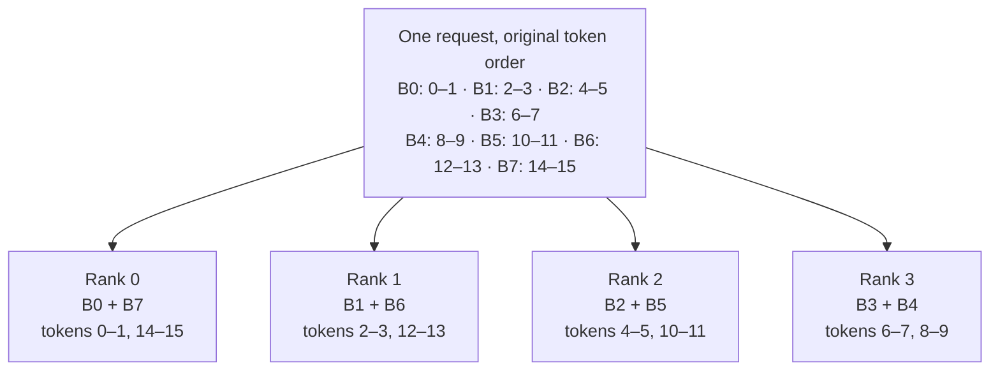
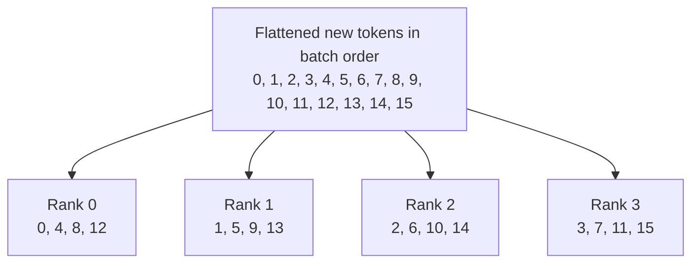

Prefill context parallelism (CP) distributes the tokens of a prompt across an attention CP group. Each rank computes attention and, for models with an indexer, indexer operations for its local queries, while all-gather on the KV cache makes the required keys and values available. This lets multiple GPUs share the work of processing a long prompt.

Unlike tensor parallelism (TP), which partitions attention heads and weights, prefill CP partitions the token dimension. Unlike [decode context parallelism (DCP)](https://docs.sglang.io/docs/advanced_features/dcp), it targets prefill computation rather than dividing the decode KV-cache scan and merging partial attention results. The two features have separate configuration and support constraints.

## Why prefill context parallelism?

Prefill CP offers three benefits:

- It partitions work that would otherwise be repeated across ranks, such as indexer computation in DSA models and the DeepSeek V4 series.
- It combines naturally with KV-cache sharding to reduce per-rank cache memory. Layer-wise sharding is available through DSA cache LayerSplit; additional sharding techniques are under development.
- Combined with expert parallelism (EP), it can reduce communication time by using all-to-all token dispatch and combine instead of TP all-reduce. The benefit depends on the workload and interconnect.

## Architecture

### Strategy interface

`ContextParallelStrategy` separates token-layout policy from model execution and attention kernels. Server argument resolution initializes one strategy per process. Per-forward state lives in `ForwardBatch.attn_cp_metadata`, rather than in the model's token-layout logic.

### Zigzag strategy

For a CP group of size `C`, split each request's newly extended tokens into `2C` contiguous blocks. Rank `r` receives block `r` and block `2C - 1 - r`. The split restarts for every request in a batch.

For example, with CP=4 and 16 new tokens, each block has two tokens:


```mermaid
flowchart TB
    S["One request, original token order<br/>B0: 0–1 · B1: 2–3 · B2: 4–5 · B3: 6–7<br/>B4: 8–9 · B5: 10–11 · B6: 12–13 · B7: 14–15"]
    S --> R0["Rank 0<br/>B0 + B7<br/>tokens 0–1, 14–15"]
    S --> R1["Rank 1<br/>B1 + B6<br/>tokens 2–3, 12–13"]
    S --> R2["Rank 2<br/>B2 + B5<br/>tokens 4–5, 10–11"]
    S --> R3["Rank 3<br/>B3 + B4<br/>tokens 6–7, 8–9"]
```

Pairing an early, cheaper block with a late, more expensive block balances causal attention work while retaining contiguous query blocks. Lengths need not divide evenly: early blocks receive the remainder, and communication buffers are padded as needed.

The metadata records separate query and KV lengths for the early and late blocks, including any cached prefix. Each block therefore attends to the correct causal history, not just the other tokens assigned to its rank.

### Interleave strategy

For CP size `C`, rank `r` receives flattened token indices `r, r+C, r+2C, ...`. The index runs across the batch's newly extended tokens; it does not reset at request boundaries. Position IDs keep their original values.

With CP=4 and 16 new tokens:


```mermaid
flowchart TB
    S["Flattened new tokens in batch order<br/>0, 1, 2, 3, 4, 5, 6, 7, 8, 9, 10, 11, 12, 13, 14, 15"]
    S --> R0["Rank 0<br/>0, 4, 8, 12"]
    S --> R1["Rank 1<br/>1, 5, 9, 13"]
    S --> R2["Rank 2<br/>2, 6, 10, 14"]
    S --> R3["Rank 3<br/>3, 7, 11, 15"]
```

This gives each rank queries spread across the context. For a batch containing requests of lengths 5 and 3, rank 0 owns flattened indices 0 and 4, while rank 1 owns indices 1 and 5; index 5 is the first new token of the second request. Per-request sharding metadata preserves those boundaries and each query's causal extent.

### Attention backend integration

| Path | Integration |
| --- | --- |
| Zigzag with FlashAttention | Gather and reorder new KV; execute attention for the early and late query blocks with their respective sequence lengths. |
| Zigzag with `trtllm_mha` | Materialize KV, build zigzag page tables, and execute a combined variable-length attention call. |
| Interleave with DSA | Shard query/indexer metadata by request, gather indexer keys and MLA KV as required, and execute sparse attention in the backend. |
| DeepSeek V4 interleave | Uses model-specific sparse-attention integration; the CP regression suite includes DeepSeek-V4-Flash on B200. Do not infer its backend requirements from the dense zigzag path. |

The CP and attention-backend compatibility matrix is being expanded, with support for more combinations planned.

## Compositions

### Prefill CP × TP, DP, and EP

Attention TP splits heads within each CP partition; attention DP separates request batches. Dense FFNs and MoE layers can use a different layout, bridged by layer communicators. The Qwen3 example in [Usage and Examples](#usage-and-examples) combines CP=2 with attention TP=2 and EP=4. For interleave DSA on DeepSeek V3.2 and the GLM-5 series, keep DP=1 and use the resolved attention CP=TP topology.

### Prefill CP × pipeline parallelism

The eager runner preserves CP-local hidden states between pipeline stages and gathers on the final stage. PP can place stages on different nodes while keeping each DSA attention CP group within one node; it does not remove the single-machine DSA CP restriction.

### Prefill CP × speculative decoding

Prefill CP can coexist with supported speculative-decoding configurations. The CP runner handles aligned speculative hidden-state inputs and gathers supported auxiliary outputs. This does not make decode or target verification context-parallel through the prefill strategy.

### Prefill CP × CUDA graphs (Experimental)

The shared CP breakable-prefill-graph path currently requires `zigzag`, the `trtllm_mha` prefill backend, PP=1, and attention CP size equal to TP size. It uses CP-local static input buffers and selects capture buckets large enough for each rank's padded input. Support for combining other attention backends with prefill CP and Breakable CUDA Graph is under development.

### Prefill CP × PD disaggregation and DSA cache LayerSplit

In supported DSA deployments, `--enable-dsa-cache-layer-split` distributes GPU KV/indexer cache layers across CP ranks to reduce per-rank cache memory. Each rank owns a range of layers and uses scratch storage for remote-layer data. This is layer-wise cache ownership, separate from the interleave token assignment used for computation, and is not applied to draft workers.

LayerSplit requires a PD prefill worker (`--disaggregation-mode prefill`), `--enable-prefill-cp --cp-strategy interleave`, and PP=1. It currently supports the `mooncake` and `mooncake_tcp` transfer backends. Do not enable LayerSplit on decode or non-PD workers; the decode side receives full cache shards through PD transfer. Use the [PD disaggregation guide](https://docs.sglang.io/docs/advanced_features/pd_disaggregation) and model-specific launch recipes to configure both sides of the transfer; enabling prefill CP alone does not configure a PD deployment.

## Usage and Examples

Use NVIDIA CUDA GPUs and select a strategy supported by your model and attention backend. The examples below target a single Linux host with Hopper GPUs and an SGLang version that includes the selected backend.

| Argument | Default | Description |
| --- | --- | --- |
| `--enable-prefill-cp` | `False` | Enable context-parallel prefill. |
| `--cp-strategy` | Unset | Required when enabling prefill CP. Choose `zigzag` or `interleave`. |
| `--attn-cp-size` | `1` | Number of ranks in an attention CP group. Use a value greater than 1 to distribute work; model-specific argument resolution may adjust it. |

CP subdivides the existing TP world; it does not add another GPU multiplier. With attention DP enabled, the attention topology is:

```text
TP world size = attention DP size × attention CP size × attention TP size

Example: --tp 4 --dp 1 --attn-cp-size 2
         → one attention DP group, CP=2, attention TP=2
```

The server requires `--tp` to be divisible by `--dp × --attn-cp-size`. The attention layout does not by itself specify the dense FFN or MoE layout; those use their own parallelism settings.

<Warning>
For DSA models, such as the GLM-5 series and DeepSeek V3.2, use `interleave`; `zigzag` is currently unavailable. Do not use a smaller `--attn-cp-size` to request hybrid attention TP/CP for DSA models. Broader compatibility is planned for future support.
</Warning>

### Zigzag example: GQA with attention TP and CP

This Qwen3 configuration uses four Hopper GPUs, with attention TP=2, CP=2, and EP=4 for the MoE layers. The model is a Hugging Face repository ID passed to `--model-path`.

```bash
python -m sglang.launch_server \
  --model-path Qwen/Qwen3-30B-A3B-FP8 \
  --tp 4 \
  --ep 4 \
  --attn-cp-size 2 \
  --enable-prefill-cp \
  --cp-strategy zigzag \
  --attention-backend fa3
```

### Interleave example: DSA

This GLM-5.2 configuration uses eight H200 GPUs with attention CP=8 and attention TP=1. The DSA backend is selected automatically for this model; the command makes that choice explicit.

```bash
python -m sglang.launch_server \
  --model-path zai-org/GLM-5.2-FP8 \
  --tp 8 \
  --attn-cp-size 8 \
  --enable-prefill-cp \
  --cp-strategy interleave \
  --attention-backend dsa \
  --trust-remote-code \
  --mem-fraction-static 0.85
```

For model-specific deployment combinations, see [context parallelism in the GLM-5.3 cookbook](https://docs.sglang.io/cookbook/autoregressive/GLM/GLM-5.3#3-5-context-parallelism).

## References

- [CP strategies and metadata](https://github.com/sgl-project/sglang/tree/main/python/sglang/srt/layers/cp): strategy interface, zigzag/interleave layouts, padding, and graph helpers.
- [Prefill Context Parallelism Roadmap](https://github.com/sgl-project/sglang/issues/21788).
- [Prefill Context Parallelism Refactor Design](https://github.com/sgl-project/sglang/issues/27252).
