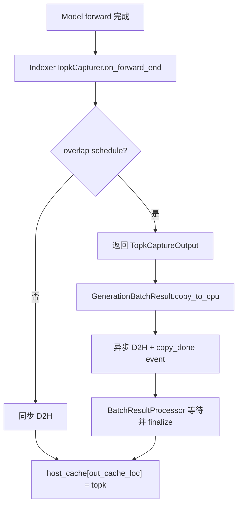
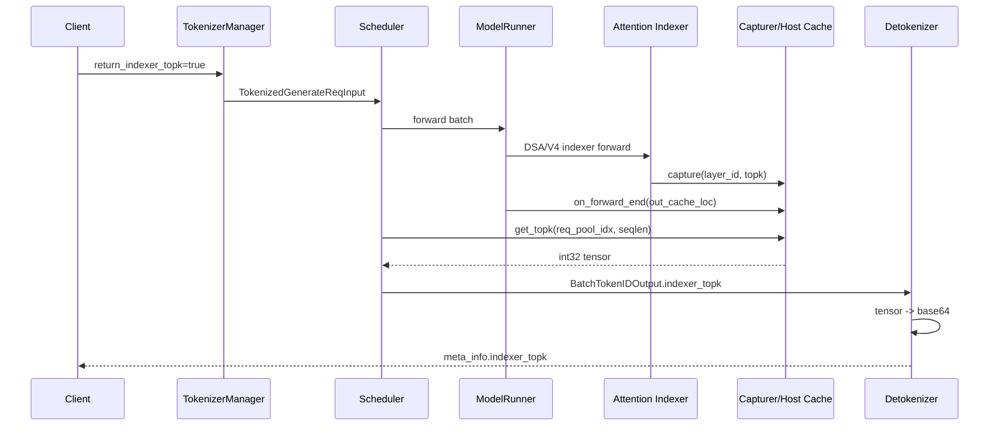

# `enable_return_indexer_topk` 特性分析与 NPU 支持设计

## 1. 文档目的

本文分析 SGLang 中 `enable_return_indexer_topk` 的现有实现，评估 Ascend NPU 支持度，并给出 NPU 开发设计。本文以当前 `main` 分支代码为准，重点覆盖 DeepSeek DSA 系列（包括 GLM-5.2）和 DeepSeek-V4 C4 indexer 的差异。

## 2. 结论摘要

- 当前特性是“全局创建 capturer + 请求级决定是否返回”。
- CUDA 上采集链路已经闭合；NPU 的返回协议和结果处理链路基本可复用。
- NPU 已经具备 DSA indexer producer：`DSANPUIndexerMixin.forward_npu()` 调用 `torch_npu.npu_lightning_indexer`。
- 当前代码已放开 NPU DSA capturer 创建，并在 NPU DSA prepare 阶段接入统一 capturer；NPU V4 C4 producer 仍未接入。
- GLM-5.2 使用 DeepSeek DSA Indexer，不使用 DeepSeek-V4 C4 Indexer。
- 不需要在 `dsa_indexer.py` 中新增 `Indexer.forward_npu()`；该方法已经由 `DSANPUIndexerMixin` 通过继承提供。
- 推荐先交付 DeepSeek DSA NPU MVP，再单独处理 DeepSeek-V4 C4 的索引坐标和 layer mapping。

## 3. 现有实现分析

### 3.1 两级开关

服务端开关定义在 `server_args.py`：

```text
--enable-return-indexer-topk
```

位置：`python/sglang/srt/server_args.py:3643`。

请求字段定义在以下结构中：

- `GenerateReqInput.return_indexer_topk`
- `TokenizedGenerateReqInput.return_indexer_topk`
- `Req.return_indexer_topk`

位置：`python/sglang/srt/managers/io_struct.py:257`、`python/sglang/srt/managers/io_struct.py:1007`、`python/sglang/srt/managers/schedule_batch.py:1209`。

当前 `main` 分支中，服务端开关只负责创建 capturer；请求仍需显式携带 `return_indexer_topk=true` 才会把结果加入响应。一个未合入当前 `HEAD` 的历史提交曾尝试将服务端开关隐式 OR 到请求字段，以解决 typed proxy 丢字段问题；如果 NPU 主要服务 RL rollout，可在后续单独评估是否采用该策略。

### 3.2 Capturer 初始化

`ModelRunner` 在内存池初始化后调用 `init_indexer_capturer()`：

```text
ModelRunner._init_post_memory_pool_components()
  -> init_indexer_capturer()
  -> create_indexer_capturer()
  -> set_global_indexer_capturer()
```

位置：

- `python/sglang/srt/model_executor/model_runner.py:930-931`
- `python/sglang/srt/model_executor/model_runner.py:1109-1117`

`create_indexer_capturer()` 根据模型配置读取：

- `num_indexer_layers`
- `index_topk`

并创建 `IndexerTopkCapturer`。当前实现有明确限制：启用 feature 且 `device != "cuda"` 时直接返回 `None`，因此 NPU 不会创建 capturer。

位置：`python/sglang/srt/state_capturer/indexer_topk.py:91-120`。

### 3.3 Capturer 内存布局

`IndexerTopkCapturer` 继承 `BaseTopkCapturer`，维护两级 buffer：

```text
device_cache: [local_batch, num_indexer_layers, index_topk]
host_cache:   [num_tokens, num_indexer_layers, index_topk]
dtype:        int32
```

GPU/NPU 前向期间，`capture(layer_id, topk_indices)` 将当前 layer 的结果写入 device cache。前向结束时，capturer 根据 `out_cache_loc` 将本批结果搬到 host cache。

位置：`python/sglang/srt/state_capturer/base.py:29-50`、`python/sglang/srt/state_capturer/base.py:63-75`、`python/sglang/srt/state_capturer/base.py:150-171`。

请求完成时，`get_topk()` 使用 `req_to_token_pool` 将逻辑序列位置映射到 host cache，返回：

```text
[start_len, seqlen - 1)
shape = (seqlen - 1 - start_len, num_indexer_layers, index_topk)
```

indexer-topk 当前默认 `start_len=0`，因此通常为 `(seqlen - 1, layers, topk)`。

位置：`python/sglang/srt/state_capturer/base.py:173-188`、`python/sglang/srt/managers/scheduler_components/batch_result_processor.py:176-185`。

### 3.4 Attention producer

DSA 的各个计算出口通过 `maybe_capture_indexer_topk()` 采集结果：

```text
Indexer result
  -> broadcast (如适用)
  -> maybe_capture_indexer_topk(layer_id, topk)
  -> device_cache
```

CUDA DSA 路径位于 `python/sglang/srt/layers/attention/dsa/dsa_indexer.py`，MLA 的 `skip_topk` 路径位于 `python/sglang/srt/models/deepseek_common/attention_forward_methods/forward_mla.py`。

### 3.5 Forward 结束与 overlap

`ModelRunner.forward()` 结束时将 capturer 的当前 batch 交给 `on_forward_end()`：

位置：`python/sglang/srt/model_executor/model_runner.py:1681-1687`。

两种模式如下：



位置：

- `python/sglang/srt/state_capturer/base.py:190-213`
- `python/sglang/srt/managers/utils.py:175-187`
- `python/sglang/srt/managers/scheduler_components/batch_result_processor.py:271-273`

### 3.6 返回链路



返回字段定义在 `python/sglang/srt/managers/io_struct.py:1450-1480` 和 `python/sglang/srt/managers/io_struct.py:1570-1580`。Detokenizer 编码逻辑位于 `python/sglang/srt/managers/detokenizer_manager.py:457-499`，最终由 `TokenizerManager` 写入 `meta_info["indexer_topk"]`，位置为 `python/sglang/srt/managers/tokenizer_manager.py:2353-2358`。

## 4. NPU 支持度

| 子系统 | 当前状态 | 结论 |
| --- | --- | --- |
| CLI/server flag | 已存在 | 可复用 |
| 请求与 IPC 字段 | 已存在 | 可复用 |
| GPU/NPU device cache | `torch.zeros(..., device=device)` | 基本可复用 |
| Host cache allocator | NPU 使用 `torch.empty(..., pin_memory=True)` | 需实机验证 |
| Capturer 创建 | CUDA-only 限制已改为 CUDA 或 NPU DSA | 已完成（本变更） |
| DeepSeek DSA NPU producer | 已有 `forward_npu()` | 计算能力已有 |
| DSA NPU capture hook | `forward_dsa_prepare_npu()` 统一采集 | 已完成（本变更） |
| DSA NPU skip-topk capture | 复用结果后写入当前 layer slot | 已完成（本变更） |
| DeepSeek-V4 C4 NPU producer | 已有 C4 top-k 计算 | 需定义输出坐标后接入 |
| Scheduler/Detokenizer 返回链路 | 平台无关 | 可复用 |
| NPU overlap D2H | 通用代码可尝试复用 | 必须验证 |
| NPU 端到端测试 | 当前没有 | 必须新增 |

### 4.1 NPU DSA producer 已存在

NPU DSA indexer 实现在：

`python/sglang/srt/layers/attention/dsa/dsa_npu_indexer.py:24-35`

核心算子为：

```python
torch_npu.npu_lightning_indexer(
    query=q,
    key=past_key_states,
    weights=weights,
    actual_seq_lengths_query=actual_seq_lengths_q.to(torch.int32),
    actual_seq_lengths_key=actual_seq_lengths_kv.to(torch.int32),
    block_table=block_table,
    sparse_count=self.index_topk,
    sparse_mode=3,
)
```

该实现覆盖 DSA prefill/decode/verify 以及部分 context-parallel 路径。因此 NPU 支持的主要工作是结果采集，而不是重新实现 top-k 算法。

### 4.2 不需要新增 `Indexer.forward_npu()`

`Indexer` 的定义为：

```python
class Indexer(DSANPUIndexerMixin, BaseFusedOp):
    ...
```

位置：`python/sglang/srt/layers/attention/dsa/dsa_indexer.py:205`。

`DSANPUIndexerMixin` 已提供 `forward_npu()`。`BaseFusedOp` 在 NPU 平台会查找 `forward_npu`，且方法查找包含继承链：

```text
Indexer.forward()
  -> BaseFusedOp._resolve_forward_method()
  -> _PLATFORM_METHODS["npu"] = ("forward_npu",)
  -> DSANPUIndexerMixin.forward_npu()
```

分发定义：`python/sglang/kernels/fused_op.py:150-157`、`python/sglang/kernels/fused_op.py:523-567`。

因此不应在 `dsa_indexer.py` 中复制一份 NPU 实现。推荐职责保持为：

```text
dsa_npu_indexer.py
  NPU top-k 计算

deepseek_v2_attention_mla_npu.py
  正常/skip top-k 结果统一接入 capturer

state_capturer/indexer_topk.py
  缓存、D2H、按请求提取和返回
```

## 5. GLM-5.2 的 indexer 路径

GLM-5.2 对应的模型类为 `GlmMoeDsaForCausalLM`，继承 `DeepseekV2ForCausalLM`：

`python/sglang/srt/models/glm4_moe.py:1444-1448`

它启用 DeepSeek DSA attention，并通过通用 `Indexer` 构造 indexer：

`python/sglang/srt/models/deepseek_v2.py:1850-1881`

Ascend backend 根据 `attn.use_dsa` 选择 `AttnForwardMethod.DSA_NPU`：

`python/sglang/srt/models/deepseek_common/attention_backend_handler.py:74-88`

因此 GLM-5.2 NPU 路径是：

```text
GlmMoeDsaForCausalLM
  -> DeepseekV2ForCausalLM
  -> dsa_indexer.Indexer
  -> DSANPUIndexerMixin.forward_npu()
  -> torch_npu.npu_lightning_indexer
```

它不是 DeepSeek-V4 的：

```text
C4Indexer
  -> npu_quant_lightning_indexer
```

## 6. NPU 支持设计

### 6.1 设计目标

第一阶段目标：在 Ascend NPU 上为 DeepSeek DSA 模型（优先 GLM-5.2）提供原生 `/generate` 返回：

```json
{
  "meta_info": {
    "indexer_topk": "<base64 encoded int32 bytes>"
  }
}
```

语义要求与 CUDA 保持一致：

```text
shape = (seqlen - 1, num_indexer_layers, index_topk)
dtype = int32
-1 = invalid/padding sentinel
```

### 6.2 Capturer 创建改造

修改：`python/sglang/srt/state_capturer/indexer_topk.py`。

将 CUDA-only 条件改为模型和后端能力判断；Phase 1 只放开 NPU DSA：

```python
is_npu_dsa = device == "npu" and is_deepseek_dsa(model_config.hf_text_config)

if enable and device != "cuda" and not is_npu_dsa:
    logger.warning(...)
    return None
```

NPU DeepSeek-V4 C4 暂不创建该 capturer，直到完成 C4 的 layer mapping、坐标归一化和 producer 接入。

建议同时检查：

- 模型是否为 DSA 或已声明 indexer layer 数量；
- `num_indexer_layers > 0`；
- `index_topk > 0`；
- NPU 当前是否支持所需 attention/DP 配置。

NPU 当前使用 `alloc_with_pin_memory()`，位置为 `python/sglang/srt/mem_cache/pool_host/common.py:238-257`。第一阶段必须验证 pinned host allocation 在目标 CANN/torch_npu 版本上的行为。

### 6.3 DSA NPU 统一 capture 出口

修改：

`python/sglang/srt/hardware_backend/npu/modules/deepseek_v2_attention_mla_npu.py`

当前逻辑：

```python
if not m.skip_topk or (m.is_nextn and prev_topk_indices is None):
    topk_indices = m.indexer(...)
else:
    topk_indices = prev_topk_indices
```

建议改为：

```python
if not m.skip_topk or (m.is_nextn and prev_topk_indices is None):
    topk_indices = m.indexer(...)
else:
    topk_indices = prev_topk_indices

topk_indices = maybe_capture_indexer_topk(
    m.layer_id,
    topk_indices,
)
```

这样正常计算层和 skip-topk 层都能填充对应 layer slot。不要在 `dsa_npu_indexer.py` 和 `forward_dsa_prepare_npu()` 两处重复 capture。

### 6.4 Layer ID 与 skip-topk

DSA capturer 的 layer 数来自 `get_num_indexer_layers()`。对于 DSA 模型，该函数返回完整 Transformer layer 数，而不是实际重新计算 top-k 的层数：

`python/sglang/srt/configs/model_config.py:291-306`

因此必须保持：

```text
capturer layer_id == Transformer layer_id
```

即使某层复用上一层 top-k，也必须写入该层的 slot。否则最终 `(token, layer, topk)` 结构会出现空层或错位。

### 6.5 Forward-end 与 NPU D2H

建议分两阶段实现：

#### 阶段一：同步正确性路径

NPU 先禁用 capturer 的 overlap D2H，直接在 `on_forward_end()` 中执行同步复制：

```text
NPU forward 完成
  -> device_cache slice
  -> .to("cpu")
  -> host_cache[out_cache_loc]
```

这样可以先隔离并验证：

- layer 写入是否正确；
- `out_cache_loc` 是否匹配；
- host cache 是否有旧数据；
- 请求完成时 gather 是否正确。

#### 阶段二：异步优化路径

验证通过后，再复用 `GenerationBatchResult.copy_to_cpu()` 的通用机制：

```text
NPU copy stream
  -> pinned CPU tensor
  -> NPU Event
  -> scheduler synchronize
  -> TopkCaptureOutput.finalize()
```

必须验证：

1. `torch.npu.Event.record()` 是否能准确表示 D2H 完成。
2. `pin_memory=True` 是否使 NPU D2H 真正异步。
3. 下一次 forward 是否可能覆盖 device cache。
4. `record_stream`、event 和缓存生命周期是否满足 CANN 语义。
5. 多 DP rank 下是否存在 rank-local buffer 串扰。

在这些条件未通过前，NPU 默认走同步路径更安全。

### 6.6 DeepSeek-V4 C4 NPU

DeepSeek-V4 NPU 已经在：

`python/sglang/srt/hardware_backend/npu/attention/ascend_dsv4_backend.py:750-775`

生成并保存：

```python
topk_idxs = self._forward_indexer(...)
self.forward_metadata.c4_topk_indices = topk_idxs
```

但 V4 不能直接套用 DSA 方案，因为存在：

- `compress_ratio=4` 的 layer mapping；
- compressed token index 与 physical page index 的区别；
- C4 page table 转换；
- attention kernel 使用的索引可能不是对外逻辑索引。

CUDA V4 路径区分 `raw_indices` 与 page/physical indices。NPU 支持前必须明确对外返回的坐标语义，并新增类似：

```python
canonical_topk = normalize_dsv4_indexer_topk(
    topk_idxs,
    page_table,
    compress_ratio=4,
)
```

建议 V4 作为第二阶段单独交付；在坐标语义未定义前，不应宣称 `enable_return_indexer_topk` 已支持 V4 NPU。

### 6.7 请求与服务端 flag

当前请求路径是：

```text
GenerateReqInput
  -> TokenizerManager
  -> TokenizedGenerateReqInput
  -> Scheduler
  -> Req
```

位置：

- `python/sglang/srt/managers/tokenizer_manager.py:1395-1414`
- `python/sglang/srt/managers/scheduler.py:2722`

NPU MVP 保持现有协议不变，请求显式设置：

```json
{"return_indexer_topk": true}
```

如果上游 typed proxy 会删除该字段，可选择在 tokenizer manager 使用：

```python
return_indexer_topk=(
    obj.return_indexer_topk
    or self.server_args.enable_return_indexer_topk
)
```

该行为会使服务端 flag 对所有请求生效，应在产品语义和内存成本确认后启用。

## 7. 实施计划

### Phase 1：DeepSeek DSA NPU MVP

支持范围：

- GLM-5.2 / DeepSeek DSA；
- Ascend `attention_backend=ascend`；
- eager forward；
- prefill + decode；
- 非 speculative；
- 非 overlap 或同步 D2H；
- 原生 `/generate`。

开发任务：

1. 放开 NPU capturer 创建（已完成）。
2. 在 `forward_dsa_prepare_npu()` 的统一出口接入 capture（已完成）。
3. 覆盖正常和 skip-topk 层（已完成）。
4. 增加 NPU host memory 预算日志和超限保护。
5. 增加 DSA NPU 端到端测试。

### Phase 2：NPU overlap 与 graph

支持：

- overlap schedule；
- NPU graph replay；
- chunked prefill；
- mixed batch；
- speculative verify。

重点验证 device cache 生命周期、NPU event、异步 D2H 和 graph-owned buffer。

### Phase 3：DeepSeek-V4 C4 NPU

支持：

- C4 layer mapping；
- compressed/raw/physical index 语义；
- C4 graph buffer；
- V4 专用 shape、range 和 page mapping 测试。

### Phase 4：协议和生态

支持：

- OpenAI 扩展字段；
- `skip_tokenizer_init`；
- disaggregation；
- Rust server；
- 多 DP rank / 多进程路由。

## 8. 测试设计

### 8.1 单元测试

覆盖：

- NPU capturer 创建和禁用条件；
- device/host buffer shape；
- `capture(layer_id, topk)`；
- `get_topk()` 的 KV token 映射；
- 空 batch；
- `seqlen - 1` 行数；
- `-1` padding sentinel；
- request reset/retract 后的缓存清理。

### 8.2 GLM-5.2 DSA NPU 集成测试

启动参数至少包含：

```text
--device npu
--attention-backend ascend
--enable-return-indexer-topk
```

请求：

```json
{
  "text": "What is the capital of France?",
  "sampling_params": {
    "temperature": 0,
    "max_new_tokens": 16
  },
  "return_indexer_topk": true
}
```

断言：

```text
ndim == 3
shape[1] == num_hidden_layers
shape[2] == index_topk
all(values >= -1)
```

当模型配置启用 skip-topk 频率时，验证复用层：

```text
topk[:, skipped_layer, :] == topk[:, skipped_layer - 1, :]
```

### 8.3 并发与生命周期测试

必须覆盖：

- 单请求和 batch 请求；
- 混合 `return_indexer_topk=true/false`；
- streaming；
- chunked prefill；
- decode；
- abort；
- retract；
- speculative verify；
- overlap on/off；
- graph/eager；
- 多 DP rank。

### 8.4 性能指标

记录：

- indexer forward latency；
- D2H latency；
- host gather latency；
- request completion latency；
- host memory 使用量；
- tokens/s；
- overlap 开启前后的差异。

## 9. 内存与风险控制

host cache 的粗略开销为：

```text
host_bytes = num_tokens * num_indexer_layers * index_topk * 4
```

以 GLM/DeepSeek DSA 的大规模 `index_topk` 为例，每个 token 可能产生数百 KB 的 pinned host memory。建议：

- 启动时输出精确预算；
- 超过阈值时 warning 或 fail fast；
- MVP 要求用户显式限制 `--max-total-tokens`；
- 后续考虑按请求动态分配或压缩 host cache；
- 未完成 NPU 异步 D2H 验证前默认同步复制。

## 10. 验收标准

NPU MVP 达到以下条件后再发布：

1. 未启用 feature 时不创建 capturer，且无额外 forward 开销。
2. GLM-5.2/DSA NPU 能稳定返回 `meta_info.indexer_topk`。
3. 返回 shape、dtype、padding 语义与 CUDA 一致。
4. skip-topk 层结果正确。
5. 多请求、多 DP rank 下没有 layer 或 request 数据串扰。
6. 同步 D2H 路径无 stale data、越界或生命周期错误。
7. host memory 超限时有明确诊断信息。
8. overlap 路径通过 event/race 压力测试后才默认开启。
9. V4 C4 NPU 在索引坐标和 layer mapping 验证完成前保持单独实验状态。
