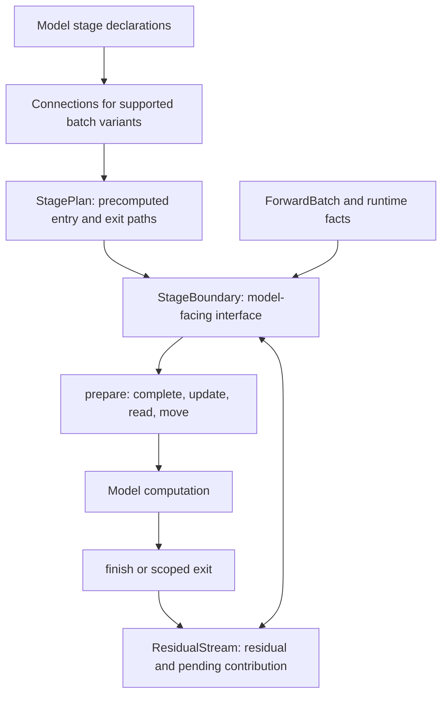

The `sglang.srt.layers.layer_boundary` package manages the transition between compute stages. It completes outstanding reductions, moves token rows, applies the producer's residual update, and prepares the consumer's normalized or quantized input. The model continues to run attention, dense FFNs, and MoE computation.

Use this guide when integrating a model or changing a boundary implementation. It describes the current internal interfaces; they are not a versioned plugin API. For model development setup, see the [contribution guide](/docs/developer_guide/contribution_guide).

## Scope and ownership

A boundary connects a **producer output** to a **consumer input**. An attention-to-FFN transition and an FFN-to-attention transition use the same contracts. A model can also have consecutive mixers, consecutive FFNs, or a branch containing three or more stages. Here a mixer is a token-mixing stage, such as attention or the Mamba block in Nemotron-H.

| Responsibility | Owner |
| --- | --- |
| Attention, projections, activation functions, expert routing, EP dispatch/combine | Model compute modules |
| How a producer contributes to the residual | Producer's `StageUpdate` |
| How a consumer reads the residual | Consumer's `StageRead` and norm |
| Supported row transitions and reduction ordering | Bound boundary paths |
| Actual outstanding work and residual tensors | Per-forward `ResidualStream` |
| Hardware-specific fused completion | Fusion adapters |
| Retention of auxiliary tensors | Auxiliary-output collector |

EP all-to-all is an operation inside MoE computation, not an input preparation step. The boundary does describe the MoE's input/output rows and any output reduction that compute delegates to it.

## Architecture



Construction and execution have different lifetimes:

1. **At model initialization**, `declare_attn()` and `declare_ffn()` describe compute behavior. `make_stages()` connects those declarations and binds each stage's own norm and hooks.
2. **During construction**, factories resolve token rows and reduction contracts for supported batch variants. `make_boundary()` binds consumer work; `make_output_boundary()` binds output transport. `StagePlan` retains those paths.
3. **At each forward**, batch facts select an existing path. An exit can make a batch-dependent completion decision, but it does not rebuild the declarations. The decision publishes compute flags and supplies the matching completion action.
4. **Across stages**, `ForwardBatch.residual_stream` carries residual state and the producer's actual contribution. Stages do not store forward tensors on their reusable plans.

### Module map

All paths below are relative to `python/sglang/srt/layers/layer_boundary/`.

| Module | Role |
| --- | --- |
| `factories.py` | Model declarations, local sequence assembly, and stage factories |
| `contracts.py` | Resolved input/output contracts, edge declarations, batch variants, and bound step records |
| `layout.py` | Token axes, layouts, named sum groups, and topology/batch facts |
| `construction.py` | Build a `StagePlan` and select its batch variant |
| `boundary.py` | Select and bind producer/consumer boundary operations from contracts |
| `prepare.py` | Execute completion, update, read, and input movement in the selected order |
| `ops.py` | Collective and token-row movement primitives |
| `stage.py` | Model-facing `StageBoundary` methods |
| `exit.py` | Select output completion and publish scoped compute flags |
| `output.py` | Internal reduction/finalize handoffs and output transforms |
| `residual/stream.py` | Per-forward state and ownership of outstanding work |
| `residual/batch.py` | Model-stack entry, final norm, pipeline-parallel (PP) transport, snapshots, and extra contributions |
| `residual/access.py` | Tensor access and materialization helpers |
| `residual/add_norm.py`, `residual/mhc.py` | Plain add/norm and manifold-constrained hyper-connection (MHC) read/update implementations |
| `adapters/` | Attention input, context parallelism (CP), two-batch overlap (TBO), branches, and LoRA integration |
| `fusions/` | Consumer all-reduce fusion and CuteDSL integration |

Models normally use factories, `StageBoundary`, and `residual.batch`. Keep row arithmetic, process-group selection, and calls such as `token_axis_sizes()` inside the boundary implementation.

## Declare and construct stages

A `StageDeclaration` is the model-facing description. It contains read/update operations, dense versus sparse compute facts, reduction cooperation, and optional source declarations. It does not own a norm or an execution plan.

The resolved `StageDecl` is a different, lower-level type: one `StageInput` and one `StageOutput` after topology and batch variant have been applied. An `EdgeDecl` combines a producer output, consumer requirement, and the residual's source/destination layouts.

### A standard attention and FFN layer

The following constructor fragment assumes the model has already initialized its compute modules and norms, and the worker's runtime parallel configuration is available. It follows the dense Qwen3 integration:

```python
from sglang.srt.layers.layer_boundary import (
    declare_attn,
    declare_ffn,
    make_stages,
)

self.attn_boundary, self.ffn_boundary = make_stages(
    (declare_attn(), self.input_layernorm),
    (declare_ffn(), self.post_attention_layernorm),
    previous=declare_ffn() if layer_id != 0 else None,
    terminal=layer_id == config.num_hidden_layers - 1,
)
```

`previous` describes the actual external producer. For a sparse or custom preceding stage, supply its corresponding declaration rather than copying the dense example. You do not need an executable object from the previous layer or another pipeline rank.

`terminal=True` marks the end of the model's layer stack, not every Python decoder layer. A pipeline partition that has more layers downstream is not terminal merely because its local module list ends. A NextN/multi-token-prediction (MTP) draft module is its own stack: its layer enters with `previous=None` and is terminal even when it reuses the target's decoder class. In that case, use the draft's layer count, for example `terminal=layer_id == (1 if is_nextn else config.num_hidden_layers) - 1`.

`make_stages()` returns independent boundaries and retains no runtime sequence object. Each item may include a third element containing constructor options, such as `{"qkv_latent_func": self.self_attn.prepare_qkv_latent}`. Declarations passed into this assembler must not already carry `previous`, `prepared_from`, or `terminal`; provide those to the assembler.

For a single independently constructed stage, use `make_attn_stage()` or `make_ffn_stage()`. Their declaration includes its source; an optional `following` declaration describes the local consumer and must name that producer in its `previous` field.

### More than two stages and branches

There is no two-stage limit. For example, LongCat constructs a dense FFN, attention, and another dense FFN from an input already prepared for its MoE branch:

```python
first_ffn, second_attn, second_ffn = make_stages(
    (declare_ffn(), first_ffn_norm),
    (declare_attn(), second_attn_norm),
    (declare_ffn(), second_ffn_norm),
    prepared_from=moe_boundary.declaration,
)
```

This fragment assumes the source boundary and the three norms already exist. `prepared_from` means the source has already performed its read. Enter through `branch_input(source, hidden_states, forward_batch)`, not `prepare()`, to move that input and fork the residual stream without normalizing twice.

The branch adapter also provides `branch_output()` to place a complete contribution on handoff rows and `merge_branch()` to combine it with another branch's output. These methods encode row movement and residual ownership; the model still determines its compute schedule. Branch transport currently supports only ordinary token rows: construction rejects context-parallel, input-scattered, and sequence-parallel variants. See `models/longcat_flash.py` for a complete integration.

For heterogeneous layer stacks, declare the actual neighbouring layer kinds. `models/nemotron_h.py` demonstrates single-stage mixer and FFN boundaries; the framework does not require an alternating attention/FFN pattern.

## Execute a layer

The corresponding forward fragment keeps computation in the model:

```python
hidden_states = self.attn_boundary.prepare(hidden_states, forward_batch)
if hidden_states.shape[0] != 0:
    hidden_states = self.self_attn(
        positions=positions,
        hidden_states=hidden_states,
        forward_batch=forward_batch,
    )
hidden_states = self.attn_boundary.finish(hidden_states, forward_batch)

hidden_states = self.ffn_boundary.prepare(hidden_states, forward_batch)
with self.ffn_boundary.exit(forward_batch) as output:
    hidden_states = self.mlp(hidden_states, forward_batch=forward_batch)
hidden_states = output.finish(hidden_states)
```

This example uses Qwen3's compute member name `mlp`; boundary construction does not require renaming compute classes or checkpoint parameters.

`prepare()` returns input in the consumer read's format, which can include quantized tensors. An attention with a direct partial-output contract uses `finish()` to register its contribution. An FFN or single-stage mixer uses `exit()` to publish flags during compute, then calls the returned object's `finish()` once. The exit context restores the previous runtime flags even when compute raises; do not call `finish()` on a failed computation.

A complete tensor after `finish()` can still have a pending **residual update**. An incomplete reduction is exposed to the model as an opaque `OwedOutput`; pass it to the next boundary or a supported access method. Do not inspect it as a tensor, slice it, or unwrap its contribution in model code.

### Stack entry and exit

Initialize a fresh stream once on the embedding path:

```python
from sglang.srt.layers.layer_boundary.residual import batch as residual_batch

residual_batch.start(forward_batch)
hidden_states = self.embed_tokens(input_ids)
for layer in self.layers:
    hidden_states = layer(positions, hidden_states, forward_batch)
hidden_states = residual_batch.norm(hidden_states, forward_batch, self.norm)
```

This is a non-pipeline stack fragment. Pipeline reception uses the first boundary's `from_pp()` to reconstruct a stream; the sender uses `residual_batch.to_pp()`. Dynamic completion work is resolved before transport. By default, `to_pp()` preserves a statically declared partial sum for the receiver's incoming contract to reconstruct and complete. Do not call `complete_output()` before that handoff: it would complete a sum that the receiver still expects to perform.

`model_forward_stages()` in `python/sglang/srt/batch_overlap/two_batch_overlap.py` gives each TBO microbatch its own stream: it splits with `ResidualStream.arrive()` and merges the results afterwards. In the operation-scheduled TBO path, the FFN runs without an `exit()` scope and its complete output goes through `boundary.postprocess(hidden_states, forward_batch)`. Do not share one mutable stream between interleaved microbatches or hold an `exit()` scope open across a TBO yield point.

## Token layouts and actual output state

`Layout.sharded` describes which supported token axes partition a rank's rows:

- `ATTN_DP`: different attention data-parallel token sets.
- `ATTN_CP`: context-parallel token partitions for an active CP batch.
- `ATTN_TP_SCATTER`: token slices distributed across attention-TP ranks.

Size-one axes are omitted. Layout is not a `DTensor` placement or a general cross-mesh redistribution engine. It does not describe arbitrary hidden-dimension sharding. The actual row ordering, padding, and per-rank counts come from batch metadata and the paired movement operations.

A sum is described separately by `SumGroup`: attention TP, full TP, or the MoE output reduction group. Separating rows from sums lets the boundary express both an unreduced contribution and the rows on which its completion must land.

| Contract or state | Meaning |
| --- | --- |
| `ProducerReduction.PARTIAL` | Attention only (the `declare_attn()` default): compute always returns a contribution requiring a sum and publishes it with `finish()` |
| `ProducerReduction.SCOPED` | Compute obeys the exit's reduction decision and publishes through `exit()`: the `declare_ffn()` default, and `declare_attn(reduction=ProducerReduction.SCOPED)` for a mixer |
| `ProducerReduction.LOCAL_TAIL` | FFN only: compute adds a replicated component after its internal sum; the final result cannot simply be treated as a partial |
| `StageOutput.leaves_for_*` | Construction-time permission to select a particular handoff |
| `Contribution.owed` | Work this specific output still requires |
| `OwedOutput` | Model-facing handle preventing ordinary tensor use of that unfinished output |

`UnreducedOutput` is an internal adapter form. `ResidualStream.leave()` converts it into an owned contribution and opaque model handle. `HandoffOutput` represents producer-specific work such as a deferred MoE finalize; its `complete()` supplies an unfused completion path.

## Residual update and input read

A stream has three states:

| State | Stored data | Next preparation |
| --- | --- | --- |
| Initial | Neither residual nor contribution | Initialize residual through the consumer's `enter` |
| Written | Residual, no pending contribution | Read input without applying another update |
| Pending | Contribution, optionally an existing residual | Complete owed work, apply the producer update, then read |

Communication completion and residual update are distinct. `complete_output()` finishes outstanding communication/finalize work but leaves the update pending. `fold()` completes and folds a plain contribution into the residual, leaving a written stream. Always retain the returned tensor/handle after either operation.

`take_output()` releases the batch stream at a terminal exit whose output is already written, such as Nemotron MTP after its internal fold and norm. It rejects a pending contribution; unlike `complete_output()`, it does not retain an update for another stage.

The producer owns `StageUpdate`; the consumer owns `StageRead` and its norm. The actual update travels with the contribution. Bound paths use declared update capabilities to select valid ordering:

- A plain add can participate in compatible fused add+norm kernels or add the residual on one rank before summation.
- A nonlinear update cannot generally move before reduction. MHC's post operation is one such case.
- `at_producer` requests an update at the producer exit. A deferred update must guarantee that its parameters and state outlive that producer.
- `StageRead.before_gather` preserves reads that must execute on the source rows before a DP gather.

The MHC adapter implements the expanded residual and coefficient state used by its integrated models. Do not assume every MHC model uses it: DeepSeek V4 retains its model-specific MHC path.

### Auxiliary capture and extra contributions

Choose the access method according to what the consumer needs:

| Operation | Effect on main output |
| --- | --- |
| `residual_batch.snapshot()` | Produces an owned plain residual snapshot; a sum can run on a copy without consuming the main contribution |
| Attention `boundary.prepare(..., capture_output=collector.capture)` | Completes required main-output work and captures the residual from the same update/read boundary; FFN `prepare()` does not accept it |
| `boundary.capture_output()` | Preserves its explicit capture convention: completes dynamic work on the main contribution, but snapshots a statically declared sum on a copy; returns both updated handle and snapshot |
| `residual_batch.add_to_output(..., extra)` | Completes the contribution before adding extra once, keeping the residual update pending |
| `residual_batch.norm(..., capture_output=collector.capture)` | Final norm and capture of its updated residual |

Snapshots currently require a plain residual update. Producer-specific finalize handoffs need an explicit main-output capture adapter.

A separate BF16 snapshot followed by norm can change results relative to a fused add+norm kernel's FP32 accumulation. Capture from the existing update/read operation when that ordering matters. The collector owns any copy needed to retain borrowed residual or communication-buffer storage; the boundary does not inspect a successor's execution plan to decide whether a copy is safe.

## Batch variants and reduction policy

`StagePlan` preconstructs ordinary, CP, input-scattered, and sequence-parallel variants when supported by the configured topology. A forward selects a path from active runtime facts. An absent active variant raises an error rather than silently using ordinary token rows.

The `--boundary-reduction` option controls optional FFN output transport choices:

| Value | Permitted optional path |
| --- | --- |
| `ar` | All-reduce path |
| `rs` | Fixed-size reduce-scatter where eligible |
| `rsv` | Variable-size attention-DP reduce-scatter (RSv) where eligible |
| `rs+rsv` | Both scatter choices where eligible, with RSv tried first |
| `auto` | Default. Resolves a per-architecture policy during server-argument processing; a separate draft checkpoint resolves its own `speculative_boundary_reduction`. See [FFN boundary reduction](/docs/advanced_features/server_arguments#ffn-boundary-reduction) |

Required attention and MoE collectives are unaffected. These are permissions, not commands to force unsupported collectives; an ineligible optional scatter falls back to the all-reduce path. Shape, topology, producer behavior, and required token movement still constrain the selected path. The resolved policy must be available before model construction. Model defaults are defined in `arg_groups/boundary_reduction.py`. Reduction fusion has its own backend enablement and eligibility checks; selecting `ar` alone does not disable all-reduce fusion.

Configuration validation rejects unsupported model/parallel combinations. Boundary construction also rejects transitions without a correct implementation. Adding an enum value or a layout does not by itself provide a new collective path.

## Fusion and special adapters

An output decision is made once. Its flags control whether compute performs reduction/finalize work; the matching completion action either executes that work or records exactly what the next boundary owes. Do not set a skip flag independently of a completion action.

Consumer fusion candidates are ordered. A candidate returning `None` must do so before modifying inputs or starting a collective, so fallback remains valid. `FusedMlpInput` declares the sum group it completes with residual add and norm. The consumer only tries compatible candidates for the declared update/read capabilities.

An `OutputTransform` declares contribution processing before residual update. Its explicit `before_reduce_scatter` setting preserves a supported implementation's order; it is not permission to commute arbitrary operations across a reduction.

The package also contains:

- **Attention/DeepSeek Sparse Attention (DSA) adapters:** retain `AttnTpContext` and its input-scattered/latent-input hooks. They are not a general asynchronous dependency scheduler.
- **CP adapters:** pair gather, return-to-local-rows, and eligible reduce-scatter operations using the same token mapping.
- **LoRA adapter:** publishes the selected compute input's rows for LoRA execution.
- **TBO and branch adapters:** manage handoffs that cannot be represented as a normal sequential prepare call.

Producer GEMM plus reduce-scatter fusion is not a generic implemented API here. When adding such a backend, its output contract and actual completion must describe both the finished sum and returned token rows; do not leave the next boundary believing it still owes either operation.

## Extend and validate the module

Place changes according to their responsibility:

1. Add model compute facts to a declaration only when they describe compute behavior. Put user policy and unsupported configuration checks in server-argument handling.
2. Add new update/read semantics in `residual/`; declare only capabilities the implementation really supports.
3. Add a token transition in boundary selection and movement primitives, with its padding and row-order contract. Do not duplicate that logic in each model.
4. Put backend completion in `fusions/` and specialized handoff behavior in `adapters/`.
5. Keep models on stage factories and boundary methods. Avoid reading a neighbour's execution plan or reconstructing a collective decision during forward.

Focused tests live in `test/registered/unit/layer_boundary/`. Cover numerical output and residual state, collective group/row correctness, and supported fallback behavior for the changed path. Relevant examples include `test_ffn_exit.py`, `test_reduction_fusion.py`, and `test_terminal_stages.py`. A declaration-only assertion cannot establish that a new parallel path moves and reduces the correct values.
