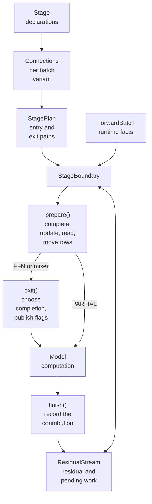

The `sglang.srt.layers.layer_boundary` package manages the transition between compute stages. It completes outstanding reductions, moves token rows, applies the producer's residual update, and prepares the consumer's normalized or quantized input. The model continues to run attention, dense FFNs, and MoE computation.

Use this guide when integrating a model or changing a boundary implementation. The first part explains the concepts, the second shows how to integrate a model, and the last describes the internals you touch when you extend the package. It documents the current internal interfaces; they are not a versioned plugin API. For model development setup, see the [contribution guide](/docs/developer_guide/contribution_guide).

## Scope and ownership

A boundary connects a **producer output** to a **consumer input**. An attention-to-FFN transition and an FFN-to-attention transition use the same contracts. A model can also have consecutive mixers, consecutive FFNs, or a branch containing three or more stages. Here a mixer is a token-mixing stage, such as attention or the Mamba block in Nemotron-H.

| Responsibility | Owner |
| --- | --- |
| Attention, projections, activation functions, expert routing, EP dispatch/combine | Model compute modules |
| How a producer contributes to the residual | Producer's `StageUpdate` |
| How a consumer reads the residual | Consumer's `StageRead` and norm |
| Supported row transitions and reduction ordering | Bound boundary paths |
| Actual outstanding work and residual tensors | Per-forward `ResidualStream` |
| Hardware-specific fused completion | Fusion providers |
| Retention of auxiliary tensors | Auxiliary-output collector |

EP all-to-all is an operation inside MoE computation, not an input preparation step. The boundary does describe the MoE's input/output rows and any output reduction that compute delegates to it.

## Core concepts

### Token layouts and sums

`Layout.sharded` describes which supported token axes partition a rank's rows:

- `ATTN_DP`: different attention data-parallel token sets.
- `ATTN_CP`: context-parallel (CP) token partitions for an active CP batch.
- `ATTN_TP_SCATTER`: token slices distributed across attention-TP ranks.

Size-one axes are omitted. Layout is not a `DTensor` placement or a general cross-mesh redistribution engine. It does not describe arbitrary hidden-dimension sharding. The actual row ordering, padding, and per-rank counts come from batch metadata and the paired movement operations.

A sum is described separately by `SumGroup`: attention TP, full TP, or the MoE output reduction group. Separating rows from sums lets the boundary express both an unreduced contribution and the rows on which its completion must land.

### Producer contracts and output state

A declaration states how its compute cooperates with the boundary's reduction decision:

| Contract or state | Meaning |
| --- | --- |
| `ProducerReduction.PARTIAL` | Attention only (the `declare_attn()` default): compute always returns a contribution requiring a sum and publishes it with `finish()`. Build its output projection so that it never reduces (for example `reduce_results=False`). `declare_ffn()` rejects it |
| `ProducerReduction.SCOPED` | Compute obeys the exit's reduction decision and publishes through `exit()`: the `declare_ffn()` default, and `declare_attn(reduction=ProducerReduction.SCOPED)` for a mixer |
| `ProducerReduction.LOCAL_TAIL` | FFN only: compute adds a replicated component after its internal sum. The boundary never defers that sum to the next layer, but reduce-scatter permissions remain, so compute that skips its sum for `mlp_reduce_scatter` must add the component exactly once. `declare_attn()` rejects it |
| `StageOutput.leaves_for_*` | Construction-time permission to select a particular handoff |
| `Contribution.owed` | Work this specific output still requires |
| `OwedOutput` | Model-facing handle preventing ordinary tensor use of that unfinished output |

`UnreducedOutput` is an internal adapter form. `ResidualStream.leave()` converts it into an owned contribution and an opaque model handle. `HandoffOutput` represents producer-specific work such as a deferred MoE finalize; its `complete()` supplies an unfused completion path. A handoff is consumed by the next layer's input or, at the end of the stack, by a final norm that accepts it.

### Residual stream

`ForwardBatch.residual_stream` carries the residual and the producer's actual contribution from one boundary to the next. A stream has three states:

| State | Stored data | Next preparation |
| --- | --- | --- |
| Initial | Neither residual nor contribution | Initialize residual through the consumer's `enter` |
| Written | Residual, no pending contribution | Read input without applying another update |
| Pending | Contribution, optionally an existing residual | Complete owed work, apply the producer update, then read |

The model keeps the tensor or handle that each boundary call returns, and passes exactly that value to the next call. Rebinding a layer's output to a different object, or passing another microbatch's output, raises an error instead of applying the wrong pending work. The check compares object identity, so an in-place change to a complete tensor is not detected; do not modify layer outputs in place, and add extra contributions through `add_to_output()`.

Communication completion and residual update are distinct steps. The `residual.batch` helpers expose them:

| Helper | Effect |
| --- | --- |
| `complete_output(hidden_states, forward_batch)` | Finishes outstanding communication/finalize work and leaves the update pending |
| `fold(hidden_states, forward_batch)` | Completes a plain contribution and folds it into the residual, leaving a written stream |
| `written(hidden_states, forward_batch)` | Replaces the stream with a written one whose residual is `hidden_states`. Use it after compute that produced the full residual itself. It discards any pending contribution, so call `fold()` first when one may be pending |
| `take_output(hidden_states, forward_batch)` | Releases the stream at a terminal exit whose output is already written, such as Nemotron-H MTP after its internal fold and norm. It rejects a pending contribution |

Always retain the returned tensor or handle after each of these calls. A stack-entry boundary accepts a written stream and skips its `enter` operation.

### Residual update and input read

The producer owns `StageUpdate`; the consumer owns `StageRead` and its norm. The actual update travels with the contribution. Bound paths use declared update capabilities to select valid ordering:

- A plain add can participate in compatible fused add+norm kernels or add the residual on one rank before summation.
- A nonlinear update cannot generally move before reduction. The post operation of manifold-constrained hyper-connections (MHC) is one such case.
- `at_producer` requests an update at the producer exit. A deferred update must guarantee that its parameters and state outlive that producer.
- `StageRead.before_gather` preserves reads that must execute on the source rows before a DP gather.

A read returns `(compute_input, residual)`. `update_and_read()` receives the producer's update together with the read, so an implementation can fuse them: the plain add+norm read does, and keeps its FP32 accumulation instead of normalizing a separately rounded snapshot. Fusion is not guaranteed. An implementation such as MHC may run the update and the read as separate steps, provided it preserves its existing rounding order.

The MHC adapter implements the expanded residual and coefficient state used by its integrated models. Do not assume every MHC model uses it: DeepSeek V4 retains its model-specific MHC path.

## Integrate a model

### Declare a standard attention and FFN layer

A `StageDeclaration` is the model-facing description. It contains read/update operations, dense versus sparse compute facts, reduction cooperation, and optional source declarations. It does not own a norm or an execution plan.

The following constructor fragment assumes the model has already initialized its compute modules and norms, and the worker's runtime parallel configuration is available. It follows the dense Qwen3 integration:

```python
from sglang.srt.layers.layer_boundary import (
    declare_attn,
    declare_ffn,
    make_stages,
)

self.attn_boundary, self.ffn_boundary = make_stages(
    (declare_attn(), self.input_layernorm),
    (declare_ffn(), self.post_attention_layernorm),
    previous=declare_ffn() if layer_id != 0 else None,
    terminal=layer_id == config.num_hidden_layers - 1,
)
```

`previous` describes the actual external producer. You do not need an executable object from the previous layer or another pipeline rank. For a sparse or custom preceding stage, build `previous` with the same arguments the producing layer uses for its own declaration, including `next_sparse`, for example `declare_ffn(sparse=prev_sparse, next_sparse=this_sparse)`; the two-batch overlap (TBO) handoff rows derive from that pair.

`terminal=True` marks the end of the model's layer stack, not every Python decoder layer. A pipeline partition that has more layers downstream is not terminal merely because its local module list ends. A NextN/multi-token-prediction (MTP) draft module is its own stack: its layer enters with `previous=None` and is terminal even when it reuses the target's decoder class. In that case, use the draft's layer count, for example `terminal=layer_id == (1 if is_nextn else config.num_hidden_layers) - 1`. A terminal stage leaves no work for a following layer, except the final-norm finalize handoff described in [Enter and leave the layer stack](#enter-and-leave-the-layer-stack).

`make_stages()` returns independent boundaries and retains no runtime sequence object. Each item may include a third element containing constructor options: an attention stage accepts `qkv_latent_func` (for example `{"qkv_latent_func": self.self_attn.prepare_qkv_latent}`) and `fusions`; an FFN stage accepts only `fusions` (see [Fusion providers](#fusion-providers-and-output-decisions)). Declarations passed into this assembler must not already carry `previous`, `prepared_from`, or `terminal`; provide those to the assembler.

For a single independently constructed stage, use `make_attn_stage()` or `make_ffn_stage()`. Their declaration includes its source; an optional `following` declaration describes the local consumer and must name that producer in its `previous` field.

### Single-stage mixers and heterogeneous stacks

For heterogeneous layer stacks, declare the actual neighbouring stage kinds; the framework does not require an alternating attention/FFN pattern. `make_stages(..., following=declaration)` describes the external consumer after the last local stage, just as `previous` describes the producer before the first.

For a single-stage `ProducerReduction.SCOPED` mixer, `following` decides whether the mixer leaves its attention-TP sum to the next stage: always before an FFN, and per batch before another mixer. The next stage makes the same decision from its own `previous`, so both must describe the same neighbours. Otherwise a pipeline handoff reduces the mixer's output twice: `to_pp()` exports it complete and the receiver's `from_pp()` declares the sum again.

`models/nemotron_h_utils.py` (used by `models/nemotron_h.py`) builds each Nemotron-H stage as `make_stages((decl, norm), previous=..., following=..., terminal=...)`, with mixers declared as `declare_attn(reduction=ProducerReduction.SCOPED, gathers_tp_input=False)`.

### More than two stages and branches

There is no two-stage limit. For example, LongCat constructs a dense FFN, attention, and another dense FFN from an input already prepared for its MoE branch:

```python
first_ffn, second_attn, second_ffn = make_stages(
    (declare_ffn(), first_ffn_norm),
    (declare_attn(), second_attn_norm),
    (declare_ffn(), second_ffn_norm),
    prepared_from=moe_boundary.declaration,
)
```

This fragment assumes the source boundary and the three norms already exist. `prepared_from` means the source has already performed its read. Enter through `branch_input(source, hidden_states, forward_batch)`, not `prepare()`, to move that input and fork the residual stream without normalizing twice. The first stage's norm is therefore never applied; LongCat passes the MoE stage's norm there.

The branch adapter also provides `branch_output()` to place a complete contribution on handoff rows and `merge_branch()` to combine it with another branch's output. These methods encode row movement and residual ownership; the model still determines its compute schedule. Branch transport currently supports only ordinary token rows: construction rejects context-parallel, input-scattered, and sequence-parallel variants. See `python/sglang/srt/models/longcat_flash.py` for a complete integration.

### Execute a layer

The corresponding forward fragment keeps computation in the model:

```python
hidden_states = self.attn_boundary.prepare(hidden_states, forward_batch)
if hidden_states.shape[0] != 0:
    hidden_states = self.self_attn(
        positions=positions,
        hidden_states=hidden_states,
        forward_batch=forward_batch,
    )
hidden_states = self.attn_boundary.finish(hidden_states, forward_batch)

hidden_states = self.ffn_boundary.prepare(hidden_states, forward_batch)
with self.ffn_boundary.exit(forward_batch) as output:
    hidden_states = self.mlp(hidden_states, forward_batch=forward_batch)
hidden_states = output.finish(hidden_states)
```

This example uses Qwen3's compute member name `mlp`; boundary construction does not require renaming compute classes or checkpoint parameters.

`prepare()` returns input in the consumer read's format, which can include quantized tensors. An attention with a `PARTIAL` output contract uses `finish()` to register its contribution. An FFN or single-stage mixer uses `exit()` to publish flags during compute, then calls the returned object's `finish()` once. The exit context restores the previous runtime flags even when compute raises; do not call `finish()` on a failed computation.

Compute cooperates through the flags the scope publishes on `get_forward()`:

- `FfnExit` publishes `fuse_mlp_allreduce` (skip the output all-reduce), `mlp_reduce_scatter` (leave the sum to the boundary's reduce-scatter), and `defer_moe_finalize` (a MoE may return a `HandoffOutput`).
- `MixerExit` publishes `fuse_mlp_allreduce` and exposes the same decision as `skips_reduction`. Before an FFN, the mixer always leaves its attention-TP sum to the FFN's input, including under attention DP. Before another mixer it may defer the sum to that mixer's input, but never under attention DP.

`RowParallelLinear` and the MoE output reduction honour these flags automatically; a custom reduction reads them from the exit object. Returning a handoff while `defer_moe_finalize` is false fails in `finish()`.

A complete tensor after `finish()` can still have a pending **residual update**. An incomplete reduction is exposed to the model as an opaque `OwedOutput`; pass it to the next boundary or a supported access method. Do not inspect it as a tensor, slice it, or unwrap its contribution in model code.

### Enter and leave the layer stack

Initialize a fresh stream once on the embedding path, and leave the stack through the final norm:

```python
from sglang.srt.layers.layer_boundary.residual import batch as residual_batch

residual_batch.start(forward_batch)
hidden_states = self.embed_tokens(input_ids)
for layer in self.layers:
    hidden_states = layer(positions, hidden_states, forward_batch)
hidden_states = residual_batch.norm(
    hidden_states, forward_batch, self.norm, skip_empty=True
)
```

`skip_empty=True` still completes owed work on an empty batch, which may be a collective that other ranks join, and skips only the norm kernel. `norm()` and `to_pp()` release the batch's stream after they hand on its output.

This is a non-pipeline stack fragment. Pipeline reception uses the first boundary's `from_pp(tensors, forward_batch)` to reconstruct a stream; the sender uses `residual_batch.to_pp()`. Dynamic completion work is resolved before transport. By default, `to_pp()` preserves a statically declared partial sum for the receiver's incoming contract to reconstruct and complete. Do not call `complete_output()` before that handoff: it would complete a sum that the receiver still expects to perform.

A terminal FFN normally completes its output before the final norm. The exception is a MoE finalize handoff. When the stage's fusion provider can defer the finalize at the terminal layer (for CuteDSL, `install_cutedsl_fusion(..., terminal_finalize=True)`), the exit may leave a `HandoffOutput` for the final norm. Pass the handle straight to `residual_batch.norm(hidden_states, forward_batch, self.norm, handoff_norm=service)`, where `service` is the object `install_cutedsl_fusion()` returned; its `finalize(handoff, residual, gamma)` fuses finalize, all-reduce, residual add, and norm. The fused path reads `layernorm.gemma_weight`, so it currently expects a `GemmaRMSNorm` final norm. Without `handoff_norm`, `norm()` first completes the handoff unfused, and `capture_output` is then allowed. With `handoff_norm`, `norm()` rejects `capture_output` when a handoff arrives. Calling `complete_output()` first runs the producer's unfused finalize, and `snapshot()` raises on a handoff. See `python/sglang/srt/models/qwen3_5.py`.

`model_forward_stages()` in `python/sglang/srt/batch_overlap/two_batch_overlap.py` gives each TBO microbatch its own stream: it splits with `ResidualStream.arrive()` and merges the results afterwards. Do not share one mutable stream between interleaved microbatches or hold an `exit()` scope open across a TBO yield point.

In the operation-scheduled TBO path, the FFN runs without an `exit()` scope. No skip flags are published, so compute returns a fully reduced output. `boundary.postprocess(hidden_states, forward_batch)` applies any output transform, moves that output back to the layer's handoff rows (a plain scatter under attention DP), and leaves nothing owed.

### Auxiliary capture and extra contributions

Choose the access method according to what the consumer needs:

| Operation | Effect on main output |
| --- | --- |
| `residual_batch.snapshot()` | Produces an owned plain residual snapshot; a sum can run on a copy without consuming the main contribution |
| Attention `boundary.prepare(..., capture_output=collector.capture)` | Completes the main output's owed communication (unfused; the add+norm kernel still runs), then captures the updated residual this read produces, moved back to the producer's rows. At stack entry it captures the input before `enter`; with `post_residual_addition` it captures output plus residual before the addition. FFN `prepare()` does not accept it |
| Attention `boundary.prepare(..., captured_last_layer_outputs=collector)` | Captures the same updated residual on the attention's compute-input rows, after its input gather |
| `boundary.capture_output()` | Preserves its explicit capture convention: completes dynamic work on the main contribution, but snapshots a statically declared sum on a copy; returns both updated handle and snapshot |
| `residual_batch.add_to_output(..., extra)` | Completes the contribution before adding extra once, keeping the residual update pending |
| `residual_batch.norm(..., capture_output=collector.capture)` | Final norm and capture of its updated residual |

Snapshots currently require a plain residual update. Producer-specific finalize handoffs need an explicit main-output capture adapter.

A separate BF16 snapshot followed by norm can change results relative to a fused add+norm kernel's FP32 accumulation. Capture from the existing update/read operation when that ordering matters.

A capture callback has the signature `capture(value, *, owned=False)`, as `AuxHiddenStateList.capture` does. With `owned=False` the value may alias the mutable residual or a reusable communication buffer, and the collector must copy it before retaining it. The boundary passes `owned=True` only for storage nothing else will write: a capture move that gathers rows (`StageEntry.capture_move_allocates`), a residual sum computed only for the capture, or a residual that the following local stage's input path certifies it leaves untouched. `make_stages()` copies that certificate into the producer's entry at construction; no plan is consulted during forward. `residual_batch.norm(..., capture_output=...)` always passes a borrowed value.

### Choose a reduction policy

The `--boundary-reduction` option controls optional FFN output transport choices for decoders built with these boundaries; other models ignore it:

| Value | Permitted optional path |
| --- | --- |
| `ar` | All-reduce path |
| `rs` | Fixed-size reduce-scatter where eligible |
| `rsv` | Variable-size attention-DP reduce-scatter (RSv) where eligible |
| `rs+rsv` | Both scatter choices where eligible, with RSv tried first |
| `auto` | Default. Resolves a per-architecture policy during server-argument processing; a separate draft checkpoint resolves its own `speculative_boundary_reduction`. See [FFN boundary reduction](/docs/advanced_features/server_arguments#ffn-boundary-reduction) |

Required attention and MoE collectives are unaffected. These are permissions, not commands to force unsupported collectives; an ineligible optional scatter falls back to the all-reduce path. Shape, topology, producer behavior, and required token movement still constrain the selected path. The resolved policy must be available before model construction. Model defaults are defined in `python/sglang/srt/arg_groups/boundary_reduction.py`. Reduction fusion has its own backend enablement and eligibility checks; selecting `ar` alone does not disable all-reduce fusion.

### Integration checklist and common errors

Before you open a pull request for a new model, check each item:

- Every layer passes the real producer as `previous`, including `sparse`/`next_sparse`, and `previous=None` only where the stack starts.
- `terminal` is set only on the last layer of the model's stack, using the draft's own layer count for NextN/MTP modules.
- A single-stage mixer or FFN also passes `following`, and both neighbours describe each other consistently.
- The model forward calls `residual_batch.start()` before the first layer, and leaves the stack through `residual_batch.norm()`, `to_pp()`, or `take_output()`.
- Pipeline reception calls `from_pp(tensors, forward_batch)` on the first local boundary.
- Split prefill starts the stream only in the segment that runs the first layer and completes it only in the final segment.
- Extra contributions such as deepstack embeddings go through `residual_batch.add_to_output()`, never an in-place add on the layer output.
- Auxiliary capture uses `prepare(..., capture_output=...)` or `norm(..., capture_output=...)` with a callback that honours `owned`.

Common errors and their usual cause:

| Error | Usual cause |
| --- | --- |
| `start the layer stack before entering a stage` | The forward path, a split-prefill segment, or an MTP head skipped `residual_batch.start()` |
| `output does not belong to this residual stream; change layer outputs through boundary accessors` | The model replaced a layer's output object (for example rebinding it to a new tensor) or passed another microbatch's output. This check compares object identity, so it does not catch in-place changes; the interface still forbids modifying layer outputs in place |
| `write the residual update before taking the final output` | `take_output()` ran while a contribution was still pending; fold or norm it first |
| `no stage boundary path for the active <VARIANT> batch` | The active batch variant (CP, input-scattered, sequence parallel) is not supported by this stage; add a server-argument check that rejects the configuration |
| `a prepared branch must enter through branch_input, not prepare` | A `prepared_from` stage was entered with `prepare()` |
| `PARTIAL is not supported for ffn stages` / `LOCAL_TAIL is not supported for attention stages` | The declaration's `reduction` does not match the stage kind |
| `snapshot requires a plain residual update` | A snapshot was taken on a nonlinear (for example MHC) update |

## Boundary internals

### Architecture



Construction and execution have different lifetimes:

1. **At model initialization**, `declare_attn()` and `declare_ffn()` describe compute behavior. `make_stages()` connects those declarations and binds each stage's own norm and hooks.
2. **During construction**, factories resolve token rows and reduction contracts for supported batch variants. `make_boundary()` binds consumer work; `make_output_boundary()` binds output transport. `StagePlan` retains those paths.
3. **At each forward**, batch facts select an existing path. An exit can make a batch-dependent completion decision, but it does not rebuild the declarations. The decision publishes compute flags and supplies the matching completion action.
4. **Across stages**, `ForwardBatch.residual_stream` carries residual state and the producer's actual contribution. Stages do not store forward tensors on their reusable plans.

The resolved `StageDecl` is a lower-level type than `StageDeclaration`: one `StageInput` and one `StageOutput` after topology and batch variant have been applied. An `EdgeDecl` combines a producer output, consumer requirement, and the residual's source/destination layouts.

### Module map

Paths in this table are relative to `python/sglang/srt/layers/layer_boundary/`.

| Module | Role |
| --- | --- |
| `factories.py` | Model declarations, local sequence assembly, and stage factories |
| `contracts.py` | Resolved input/output contracts, edge declarations, batch variants, and bound step records |
| `layout.py` | Token axes, layouts, named sum groups, and topology/batch facts |
| `construction.py` | Build a `StagePlan` and select its batch variant |
| `boundary.py` | Select and bind producer/consumer boundary operations from contracts |
| `prepare.py` | Execute completion, update, read, and input movement in the selected order |
| `ops.py` | Collective and token-row movement primitives |
| `stage.py` | Model-facing `StageBoundary` methods |
| `exit.py` | Select output completion and publish scoped compute flags |
| `output.py` | Internal reduction/finalize handoffs and output transforms |
| `residual/__init__.py` | `StageUpdate`/`StageRead` protocols and `LayerResidual` |
| `residual/stream.py` | Per-forward state and ownership of outstanding work |
| `residual/batch.py` | Model-stack entry, final norm, pipeline-parallel (PP) transport, snapshots, and extra contributions |
| `residual/access.py` | Tensor access and materialization helpers |
| `residual/add_norm.py`, `residual/mhc.py` | Plain add/norm and MHC read/update implementations |
| `adapters/` | Attention input, CP, TBO, branches, and LoRA integration |
| `fusions/` | Consumer all-reduce fusion and CuteDSL integration |

Models normally use factories, `StageBoundary`, and `residual.batch`. Keep row arithmetic, process-group selection, and calls such as `token_axis_sizes()` inside the boundary implementation.

### Batch variants

`StagePlan` preconstructs ordinary, CP, input-scattered, and sequence-parallel variants when supported by the configured topology. A forward selects a path from active runtime facts. An absent active variant raises an error rather than silently using ordinary token rows.

Configuration validation rejects unsupported model/parallel combinations. Boundary construction also rejects transitions without a correct implementation. Adding an enum value or a layout does not by itself provide a new collective path.

### Fusion providers and output decisions

An output decision is made once. Its flags control whether compute performs reduction/finalize work; the matching completion action either executes that work or records exactly what the next boundary owes. Do not set a skip flag independently of a completion action.

A backend fusion provider is passed per stage as the `fusions` option, `(declaration, norm, {"fusions": provider})`; give a layer's attention and FFN stages the same provider. The boundary calls it as follows:

- `attention_input(plan)` and `ffn_input(plan)` return ordered consumer candidates, tried before the built-in all-reduce fusion.
- `can_defer_finalize(plan, forward_batch)` decides whether an FFN may return a `HandoffOutput`. It is called on every FFN exit that has a provider.
- `can_defer_all_reduce(plan, forward_batch)` lets a LoRA or `SGLANG_SHARED_EXPERT_TP1` FFN leave its all-reduce to the next input. Such an FFN defers only without an expert all-to-all backend or quantized communication, when its sum is over the TP group, and when the provider, FlashInfer fusion, or AITER fusion accepts the batch. Other FFNs defer when the post-expert sum is a single all-reduce.

`install_cutedsl_fusion()` and `prepare_cutedsl_fusion()` find providers through the decoder layer's `attn_boundary` and `ffn_boundary` attributes.

Consumer fusion candidates are ordered. A candidate returning `None` must do so before modifying inputs or starting a collective, so fallback remains valid. `FusedMlpInput` declares the sum group it completes with residual add and norm. The consumer only tries compatible candidates for the declared update/read capabilities.

An `OutputTransform` declares contribution processing before residual update. Its explicit `before_reduce_scatter` setting preserves a supported implementation's order; it is not permission to commute arbitrary operations across a reduction.

Producer GEMM plus reduce-scatter fusion is not a generic implemented API here. When adding such a backend, its output contract and actual completion must describe both the finished sum and returned token rows; do not leave the next boundary believing it still owes either operation.

### Special adapters

- **Attention/DeepSeek Sparse Attention (DSA) adapters:** retain `AttnTpContext` and its input-scattered/latent-input hooks. They are not a general asynchronous dependency scheduler.
- **CP adapters:** pair gather, return-to-local-rows, and eligible reduce-scatter operations using the same token mapping.
- **LoRA adapter:** publishes the selected compute input's rows for LoRA execution.
- **TBO and branch adapters:** manage handoffs that cannot be represented as a normal sequential prepare call.

### Extend and validate the module

Place changes according to their responsibility:

1. Add model compute facts to a declaration only when they describe compute behavior. Put user policy and unsupported configuration checks in server-argument handling.
2. Add new update/read semantics in `residual/`; declare only capabilities the implementation really supports.
3. Add a token transition in boundary selection and movement primitives, with its padding and row-order contract. Do not duplicate that logic in each model.
4. Put backend completion in `fusions/` and specialized handoff behavior in `adapters/`.
5. Keep models on stage factories and boundary methods. Avoid reading a neighbour's execution plan or reconstructing a collective decision during forward.

Focused tests live in `test/registered/unit/layer_boundary/`. Cover numerical output and residual state, collective group/row correctness, and supported fallback behavior for the changed path. Relevant examples include `test_ffn_exit.py`, `test_reduction_fusion.py`, and `test_terminal_stages.py`. A declaration-only assertion cannot establish that a new parallel path moves and reduces the correct values.
