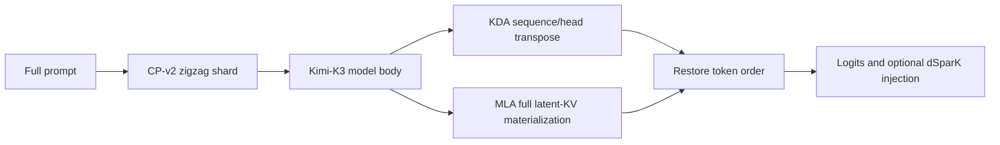
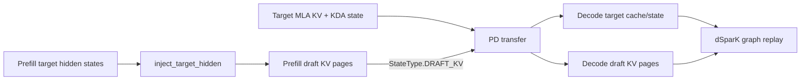

Kimi-K3 alternates recurrent Kimi Delta Attention (KDA) layers with Multi-head
Latent Attention (MLA) layers. Prefill context parallelism (PCP) splits prompt
tokens across an attention-CP group while preserving the cache and recurrent
state layout expected by ordinary decode.

This implementation targets Ascend NPU prefill. Decode does not enter the PCP
kernel paths. In a PD-disaggregated deployment, enable PCP only on Prefill and
keep Decode at its ordinary attention-CP size.

## Parallel layout

The CP group is nested inside one attention data-parallel replica. The topology
must satisfy:

```text
tp_size % (dp_size * attn_cp_size) == 0
local_kda_heads % attn_cp_size == 0
```

Kimi-K3 uses CP-v2 and the `zigzag` strategy. The strategy balances both ends
of each causal sequence across ranks and records the permutation and padding in
`attn_cp_metadata`.



You enable the path with the regular prefill-CP arguments:

```bash
sglang serve \
  --model-path sgl-npu/Kimi-K3-W4A8 \
  --trust-remote-code \
  --device npu \
  --attention-backend ascend \
  --tp-size 8 \
  --dp-size 1 \
  --attn-cp-size 2 \
  --enable-prefill-cp \
  --cp-strategy zigzag
```

The complete production command still needs the quantization, MoE, memory, and
multi-node arguments for your checkpoint and cluster.

## KDA dataflow

KDA is recurrent over tokens. Running an independent scan on each token shard
would produce incorrect states, so the implementation transposes sequence
parallelism into head parallelism:

1. `sequence_to_head_a2a` splits each rank's local KDA heads into CP-sized
   groups and performs one all-to-all.
2. Each rank receives the complete logical sequence for a subset of heads.
3. Convolution and KDA scan run over that complete sequence and head subset.
4. `head_to_sequence_a2a` performs the inverse all-to-all and restores the
   rank-local zigzag token shard.
5. `all_gather_cp_heads` reconstructs the final convolution and temporal states
   required by prefix caching, PD transfer, and non-PCP decode.

Padding participates in collectives so every rank has the same physical shape,
but padding is removed before the natural token order is reconstructed. The
path rejects missing zigzag metadata and KDA head counts that are not divisible
by the CP size.

## MLA dataflow

MLA keeps its latent K and K-RoPE buffers as separate NPU cache groups. For each
MLA prefill layer:

1. The model computes latent K and K-RoPE for the local token shard.
2. The zigzag strategy gathers and reorders both values into global logical
   token order.
3. The full latent cache is written to the normal token-pool locations.
4. Each rank splits its local zigzag queries into the previous and next causal
   halves and invokes NPU fused infer attention against the materialized cache.
5. The output is restored to the CP-v2 physical layout and later gathered at
   the model boundary.

The full MLA cache layout makes the resulting request compatible with ordinary
decode. PCP reduces per-rank prefill query work; it does not stripe the decode
MLA cache. Decode context parallelism is a separate feature configured with
`--dcp-size`.

## Model boundary and state recovery

`EagerRunner` calls `get_context_parallel_model()` so the language-model body
runs on sharded embeddings while logits processing still receives globally
ordered hidden states. Kimi-K3 exposes its language model, logits processor,
pipeline group, and auxiliary-hidden-state capture through the multimodal
wrapper.

KDA state recovery is part of the layer path rather than the final model
gather. This keeps these consumers unchanged:

- prefix-cache checkpoints;
- subsequent chunked-prefill steps;
- PD state transfer;
- ordinary decode and dSparK target verification.

## PD disaggregation with dSparK

PD Decode receives a prebuilt request and skips the target model's normal
prefill forward. A Decode-only dSparK worker therefore cannot derive its prompt
draft KV locally. Prefill and Decode must use the same dSparK checkpoint and
cache geometry, and Prefill must also enable dSparK.



Draft KV is transferred as a separate, page-indexed `StateType.DRAFT_KV`
component on the final Prefill chunk. It is not appended to the target MLA
buffer list. This separation is required because a Kimi-K3 target may expose
two buffers per MLA layer while the draft model has a different layer and
buffer count. Mixing both lists makes the NPU MLA grouping invalid and can
produce errors such as `buffers=58, layers=24`.

The transfer path validates all of the following before copying draft pages:

- target and draft page sizes match;
- Prefill and Decode register the same number of draft buffers;
- corresponding draft item sizes match;
- source and destination page-index lists have identical lengths.

The Ascend transfer manager bypasses target MLA grouping for state components,
so draft KV is copied with its own flat layout. Existing DeepSeek-V4 draft SWA
and C128 handling remains on its model-specific path.

## Code map

| Area | Main code | Responsibility |
| --- | --- | --- |
| CP strategy | `python/sglang/srt/layers/cp/` | Build zigzag metadata, shard model inputs, gather outputs, and materialize MLA KV. |
| KDA transpose | `python/sglang/srt/layers/attention/linear/kda_cp.py` | Sequence-to-head all-to-all, inverse all-to-all, and head-state gather. |
| KDA execution | `python/sglang/srt/layers/attention/linear/kda_backend.py` | Slice KDA heads and parameters, run convolution and scan, then synchronize final states. |
| MLA preparation | `python/sglang/srt/hardware_backend/npu/modules/deepseek_v2_attention_mla_npu.py` | Preserve separate latent K and K-RoPE values for the CP path. |
| MLA kernel path | `python/sglang/srt/hardware_backend/npu/attention/ascend_backend.py` | Materialize full MLA KV and run zigzag query halves with fused infer attention. |
| Model integration | `python/sglang/srt/models/kimi_k3.py` and `python/sglang/srt/model_executor/runner/eager_runner.py` | Expose the text body and gather hidden and auxiliary states before logits processing. |
| PD state schema | `python/sglang/srt/disaggregation/base/conn.py` and `python/sglang/srt/disaggregation/utils.py` | Describe target KDA state and independent dSparK draft KV components. |
| PD transfer | `python/sglang/srt/disaggregation/prefill.py`, `decode.py`, `mooncake/conn.py`, and `ascend/conn.py` | Register page payloads, validate layouts, and transfer target and draft caches. |

## Scope and constraints

- The KDA PCP path currently requires CP-v2 zigzag metadata.
- Mixed batches, target verification, and draft extension do not enter the KDA
  PCP transpose helpers.
- Decode uses the normal KDA and MLA paths; this feature is Prefill-only.
- PD dSparK requires the same draft checkpoint, attention TP size, page size,
  dtype, and quantization on Prefill and Decode.
- This design keeps KDA recurrent state and the full MLA cache compatible with
  prefix caching and PD transfer; it does not implement decode cache striping.

The focused unit tests cover zigzag permutation round trips, uneven token
shards, KDA state reconstruction, target MLA grouping, independent dSparK draft
KV registration, page-size rejection, and Ascend state-layout dispatch.
