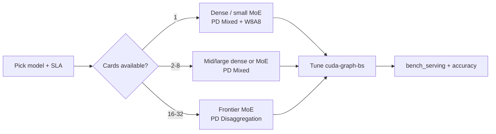

This page is the **entry point and working summary** for Ascend NPU deployment knowledge in SGLang. It indexes model tutorials and best-practice pages, and also embeds **representative sizing / quantization / TPOT snapshots** so reviewers and operators can make first-cut decisions without opening every model page first.

Use browser in-page search (`Ctrl+F` / `Cmd+F`) or the site search box with the keywords in each section. Full launch scripts and complete benchmark tables always live on the linked **Best Practices** pages — treat the snapshots here as a curated cross-model view that must stay aligned with those sources.

## How to Use This Knowledge Base

| If you need… | Start here |
| --- | --- |
| First-time environment setup | [Installation](/docs/hardware-platforms/ascend-npus/getting-started/installation) → [Quick Start](/docs/hardware-platforms/ascend-npus/getting-started/quick_start) |
| Pick card count / deploy mode | [Hardware sizing map](#hardware-sizing-map) |
| Choose quantization | [Quantization decision guide](#quantization-decision-guide) |
| Compare TPOT across models | [Benchmark snapshot](#benchmark-snapshot-representative-configs) |
| A specific model's launch commands | [Model catalog](#model-catalog) |
| Graph mode tuning | [NPU Graph Mode Usage Guide](/docs/hardware-platforms/ascend-npus/optimization/npu_graph_mode) |
| Profiling bottlenecks | [Performance Profiling](/docs/hardware-platforms/ascend-npus/optimization/profiling) |
| Accuracy / perf methodology | [Accuracy Evaluation](/docs/hardware-platforms/ascend-npus/evaluation/accuracy_evaluation), [Performance Testing](/docs/hardware-platforms/ascend-npus/evaluation/performance_testing) |
| Errors during serving | [Troubleshooting and FAQ](/docs/hardware-platforms/ascend-npus/faq) + [Common issues index](#common-issues-index) |

## Deployment Decision Flow

Use this order when standing up a new model on Ascend NPU:

1. **Confirm hardware generation** — Atlas 800I A2 vs A3. On A3 each card has **2 dies**, so `--tp-size` is typically **2× card count**. See [Glossary — Hardware](/docs/hardware-platforms/ascend-npus/reference/glossary#hardware).
2. **Pick deploy mode** — PD Mixed (simpler ops) vs PD Disaggregation (scale prefill/decode independently). Large MoE models (DeepSeek-R1 / V3.2 class) usually need PD Disaggregation for published low-latency points.
3. **Start from the model Best Practices row** that matches your **dataset shape** (e.g. 3.5k+1.5k) and latency target — do not copy GPU-only flags.
4. **Choose quantization** with the [decision guide](#quantization-decision-guide): BF16 for accuracy baselines; W8A8 for most production latency; W4A8 when memory/throughput dominates on supported MoE paths.
5. **Enable NPU Graph** with a **small** `--cuda-graph-bs` list from the model page (often ≤10 sizes). See [NPU Graph Mode Usage Guide](/docs/hardware-platforms/ascend-npus/optimization/npu_graph_mode).
6. **Validate** with [Performance Testing](/docs/hardware-platforms/ascend-npus/evaluation/performance_testing) and, for correctness-sensitive changes, [Accuracy Evaluation](/docs/hardware-platforms/ascend-npus/evaluation/accuracy_evaluation).
7. **Profile** only after functional smoke: [Performance Profiling](/docs/hardware-platforms/ascend-npus/optimization/profiling).

## Hardware Sizing Map

| Workload class | Typical hardware | Cards (published examples) | Deploy mode | Notes |
| --- | --- | --- | --- | --- |
| Dense ≤8B low latency | Atlas 800I A3 | **1** | PD Mixed | e.g. Qwen3-8B W8A8 @ 5–11ms TPOT on 3.5k/6k+1.5k |
| Dense ~30B MoE-A3B | Atlas 800I A3 | **1** | PD Mixed | e.g. Qwen3-30B-A3B W8A8 ~10ms low-latency / ~50ms throughput |
| Dense 32B | Atlas 800I A2/A3 | **2** (throughput) / **8** (ultra-low latency) | PD Mixed | 2-card W8A8 ~50ms; 8-card BF16 can reach ~6ms on long context |
| Large MoE ~235B | Atlas 800I A3 | **8** | PD Mixed | Qwen3-235B-A22B: BF16 low-latency or W8A8 throughput rows |
| Frontier MoE (DeepSeek-R1) | Atlas 800I A3 | **8 / 16 / 32** | PD Mixed or PD Disaggregation | 8-card mixed throughput; 16–32-card PD for published low-latency points |
| Long-context MoE (DeepSeek-V3.2) | Atlas 800I A3 | **32** | PD Disaggregation | Published points use 128k+1k style datasets |

**Operational checklist before multi-node / PD runs:**

| Item | Guidance |
| --- | --- |
| NIC binding | Set `HCCL_SOCKET_IFNAME` / `GLOO_SOCKET_IFNAME` to the RDMA/RoCE-facing interface |
| CPU governor | `performance` governor before large benchmarks |
| Memory allocator | `PYTORCH_NPU_ALLOC_CONF=expandable_segments:True` is common on Ascend serving scripts |
| A3 TP math | Cards × 2 ≈ `--tp-size` unless the model page says otherwise |
| Capture cardinality | Keep `--cuda-graph-bs` short; too many graphs can trigger ACL Fill / stream conflicts |

## Quantization Decision Guide

| Goal | Prefer | Trade-off | Where to verify |
| --- | --- | --- | --- |
| Accuracy baseline / debugging | **BF16 / FP16** | Highest memory; may need more cards | Model tutorial + accuracy eval |
| Production low latency (dense & many MoE) | **W8A8 INT8** (`--quantization modelslim` on published scripts) | Small accuracy risk vs BF16; best documented TPOT rows | Per-model Best Practices tables |
| Memory / cost on large MoE | **W4A8 INT8** (where published) | Throughput-oriented; confirm model support | DeepSeek-R1 high-throughput rows |
| Speculative decode drafts | Draft often **unquant** while target is quantized | Extra HBM for draft weights | `--speculative-draft-model-*` on model pages |

**Cross-model pattern (from published Ascend best practices):**

- Small dense (Qwen3-8B): W8A8 on **1×A3** covers both low-latency and high-throughput published points.
- Mid MoE-A3B (Qwen3-30B-A3B): W8A8 for latency/throughput; BF16 appears mainly as a high-latency / accuracy-style row.
- Large MoE (Qwen3-235B / DeepSeek): BF16 used for selected ultra-low-latency or specialized rows; W8A8/W4A8 dominate scaled serving.
- Always re-check the model page — quantization names and kernel support differ by release.

Deep dive: [Quantization](/docs/hardware-platforms/ascend-npus/optimization/quantization).

## Benchmark Snapshot (Representative Configs)

> **Source policy:** Numbers below are copied from the linked Best Practices summary tables (Ascend NPU docs). When a Best Practices page is updated, refresh this snapshot in the same PR. Do not treat this table as a substitute for the full configuration blocks.

### Low-latency oriented

| Model | Hardware | Cards | Mode | Dataset | TPOT | Quant | Detail |
| --- | --- | --- | --- | --- | --- | --- | --- |
| Qwen3-8B | 800I A3 | 1 | PD Mixed | 3.5k+1.5k | **5ms** | W8A8 INT8 | [Best Practices](/docs/hardware-platforms/ascend-npus/model-deployment/best-practices/qwen3_8b) |
| Qwen3-8B | 800I A3 | 1 | PD Mixed | 6k+1.5k | **11.79ms** | W8A8 INT8 | [Best Practices](/docs/hardware-platforms/ascend-npus/model-deployment/best-practices/qwen3_8b) |
| Qwen3-30B-A3B | 800I A3 | 1 | PD Mixed | 3.5k+1.5k | **10ms** | W8A8 INT8 | [Best Practices](/docs/hardware-platforms/ascend-npus/model-deployment/best-practices/qwen3_30b_a3b) |
| Qwen3-32B | 800I A3 | 8 | PD Mixed | 18k+4k | **6ms** | BF16 | [Best Practices](/docs/hardware-platforms/ascend-npus/model-deployment/best-practices/qwen3_32b) |
| Qwen3-235B-A22B | 800I A3 | 8 | PD Mixed | 11k+1.5k | **8ms** | BF16 | [Best Practices](/docs/hardware-platforms/ascend-npus/model-deployment/best-practices/qwen3_235b_a22b) |
| DeepSeek-R1 | 800I A3 | 32 | PD Disagg | 3.5k+1.5k | **16ms** | W8A8 INT8 | [Best Practices](/docs/hardware-platforms/ascend-npus/model-deployment/best-practices/deepseek_r1) |
| DeepSeek-V3.2 | 800I A3 | 32 | PD Disagg | 128k+1k | **26ms** | W8A8 INT8 | [Best Practices](/docs/hardware-platforms/ascend-npus/model-deployment/best-practices/deepseek_v3_2) |

### Throughput oriented

| Model | Hardware | Cards | Mode | Dataset | TPOT | Quant | Detail |
| --- | --- | --- | --- | --- | --- | --- | --- |
| Qwen3-8B | 800I A3 | 1 | PD Mixed | 3.5k+1.5k | **37ms** | W8A8 INT8 | [Best Practices](/docs/hardware-platforms/ascend-npus/model-deployment/best-practices/qwen3_8b) |
| Qwen3-30B-A3B | 800I A3 | 1 | PD Mixed | 3.5k+1.5k | **50ms** | W8A8 INT8 | [Best Practices](/docs/hardware-platforms/ascend-npus/model-deployment/best-practices/qwen3_30b_a3b) |
| Qwen3-32B | 800I A2 | 2 | PD Mixed | 3.5k+1.5k | **50ms** | W8A8 INT8 | [Best Practices](/docs/hardware-platforms/ascend-npus/model-deployment/best-practices/qwen3_32b) |
| Qwen3-32B | 800I A3 | 2 | PD Mixed | 3.5k+1.5k | **50ms** | W8A8 INT8 | [Best Practices](/docs/hardware-platforms/ascend-npus/model-deployment/best-practices/qwen3_32b) |
| Qwen3-235B-A22B | 800I A3 | 8 | PD Mixed | 3.5k+1.5k | **50.1ms** | W8A8 INT8 | [Best Practices](/docs/hardware-platforms/ascend-npus/model-deployment/best-practices/qwen3_235b_a22b) |
| DeepSeek-R1 | 800I A3 | 8 | PD Mixed | 3.5k+1.5k | **50ms** | W4A8 INT8 | [Best Practices](/docs/hardware-platforms/ascend-npus/model-deployment/best-practices/deepseek_r1) |
| DeepSeek-R1 | 800I A3 | 16 | PD Disagg | 3.5k+1.5k | **50ms** | W4A8 INT8 | [Best Practices](/docs/hardware-platforms/ascend-npus/model-deployment/best-practices/deepseek_r1) |

### How to read the snapshot

1. Match **hardware generation**, **card count**, and **dataset** before comparing TPOT across rows.
2. A lower TPOT row is not automatically “better” if concurrency / batching differs — open the linked page for `--max-running-requests`, speculative settings, and graph capture lists.
3. Reproduce with [Performance Testing](/docs/hardware-platforms/ascend-npus/evaluation/performance_testing) on your cluster; published numbers assume the env hardening in each Optimal Configuration block.



## Model Catalog

Each row links to the **tutorial** (deployment steps) and **best practices** (full benchmark tables + recommended commands).

| Model | Tutorial | Best Practices | Typical tags |
| --- | --- | --- | --- |
| DeepSeek-R1 | [Tutorial](/docs/hardware-platforms/ascend-npus/model-deployment/tutorials/deepseek_r1) | [Best Practices](/docs/hardware-platforms/ascend-npus/model-deployment/best-practices/deepseek_r1) | MoE, MLA, PD, speculative |
| DeepSeek-V3.2 | [Tutorial](/docs/hardware-platforms/ascend-npus/model-deployment/tutorials/deepseek_v3_2) | [Best Practices](/docs/hardware-platforms/ascend-npus/model-deployment/best-practices/deepseek_v3_2) | MoE, MLA, DeepEP |
| GLM-5.1 | [Tutorial](/docs/hardware-platforms/ascend-npus/model-deployment/tutorials/glm_5_1) | [Best Practices](/docs/hardware-platforms/ascend-npus/model-deployment/best-practices/glm_5_1) | MoE, large scale |
| GLM-5.2 | [Tutorial](/docs/hardware-platforms/ascend-npus/model-deployment/tutorials/glm_5_2) | — | MoE |
| Kimi-K2.6 | [Tutorial](/docs/hardware-platforms/ascend-npus/model-deployment/tutorials/kimi_k2_6) | [Best Practices](/docs/hardware-platforms/ascend-npus/model-deployment/best-practices/kimi_k2_6) | MoE, multimodal |
| MiniMax-M2.5 | [Tutorial](/docs/hardware-platforms/ascend-npus/model-deployment/tutorials/minimax_m2_5) | [Best Practices](/docs/hardware-platforms/ascend-npus/model-deployment/best-practices/minimax_m2_5) | MoE |
| MiMo-V2-Flash | [Tutorial](/docs/hardware-platforms/ascend-npus/model-deployment/tutorials/mimo_v2_flash) | [Best Practices](/docs/hardware-platforms/ascend-npus/model-deployment/best-practices/mimo_v2_flash) | MoE |
| Qwen3-8B | [Tutorial](/docs/hardware-platforms/ascend-npus/model-deployment/tutorials/qwen3_8b) | [Best Practices](/docs/hardware-platforms/ascend-npus/model-deployment/best-practices/qwen3_8b) | dense, low latency |
| Qwen3-8-Max | [Tutorial](/docs/hardware-platforms/ascend-npus/model-deployment/tutorials/qwen3_8_max) | — | dense |
| Qwen3-32B | [Tutorial](/docs/hardware-platforms/ascend-npus/model-deployment/tutorials/qwen3_32b) | [Best Practices](/docs/hardware-platforms/ascend-npus/model-deployment/best-practices/qwen3_32b) | dense |
| Qwen3-30B-A3B | [Tutorial](/docs/hardware-platforms/ascend-npus/model-deployment/tutorials/qwen3_30b_a3b) | [Best Practices](/docs/hardware-platforms/ascend-npus/model-deployment/best-practices/qwen3_30b_a3b) | MoE |
| Qwen3-235B-A22B | [Tutorial](/docs/hardware-platforms/ascend-npus/model-deployment/tutorials/qwen3_235b_a22b) | [Best Practices](/docs/hardware-platforms/ascend-npus/model-deployment/best-practices/qwen3_235b_a22b) | MoE, large scale |
| Qwen3.5-397B | [Tutorial](/docs/hardware-platforms/ascend-npus/model-deployment/tutorials/qwen3_5_397b) | [Best Practices](/docs/hardware-platforms/ascend-npus/model-deployment/best-practices/qwen3_5_397b) | MoE |
| Qwen3.6-27B | [Tutorial](/docs/hardware-platforms/ascend-npus/model-deployment/tutorials/qwen3_6_27b) | [Best Practices](/docs/hardware-platforms/ascend-npus/model-deployment/best-practices/qwen3_6_27b) | dense |
| Qwen3.6-35B-A3B | [Tutorial](/docs/hardware-platforms/ascend-npus/model-deployment/tutorials/qwen3_6_35b_a3b) | [Best Practices](/docs/hardware-platforms/ascend-npus/model-deployment/best-practices/qwen3_6_35b_a3b) | MoE |
| Qwen3-Next-80B-A3B-Instruct | [Tutorial](/docs/hardware-platforms/ascend-npus/model-deployment/tutorials/qwen3_next_80b_a3b_instruct) | [Best Practices](/docs/hardware-platforms/ascend-npus/model-deployment/best-practices/qwen3_next_80b_a3b_instruct) | MoE, Next |
| Hy3 | [Tutorial](/docs/hardware-platforms/ascend-npus/model-deployment/tutorials/hy3) | — | multimodal |

## Cross-Cutting Best Practices

### Deployment modes

| Mode | When to use | Documentation hooks |
| --- | --- | --- |
| Colocated (PD Mixed) | Single cluster, simpler ops | Most Qwen3 best-practice tables |
| PD disaggregation | Scale prefill/decode independently | DeepSeek / large MoE tutorials, [FAQ PD section](/docs/hardware-platforms/ascend-npus/faq) |
| Speculative decoding | Lower TPOT on supported models | `--speculative-algorithm`, model-specific draft paths |

### Performance switches (quick index)

| Switch / env | Purpose | Deep dive |
| --- | --- | --- |
| `--cuda-graph-bs` | NPU Graph capture sizes | [NPU Graph Mode Guide](/docs/hardware-platforms/ascend-npus/optimization/npu_graph_mode) |
| `--disable-radix-cache` | Prefix cache control | [Parameter Tuning](/docs/hardware-platforms/ascend-npus/optimization/parameter_tuning) |
| `SGLANG_NPU_USE_MLAPO=1` | MLA fusion for DeepSeek-style models | Parameter Tuning |
| `SGLANG_NPU_USE_MULTI_STREAM=1` | MoE shared/routed overlap | Parameter Tuning |
| `--enable-dp-attention` | DP attention for throughput | Model best practices |
| `--moe-a2a-backend deepep` | Expert parallel comms | [Expert Parallelism](/docs/advanced_features/expert_parallelism) |

### Minimal serve skeleton (replace flags from Best Practices)

```bash Command
# Skeleton only — copy Optimal Configuration from the model Best Practices page.
export HCCL_SOCKET_IFNAME=<nic>
export GLOO_SOCKET_IFNAME=<nic>
export PYTORCH_NPU_ALLOC_CONF=expandable_segments:True

python3 -m sglang.launch_server \
  --model-path /path/to/weights \
  --device npu \
  --attention-backend ascend \
  --tp-size <dies-or-cards-per-page> \
  --quantization <bf16-or-modelslim> \
  --cuda-graph-bs <short-list-from-page> \
  --host 127.0.0.1 --port 6688
```

## Common Issues Index

| Symptom / keyword | FAQ entry |
| --- | --- |
| PD disaggregation GLOO / context corruption | [FAQ §1](/docs/hardware-platforms/ascend-npus/faq#1-context-corruption-with-gloo-oppreamblelength--opnbytes-in-pd-disaggregation) |
| Graph mode Fill / ACL 507000 | [FAQ §2](/docs/hardware-platforms/ascend-npus/faq#2-graph-mode-aclnninplacefillscalar-error) |
| Prefill alloc / aivec errors | [FAQ §3](/docs/hardware-platforms/ascend-npus/faq#3-alloc_extend_kernel-error) |
| Too many captured graphs | [NPU Graph Mode — Troubleshooting](/docs/hardware-platforms/ascend-npus/optimization/npu_graph_mode#troubleshooting-quick-reference) |
| Wrong TP on A3 | Recheck dies×cards rule in [Glossary](/docs/hardware-platforms/ascend-npus/reference/glossary#hardware) |
| TPOT far from published | Align dataset lengths, quant, card count, speculative flags with the same Best Practices row |

## Maintenance

This knowledge base is a **curated index + cross-model snapshot** over the Ascend NPU doc tree.

When adding a new model:

1. Publish tutorial + best-practice pages under `model-deployment/`.
2. Add a row to the [Model catalog](#model-catalog).
3. If the model introduces a new sizing tier or quantization pattern, update [Hardware sizing map](#hardware-sizing-map), [Quantization decision guide](#quantization-decision-guide), and optionally one row in the [Benchmark snapshot](#benchmark-snapshot-representative-configs).
4. Link new quantization/graph/PD notes in [Cross-Cutting Best Practices](#cross-cutting-best-practices).

When changing published TPOT numbers on a Best Practices page, update the matching snapshot row in the **same PR** so this page does not drift.

## See Also

- [Supported Models](/docs/hardware-platforms/ascend-npus/reference/support_models)
- [Supported Features](/docs/hardware-platforms/ascend-npus/reference/support_features)
- [Environment Variables](/docs/hardware-platforms/ascend-npus/reference/environment_variables)
- [Parameter Tuning](/docs/hardware-platforms/ascend-npus/optimization/parameter_tuning)
- [NPU Graph Mode Usage Guide](/docs/hardware-platforms/ascend-npus/optimization/npu_graph_mode)
