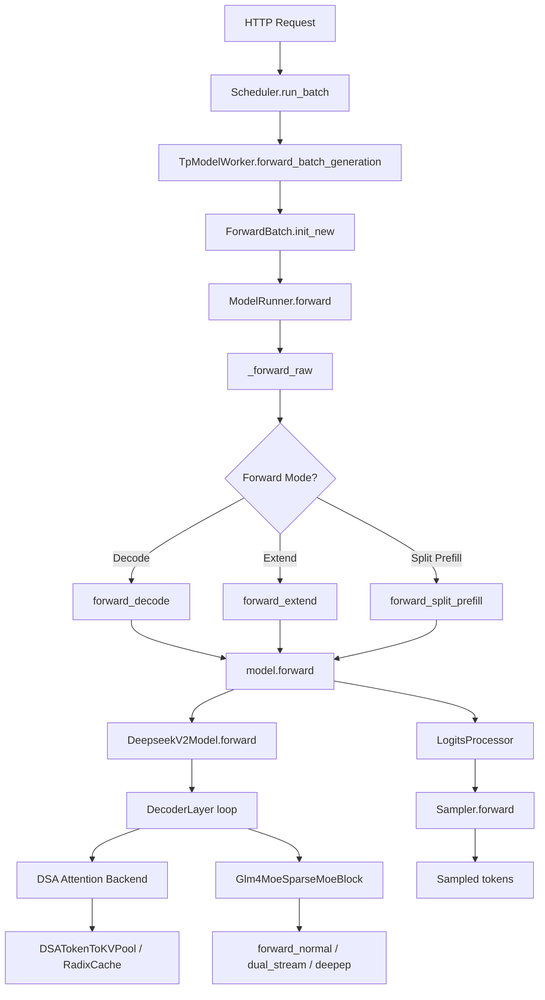

# GLM-5.2 SGLang Source Analysis

## 1. Executive Summary

GLM-5.2 is not explicitly referenced anywhere in this repository. The string "glm-5.2", "glm52", "GLM-5.2" does not appear in any Python, Markdown, or RST file. However, GLM-5 and GLM-5.1 are well supported. GLM-5 uses the `GlmMoeDsaForCausalLM` architecture, which inherits from `DeepseekV2ForCausalLM` and reuses the DeepSeek Sparse Attention (DSA) and Multi-Token Prediction (MTP) infrastructure. GLM-5.1 is tested with FP8 quantization. GLM-5.2, if it exists, would likely be supported through the same `GlmMoeDsaForCausalLM` path, but this is speculation -- no code explicitly handles GLM-5.2.

Key evidence: `rg -rn "glm.5.2\|GLM-5.2\|glm52" python/ test/ docs/` returns zero results.

## 2. Key GLM-5.2 Related Files

Since GLM-5.2 is not found, the closest related files are:

- `python/sglang/srt/models/glm4_moe.py` -- defines `GlmMoeDsaForCausalLM(DeepseekV2ForCausalLM)` (line 1477), the DSA-based architecture used by GLM-5.
- `python/sglang/srt/models/glm4_moe_lite.py` -- defines `Glm4MoeLiteForCausalLM` (line 896), the MLA-based MoE model for GLM-4.7-Flash.
- `python/sglang/srt/models/deepseek_v2.py` -- defines `DeepseekV2ForCausalLM` (line 2539) and `DeepseekV2AttentionMLA` (line 1464), the base classes.
- `python/sglang/srt/models/registry.py` -- `_ModelRegistry` auto-discovers `EntryClass` in each model module (line 131).
- `python/sglang/srt/configs/model_config.py` -- `is_deepseek_dsa()` (line 103) detects DSA models including `GlmMoeDsaForCausalLM`.
- `python/sglang/srt/server_args.py` -- `_handle_model_specific_adjustments()` (line 1961) configures DSA backend for GLM-5.
- `python/sglang/srt/layers/attention/dsa_backend.py` -- `DeepseekSparseAttnBackend` (line 287), the DSA attention backend.
- `python/sglang/srt/function_call/glm47_moe_detector.py` -- `Glm47MoeDetector` (line 165), tool call parser for GLM-4.7+.
- `python/sglang/srt/function_call/glm4_moe_detector.py` -- `Glm4MoeDetector` (line 134), tool call parser for GLM-4.5/4.6.
- `python/sglang/srt/parser/reasoning_parser.py` -- `Glm45Detector` (line 338), reasoning parser for GLM-4.5+.
- `docs/basic_usage/deepseek_v32.md` -- documents GLM-5 usage alongside DeepSeek V3.2.
- `docs/platforms/ascend/ascend_npu_glm5_examples.md` -- Ascend NPU GLM-5 deployment guide.

## 3. Main Model Class and Inheritance

GLM-5 uses `GlmMoeDsaForCausalLM`, defined in `python/sglang/srt/models/glm4_moe.py` line 1477:

```
class GlmMoeDsaForCausalLM(DeepseekV2ForCausalLM):
    def determine_num_fused_shared_experts(self):
        super().determine_num_fused_shared_experts("GlmMoeDsaForCausalLM")
```

It is a thin subclass of `DeepseekV2ForCausalLM` (defined in `python/sglang/srt/models/deepseek_v2.py` line 2539). It inherits:
- Weight loading via `DeepseekV2WeightLoaderMixin` (`python/sglang/srt/models/deepseek_common/deepseek_weight_loader.py` line 96).
- The MLA attention via `DeepseekV2AttentionMLA` (`deepseek_v2.py` line 1464).
- The full forward pass and MoE logic from `DeepseekV2ForCausalLM`.

The `EntryClass` at `glm4_moe.py` line 1482 registers both `Glm4MoeForCausalLM` and `GlmMoeDsaForCausalLM`.

Other GLM model classes:
- `Glm4ForCausalLM` in `glm4.py` line 419 -- standard GQA attention, not MoE.
- `Glm4MoeForCausalLM` in `glm4_moe.py` line 1167 -- MoE with GQA attention (not MLA).
- `Glm4MoeLiteForCausalLM` in `glm4_moe_lite.py` line 896 -- MoE with MLA attention, for GLM-4.7-Flash.
- `ChatGLMModel` in `chatglm.py` line 423 -- older ChatGLM2/3.

## 4. DSA / MLA Path

Two distinct attention paths exist for GLM models:

**DSA (DeepSeek Sparse Attention)** -- used by GLM-5:
- Detection: `is_deepseek_dsa()` in `model_config.py` line 103 checks if architecture is `GlmMoeDsaForCausalLM` and `index_topk` is set.
- Backend: `DeepseekSparseAttnBackend` in `dsa_backend.py` line 287.
- Server args: `server_args.py` line 2023 sets `self.attention_backend = "dsa"` when `is_deepseek_dsa()` returns True.
- DSA backends configurable via `--dsa-prefill-backend` and `--dsa-decode-backend` (line 601, 604 in `server_args.py`).
- Options: `flashmla_sparse`, `flashmla_kv`, `fa3`, `tilelang`, `trtllm`, `aiter`.

**MLA (Multi-head Latent Attention)** -- used by GLM-4.7-Flash (Glm4MoeLiteForCausalLM):
- `Glm4MoeLiteDecoderLayer` in `glm4_moe_lite.py` line 538 instantiates `DeepseekV2AttentionMLA` at line 557.
- MLA parameters: `qk_nope_head_dim`, `qk_rope_head_dim`, `v_head_dim`, `q_lora_rank`, `kv_lora_rank` from config.
- Model config detection in `model_config.py` lines 620-646 sets `attention_arch = AttentionArch.MLA` for `GlmMoeDsaForCausalLM` and `Glm4MoeLiteForCausalLM`.

**Standard GQA** -- used by GLM-4 / GLM-4.5 / GLM-4.6:
- `Glm4MoeAttention` in `glm4_moe.py` line 180 uses `QKVParallelLinear` (line 229), not MLA.

## 5. Weight Loading Path

For `GlmMoeDsaForCausalLM`, weight loading is inherited from `DeepseekV2ForCausalLM.load_weights()` in `deepseek_v2.py` line 2747. The `DeepseekV2WeightLoaderMixin` (`deepseek_weight_loader.py` line 96) provides:
- `do_load_weights()` (line 105) -- main entry point.
- `post_load_weights()` (line 411) -- post-processing including MLA weight fusion.
- Stacked param mapping for qkv_proj and gate_up_proj.
- FP8 quantization support via `_maybe_quant_weights_to_fp8_ue8m0()` (line 655).

For `Glm4MoeLiteForCausalLM`, `load_weights()` is defined at `glm4_moe_lite.py` line 1050 with GLM-specific MLA weight fusion logic (line 1223: "GLM NOTE: for MLA") that fuses `q_a_proj` and `kv_a_proj_with_mqa` into `fused_qkv_a_proj_with_mqa`.

For `Glm4MoeForCausalLM`, `load_weights()` is at `glm4_moe.py` line 1264.

## 6. Runtime Inference Path

The inference call chain for GLM-5 (GlmMoeDsaForCausalLM):

1. Request enters via HTTP server (`python/sglang/srt/entrypoints/http_server.py`).
2. Scheduler manages batching (`python/sglang/srt/managers/`).
3. Model runner calls `forward()` on the model class.
4. `DeepseekV2ForCausalLM.forward()` in `deepseek_v2.py` line 2691.
5. `DeepseekV2Model.forward()` iterates over decoder layers.
6. Each `DeepseekV2DecoderLayer.forward()` calls attention (DSA or MLA) and MoE.
7. MoE forward: `Glm4MoeSparseMoeBlock.forward()` in `glm4_moe.py` line 560 dispatches to `forward_normal`, `forward_normal_dual_stream`, or `forward_deepep`.
8. DSA attention: `DeepseekSparseAttnBackend` handles prefill/decode with sparse KV selection.
9. Logits processed by `LogitsProcessor` and sampled.

For GLM-4.7-Flash (Glm4MoeLiteForCausalLM), the path is similar but uses `Glm4MoeLiteModel.forward()` (line 813) and `Glm4MoeLiteDecoderLayer.forward()` (line 652).

## 7. Quantization / FP8 / TP / MoE

**FP8**: Both `Glm4MoeForCausalLM` and `Glm4MoeLiteForCausalLM` accept `quant_config` in their constructors. FP8 model loading is tested: `zai-org/GLM-5-FP8` and `zai-org/GLM-5.1-FP8` are used in test files. The weight loader mixin has `_maybe_quant_weights_to_fp8_ue8m0()` in `deepseek_weight_loader.py` line 655.

**FP4 / NVFP4**: `nvidia/GLM-5-NVFP4` is tested in `test/registered/cuda_graph/piecewise/test_pcg_glm5_fp4.py`. The `modelopt_fp4` quantization method is used.

**Tensor Parallel**: `Glm4MoeAttention` uses `attn_tp_size` for QKV partitioning. MoE layers use `tp_size` and `moe_ep_size` from `get_parallel()`.

**Expert Parallel**: `Glm4MoeSparseMoeBlock` in `glm4_moe.py` line 391 supports DeepEP A2A backend (`forward_deepep` at line 649). `Glm4MoeLiteSparseMoeBlock` in `glm4_moe_lite.py` line 176 also supports EP.

**MoE**: Shared expert fusion is supported via `determine_num_fused_shared_experts()`. Dual-stream execution (`forward_normal_dual_stream`) overlaps shared expert and routed expert computation on separate CUDA streams.

**KV Cache**: DSA models support FP8 KV cache. Default DSA backends are set based on `kv_cache_dtype` in `server_args.py` `_set_default_dsa_backends()` (line 1915).

## 8. Tokenizer / Reasoning Parser / Tool Parser

**Reasoning Parser**: `Glm45Detector` in `python/sglang/srt/parser/reasoning_parser.py` line 338 handles GLM-4.5+ reasoning format. Registered as `"glm45"` at line 1073. The `glm45` parser is deprecated and mapped to `"glm"` at `server_args.py` line 1206.

**Tool Call Parser**: Two detectors exist:
- `Glm4MoeDetector` in `python/sglang/srt/function_call/glm4_moe_detector.py` line 134 -- for GLM-4.5/4.6, registered as `"glm"` and `"glm45"`.
- `Glm47MoeDetector` in `python/sglang/srt/function_call/glm47_moe_detector.py` line 165 -- for GLM-4.7+, registered as `"glm47"`. Supports structural tags via xgrammar (`_glm47_native_structural_tag_available()` at line 26).

Registration in `function_call_parser.py` lines 66-68: `"glm"`, `"glm45"`, `"glm47"`.

**GLM-5 test config** (`test_glm_51_fp8.py` lines 16-18): uses `--reasoning-parser=glm45` and `--tool-call-parser=glm47`.

**Thinking Budget**: `Glm4MoeThinkingBudgetLogitProcessor` in `python/sglang/srt/sampling/custom_logit_processor.py` line 116 provides custom logit processing for thinking budget control.

**Template Detection**: `python/sglang/srt/managers/template_detection.py` line 192 has `_is_glm45()` for detecting GLM-4.5+ chat templates.

## 9. Tests and Docs

**Tests**:
- `test/registered/models_e2e/test_dsa_glm5_tp_mtp.py` -- GLM-5 FP8 with TP and MTP, model `zai-org/GLM-5-FP8`.
- `test/registered/models_e2e/test_dsa_glm5_dp_mtp.py` -- GLM-5 FP8 with DP attention and MTP.
- `test/registered/8-gpu-models/test_glm_51_fp8.py` -- GLM-5.1 FP8, TP8 and TP8+DP8 and TP8+DP8+MTP variants.
- `test/registered/cuda_graph/piecewise/test_pcg_glm5_fp4.py` -- GLM-5 NVFP4 piecewise CUDA graph test.
- `test/registered/gb300/test_glm5_fp8.py` -- GLM-5.1 FP8 on GB300.
- `test/registered/amd/accuracy/mi35x/test_glm51_eval_mi35x.py` -- GLM-5.1 on AMD MI35x.
- `test/registered/8-gpu-models/test_glm_46.py` -- GLM-4.6 tests.

**Docs**:
- `docs/basic_usage/deepseek_v32.md` -- DeepSeek V3.2/GLM-5 usage guide (476 lines).
- `docs/basic_usage/glm45.md` -- GLM-4.5/4.6/4.7 launch guide.
- `docs/platforms/ascend/ascend_npu_glm5_examples.md` -- Ascend NPU GLM-5 deployment.
- `docs/advanced_features/hisparse_guide.md` -- mentions GLM-5.1 with HiSparse.

## 10. What is Implemented

- GLM-5 DSA architecture via `GlmMoeDsaForCausalLM` inheriting `DeepseekV2ForCausalLM`.
- GLM-5.1 FP8 quantization support and tests.
- GLM-5 NVFP4 quantization support and tests.
- DSA attention backend with multiple kernel choices (flashmla, fa3, tilelang, trtllm).
- MTP / EAGLE speculative decoding for GLM-5.
- TP, DP attention, and EP support.
- Tool call parsers for GLM-4.5/4.6 (`glm45`) and GLM-4.7+ (`glm47`).
- Reasoning parser (`glm45`).
- Thinking budget logit processor.
- Ascend NPU support for GLM-5.
- Index Cache optimization with recommended `index_topk_pattern` for GLM-5.
- HiSparse support for GLM-5.1.

## 11. What is Not Found / Unclear

- "GLM-5.2" is not found anywhere in this repository. No file, config, test, or doc references this version.
- No dedicated GLM-5 model file exists. GLM-5 is entirely handled by `GlmMoeDsaForCausalLM` which is a 3-line subclass of `DeepseekV2ForCausalLM` in `glm4_moe.py`.
- There is no GLM-5-specific tokenizer or chat template code; it reuses the `glm45`/`glm47` parsers.
- Whether GLM-5.2 would require architectural changes beyond what `GlmMoeDsaForCausalLM` provides is unknown from this codebase.
- No sliding window attention is used in GLM MoE models (no references found in `glm4_moe.py` or `glm4_moe_lite.py`).

## 12. Risks

- GLM-5 support is tightly coupled to DeepSeek V3.2 code. Any breaking change in `deepseek_v2.py` or `deepseek_weight_loader.py` could break GLM-5.
- `GlmMoeDsaForCausalLM` is only 3 lines of code -- all logic is in the parent class. This means GLM-5-specific bugs are hard to isolate.
- The `glm45` reasoning parser is deprecated (mapped to `glm`), which may cause confusion.
- DSA backend selection is complex and hardware-dependent; misconfiguration can cause performance regressions or runtime errors.
- FP4/NVFP4 support is tested only on B200; portability is limited.
- The `index_topk_pattern` override for GLM-5 is a raw string of F/S characters, which is fragile and hard to validate.

## 13. Follow-up Checklist

- [ ] Confirm whether GLM-5.2 is a real model version or a typo/confusion with GLM-5.1.
- [ ] If GLM-5.2 exists, check if it uses the same `GlmMoeDsaForCausalLM` architecture or requires a new model class.
- [ ] Verify GLM-5.2 weight loading compatibility with `DeepseekV2WeightLoaderMixin`.
- [ ] Check if GLM-5.2 needs a new tool call parser or reasoning parser.
- [ ] Monitor DeepSeek V3.2 code changes that could affect GLM-5/5.1/5.2.
- [ ] Add explicit GLM-5.2 test coverage if the model is released.
- [ ] Document GLM-5.2-specific `index_topk_pattern` if different from GLM-5.

## 14. End-to-end Inference Call Chain

This section traces the runtime path for GLM-5 (GlmMoeDsaForCausalLM) from request entry to response.

**Step 1: HTTP request entry.** Requests arrive at `python/sglang/srt/entrypoints/http_server.py`. The OpenAI-compatible API endpoint receives chat/completion requests and enqueues them to the scheduler.

**Step 2: Scheduler.** The `Scheduler` class (`python/sglang/srt/managers/scheduler.py`, line 291) manages batching. Its `run_batch()` method (line 3106) takes a `ScheduleBatch` and dispatches it to the TP worker. The scheduler decides prefill vs decode mode, handles overlap scheduling, and manages speculative decoding futures.

**Step 3: TP Worker.** `TpModelWorker` (`python/sglang/srt/managers/tp_worker.py`, line 218) receives the batch. Its `forward_batch_generation()` method (line 467) creates a `ForwardBatch` via `ForwardBatch.init_new()` (`python/sglang/srt/model_executor/forward_batch_info.py`, line 263), then calls `self.model_runner.forward()`.

**Step 4: Model Runner.** `ModelRunner` (`python/sglang/srt/model_executor/model_runner.py`, line 371) receives the `ForwardBatch`. Its `forward()` method (line 3493) delegates to `_forward_raw()` (line 3584), which branches by forward mode:
- `forward_decode()` (line 3288) for decode steps.
- `forward_extend()` (line 3338) for prefill/extend steps.
- `forward_split_prefill()` (line 3466) for chunked prefill.
Each method calls `self.model.forward()` (e.g., line 2891, 3323, 3418, 3425).

**Step 5: Model forward.** For GLM-5, `GlmMoeDsaForCausalLM.forward()` is inherited from `DeepseekV2ForCausalLM.forward()` (`python/sglang/srt/models/deepseek_v2.py`, line 2691). This calls `DeepseekV2Model.forward()` which iterates over decoder layers. Each `DeepseekV2DecoderLayer` runs attention then MoE.

**Step 6: Attention backend.** For DSA models, the `DeepseekSparseAttnBackend` (`python/sglang/srt/layers/attention/dsa_backend.py`, line 287) is auto-selected by `server_args.py` line 2023. It uses `DSAMetadata` (line 125) and `DSAIndexerMetadata` (line 203) to select sparse KV tokens. Multiple kernel backends are available: `flashmla_sparse`, `flashmla_kv`, `fa3`, `tilelang`, `trtllm`.

**Step 7: MoE forward.** `Glm4MoeSparseMoeBlock.forward()` (`python/sglang/srt/models/glm4_moe.py`, line 560) dispatches to `forward_normal()` (line 616), `forward_normal_dual_stream()` (line 588), or `forward_deepep()` (line 649) depending on A2A MoE backend and dual-stream eligibility.

**Step 8: Logits processor.** After model forward, `LogitsProcessor` (`python/sglang/srt/layers/logits_processor.py`, line 260) computes next-token logits. `ModelRunner._preprocess_logits()` (line 3682) applies regex vocab masks and logits bias.

**Step 9: Sampler.** `Sampler` (`python/sglang/srt/layers/sampler.py`, line 68) performs temperature, top-k, top-p sampling via its `forward()` method (line 93).

**Step 10: KV cache.** For DSA/MLA models, `DSATokenToKVPool` (`python/sglang/srt/mem_cache/memory_pool.py`, line 2492, inherits `MLATokenToKVPool`) stores compressed KV. `RadixCache` (`python/sglang/srt/mem_cache/radix_cache.py`, line 285) manages prefix caching. `ReqToTokenPool` (`memory_pool.py`, line 229) maps requests to token slots. For HiSparse, `HiSparseDSATokenToKVPool` (`python/sglang/srt/mem_cache/hisparse_memory_pool.py`, line 28) extends the DSA pool with host memory offloading.

## 15. Mermaid Call Chain



## 16. Evidence Matrix

| Feature | Evidence in repository | Conclusion |
|---|---|---|
| GLM-5.2 explicit string | `rg -rn "glm.5.2\|GLM-5.2\|glm52" python/ test/ docs/` returns zero results | Not found in this repository |
| GlmMoeDsaForCausalLM | `python/sglang/srt/models/glm4_moe.py` line 1477, `EntryClass` at line 1482 | Registered as model architecture for GLM-5 |
| DeepseekV2ForCausalLM inheritance | `glm4_moe.py` line 1477: `class GlmMoeDsaForCausalLM(DeepseekV2ForCausalLM)` | GLM-5 DSA is a thin subclass of DeepSeek V2 |
| DSA auto backend selection | `python/sglang/srt/server_args.py` line 2023: `self.attention_backend = "dsa"` when `is_deepseek_dsa()` returns True | Automatically selected, no user action needed |
| MLA attention | `python/sglang/srt/models/glm4_moe_lite.py` line 557: `DeepseekV2AttentionMLA(...)`. `deepseek_v2.py` line 1464: `class DeepseekV2AttentionMLA` | Used by GLM-4.7-Flash, not by GLM-5 DSA path |
| MTP / NextN mapping | `python/sglang/srt/configs/model_config.py` line 424: `GlmMoeDsaForCausalLM` maps to `DeepseekV3ForCausalLMNextN` as draft model. `glm4_moe_nextn.py` line 119: `Glm4MoeForCausalLMNextN` | MTP supported via EAGLE with NextN draft model |
| FP8 support | `glm4_moe.py` line 71: imports `QuantizationConfig`. Tests use `zai-org/GLM-5-FP8` and `zai-org/GLM-5.1-FP8` | FP8 quantization fully supported and tested |
| NVFP4 support | `test/registered/cuda_graph/piecewise/test_pcg_glm5_fp4.py` line 16: `nvidia/GLM-5-NVFP4` with `modelopt_fp4` | NVFP4 supported on B200, tested |
| Tokenizer / chat template | No GLM-5-specific tokenizer code found. `python/sglang/srt/parser/conversation.py` line 53: `CHATGLM` style for older models | GLM-5 relies on HF tokenizer, no custom code |
| Reasoning parser | `python/sglang/srt/parser/reasoning_parser.py` line 338: `Glm45Detector`, registered as `"glm45"` at line 1073. Deprecated to `"glm"` per `server_args.py` line 1206 | Supported, shared with GLM-4.5+ |
| Tool parser | `python/sglang/srt/function_call/glm47_moe_detector.py` line 165: `Glm47MoeDetector`. `function_call_parser.py` lines 66-68 | GLM-4.7 parser used for GLM-5 tests |
| Tests | `test/registered/models_e2e/test_dsa_glm5_tp_mtp.py`, `test_dsa_glm5_dp_mtp.py`, `test_glm_51_fp8.py`, `test_pcg_glm5_fp4.py` | GLM-5 and GLM-5.1 tested, no GLM-5.2 tests |
| Docs | `docs/basic_usage/deepseek_v32.md` (GLM-5 usage), `docs/platforms/ascend/ascend_npu_glm5_examples.md` | GLM-5 documented, no GLM-5.2 docs |

## 17. Manual Verification Commands

Verify GLM-5.2 is not referenced:
`rg -rn "glm.5.2\|GLM-5.2\|glm52" python/ test/ docs/`

Verify GlmMoeDsaForCausalLM registration:
`grep -n "EntryClass\|class GlmMoeDsa" python/sglang/srt/models/glm4_moe.py`

Verify DSA detection logic:
`grep -n "is_deepseek_dsa\|GlmMoeDsaForCausalLM" python/sglang/srt/configs/model_config.py`

Verify DSA backend auto-selection:
`grep -n "GlmMoeDsaForCausalLM\|attention_backend.*dsa\|is_deepseek_dsa" python/sglang/srt/server_args.py`

Verify MLA attention usage in GLM-4.7-Flash:
`grep -n "DeepseekV2AttentionMLA" python/sglang/srt/models/glm4_moe_lite.py`

Verify MTP/NextN draft model mapping:
`grep -n "GlmMoeDsaForCausalLM\|NextN" python/sglang/srt/configs/model_config.py`

Verify FP8 test models:
`grep -rn "GLM-5.*FP8\|GLM-5.1.*FP8" test/`

Verify NVFP4 test:
`grep -n "GLM.*FP4\|modelopt_fp4" test/registered/cuda_graph/piecewise/test_pcg_glm5_fp4.py`

Verify reasoning parser registration:
`grep -n "Glm45Detector\|glm45" python/sglang/srt/parser/reasoning_parser.py`

Verify tool call parser registration:
`grep -n "Glm47MoeDetector\|glm47\|glm45\|Glm4MoeDetector" python/sglang/srt/function_call/function_call_parser.py`

Verify DSA attention backend class:
`grep -n "class DeepseekSparseAttnBackend" python/sglang/srt/layers/attention/dsa_backend.py`

Verify KV cache pool for DSA:
`grep -n "class DSATokenToKVPool\|class MLATokenToKVPool" python/sglang/srt/mem_cache/memory_pool.py`

Verify scheduler to model runner path:
`grep -n "def run_batch\|forward_batch_generation\|model_runner.forward" python/sglang/srt/managers/scheduler.py python/sglang/srt/managers/tp_worker.py`

Verify model runner forward dispatch:
`grep -n "def forward\b\|def _forward_raw\|def forward_decode\|def forward_extend" python/sglang/srt/model_executor/model_runner.py`

Verify all GLM model files:
`find python/sglang/srt/models -iname "*glm*" | sort`
