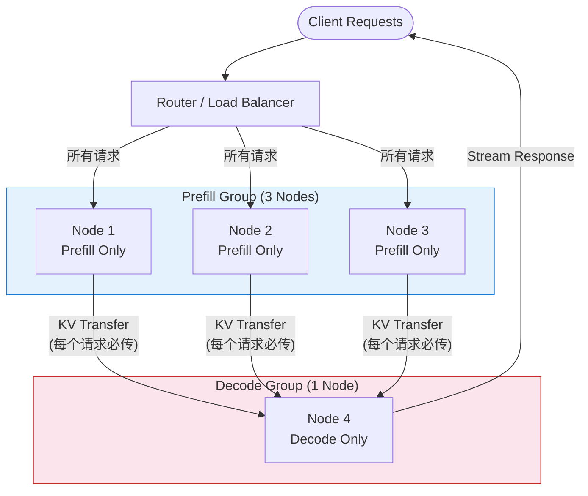
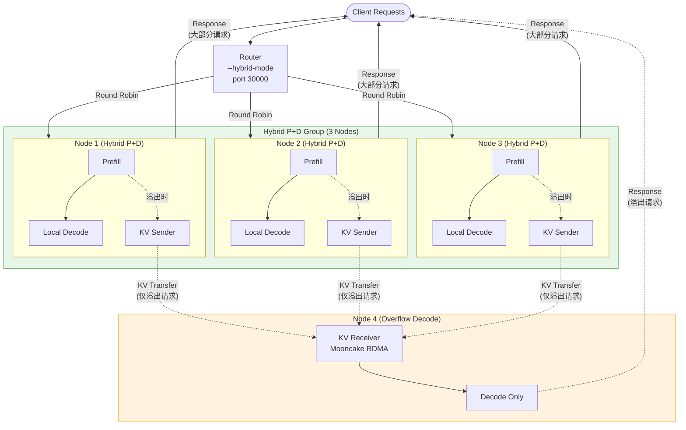
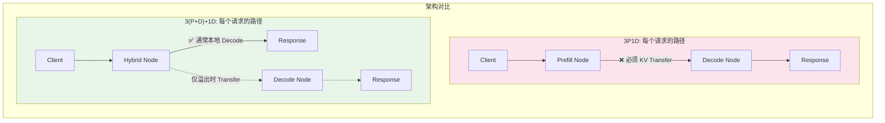
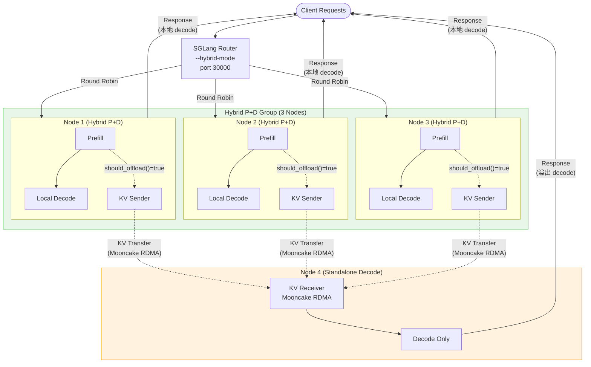
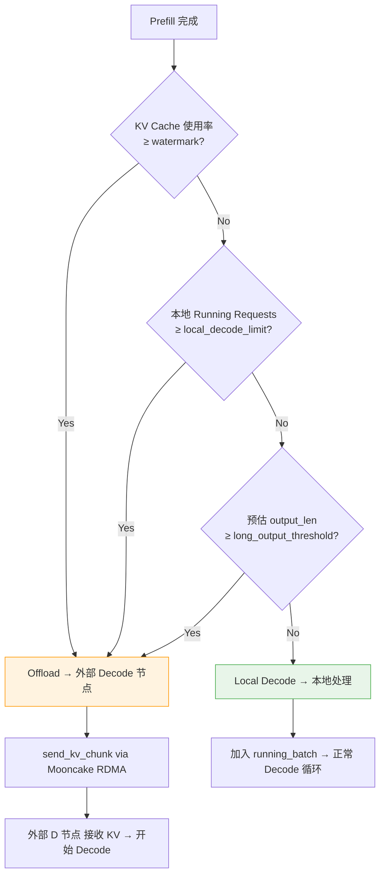
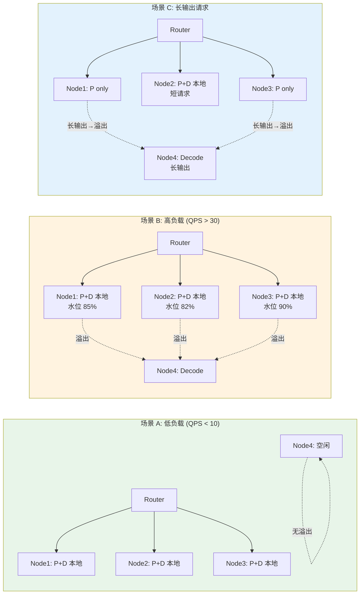

# Hybrid PD 部署指南: 3(P+D) + 1D 架构

## 架构对比: 3P1D 完全分离 vs 3(P+D)+1D 混合模式

### 方案 A: 3P1D 完全 PD 分离



**特点:**
- Prefill 节点只做 prefill，**所有**请求完成后必须 KV Transfer 到 Decode 节点
- Decode 节点承担所有 decode 工作，容易成为瓶颈
- 每个请求都有 KV Transfer 延迟（影响 TTFT）

---

### 方案 B: 3(P+D)+1D 混合模式 (本方案)



**特点:**
- Hybrid 节点本地完成 P+D，**大部分请求零 KV Transfer**
- 仅在资源紧张时溢出到外部 Decode 节点
- Decode 节点仅承担溢出流量，不会成为瓶颈

---

### 对比总结



| 维度 | 3P1D 完全分离 | 3(P+D)+1D 混合模式 |
|------|--------------|-------------------|
| **KV Transfer 频率** | 100% 请求都要传 | 仅溢出请求 (~10-30%) |
| **TTFT 影响** | 每个请求增加 transfer 延迟 | 大部分请求无额外延迟 |
| **Decode 瓶颈** | 单点 Decode 容易满载 | Decode 节点仅处理溢出 |
| **资源利用率** | Prefill 节点 decode 空闲 | 所有节点充分利用 |
| **网络依赖** | 强依赖 RDMA 带宽 | 仅溢出时依赖 |
| **容错性** | Decode 挂 = 全部中断 | Decode 挂 = 仅溢出失败，本地仍可用 |
| **适用场景** | Prefill 远重于 Decode 时 | 通用场景，混合负载 |
| **配置复杂度** | 简单（角色固定） | 需要调优 watermark/limit |

---

## 架构设计图（详细版）



## Offload 决策流程图



## 流量分布场景对比



---

## 部署步骤

### 前置条件

- 4 台机器/Pod（GPU 节点），网络互通
- Mooncake Transfer Engine 已安装（RDMA 或 TCP fallback）
- SGLang 代码（含 hybrid PD 改动）已部署到所有节点

### Step 1: 启动 Standalone Decode 节点 (Node 4)

> **必须先启动 Decode 节点**，因为它需要先注册好 KV Receiver 等待连接。

```bash
# Node 4 (Decode Only)
python -m sglang.launch_server \
    --model-path /path/to/model \
    --disaggregation-mode decode \
    --disaggregation-transfer-backend mooncake \
    --disaggregation-bootstrap-port 8998 \
    --host 0.0.0.0 \
    --port 8000 \
    --tp-size 2 \          # 根据 GPU 数量调整
    --max-running-requests 64 \
    --mem-fraction-static 0.88
```

### Step 2: 启动 3 个 Hybrid P+D 节点 (Node 1/2/3)

```bash
# Node 1 (示例, Node 2/3 相同配置)
python -m sglang.launch_server \
    --model-path /path/to/model \
    --disaggregation-mode hybrid \
    --disaggregation-transfer-backend mooncake \
    --disaggregation-bootstrap-port 8998 \
    --hybrid-external-decode-addresses "http://<NODE4_IP>:8000" \
    --hybrid-offload-watermark 0.8 \
    --hybrid-local-decode-limit 32 \
    --hybrid-long-output-threshold 1024 \
    --host 0.0.0.0 \
    --port 8000 \
    --tp-size 2 \
    --max-running-requests 64 \
    --mem-fraction-static 0.88
```

**参数说明:**

| 参数 | 含义 | 建议值 |
|------|------|--------|
| `--hybrid-offload-watermark` | KV Cache 使用率超过此值时触发溢出 | 0.75~0.85 |
| `--hybrid-local-decode-limit` | 本地最大并发 decode 请求数 | 根据显存调整 |
| `--hybrid-long-output-threshold` | 预期 output > N tokens 时直接溢出 | 1024~4096 |

### Step 3: 启动 Router

```bash
python -m sglang_router.launch_router \
    --hybrid-mode \
    --hybrid-node http://<NODE1_IP>:8000 \
    --hybrid-node http://<NODE2_IP>:8000 \
    --hybrid-node http://<NODE3_IP>:8000 \
    --hybrid-decode http://<NODE4_IP>:8000 \
    --policy round_robin \
    --port 30000
```

---

## 测试方案

### Test 1: 低负载 — 全部本地 Decode

验证正常情况下不触发溢出，所有请求在 Hybrid 节点本地完成。

```bash
# 低并发 + 短输出
python -m sglang.bench_serving \
    --backend sglang \
    --base-url http://localhost:30000 \
    --model /path/to/model \
    --dataset-name random \
    --random-input-len 512 \
    --random-output-len 128 \
    --num-prompts 50 \
    --request-rate 2 \
    --max-concurrency 4

# 预期: TTFT 低 (无 KV transfer), Node4 无流量
```

### Test 2: 高并发 — 触发 Watermark 溢出

用高 QPS 把 KV Cache 打满，验证溢出到 Node4。

```bash
# 高并发 + 中等输出
python -m sglang.bench_serving \
    --backend sglang \
    --base-url http://localhost:30000 \
    --model /path/to/model \
    --dataset-name random \
    --random-input-len 1024 \
    --random-output-len 512 \
    --num-prompts 200 \
    --request-rate inf \
    --max-concurrency 64

# 预期: 部分请求 TTFT 较高 (KV transfer), Node4 有流量
# 监控: 查看 hybrid 节点日志 "Offload triggered by KV watermark"
```

### Test 3: 长输出 — 触发 Output Threshold 溢出

验证长输出请求自动被路由到 Decode 节点。

```bash
# 长输出请求
python -m sglang.bench_serving \
    --backend sglang \
    --base-url http://localhost:30000 \
    --model /path/to/model \
    --dataset-name random \
    --random-input-len 512 \
    --random-output-len 2048 \
    --num-prompts 30 \
    --request-rate 5 \
    --max-concurrency 16

# 预期: 大部分请求被 offload (output_len 2048 > threshold 1024)
# 监控: 日志 "Offload triggered by long output"
```

### Test 4: 混合流量 — 真实场景模拟

```bash
# 混合: 70% 短请求 + 30% 长请求
# 短请求进程
python -m sglang.bench_serving \
    --backend sglang \
    --base-url http://localhost:30000 \
    --model /path/to/model \
    --dataset-name random \
    --random-input-len 256 \
    --random-output-len 128 \
    --num-prompts 70 \
    --request-rate 10 \
    --max-concurrency 32 &

# 长请求进程
python -m sglang.bench_serving \
    --backend sglang \
    --base-url http://localhost:30000 \
    --model /path/to/model \
    --dataset-name random \
    --random-input-len 1024 \
    --random-output-len 4096 \
    --num-prompts 30 \
    --request-rate 3 \
    --max-concurrency 16

# 预期: 短请求本地完成 (低延迟), 长请求 offload (释放本地资源)
```

### 监控指标

```bash
# 查看 Hybrid 节点日志
grep -E "Offload triggered|Hybrid: offloaded" <node_log>

# 查看 Node4 (Decode) 是否收到请求
grep -E "DecodeTransferQueue|KV received" <decode_node_log>

# 实时 KV Cache 使用率
curl http://<NODE_IP>:8000/get_server_info | jq '.kv_cache_usage'
```

---

## 调优建议

| 场景 | 调整方向 |
|------|----------|
| 溢出太频繁 → Decode 节点压力大 | 调高 `watermark` (0.85→0.90) 或 `local_decode_limit` |
| 溢出太少 → Hybrid 节点 ITL 升高 | 调低 `watermark` (0.80→0.70) |
| 长输出请求影响短请求 | 降低 `long_output_threshold` (2048→512) |
| TTFT 因 KV transfer 太高 | 确认 RDMA 网络正常; 考虑增加 `SGLANG_DISAGGREGATION_QUEUE_SIZE` |
| Decode 节点空闲 | Router 可直接分发部分流量到 Decode 节点 |
