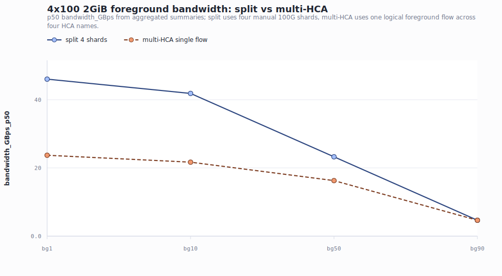
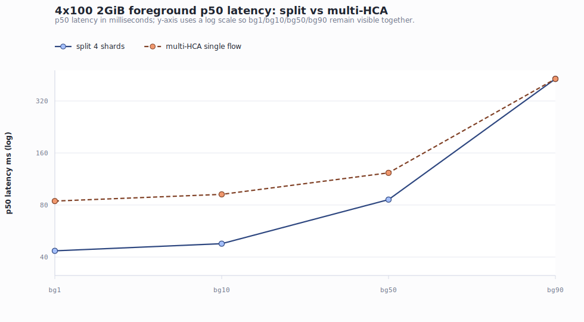
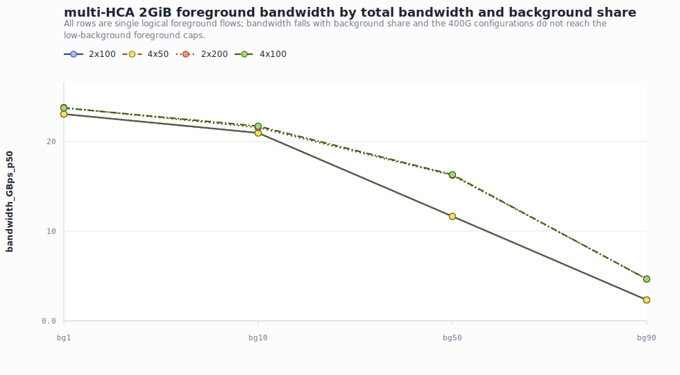
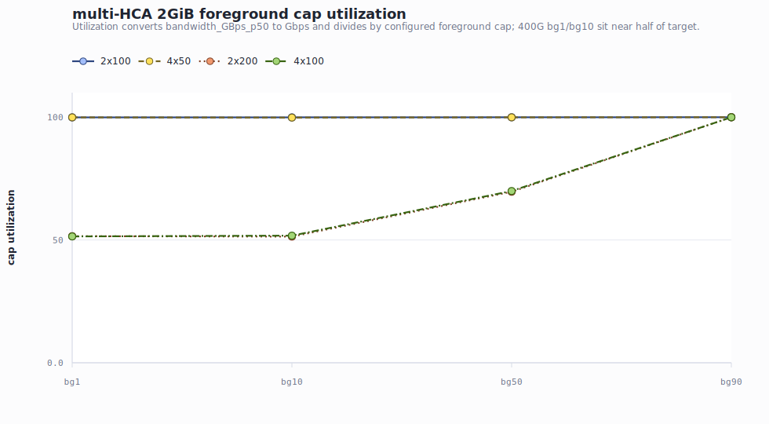

# KV Transfer / Mooncake multi-HCA 不指定均分背景流实验报告

**日期:** 2026-06-25

**数据目录:** `kv_muti_hca_unaverage/`

**报告产物目录:** `docs/superpowers/reports/figures/kv-transfer-multi-hca/`

## Executive Summary

- **multi-HCA 单逻辑流不等价于手动 shard。** 在 4x100 对照中，manual split 的 2GiB p50 带宽在 bg1/bg10/bg50 分别为 46.036、41.847、23.264 GiB/s；multi-HCA 单逻辑流只有 23.720、21.693、16.285 GiB/s。换算成相对 split，multi-HCA 在前三档分别低约 48.5%、48.2%、30.0%；到 bg90 时两者都被 40Gbps 前景 cap 限住，结果收敛。
- **200G 总带宽配置下，multi-HCA 基本贴住限速目标。** 2x100 和 4x50 在 2GiB/bg1-bg90 下的 foreground cap utilization 都约为 99.8%-100.0%，说明当剩余前景带宽不超过约 200Gbps 时，单逻辑流表现稳定。
- **400G 总带宽配置下，multi-HCA 低背景档出现明显上限。** 2x200 和 4x100 在 bg1/bg10 的 2GiB 前景吞吐只约 204/185-186Gbps，只有 396/360Gbps 目标的约 51%-52%；bg50 也只有约 140Gbps，约 70% cap utilization。
- **接收侧 RDMA monitor 没有随本地结果包落地。** driver log 显示每个 run 都设置了 `raw/rdma-rcv-monitor.csv`，但本地 `kv_muti_hca_unaverage/*/raw/` 下没有该文件。因此本报告只能验证限速命令和前景样本结果，不能用接收侧 monitor 实测值证明背景流量到位。

## 实验目的

本次实验比较两种多网卡使用方式在 KV Transfer / Mooncake 背景流竞争下的差异：

1. **manual split:** 手动把一个逻辑传输拆成多条 shard，每条 shard 固定绑定一张 HCA，并按每张网卡的 100Gbps cap 拆分前景/背景限速。
2. **multi-HCA 不指定均分:** 不手动切 shard，只启动一个逻辑前景流，把多个 HCA 名称作为逗号分隔的 `--ib-device` 传给 Mooncake，让 Mooncake 自己在多 HCA 上调度。

报告重点回答两个问题：第一，4x100 下 multi-HCA 单逻辑流是否接近手动均分 split；第二，2x100、4x50、4x100、2x200 在 bg1/bg10/bg50/bg90 背景占比下是否能按前景剩余 cap 扩展。

## 实验方法

### run 命名和配置

`<total>_<hca_count>x<per_hca>_bg<percent>_multi_hca_moonbg` 表示一个 multi-HCA 单逻辑流实验。例如 `400_4x100_bg10_multi_hca_moonbg` 表示总预算 400Gbps、4 张 HCA、背景占比 10%，前景是一个逻辑流，`--ib-device mlx5_bond_0,mlx5_bond_1,mlx5_bond_2,mlx5_bond_3`。

`400_4x100_bg<percent>_cap100_moonbg_split` 表示 4x100 manual split 对照：4 条 shard，每条 shard 固定一张 HCA，每条按 100Gbps cap 拆分背景和前景。

主实验的 multi-HCA 配置为：

| Profile | Total cap | HCA set | 语义 |
|---|---:|---|---|
| `200_2x100` | 200Gbps | `mlx5_bond_0,mlx5_bond_1` | 两张 100G HCA，单逻辑前景流 |
| `200_4x50` | 200Gbps | `mlx5_bond_0,mlx5_bond_1,mlx5_bond_2,mlx5_bond_3` | 四张 HCA，总 cap 仍为 200G |
| `400_4x100` | 400Gbps | `mlx5_bond_0,mlx5_bond_1,mlx5_bond_2,mlx5_bond_3` | 四张 100G HCA，单逻辑前景流 |
| `400_2x200` | 400Gbps | `mlx5_bond_0,mlx5_bond_1` | 两张 HCA，总 cap 400G，单逻辑前景流 |

### 背景比例、size 和限速

每个 profile 跑四组背景占比：`bg1`、`bg10`、`bg50`、`bg90`。前景 size 固定为完整 21 个点：

`1MB, 2MB, 4MB, 8MB, 16MB, 24MB, 32MB, 48MB, 64MB, 96MB, 128MB, 192MB, 256MB, 384MB, 512MB, 768MB, 1GB, 1.25GB, 1.5GB, 1.75GB, 2GB`。

multi-HCA 每组只有一个逻辑前景流和一个逻辑背景流：

```text
background_limit_gbps = total_bandwidth_gbps * bg_percent
foreground_limit_gbps = total_bandwidth_gbps - background_limit_gbps
```

split 对照则把同样比例拆到每条 shard 上，例如 4x100/bg10 下每条 shard 背景 10Gbps、前景 90Gbps。

## 数据完整性

所有 20 个 run 都有 `aggregated-summary.csv`，每个汇总表 21 行，`error_count` 合计为 0。multi-HCA run 每组保留 1 个前景 raw samples 文件，split run 每组保留 4 个前景 raw samples 文件；前景 raw sample 的 `ret` 也没有错误记录。

| Mode | Profile | BG | FG cap Gbps | BG cap Gbps | FG rate-limit | BG rate-limit | Rows | FG samples | Errors | RDMA monitor |
| --- | --- | --- | ---: | ---: | --- | --- | ---: | ---: | ---: | --- |
| multi-HCA single logical flow | 2x100 | bg1 | 198.0 | 2.0 | 198 | 2 | 21 | 420 | 0 | no |
| multi-HCA single logical flow | 2x100 | bg10 | 180.0 | 20.0 | 180 | 20 | 21 | 420 | 0 | no |
| multi-HCA single logical flow | 2x100 | bg50 | 100.0 | 100.0 | 100 | 100 | 21 | 420 | 0 | no |
| multi-HCA single logical flow | 2x100 | bg90 | 20.0 | 180.0 | 20 | 180 | 21 | 420 | 0 | no |
| multi-HCA single logical flow | 4x50 | bg1 | 198.0 | 2.0 | 198 | 2 | 21 | 420 | 0 | no |
| multi-HCA single logical flow | 4x50 | bg10 | 180.0 | 20.0 | 180 | 20 | 21 | 420 | 0 | no |
| multi-HCA single logical flow | 4x50 | bg50 | 100.0 | 100.0 | 100 | 100 | 21 | 420 | 0 | no |
| multi-HCA single logical flow | 4x50 | bg90 | 20.0 | 180.0 | 20 | 180 | 21 | 420 | 0 | no |
| multi-HCA single logical flow | 2x200 | bg1 | 396.0 | 4.0 | 396 | 4 | 21 | 420 | 0 | no |
| multi-HCA single logical flow | 2x200 | bg10 | 360.0 | 40.0 | 360 | 40 | 21 | 420 | 0 | no |
| multi-HCA single logical flow | 2x200 | bg50 | 200.0 | 200.0 | 200 | 200 | 21 | 420 | 0 | no |
| multi-HCA single logical flow | 2x200 | bg90 | 40.0 | 360.0 | 40 | 360 | 21 | 420 | 0 | no |
| multi-HCA single logical flow | 4x100 | bg1 | 396.0 | 4.0 | 396 | 4 | 21 | 420 | 0 | no |
| multi-HCA single logical flow | 4x100 | bg10 | 360.0 | 40.0 | 360 | 40 | 21 | 420 | 0 | no |
| multi-HCA single logical flow | 4x100 | bg50 | 200.0 | 200.0 | 200 | 200 | 21 | 420 | 0 | no |
| multi-HCA single logical flow | 4x100 | bg90 | 40.0 | 360.0 | 40 | 360 | 21 | 420 | 0 | no |
| manual split shards | 4x100 | bg1 | 396.0 | 4.0 | 99 | 1 | 21 | 1680 | 0 | no |
| manual split shards | 4x100 | bg10 | 360.0 | 40.0 | 90 | 10 | 21 | 1680 | 0 | no |
| manual split shards | 4x100 | bg50 | 200.0 | 200.0 | 50 | 50 | 21 | 1680 | 0 | no |
| manual split shards | 4x100 | bg90 | 40.0 | 360.0 | 10 | 90 | 21 | 1680 | 0 | no |

## 关键结果表

下表单元格格式为 `p50/p90/p99 latency ms, bandwidth_GBps_p50 GiB/s`。完整长表在 [key-results-512mib-1gib-2gib.csv](figures/kv-transfer-multi-hca/key-results-512mib-1gib-2gib.csv)。

### multi-HCA 主实验重点 size

| Profile | BG | FG cap Gbps | 512MiB p50/p90/p99, bw | 1GiB p50/p90/p99, bw | 2GiB p50/p90/p99, bw | 2GiB cap util |
| --- | --- | ---: | --- | --- | --- | ---: |
| 2x100 | bg1 | 198.0 | 21.749/21.773/22.153 ms, 22.989 GiB/s | 43.441/43.531/43.772 ms, 23.020 GiB/s | 86.829/86.956/87.332 ms, 23.034 GiB/s | 99.9% |
| 2x100 | bg10 | 180.0 | 23.919/24.040/24.202 ms, 20.904 GiB/s | 47.781/47.819/47.942 ms, 20.929 GiB/s | 95.504/95.534/95.790 ms, 20.942 GiB/s | 99.9% |
| 2x100 | bg50 | 100.0 | 43.008/43.010/43.013 ms, 11.626 GiB/s | 85.959/85.975/86.036 ms, 11.633 GiB/s | 171.863/171.930/171.951 ms, 11.637 GiB/s | 100.0% |
| 2x100 | bg90 | 20.0 | 214.809/214.830/214.836 ms, 2.328 GiB/s | 429.560/429.584/429.627 ms, 2.328 GiB/s | 859.070/859.110/859.121 ms, 2.328 GiB/s | 100.0% |
| 4x50 | bg1 | 198.0 | 21.749/22.016/22.053 ms, 22.989 GiB/s | 43.436/43.456/43.624 ms, 23.022 GiB/s | 86.826/86.860/87.108 ms, 23.035 GiB/s | 99.9% |
| 4x50 | bg10 | 180.0 | 24.031/24.328/24.424 ms, 20.807 GiB/s | 47.870/48.115/48.506 ms, 20.890 GiB/s | 95.589/95.839/95.936 ms, 20.923 GiB/s | 99.8% |
| 4x50 | bg50 | 100.0 | 42.995/43.015/43.090 ms, 11.629 GiB/s | 85.958/86.045/86.110 ms, 11.634 GiB/s | 171.884/171.977/172.091 ms, 11.636 GiB/s | 100.0% |
| 4x50 | bg90 | 20.0 | 214.811/214.821/214.851 ms, 2.328 GiB/s | 429.572/429.696/430.037 ms, 2.328 GiB/s | 859.072/859.088/859.127 ms, 2.328 GiB/s | 100.0% |
| 2x200 | bg1 | 396.0 | 20.986/21.482/22.483 ms, 23.825 GiB/s | 42.171/42.383/42.407 ms, 23.713 GiB/s | 84.159/84.478/84.596 ms, 23.765 GiB/s | 51.5% |
| 2x200 | bg10 | 360.0 | 23.214/23.476/23.775 ms, 21.538 GiB/s | 46.421/46.744/47.722 ms, 21.542 GiB/s | 92.890/93.271/93.405 ms, 21.531 GiB/s | 51.4% |
| 2x200 | bg50 | 200.0 | 33.163/34.939/35.558 ms, 15.077 GiB/s | 64.666/69.583/70.175 ms, 15.464 GiB/s | 123.364/132.763/138.915 ms, 16.212 GiB/s | 69.6% |
| 2x200 | bg90 | 40.0 | 107.435/107.446/107.455 ms, 4.654 GiB/s | 214.813/214.829/214.873 ms, 4.655 GiB/s | 429.564/429.592/429.632 ms, 4.656 GiB/s | 100.0% |
| 4x100 | bg1 | 396.0 | 21.103/21.519/22.635 ms, 23.694 GiB/s | 42.082/42.311/42.355 ms, 23.763 GiB/s | 84.318/84.544/84.940 ms, 23.720 GiB/s | 51.5% |
| 4x100 | bg10 | 360.0 | 22.947/23.223/23.371 ms, 21.789 GiB/s | 46.048/46.274/46.338 ms, 21.716 GiB/s | 92.195/92.624/93.363 ms, 21.693 GiB/s | 51.8% |
| 4x100 | bg50 | 200.0 | 30.666/31.248/31.944 ms, 16.305 GiB/s | 61.403/61.973/62.579 ms, 16.286 GiB/s | 122.811/124.241/124.464 ms, 16.285 GiB/s | 69.9% |
| 4x100 | bg90 | 40.0 | 107.436/107.443/107.458 ms, 4.654 GiB/s | 214.813/214.831/214.872 ms, 4.655 GiB/s | 429.572/429.600/429.645 ms, 4.656 GiB/s | 100.0% |

### 4x100 split vs multi-HCA 重点 size

| BG | Size | manual split p50/p90/p99, bw | multi-HCA p50/p90/p99, bw | multi bw vs split | multi p50 latency vs split |
| --- | --- | --- | --- | ---: | ---: |
| bg1 | 512.00MiB | 10.904/10.906/11.001 ms, 45.856 GiB/s | 21.103/21.519/22.635 ms, 23.694 GiB/s | -48.3% | 93.5% |
| bg1 | 1.00GiB | 21.754/21.776/22.015 ms, 45.969 GiB/s | 42.082/42.311/42.355 ms, 23.763 GiB/s | -48.3% | 93.4% |
| bg1 | 2.00GiB | 43.444/43.465/43.731 ms, 46.036 GiB/s | 84.318/84.544/84.940 ms, 23.720 GiB/s | -48.5% | 94.1% |
| bg10 | 512.00MiB | 11.991/12.024/12.119 ms, 41.700 GiB/s | 22.947/23.223/23.371 ms, 21.789 GiB/s | -47.7% | 91.4% |
| bg10 | 1.00GiB | 23.923/23.995/24.185 ms, 41.801 GiB/s | 46.048/46.274/46.338 ms, 21.716 GiB/s | -48.0% | 92.5% |
| bg10 | 2.00GiB | 47.794/47.906/48.007 ms, 41.847 GiB/s | 92.195/92.624/93.363 ms, 21.693 GiB/s | -48.2% | 92.9% |
| bg50 | 512.00MiB | 21.537/21.557/21.576 ms, 23.216 GiB/s | 30.666/31.248/31.944 ms, 16.305 GiB/s | -29.8% | 42.4% |
| bg50 | 1.00GiB | 43.015/43.049/43.138 ms, 23.248 GiB/s | 61.403/61.973/62.579 ms, 16.286 GiB/s | -29.9% | 42.7% |
| bg50 | 2.00GiB | 85.970/86.062/86.084 ms, 23.264 GiB/s | 122.811/124.241/124.464 ms, 16.285 GiB/s | -30.0% | 42.9% |
| bg90 | 512.00MiB | 107.512/107.551/107.594 ms, 4.651 GiB/s | 107.436/107.443/107.458 ms, 4.654 GiB/s | 0.1% | -0.1% |
| bg90 | 1.00GiB | 214.872/214.967/215.366 ms, 4.654 GiB/s | 214.813/214.831/214.872 ms, 4.655 GiB/s | 0.0% | -0.0% |
| bg90 | 2.00GiB | 429.604/429.644/429.876 ms, 4.655 GiB/s | 429.572/429.600/429.645 ms, 4.656 GiB/s | 0.0% | -0.0% |

## 4x100 split vs multi-HCA 分析



4x100 split 在 bg1/bg10/bg50 下基本贴住前景剩余 cap：2GiB p50 带宽分别是 46.036、41.847、23.264 GiB/s，对应约 395.4、359.5、199.8Gbps。multi-HCA 单逻辑流在同样三个背景档只有 23.720、21.693、16.285 GiB/s，低背景档近似只拿到 split 的一半。



延迟表现与带宽一致：bg1 下 split 的 2GiB p50 latency 是 43.444ms，multi-HCA 是 84.318ms；bg10 是 47.794ms vs 92.195ms；bg50 是 85.970ms vs 122.811ms。bg90 时两者都被前景 40Gbps cap 限住，p50 latency 都约 429.6ms，带宽也都约 4.655 GiB/s。

这个对照说明，multi-HCA 的“传多个 HCA 名称给 Mooncake”在本批数据里不是手动 shard 的替代物。manual split 显式创造了 4 条并行前景 shard，聚合后能吃满 4x100 的剩余前景预算；multi-HCA 仍然是一个逻辑前景流，它的调度和聚合行为没有等价地产生 4 条 shard。

## multi-HCA 主实验趋势



| Profile | BG | FG cap Gbps | p50 ms | p90 ms | p99 ms | bw GiB/s | cap util |
| --- | --- | ---: | ---: | ---: | ---: | ---: | ---: |
| 2x100 | bg1 | 198.0 | 86.829 | 86.956 | 87.332 | 23.034 | 99.9% |
| 2x100 | bg10 | 180.0 | 95.504 | 95.534 | 95.790 | 20.942 | 99.9% |
| 2x100 | bg50 | 100.0 | 171.863 | 171.930 | 171.951 | 11.637 | 100.0% |
| 2x100 | bg90 | 20.0 | 859.070 | 859.110 | 859.121 | 2.328 | 100.0% |
| 4x50 | bg1 | 198.0 | 86.826 | 86.860 | 87.108 | 23.035 | 99.9% |
| 4x50 | bg10 | 180.0 | 95.589 | 95.839 | 95.936 | 20.923 | 99.8% |
| 4x50 | bg50 | 100.0 | 171.884 | 171.977 | 172.091 | 11.636 | 100.0% |
| 4x50 | bg90 | 20.0 | 859.072 | 859.088 | 859.127 | 2.328 | 100.0% |
| 2x200 | bg1 | 396.0 | 84.159 | 84.478 | 84.596 | 23.765 | 51.5% |
| 2x200 | bg10 | 360.0 | 92.890 | 93.271 | 93.405 | 21.531 | 51.4% |
| 2x200 | bg50 | 200.0 | 123.364 | 132.763 | 138.915 | 16.212 | 69.6% |
| 2x200 | bg90 | 40.0 | 429.564 | 429.592 | 429.632 | 4.656 | 100.0% |
| 4x100 | bg1 | 396.0 | 84.318 | 84.544 | 84.940 | 23.720 | 51.5% |
| 4x100 | bg10 | 360.0 | 92.195 | 92.624 | 93.363 | 21.693 | 51.8% |
| 4x100 | bg50 | 200.0 | 122.811 | 124.241 | 124.464 | 16.285 | 69.9% |
| 4x100 | bg90 | 40.0 | 429.572 | 429.600 | 429.645 | 4.656 | 100.0% |



趋势可以分成两类：

- **200G 总带宽组稳定贴 cap。** `200_2x100` 和 `200_4x50` 在 bg1/bg10/bg50/bg90 下，2GiB 带宽分别落在约 23.03、20.93、11.64、2.328 GiB/s，换算后几乎等于 198/180/100/20Gbps 前景 cap。说明 200G 总预算下，不指定均分的 multi-HCA 单逻辑流足以达到限速目标。
- **400G 总带宽组在低背景档受单逻辑流上限影响。** `400_2x200` 和 `400_4x100` 在 bg1/bg10 下都只在约 23.7/21.6 GiB/s，约等于 204/185-186Gbps，而不是 396/360Gbps。bg50 时也只有约 16.2 GiB/s，约 139-140Gbps，不到 200Gbps 前景 cap；bg90 时前景 cap 只有 40Gbps，两个 400G profile 都能贴住。
- **4x50 与 2x100 在 200G 总预算下几乎重合。** 这说明本实验里“更多 HCA 名称”本身没有自动带来超出总前景 cap 的收益；当总 cap 一样且不超过单逻辑流可承载区间时，2 张和 4 张 HCA 的宏观结果接近。
- **2x200 与 4x100 在 multi-HCA 下也几乎重合。** 在 400G 总预算里，两张 200G 和四张 100G 的差异小于 single logical multi-HCA 的调度上限影响。换句话说，瓶颈更像是单逻辑流 multi-HCA 聚合行为，而不是某个具体 HCA 组合。

## RDMA 接收监控验证

driver log 中每个 run 都有创建 `raw/rdma-rcv-monitor.csv` 的命令，监控内容设计为 `ts,dev,rcv_Gbps`。但是当前本地结果目录没有这些 CSV 文件，见 [rdma-monitor-inventory.csv](figures/kv-transfer-multi-hca/rdma-monitor-inventory.csv)。

因此，本报告可以确认两件事：

1. 前景和背景 Mooncake 命令里的 `--rate-limit-gbps` 与实验设计一致，见 [run-manifest.csv](figures/kv-transfer-multi-hca/run-manifest.csv)。
2. 前景 raw samples 与 `aggregated-summary.csv` 均显示传输成功，汇总 error 为 0。

但本报告不能完成“用接收侧 `rdma-rcv-monitor.csv` 实测背景流量是否到位”的验证。若要补齐这一项，需要从实验机器同步每个 run 的 `raw/rdma-rcv-monitor.csv` 和 `raw/rdma-rcv-monitor.err`。

## 明显异常点

异常点明细见 [anomalies.csv](figures/kv-transfer-multi-hca/anomalies.csv)。本批最明显的异常不是错误码，而是 400G multi-HCA 单逻辑流没有贴住低背景档前景 cap：

- `400_2x200_bg1_multi_hca_moonbg`: 2GiB p50 带宽约 23.765 GiB/s，换算约 204.1Gbps，只是 396Gbps 前景 cap 的 51.5%。
- `400_4x100_bg1_multi_hca_moonbg`: 2GiB p50 带宽约 23.720 GiB/s，换算约 203.7Gbps，只是 396Gbps 前景 cap 的 51.5%。
- `400_2x200_bg50_multi_hca_moonbg` 和 `400_4x100_bg50_multi_hca_moonbg`: 2GiB p50 带宽约 16.2 GiB/s，约 139-140Gbps，只达到 200Gbps 前景 cap 的约 70%。

可能原因包括：

1. Mooncake multi-HCA 对单个逻辑 transfer 的内部调度没有像 manual shard 那样并行打满多张 HCA。
2. 单逻辑前景流与单逻辑背景流同时跨 HCA 时，内部路径选择或队列竞争导致 bg50 这种“前景/背景都很重”的档位没有线性平分。
3. 本地缺失接收侧 RDMA monitor，无法确认背景流实际占用是否完全达到命令 cap；这会影响对 bg50 异常的归因强度。

## Caveats

- `bandwidth_GBps_p50` 沿用原始汇总列名。报告中的 GiB/s 文案按原始计算方式解释；换算 cap utilization 时使用 `bandwidth_GBps_p50 * 8.589934592` 转为 Gbps。
- multi-HCA 是 **单逻辑流跨多 HCA 名称**，不是多 shard；本报告不会把 multi-HCA 结果描述成多个 foreground shard 的聚合。
- split 对照只覆盖 4x100；2x100、4x50、2x200 没有对应 manual split 对照。
- 当前本地结果包没有 `raw/rdma-rcv-monitor.csv`，所以背景流“实测到位”未完成验证；只验证了命令限速设置和前景样本结果。
- 每组 20 次 repeat，报告重点看 p50/p90/p99；若要判断自然调度稳定性，建议追加多次独立 run 或不同 start offset。

## 简短结论

在这批结果里，multi-HCA 不指定均分 **弱于** 4x100 手动均分 split，尤其在 bg1/bg10/bg50 这类前景剩余带宽较高的档位；它没有表现出等价于 4 条手动 shard 的聚合能力。multi-HCA 在 200G 总带宽配置下能稳定贴住前景 cap，在 400G 总带宽配置下低背景档接近约 200Gbps 上限，bg50 约 140Gbps，只有 bg90 这种前景 cap 很低的场景与 split 收敛。

因此，如果目标是可预测地吃满 4x100 的前景剩余带宽，当前数据支持继续使用 manual split；如果目标是简化配置且前景需求不超过约 200Gbps，multi-HCA 单逻辑流是可用的。

## 产物索引

- [run-manifest.csv](figures/kv-transfer-multi-hca/run-manifest.csv)
- [all-aggregated-summary-with-metadata.csv](figures/kv-transfer-multi-hca/all-aggregated-summary-with-metadata.csv)
- [key-results-512mib-1gib-2gib.csv](figures/kv-transfer-multi-hca/key-results-512mib-1gib-2gib.csv)
- [compare-4x100-split-vs-multi-hca.csv](figures/kv-transfer-multi-hca/compare-4x100-split-vs-multi-hca.csv)
- [multi-hca-2gib-trends.csv](figures/kv-transfer-multi-hca/multi-hca-2gib-trends.csv)
- [rdma-monitor-inventory.csv](figures/kv-transfer-multi-hca/rdma-monitor-inventory.csv)
- [anomalies.csv](figures/kv-transfer-multi-hca/anomalies.csv)
- [chart-map.csv](figures/kv-transfer-multi-hca/chart-map.csv)
- [compare-4x100-2gib-bandwidth.svg](figures/kv-transfer-multi-hca/compare-4x100-2gib-bandwidth.svg)
- [compare-4x100-2gib-latency.svg](figures/kv-transfer-multi-hca/compare-4x100-2gib-latency.svg)
- [multi-hca-2gib-bandwidth.svg](figures/kv-transfer-multi-hca/multi-hca-2gib-bandwidth.svg)
- [multi-hca-2gib-cap-utilization.svg](figures/kv-transfer-multi-hca/multi-hca-2gib-cap-utilization.svg)
