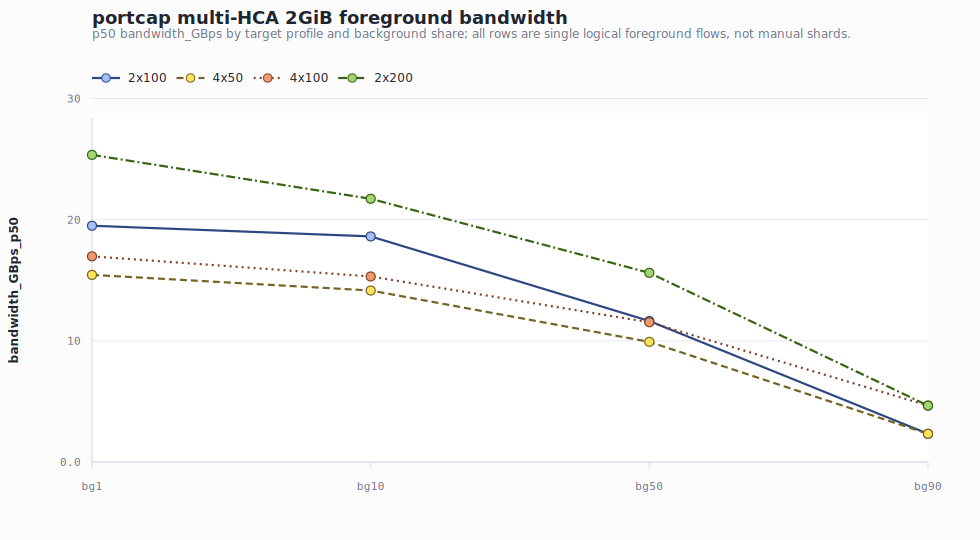
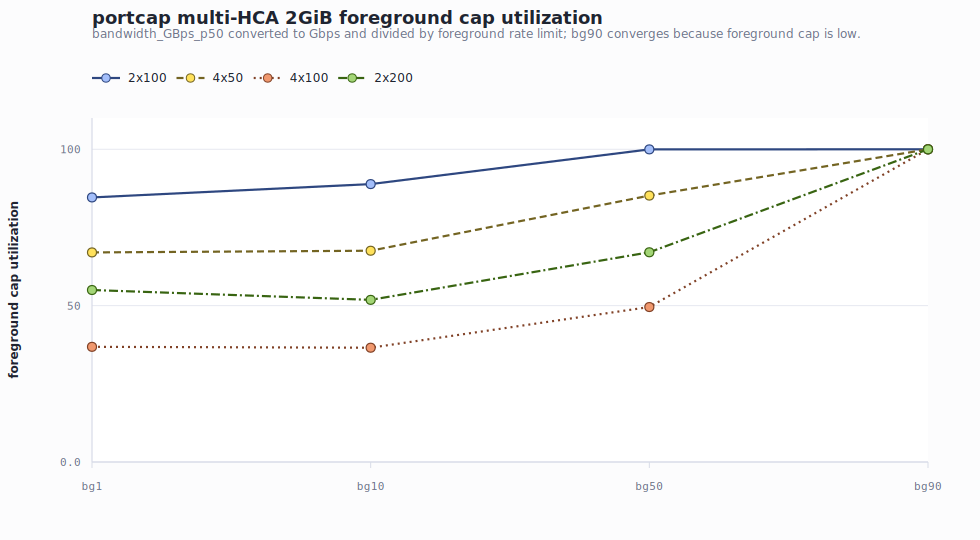
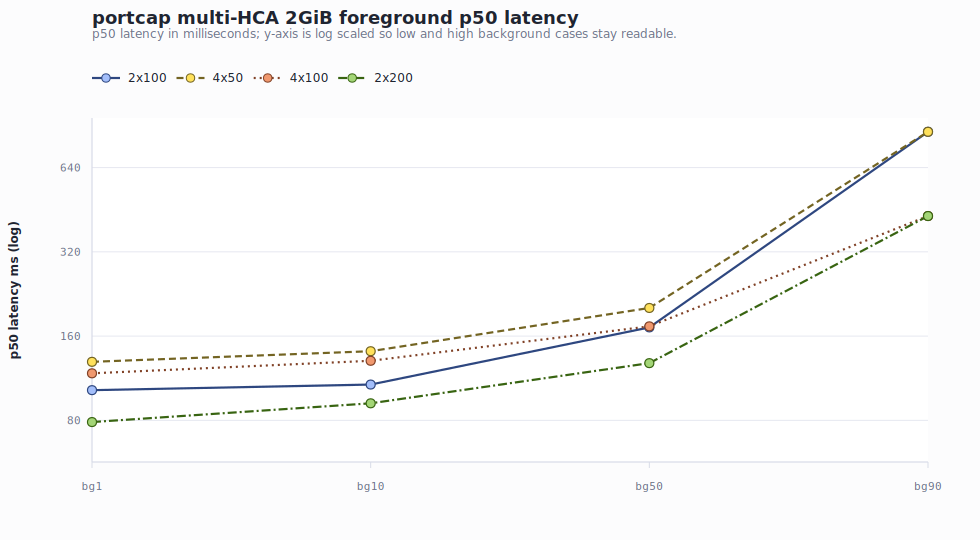
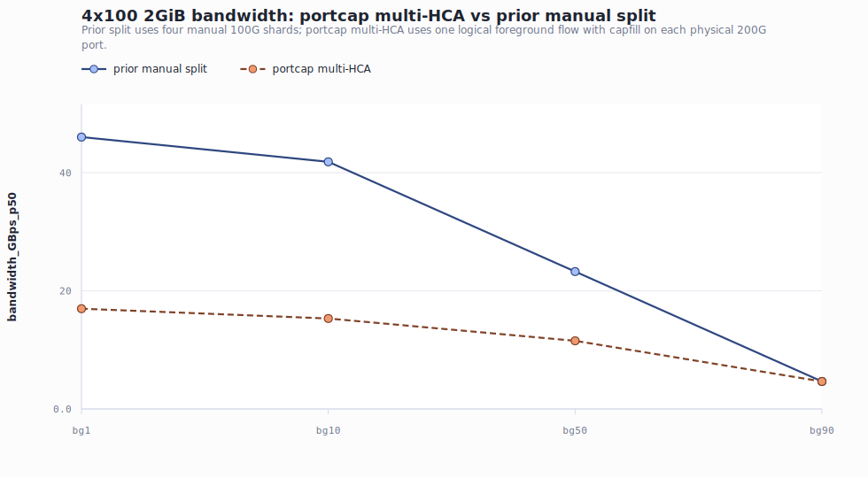

# KV Transfer / Mooncake multi-HCA portcap 实验报告

**日期:** 2026-06-25

**数据目录:** `kv_portcap_multi_hca/`

**报告产物目录:** `docs/superpowers/reports/figures/kv-transfer-multi-hca-portcap/`

## Executive Summary

- **portcap/capfill 后，multi-HCA 单逻辑流仍然不是手动 shard 的替代物。** 4x100/bg1 的 2GiB p50 带宽只有 16.978 GiB/s，约 145.8Gbps；此前 4x100 manual split 对照是 46.036 GiB/s，约 395.4Gbps。bg10/bg50 也分别低 63.4% 和 50.4%，只有 bg90 因前景 cap 只有 40Gbps 而收敛。
- **capfill 让“每端口容量限制”的效果显性化，但也进一步暴露 single logical flow 的带宽利用问题。** 2x100 在 bg1/bg10 只能达到前景 cap 的 84.6%/88.9%；4x50 在 bg1/bg10/bg50 只有 67.0%/67.6%/85.2%；4x100 在 bg1/bg10/bg50 只有 36.8%/36.5%/49.6%。
- **2x200 是本轮 portcap 中表现最好的高带宽配置，但仍未接近 400G 目标。** 2x200/bg1 的 2GiB p50 带宽为 25.353 GiB/s，约 217.8Gbps，只达到 396Gbps 前景 cap 的 55.0%；bg10 为 51.8%，bg50 为 67.1%，bg90 才贴住 40Gbps cap。
- **本地结果包缺少实际 `rdma-rcv-monitor.csv`。** driver log 显示每组都创建了 monitor 输出，但同步到本地的 raw 目录没有该 CSV；因此本报告用 driver/raw logs 验证 capfill/background/foreground 的命令限速与 HCA 拓扑发现，不能用接收侧 monitor 实测值证明流量完全到位。

## 实验目的

本次实验验证 KV Transfer / Mooncake 在 **不手动 shard** 时，一个逻辑 foreground transfer flow 使用多个 HCA 的实际表现。重点是：

1. multi-HCA 单逻辑流是否能在多网卡上有效使用带宽；
2. 在 2x100、4x50、4x100、2x200 和 bg1/bg10/bg50/bg90 下，前景 KV transfer 的 latency/bandwidth 如何变化；
3. 与此前 4x100 manual split shard 对照相比，multi-HCA 不指定均分是否仍有差距。

## 方法：portcap/capfill 如何模拟每端口限制

物理上每张 `mlx5_bond_*` 按 200Gbps 能力理解。为了模拟目标配置里的 per-port cap，脚本先在每张物理端口上启动一个 capfill Mooncake 背景流，占用掉多余容量：

| Profile | Physical port assumption | capfill per port | Simulated remaining capacity |
|---|---:|---:|---:|
| `2x100` | 2 x 200Gbps | 100Gbps | 2 x 100Gbps |
| `4x50` | 4 x 200Gbps | 150Gbps | 4 x 50Gbps |
| `4x100` | 4 x 200Gbps | 100Gbps | 4 x 100Gbps |
| `2x200` | 2 x 200Gbps | 0Gbps | 2 x 200Gbps |

每组实验随后启动一个 background multi-HCA flow 和一个 foreground multi-HCA flow。二者都用逗号分隔的 `--ib-device`，例如 4x100 使用 `mlx5_bond_0,mlx5_bond_1,mlx5_bond_2,mlx5_bond_3`。foreground **仍然是一个逻辑流**，没有把 2GB 逻辑数据手动拆成多个 shard。

背景比例 `bg1/bg10/bg50/bg90` 按目标总带宽计算：

```text
background_limit_gbps = total_target_gbps * bg_percent
foreground_limit_gbps = total_target_gbps - background_limit_gbps
```

前景完整跑 21 个 size：`1MB,2MB,4MB,8MB,16MB,24MB,32MB,48MB,64MB,96MB,128MB,192MB,256MB,384MB,512MB,768MB,1GB,1.25GB,1.5GB,1.75GB,2GB`。

## 数据完整性与命令验证

所有 16 个 run 都有 `aggregated-summary.csv`，每个 21 行，汇总 `error_count=0`。每组有一个 foreground samples 文件，样本数为 420，raw sample 的 `ret` 没有错误。capfill/background/foreground 的限速命令从 `multi-hca-portcap-bg.log` 解析；raw log 也显示 capfill flow 发现 1 个 HCA，background/foreground flow 发现对应的 2 或 4 个 HCA。

| Profile | BG | capfill/port Gbps | capfill total Gbps | BG cap Gbps | FG cap Gbps | capfill rate-limit | BG rate-limit | FG rate-limit | Rows | FG samples | Errors | local monitor CSV |
| --- | --- | ---: | ---: | ---: | ---: | --- | --- | --- | ---: | ---: | ---: | --- |
| 2x100 | bg1 | 100.0 | 200.0 | 2.0 | 198.0 | 100 | 2 | 198 | 21 | 420 | 0 | no |
| 2x100 | bg10 | 100.0 | 200.0 | 20.0 | 180.0 | 100 | 20 | 180 | 21 | 420 | 0 | no |
| 2x100 | bg50 | 100.0 | 200.0 | 100.0 | 100.0 | 100 | 100 | 100 | 21 | 420 | 0 | no |
| 2x100 | bg90 | 100.0 | 200.0 | 180.0 | 20.0 | 100 | 180 | 20 | 21 | 420 | 0 | no |
| 4x50 | bg1 | 150.0 | 600.0 | 2.0 | 198.0 | 150 | 2 | 198 | 21 | 420 | 0 | no |
| 4x50 | bg10 | 150.0 | 600.0 | 20.0 | 180.0 | 150 | 20 | 180 | 21 | 420 | 0 | no |
| 4x50 | bg50 | 150.0 | 600.0 | 100.0 | 100.0 | 150 | 100 | 100 | 21 | 420 | 0 | no |
| 4x50 | bg90 | 150.0 | 600.0 | 180.0 | 20.0 | 150 | 180 | 20 | 21 | 420 | 0 | no |
| 4x100 | bg1 | 100.0 | 400.0 | 4.0 | 396.0 | 100 | 4 | 396 | 21 | 420 | 0 | no |
| 4x100 | bg10 | 100.0 | 400.0 | 40.0 | 360.0 | 100 | 40 | 360 | 21 | 420 | 0 | no |
| 4x100 | bg50 | 100.0 | 400.0 | 200.0 | 200.0 | 100 | 200 | 200 | 21 | 420 | 0 | no |
| 4x100 | bg90 | 100.0 | 400.0 | 360.0 | 40.0 | 100 | 360 | 40 | 21 | 420 | 0 | no |
| 2x200 | bg1 | 0.0 | 0.0 | 4.0 | 396.0 | none | 4 | 396 | 21 | 420 | 0 | no |
| 2x200 | bg10 | 0.0 | 0.0 | 40.0 | 360.0 | none | 40 | 360 | 21 | 420 | 0 | no |
| 2x200 | bg50 | 0.0 | 0.0 | 200.0 | 200.0 | none | 200 | 200 | 21 | 420 | 0 | no |
| 2x200 | bg90 | 0.0 | 0.0 | 360.0 | 40.0 | none | 360 | 40 | 21 | 420 | 0 | no |

## 逐实验结果与计算带宽

下面按 16 个实验逐个展开，不再把所有结果挤在一张总表里。报告正文展示 512MiB、1GiB、2GiB 三个关键 size；完整 21 个 size 的逐实验计算结果见 [per-experiment-calculated-bandwidth.csv](figures/kv-transfer-multi-hca-portcap/per-experiment-calculated-bandwidth.csv)，关键 size 长表见 [key-results-512mib-1gib-2gib.csv](figures/kv-transfer-multi-hca-portcap/key-results-512mib-1gib-2gib.csv)。

计算带宽统一按 p50 latency 反推：

```text
calculated_bandwidth_GiBps = size_GiB / (latency_ms_p50 / 1000)
calculated_bandwidth_Gbps = calculated_bandwidth_GiBps * 8.589934592
cap_utilization = calculated_bandwidth_Gbps / foreground_limit_gbps
```

### 1. 200_2x100_bg1_multi_hca_portcap_moonbg

**配置。** profile=2x100，total target=200Gbps，background=bg1 (1%)，capfill=每端口 100.0Gbps，总计 200.0Gbps，background cap=2.0Gbps，foreground cap=198.0Gbps。本实验是一个 `shard_count=1` 的逻辑 foreground flow，不是手动 shard 拆分。

**计算带宽。** 2GiB 的 p50 latency 是 102.562ms，因此计算带宽是 19.500GiB/s (167.5Gbps)，相当于 foreground cap 的 84.6%。2GiB 比配置的 foreground cap 低约 30.5Gbps。

| Size | p50/p90/p99 延迟 ms | 计算带宽 GiB/s | 计算带宽 Gbps | 前景 cap Gbps | cap 利用率 |
| --- | --- | ---: | ---: | ---: | ---: |
| 512.00MiB | 25.509/25.978/27.080 | 19.601 | 168.4 | 198.0 | 85.0% |
| 1.00GiB | 50.688/51.064/51.272 | 19.729 | 169.5 | 198.0 | 85.6% |
| 2.00GiB | 102.562/103.184/103.556 | 19.500 | 167.5 | 198.0 | 84.6% |

**验证备注。** aggregated rows=21，foreground samples=420，aggregate errors=0，monitor=本地缺少 rdma-rcv-monitor.csv；这里只能用 driver/raw logs 验证命令配置。

### 2. 200_2x100_bg10_multi_hca_portcap_moonbg

**配置。** profile=2x100，total target=200Gbps，background=bg10 (10%)，capfill=每端口 100.0Gbps，总计 200.0Gbps，background cap=20.0Gbps，foreground cap=180.0Gbps。本实验是一个 `shard_count=1` 的逻辑 foreground flow，不是手动 shard 拆分。

**计算带宽。** 2GiB 的 p50 latency 是 107.403ms，因此计算带宽是 18.622GiB/s (160.0Gbps)，相当于 foreground cap 的 88.9%。2GiB 比配置的 foreground cap 低约 20.0Gbps。

| Size | p50/p90/p99 延迟 ms | 计算带宽 GiB/s | 计算带宽 Gbps | 前景 cap Gbps | cap 利用率 |
| --- | --- | ---: | ---: | ---: | ---: |
| 512.00MiB | 26.847/26.931/27.100 | 18.624 | 160.0 | 180.0 | 88.9% |
| 1.00GiB | 53.674/54.807/55.942 | 18.631 | 160.0 | 180.0 | 88.9% |
| 2.00GiB | 107.403/107.459/107.545 | 18.622 | 160.0 | 180.0 | 88.9% |

**验证备注。** aggregated rows=21，foreground samples=420，aggregate errors=0，monitor=本地缺少 rdma-rcv-monitor.csv；这里只能用 driver/raw logs 验证命令配置。

### 3. 200_2x100_bg50_multi_hca_portcap_moonbg

**配置。** profile=2x100，total target=200Gbps，background=bg50 (50%)，capfill=每端口 100.0Gbps，总计 200.0Gbps，background cap=100.0Gbps，foreground cap=100.0Gbps。本实验是一个 `shard_count=1` 的逻辑 foreground flow，不是手动 shard 拆分。

**计算带宽。** 2GiB 的 p50 latency 是 171.857ms，因此计算带宽是 11.638GiB/s (100.0Gbps)，相当于 foreground cap 的 100.0%。2GiB 基本贴住配置的 foreground cap。

| Size | p50/p90/p99 延迟 ms | 计算带宽 GiB/s | 计算带宽 Gbps | 前景 cap Gbps | cap 利用率 |
| --- | --- | ---: | ---: | ---: | ---: |
| 512.00MiB | 43.008/43.082/43.224 | 11.626 | 99.9 | 100.0 | 99.9% |
| 1.00GiB | 85.960/86.177/86.420 | 11.633 | 99.9 | 100.0 | 99.9% |
| 2.00GiB | 171.857/171.897/172.139 | 11.638 | 100.0 | 100.0 | 100.0% |

**验证备注。** aggregated rows=21，foreground samples=420，aggregate errors=0，monitor=本地缺少 rdma-rcv-monitor.csv；这里只能用 driver/raw logs 验证命令配置。

### 4. 200_2x100_bg90_multi_hca_portcap_moonbg

**配置。** profile=2x100，total target=200Gbps，background=bg90 (90%)，capfill=每端口 100.0Gbps，总计 200.0Gbps，background cap=180.0Gbps，foreground cap=20.0Gbps。本实验是一个 `shard_count=1` 的逻辑 foreground flow，不是手动 shard 拆分。

**计算带宽。** 2GiB 的 p50 latency 是 859.067ms，因此计算带宽是 2.328GiB/s (20.0Gbps)，相当于 foreground cap 的 100.0%。2GiB 基本贴住配置的 foreground cap。

| Size | p50/p90/p99 延迟 ms | 计算带宽 GiB/s | 计算带宽 Gbps | 前景 cap Gbps | cap 利用率 |
| --- | --- | ---: | ---: | ---: | ---: |
| 512.00MiB | 214.824/214.889/214.916 | 2.327 | 20.0 | 20.0 | 100.0% |
| 1.00GiB | 429.576/429.590/429.677 | 2.328 | 20.0 | 20.0 | 100.0% |
| 2.00GiB | 859.067/859.078/859.126 | 2.328 | 20.0 | 20.0 | 100.0% |

**验证备注。** aggregated rows=21，foreground samples=420，aggregate errors=0，monitor=本地缺少 rdma-rcv-monitor.csv；这里只能用 driver/raw logs 验证命令配置。

### 5. 200_4x50_bg1_multi_hca_portcap_moonbg

**配置。** profile=4x50，total target=200Gbps，background=bg1 (1%)，capfill=每端口 150.0Gbps，总计 600.0Gbps，background cap=2.0Gbps，foreground cap=198.0Gbps。本实验是一个 `shard_count=1` 的逻辑 foreground flow，不是手动 shard 拆分。

**计算带宽。** 2GiB 的 p50 latency 是 129.470ms，因此计算带宽是 15.448GiB/s (132.7Gbps)，相当于 foreground cap 的 67.0%。2GiB 比配置的 foreground cap 低约 65.3Gbps。

| Size | p50/p90/p99 延迟 ms | 计算带宽 GiB/s | 计算带宽 Gbps | 前景 cap Gbps | cap 利用率 |
| --- | --- | ---: | ---: | ---: | ---: |
| 512.00MiB | 32.317/33.022/33.108 | 15.472 | 132.9 | 198.0 | 67.1% |
| 1.00GiB | 64.596/65.334/65.455 | 15.481 | 133.0 | 198.0 | 67.2% |
| 2.00GiB | 129.470/130.115/130.850 | 15.448 | 132.7 | 198.0 | 67.0% |

**验证备注。** aggregated rows=21，foreground samples=420，aggregate errors=0，monitor=本地缺少 rdma-rcv-monitor.csv；这里只能用 driver/raw logs 验证命令配置。

### 6. 200_4x50_bg10_multi_hca_portcap_moonbg

**配置。** profile=4x50，total target=200Gbps，background=bg10 (10%)，capfill=每端口 150.0Gbps，总计 600.0Gbps，background cap=20.0Gbps，foreground cap=180.0Gbps。本实验是一个 `shard_count=1` 的逻辑 foreground flow，不是手动 shard 拆分。

**计算带宽。** 2GiB 的 p50 latency 是 141.281ms，因此计算带宽是 14.156GiB/s (121.6Gbps)，相当于 foreground cap 的 67.6%。2GiB 比配置的 foreground cap 低约 58.4Gbps。

| Size | p50/p90/p99 延迟 ms | 计算带宽 GiB/s | 计算带宽 Gbps | 前景 cap Gbps | cap 利用率 |
| --- | --- | ---: | ---: | ---: | ---: |
| 512.00MiB | 35.610/36.320/36.436 | 14.041 | 120.6 | 180.0 | 67.0% |
| 1.00GiB | 70.910/72.042/72.133 | 14.102 | 121.1 | 180.0 | 67.3% |
| 2.00GiB | 141.281/143.431/144.030 | 14.156 | 121.6 | 180.0 | 67.6% |

**验证备注。** aggregated rows=21，foreground samples=420，aggregate errors=0，monitor=本地缺少 rdma-rcv-monitor.csv；这里只能用 driver/raw logs 验证命令配置。

### 7. 200_4x50_bg50_multi_hca_portcap_moonbg

**配置。** profile=4x50，total target=200Gbps，background=bg50 (50%)，capfill=每端口 150.0Gbps，总计 600.0Gbps，background cap=100.0Gbps，foreground cap=100.0Gbps。本实验是一个 `shard_count=1` 的逻辑 foreground flow，不是手动 shard 拆分。

**计算带宽。** 2GiB 的 p50 latency 是 201.658ms，因此计算带宽是 9.918GiB/s (85.2Gbps)，相当于 foreground cap 的 85.2%。2GiB 比配置的 foreground cap 低约 14.8Gbps。

| Size | p50/p90/p99 延迟 ms | 计算带宽 GiB/s | 计算带宽 Gbps | 前景 cap Gbps | cap 利用率 |
| --- | --- | ---: | ---: | ---: | ---: |
| 512.00MiB | 50.533/53.049/53.127 | 9.894 | 85.0 | 100.0 | 85.0% |
| 1.00GiB | 101.872/103.717/104.256 | 9.816 | 84.3 | 100.0 | 84.3% |
| 2.00GiB | 201.658/205.154/206.567 | 9.918 | 85.2 | 100.0 | 85.2% |

**验证备注。** aggregated rows=21，foreground samples=420，aggregate errors=0，monitor=本地缺少 rdma-rcv-monitor.csv；这里只能用 driver/raw logs 验证命令配置。

### 8. 200_4x50_bg90_multi_hca_portcap_moonbg

**配置。** profile=4x50，total target=200Gbps，background=bg90 (90%)，capfill=每端口 150.0Gbps，总计 600.0Gbps，background cap=180.0Gbps，foreground cap=20.0Gbps。本实验是一个 `shard_count=1` 的逻辑 foreground flow，不是手动 shard 拆分。

**计算带宽。** 2GiB 的 p50 latency 是 859.072ms，因此计算带宽是 2.328GiB/s (20.0Gbps)，相当于 foreground cap 的 100.0%。2GiB 基本贴住配置的 foreground cap。

| Size | p50/p90/p99 延迟 ms | 计算带宽 GiB/s | 计算带宽 Gbps | 前景 cap Gbps | cap 利用率 |
| --- | --- | ---: | ---: | ---: | ---: |
| 512.00MiB | 214.813/214.844/214.889 | 2.328 | 20.0 | 20.0 | 100.0% |
| 1.00GiB | 429.577/429.586/429.633 | 2.328 | 20.0 | 20.0 | 100.0% |
| 2.00GiB | 859.072/859.079/859.127 | 2.328 | 20.0 | 20.0 | 100.0% |

**验证备注。** aggregated rows=21，foreground samples=420，aggregate errors=0，monitor=本地缺少 rdma-rcv-monitor.csv；这里只能用 driver/raw logs 验证命令配置。

### 9. 400_4x100_bg1_multi_hca_portcap_moonbg

**配置。** profile=4x100，total target=400Gbps，background=bg1 (1%)，capfill=每端口 100.0Gbps，总计 400.0Gbps，background cap=4.0Gbps，foreground cap=396.0Gbps。本实验是一个 `shard_count=1` 的逻辑 foreground flow，不是手动 shard 拆分。

**计算带宽。** 2GiB 的 p50 latency 是 117.800ms，因此计算带宽是 16.978GiB/s (145.8Gbps)，相当于 foreground cap 的 36.8%。2GiB 比配置的 foreground cap 低约 250.2Gbps。

| Size | p50/p90/p99 延迟 ms | 计算带宽 GiB/s | 计算带宽 Gbps | 前景 cap Gbps | cap 利用率 |
| --- | --- | ---: | ---: | ---: | ---: |
| 512.00MiB | 29.353/29.958/30.300 | 17.034 | 146.3 | 396.0 | 36.9% |
| 1.00GiB | 58.868/59.371/59.818 | 16.987 | 145.9 | 396.0 | 36.8% |
| 2.00GiB | 117.800/118.777/119.472 | 16.978 | 145.8 | 396.0 | 36.8% |

**验证备注。** aggregated rows=21，foreground samples=420，aggregate errors=0，monitor=本地缺少 rdma-rcv-monitor.csv；这里只能用 driver/raw logs 验证命令配置。

### 10. 400_4x100_bg10_multi_hca_portcap_moonbg

**配置。** profile=4x100，total target=400Gbps，background=bg10 (10%)，capfill=每端口 100.0Gbps，总计 400.0Gbps，background cap=40.0Gbps，foreground cap=360.0Gbps。本实验是一个 `shard_count=1` 的逻辑 foreground flow，不是手动 shard 拆分。

**计算带宽。** 2GiB 的 p50 latency 是 130.582ms，因此计算带宽是 15.316GiB/s (131.6Gbps)，相当于 foreground cap 的 36.5%。2GiB 比配置的 foreground cap 低约 228.4Gbps。

| Size | p50/p90/p99 延迟 ms | 计算带宽 GiB/s | 计算带宽 Gbps | 前景 cap Gbps | cap 利用率 |
| --- | --- | ---: | ---: | ---: | ---: |
| 512.00MiB | 32.278/32.595/32.734 | 15.491 | 133.1 | 360.0 | 37.0% |
| 1.00GiB | 66.002/67.303/68.190 | 15.151 | 130.1 | 360.0 | 36.2% |
| 2.00GiB | 130.582/131.750/132.440 | 15.316 | 131.6 | 360.0 | 36.5% |

**验证备注。** aggregated rows=21，foreground samples=420，aggregate errors=0，monitor=本地缺少 rdma-rcv-monitor.csv；这里只能用 driver/raw logs 验证命令配置。

### 11. 400_4x100_bg50_multi_hca_portcap_moonbg

**配置。** profile=4x100，total target=400Gbps，background=bg50 (50%)，capfill=每端口 100.0Gbps，总计 400.0Gbps，background cap=200.0Gbps，foreground cap=200.0Gbps。本实验是一个 `shard_count=1` 的逻辑 foreground flow，不是手动 shard 拆分。

**计算带宽。** 2GiB 的 p50 latency 是 173.347ms，因此计算带宽是 11.538GiB/s (99.1Gbps)，相当于 foreground cap 的 49.6%。2GiB 比配置的 foreground cap 低约 100.9Gbps。

| Size | p50/p90/p99 延迟 ms | 计算带宽 GiB/s | 计算带宽 Gbps | 前景 cap Gbps | cap 利用率 |
| --- | --- | ---: | ---: | ---: | ---: |
| 512.00MiB | 44.444/46.357/46.658 | 11.250 | 96.6 | 200.0 | 48.3% |
| 1.00GiB | 88.733/91.244/92.507 | 11.270 | 96.8 | 200.0 | 48.4% |
| 2.00GiB | 173.347/174.564/175.112 | 11.538 | 99.1 | 200.0 | 49.6% |

**验证备注。** aggregated rows=21，foreground samples=420，aggregate errors=0，monitor=本地缺少 rdma-rcv-monitor.csv；这里只能用 driver/raw logs 验证命令配置。

### 12. 400_4x100_bg90_multi_hca_portcap_moonbg

**配置。** profile=4x100，total target=400Gbps，background=bg90 (90%)，capfill=每端口 100.0Gbps，总计 400.0Gbps，background cap=360.0Gbps，foreground cap=40.0Gbps。本实验是一个 `shard_count=1` 的逻辑 foreground flow，不是手动 shard 拆分。

**计算带宽。** 2GiB 的 p50 latency 是 429.575ms，因此计算带宽是 4.656GiB/s (40.0Gbps)，相当于 foreground cap 的 100.0%。2GiB 基本贴住配置的 foreground cap。

| Size | p50/p90/p99 延迟 ms | 计算带宽 GiB/s | 计算带宽 Gbps | 前景 cap Gbps | cap 利用率 |
| --- | --- | ---: | ---: | ---: | ---: |
| 512.00MiB | 107.434/107.450/107.528 | 4.654 | 40.0 | 40.0 | 99.9% |
| 1.00GiB | 214.812/214.859/214.889 | 4.655 | 40.0 | 40.0 | 100.0% |
| 2.00GiB | 429.575/429.588/429.634 | 4.656 | 40.0 | 40.0 | 100.0% |

**验证备注。** aggregated rows=21，foreground samples=420，aggregate errors=0，monitor=本地缺少 rdma-rcv-monitor.csv；这里只能用 driver/raw logs 验证命令配置。

### 13. 400_2x200_bg1_multi_hca_portcap_moonbg

**配置。** profile=2x200，total target=400Gbps，background=bg1 (1%)，capfill=无，background cap=4.0Gbps，foreground cap=396.0Gbps。本实验是一个 `shard_count=1` 的逻辑 foreground flow，不是手动 shard 拆分。

**计算带宽。** 2GiB 的 p50 latency 是 78.886ms，因此计算带宽是 25.353GiB/s (217.8Gbps)，相当于 foreground cap 的 55.0%。2GiB 比配置的 foreground cap 低约 178.2Gbps。

| Size | p50/p90/p99 延迟 ms | 计算带宽 GiB/s | 计算带宽 Gbps | 前景 cap Gbps | cap 利用率 |
| --- | --- | ---: | ---: | ---: | ---: |
| 512.00MiB | 19.717/20.046/20.121 | 25.359 | 217.8 | 396.0 | 55.0% |
| 1.00GiB | 39.489/39.711/39.971 | 25.323 | 217.5 | 396.0 | 54.9% |
| 2.00GiB | 78.886/79.311/79.775 | 25.353 | 217.8 | 396.0 | 55.0% |

**验证备注。** aggregated rows=21，foreground samples=420，aggregate errors=0，monitor=本地缺少 rdma-rcv-monitor.csv；这里只能用 driver/raw logs 验证命令配置。

### 14. 400_2x200_bg10_multi_hca_portcap_moonbg

**配置。** profile=2x200，total target=400Gbps，background=bg10 (10%)，capfill=无，background cap=40.0Gbps，foreground cap=360.0Gbps。本实验是一个 `shard_count=1` 的逻辑 foreground flow，不是手动 shard 拆分。

**计算带宽。** 2GiB 的 p50 latency 是 92.045ms，因此计算带宽是 21.728GiB/s (186.6Gbps)，相当于 foreground cap 的 51.8%。2GiB 比配置的 foreground cap 低约 173.4Gbps。

| Size | p50/p90/p99 延迟 ms | 计算带宽 GiB/s | 计算带宽 Gbps | 前景 cap Gbps | cap 利用率 |
| --- | --- | ---: | ---: | ---: | ---: |
| 512.00MiB | 22.975/23.264/23.363 | 21.763 | 186.9 | 360.0 | 51.9% |
| 1.00GiB | 46.051/46.183/47.903 | 21.715 | 186.5 | 360.0 | 51.8% |
| 2.00GiB | 92.045/92.350/92.582 | 21.728 | 186.6 | 360.0 | 51.8% |

**验证备注。** aggregated rows=21，foreground samples=420，aggregate errors=0，monitor=本地缺少 rdma-rcv-monitor.csv；这里只能用 driver/raw logs 验证命令配置。

### 15. 400_2x200_bg50_multi_hca_portcap_moonbg

**配置。** profile=2x200，total target=400Gbps，background=bg50 (50%)，capfill=无，background cap=200.0Gbps，foreground cap=200.0Gbps。本实验是一个 `shard_count=1` 的逻辑 foreground flow，不是手动 shard 拆分。

**计算带宽。** 2GiB 的 p50 latency 是 128.090ms，因此计算带宽是 15.614GiB/s (134.1Gbps)，相当于 foreground cap 的 67.1%。2GiB 比配置的 foreground cap 低约 65.9Gbps。

| Size | p50/p90/p99 延迟 ms | 计算带宽 GiB/s | 计算带宽 Gbps | 前景 cap Gbps | cap 利用率 |
| --- | --- | ---: | ---: | ---: | ---: |
| 512.00MiB | 32.744/33.247/33.436 | 15.270 | 131.2 | 200.0 | 65.6% |
| 1.00GiB | 64.042/65.468/66.084 | 15.615 | 134.1 | 200.0 | 67.1% |
| 2.00GiB | 128.090/130.060/130.953 | 15.614 | 134.1 | 200.0 | 67.1% |

**验证备注。** aggregated rows=21，foreground samples=420，aggregate errors=0，monitor=本地缺少 rdma-rcv-monitor.csv；这里只能用 driver/raw logs 验证命令配置。

### 16. 400_2x200_bg90_multi_hca_portcap_moonbg

**配置。** profile=2x200，total target=400Gbps，background=bg90 (90%)，capfill=无，background cap=360.0Gbps，foreground cap=40.0Gbps。本实验是一个 `shard_count=1` 的逻辑 foreground flow，不是手动 shard 拆分。

**计算带宽。** 2GiB 的 p50 latency 是 429.568ms，因此计算带宽是 4.656GiB/s (40.0Gbps)，相当于 foreground cap 的 100.0%。2GiB 基本贴住配置的 foreground cap。

| Size | p50/p90/p99 延迟 ms | 计算带宽 GiB/s | 计算带宽 Gbps | 前景 cap Gbps | cap 利用率 |
| --- | --- | ---: | ---: | ---: | ---: |
| 512.00MiB | 107.436/107.454/107.507 | 4.654 | 40.0 | 40.0 | 99.9% |
| 1.00GiB | 214.814/214.830/214.874 | 4.655 | 40.0 | 40.0 | 100.0% |
| 2.00GiB | 429.568/429.639/429.645 | 4.656 | 40.0 | 40.0 | 100.0% |

**验证备注。** aggregated rows=21，foreground samples=420，aggregate errors=0，monitor=本地缺少 rdma-rcv-monitor.csv；这里只能用 driver/raw logs 验证命令配置。

## 2GiB 趋势：capfill 后 single logical flow 更难吃满



2GiB 是最能反映大块 KV transfer 稳态吞吐的点。结果显示，随着背景占比上升，所有 profile 的带宽都下降；但下降不是只由 foreground cap 决定，profile 本身和 capfill 方式也强烈影响单逻辑流能拿到的有效带宽。

| Profile | BG | capfill total | BG cap | FG cap | p50 ms | p90 ms | p99 ms | bw GiB/s | cap util |
| --- | --- | ---: | ---: | ---: | ---: | ---: | ---: | ---: | ---: |
| 2x100 | bg1 | 200.0 | 2.0 | 198.0 | 102.562 | 103.184 | 103.556 | 19.500 | 84.6% |
| 2x100 | bg10 | 200.0 | 20.0 | 180.0 | 107.403 | 107.459 | 107.545 | 18.622 | 88.9% |
| 2x100 | bg50 | 200.0 | 100.0 | 100.0 | 171.857 | 171.897 | 172.139 | 11.638 | 100.0% |
| 2x100 | bg90 | 200.0 | 180.0 | 20.0 | 859.067 | 859.078 | 859.126 | 2.328 | 100.0% |
| 4x50 | bg1 | 600.0 | 2.0 | 198.0 | 129.470 | 130.115 | 130.850 | 15.448 | 67.0% |
| 4x50 | bg10 | 600.0 | 20.0 | 180.0 | 141.281 | 143.431 | 144.030 | 14.156 | 67.6% |
| 4x50 | bg50 | 600.0 | 100.0 | 100.0 | 201.658 | 205.154 | 206.567 | 9.918 | 85.2% |
| 4x50 | bg90 | 600.0 | 180.0 | 20.0 | 859.072 | 859.079 | 859.127 | 2.328 | 100.0% |
| 4x100 | bg1 | 400.0 | 4.0 | 396.0 | 117.800 | 118.777 | 119.472 | 16.978 | 36.8% |
| 4x100 | bg10 | 400.0 | 40.0 | 360.0 | 130.582 | 131.750 | 132.440 | 15.316 | 36.5% |
| 4x100 | bg50 | 400.0 | 200.0 | 200.0 | 173.347 | 174.564 | 175.112 | 11.538 | 49.6% |
| 4x100 | bg90 | 400.0 | 360.0 | 40.0 | 429.575 | 429.588 | 429.634 | 4.656 | 100.0% |
| 2x200 | bg1 | 0.0 | 4.0 | 396.0 | 78.886 | 79.311 | 79.775 | 25.353 | 55.0% |
| 2x200 | bg10 | 0.0 | 40.0 | 360.0 | 92.045 | 92.350 | 92.582 | 21.728 | 51.8% |
| 2x200 | bg50 | 0.0 | 200.0 | 200.0 | 128.090 | 130.060 | 130.953 | 15.614 | 67.1% |
| 2x200 | bg90 | 0.0 | 360.0 | 40.0 | 429.568 | 429.639 | 429.645 | 4.656 | 100.0% |



按 profile 看：

- **2x100:** bg1/bg10 只能达到 198/180Gbps 前景 cap 的 84.6%/88.9%，bg50/bg90 则贴近 100%。这说明 capfill 每卡 100Gbps 后，单逻辑 multi-HCA 在高剩余带宽档已经有损耗，但在 100Gbps 或 20Gbps 前景 cap 下仍可控。
- **4x50:** bg1/bg10/bg50 分别只有 67.0%/67.6%/85.2% cap utilization。每张物理口先用 capfill 占 150Gbps，只留下 50Gbps/口的碎片化容量；一个逻辑 flow 跨 4 张卡时没有像 4 条 shard 那样稳定聚合这些剩余容量。
- **4x100:** bg1/bg10/bg50 分别只有 36.8%/36.5%/49.6%，是本轮最能说明问题的配置。它名义上和 prior manual split 一样有 4 x 100Gbps 目标前景空间，但 portcap single logical flow 只拿到约 146/132/99Gbps。
- **2x200:** 没有 capfill，因此表现最好；bg1 达到约 217.8Gbps，bg10 约 186.6Gbps，bg50 约 134.1Gbps，bg90 贴住 40Gbps cap。即便如此，bg1/bg10 仍远低于 396/360Gbps 前景 cap。



latency 与有效带宽基本反向变化：4x50/bg1 的 2GiB p50 latency 是 129.470ms，高于 2x100/bg1 的 102.562ms；4x100/bg1 是 117.800ms；2x200/bg1 最低，为 78.886ms。bg90 时因为前景 cap 很低，2x100/4x50 都约 859ms，4x100/2x200 都约 429.6ms，符合 20Gbps vs 40Gbps 前景 cap 的量级差异。

## 与此前 manual split 的差距



此前 4x100 manual split 是 4 条 foreground shard，每条固定绑定一张 HCA；本轮 portcap multi-HCA 是一个 foreground flow 跨 4 张 HCA 名称。两者不能视作同一执行模型。

| BG | prior manual split 2GiB p50/p90/p99, bw | portcap multi-HCA 2GiB p50/p90/p99, bw | portcap bw vs split | portcap p50 latency vs split |
| --- | --- | --- | ---: | ---: |
| bg1 | 43.444/43.465/43.731 ms, 46.036 GiB/s | 117.800/118.777/119.472 ms, 16.978 GiB/s | -63.1% | 171.2% |
| bg10 | 47.794/47.906/48.007 ms, 41.847 GiB/s | 130.582/131.750/132.440 ms, 15.316 GiB/s | -63.4% | 173.2% |
| bg50 | 85.970/86.062/86.084 ms, 23.264 GiB/s | 173.347/174.564/175.112 ms, 11.538 GiB/s | -50.4% | 101.6% |
| bg90 | 429.604/429.644/429.876 ms, 4.655 GiB/s | 429.575/429.588/429.634 ms, 4.656 GiB/s | 0.0% | -0.0% |

4x100/bg1 下，portcap multi-HCA 的 2GiB p50 带宽比 manual split 低 63.1%，p50 latency 高 171.2%。bg10 低 63.4%，latency 高 173.2%；bg50 低 50.4%，latency 高 101.6%。bg90 收敛，是因为两边前景 cap 都只有 40Gbps，single logical flow 的内部聚合上限不再是主要瓶颈。

## capfill/background 流量验证

本地 raw 目录没有实际 `rdma-rcv-monitor.csv`，但总 driver log 中每个 run 都有创建 monitor 的命令，见 [rdma-monitor-and-log-validation.csv](figures/kv-transfer-multi-hca-portcap/rdma-monitor-and-log-validation.csv)。因此本轮能验证的是：

1. **capfill 命令限速符合设计。** 2x100 每个 capfill flow 是 100Gbps；4x50 每个 capfill flow 是 150Gbps；4x100 每个 capfill flow 是 100Gbps；2x200 没有 capfill flow。
2. **background/foreground 命令限速符合设计。** 例如 2x100/bg10 是 background 20Gbps、foreground 180Gbps；400G/bg50 是 background 200Gbps、foreground 200Gbps。
3. **raw log 拓扑发现符合执行模型。** capfill log 发现 1 个 HCA；background/foreground log 发现对应的 2 或 4 个 HCA。

但因为缺少本地 monitor CSV，本报告不能用接收侧 counter 证明 capfill/background 实际持续达到了命令 cap。若要做端口级定论，需要补传每个 run 的 `raw/rdma-rcv-monitor.csv` 和 `raw/rdma-rcv-monitor.err`。

## 异常点与可能原因

异常明细见 [anomalies.csv](figures/kv-transfer-multi-hca-portcap/anomalies.csv)。最重要的异常是：多个低背景或中背景档没有达到 foreground cap。

- **4x100/bg1 和 bg10:** 只有约 145.8Gbps / 131.6Gbps，有效利用率 36.8% / 36.5%。这比上一轮无 portcap 的 4x100 multi-HCA 还低，说明 capfill 与 foreground/background 的并发可能进一步挤压了单逻辑流调度。
- **4x50/bg1 和 bg10:** 有效利用率约 67%。capfill 每口 150Gbps 后，只剩 50Gbps/口；单逻辑流没有稳定拼出 4 x 50Gbps。
- **2x100/bg1 和 bg10:** 虽然比 4x50 好，但仍只有 84.6%/88.9%。这说明 capfill 竞争会影响 single logical multi-HCA 的低背景带宽，即使总目标只有 200Gbps。
- **2x200/bg1:** 无 capfill 也只有 55.0% cap utilization，延续了此前 400G multi-HCA 单逻辑流存在约 200Gbps 级别上限的趋势。

可能原因包括：

1. Mooncake multi-HCA 的单逻辑 transfer 没有按端口剩余容量做等价均分，和手动 shard 的并行聚合模型不同。
2. capfill/background/foreground 都是 Mooncake flow 时，内部路径选择、队列竞争或连接级调度可能让 foreground 无法稳定拿到理论剩余容量。
3. 端口级 monitor CSV 缺失，无法判断实际流量是否集中在少数 HCA，或者 capfill 是否对每张卡都稳定打满。

## Caveats

- `bandwidth_GBps_p50` 沿用原始汇总列名；报告中的 GiB/s 按原始列解释，换算 cap utilization 时使用 `bandwidth_GBps_p50 * 8.589934592`。
- 本轮结果是 **multi-HCA 单逻辑 foreground flow**，不是手动 shard，不能把 `shard_count=1` 的结果解读成多个 foreground shard 的聚合。
- prior manual split 对照来自 `kv_muti_hca_unaverage/400_4x100_bg*_cap100_moonbg_split`，执行模型不同，因此只用于说明“手动 shard 能达到的上界/差距”，不是严格同一脚本条件。
- 本地结果包缺失 `raw/rdma-rcv-monitor.csv`；报告只能验证命令、raw samples 和 raw log 拓扑，不能验证接收侧端口实测流量。

## 简短结论

portcap/capfill 实验进一步说明：**multi-HCA 不指定均分在单逻辑 foreground flow 下可用，但不适合当作手动 shard 的替代方案来吃满多端口高带宽。** 它在低 foreground cap 档位（例如 bg90）能贴住目标；在 100-200Gbps 档位部分可用但会有损耗；在 400G 目标和每端口 capfill 约束下，距离 manual split 很远。

如果目标是稳定利用 4x100 的剩余前景带宽，当前证据仍支持手动 shard；如果目标是简化配置，并且可接受约 130-220Gbps 级别的大块传输吞吐，multi-HCA 单逻辑流可以作为简化方案继续评估。

## 产物索引

- [run-manifest.csv](figures/kv-transfer-multi-hca-portcap/run-manifest.csv)
- [all-aggregated-summary-with-metadata.csv](figures/kv-transfer-multi-hca-portcap/all-aggregated-summary-with-metadata.csv)
- [per-experiment-calculated-bandwidth.csv](figures/kv-transfer-multi-hca-portcap/per-experiment-calculated-bandwidth.csv)
- [key-results-512mib-1gib-2gib.csv](figures/kv-transfer-multi-hca-portcap/key-results-512mib-1gib-2gib.csv)
- [multi-hca-portcap-2gib-trends.csv](figures/kv-transfer-multi-hca-portcap/multi-hca-portcap-2gib-trends.csv)
- [compare-portcap-4x100-vs-prior-split.csv](figures/kv-transfer-multi-hca-portcap/compare-portcap-4x100-vs-prior-split.csv)
- [rdma-monitor-and-log-validation.csv](figures/kv-transfer-multi-hca-portcap/rdma-monitor-and-log-validation.csv)
- [anomalies.csv](figures/kv-transfer-multi-hca-portcap/anomalies.csv)
- [chart-map.csv](figures/kv-transfer-multi-hca-portcap/chart-map.csv)
- [portcap-2gib-bandwidth.svg](figures/kv-transfer-multi-hca-portcap/portcap-2gib-bandwidth.svg)
- [portcap-2gib-cap-utilization.svg](figures/kv-transfer-multi-hca-portcap/portcap-2gib-cap-utilization.svg)
- [portcap-2gib-latency.svg](figures/kv-transfer-multi-hca-portcap/portcap-2gib-latency.svg)
- [portcap-4x100-vs-prior-split-2gib-bandwidth.svg](figures/kv-transfer-multi-hca-portcap/portcap-4x100-vs-prior-split-2gib-bandwidth.svg)
