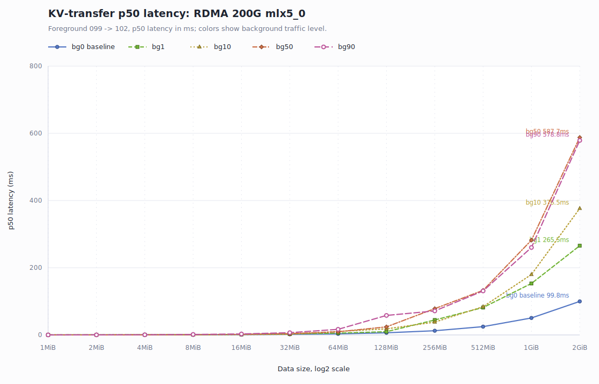
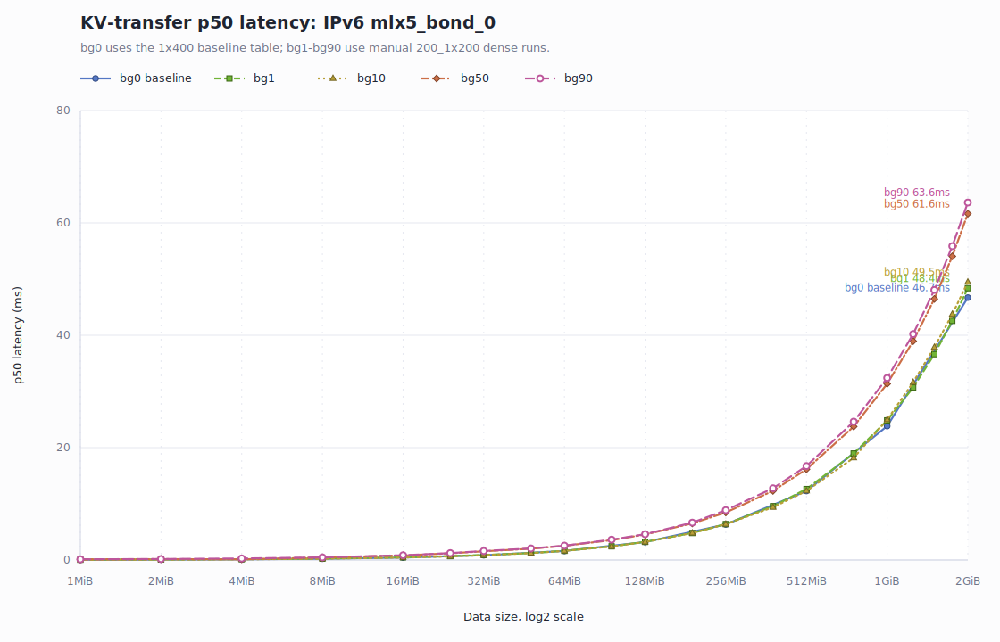
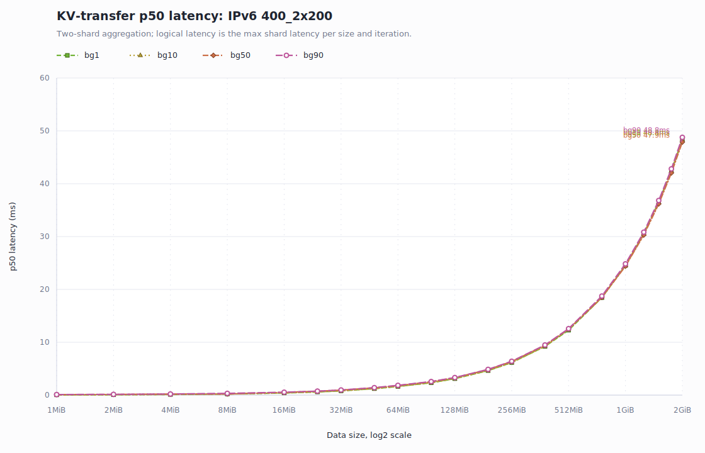
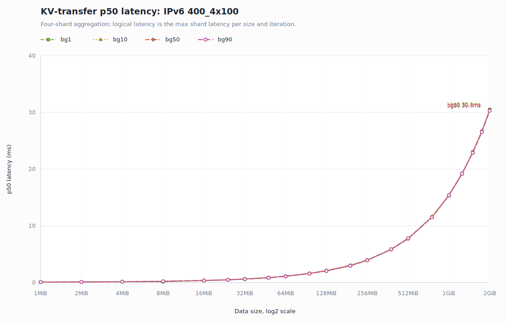
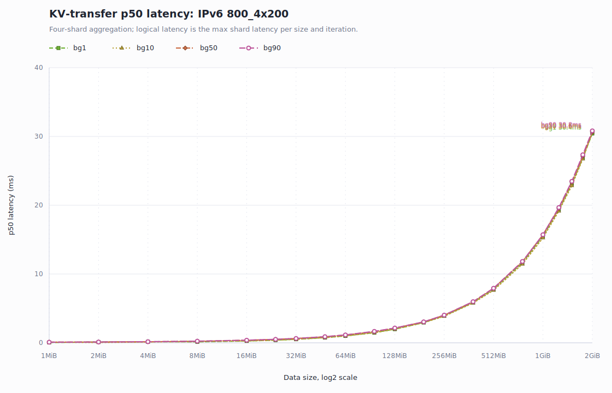

# KV Transfer 背景流量分组延迟曲线

数据来自 `../2026-06-23-kv-transfer-background-traffic-report.md` 中的 Markdown 汇总表。
每张图固定同一 baseline/profile，颜色和线型区分背景流量；x 轴为数据量 log2 刻度，y 轴为 p50 latency ms。

## KV-transfer p50 latency: RDMA 200G mlx5_0

Foreground 099 -> 102, p50 latency in ms; colors show background traffic level. Series: bg0 baseline, bg1, bg10, bg50, bg90.

## KV-transfer p50 latency: IPv6 mlx5_bond_0

bg0 uses the 1x400 baseline table; bg1-bg90 use manual 200_1x200 dense runs. Series: bg0 baseline, bg1, bg10, bg50, bg90.

## KV-transfer p50 latency: IPv6 400_2x200

Two-shard aggregation; logical latency is the max shard latency per size and iteration. Series: bg1, bg10, bg50, bg90.

## KV-transfer p50 latency: IPv6 400_4x100

Four-shard aggregation; logical latency is the max shard latency per size and iteration. Series: bg1, bg10, bg50, bg90.

## KV-transfer p50 latency: IPv6 800_4x200

Four-shard aggregation; logical latency is the max shard latency per size and iteration. Series: bg1, bg10, bg50, bg90.

