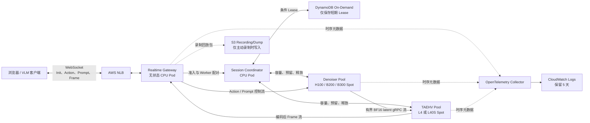
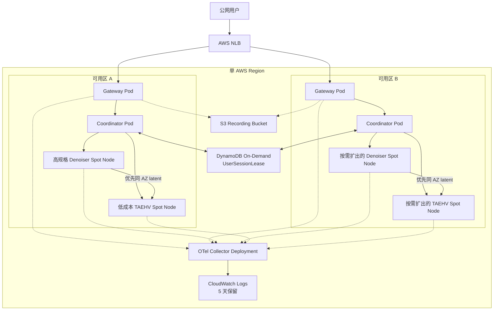
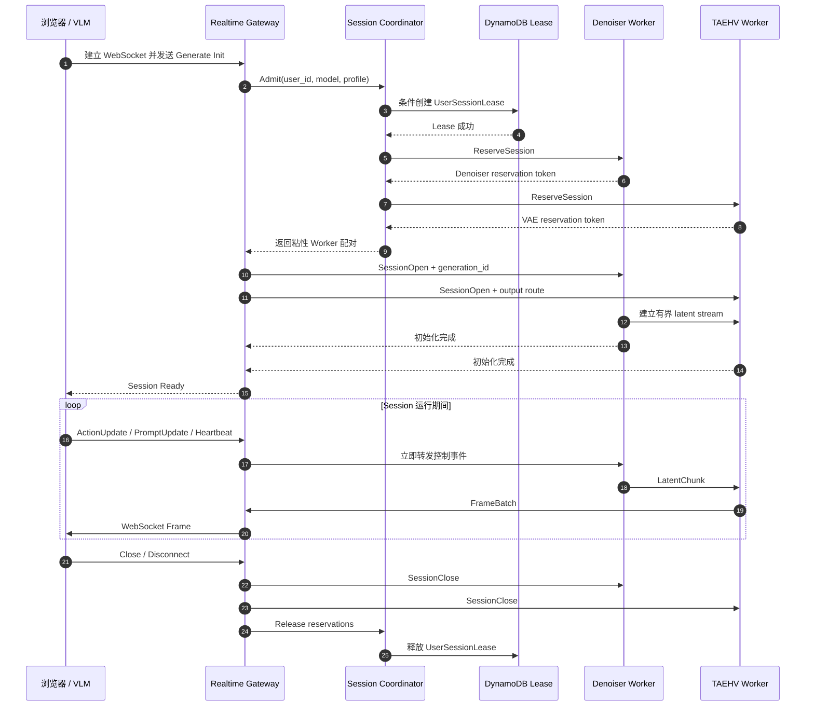
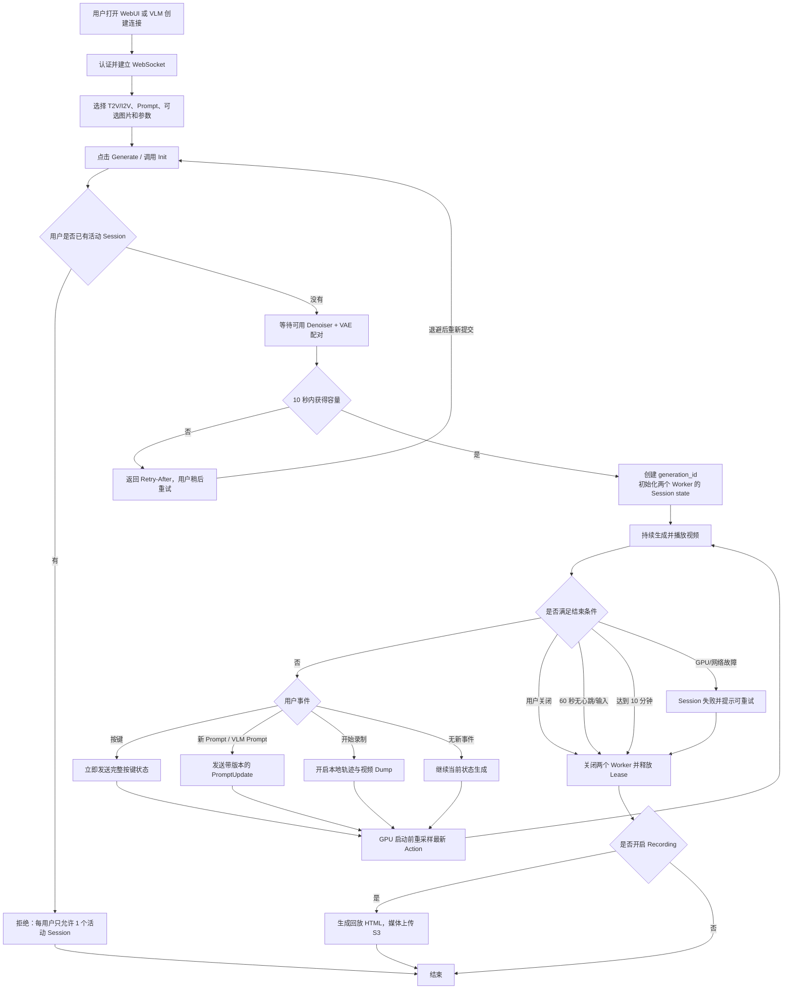
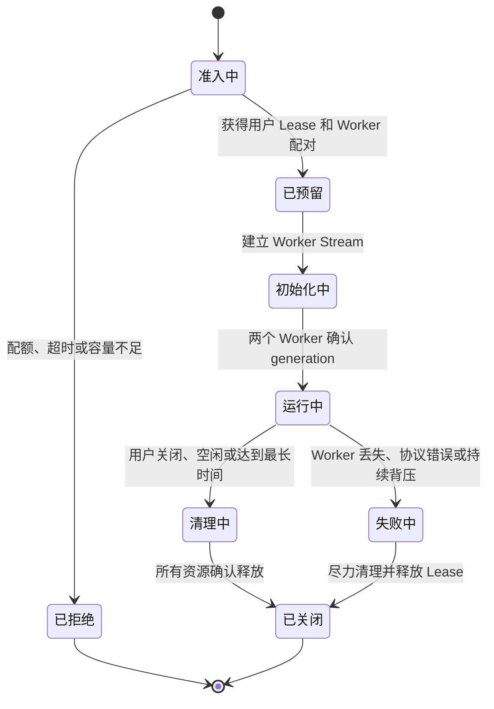
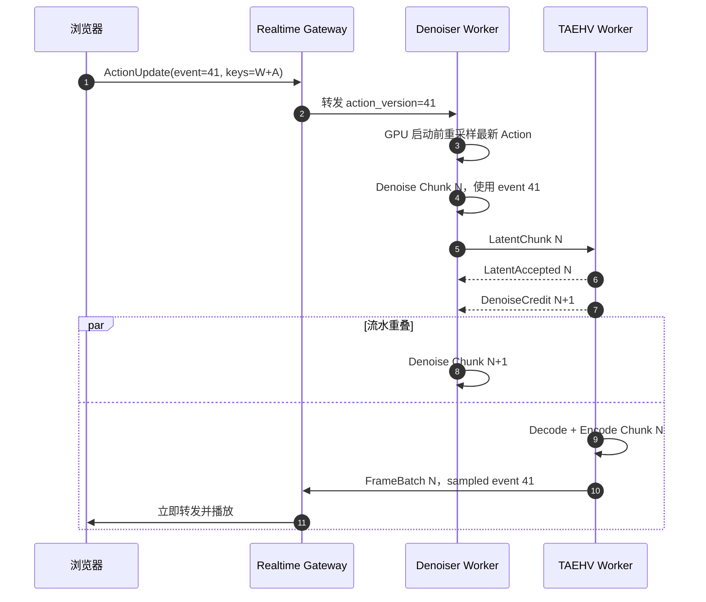
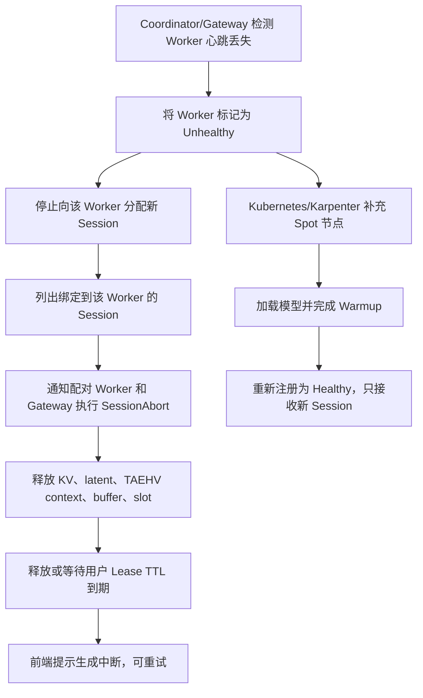

# MinWM 实时推理异步 VAE 与多用户多节点架构设计

## 1. 文档状态与已确认决策

本文档定义 `codex/minwm-realtime-api` 分支后续的生产化演进方案，统一解决两个问题：

1. 将因果 TAEHV 解码从同步 Denoiser 请求链路中拆出，使 Chunk `N+1` 的
   Denoising 能和 Chunk `N` 的 VAE Decode 重叠执行。
2. 将当前单用户、单活动 Session 的 API 改造成支持多用户、多节点、独立扩缩容的
   实时视频推理服务，并能从低成本启动配置逐步扩展到单 Region 10,000 个并发生成
   Session，支撑未来百万 DAU 的业务规模。

以下产品、成本和运维决策已经确认：

| 主题 | 已确认决策 |
| --- | --- |
| 峰值目标 | 单 Region 10,000 个并发生成 Session |
| 交互 SLO | 服务端收到 Action 到第一帧受该 Action 影响的画面完成展示，P95 < 1 秒 |
| 播放目标 | 持续生成帧率不低于 16 FPS |
| Denoiser 硬件 | 高规格 Spot GPU 池，初期使用 H100，有资源时可切换 B200/B300 |
| VAE 硬件 | 低成本 Spot GPU 池，先测试 L4；L4 不满足 SLO 时使用 L40S |
| Session 状态 | DiT KV、latent history、Action 和因果 VAE cache 都保存在绑定的 GPU Worker 本地 |
| GPU 故障 | 受影响 Session 失败，Kubernetes 自动补节点，用户重试；不复制 GPU 状态 |
| 队列 | 每个 Session 使用有界 latent 流水队列，禁止无界缓存 |
| 最低副本 | 活跃时段两个 GPU 池各保留 1 个热副本，夜间都缩容到 0 |
| Spot 兜底 | Spot 不足时不自动切 On-Demand，返回可重试的容量错误 |
| 用户配额 | 每个用户最多 1 个活动 Session；空闲 60 秒释放；最长 10 分钟 |
| 准入等待 | 最多等待 10 秒，超时返回 `Retry-After`，禁止无限排队 |
| 部署范围 | 单 AWS Region；CPU 控制面跨 AZ；GPU Worker 优先同 AZ 配对 |
| Trace | 所有已接收 Session 全量记录时序元数据，CloudWatch 保留 5 天 |
| Trace 数据 | 不保存图片、视频、latent、KV 和原始 prompt，只保存 prompt hash 与长度 |
| Recording/Dump | 用户主动录制时，才把完整回放包上传 S3 |

第一阶段不提供透明 Session 迁移、跨节点 KV 复制或 GPU Worker 故障后的无感续跑。

## 2. 当前实现与核心限制

当前代码已经具备 T2V/I2V、动态 Action、动态 Prompt、Trace、Recording/Dump 和
TAEHV 预加载等能力，但执行模型仍然是单体、单用户、同步流水：

- `realtime_video_api.py` 使用进程内 `_ACTIVE_SESSION_IDS`，第二个活动 Session 会被拒绝。
- `_generate_loop()` 会等待 `process_generation_batch()` 返回完整结果后，才准备下一个
  Chunk。目前只允许 WebSocket 发送和部分后续逻辑重叠，Denoising 与 VAE Decode
  仍然串行。
- `GenerateSession` 已有 `session_id` 和每个 Chunk 的 `request_id`，但没有独立的
  `generation_id`，无法可靠拒绝 Session 重置前遗留的延迟消息。
- `RealtimeSessionCache` 是进程内 LRU。非零 Chunk 如果被路由到没有该 Session 状态的
  Worker 会直接失败，因此不能按 Chunk 做普通轮询调度。
- MinWM Adapter 已经通过 event ID 保存并采样 Action、Prompt、Seed；分布式架构必须
  保持这个语义，并明确记录每个 Chunk 实际采样的 event/version。
- TAEHV 权重已经做到每个 Worker 启动时预加载，`StreamingTAEHV` 保存在
  `RealtimeVAEDecodeState` 中。这个边界适合拆分，但多 Session cache 隔离与重入安全
  仍需压力测试。
- Wan fallback decoder 会修改模型实例上的 `_feat_map`、`_conv_idx` 等字段，在同一个
  模型实例中交错多个 Session 不安全。

因此，改造不能只是在现有循环外层增加线程，而要引入明确的 Session 粘性路由、
阶段化 Worker、版本化协议和有界 Credit。

## 3. 设计目标与非目标

### 3.1 设计目标

- 同一 Session 内保持严格因果顺序，同时公平服务大量独立 Session。
- 将稳态关键路径从串行相加：

  ```text
  T_denoise + T_transfer + T_TAEHV + T_encode
  ```

  改为近似：

  ```text
  max(T_denoise, T_queue + T_transfer + T_TAEHV + T_encode)
  ```

- GPU 启动前尽可能使用最新 Action，降低用户输入到画面响应的延迟。
- 高规格 Denoiser 与低成本 VAE 独立扩缩容。
- GPU 显存、Host 内存、传输 buffer、输出 buffer、Trace buffer、准入队列全部有界。
- Worker、客户端或 Spot 节点失败时快速终止并完整释放资源。
- 保留 T2V/I2V、Prompt 更新、Action、Trace、Recording/Dump 的现有行为。
- 能清晰判断瓶颈位于排队、Denoising、传输、VAE、编码、网关还是浏览器渲染。

### 3.2 第一阶段非目标

- 实时迁移 DiT KV 或因果 VAE state。
- 通过回放/checkpoint 隐藏 GPU 节点故障。
- 多 Region 双活。
- 在 latent 热路径中引入 Kafka、Redis Streams 或 S3。
- 将解码后的 RGB 再传回 Denoiser。
- 用提高 Ulysses/SP degree 代替 Denoiser/VAE 流水化。
- 在无 batch 路径尚未通过延迟与正确性验收前，引入跨 Session 自适应 microbatch。

## 4. 整体服务拓扑

### 4.1 逻辑服务交互图



设计要点：

- Session Coordinator 只负责准入、路由和生命周期，不代理大 tensor。
- latent 直接从 Denoiser 发给 VAE。
- 编码后的帧直接从 VAE 发给 Gateway，不绕回昂贵的 Denoiser 节点。
- 共享存储中只放小体积 Lease 元数据，不保存 GPU 状态。
- 正常 Trace 不写媒体数据；只有用户主动 Recording 才写 S3。

### 4.2 AWS 部署拓扑图



CPU 控制面跨 AZ 部署。GPU Worker 优先同 AZ 配对以降低 p99 与跨 AZ 流量费用。
同 AZ 无可用配对时，只有在跨 AZ latent handoff P99 仍低于 20 ms 的前提下，才允许
跨 AZ 配对。Session 启动后不迁移 AZ。

### 4.3 完整 Session 服务交互时序图



## 5. 用户业务流程图



这里的 60 秒空闲只由客户端心跳、Action 或 Prompt 刷新。服务端持续出帧不会延长空闲
时间，避免无人使用的页面持续占用 GPU。

## 6. 核心组件职责

### 6.1 Realtime Gateway

Gateway 持有公网 WebSocket，但不持有 GPU 状态，主要职责包括：

- 完成用户认证与 T2V/I2V 请求校验。
- 通过 Coordinator 获取每用户单活动 Session Lease。
- 将 Action 和 Prompt 立即转发给绑定的 Denoiser。
- 将取消、断开、关闭事件转发给两个 GPU Worker。
- 直接接收 VAE Worker 的编码帧并立即转发给浏览器。
- 产生浏览器与网关阶段 Trace。
- 管理可选 Recording/Dump 上传。
- 容量等待超过 10 秒时返回带 `Retry-After` 的可重试错误。
- 正常关闭时释放 Lease，Session 存活期间续约 TTL。

Gateway 不保存 latent、DiT state 或因果 VAE state。Gateway 进程丢失时，该进程上的
Session 失败并由用户重试，不尝试把半个 Session 静默绑定到其他 Gateway。

生产环境启用 `--realtime-require-authenticated-user`。此时 `user_id` 只接受上游认证
中间件写入 ASGI scope 的 `sub`、`id` 或 `username`，不信任客户端自报 Header 或查询参数。
未启用该开关的匿名模式仅用于本地 WebUI 调试，不能提供跨连接的严格单用户配额。

### 6.2 Session Coordinator

Coordinator 负责准入与粘性路由。每个已接收生成任务形成以下绑定：

```text
(user_id, session_id, generation_id)
    -> (gateway_instance, denoiser_instance, vae_instance, model_revision, az)
```

配对流程：

1. 使用 DynamoDB 事务条件写同时抢占 `USER#<id>` 和固定编号
   `CAPACITY#<slot>` Lease；容量槽带 TTL，节点崩溃后可原子回收，不维护可能泄漏的全局计数器。
2. 根据空闲 Session slot、排队时间、近期服务时间、模型版本、AZ 选择 Denoiser。
3. 选择 checkpoint/config 兼容并优先同 AZ 的 VAE Worker。
4. 使用幂等 reservation token 预留两个 Worker。
5. 任一预留失败时释放已获得的部分预留，继续尝试其他配对。
6. 返回 Worker 地址与短期签名 Session token 给 Gateway。

正在 Drain 的 Worker 不再接收新 Session。已有 Session 在 Drain deadline 前完成，否则
显式失败。Coordinator 重启可能短暂影响新准入，但已建立的直连流不受影响。

### 6.3 Denoiser Worker

每个 Denoiser Worker 为每个 Session 持有：

- DiT KV cache 与 cross-attention cache。
- 当前 latent/history 与 scheduler state。
- 最新 Action、Prompt、Seed、scene switch 版本。
- 下一个期望执行的 Chunk index。
- 最多一个排队中或执行中的 Denoise work item。
- 到绑定 VAE Worker 的有界 latent stream。

Worker 暴露的容量由显存和实测服务时间决定，不按 GPU 数量简单估算。多个独立 Session
使用带 deadline 的 Deficit Round Robin 公平调度：

- 同一 Session 最多一个 Denoise Chunk 在执行。
- 一个 Session 不能提前塞入多个未来 Chunk。
- 第一阶段不增加 batch 等待，`max_batch_wait_ms = 0`。
- 后续只有在 P95 改善且 Action 语义不变时，才允许最多 2 ms 的自适应 microbatch。

### 6.4 TAEHV Worker

VAE Worker 在进程启动时加载一次不可变 TAEHV 权重，并维护有界的 per-Session
Streaming Decoder Context。其职责包括：

- 校验 latent envelope、模型指纹和 Chunk 顺序。
- 按 `(session_id, generation_id)` 隔离因果 TAEHV state。
- 严格按顺序 Decode Chunk。
- 完成 postprocess 和编码，禁止将 RGB 传回 Denoiser。
- TAEHV 每产生一帧或一个小帧批次，就直接发送给 Gateway。
- Session 关闭时释放 decoder state、pinned buffer 和输出队列。

后端安全规则：

- TAEHV 只有通过多 Session cache 串扰与重入测试后，才允许一个 Worker 驻留多个活动
  Session Context。第一阶段即使驻留多个 Context，也由 Worker Actor 串行发起 Decode。
- 使用模型级可变 cache 的 Wan fallback 每个模型进程最多一个活动 Session，直到 cache
  被完整迁移到 per-Session state。
- 活动 Session 禁止被 LRU 淘汰；容量不足时应拒绝准入。

VAE 硬件按 Issue #11 的标准选择：使用满足
`p99(queue + transfer + decode + encode)` 预算且至少有 30% 余量的最便宜 GPU。
先测试 L4，不满足时使用 L40S。

### 6.5 Trace 与 Recording

OpenTelemetry Collector 将压缩、批量的 Span 写入 CloudWatch Logs，保留 5 天。
Prometheus/CloudWatch Metrics 只能使用低基数标签。Session ID、Chunk ID 可以进入 Trace，
不能成为 Metrics label。

Trace 对所有已接收 Session 记录完整时序元数据，但不落盘图片、视频、latent、KV 或原始
Prompt。Prompt 只记录 `sha256`、字符长度和单调递增版本。

Recording/Dump 是独立的用户主动路径，可以保存参考图片、视频、Prompt history、前端
按键、SGLang 实际采样 Action 和回放 HTML，并单独配置 S3 生命周期。

## 7. Session 标识与生命周期

所有控制消息和数据消息必须携带：

```text
session_id      一次 WebSocket Session 内稳定
generation_id   每次 Generate/Init 生成新的 UUID，包括 Session 重置
chunk_index     generation 内从 0 单调递增
request_id      每次执行尝试的唯一 ID，用于 Trace 与幂等处理
```

不能只依赖 `session_id`。否则旧 generation 的延迟消息可能污染重置后的新 Session。

### 7.1 Session 状态机



60 秒 Idle TTL 由有效客户端心跳、Action 或 Prompt 刷新。最长 10 分钟不可延长。
清理必须幂等，Worker 通过 reservation token 和 generation ID 保证资源最多释放一次。

## 8. 服务协议设计

第一阶段使用 Protobuf 与双向 Streaming gRPC。Tensor payload 使用连续 `bytes`，禁止
pickle 和 base64。默认 gRPC 最大消息为 8 MiB，能够覆盖当前 MinWM/LingBot latent，
同时保留协议校验余量。

### 8.1 Session 与控制消息

```text
SessionOpen
  protocol_version, session_id, generation_id, user_lease_token
  model_revision, vae_fingerprint, output_route, deadline_epoch_ms

ActionUpdate
  session_id, generation_id, event_id, action_version
  pressed_keys 或 action_label/action_weights
  client_sent_epoch_ms, gateway_received_epoch_ms

PromptUpdate
  session_id, generation_id, event_id, prompt_version
  prompt_utf8, switch_kind(prompt|scene_cut)

SessionClose / SessionAbort
  session_id, generation_id, reason, last_chunk_index
```

实时控制消息必须包含原始 Prompt，模型才能使用；Trace Exporter 在持久化前负责 hash 并
删除原文。

### 8.2 Latent handoff 消息

```text
LatentChunk
  protocol_version
  session_id, generation_id, request_id, chunk_index
  model_revision, vae_fingerprint
  dtype, shape, layout, byte_length
  first_chunk, last_chunk
  sampled_action_event_id, action_version, prompt_version
  deadline_epoch_ms, traceparent
  payload: contiguous BF16 latent bytes

LatentAccepted
  session_id, generation_id, chunk_index
  queue_depth, decoder_state, accepted_epoch_ms

DenoiseCredit
  session_id, generation_id, next_chunk_index
  credit_id, expires_epoch_ms

ChunkDecoded / ChunkRejected
  session_id, generation_id, chunk_index
  frame_count 或结构化拒绝原因
```

VAE Worker 必须拒绝旧 generation、无法匹配的重复消息、非单调 Chunk、非法 dtype/shape、
不兼容模型版本和已过 deadline 的数据。相同 identity 与 checksum 的重复消息只做幂等
ACK，不重复 Decode。

### 8.3 Frame 输出消息

```text
FrameBatch
  session_id, generation_id, request_id, chunk_index
  frame_start, frame_count, fps, content_type
  sampled_action_event_id, action_version, prompt_version
  decode_started/finished timestamps, encode_finished timestamp
  traceparent, payload
```

TAEHV 产生可用帧后立即发送，不为了构造大包而等待整个逻辑 Chunk 完成。只有在输出队列
为空且不增加超过 5 ms 延迟时，才允许合并相邻小帧批次。

## 9. Action 与 Prompt 生效语义

### 9.1 最新 Action 替换旧 Action

前端在 key down/key up 时立即发送完整按键状态，并周期性刷新持续按住的状态。服务端为
每次变化分配单调递增 `event_id` 与 `action_version`。Denoiser 原子保存最新完整状态。

每个 Chunk 的处理规则：

1. Scheduler 创建 work item 时记录当时的控制版本。
2. CUDA Kernel 启动前，再次快照最新控制状态。
3. 如果版本变化，用新 Action 替换旧条件，并将旧版本记录为
   `superseded_before_dispatch`。
4. 记录该 Chunk 实际使用的 event ID/version。
5. Denoising CUDA Kernel 一旦启动，不做抢占或回滚。
6. 下一个尚未启动的 Chunk 使用最新版本。

所以“推理前取消旧 Action”不是丢弃整个 Chunk，也不是跳过因果状态，而是替换尚未进入
GPU 的 Chunk 所携带的旧条件。

Gateway 与 Scheduler 使用独立 ZMQ 连接，因此更新消息可能早于原始 Chunk 到达。Scheduler
为这种乱序保留最多 1024 条、有效期 5 秒的 pending replacement；原请求到达后按
`(session_id, generation_id, chunk_index, request_id)` 原子匹配并保持原 FIFO 时间戳。
匹配不到的更新在 TTL 后丢弃，避免控制消息无限占用内存。已经 dispatch 的请求保留短期
tombstone，迟到更新返回 `too_late`，不会错误缓存并影响后续 Chunk；replacement envelope
与 payload identity 不一致时返回 `invalid`。

`W+A` 等组合键以一个完整 Action Vector 表示，由模型 Adapter 映射成 label 或 weight。
持续按住一个键时，服务端保留最新完整状态，不依赖浏览器 key-repeat 才能持续生效。

### 9.2 动态 Prompt / VLM Prompt

Prompt 使用相同的单调版本规则，但只在下一个 Chunk 创建边界生效。已经构造并提交给
Scheduler 的 Chunk 不会预消费 Prompt/scene-cut 队列，也不会在排队期间被原地替换；这样
可避免一次控制更新既被当前 Chunk 预览又在下一 Chunk 丢失。运行中的 Chunk 使用已经记录
的旧版本执行完成。`scene_cut` 仍是显式模型事件，由 MinWM Adapter 决定需要重置的条件状态。

每个 Frame 都携带实际采样的 Action event ID、Action version 和 Prompt version，保证
Trace/Dump 可以精确还原“用户发送了什么”和“SGLang 实际使用了什么”。

## 10. Denoiser 与 VAE 异步流水

### 10.1 单个 Chunk 的服务交互时序图



同一个 Session 内不能并发 Denoise 两个未来 Chunk，因为 DiT KV 与 latent history 具有
因果依赖。这里的并发是两个阶段之间的 Pipeline Parallel：Denoising `N+1` 与 VAE
Decode `N` 重叠。

### 10.2 每个 Session 的有界状态

一个 Session 同时最多包含：

- 一个正在 Denoising 的 Chunk。
- 一个正在 VAE Decode 的 Chunk。
- 一个在 VAE 等待槽中的 latent。

等待槽默认深度为 1，最大可配置为 2。它只吸收短期服务时间抖动，不能变成持续堆积的
吞吐缓存。

### 10.3 Credit 与背压

VAE 将上一个 latent 从等待槽移动到 Decode 后，如果有能力接收下一个 latent，才发放
新的 `DenoiseCredit`。Denoiser 只有收到该 Credit 才能调度对应 next chunk。
`LatentAccepted` 只表示数据接收成功，不会自动产生下一张 Credit。

每张 Credit：

- 只能使用一次。
- 绑定明确的 `next_chunk_index`。
- 有过期时间。
- Session 取消或 generation 变化时立即失效。

如果 VAE Queue 持续满：

- Denoiser 停止为该 Session 调度下一 Chunk。
- 其他 Session 仍可执行，避免单个慢 Session 占住 GPU。
- 连续背压超过 `min(2 秒, 2 * 配置的 Chunk 时长)` 时，以
  `VAE_BACKPRESSURE_TIMEOUT` 终止该 Session，并返回可重试错误。

不能通过丢弃或乱序 latent 消除积压，否则会破坏因果 VAE state。前端展示可以使用
latest-frame 策略丢弃过时的展示帧，但完整 Recording/Dump 保留全部生成结果。

### 10.4 慢客户端

Gateway 与 VAE 输出队列同样有界。Gateway 每个 Session 最多保留一个小型已编码帧批次。
如果浏览器在输出 deadline 内无法消费，关闭该 Session 并释放两个 GPU Worker，不能让
慢客户端无限占用 VAE Context。

浏览器使用目标 0 到 250 ms 的有界自适应 jitter buffer。出现展示积压时优先显示最新
可解码帧。服务端不通过强制 pacing 人为制造“平滑但高延迟”的效果。

## 11. 多用户调度

公共 API 不再使用全局 `_ACTIVE_SESSION_IDS`。容量由每个 Worker 可预留的 Session slot
表示。

### 11.1 Denoiser 公平调度

第一阶段采用带 deadline 的 Deficit Round Robin：

- 每个活动 Session 每个输出 Chunk 周期获得一次 work credit。
- 没有 VAE Credit 的 Session 被跳过，不进行 busy wait。
- Action-to-frame deadline 更早的 Session 在同等条件下优先。
- 每个用户最多一个活动 Session。
- Worker 持续上报 active、runnable、blocked、free slot。

同一 Session 的 Chunk 因 KV 与历史状态依赖而严格串行。吞吐提升来自多个独立 Session
公平交错，以及 Denoiser/VAE 阶段重叠，不来自同一 Session 的未来 Chunk 并发。

### 11.2 VAE 公平调度

VAE Actor 在驻留的 Session Context 之间 Round Robin 调度 ready Chunk，同时保持每个
Session 内严格顺序。第一阶段每个 Actor 同时只执行一个 Decode Kernel 序列。只有基准
测试证明多 Actor/CUDA Stream 能提高吞吐且无 cache 串扰，才提高单 GPU 并发。

## 12. 容量规划与弹性扩缩容

### 12.1 容量公式

定义：

- `S`：活动 Session 数。
- `F`：稳态每个 Chunk 生成帧数。
- `R`：要求的生成 FPS。
- `B = F / R`：每个 Session 的 Chunk 周期。
- `D99`：Denoiser 单 Chunk P99 服务时间。
- `V99`：VAE Queue + Transfer + Decode + Encode P99。
- `U`：目标 Worker 利用率，初始不超过 0.70。

第一阶容量下限：

```text
denoiser_replicas >= ceil(S * D99 / (B * U))
vae_replicas      >= ceil(S * V99 / (B * U))
```

公式只能给出容量下限，不能证明 SLO。生产准入上限必须通过 1/2/4/8 Session 与饱和压力
测试确定，并包含排队、Action 延迟、编码、网络和浏览器 Render。

### 12.2 扩缩容信号

| 组件 | 主要信号 |
| --- | --- |
| Gateway | 活动 WebSocket、event loop delay、出站字节、CPU |
| Denoiser | runnable Session、free slot、queue P95、Denoise P95/P99、GPU 利用率 |
| VAE | latent queue depth、decode P95/P99、free context、output backpressure、GPU 利用率 |
| Coordinator | admission wait、reservation conflict、配对失败数、请求速率 |

Karpenter 负责 Spot GPU Node，KEDA/HPA 负责 CPU Pod。预测未来 5 分钟负载超过 70% 可用
容量，或 queue P95 超过 Chunk 预算的 20% 时扩容。连续 15 分钟低负载后才缩容，并先将
Worker 置为 Drain。

活跃时段最低运行一个高规格 Denoiser Replica 和一个低成本 VAE Replica，所以跨节点
方案的白天成本下限是两个 GPU 节点。夜间两个池都缩到 0。定时扩容要提前完成模型加载与
Warmup。Spot 不足时不自动使用 On-Demand，而是返回容量不足错误。

## 13. 故障处理

### 13.1 故障行为表

| 故障 | 系统行为 |
| --- | --- |
| 浏览器断开 | 取消两个 Worker，释放状态和用户 Lease |
| Gateway Pod 丢失 | Worker 心跳超时后终止 Session，用户重试 |
| Denoiser 丢失/Spot 回收 | 绑定 Session 立即失败，VAE 释放对应 state |
| VAE 丢失/Spot 回收 | 绑定 Session 立即失败，Denoiser 释放对应 state |
| Coordinator 丢失 | 已有直连流继续，新准入切其他 Replica |
| DynamoDB 暂时不可用 | 停止新准入，不能破坏严格单用户配额 |
| Chunk 乱序 | 返回协议错误并终止对应 generation |
| 重复消息 | identity/fingerprint/checksum 相同时幂等 ACK |
| 持续队列压力 | 只终止受影响 Session，返回可重试过载错误 |
| Trace Exporter 压力 | 在丢 Trace 前停止新准入，达到临界水位时终止活动 Session |

### 13.2 GPU Worker 故障业务流程图



Worker heartbeat 携带实例 generation/epoch，重启前的旧消息会被拒绝。清理范围包括 KV、
Prompt/Action state、TAEHV Context、传输 slot、pinned buffer、输出队列和预留记录。

## 14. 可观测性与运维

### 14.1 全量 Trace Span

所有已接收 Session 都记录以下链路：

```text
browser.input
gateway.event_received
denoiser.control_applied
denoiser.queue_wait
denoiser.pre_dispatch_snapshot
denoiser.compute
latent.serialize
latent.transfer
vae.queue_wait
vae.decode
vae.postprocess
frame.encode
frame.transfer
gateway.ws_write
browser.decode
browser.render
```

每个 Chunk 记录 Session/generation/chunk/request 标识、实际采样 event、Action/Prompt
version、队列深度、Worker ID、首 Chunk/稳态 Chunk 和结构化状态。GPU 时长使用 CUDA
Event；排队与网络使用 wall-clock。

### 14.2 指标

必须提供以下低基数 Metrics：

- active、waiting、rejected、failed、completed Session。
- 按角色与 GPU SKU 的 free/reserved Session slot。
- Queue、Denoise、Transfer、VAE、Encode、WS、Render 延迟直方图。
- Action-to-dispatch 与 Action-to-first-visible-frame 延迟。
- Pipeline overlap ratio 与关键路径 idle time。
- Credit 使用率、队列占用与 backpressure timeout。
- stale generation、duplicate、gap、out-of-order 计数。
- cache create/reset/dispose 与 cache 串扰测试失败计数。
- Spot interruption、Worker restart、Drain 和 cleanup 计数。
- Trace Export Queue bytes 与 CloudWatch ingestion GB/day。

### 14.3 Trace 完整性与成本保护

Collector 使用压缩、批处理和可容纳峰值 5 分钟元数据的有界本地磁盘 spool：

- 达到高水位时，Coordinator 停止新准入。
- 达到临界水位时，活动 Session 以 `TELEMETRY_UNAVAILABLE` 结束，并先将最后的 Trace
  事件加入 spool，禁止静默丢 Trace。
- 推理线程不允许同步写 CloudWatch。

CloudWatch Log Group 强制设置 5 天保留。全量 Trace 即使没有媒体数据，在高并发下也可能
产生明显费用，因此必须配置每日写入量和费用告警。

### 14.4 运维看板

主看板按 Action 到 Render 的关键路径排列，并叠加各 Pool 容量。运维人员可以依次判断：

1. 准入或某个 GPU Pool 是否饱和。
2. Action 是否在 Denoiser Dispatch 前排队。
3. Denoising 是主瓶颈，还是 VAE/Transfer 暴露在关键路径上。
4. VAE 输出是否被编码、Gateway 或浏览器阻塞。
5. 是否发生 Spot 回收、旧 generation 消息或 cleanup 泄漏。

告警必须可操作，主要包括 SLO Burn、无 free slot、有界队列持续高水位、Trace spool
压力、资源泄漏和频繁 Spot 替换。

## 15. 成本控制

启动阶段不引入固定成本较高的数据系统：

- GPU NodePool 仅使用 Spot，按时段夜间缩容到 0。
- 活跃时段最低 1 个高规格 Denoiser GPU 加 1 个低成本 VAE GPU。
- DynamoDB On-Demand 只保存少量 TTL Lease，不部署固定 Redis 集群。
- 除用户主动 Recording 外，不缓存 latent、KV、图片或视频。
- 有界队列、严格 Session TTL 和单用户配额避免缓存推动节点扩容。
- Trace 只保留 5 天且不含媒体/模型状态。
- S3 Recording 使用生命周期自动清理。
- AWS Budgets 与 Pool 维度成本看板持续展示每生成分钟、每成功 Session 的成本。

模型文件允许在节点生命周期内使用本地临时缓存。不能为了未来流量提前在大量节点预热
所有模型；新节点只下载当前服务的模型 revision。

## 16. 分阶段交付方案

后续实现拆成可独立评审和验收的里程碑。前一个里程碑未通过正确性与 Trace Gate 时，
不进入下一阶段。

### Milestone 0：协议与状态归属

- 新增 `generation_id`、Worker epoch、类型化协议和幂等 Cleanup。
- Frame 与 Trace 明确记录实际 Action/Prompt version。
- 将活动 Session 的 LRU 淘汰改为明确容量准入。
- 保留现有单体路径作为 Feature Flag 回滚通道。

### Milestone 1：单机真实异步流水

- 在同一节点拆分 Denoiser 与 TAEHV Actor/Process。
- 实现有界 Credit 与 VAE 直接输出。
- 用 CUDA Timeline 证明 Denoise `N+1` 与 VAE Decode `N` 真正重叠。
- 验证 GPU 启动前 Action 替换，以及启动后不抢占。
- 与当前 TAEHV 单体路径做输出一致性对比。

该阶段先证明调度与状态正确，再引入网络故障变量。

### Milestone 2：跨节点低成本 VAE Pool

- Denoiser 部署在 H100/B200/B300，VAE 部署在 L4。
- 使用同 AZ 直连 Streaming gRPC。
- L4 不满足 30% P99 余量时测试并切换 L40S。
- 验证 60 秒 Session、网络错误、重连边界和 Spot 回收 Cleanup。

### Milestone 3：多用户与弹性容量

- 移除单 Session API Gate。
- 增加 Coordinator、严格用户 Lease、Worker Reservation、公平调度和独立扩缩容。
- 对每个 Worker 测试 1/2/4/8 个并发 Session，确定安全 slot 上限。
- 开启定时最低副本与夜间 Scale-to-Zero。

### Milestone 4：生产规模验证

- 分阶段压测到 10,000 个并发生成 Session。
- 验证多 AZ 配对、准入行为、5 天 Trace 和费用告警。
- 发布每个 GPU SKU 的容量、每生成分钟成本和各 Pool 的最大准入 Session 数。
- 按 SLO 与成本 Gate 灰度放量，并保留回滚通道。

### Milestone 5：可选的 VAE 密度提升

- 将仍在修改模型全局字段的因果 VAE cache 完整迁移到 per-Session state。
- 评估每个低成本 GPU 多 Decode Actor 或多 CUDA Stream。
- 只有在不破坏 P95 Action 延迟与输出一致性时，才增加不超过 2 ms 的自适应
  microbatch。

## 17. 测试策略

### 17.1 单元测试

- Session/generation/chunk identity 与旧 generation 拒绝。
- 用户 Lease 获取、续约、过期与幂等释放。
- Worker 粘性配对与部分预留失败回滚。
- 最新 Action 重采样与 `superseded_before_dispatch` 审计记录。
- 组合键、持续按键、松键、label、weight、Prompt switch。
- Chunk 单调顺序、重复幂等与 checksum mismatch。
- 成功、超时、取消、异常下的 Credit 与 Queue 上限。
- per-Session TAEHV state 创建、重置、释放，以及 Wan 单 Session 限制。
- Trace 字段脱敏与完整 Span 关联。

### 17.2 正确性与一致性测试

- 固定 Seed 与模型 revision 的 T2V/I2V。
- 无 Action、持续 Action、快速替换 Action、同时组合 Action。
- 每个调度边界上的 Prompt update 与 scene cut。
- 多 Session 交错时不存在 VAE cache、DiT state、Prompt、Action 串扰。
- 异步输出保持 Frame 和 Chunk 顺序。
- 与单体 TAEHV 基线对比帧指标、时序一致性、Action 响应和人工观感。

### 17.3 性能测试

- Cold Start、首 Chunk、稳态 Chunk 分开统计。
- L4、L40S 与目标 Denoiser SKU 分别测试 1/2/4/8 并发 Session。
- 记录 Denoise、Queue、Transfer、Decode、Encode、Action-to-render 的 P50/P95/P99。
- 使用 CUDA Timeline 证明重叠，不能只根据“进程已经拆开”推断异步生效。
- 连续运行至少 60 秒，确认 GPU/Host 内存无持续增长。
- Generated FPS、Display FPS、展示丢帧和完整 Recording FPS 分开报告。

### 17.4 Chaos 与过载测试

- 在不同阶段 Kill Gateway、Coordinator、Denoiser 和 VAE。
- 注入 Spot interruption/Drain、gRPC 断开、重复、延迟、损坏、乱序消息。
- 模拟慢浏览器与阻塞 Trace Exporter。
- 打满准入队列和两个 GPU Pool。
- 断言只有绑定 Session 失败，所有资源都能回收，每个队列保持有界，错误可重试且清晰。

## 18. 生产验收标准

同时满足以下条件后，才能承接生产流量：

- 在已发布准入上限内，Action 到第一帧受影响画面的 P95 < 1 秒。
- 支持配置的持续生成 FPS 不低于 16。
- Timeline 证明 Denoise `N+1` 与 VAE Decode `N` 重叠。
- 同 AZ latent handoff P95 < 10 ms、P99 < 20 ms。
- 只有当 L4 VAE 路径 P99 至少有 30% 余量时才选 L4，否则使用 L40S。
- 60 秒 Session 无 Chunk 丢失、重复、乱序和内存持续增长。
- 任一 Session 不会读取其他 Session 的 DiT、Action、Prompt 或 VAE cache。
- 过载时所有 Queue 和 Buffer 都不超过配置上限。
- GPU Worker 丢失只影响其绑定 Session，且所有 slot 都能释放。
- 跨 Gateway Replica 强制执行每用户单 Session、60 秒 Idle、10 分钟最大时长和
  10 秒准入超时。
- 正常条件下所有已接收 Session 都有完整时序 Trace，完成媒体脱敏并保留 5 天。
- 容量与成本报告证明系统能从白天两个 GPU 节点的最低配置，逐步扩展到实测的
  10,000 Session Fleet，而不需要预先创建大量缓存或固定资源。

## 19. 上线前必须实测的参数

架构边界已经确定，但以下值必须通过基准测试获得，不能凭经验填写：

1. 每个 L4/L40S Worker 可安全驻留的 Session Context 数和 Decode 并发。
2. L4 与 L40S 的 P99 及每个持续视频流成本。
3. 指定模型、分辨率、GPU 下每个 Denoiser 的安全 Session slot 数。
4. 同 AZ 与跨 AZ gRPC latent transfer P99。
5. 满足 1 秒 P95 Action-to-render 时的真实最大准入量。
6. 各灰度阶段全量 Trace 的 CloudWatch GB/day 与费用。

任一 Gate 不通过时，应降低准入上限或更换 VAE SKU，不能放宽因果顺序、有界队列、
Trace 完整性或公开交互 SLO。
