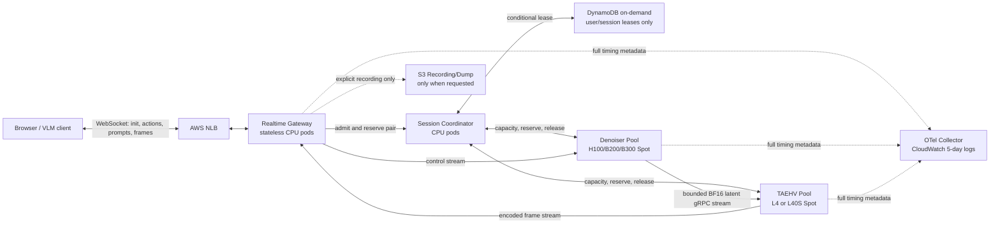
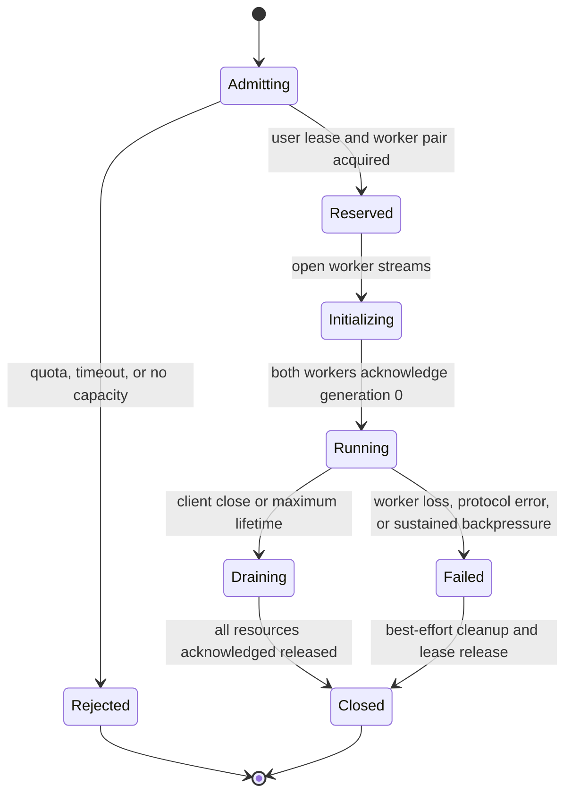
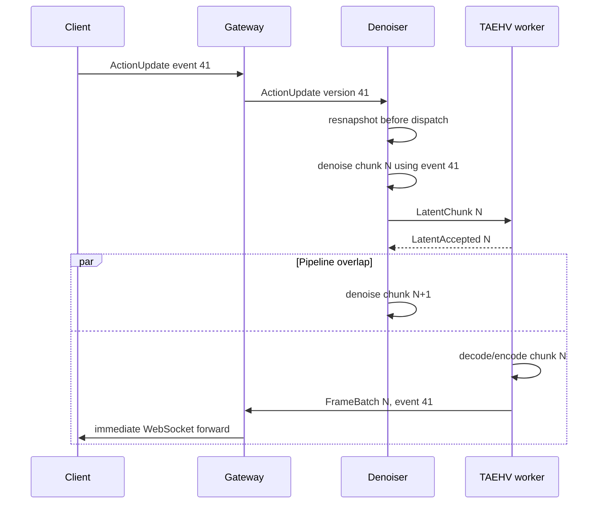

# MinWM Realtime Async VAE and Multi-User Multi-Node Design

## 1. Status and decisions

This document defines the production direction for MinWM realtime video serving on
the `codex/minwm-realtime-api` branch. It combines two related changes:

1. move causal TAEHV decoding out of the synchronous Denoiser request path and
   overlap Denoising chunk `N+1` with VAE decoding chunk `N`;
2. replace the current single-active-session API with a multi-user, multi-node
   service that can grow from a low-cost launch configuration to 10,000 concurrent
   generation Sessions in one AWS Region.

The following product and operational decisions are fixed for this design:

| Area | Decision |
| --- | --- |
| Peak target | 10,000 concurrent generation Sessions |
| Interaction SLO | action received by the service to first visible affected frame P95 < 1 second |
| Playback target | sustained generated output >= 16 FPS |
| Denoiser hardware | high-end Spot GPU pool, initially H100; B200/B300 when available |
| VAE hardware | lower-cost Spot GPU pool; benchmark L4 first, use L40S if L4 misses the SLO |
| Session state | state is local to the assigned Denoiser and VAE workers |
| Node failure | affected Sessions fail; Kubernetes replaces the node; users retry |
| Queueing | bounded per-Session latent pipeline; never use an unbounded queue |
| Scale floor | scheduled: one warm replica in each GPU pool during active hours, zero at night |
| Spot fallback | no automatic On-Demand fallback |
| User quota | one active Session per user, 60-second idle timeout, 10-minute maximum lifetime |
| Admission | reject after 10 seconds with `Retry-After`; do not wait indefinitely |
| Deployment | one AWS Region; CPU control plane is multi-AZ; GPU pairs prefer the same AZ |
| Trace | all accepted Sessions emit full timing metadata; CloudWatch retention is 5 days |
| Trace payload | no image, video, latent, KV, or raw prompt; store prompt hash and length only |
| Recording dump | explicit Recording may upload the full replay package to S3 |

The first production milestone does not provide transparent Session migration,
cross-node KV replication, or live recovery after a GPU worker failure.

## 2. Current-state constraints

The current implementation already has useful model-specific behavior, but it is a
monolithic single-user execution path:

- `realtime_video_api.py` uses process-local `_ACTIVE_SESSION_IDS` and rejects a
  second active Session.
- `_generate_loop()` calls `process_generation_batch()` and waits for the full
  scheduler result before preparing the next chunk. Only output sending can overlap
  with later work; Denoising and VAE decode remain serial.
- `GenerateSession` has a Session ID and per-chunk request IDs but no explicit
  `generation_id` for rejecting stale messages after a Session reset.
- `RealtimeSessionCache` stores state in a process-local LRU. A non-zero chunk fails
  on a worker that does not already own that Session, so per-chunk round-robin is
  invalid.
- MinWM action and prompt queues already preserve event IDs and sample the newest
  applicable values at chunk preparation. Distributed scheduling must preserve this
  behavior and expose the exact sampled event/action version.
- TAEHV weights are preloaded per worker, while `StreamingTAEHV` is created in
  per-Session `RealtimeVAEDecodeState`. This is a good starting boundary, but
  multi-Session cache isolation and reentrancy still require stress validation.
- The Wan fallback decoder mutates model-owned cache fields such as `_feat_map` and
  `_conv_idx`; it cannot safely interleave Sessions in one model instance.

The design therefore introduces explicit Session placement, stage-specific workers,
versioned data-plane messages, and bounded credits rather than wrapping the existing
loop in additional threads.

## 3. Goals and non-goals

### 3.1 Goals

- Keep each Session causally ordered while serving many independent Sessions fairly.
- Make steady-state critical-path time approximately:

  ```text
  max(T_denoise, T_queue + T_transfer + T_TAEHV + T_encode)
  ```

- Apply the newest user action that is still changeable before GPU launch.
- Scale expensive Denoisers independently from cheaper VAE workers.
- Bound GPU memory, host memory, transfer buffers, output buffers, trace buffers, and
  admission queues.
- Fail quickly and reclaim all local state when a worker, client, or Spot node dies.
- Preserve the existing T2V/I2V, prompt update, action, Trace, and Recording/Dump
  behavior.
- Provide enough tracing to identify whether queueing, Denoising, transfer, VAE,
  encoding, networking, or frontend playback is the current bottleneck.

### 3.2 Non-goals for the first production milestone

- Migrating live DiT KV or causal VAE state to another worker.
- Replaying or checkpointing state to hide a GPU node failure.
- Multi-Region active-active traffic.
- Kafka, Redis Streams, or S3 in the latent data path.
- Sending decoded RGB back through the Denoiser worker.
- Increasing Ulysses/SP degree as a substitute for pipeline overlap.
- Adaptive cross-Session microbatching before the unbatched path meets latency and
  correctness gates.

## 4. Recommended architecture



### 4.1 Why this shape

The GPU state remains local and cheap to discard. Only small lease and route metadata
is shared. Latents travel directly from the Denoiser to the VAE worker, and encoded
frames travel directly from the VAE worker to the Gateway. The design avoids an
always-on broker, a distributed tensor cache, and duplicate RGB transport through the
expensive Denoiser node.

The Session Coordinator is a placement/control service, not a tensor proxy. Its
replicas are inexpensive CPU pods. DynamoDB uses on-demand billing and stores only
short-lived conditional leases, which is cheaper and more elastic at launch than an
always-on Redis cluster.

## 5. Component responsibilities

### 5.1 Realtime Gateway

The Gateway owns the public WebSocket connection and is otherwise stateless between
connections. It:

- authenticates the user and validates T2V/I2V request metadata;
- acquires the one-active-Session user lease through the Coordinator;
- forwards action and prompt updates immediately to the assigned Denoiser;
- forwards cancellation and close to both assigned workers;
- receives encoded frames directly from the VAE worker and forwards them immediately;
- emits browser/gateway Trace spans and coordinates optional Recording/Dump uploads;
- returns `429`/WebSocket overload errors with `Retry-After` after 10 seconds;
- releases the lease on normal close and refreshes its TTL while the Session is alive.

The Gateway must not hold latent tensors, DiT state, or causal VAE state. If the
Gateway dies, its Session is terminated and retried rather than silently rebound.

### 5.2 Session Coordinator

The Coordinator performs admission and sticky placement. For every accepted
generation it creates:

```text
(user_id, session_id, generation_id)
    -> (gateway_instance, denoiser_instance, vae_instance, model_revision, az)
```

Placement is transactional at the application level:

1. create the strict user lease with a DynamoDB conditional write;
2. choose a healthy, warm Denoiser using free Session slots, queue delay, recent
   service time, model revision, and AZ;
3. choose a compatible, preferably same-AZ VAE worker;
4. reserve both workers with idempotent reservation tokens;
5. if either reservation fails, release the partial reservation and try another pair;
6. return the pair and short-lived signed Session token to the Gateway.

The Coordinator stops placing new Sessions on draining workers. Existing Sessions
finish or fail at the drain deadline. Coordinator restart may interrupt new admission,
but existing direct streams continue. Phase 1 treats loss of the owning Gateway as
Session loss.

### 5.3 Denoiser worker

Each Denoiser worker owns, per Session:

- DiT KV and cross-attention caches;
- current latent/history state and scheduler state;
- latest action, prompt, seed, and scene-switch versions;
- the next expected chunk index;
- at most one queued or running Denoise work item;
- one bounded latent handoff stream to the bound VAE worker.

The worker exposes reservation capacity based on memory and measured service time,
not GPU count alone. Independent Sessions are scheduled fairly. The first milestone
uses a deadline-aware deficit round-robin queue with these invariants:

- at most one Denoise chunk in flight per Session;
- a Session cannot enqueue unlimited future chunks;
- no batching delay is added initially (`max_batch_wait_ms = 0`);
- a later adaptive microbatch mode may wait at most 2 ms, and only after it proves a
  better P95 without changing action semantics.

### 5.4 VAE worker

The VAE worker loads one immutable TAEHV weight set at process startup and owns a
bounded registry of per-Session streaming decoder contexts. It:

- validates the handoff envelope and chunk order;
- keeps causal TAEHV state isolated by `(session_id, generation_id)`;
- decodes chunks in order;
- post-processes and encodes frames without returning RGB through the Denoiser;
- sends each available frame or small frame batch directly to the Gateway;
- releases all decoder state, pinned buffers, and output queues on Session close.

Backend safety rules are explicit:

- TAEHV may host multiple resident Session contexts only after the reentrancy and
  cache cross-talk tests in this document pass. Decode work is initially serialized
  by the worker actor even when multiple contexts are resident.
- The mutable Wan causal decoder fallback is limited to one active Session per model
  process until all model-owned feature cache is moved into per-Session state.
- Active Session state is never evicted by LRU. Admission fails when slots are full.

The hardware gate follows Issue #11: use the cheapest SKU whose
`p99(queue + transfer + decode + encode)` fits the per-chunk budget with at least 30%
headroom. Benchmark L4 first; use L40S if L4 misses the gate.

### 5.5 Trace and Recording

OpenTelemetry collectors batch compact span records to CloudWatch Logs with a 5-day
retention policy. Prometheus/CloudWatch metrics use low-cardinality labels only.
Session IDs and chunk IDs may appear in Trace records but never as metric labels.

The Trace path stores full timing metadata for every accepted Session and chunk, but
never stores images, video, latent tensors, KV data, or raw prompts. Prompt records
contain `sha256`, character length, and a monotonically increasing version.

Recording/Dump is a separate opt-in path. It may contain the reference image, video,
prompt history, frontend key events, sampled SGLang actions, and replay HTML. These
artifacts are uploaded to S3 only while Recording is enabled and follow a separate
lifecycle policy.

## 6. Session identity and lifecycle

All control and data messages use this identity:

```text
session_id     stable for one WebSocket Session
generation_id  new UUID for every Generate/init, including reuse after reset
chunk_index    monotonic from zero inside one generation
request_id     unique attempt identifier for tracing and idempotency
```

`session_id` alone is insufficient because delayed messages from an old generation
could otherwise mutate a newly reset Session.

### 6.1 State machine



The 60-second idle timer is refreshed by a valid client heartbeat, action, or prompt.
Server-generated output does not refresh it. The browser sends heartbeats only while
the page is connected and visible, so an abandoned/background client cannot consume
GPU indefinitely. The hard 10-minute lifetime is not extended. Cleanup is idempotent,
and every worker uses the reservation token plus generation ID to ensure each resource
is released at most once.

## 7. Wire contracts

The first implementation uses protobuf plus bidirectional streaming gRPC over the
cluster network. Tensor payloads are contiguous `bytes`, never pickle or base64.
Default maximum message size is 8 MiB, which covers the current MinWM and LingBot
latent profiles with validation headroom.

### 7.1 Session and control messages

```text
SessionOpen
  protocol_version, session_id, generation_id, user_lease_token
  model_revision, vae_fingerprint, output_route, deadline_epoch_ms

ActionUpdate
  session_id, generation_id, event_id, action_version
  pressed_keys or action_label/action_weights
  client_sent_epoch_ms, gateway_received_epoch_ms

PromptUpdate
  session_id, generation_id, event_id, prompt_version
  prompt_utf8, switch_kind(prompt|scene_cut)

SessionClose / SessionAbort
  session_id, generation_id, reason, last_chunk_index
```

Raw prompts are required in the live control message so the model can use them, but
the Trace exporter hashes and removes them before persistence.

### 7.2 Latent handoff

```text
LatentChunk
  protocol_version
  session_id, generation_id, request_id, chunk_index
  model_revision, vae_fingerprint
  dtype, shape, layout, byte_length
  first_chunk, last_chunk
  sampled_action_event_id, action_version, prompt_version
  deadline_epoch_ms, traceparent
  payload: contiguous BF16 latent bytes

LatentAccepted
  session_id, generation_id, chunk_index
  queue_depth, decoder_state, accepted_epoch_ms

DenoiseCredit
  session_id, generation_id, next_chunk_index
  credit_id, expires_epoch_ms

ChunkDecoded / ChunkRejected
  session_id, generation_id, chunk_index
  frame_count or typed rejection reason
```

The VAE rejects stale generations, duplicate payload mismatches, non-monotonic chunks,
unsupported dtype/shape, incompatible checkpoints, and expired deadlines. A duplicate
with the same identity and checksum is acknowledged idempotently without decoding it
again.

### 7.3 Frame output

```text
FrameBatch
  session_id, generation_id, request_id, chunk_index
  frame_start, frame_count, fps, content_type
  sampled_action_event_id, action_version, prompt_version
  decode_started/finished timestamps, encode_finished timestamp
  traceparent, payload
```

The VAE worker emits a frame as soon as TAEHV makes it available. It does not wait for
the complete logical chunk solely to create a larger network message. Small adjacent
frames may be coalesced only while the bounded output queue is empty and coalescing
does not add more than 5 ms.

## 8. Action and prompt semantics

### 8.1 Latest-action behavior

The frontend sends a new full key state immediately on key down/up and periodically
refreshes a held state. The server assigns a monotonic `event_id` and
`action_version`. The Denoiser stores the latest complete state atomically.

For each chunk:

1. the scheduler creates a work item containing the then-current control version;
2. immediately before CUDA launch, it snapshots control state again;
3. if the version changed, it replaces the old action inputs and marks the old
   version `superseded_before_dispatch`;
4. it records the exact event ID/version sampled by the chunk;
5. once Denoising CUDA kernels launch, that chunk is not preempted or rolled back;
6. the next not-yet-launched chunk uses the newest version.

“Cancel the old action” therefore means replacing stale condition inputs on a pending
chunk. It never skips a causal chunk or discards already committed KV/latent state.

Simultaneous keys such as `W+A` are represented in one complete action vector. The
model-specific adapter decides how that vector maps to labels or weights. A key held
across multiple chunks remains active because the latest state is persistent; it does
not depend on browser key-repeat events.

### 8.2 Prompt updates

Prompt updates use the same monotonic version rule but only take effect at a chunk
boundary. A pending, not-yet-launched chunk may resnapshot the newest prompt. A
running chunk completes with its recorded prompt version. `scene_cut` remains an
explicit model event and may reset model-specific condition state as defined by the
MinWM adapter.

Every frame carries the sampled action event ID, action version, and prompt version.
This preserves Trace/Dump alignment even when an earlier frontend event was
superseded before GPU dispatch.

## 9. Asynchronous pipeline and backpressure

### 9.1 Per-Session pipeline



Each Session may have:

- one chunk executing in Denoising;
- one chunk executing in VAE decode;
- at most one additional latent waiting in the VAE queue.

The waiting queue depth defaults to 1 and is configurable up to 2. This is enough to
absorb short service-time variance without turning latency into memory growth.

### 9.2 Credits

The VAE grants a new latent credit when it moves the prior latent from the waiting
slot into decoding and has capacity to accept the next one. The Denoiser may schedule
the next chunk only after receiving that new credit. `LatentAccepted` confirms receipt
but does not itself mint another credit. Each credit is single-use and bound to the
expected next chunk index, so a fast Denoiser cannot accumulate completed latents
behind a slower VAE.

If the queue remains full:

- the Denoiser stops scheduling another chunk for that Session;
- other Sessions remain eligible, preserving fairness;
- after `min(2 seconds, 2 * configured chunk duration)` of continuous backpressure,
  the Session aborts with `VAE_BACKPRESSURE_TIMEOUT` and a retryable client error.

Latents are never dropped or reordered to recover from backlog because doing so would
corrupt causal VAE state. Frontend display frames may use latest-frame presentation to
avoid a visual backlog, but Recording/Dump keeps the complete generated stream.

### 9.3 Slow clients

Gateway and VAE output queues are also bounded. A slow or disconnected browser cannot
hold a VAE Session slot indefinitely. The Gateway keeps at most one small encoded
frame batch waiting per Session. If it cannot forward within the output deadline, it
closes that Session and releases both GPU workers.

The browser uses a bounded adaptive jitter buffer targeting 0-250 ms. It renders the
newest decodable frame when stale display frames accumulate. The server does not add
playback pacing to make generated FPS appear smoother.

## 10. Multi-user scheduling

The public API no longer uses a global active-Session set. Capacity is represented by
reservable slots on each worker.

### 10.1 Denoiser fairness

The initial scheduler uses deadline-aware deficit round robin:

- every active Session receives one work credit per output chunk period;
- Sessions with no available VAE credit are skipped, not busy-waited;
- the earliest action-to-frame deadline breaks ties;
- a user cannot hold more than one active Session;
- each worker publishes active, runnable, blocked, and free Session slots.

Same-Session chunks remain serial because DiT KV and latent history are causally
dependent. Throughput comes from interleaving independent Sessions and overlapping
Denoiser/VAE stages, not from concurrently denoising future chunks of one Session.

### 10.2 VAE fairness

The VAE actor schedules ready chunks round-robin across resident Session contexts,
while preserving chunk order inside each Session. Phase 1 executes one decode kernel
sequence at a time per actor. Additional actors/processes on a GPU are allowed only
after benchmark evidence shows useful concurrency without memory or cache isolation
regressions.

## 11. Capacity and autoscaling

### 11.1 Capacity formula

Let:

- `S` be active Sessions;
- `F` be generated frames per steady chunk;
- `R` be the required generated FPS;
- `B = F / R` be the per-Session chunk period;
- `D99` be Denoiser p99 service time per chunk;
- `V99` be VAE queue + transfer + decode + encode p99;
- `U` be the target worker utilization, initially no more than 0.70.

First-order pool sizing is:

```text
denoiser_replicas >= ceil(S * D99 / (B * U))
vae_replicas      >= ceil(S * V99 / (B * U))
```

These formulas are a capacity floor, not an SLO proof. The production admission limit
comes from 1/2/4/8-Session and saturation tests that include queueing, action latency,
encoding, network, and frontend render time.

### 11.2 Autoscaling signals

Denoiser and VAE pools scale independently.

| Pool | Primary signals |
| --- | --- |
| Gateway | active WebSockets, event-loop delay, outbound bytes, CPU |
| Denoiser | runnable Sessions, free slots, queue p95, Denoise p95/p99, GPU utilization |
| VAE | latent queue depth, decode p95/p99, free contexts, output backpressure, GPU utilization |
| Coordinator | admission wait, reservation conflicts, failed pairings, request rate |

Karpenter provisions Spot GPU nodes. KEDA/HPA scales CPU pods. Scale-out happens when
the predicted 5-minute load exceeds 70% usable capacity or queue P95 breaches 20% of
the chunk budget. Scale-in requires a 15-minute low-load window and drains workers
before termination.

During configured active hours, keep one warm Denoiser replica and one warm VAE
replica. At night both pools scale to zero. Scheduled scale-up begins early enough to
load checkpoints and pass warmup before the active window. There is no On-Demand
fallback; insufficient Spot capacity returns a retryable capacity error.

### 11.3 AZ behavior

The Coordinator prefers a Denoiser/VAE pair in the same AZ to reduce p99 and
cross-AZ transfer cost. If a compatible same-AZ pair is unavailable, policy may allow
cross-AZ pairing only when the measured handoff p99 remains below 20 ms. A Session
never migrates AZ after it starts.

## 12. Failure semantics

| Failure | Behavior |
| --- | --- |
| Browser disconnect | cancel both workers, dispose state, release user lease |
| Gateway pod loss | heartbeat expires; workers abort Session; user retries |
| Denoiser loss/Spot interruption | affected Sessions fail immediately; VAE disposes state |
| VAE loss/Spot interruption | affected Sessions fail immediately; Denoiser disposes state |
| Coordinator loss | existing direct streams continue; new admission retries another replica |
| DynamoDB temporary failure | stop new admission; do not violate strict per-user quota |
| Out-of-order chunk | reject with protocol error; abort the affected generation |
| Duplicate message | acknowledge only if identity/fingerprint/checksum match |
| Sustained queue pressure | abort only the affected Session with retryable overload status |
| Trace exporter pressure | stop new admission before accepted-Session trace records are dropped |

Worker heartbeats include an instance generation/epoch. Messages from a restarted
process with an old epoch are rejected. Cleanup paths are idempotent and include KV,
prompt/action state, TAEHV context, transfer slots, pinned buffers, output queues, and
placement reservations.

Kubernetes replaces unhealthy nodes and pods. Because no GPU state is replicated,
recovery cost stays low and predictable. The public UI reports that generation was
interrupted and offers a retry instead of pretending the Session continued.

## 13. Observability and operations

### 13.1 Required Trace spans

Every accepted Session emits correlated spans for:

```text
browser.input
gateway.event_received
denoiser.control_applied
denoiser.queue_wait
denoiser.pre_dispatch_snapshot
denoiser.compute
latent.serialize
latent.transfer
vae.queue_wait
vae.decode
vae.postprocess
frame.encode
frame.transfer
gateway.ws_write
browser.decode
browser.render
```

Each chunk records Session/generation/chunk/request identity, sampled event IDs,
action/prompt versions, queue depths, worker IDs, first/steady chunk, and typed status.
CUDA durations use CUDA events; wall-clock spans cover queueing and transport.

### 13.2 Metrics

Required low-cardinality metrics include:

- active, waiting, rejected, failed, and completed Sessions;
- free/reserved Session slots by role and GPU SKU;
- queue, Denoise, transfer, VAE, encode, WS, and render latency histograms;
- action-to-dispatch and action-to-first-visible-frame histograms;
- pipeline overlap ratio and critical-path idle time;
- queue/credit utilization and backpressure timeouts;
- stale generation, duplicate, gap, and out-of-order counters;
- cache create/reset/dispose and cross-talk test failures;
- Spot interruption, worker restart, drain, and cleanup counters;
- Trace exporter queue bytes and CloudWatch ingestion GB/day.

### 13.3 Trace durability and cost guard

Collectors use compression, batching, and a bounded local disk spool sized for five
minutes of peak metadata. At the high watermark, the Coordinator stops new admission.
At the critical watermark, active Sessions are aborted with
`TELEMETRY_UNAVAILABLE` after their final trace records are enqueued; records are not
silently dropped. Inference threads never perform synchronous CloudWatch writes.

CloudWatch log groups have an enforced 5-day retention policy. A daily ingestion and
storage cost alarm is mandatory because full Trace at high concurrency can become a
material cost even without media payloads.

### 13.4 Dashboards and runbook

The primary dashboard follows the critical path from action to render and overlays
pool capacity. Operators can answer, in order:

1. Is admission or a GPU pool saturated?
2. Is action waiting before Denoiser dispatch?
3. Is Denoising slower, or is VAE/transfer the exposed critical path?
4. Is VAE output blocked by encoding, Gateway, or the browser?
5. Did a Spot interruption, stale generation, or cleanup leak affect the Session?

Alerts are tied to actionable thresholds: SLO burn, no free slots, rising bounded
queue occupancy, trace spool pressure, cleanup leaks, and repeated Spot replacement.

## 14. Cost controls

The launch architecture stays elastic and deliberately omits fixed-cost data systems:

- Spot-only GPU NodePools with scheduled zero at night;
- one warm high-end GPU and one warm low-cost VAE GPU during active hours;
- DynamoDB on-demand for small TTL leases rather than a provisioned Redis cluster;
- no latent/KV/video cache unless the user explicitly starts Recording;
- bounded queues and strict Session TTLs prevent memory-driven node expansion;
- one active Session per user limits abuse;
- Trace retention is 5 days and excludes media/model state;
- S3 lifecycle rules expire Recording artifacts according to product policy;
- AWS Budgets and per-pool cost dashboards expose cost per generated minute and per
  successful Session.

Model files may use node-local ephemeral cache for the node lifetime. The cache is
not prefilled across a large fleet; a new node downloads only the revision it serves.

## 15. Delivery milestones

This project is delivered as independently reviewable milestones. A later milestone
does not start until the prior one meets correctness and Trace gates.

### Milestone 0: contracts and state ownership

- add `generation_id`, worker epoch, typed protocol envelopes, and idempotent cleanup;
- make sampled action/prompt versions explicit in Trace and frame metadata;
- replace active-state LRU eviction with explicit capacity admission;
- retain existing monolithic behavior behind a feature flag.

### Milestone 1: real asynchronous pipeline on one host

- separate Denoiser and TAEHV actors/processes on one node;
- implement bounded credits and direct frame output;
- prove timeline overlap for chunk `N+1` Denoising and chunk `N` VAE decode;
- validate action supersession before dispatch and no preemption after launch;
- compare output against the current TAEHV path.

This milestone isolates scheduling correctness before adding network failure modes.

### Milestone 2: cross-node low-cost VAE pool

- deploy Denoiser on H100/B200/B300 and VAE on L4;
- use direct streaming gRPC with same-AZ placement;
- benchmark L4, then L40S if needed, with 30% p99 headroom;
- validate 60-second Sessions, reconnect/error paths, and Spot interruption cleanup.

### Milestone 3: multi-user and elastic capacity

- remove the single-Session API gate;
- add Coordinator, strict user leases, worker reservations, fair scheduling, and
  independent autoscaling;
- run 1/2/4/8 concurrent Session tests per worker and determine safe slot limits;
- enable scheduled one-replica floors and scale-to-zero.

### Milestone 4: production scale validation

- run stepped load tests toward 10,000 concurrent generation Sessions;
- validate multi-AZ placement, admission behavior, 5-day Trace configuration, and
  cost alarms;
- publish capacity per GPU SKU, cost per generated minute, and the maximum admitted
  Sessions for each pool size;
- enable traffic gradually with SLO and cost rollback gates.

### Milestone 5: optional decoder density improvements

- make all causal VAE cache explicit per Session where backend internals still mutate
  global model state;
- evaluate multiple decode actors or CUDA streams per low-cost GPU;
- add adaptive <=2 ms cross-Session microbatching only if it improves aggregate
  throughput without violating P95 action latency or output parity.

## 16. Test strategy

### 16.1 Unit tests

- Session/generation/chunk identity and stale-generation rejection;
- strict user lease acquisition, refresh, expiry, and idempotent release;
- sticky worker pair placement and partial reservation rollback;
- latest action resnapshot and `superseded_before_dispatch` audit records;
- combined key states, held keys, key release, labels, weights, and prompt switches;
- monotonic chunk order, duplicate idempotency, and checksum mismatch rejection;
- credit accounting and queue bounds on success, timeout, cancel, and error;
- per-Session TAEHV state create/reset/dispose and Wan one-Session restriction;
- Trace payload redaction and full span correlation.

### 16.2 Correctness and parity tests

- T2V and I2V with fixed seed and model revision;
- no-action, held action, rapid action replacement, and simultaneous actions;
- prompt update and scene cut at every scheduling boundary;
- interleaved Sessions must show no VAE cache or DiT state cross-talk;
- asynchronous output must preserve frame and chunk order;
- compare against the monolithic TAEHV baseline using frame metrics, temporal
  consistency, action responsiveness, and human review.

### 16.3 Performance tests

- report cold start, first chunk, and steady chunks separately;
- benchmark 1/2/4/8 concurrent Sessions for L4, L40S, and selected Denoiser SKU;
- measure Denoise, queue, transfer, decode, encode, and action-to-render p50/p95/p99;
- prove CUDA timeline overlap rather than inferring it from process separation;
- run at least 60 seconds and confirm no increasing GPU/host memory trend;
- report generated FPS, display FPS, dropped display frames, and full Recording FPS
  separately.

### 16.4 Chaos and overload tests

- kill Gateway, Coordinator, Denoiser, and VAE at controlled stages;
- inject Spot interruption/drain, gRPC disconnect, duplicate, delay, corruption, and
  out-of-order messages;
- use a slow browser and a blocked Trace exporter;
- saturate admission and both GPU pools;
- assert that only bound Sessions fail, all resources are reclaimed, every queue
  remains bounded, and retry errors are explicit.

## 17. Acceptance criteria

The design is ready for production traffic only when all of the following are true:

- action-to-first-visible-affected-frame P95 is below 1 second at the documented
  admission limit;
- sustained generated output is at least 16 FPS for the supported profile;
- the timeline proves Denoise `N+1` overlaps VAE decode `N`;
- same-AZ latent handoff is P95 < 10 ms and P99 < 20 ms;
- L4 is selected only if VAE path p99 has at least 30% headroom; otherwise L40S is
  selected;
- 60-second Sessions have no missing, duplicate, or reordered chunks and no memory
  growth trend;
- no Session observes another Session's DiT, action, prompt, or VAE cache state;
- every queue and buffer remains within its configured bound under overload;
- a GPU worker loss fails only its bound Sessions and cleanup completes without leaked
  slots;
- strict one-active-Session quota, 60-second idle TTL, 10-minute maximum lifetime, and
  10-second admission timeout are enforced across Gateway replicas;
- all accepted Sessions retain complete timing traces under normal operation, with
  media/state redaction and 5-day CloudWatch retention;
- the published capacity and cost report demonstrates a gradual path from the
  scheduled two-node active-hours floor to the measured 10,000-Session fleet size.

## 18. Required benchmark gates before production

The architecture is fixed, but these values must be measured rather than guessed:

1. safe resident Session contexts and decode concurrency per L4/L40S worker;
2. L4 versus L40S p99 and cost per sustained stream;
3. Denoiser Session slots per selected GPU/model/resolution;
4. same-AZ and cross-AZ gRPC transfer p99;
5. the exact action-to-render capacity limit that preserves the 1-second P95;
6. full-Trace ingestion GB/day and CloudWatch cost at each rollout tier.

Failing a gate reduces the admission limit or changes the VAE SKU. It does not relax
causal ordering, queue bounds, Trace completeness, or the public interaction SLO.
