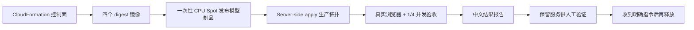

# MinWM 生产链路运行时、Trace 与播放延迟优化设计

## 1. 设计基线

本文档是
`2026-08-03-minwm-async-vae-multiuser-design.md` 的生产实施增量，不能以验证版
`NLB -> Denoiser Pod` 拓扑替代。最终实现和端到端测试必须覆盖：

```text
Browser / VLM
  -> NLB
  -> Realtime Gateway CPU Pool
  -> Session Coordinator CPU Pool
  -> Denoiser Worker Pool (H100 Spot)
  -> VAE Worker Pool (L4 Spot，必要时 L40S)
  -> Realtime Gateway
  -> Browser / VLM
```

Coordinator 负责全局准入、Worker 配对、容量槽 Lease 和 Session 生命周期。Gateway
持有公网 WebSocket，但不持有 GPU KV。Denoiser 只产生 latent，VAE 直接把编码后帧发送
到当前 Gateway 实例，媒体数据不绕回 Denoiser。

### 1.1 代码实现状态（2026-08-06）

| 能力 | 当前实现 |
| --- | --- |
| 多用户准入 | Gateway 有界等待队列；Coordinator 使用 DynamoDB 用户/Session/slot Lease |
| 两阶段预留 | Coordinator 先持久化 Lease，再向 Denoiser/VAE 幂等预留；部分失败回滚 |
| 粘性与 fencing | Session 固定绑定一个 Denoiser 和一个 VAE；token、generation、Worker epoch 同时校验 |
| Worker 生命周期 | heartbeat 上报 load/lifecycle/epoch；preStop 进入 Drain；失联或 epoch 变化使 renew 失败 |
| 异步 VAE | 每 Session 有界 latent 队列；进入全局 Decode actor 后才返 credit；VAE 跨 Session 公平排队 |
| 弹性 | 定时 scale-to-zero/预热与 Coordinator shared-capacity 事件扩容同时存在；缩容前检查 active/queued/draining |
| Trace | 视频 WS 不承载 Trace；浏览器批量 HTTP 上报，查询页按需读取 CloudWatch 最近 5 分钟聚合 |
| 发布 | digest、模型 `_READY`、DynamoDB schema/TTL、日志保留期门禁；失败时原地 SSA 滚动恢复发布前 spec |
| 身份安全 | 按本阶段范围交由上游内部服务；本实现不作为公网认证边界 |

真实 H100 Spot + L4 的最终并发、延迟和故障数据必须写入独立测试报告；在报告产生前，
本文只描述行为约束，不用单机模拟值替代生产结论。

## 2. 角色化预打包镜像

使用一个多阶段 BuildKit Dockerfile 生成四个不可变 ECR 镜像：

| 镜像 | 包含内容 | 不包含内容 |
| --- | --- | --- |
| Gateway | WebUI、WebSocket Gateway、Trace Query API、Coordinator Client | CUDA、模型权重 |
| Coordinator | Session/Worker Lease、DynamoDB Client、容量聚合 API | CUDA、模型权重、媒体转发 |
| Denoiser | CUDA/PyTorch、SGLang Diffusion、MinWM Converter、Denoiser Runtime | TAEHV Session state |
| VAE | CUDA/PyTorch、TAEHV、校验后的 `taew2_2.pth`、VAE Runtime | MinWM DiT checkpoint |

容器启动时禁止执行 `git clone`、`pip install`、GitHub 下载、TAEHV 下载或 checkpoint
转换。原始 checkpoint 由一次性 CPU Spot Publisher 转换成独立的版本化 S3 serving
artifact；每个文件写入 SHA-256 manifest，`_READY` 最后以条件写创建。Denoiser 只挂载
只读、已经 ready 的模型制品，不与代码镜像绑定，也不在 GPU 节点上执行转换。

镜像使用 Git SHA 与内容 digest 双重标识。Kubernetes Deployment 只接受 digest，回滚
通过切换 digest 完成。ECR 生命周期保留最近版本并清理未标记构建层。

## 3. Gateway 与 Coordinator

### 3.1 Gateway

Gateway 在读取 Generate Init 后调用 Coordinator：

1. 校验认证用户和请求配额。
2. 请求 `(Denoiser slot, VAE slot)` 原子配对。
3. 创建 `session_id`、`generation_id` 和短期 reservation token。
4. 连接指定 Denoiser，并注入 VAE 地址、Gateway 直传地址和 token。
5. 将 Action/Prompt 转发给 Denoiser。
6. 从 VAE 直传连接接收 `FrameBatch`，立即转发浏览器。
7. 关闭时幂等释放两个 Worker slot 和用户 Lease。

Gateway 使用 Pod IP 构造 Session 专属内部回传地址，避免 VAE 通过普通 Service 被路由到
错误 Gateway 实例。回传 token 绑定 `session_id + generation_id + expiry`，不能跨 Session
复用。

### 3.2 Coordinator

Coordinator 是独立 CPU Deployment，提供 Worker heartbeat、Session admit/renew/release
接口。生产状态使用 DynamoDB On-Demand：

- `USER#<user>`：每用户单活动 Session Lease。
- `WORKER#<worker>#SLOT#<n>`：Denoiser/VAE 有界容量槽 Lease。
- `WORKER#<worker>`：带 TTL 的 Worker heartbeat 与兼容性元数据。
- `SESSION#<session>`：Gateway、Worker 配对与 generation fencing。

准入事务必须同时获得用户 Lease、一个 Denoiser slot 和一个 VAE slot；部分失败不能留下
孤立 reservation。Coordinator Pod 可水平扩容，状态不依赖进程内内存。Spot 不足时不切
On-Demand，10 秒内无法获得完整配对则返回 `Retry-After`。

执行真实 DynamoDB 建表或写入前，必须按仓库规则再次展示精确表结构、Region、影响和
清理命令并获得人工确认。

## 4. VAE 直传协议

`SessionOpen` 和 `LatentChunk` 增加 `trace_id`、`traceparent`、Gateway output URL 与短期
token。VAE 保留到 Denoiser 的控制连接，用于 credit、reject 和 chunk completion；编码
后的 `FrameBatch` 通过独立 WebSocket 直接发往 Gateway。

Gateway 只有在验证 Session identity、generation、token、chunk 单调性后才接受帧。每个
Session 的 Gateway 输出队列有界，满时优先丢弃已被新 Action 取代的旧帧；持续背压则关闭
Session，禁止无界占用内存。

## 5. Trace 完全拆分

视频 WebSocket 只允许以下业务消息：

- Generate Init、Action、Prompt、Heartbeat、Close。
- Session Ready/Error 与必要控制 ACK。
- FrameBatch 媒体数据。

服务端 Trace 不再进入视频 WebSocket。Gateway、Coordinator、Denoiser、VAE 使用 OTLP
把全量 Span/时序事件发给 ADOT Collector，Collector 批量写 CloudWatch Logs，保留 5 天。
Trace 不携带原始 prompt、图片、视频、latent 或 KV。

浏览器自身的 decode/canvas/display 指标使用独立、批量 HTTP POST 上报 Gateway，失败不
影响生成。Trace 页使用独立 HTTP Query API：

- 只有页面打开时才查询。
- 默认查询最近 5 分钟的 P50/P95/平均值及指定 `trace_id` 的最新事件。
- Gateway 对相同查询缓存 15 秒，限制并发和扫描时间。
- 相同 Trace Query 合并为一个 CloudWatch Logs Insights 请求；不同查询使用全局有界并发，
  单个浏览器取消请求不会取消共享查询。
- Query API 使用服务端 IAM 查询 CloudWatch，浏览器不持有 AWS 凭证。
- CloudWatch 尚未完成 ingestion 时显示上一次成功结果，不闪烁为 `-`。

本地内存可以作为 15 秒查询结果 cache，但不能作为 Trace 权威存储。

## 6. Display Lag 优化

Live 模式默认目标是 100–200ms 而不是原来的 220–420ms：

- `lowLatencyPlayback: true`
- `holdForTargetLead: false`
- target lead 80–180ms
- startup/resume lead 为一帧
- delivery jitter boost 最大 60ms
- Action generation cutover 时旧 event grace 为 0
- VAE 每个 encoded frame batch 默认 1 帧，数据可用即发送
- 每 Session 只允许 1 个等待 latent；与正在 Decode 的 Chunk 形成双缓冲，但不允许旧
  Action 的多个未来 Chunk 在 VAE 前排队

Timeline 模式保持不丢帧。Live 模式允许丢弃已经过时的旧 Action 帧；若生成吞吐持续低于
目标 FPS，播放速度跟随真实 source FPS，不能靠堆积缓存伪造流畅。

## 7. 生产部署与伸缩

- Gateway 和 Coordinator 跨 AZ，各最少 2 个 CPU Pod。
- H100 Denoiser 与 L4/L40S VAE 使用独立 Spot NodePool 和独立 HPA/KEDA 指标。
- Denoiser 依据可用 slot、排队时间、GPU 利用率扩缩；VAE 依据 queue wait、decode P95、
  活跃 decoder context 扩缩。
- GPU 池采用定时预热加事件驱动扩容，夜间可缩到 0。
- 所有队列、Lease、Trace cache 和 Session 都有 TTL 与硬上限。
- PDB 只保护 CPU 控制面；Spot GPU Worker 不做状态复制，故障后用户重试。

## 8. 验收标准

端到端测试不能直连 Denoiser，必须从 NLB 进入 Gateway，并验证：

1. Coordinator 返回真实 Denoiser/VAE 配对，Lease 可续约和幂等释放。
2. VAE FrameBatch 直接进入 Gateway，Denoiser WebSocket 不携带媒体帧。
3. 视频 WebSocket 中不存在 `trace_event/trace_events/client_trace`。
4. Trace HTTP 页面能够读取 CloudWatch 结果，关闭 Trace 页后停止查询。
5. Pod 启动日志不存在 git/pip/curl 安装，镜像 digest 可追溯。
6. Warm session 的 display lag 输出 P50/P95，目标 P95 不高于 250ms；若公网抖动导致
   未达标，报告必须分离 server-to-gateway 与 browser queue 两部分证据。
7. 完成单用户正确性、至少 4 并发 Session、Action/Prompt 更新、异常断开和 Worker
   故障测试。
8. 本轮测试完成后保留 H100 Spot、L4、控制面和 NLB 供人工验证；只有收到明确清理指令后
   才执行释放，并在释放后确认计费 GPU 为 0。

## 9. 基础设施、权限与数据生命周期

AWS 控制面使用一份 CloudFormation 模板声明，避免脚本边运行边创建隐式资源：

| 资源 | 生产配置 | 生命周期 |
| --- | --- | --- |
| DynamoDB | PAY_PER_REQUEST、TTL、SSE、allocation GSI | 测试栈删除时删除 |
| CloudWatch Logs | Trace 专属 Log Group | 固定保留 5 天 |
| ECR | immutable tag、push scan、清理未标记层 | 栈删除时保留 |
| IRSA | Gateway/Coordinator/ADOT/Publisher 四个最小权限角色 | 随栈删除 |
| S3 serving artifact | 版本化路径、manifest、条件 `_READY` | 默认保留复用 |

Gateway 只能查询指定 Log Group；Coordinator 只能读写指定 DynamoDB 表；ADOT 只能写指定
Log Group/X-Ray；Publisher 只能读取原 checkpoint 并写指定 serving artifact prefix，不能
删除对象。应用 namespace 使用 default-deny NetworkPolicy，仅开放 Gateway、Coordinator、
Denoiser、VAE、ADOT 之间必需端口。公网 NLB 只选择 Gateway。

## 10. 标准发布、回滚与清理



部署脚本在 apply 前执行只读门禁：DynamoDB 必须存在、Trace Log Group 必须是 5 天、模型
`_READY` 必须存在、所有镜像必须是 SHA-256 digest，且渲染后不能残留 placeholder。

应用失败时使用发布前 workload spec 做原地 Server-Side Apply。CPU Deployment
保持 Kubernetes 滚动恢复；Denoiser StatefulSet 使用 `Parallel + OnDelete`，发布和回滚
都按 2 个 Pod 一批执行 `2 -> 2 -> 2 -> 2` 替换。每批必须确认旧 Pod 已删除、同名新
Pod 已创建且全部 Ready，才允许进入下一批，因此正常发布期间至少保留 6 张 H100 服务。
发布窗口内承载 Denoiser 的节点临时标记 `karpenter.sh/do-not-disrupt`，避免节点因短暂空闲
被回收。宿主机 `flock` 同样把高内存冷加载并发限制为 2，与滚动批大小保持一致。
Coordinator Schema 保持向后兼容。GPU Worker 不做状态迁移，回滚或 Spot 中断
只影响绑定 Session，用户重试后重新准入。清理脚本只能在明确指令后执行，并必须验证计费
GPU、NLB 与 namespace 残留；ECR 和模型制品默认保留以降低下次部署成本。

## 11. 运维门禁与扩容路径

- 初始低成本规模：2 Gateway、2 Coordinator、1 H100 Spot、1 L4 Spot；夜间 GPU 缩到 0。
- Gateway/Coordinator 通过 HPA 横向扩展；GPU 池先按定时计划预热，再依据 Worker slot、
  queue wait、decode/denoise P95 扩容。单个 Deployment/NodePool 上限为 8，扩容前必须通过
  同档并发压测更新每 Worker 的准入容量。
- 关键告警：准入等待、slot 冲突、Worker 心跳丢失、latent queue 满、VAE decode P95、
  action-to-visible-frame、browser display lag、OTLP export failure、Spot interruption。
- 当前 Region 容量不足时返回可重试容量错误，不自动切换 On-Demand，避免成本失控。
- 扩到多 AZ 时 CPU 控制面保持跨 AZ；GPU 优先同 AZ 配对。跨 AZ handoff 只有在实测 P99
  和流量成本均满足预算后开启。
