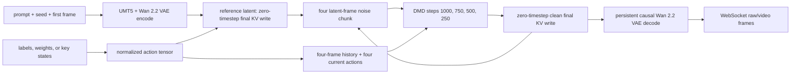

# MinWM 5B DMD realtime integration

This document is the implementation log for serving the current `main` branch of
`~/workspace/minWM` through SGLang's realtime video API. It is intentionally more
specific than a user guide: decisions that can affect numerical parity are recorded
here as part of the compatibility contract.

中文版：[MinWM 5B DMD 实时推理接入](/cookbook/diffusion/MinWM/MinWM-Realtime.zh-CN)。

## Scope and immutable inputs

- minWM source of truth: `/Users/chenshengdong/workspace/minWM`, branch `main`, pinned
  to `2efc6485f65e8fcab506665efde79bc41406385e` for the latest-checkpoint rerun.
- SGLang source of truth: this worktree, based on commit `d9a7e0e663`.
- Latest-checkpoint rerun input:
  `s3://leap-world-us-west-2/world-model/minwm/checkpoints/run-archive/rolling/Wan21/Action2V/dmd/wan22-5B-stage3-dmd-8-0721-6a531f0e067/global_step_003200/ema_student/model.pt`.
- The latest source object is `10,007,171,771` bytes, VersionId
  `x.2zYaRRNzyqngI7O_cYSrsK3NvgPKKt`, ETag
  `5c29d614972e06fd0df859abfd1d6f4d-191`, and CRC64NVME
  `I0IQ+p0pREI=`. The verified east-region staging copy is VersionId
  `wduScksw2f3yPErnG9lBioOuE2AToyAP` with the same byte count and CRC64NVME. The
  SHA-256 observed inside the B200 container is
  `1dc42d498cad84349987db2015120ce4d77e6b641f7f38c75ec9df3f942a7975`.
- Historical accepted checkpoint:
  `s3://leap-world-us-west-2/world-model/minwm/checkpoints/run-archive/rolling/Wan21/Action2V/dmd/wan22-5B-varlen-stage3-0713-2-5888cc42/global_step_005600/ema_student/model.pt`.
- The historical object size is `10,007,171,771` bytes; west-region version
  `FbCvgw5rl1UXt9MKBgpxYpb4BJoUyUEi`; ETag
  `56dbc7ce13f26c55d0bfd255e471d318-191`.
- East-region benchmark staging object: version
  `ZXEDIMY8ru1wJY7k0u5EO4ljjAHod8MV`, ETag
  `f876ca9467f0075111809213f1032fe6-1193`, CRC64NVME
  `+6CzzhS6EUo=`. Its size is identical to the source object.
- Runtime backbone: Wan2.2 TI2V 5B, 48 latent channels, 30 transformer blocks,
  24 attention heads, hidden width 3072, patch size `(1, 2, 2)`.
- Native serving geometry: 832x480 pixels, four generated latent frames per
  realtime chunk, temporal VAE ratio 4.

<Warning>
  This page preserves both the historical checkpoint results and the formal
  latest-checkpoint results. Every number must be read with its artifact path;
  do not extrapolate across checkpoints.
</Warning>

### Latest-checkpoint one-case smoke

The 2026-07-22 west-region Spot B200 attempt 06 completed a real baseline/API
comparison under Torch `2.11.0+cu130`, Diffusers `0.37.0`, and Transformers
`5.12.1` on an NVIDIA B200. For `00_forward_pottery`, both sides received the same
prompt, seed, first frame, and exact action labels. Their output shape was
`[65, 480, 832, 3]` and the result was **bitwise equal**, with `max_abs=0` and
`changed_value_fraction=0.0`. Baseline end-to-end time was `19.9105 s`; it includes
initialization/compilation and video encoding and is not a steady-state FPS value.

The smoke artifact is at
`s3://leap-world-us-east-2/world-model/evals/minwm/realtime-parity/20260722-codex-578d/results/latest-ckpt-v5-smoke-attempt06-west-spot/`.
The attempt returned nonzero only afterward because `cp -a` tried to preserve POSIX
directory timestamps on the S3 mount. The bitwise summary had already been written;
the formal run now uses recursive copies without timestamp preservation.

### Formal ten-case result for the latest checkpoint

West-region Spot B200 attempt 07 used the same pinned runtime as the smoke test and
completed ten baseline/API comparisons with identical prompt, seed, first frame,
and exact action labels. All ten passed the strict `bitwise` profile:
`all_generated_bitwise=true`, generated-frame `max_abs=0`, `RMSE=0.0`, and minimum
`SSIM=1.0`. No relaxed tolerance was used. Each side produced a 65-frame video, so
the formal artifact contains ten pairs and 20 MP4 files.

```text
s3://leap-world-us-east-2/world-model/evals/minwm/realtime-parity/20260722-codex-578d/results/latest-ckpt-v6-full-attempt07-west-spot/ten-case/
```

The first baseline case included compilation and took `14.162 s` end to end; the
remaining nine took `5.944`–`6.214 s`. These include four-chunk generation, decode,
and video output and must not replace the 20-warmup + 200-measured-chunk serving
profiles below.

### 720p approximately-five-second rerun

H200 attempt 15 on 2026-07-22/23 used the same requested 0721 checkpoint for three
baseline/API pairs at `1248x704`, 24 FPS, 129 frames (5.375 seconds), and eight
chunks. The actions were continuous `w=0.8`, idle, and continuous
`w=0.6 + l=0.4`. All three passed strict bitwise with generated-frame
`max_abs=0`, `RMSE=0`, and `SSIM=1.0`; no tolerance fallback was enabled. All six
MP4 files were read back and verified as 1248x704, 24 FPS, and 129 frames.
The effective inference overlay SHA-256 was
`f8f841e1f4dac714b07d81c2438f80dbedb8dcd9921b6574ba9e2aaabf254d9a`.

On this single H200, batch-one, native-full-history run, aggregate steady client
throughput was `10.393 FPS`, scheduler throughput was `10.365 FPS`, chunk p50 was
`1525.20 ms`, and peak GPU memory was `53,159 MB`. The first case had a `10.343 s`
TTFF because it includes minWM's first-shape native fused-segment compilation; the
next two TTFF values were `1.963 s` and `1.960 s`. These are H200 720p long-history
numbers and do not replace the formal B200 832x480 throughput matrix below.

The local flat player and machine-readable results are under
`benchmark/minwm_realtime_parity/results/latest-checkpoint-720p-5s-h200/latest/`.
Its `player/index.html` provides synchronized play, seek, rate, and frame stepping
for each pair.

Both checkpoint paths contain `stage3`, although the requested model is described as
"stage4 DMD". No filename-based reinterpretation is applied. The latest object's
native matching config is the non-varlen `wan22_5b_dmd.yaml`; the first-frame API
comparison intentionally uses the V3 compatibility contract. Both the naming and
inference-contract discrepancy must remain visible in benchmark reports.

## Compatibility contract

The action type is **not** a continuous camera pose or Plucker ray condition. It is
the current main branch's `primitive_token_residual` conditioner:

- Input: either one integer label in `[0, 80]` per latent frame, or a
  `[B,F,S,8]` per-pixel-frame action-weight window; `S=4` for the current VAE.
- Ontology: Cartesian product of nine translation states and nine look states.
- Primitive order: `[w, a, s, d, i, j, k, l]`.
- Encoder: two five-entry primitive embeddings, residual fuse MLP, two causal
  Conv1d blocks with kernel size 3, then projection to the 3072-wide patch token.
- Receptive field: four historical action frames. Every generated four-frame chunk
  therefore receives `history[-4:] + current[0:4]`; only the final four encoded
  frame states are injected into the current patch tokens.
- Label 0 is noop. The reference frame is committed with label 0.

The API accepts `action_labels`, `action_weights`, or key-state `camera_actions`;
one input may select only one form. Each `action_weights` row is ordered
`[w,a,s,d,i,j,k,l]`, and every item must be a finite number in `[0,1]`. For
example, `w 0.8` is `[0.8,0,0,0,0,0,0,0]`. Magnitude is optional: labels and key
states are binary shortcuts, and label 9 is equivalent to four pixel-frame rows
with `w=1.0`. Continuous weights are embedded per pixel frame and averaged inside
each four-frame window; they are not velocity, displacement, or camera pose.
Parity replay must use the same representation on both sides so a different GEMM
batch shape is not mistaken for an action-semantic error.

The primitive single-key labels used by the benchmark are:

| key state | bits `[w,a,s,d,i,j,k,l]` | label |
| --- | --- | ---: |
| idle | `00000000` | 0 |
| `l`, `j`, `i`, `k` | one look bit | 1, 2, 3, 4 |
| `w`, `s`, `a`, `d` | one translation bit | 9, 18, 27, 36 |
| `w+l` | `10000001` | 10 |

## API quick start

After converting the checkpoint with
`python/sglang/multimodal_gen/tools/convert_minwm_checkpoint.py`, start the API:

```bash
sglang serve \
  --model-path /path/to/sglang-model \
  --pipeline-class-name MinWMCausalDMDPipeline \
  --attention-backend fa \
  --performance-mode speed \
  --enable-torch-compile false \
  --port 30000
```

`enable_autocast=false` is part of `MinWMCausalDMDConfig`, so no parity-only CLI
flag is required. The realtime endpoint is
`ws://127.0.0.1:30000/v1/realtime_video/generate`; its init event is MsgPack. For a
bounded four-chunk request, the relevant fields are:

```python
request = {
    "type": "init",
    "model": "minwm",
    "prompt": prompt,
    "first_frame": open(first_frame_path, "rb").read(),
    "size": "832x480",
    "fps": 24,
    "seed": 42,
    "generator_device": "cuda",
    "num_inference_steps": 4,
    "guidance_scale": 0.0,
    "max_chunks": 4,
    "realtime_output_format": "raw",
    "condition_inputs": {"action_labels": [10] * 16},
}
```

The 16 labels are latent-frame actions: four labels are consumed for each chunk.
The archived 0721 checkpoint inherited the `label_81` training-dataloader contract,
so binary `w` (magnitude one) remains its canonical in-distribution input. `w=0.8`
is a continuous interpolation interface supported by the current minWM `main`
conditioner; it is optional and is not a calibrated physical speed without a
separate controllability evaluation. For continuous magnitude, pass for example
`{"action_weights": [[0.8,0,0,0,0,0,0,0]] * 64}`. The 64 rows are four chunks
times 16 decoded-frame intervals per chunk; the adapter groups every four rows into
one latent action window. An interactive unbounded session may receive subsequent
`action_labels`, `action_weights`, `camera_actions`, or `prompt` events. Only
bounded sessions can reproduce V3's one-shot full-horizon RNG allocation exactly.

minWM `main` sets `local_attn_size=-1` and `sink_size=0`, so its native KV semantic
retains all history; it is not a 45- or 128-frame sliding window. SGLang now matches
that default. A bounded `max_chunks=N` request preallocates `1 + 4N` latent frames,
including the reference; an unbounded session grows the cache on demand.
`realtime_causal_kv_cache_num_frames` remains an explicit bounded performance
override and no longer represents the native minWM contract.

The current minWM eval's 720p tier is `1248x704`. Exact `1280x720` produces 45
latent rows after VAE `/16`, which the DiT's `2x2` spatial patch cannot divide. At
24 FPS with fixed 16-decoded-frame chunks, exactly 5.000 seconds is also impossible:
eight chunks plus the reference are 129 frames, or 5.375 seconds. The benchmark
does not hide either boundary with a resize or trim.

## Realtime data flow



The first frame is a clean causal context, not a channel-concatenated I2V mask. On
chunk zero it is VAE-encoded once, forwarded at timestep zero to commit transformer
KV and cross-attention KV, and fed to the residual VAE decoder before the first
generated latent chunk. Later chunks retain both transformer and VAE state.

## Major decisions

| ID | Decision | Reason and parity impact |
| --- | --- | --- |
| D1 | Reuse SGLang's causal Wan block/cache implementation and add a post-patch action hook. | The current minWM 5B model uses absolute RoPE and caches roped K/V, which matches SGLang's causal Wan path. Duplicating the 5B backbone would create another numerical surface. |
| D2 | Add a MinWM-specific denoising stage. | LingBot World concatenates a 20-channel I2V condition on every chunk. minWM V3 instead commits one clean reference latent and generates pure 48-channel chunks. |
| D3 | Use exact 81-class labels as the canonical binary representation and explicit eight-dimensional weights for continuous magnitude. | Key lists are convenient but can hide label ordering and sampling-rate mistakes. Binary benchmarks use labels; key lists are only a deterministic adapter and cannot express magnitude. |
| D4 | Keep the RNG tensor layout `[B, F, C, H, W]` before converting to SGLang's `[B, C, F, H, W]`. | `torch.randn` fill order depends on shape. Drawing directly in SGLang layout breaks same-seed parity before the first model call. |
| D5 | Use 832x480 by default. | The checkpoint's inherited trainer config is 832x480. Current main's eval overlay changed to 1248x704 after the archived run and is treated as configuration drift, not checkpoint metadata. |
| D6 | Convert `model.pt` to a self-contained Diffusers-layout serving directory. | SGLang should not import the sibling minWM checkout at runtime. The converter validates backbone/action tensors before writing weights. |
| D7 | Require `max_chunks` for fixed-horizon exact-RNG parity. | V3 draws one contiguous BFCHW noise tensor for the reference plus the entire generated sequence, then overwrites the reference slice. The realtime stage pre-draws the same bounded tensor, discards the reference slice, and serves chunk views from it. An unbounded session remains valid but cannot claim fixed-horizon bitwise RNG equivalence. |
| D8 | Override the generic DMD clean-prediction arithmetic with minWM's fp32 arithmetic. | minWM's `pred_x0_from_flow` computes `xt - sigma * flow` in fp32. SGLang's reusable causal stage stabilizes this calculation in fp64; retaining that generic behavior would introduce an avoidable numerical difference. |
| D9 | Normalize API guidance to zero. | The distilled student has no unconditional/CFG lane, while the shared realtime protocol defaults guidance to one. The MinWM adapter always selects the four DMD steps and sets `guidance_scale=0`. |
| D10 | Preserve minWM's 512-position zero-padded text context. | Current main zeros UMT5 outputs after the real token length but clamps `prompt_lens` to 512. Trimming to the real token count looks conventional but changes cross-attention normalization; SGLang therefore sends the same real embeddings followed by zero K/V positions through index 511. |
| D11 | Require native diffusers VAE and HF UMT5 only for the MinWM pipeline. | An initial B200 run using SGLang's optimized Wan VAE/T5 began with exact generated noise but already differed in the reference latent and prompt embedding. Causal rollout amplified those small component differences. The DiT remains resident in SGLang; only the two baseline-native boundary components bypass optimized loaders. |
| D12 | Make deterministic attention/kernels part of the parity profile. | Before determinism was locked, two independent minWM baseline runs with the same case and seed produced different lossless frame hashes. Same-seed parity is not meaningful unless deterministic flags, GPU model, software versions, and attention backend are recorded together. |
| D13 | Disable autocast for this pipeline while retaining BF16 module weights and inputs. | minWM main calls its BF16 VAE and DiT directly. SGLang's default BF16 autocast scope can select different promotion/kernel behavior even though the declared tensor dtype is unchanged. The MinWM pipeline config therefore sets `enable_autocast=false`; callers do not need a special CLI flag. |
| D14 | Preserve the packed processor's FP16 reference-latent wire boundary. | minWM's VAE wrapper computes a BF16-normalized posterior and returns FP32, but `WanPackedProcessor` stores the reference as FP16 before V3 casts it to BF16. SGLang serves in one process, so it explicitly applies BF16→FP16→BF16 after VAE normalization to reproduce that otherwise hidden quantization. |
| D15 | Use minWM's RMSNorm rounding order for self- and cross-attention Q/K. | minWM normalizes in FP32, casts the normalized value to BF16, and only then multiplies by its BF16 weight. SGLang's generic native RMSNorm multiplies in FP32 and casts afterward. The MinWM subclass replaces only the four Q/K norms per block while preserving checkpoint parameter names. |
| D16 | Use minWM's explicit FP32 interleaved RoPE formula. | The frequency table and absolute positions already matched, but SGLang's generic CUDA path applies the rotation with a Triton kernel. A MinWM-only self-attention hook now performs the same FP32 real/imaginary arithmetic and BF16 output cast as `main`; other causal Wan models retain the optimized kernel. |
| D17 | Reproduce the non-Triton AdaLN, gate, residual, and final-head promotion boundaries from minWM `main`. | The baseline does not set `TRITON_ADALN=1`. Its block path keeps LayerNorm output in FP32 through shift/scale modulation, BF16-adds shift and scale operands, FP32-adds the separately promoted gate operands, accumulates gated residuals in FP32, and performs the bare cross-attention residual in BF16. Generic SGLang fused residual/norm helpers do not share this exact order, so MinWM has a block/head subclass while other Wan models keep their optimized path. |
| D18 | Use minWM's packed-varlen deterministic FA4 call for both self- and cross-attention. | An early experiment appeared worse because its block-token input had different strides even though the values were bitwise equal. After matching source token materialization, Q/K/V became bitwise equal and the source-shaped packed call was necessary to make the idle case bitwise equal through latent decode and RGB output. |
| D19 | Use native `Conv3d` and reproduce minWM's token materialization boundaries. | minWM calls its `nn.Conv3d` directly, then `_pack_embed` and the action helper materialize token tensors with `torch.cat`. SGLang's shared patch path can linearize the convolution, and adding a broadcast action residual can leave a value-equal `[B,S,D]` tensor with feature-major strides. MinWM overrides the convolution and explicitly materializes the action residual and post-action block input so the source and serving block inputs have identical values and strides. |
| D20 | Run MinWM pixel reconstruction before the VAE BF16 cast. | The generic image stage normalized pixels in FP32 and then cast them to BF16 before invoking the model hook. At that point 256 uint8 levels had already collapsed to 240 recoverable values. MinWM opts into the pre-cast hook, reconstructs the exact uint8 grid in FP32, and only then performs its BF16 `div(127.5)-1`; the recorded VAE input and reference frame are now bitwise equal. |
| D21 | Compile only the same fused segments as minWM main; keep whole-DiT compile disabled by default. | Current main dynamically compiles AdaLN, affine norm, RMSNorm, and QK+RoPE helper graphs even when the surrounding model remains eager. Reproducing those graph boundaries reduced the corrected-boundary idle latent RMSE from `0.2835` to `0.2391`. `--performance-mode speed` would otherwise enable whole-model compile, which is a different numerical profile, so the benchmark explicitly passes `--enable-torch-compile false`. |
| D22 | Expand the full timestep modulation tensor with token-level advanced indexing before selecting its six AdaLN slices. | minWM inference constructs `e0` as `[B,F,6,D][:, frame_index]`. Expanding six slices independently has equal values but different strides. The MinWM block and head preserve the source layout so compiled helper inputs have the same shape and stride contract. |
| D23 | Preserve failed formal results and do not widen the checked-in tolerance to observed error. | The earlier same-runtime ten-case run made all ten reference frames bitwise equal but no generated case passed the provisional BF16 profile. It remains a diagnostic artifact even though later fixes supersede it; observed failures were never converted into looser acceptance limits. |
| D24 | Treat tensor layout and stride as part of the parity contract, not only values, shapes, and dtypes. | CUDA GEMM and attention dispatch may choose different kernels or memory-access paths for a noncontiguous value-equal tensor. The parity trace therefore records contiguity and stride at operator boundaries, and regression tests require source-shaped action-token materialization. |
| D25 | Evaluate a backend substitution only after its inputs are bitwise and layout equal. | Dense FA4 initially benefited from accidental upstream error cancellation, making the source-shaped packed call appear worse. Once block inputs and Q/K/V were exact, packed deterministic FA4 removed the first true discrepancy and produced an all-zero idle-case report. |
| D26 | Report the latest non-varlen checkpoint through two explicitly separated contracts. | Its matching `wan22_5b_dmd.yaml` path is causal T2V and has no first-frame processor, while the product/API requirement is first-frame plus `primitive_token_residual` action. The 10-case API rerun therefore uses the V3 compatibility path and is labeled non-native; a matching-config run may validate weight loading and speed but cannot be called first-frame parity. |
| D27 | Omit the unused `sglang.srt.grpc` Rust extension from the diffusion-only benchmark install when the pinned image has no Rust compiler. | The extension is not imported by the multimodal diffusion HTTP/WebSocket server. Attempt 03 otherwise failed while building the package, before model loading. The benchmark records this packaging-only omission; it does not replace or patch any inference kernel. |
| D28 | Remove the training image's stale optional `peft==0.17.0` instead of changing SGLang's pinned Transformers/Diffusers. | The installed SGLang runtime uses Transformers 5.12.1 and Diffusers 0.37.0; the old PEFT fails before model loading by importing the removed `HybridCache`. The realtime benchmark does not load LoRA, so removing an optional package that Diffusers auto-detects changes neither the inference graph nor steady-state throughput. The runtime manifest records `peft_installed=false`. |
| D29 | Sequentially stage the donor tree from the S3 CSI mount onto local NVMe before safetensors mmap. | Direct mmap through mountpoint-s3 turns weight page faults into many small remote reads; attempt 05 consequently spent a long GPU-idle interval in `folio_wait_bit_common`. Local staging changes startup I/O only, preserves file bytes and inference numerics, and lets the baseline, API, and profiles reuse one local donor tree. |
| D30 | Validate transport `frame_batch` objects separately from semantic model chunks, and mark latency complete only on the final batch. | Chunk 0 is transported as two batches: 16 generated frames and one reference frame; later chunks normally use one 16-frame batch. The first attempt-07 throughput client incorrectly required every batch to be a complete 17-frame chunk and failed before steady-state measurement. The corrected client validates local batch size, index, and final flag before aggregating and validating the chunk total. This did not affect ten-case inference or parity. |
| D31 | Expose continuous `action_weights` as a first-class `primitive_token_residual` API input while retaining 81-class labels. | minWM `main` natively accepts `[B,F,S,8]` weights; the earlier SGLang adapter exposed only labels and could not represent `w=0.8`. The API now validates `[0,1]`, windows rows by the VAE temporal factor, and forbids changing action tensor rank within a session. |
| D32 | Make unbounded history the default KV contract; retain 45/128 only as explicit benchmark overrides. | The `model_wan22_5B.yaml` source of truth is `local_attn_size=-1,sink_size=0`. Bounded requests preallocate their complete horizon and unbounded requests allow cache growth, so historical performance experiments cannot silently redefine model semantics. |
| D33 | Use 1248x704 and 129 frames for the 720p long-video regression instead of silently resizing or trimming to exactly five seconds. | This is current minWM eval's legal 720p tier; 1280x720 is incompatible with the DiT patch geometry. `129/24=5.375` seconds is eight complete realtime chunks plus the reference and preserves model and transport boundaries. |
| D34 | Enable whole-DiT compile by default only after that compiled path passes strict bitwise; keep it disabled now. | The first 1248x704 graph on Torch 2.11 fails in Inductor post-grad with `FakeTensor * Node`, before any comparable output exists. The earlier 832x480 whole-compile profile is also only a non-parity performance ceiling. Production therefore retains only the fused-segment compilation boundaries used by minWM `main`. |
| D35 | Select FA4/FA3/FA2 with the same device-and-availability fallback as minWM `main`; never force FA4 on Hopper. | The first H200 720p run used FA2 in the baseline but FA4 in SGLang and diverged at the first generated frame, even for idle action. Matching the source backend removes a hardware-dependent numerical-contract violation while leaving the B200 FA4 path unchanged. |
| D36 | Propagate the unbounded-cache `allow_growth` policy through the common cache initializer. | The allocator already supported growth, but the initializer dropped the argument. The first native-KV long run exposed this only at runtime; a unit regression now proves that the MinWM policy reaches every per-block cache. |
| D37 | Publish an artifact-ready marker only after the full result tree is copied, then keep a 120-second capture window. | The first successful H200 long run wrote its summary before copying roughly 2 GB of output. The external collector declared completion too early, and Kubernetes reclaimed the emptyDir when the pod exited. The explicit marker separates inference completion from export readiness. |
| D38 | Return identity metrics immediately for lossless arrays already proven `array_equal`. | The old comparator still converted exact 720p pairs into multiple float64 arrays and repeated cosine and per-frame SSIM work. The fast path runs only after byte equality is established, so the conclusion is mathematically unchanged while avoiding pointless CPU and memory cost. |
| D39 | Reject every non-unit SP setting until MinWM actually implements Ulysses/Ring. | The current batch never enters sequence sharding and the source-shaped packed attention has no all-to-all; silently accepting the flags would make duplicated multi-GPU work look like useful acceleration. Causal KV ownership, action history, absolute positions, and output gather must be designed together and revalidated for parity. |
| D40 | Enable the first causal Ulysses phase only for `sp_degree == ulysses_degree > 1` with `ring_degree == 1`. | MinWM now shards contiguous patch/action tokens, packs RoPE-applied Q/K/V into one input all-to-all, stores only local attention heads in the full-history causal KV cache, reverses the collective after attention, and gathers projected output tokens before scheduler and VAE work. Head divisibility is mandatory; Ring, TP+SP, FSDP+SP, and whole-DiT compile+SP remain rejected. |

<Warning>
  The causal Ulysses implementation has local unit and isolated runtime coverage,
  but this document does not yet contain the SP2/SP4/SP8 GPU parity and performance
  matrix. Do not reuse the historical SP1 results as evidence for multi-GPU
  bitwise equality or speedup.
</Warning>

## Differences discovered during implementation

1. The existing SGLang MinWM feature branch targets an older Wan2.1 1.3B
   camera/PRoPE model. It cannot be cherry-picked for this checkpoint: this model is
   Wan2.2 5B, `use_camera: false`, absolute RoPE, and discrete token-residual action.
2. LingBot World's first-frame conditioning is structurally different from minWM's
   V3 processor path. Only its WebSocket session/control plumbing is reused.
<Note>
  The latest `wan22-5B-stage3-dmd-8` checkpoint is from a non-varlen run. Its
  matching `eval/wan22_5b_dmd.yaml` pipeline does pass action chunks into the DiT,
  but it is a T2V path without a first-frame processor. Loading those weights via
  V3 is a deliberate API compatibility test, not the checkpoint's native eval.
</Note>

3. Current minWM `eval/wan22_5b_varlen_dmd.yaml` says 1248x704 and 31 latent frames;
   the inherited training defaults for this archived checkpoint are 832x480 and 20
   latent frames. The parity suite locks the latter.
4. Bitwise equality is not assumed across attention backends. The suite first tests
   tensor equality and, if it fails, reports max/mean absolute error, RMSE, cosine
   similarity, decoded RGB PSNR, and SSIM against explicit tolerances.
5. Same-seed noise was not initially sufficient for parity: splitting a CUDA
   `randn` call by realtime chunk changes the generated sequence. Bounded sessions
   now consume the reference plus full generation horizon in one BFCHW draw, just
   like V3.
6. The common realtime request defaults are not model-neutral for this student.
   Four inference steps and guidance zero are enforced by the adapter rather than
   trusted from client defaults.
7. A CPU unit test comparing one full-sequence action convolution with an
   equivalent `history + chunk` convolution observed a maximum `5.96e-8` drift.
   PyTorch selected an accumulation path that depends on input length. This test
   uses `atol=1e-7, rtol=1e-6`; the real parity paths both use the same bounded
   `history + chunk` shape and still retain a bitwise-first acceptance gate.
8. minWM does not use the ordinary "trim text to the attention mask" convention.
   Its UMT5 wrapper keeps a minimum cross-attention length of 512 while explicitly
   zeroing padded embeddings. This was discovered by tracing `prompt_lens` into the
   packed inference attention and is now covered by a regression test.
9. SGLang's base `PipelineConfig.postprocess_image_latent` prepends four temporal
   mask channels for ordinary TI2V models. Inheriting it made the first real API
   request reach patchify with 52 channels (`208` values per 2x2 patch) while this
   checkpoint accepts exactly 48 (`192` values). The MinWM config now returns the
   normalized VAE latent unchanged and asserts its channel count.
10. minWM V3 loads the donor transformer during construction and only then replaces
    it with `model.pt`. The baseline therefore needs the complete donor directory;
    the serving converter intentionally excludes that donor DiT so SGLang cannot
    accidentally serve it.
11. The bounded RNG implementation was validated directly: the first generated
    BF16 latent entering the API DiT was bitwise equal to baseline. The earlier
    end-to-end failure was therefore not caused by seed reset, tensor layout, or a
    missing reference RNG draw.
12. With optimized boundary components, the first-frame VAE latent had RMSE
    `6.48e-3` and the prompt embedding RMSE `7.15e-4` against baseline. With the
    generated input already bitwise equal, the first generated DiT flow still had
    RMSE `2.09e-2`. By the fourth causal chunk, decoded error had grown to RMSE
    `25.30` uint8 levels. These are diagnostic observations, not accepted
    tolerances.
13. Disabling whole-DiT `torch.compile` left the failed run essentially unchanged
    (`19.0069` versus `19.0054` generated-video RMSE). Compile is therefore not the
    root cause of that discrepancy; component and operator parity must be fixed or
    explicitly bounded instead.
14. After switching to the native VAE/UMT5 and matching pixel/statistics arithmetic,
    the prompt embedding became bitwise equal and the first generated noise remained
    bitwise equal. The reference latent was still at RMSE `4.87e-3`, the first
    generated DiT output at RMSE `1.76e-2`, and the 64 generated RGB frames at RMSE
    `13.32`. Boundary-component selection alone was therefore necessary but not
    sufficient.
15. The remaining reference/DiT boundary drift exposed an implicit execution-mode
    difference: minWM main performs direct BF16 forwards, whereas the generic SGLang
    stages enter BF16 autocast. The pipeline now disables autocast by configuration;
    the effect is measured separately before any tolerance can be approved.
16. The packed inference path is not dtype-transparent: its encoded reference is
    serialized as FP16 on CPU and later restored as BF16. A direct in-process VAE
    handoff omits that quantization even when every named model dtype is BF16. This
    was discovered only after native VAE weights and pixel arithmetic still failed
    the reference-latent boundary check.
17. Reproducing that FP16 boundary did not make the one-case result acceptable:
    two independent baseline loads remained bitwise identical, while the API run
    had generated-frame RMSE `8.9633`, mean absolute error `2.8220`, and max error
    `255`. Its actual reference tensor entering the DiT was still at RMSE
    `9.01e-3`, so the residual is not merely an in-process dtype handoff. The next
    operator-level mismatch was RMSNorm: minWM casts its normalized value before
    weight multiplication, whereas SGLang's generic implementation casts after it.
18. RoPE had a second hidden backend choice. Both implementations derive the same
    float64 frequency powers and float32 sine/cosine tables, but generic SGLang
    dispatched the actual rotation to Triton while minWM `main` used explicit
    FP32 real/imaginary products. The MinWM path now overrides only that operation;
    the position and KV-cache contracts are unchanged.
19. A deterministic ten-case run after the RMSNorm/RoPE fixes, but before exact
    AdaLN promotion order was installed, failed the provisional numerical profile
    in all ten cases. Generated-frame RMSE ranged from `8.1502` to `33.4794`, the
    minimum SSIM was `0.5146`, and maximum absolute error reached `255`. Reference
    frames remained close (`0.45`–`0.75` uint8 RMSE and roughly `0.998` SSIM),
    which localizes most of the material error to the causal generation path rather
    than manifest/input corruption. The failed report is preserved; thresholds were
    not widened.
20. The apparent "AdaLN mismatch" was not a single cast. In the non-Triton source
    path, shift/scale operands are added while BF16, gate operands are each promoted
    before their FP32 sum, gated residual accumulation is FP32, the cross residual is
    a bare BF16 add, and affine `norm3` returns BF16. Treating all of these as one
    generic fused modulation changes the first block before attention.
21. The first packed-attention experiment was misleading. Calling FA4 with flattened
    tensors, explicit `cu_seqlens`, and `deterministic=True` increased the fixed
    idle-case error while its upstream block input still had source-equal values but
    different strides. The dense attention path happened to cancel part of that
    earlier error. The experiment remains useful diagnostic history, but it was not
    valid evidence for selecting the final attention implementation.
22. The first generated latent entering the DiT is bitwise equal, its prompt context
    is bitwise equal, and its action/timestep contract matches, yet its first flow
    still differed by roughly `2.19e-2` RMSE in a shared-runtime diagnostic. Tracing
    the pre-block path exposed SGLang's linearized patch embedding versus minWM's
    native `Conv3d`; this kernel boundary is now model-specific and is measured
    independently before another full ten-case run.
23. The first attempt to reconstruct uint8 pixels inside `preprocess_vae_encode`
    ran too late: the generic stage had already cast the normalized image to BF16,
    reducing 256 source levels to 240. Moving only this model's hook before the
    dtype cast made the VAE input and reference frame bitwise equal. It also removed
    a previous accidental error cancellation: the idle case's final generated
    latent RMSE changed from `0.2207` to `0.2835` even while both reference and first
    generated DiT inputs became bitwise equal. Local contract equality is retained;
    a wrong boundary is not used to optimize an end-to-end metric.
24. `compile_fusion=true` in the checkpoint config does not mean compile the full
    transformer block. minWM main caches four small dynamic graphs shared across all
    layers. Mirroring those graph boundaries improved the corrected-boundary idle
    case to latent RMSE `0.2391` and RGB RMSE `11.9593`; it did not make the run
    acceptable by itself. Whole-DiT compile remains an explicit opt-in experiment.
25. The formal same-runtime ten-case run made the decoded reference frame bitwise
    equal in every case, but generated output still failed all ten provisional
    gates. Generated-frame RMSE ranged from `8.7245` to `33.1607`, SSIM ranged from
    `0.4706` to `0.9205`, and max absolute error was `255`. This is substantially
    outside the declared `max_abs<=8`, `RMSE<=1`, `SSIM>=0.995` candidate profile;
    that profile was not changed after seeing the result.
26. A first-block trace initially appeared to localize the earliest discrepancy to
    AdaLN: patch/action values were bitwise equal, followed by BF16-sized AdaLN
    differences. The missing diagnostic was tensor stride. The source `block0_input`
    was contiguous with feature-last stride, while the serving tensor was a
    noncontiguous value-equal view produced after broadcast action addition. This
    changed the compiled/kernel path before self-Q and invalidated the earlier
    attribution to AdaLN arithmetic alone.
27. minWM's `_pack_embed` and action helpers use `torch.cat`, which materializes the
    action residual and final token tensor. Reproducing those boundaries made
    `block0_input`, AdaLN output, and all self-attention Q/K/V projections bitwise
    equal, including contiguity and strides. This also removed an accidental error
    cancellation: with dense SGLang attention, end-to-end idle latent/RGB RMSE became
    worse (`0.2921`/`15.4152`) even though the upstream contract was now correct.
28. Re-enabling minWM's packed-varlen deterministic FA4 only after Q/K/V were exact
    removed the attention discrepancy. The same-runtime B200 idle case then became
    bitwise equal at the generated latent and lossless RGB boundaries: max absolute
    error, mean absolute error, and RMSE were all zero for both arrays. Steady-state
    generation took about `716`–`717 ms` per 16-frame chunk after compilation.
29. The final same-runtime ten-case run covered idle, all eight single primitive
    keys, and a combined forward+yaw action. All ten baseline/API lossless
    `.npy` pairs are byte-for-byte identical. The strict profile therefore reports
    10/10 passed, generated max absolute error `0`, RMSE `0`, and SSIM `1.0`; no
    numerical-tolerance fallback is needed for this checkpoint/environment matrix.
30. The first native-full-history long run failed while creating caches: the
    allocator supported `allow_growth`, but the common initializer did not forward
    that policy. The fix gives a bounded eight-chunk request 33 latent-frame slots
    and reserves growth for unbounded sessions; neither path masquerades as a
    KV45/128 sliding window.
31. The first runnable H200 long run still failed parity because minWM fell back to
    FA2 for that device while SGLang hardcoded packed FA4. After adopting the same
    Blackwell/FA4, Hopper/FA3, otherwise-FA2 availability rule as the source, all
    three long-video pairs became bitwise exact.
32. Whole-DiT `torch.compile` at 1248x704 failed in Torch 2.11 Inductor post-grad
    with `FakeTensor * Node` before producing a first comparable output. It
    therefore did not pass the user's bitwise gate; only the local fused-segment
    compilation already used by minWM `main` remains enabled.
33. The first successful long run was not exported because its summary appeared
    before the result-tree copy finished. Kubernetes reclaimed the emptyDir after
    pod exit, and a recovery pod confirmed that no data remained. The rerun added
    a final ready marker and capture window and retained the videos, reports, logs,
    and memory samples.

## Parity gates

Parity is evaluated in increasing scope so a failure can be localized:

1. checkpoint conversion coverage: every required checkpoint tensor is consumed,
   with only explicitly allowed metadata ignored;
2. action encoder: label-to-bits table, frame states, chunk/history equivalence;
3. one DiT forward: same clean/noisy latent, prompt embedding, action window, timestep;
4. one four-step DMD chunk including re-noise RNG draws;
5. two chunks, validating final-cache update and action history;
6. VAE encode/decode;
7. ten end-to-end cases with identical prompt, seed, first frame, and action labels.

The committed threshold file has a strict bitwise profile and one explicitly
provisional bf16-backend candidate. The candidate is not an acceptance result: it
may be selected only after the observed bound is reviewed on a fixed GPU/software/
attention-backend matrix. A run is accepted only when all ten cases pass one declared
profile. The report preserves checkpoint and input/output hashes plus tensor/video
metrics; the run logs preserve the software, GPU, and attention-backend environment.

## Ten-case comparison artifacts

`benchmark/minwm_realtime_parity/` contains the fixed manifest, baseline/SGLang
runners, metric collector, and a static synchronized player. A completed run has:

```text
results/<run-id>/
  manifest.resolved.json
  report.json
  report.md
  cases/00..09/
    baseline.mp4
    sglang.mp4
    metrics.json
  player/index.html
```

Run `./benchmark/minwm_realtime_parity/play.sh results/<run-id>` to start one local
HTTP server and open the player. Play, pause, seek, playback rate, and frame stepping
are synchronized across the baseline and SGLang videos.

The accepted formal artifact is stored at:

```text
/s3/world-model/evals/minwm/realtime-parity/20260721-codex-578d/results/ten-case-main-same-env-final-attempt34
```

On a machine with the project S3 mount, the one-command player is:

```bash
./benchmark/minwm_realtime_parity/play.sh \
  /s3/world-model/evals/minwm/realtime-parity/20260721-codex-578d/results/ten-case-main-same-env-final-attempt34
```

That directory contains 20 MP4 files, the ten lossless array pairs and per-case
metrics, `report.json`, `report.md`, the resolved manifest, and
`player/index.html`. The effective overlay SHA-256 is
`42ef254699d6e7837e7c0caaac077e1ce20bee78aa4a2aec4e3850b0af7bf4bc`.
Both runners used minWM `10b2d08`, Torch `2.11.0+cu130`, Diffusers `0.37.0`,
Transformers `5.12.1`, and one NVIDIA B200. The first chunk, including compilation,
took about `15.95 s`; steady chunks took about `0.69`–`0.71 s` for 16 decoded frames
(roughly 22.5–23 output FPS), and resident peak GPU memory was `46,512 MB`.

The strict `bitwise` profile passes all ten cases. The generated-frame max absolute
error and RMSE are both zero, SSIM is `1.0`, and the reference frames are also
bitwise equal. No relaxed numerical profile is used. The earlier failed diagnostic
run remains preserved under `ten-case-main-same-env-final-attempt23`; it records the
pre-layout/packed-attention failure and is not an acceptance artifact.

## Throughput comparison design

A MinWM 5B checkpoint cannot be loaded into the LingBot World 2 model class. The
architectures differ in hidden width, layer count, input/output channels, VAE
contract, chunk size, first-frame conditioner, and action semantics. The controlled
same-5B comparison therefore keeps this MinWM checkpoint and request fixed, then
changes only the serving implementation profile:

The [official LingBot World 2 repository](https://github.com/Robbyant/lingbot-world-v2)
currently publishes the
[14B causal-fast model](https://huggingface.co/robbyant/lingbot-world-v2-14b-causal-fast);
its roadmap mentions future 1.3B models but does not list a 5B checkpoint. Therefore
there is no official architecture-compatible LingBot 5B weight set to substitute in
this experiment.

The official README claims that the realtime variant can drive 720p at 60 FPS, but
its published 480P causal-fast command uses `torchrun --nproc_per_node=8` with
`ulysses_size=8`. That product-level 60 FPS claim cannot be divided directly by the
single-B200, single-session MinWM result below; this report separates single-stream
latency from eight-GPU-normalized node capacity.

| Profile | What it isolates |
| --- | --- |
| exact packed deterministic, native VAE/T5 | accepted parity path |
| exact packed nondeterministic | deterministic FA4 flag cost |
| LingBot-style dense attention, native VAE/T5 | source-shaped packed attention versus SGLang `LocalAttention` |
| dense attention, optimized VAE/T5 | native boundary-component overhead |
| dense optimized plus whole compile | optional compilation headroom; a separate numerical profile |

Every profile uses one persistent session, 20 warmup chunks, 200 measured chunks,
and the same first frame/prompt/seed/action. The historical matrix explicitly uses
KV45 to approximate LingBot's bounded serving condition and also runs KV128 to
measure capacity cost. Neither is minWM `main`'s native unbounded-history contract;
they isolate context capacity from implementation speed.

### Formal latest-checkpoint throughput result

All six profiles in the 2026-07-22 west-region Spot B200 attempt 08 completed with
no failures. Runtime, checkpoint, GPU, prompt, seed 42, first frame, action label 9,
832x480 geometry, four DMD steps, and the FA4 backend remained fixed. Every row
discards 20 warmup chunks and measures 200 chunks / 3,200 decoded frames. Latency
is client-observed complete-chunk payload interarrival time.

TTFF means **Time To First Frame**. Here it runs from the start of the client's init
send until the final frame payload of chunk zero arrives. It therefore includes
first-frame preprocessing/VAE encode, prompt/T5, the first DiT call, VAE decode,
and first-shape `torch.compile` when enabled. It is not steady-state chunk latency.

| Profile | Client FPS | Scheduler FPS | TTFF (s) | p50 / p95 / p99 (ms) | Peak GPU (MB) |
| --- | ---: | ---: | ---: | ---: | ---: |
| exact packed deterministic, KV 128 | 23.164 | 23.176 | 15.800 | 688.94 / 707.92 / 718.46 | 46,512 |
| exact packed deterministic, KV 45 | 23.075 | 23.086 | 11.291 | 691.53 / 706.35 / 714.47 | 35,042 |
| packed nondeterministic, KV 45 | 22.744 | 22.756 | 11.192 | 699.61 / 728.62 / 764.97 | 35,042 |
| LingBot-style dense, native components, KV 45 | 24.713 | 24.727 | 10.552 | 643.85 / 672.02 / 690.60 | 35,042 |
| dense, optimized components, KV 45 | 25.541 | 25.555 | 15.821 | 624.01 / 642.65 / 662.41 | 34,270 |
| dense, optimized components, whole compile, KV 45 | 32.222 | 32.244 | 75.360 | 493.88 / 518.96 / 525.82 | 35,060 |

```text
s3://leap-world-us-east-2/world-model/evals/minwm/realtime-parity/20260722-codex-578d/results/latest-ckpt-v7-profiles-attempt08-west-spot/
```

The controlled matrix resolves the cost of the bitwise changes:

- The deterministic flag has no measurable cost. The deterministic run was
  `1.45%` faster than the nondeterministic run, which is treated as roughly 1–2%
  run noise rather than a deterministic-mode speedup.
- Source-shaped packed attention loses `6.63%` throughput versus LingBot-style
  dense attention. Stage timing localizes it to DiT denoising: `431.5 ms` versus
  `384.7 ms`, a `46.8 ms` per-chunk difference. VAE decode stays near `139.1 ms`
  and RGB materialization near `103.3 ms` in both profiles.
- Native boundary components cost another `3.24%` on the dense path. The optimized
  VAE reduces decode from `139.1 ms` to `114.2 ms`; T5 affects only the first chunk.
- The accepted exact KV45 path therefore loses `9.65%` versus the same-5B dense,
  optimized, non-whole-compiled path. Exact reaches `23.075 FPS`, `3.85%` below a
  24 FPS realtime target; dense-native reaches `24.713 FPS`.
- Whole compile adds `26.16%` over the optimized path and reaches `32.222 FPS`, but
  TTFF increases to `75.36 s` and the numerical trajectory changes. It is a speed
  ceiling, not a parity option. Comparing it directly to exact produces a `28.39%`
  exact throughput deficit that combines compilation and non-exact components.
- KV128 versus KV45 differs by only `0.39%` in FPS, while pipeline peak memory drops
  from `46,512 MB` to `35,042 MB`. Client and scheduler FPS differ by less than
  `0.06%`, so WebSocket/raw-RGB transport is not the throughput bottleneck.

Parameter count alone does not predict single-stream latency across these systems.
A dense-compute proxy gives roughly `33.86 TMAC/chunk/GPU` for MinWM 5B on one GPU
and `279.72 / 8 = 34.96 TMAC/chunk/GPU` for LingBot 14B under SP8. Comparable
single-stream latency is therefore plausible; the node-capacity comparison is eight
independent MinWM replicas versus one LingBot SP8 stream.

The single-variable matrix above supersedes this historical diagnostic: a
dense-attention run measured `28.44 FPS`, while the final exact packed path
measured `22.49`–`23.10 FPS`. That corresponds to `18.8%`–`20.9%` lower throughput
(`23.1%`–`26.4%` higher latency), but other changes were not randomized away. It
must not be reported as the latest checkpoint's bitwise tax.

## 理解考核题

### 架构

1. 即使能把所有 shape 调通，为什么复用 LingBot 的 20-channel I2V condition
   仍会得到语义错误的模型？
2. 首帧 latent 被写到哪里？为什么它还必须初始化 causal VAE decoder 的状态？
3. 哪些状态跨 chunk 保留，哪些状态在每个 chunk 重新构造？
4. 为什么 transformer action history 只在 clean/final forward 之后更新，不能在
   每个 DMD step 后更新？

### Action 语义

5. 给定 `w+l`，写出八个 primitive bit、translation/look 两个子标签，以及最终的
   `[0, 80]` label。
6. 为什么 `kernel_size=3` 恰好要求四帧 action history？
7. 如果把 API 中四个 action item 当作 pixel frame 而不是 latent frame，会发生什么？
8. Realtime API 也接受 `camera_actions`，为什么 parity 的标准输入仍必须是
   `action_labels`？

### 数值一致性

9. 相同 seed 并不足以产生相同 noise；还必须锁定哪个 tensor layout 和一次性分配
   细节？
10. 为什么最后一个 DMD prediction 后还要做一次 timestep=0 的 clean forward？
11. 如果单步 DiT parity 通过，但第二个 chunk 开始发散，在检查 VAE 前应先排查哪
    三类有状态对象？
12. Bitwise 失败、但 max absolute error 通过时，必须固定并记录哪些运行元数据和
    tensor layout/stride，才能把差异判定为可接受的 backend 数值差异？为什么仅比较
    shape、dtype 和数值仍不足够？

### 工程与运维

13. 为什么 10 GB checkpoint 要在 AWS 内部搬运，而不经过开发者电脑？
14. 哪三个对象属性可以唯一标识报告实际使用的 checkpoint？
15. 结合 layerwise parity artifact，怎样区分 checkpoint、action 和 RNG 三类错误？

### Continuous-action, KV, and compilation topics

16. To express sustained `w=0.8`, how many action-weight rows does the API need for
    one chunk? Give the adapter-grouped tensor shape and explain why one label cannot
    represent 0.8 losslessly.
17. With `max_chunks=8`, why does native minWM KV require at least 33 latent frames?
    Without `max_chunks`, should SGLang grow the cache or evict old frames? Why can
    neither KV45 nor KV128 be called the native window?
18. After enabling whole-model `torch.compile`, why must a report contain both TTFF
    and steady FPS? If eager is bitwise exact but compiled only passes a tolerance,
    may the compiled path be described as bitwise?

答案必须引用上文具体的 cache/action/RNG 契约，不能只复述通用 diffusion 概念。

### 实操与评分

上面十五题每题四分：机制正确两分，指出具体 tensor/state 一分，解释错误表现一分。
剩余四十分来自四个实操题：

Questions 16–18 are four-point bonus topics and do not change the original
100-point total.

1. **Action trace（10 分）：** 某 session 的三个 chunk 依次为 `idle`、`w`、
   `w+l`。写出 chunk 2 的 label，以及 action encoder 实际看到的八帧窗口。
2. **RNG 反例（10 分）：** 把 bounded session 的单次 BFCHW 分配改成四次 per-chunk
   分配，保持 seed 42，用 lossless array 找出第一个不再相等的 chunk，并解释为什么
   每个 chunk 重置 seed 不是修复。
3. **Cache 诊断（10 分）：** 故意跳过 chunk 0 后的 clean/final KV 写入；先预测哪些
   parity gate 仍会通过，再用 two-chunk run 验证。
4. **API 契约（10 分）：** 发送一个合法 exact-label 请求，以及三个非法请求：混用两
   种 action 表达、label 81、用 scalar 代替 `list[int]`。记录 validation error，指出
   每项校验所属层；再解释为什么短脚本用 noop 补齐，而长脚本会跨 chunk 消费而不是
   直接拒绝。

建议分档：90–100 分可以安全修改 serving path；75–89 分可以在 review 下运维和诊断；
60–74 分理解架构但不应独立修改 parity-sensitive code；低于 60 分应结合生成的对比
artifact 再走查一次。为避免“看答案后自评”，建议先批改解释，再打开 action、RNG、
cache 对应实现。

## Decision log

- 2026-07-22 — Fast-forwarded the required minWM `main` checkout and pinned the
  latest-checkpoint rerun to `2efc6485f65e8fcab506665efde79bc41406385e` rather
  than silently testing the stale local checkout.
- 2026-07-22 — Staged the requested latest object directly from west S3 to east S3,
  verified equal byte count and CRC64NVME, recorded both VersionIds, and confirmed
  that no multipart upload residue remained.
- 2026-07-22 — Separated the latest checkpoint's matching non-varlen T2V eval from
  the V3 first-frame/action API compatibility contract; neither result may be
  relabeled as the other.
- 2026-07-22 — Added controlled same-5B serving profiles for deterministic packed
  attention, nondeterministic packed attention, LingBot-style dense attention,
  optimized boundary components, and whole compile; explicitly labeled KV45 and
  KV128 as bounded performance experiments rather than minWM's native window.
- 2026-07-22 — Submitted the one-case B200 smoke to Spot first. After AWS returned
  `UnfulfillableCapacity`, replaced only that pending attempt with the dedicated
  east-region on-demand B200 pool; no west capacity-block node was used.
- 2026-07-22 — Pinned the final benchmark runtime to Torch 2.11.0+cu130,
  Diffusers 0.37.0, and Transformers 5.12.1; removed the incompatible unused
  legacy PEFT package and staged donor safetensors from the S3 mount to local NVMe
  to avoid remote mmap page-fault storms.
- 2026-07-22 — Reached 65-frame RGB bitwise equality in the latest-checkpoint
  one-case B200 smoke; recorded the subsequent S3 POSIX-timestamp copy failure as a
  packaging issue and switched the formal run to non-preserving recursive copies.
- 2026-07-22 — Reached 10/10 strict bitwise equality for the latest checkpoint,
  generated the 20-MP4 synchronized player, and exercised case selection,
  play/pause, seek, playback rate, and frame stepping in real Chromium. Corrected
  the throughput client's transport-batch versus semantic-chunk validation without
  modifying the already accepted parity path.
- 2026-07-22 — Completed all six corrected B200 profiles. Replaced the confounded
  historical bitwise-tax range with `6.63%` for packed attention, `3.24%` for native
  boundary components, and `9.65%` total versus the optimized non-whole-compiled
  path. Kept whole compile separate as a non-parity `32.222 FPS` ceiling.
- 2026-07-22 — Applied the user's gate by trying whole-DiT `torch.compile` on the
  native-KV 1248x704 long-video path. Torch 2.11 Inductor failed its first graph in
  post-grad replacement with `unsupported operand type(s) for *: 'FakeTensor' and
  'Node'`. Because no output was produced, compile was neither enabled by default
  nor relabeled as a numerical-tolerance result.
- 2026-07-22 — The first eager H200 long run exposed two assumptions that the B200
  parity matrix could not reveal: the common cache initializer dropped MinWM's
  `allow_growth` flag, and the serving attention path forced FA4 while minWM `main`
  selected FA2 on Hopper. Propagated the cache policy, matched the source's
  FA4/FA3/FA2 fallback, added focused regressions, and retained the failed runs as
  diagnostic artifacts instead of weakening the parity threshold.
- 2026-07-23 — H200 attempt 15 completed three strict-bitwise 1248x704,
  5.375-second long-video pairs and saved them in the local flat player. After
  correcting artifact-ready publication order, all six MP4s, reports, logs, and
  memory samples were exported; four focused cache/backend tests passed in the same
  runtime. Whole-DiT compile remains off while minWM's native fused-segment compile
  remains enabled.

- 2026-07-21 — Locked minWM baseline to current `main`; rejected the older
  camera/PRoPE branch as the serving source of truth.
- 2026-07-21 — Locked action type to `primitive_token_residual`, label space 81,
  kernel size 3, action history 4.
- 2026-07-21 — Locked the exact S3 object and recorded both source and staged object
  versions; no laptop relay is allowed for the 10 GB payload.
- 2026-07-21 — Chose true V3 TI2V reference-context semantics and checkpoint-native
  832x480 defaults; documented current eval-config drift.
- 2026-07-21 — Matched V3's single full-horizon BFCHW RNG allocation for bounded
  realtime sessions; documented that unbounded mode cannot make the same bitwise
  claim.
- 2026-07-21 — Replaced the generic fp64 clean-prediction calculation with the
  checkpoint implementation's fp32 arithmetic on the MinWM path only.
- 2026-07-21 — Enforced distilled-student sampling (`4` steps, CFG disabled) in
  the adapter because shared realtime protocol defaults differ.
- 2026-07-21 — Corrected the initially assumed real-token text trim to minWM
  main's actual 512-position zero-padded cross-attention contract.
- 2026-07-21 — Removed the inherited generic TI2V four-channel mask from the
  reference latent after the first real API load proved the 48-versus-52 channel
  mismatch.
- 2026-07-21 — Kept the complete donor transformer as a baseline-only construction
  dependency, while excluding it from the converted SGLang serving directory.
- 2026-07-21 — Recorded the `5.96e-8` full-sequence versus windowed action-conv
  accumulation difference and limited the tolerance to that auxiliary equivalence
  test; end-to-end output thresholds were not relaxed.
- 2026-07-21 — Proved the initial generated latent is bitwise equal and localized
  the first material drift to VAE/T5 outputs and the first DiT flow, with error
  amplification across causal chunks.
- 2026-07-21 — Required minWM's native diffusers VAE and HF UMT5 in the MinWM
  pipeline while keeping the SGLang DiT resident and cached for realtime serving.
- 2026-07-21 — Added a deterministic benchmark profile after same-seed baseline
  runs produced different hashes under the default B200 attention configuration.
- 2026-07-21 — Proved two independently loaded deterministic baseline runs are
  bitwise equal in both latent and lossless-frame arrays, then made direct BF16
  execution (autocast disabled) part of the MinWM pipeline contract.
- 2026-07-21 — Reproduced `WanPackedProcessor`'s FP16 reference-latent storage
  boundary inside the realtime process; dtype labels alone had hidden this extra
  quantization step.
- 2026-07-21 — Kept the failed FP16-boundary run as a diagnostic artifact instead
  of widening the output tolerance, and installed minWM's pre-weight BF16 RMSNorm
  rounding order in all self/cross Q/K projections.
- 2026-07-21 — Replaced the MinWM self-attention Triton RoPE application with the
  `main` branch's explicit FP32 interleaved formula while retaining SGLang's
  absolute-position cache schedule.
- 2026-07-21 — Preserved the failed deterministic ten-case report instead of
  relaxing its error gates: 0/10 cases met the provisional profile, so it is a
  diagnostic artifact rather than an acceptance run.
- 2026-07-21 — Replaced generic fused block/head modulation on the MinWM path with
  the exact non-Triton AdaLN, gate, affine norm, and residual promotion order traced
  from current `main`; all other Wan pipelines keep the shared fused implementation.
- 2026-07-21 — Initially rejected a direct packed-varlen FA4 port because its
  fixed-profile idle error was worse than the resident dense path; later
  layerwise tracing proved that comparison was confounded by a value-equal but
  stride-different block input and accidental error cancellation.
- 2026-07-21 — Replaced the MinWM-only linearized patch embedding with native
  `Conv3d`, matching the current main inference call without changing other Wan
  pipelines.
- 2026-07-21 — Moved MinWM's pixel reconstruction ahead of the VAE BF16 cast after
  debug tensors proved that the old hook could recover only 240 of 256 uint8 levels;
  VAE input and the decoded reference frame are now bitwise equal.
- 2026-07-21 — Reproduced main's dynamic segment-compile cache for AdaLN, norms,
  and QK+RoPE while explicitly disabling whole-DiT compile in the parity launcher;
  the two compilation scopes are tracked as different numerical profiles.
- 2026-07-21 — Preserved main's token-level advanced-indexed `[B,s,6,D]` timestep
  modulation layout in the block and final head, including its source stride shape.
- 2026-07-21 — Completed the same-runtime ten-case B200 report. All reference
  frames are bitwise equal, but generated parity is 0/10 against the declared
  profile, so the tolerances remain unchanged and the report is labeled diagnostic.
- 2026-07-21 — Localized the first remaining drift to compiled AdaLN output after a
  value-equal action-conditioned block input, then discovered the missing contract:
  source tokens were contiguous feature-last while the serving tokens were not.
- 2026-07-21 — Reproduced minWM's `torch.cat` materialization at the action residual
  and post-action token boundaries. Block input, AdaLN output, and Q/K/V then became
  bitwise and stride equal; dense attention exposed that its previous advantage was
  error cancellation rather than parity.
- 2026-07-21 — Restored source-shaped packed-varlen deterministic FA4 after exact
  Q/K/V inputs were established. The shared-runtime idle case reached bitwise-equal
  generated latent and lossless RGB arrays with all reported errors equal to zero.
- 2026-07-21 — Completed the final same-runtime B200 ten-case strict run: every
  baseline/API lossless array pair is byte-for-byte identical, so 10/10 cases pass
  the bitwise profile without a tolerance fallback. Archived the synchronized
  baseline/SGLang player and retained the earlier failed run as diagnostic history.
