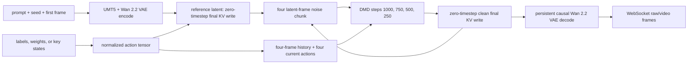

# MinWM 5B DMD 实时推理接入

本文记录如何通过 SGLang 实时视频 API 服务 `~/workspace/minWM` 当前 `main`
分支。它有意比普通用户指南更具体：所有可能影响数值一致性的决策都记录在此，
并作为兼容性契约的一部分。

English version: [MinWM 5B DMD realtime integration](/cookbook/diffusion/MinWM/MinWM-Realtime)。

## 范围与不可变输入

- minWM 事实来源：`/Users/chenshengdong/workspace/minWM`，`main` 分支；最新
  checkpoint 复测固定为 commit
  `2efc6485f65e8fcab506665efde79bc41406385e`。
- SGLang 事实来源：本 worktree，基于 commit `d9a7e0e663`。
- 最新 checkpoint 复测输入：
  `s3://leap-world-us-west-2/world-model/minwm/checkpoints/run-archive/rolling/Wan21/Action2V/dmd/wan22-5B-stage3-dmd-8-0721-6a531f0e067/global_step_003200/ema_student/model.pt`。
- 最新源对象为 `10,007,171,771` 字节，VersionId 为
  `x.2zYaRRNzyqngI7O_cYSrsK3NvgPKKt`，ETag 为
  `5c29d614972e06fd0df859abfd1d6f4d-191`，CRC64NVME 为
  `I0IQ+p0pREI=`。已校验的东部暂存副本 VersionId 为
  `wduScksw2f3yPErnG9lBioOuE2AToyAP`，字节数与 CRC64NVME 相同；B200
  容器内读取到的 SHA-256 为
  `1dc42d498cad84349987db2015120ce4d77e6b641f7f38c75ec9df3f942a7975`。
- 历史已验收 checkpoint：
  `s3://leap-world-us-west-2/world-model/minwm/checkpoints/run-archive/rolling/Wan21/Action2V/dmd/wan22-5B-varlen-stage3-0713-2-5888cc42/global_step_005600/ema_student/model.pt`。
- 历史对象大小：`10,007,171,771` 字节；西部区域版本为
  `FbCvgw5rl1UXt9MKBgpxYpb4BJoUyUEi`；ETag 为
  `56dbc7ce13f26c55d0bfd255e471d318-191`。
- 东部区域 benchmark 暂存对象：版本为
  `ZXEDIMY8ru1wJY7k0u5EO4ljjAHod8MV`，ETag 为
  `f876ca9467f0075111809213f1032fe6-1193`，CRC64NVME 为
  `+6CzzhS6EUo=`。其大小与源对象完全相同。
- 运行时 backbone：Wan2.2 TI2V 5B，48 个 latent channel、30 个 transformer block、
  24 个 attention head、hidden width 3072、patch size `(1, 2, 2)`。
- 原生服务尺寸：832x480 像素；每个 realtime chunk 生成四个 latent frame；
  temporal VAE ratio 为 4。

<Warning>
  本页同时保留旧 checkpoint 的历史结果和最新 checkpoint 的正式结果。任何表格或
  数字都必须连同其 artifact 路径阅读，不能跨 checkpoint 外推。
</Warning>

### 最新 checkpoint 的单用例 smoke

2026-07-22 的西区 Spot B200 attempt 06 已完成实际 baseline/API 比较。最终运行时为
Torch `2.11.0+cu130`、Diffusers `0.37.0`、Transformers `5.12.1`，GPU 为
NVIDIA B200；输入为 `00_forward_pottery` 的同 prompt、seed、首帧与 exact action
labels。两侧输出 shape 均为 `[65, 480, 832, 3]`，结果 **bitwise equal**，
`max_abs=0`，`changed_value_fraction=0.0`。Baseline 单 case 端到端耗时为
`19.9105 s`；它包含初始化/编译与视频编码，不能当作稳态 FPS。

Smoke artifact 位于
`s3://leap-world-us-east-2/world-model/evals/minwm/realtime-parity/20260722-codex-578d/results/latest-ckpt-v5-smoke-attempt06-west-spot/`。
Attempt 最后因 `cp -a` 向 S3 mount 保留 POSIX 目录时间戳而返回非零；该错误发生在
bitwise summary 写出之后，与模型或推理结果无关。正式运行已改用不保留时间戳的递归复制。

### 最新 checkpoint 的正式十用例结果

2026-07-22 的西区 Spot B200 attempt 07 使用与 smoke 相同的锁定运行时，完成了十组
同 prompt、seed、首帧和 exact action label 的 baseline/API 对比。十组全部通过 strict
`bitwise` profile：`all_generated_bitwise=true`，generated-frame
`max_abs=0`、`RMSE=0.0`、最小 `SSIM=1.0`；没有使用 relaxed tolerance。每侧视频
均为 65 帧，因此正式产物包含十组、共 20 个 MP4。

正式 artifact 位于：

```text
s3://leap-world-us-east-2/world-model/evals/minwm/realtime-parity/20260722-codex-578d/results/latest-ckpt-v6-full-attempt07-west-spot/ten-case/
```

首个 baseline case 包含编译，端到端耗时为 `14.162 s`；随后九个 case 为
`5.944`–`6.214 s`。这些是完整四 chunk 生成、decode 和视频写出时间，不应代替下文
20 warmup + 200 measured chunk 的稳态 serving profile。

### 720p、约五秒的长视频复测

2026-07-22/23 的 H200 attempt 15 使用相同的 0721 checkpoint，完成了三组
`1248x704`、24 FPS、129 帧（5.375 秒）、八 chunk 的 baseline/API 对比。动作分别是
连续 `w=0.8`、idle，以及连续 `w=0.6 + l=0.4`。三组全部通过 strict bitwise：
generated-frame `max_abs=0`、`RMSE=0`、`SSIM=1.0`，没有启用 tolerance fallback。
六个 MP4 均已重新读取并验证为 1248x704、24 FPS、129 帧。
实际推理 overlay SHA-256 为
`f8f841e1f4dac714b07d81c2438f80dbedb8dcd9921b6574ba9e2aaabf254d9a`。

该次 H200、单卡、batch-one、原生全历史 KV 的汇总稳态吞吐为客户端 `10.393 FPS`、
scheduler `10.365 FPS`，chunk p50 为 `1525.20 ms`，峰值显存为 `53,159 MB`。第一个
case 的 TTFF 为 `10.343 s`，包含首次 shape 的 minWM 原生局部 fused-segment 编译；
随后两个 case 的 TTFF 分别为 `1.963 s` 和 `1.960 s`。这些数字是 H200 的 720p 长历史
结果，不能替代下文 B200、832x480 的正式吞吐矩阵。

本地平铺播放器与机器可读结果位于
`benchmark/minwm_realtime_parity/results/latest-checkpoint-720p-5s-h200/latest/`；
`player/index.html` 为每个 case 提供一键同步播放、seek、倍速和逐帧控制。

两个 checkpoint 路径中都包含 `stage3`，尽管需求描述的是“stage4 DMD”模型。实现不会根据文件名
进行重新解释。最新对象的原生匹配配置是非 varlen 的 `wan22_5b_dmd.yaml`；首帧 API
对比则有意采用 V3 compatibility contract。Benchmark 报告中必须始终保留这一命名与
推理合同差异。

## 兼容性契约

Action type **不是**连续相机位姿或 Plucker ray condition，而是当前 `main` 分支的
`primitive_token_residual` conditioner：

- 输入有两种等价语义层级：每个 latent frame 一个 `[0, 80]` 整数 label，或
  `[B,F,S,8]` 的逐 pixel-frame action 权重窗口；当前 VAE 的 `S=4`。
- Ontology：九种 translation state 与九种 look state 的笛卡尔积。
- Primitive 顺序：`[w, a, s, d, i, j, k, l]`。
- Encoder：两组各含五项的 primitive embedding、residual fuse MLP、两个
  `kernel_size=3` 的 causal Conv1d block，随后投影到宽度为 3072 的 patch token。
- 感受野：四个历史 action frame。因此，每个生成四帧的 chunk 都接收
  `history[-4:] + current[0:4]`；只有最后四个编码后的 frame state 会注入当前
  patch token。
- Label 0 表示 noop。提交 reference frame 时使用 label 0。

API 接受 `action_labels`、`action_weights` 或 key-state 形式的 `camera_actions`，同一
session 的一次输入只能选择一种。`action_weights` 的每行顺序为
`[w,a,s,d,i,j,k,l]`，每项必须是有限的 `[0,1]` 数；例如 `w 0.8` 写成
`[0.8,0,0,0,0,0,0,0]`。幅度不是必填项：`action_labels` 与 `camera_actions` 是二值
快捷路径，label 9 等价于四个 pixel-frame row 都为 `w=1.0`。连续权重先逐 pixel frame
查 primitive embedding，再在每个四帧窗口内求均值；它不是速度、位移或相机 pose。
精确重放时必须让 baseline 与 API 使用同一种表示，避免仅因 GEMM batch shape 不同而
把浮点舍入差异误判成 action 语义错误。

Benchmark 使用的 primitive 单键 label 如下：

| key state | bits `[w,a,s,d,i,j,k,l]` | label |
| --- | --- | ---: |
| idle | `00000000` | 0 |
| `l`, `j`, `i`, `k` | 单个 look bit | 1, 2, 3, 4 |
| `w`, `s`, `a`, `d` | 单个 translation bit | 9, 18, 27, 36 |
| `w+l` | `10000001` | 10 |

## API 快速开始

使用 `python/sglang/multimodal_gen/tools/convert_minwm_checkpoint.py` 转换
checkpoint 后，启动 API：

```bash
sglang serve \
  --model-path /path/to/sglang-model \
  --pipeline-class-name MinWMCausalDMDPipeline \
  --attention-backend fa \
  --performance-mode speed \
  --enable-torch-compile false \
  --port 30000
```

`enable_autocast=false` 是 `MinWMCausalDMDConfig` 的一部分，因此不需要额外的
parity-only CLI flag。Realtime endpoint 为
`ws://127.0.0.1:30000/v1/realtime_video/generate`；其 init event 使用 MsgPack。
对于限定为四个 chunk 的请求，相关字段如下：

```python
request = {
    "type": "init",
    "model": "minwm",
    "prompt": prompt,
    "first_frame": open(first_frame_path, "rb").read(),
    "size": "832x480",
    "fps": 24,
    "seed": 42,
    "generator_device": "cuda",
    "num_inference_steps": 4,
    "guidance_scale": 0.0,
    "max_chunks": 4,
    "realtime_output_format": "raw",
    "condition_inputs": {"action_labels": [10] * 16},
}
```

这 16 个 label 都是 latent-frame action：每个 chunk 消耗四个 label。0721 checkpoint
继承的训练 dataloader contract 是 `label_81`，所以 `w`（即幅度 1）仍是其 canonical、
训练内分布的输入；`w=0.8` 是 minWM `main` conditioner 支持的连续插值接口，不是必填字段，
也不应在没有控制效果评测时解读成物理速度标定。若要显式使用连续幅度，
则传入例如 `{"action_weights": [[0.8,0,0,0,0,0,0,0]] * 64}`；64 是四个
chunk × 每 chunk 16 个 decoded-frame interval，adapter 会按每四行组成一个 latent
action window。对于交互式、无界 session，可继续发送 `action_labels`、
`action_weights`、`camera_actions` 或 `prompt` event。只有 bounded session 才能精确
复现 V3 的一次性完整 horizon RNG 分配。

minWM `main` 的 `local_attn_size=-1`、`sink_size=0`，因此原生 KV 语义是保留全部历史，
不是 45 或 128 帧滑窗。SGLang 默认与之相同：有 `max_chunks=N` 时一次分配
`1 + 4N` 个 latent frame（首帧加 N 个四帧 chunk），无界 session 则按需增长。
`realtime_causal_kv_cache_num_frames` 只用于显式的有界性能实验；设置它就不再是
minWM 原生 cache contract。

minWM 当前 eval 所称的 720p 档是 `1248x704`。精确 `1280x720` 经 VAE `/16` 后得到
45 行 latent，不能被 DiT 的 `2x2` 空间 patch 整除。24 FPS、每 chunk 16 个 decoded
frame 的固定粒度也无法恰好生成 5.000 秒；八个 chunk 加首帧是 129 帧，即 5.375 秒。

## 实时数据流



首帧是干净的 causal context，而不是按 channel 拼接的 I2V mask。在 chunk 0 中，
它只进行一次 VAE encode，然后在 timestep 0 前向传播，以提交 transformer KV 和
cross-attention KV；在第一个生成 latent chunk 之前，它还会送入 residual VAE decoder。
后续 chunk 会保留 transformer 与 VAE 的状态。

## 重大决策

| ID | 决策 | 原因与一致性影响 |
| --- | --- | --- |
| D1 | 复用 SGLang 的 causal Wan block/cache 实现，并增加 post-patch action hook。 | 当前 minWM 5B 模型使用 absolute RoPE 并缓存旋转后的 K/V，与 SGLang 的 causal Wan 路径一致。复制一套 5B backbone 会增加新的数值差异面。 |
| D2 | 增加 MinWM 专用 denoising stage。 | LingBot World 在每个 chunk 拼接 20-channel I2V condition；minWM V3 则提交一个干净 reference latent，并生成纯 48-channel chunk。 |
| D3 | 二值 action 用精确 81 类 label 作为 canonical representation；连续幅度用显式八维权重。 | Key list 虽然方便，但可能掩盖 label 顺序和采样率错误。二值 benchmark 使用 label；key list 只是 deterministic adapter，不能表达幅度。 |
| D4 | 在转换为 SGLang 的 `[B, C, F, H, W]` 前，保持 RNG tensor layout 为 `[B, F, C, H, W]`。 | `torch.randn` 的填充顺序依赖 shape。直接按 SGLang layout 抽样会在首次模型调用前破坏同 seed 一致性。 |
| D5 | 默认使用 832x480。 | Checkpoint 继承的 trainer config 为 832x480。当前 `main` 的 eval overlay 在存档训练后改为 1248x704，这属于配置漂移，而不是 checkpoint metadata。 |
| D6 | 将 `model.pt` 转换成自包含的 Diffusers-layout serving directory。 | SGLang 运行时不应 import 相邻的 minWM checkout。Converter 在写权重前会验证 backbone/action tensor。 |
| D7 | 固定 horizon 的 exact-RNG parity 必须设置 `max_chunks`。 | V3 为 reference 与完整生成序列一次性抽取连续 BFCHW noise tensor，然后覆盖 reference slice。Realtime stage 会预先抽取同样的 bounded tensor，丢弃 reference slice，并按 chunk 提供 view。Unbounded session 仍然有效，但不能宣称固定 horizon 的 bitwise RNG 等价。 |
| D8 | 使用 minWM 的 fp32 算术覆盖通用 DMD clean-prediction 算术。 | minWM 的 `pred_x0_from_flow` 使用 fp32 计算 `xt - sigma * flow`。SGLang 的可复用 causal stage 使用 fp64 稳定该计算；保留通用行为会引入可避免的数值差异。 |
| D9 | 将 API guidance 归一化为零。 | Distilled student 没有 unconditional/CFG lane，而共享 realtime protocol 默认 guidance 为一。MinWM adapter 始终选择四个 DMD step，并设置 `guidance_scale=0`。 |
| D10 | 保留 minWM 的 512-position zero-padded text context。 | 当前 `main` 会把真实 token 长度之后的 UMT5 输出清零，但把 `prompt_lens` clamp 为 512。裁剪到真实 token 数虽然看起来更常规，却会改变 cross-attention normalization；因此 SGLang 发送真实 embedding，并在直到 index 511 的位置使用零 K/V。 |
| D11 | 仅在 MinWM pipeline 中强制使用原生 diffusers VAE 和 HF UMT5。 | 最初的 B200 运行使用 SGLang 优化版 Wan VAE/T5；generated noise 完全一致，但 reference latent 与 prompt embedding 已经不同，causal rollout 又放大了这些微小 component 差异。DiT 仍常驻 SGLang；只有两个 baseline-native 边界 component 绕过优化 loader。 |
| D12 | 将 deterministic attention/kernel 纳入 parity profile。 | 在锁定确定性之前，同 case、同 seed 的两次独立 minWM baseline 运行会产生不同的 lossless frame hash。只有将 deterministic flag、GPU 型号、软件版本和 attention backend 一并记录，同 seed parity 才有意义。 |
| D13 | 在保持 BF16 module weight 与 input 的同时，为该 pipeline 禁用 autocast。 | minWM `main` 直接调用 BF16 VAE 和 DiT。SGLang 默认 BF16 autocast scope 即使不改变声明的 tensor dtype，也可能选择不同的 promotion/kernel 行为。因此 MinWM pipeline config 设置 `enable_autocast=false`；调用方无需特殊 CLI flag。 |
| D14 | 保留 packed processor 的 FP16 reference-latent wire boundary。 | minWM 的 VAE wrapper 计算 BF16-normalized posterior 并返回 FP32，但 `WanPackedProcessor` 会先将 reference 存成 FP16，V3 随后再转为 BF16。SGLang 在单进程中服务，因此显式执行 BF16→FP16→BF16，以复现这个原本隐藏的量化。 |
| D15 | Self-attention 与 cross-attention 的 Q/K 使用 minWM 的 RMSNorm rounding order。 | minWM 先用 FP32 normalize，把归一化值转为 BF16，然后才乘 BF16 weight。SGLang 通用原生 RMSNorm 先用 FP32 相乘，最后再 cast。MinWM subclass 只替换每个 block 的四个 Q/K norm，同时保留 checkpoint parameter name。 |
| D16 | 使用 minWM 显式的 FP32 interleaved RoPE 公式。 | Frequency table 与 absolute position 已经一致，但 SGLang 通用 CUDA 路径使用 Triton kernel 完成旋转。现在 MinWM 专用 self-attention hook 执行与 `main` 相同的 FP32 实部/虚部运算和 BF16 输出 cast；其他 causal Wan 模型继续使用优化 kernel。 |
| D17 | 复现 minWM `main` 中非 Triton AdaLN、gate、residual 与 final-head 的 promotion boundary。 | Baseline 未设置 `TRITON_ADALN=1`。其 block 路径在 shift/scale modulation 中保持 LayerNorm 输出为 FP32，以 BF16 相加 shift/scale operand，分别提升 gate operand 后再用 FP32 相加，以 FP32 累加 gated residual，并用 BF16 执行裸 cross-attention residual。SGLang 通用 fused residual/norm helper 的顺序并不相同，因此 MinWM 使用专用 block/head subclass，其他 Wan 模型则保留优化路径。 |
| D18 | Self-attention 与 cross-attention 都使用 minWM 的 packed-varlen deterministic FA4 call。 | 早期实验看起来更差，因为即使 block-token input 数值 bitwise 相等，其 stride 仍然不同。匹配源 token materialization 后，Q/K/V 达到 bitwise 相等；要让 idle case 从 latent decode 到 RGB output 都 bitwise 相等，必须使用与源代码形态一致的 packed call。 |
| D19 | 使用原生 `Conv3d` 并复现 minWM 的 token materialization boundary。 | minWM 直接调用 `nn.Conv3d`，随后 `_pack_embed` 和 action helper 使用 `torch.cat` materialize token tensor。SGLang 共享 patch 路径可能将 convolution 线性化，而添加 broadcast action residual 可能留下数值相等、feature-major stride 的 `[B,S,D]` tensor。MinWM 覆盖 convolution，并显式 materialize action residual 与 post-action block input，使源端和服务端 block input 的数值与 stride 都一致。 |
| D20 | 在 VAE BF16 cast 前执行 MinWM pixel reconstruction。 | 通用 image stage 先在 FP32 归一化 pixel，再 cast 为 BF16，之后才调用 model hook；到这一步，256 个 uint8 level 已经坍缩成 240 个可恢复值。MinWM 选择 pre-cast hook，在 FP32 中重建精确 uint8 grid，然后才执行 BF16 `div(127.5)-1`；记录的 VAE input 与 reference frame 现在 bitwise 相等。 |
| D21 | 只编译与 minWM `main` 相同的 fused segment；默认禁用 whole-DiT compile。 | 即使外围模型保持 eager，当前 `main` 仍会动态编译 AdaLN、affine norm、RMSNorm 和 QK+RoPE helper graph。复现这些 graph boundary 后，修正边界的 idle latent RMSE 从 `0.2835` 降到 `0.2391`。`--performance-mode speed` 原本会启用 whole-model compile，形成不同的数值 profile，因此 benchmark 显式传入 `--enable-torch-compile false`。 |
| D22 | 先用 token-level advanced indexing 展开完整 timestep modulation tensor，再选择六个 AdaLN slice。 | minWM inference 将 `e0` 构造为 `[B,F,6,D][:, frame_index]`。分别展开六个 slice 虽然值相等，却具有不同 stride。MinWM block 与 head 保留源 layout，使 compiled helper input 具有相同的 shape/stride 契约。 |
| D23 | 保留失败的正式结果，不把 checked-in tolerance 放宽到观测误差。 | 早期同 runtime 十用例运行中，十个 reference frame 全部 bitwise 相等，但没有 generated case 通过临时 BF16 profile。即使后续修复已取代该结果，它仍作为诊断 artifact 保留；实际失败从未被转换成更宽松的验收阈值。 |
| D24 | 将 tensor layout 与 stride 视为 parity contract 的一部分，而不仅是 value、shape 和 dtype。 | 对于数值相同但不连续的 tensor，CUDA GEMM 和 attention dispatch 可能选择不同 kernel 或 memory-access path。Parity trace 因此会记录 operator boundary 的 contiguity 与 stride，regression test 则要求与源代码形态一致的 action-token materialization。 |
| D25 | 只有在输入达到 bitwise 且 layout 相等后，才评估 backend substitution。 | Dense FA4 最初受益于意外的上游误差抵消，导致与源代码形态一致的 packed call 看起来更差。一旦 block input 与 Q/K/V 完全一致，packed deterministic FA4 就消除了第一个真实差异，并产生全零误差的 idle-case report。 |
| D26 | 对最新的非 varlen checkpoint，明确分开两种推理合同并分别报告。 | 与它匹配的 `wan22_5b_dmd.yaml` 是 causal T2V 路径，没有首帧 processor；产品/API 要求则是首帧加 `primitive_token_residual` action。因此十用例 API 复测通过 V3 compatibility path 运行并明确标为非原生；匹配配置的运行可以验证权重加载与速度，但不能称为首帧 parity。 |
| D27 | 固定镜像缺少 Rust compiler 时，diffusion-only benchmark 安装跳过未使用的 `sglang.srt.grpc` Rust extension。 | Multimodal diffusion HTTP/WebSocket server 不会 import 该 extension。Attempt 03 因 package build 在模型加载前失败；benchmark 会记录这项仅影响 packaging 的省略，不替换或修改任何推理 kernel。 |
| D28 | 卸载训练镜像遗留的可选 `peft==0.17.0`，而不改 SGLang 锁定的 Transformers/Diffusers。 | SGLang 安装后为 Transformers 5.12.1 与 Diffusers 0.37.0；旧 PEFT 因导入已移除的 `HybridCache` 而在模型加载前失败。Realtime benchmark 不加载 LoRA，移除这个被 Diffusers 自动探测到的旧可选包不会改变推理图或吞吐。最终 runtime manifest 明确记录 `peft_installed=false`。 |
| D29 | 从 S3 CSI mount 顺序复制 donor tree 到本地 NVMe，再让 safetensors mmap。 | 直接 mmap mountpoint-s3 会把权重 page fault 转成大量远程小范围读取；attempt 05 因此在 GPU 尚为空时长期处于 `folio_wait_bit_common`。本地 staging 只改变启动 I/O，不改变文件字节或推理数值，并让 baseline/API/profile 复用同一份本地 donor。 |
| D30 | 分开验证网络 `frame_batch` 与模型语义 chunk，并在收到 final batch 后再计时完成。 | chunk 0 会拆成 16 个 generated frame 与 1 个 reference frame 两个传输 batch，后续 chunk 则通常只有一个 16-frame batch。Attempt 07 的第一版吞吐 client 错把每个 batch 都要求成完整 17-frame chunk，因此在稳态测量前失败；修正后会先验证每个 batch 的局部大小、序号和 final flag，再聚合验证 chunk 总帧数。该错误不影响十用例推理或 parity 结果。 |
| D31 | 将连续 `action_weights` 作为 `primitive_token_residual` 的一等 API 输入，同时保留 81 类 label。 | minWM `main` 的 conditioner 原生接受 `[B,F,S,8]` 权重；此前 SGLang adapter 只暴露 label，无法表达 `w=0.8`。API 现在校验 `[0,1]`、按 VAE temporal factor 分窗，并禁止 session 内切换 action tensor rank。 |
| D32 | 默认 KV contract 改为 minWM 的无界历史；45/128 只保留为显式 benchmark override。 | `model_wan22_5B.yaml` 的唯一真源是 `local_attn_size=-1,sink_size=0`。Bounded request 预分配完整 horizon，无界 request 允许 cache 增长，避免把历史性能实验误当成模型语义。 |
| D33 | 720p 长视频回归使用 1248x704、129 帧，而不静默 resize 或裁成正好五秒。 | 这是当前 minWM eval 的合法 720p 档；1280x720 与 DiT patch geometry 不兼容。129/24=5.375 秒是八个完整 realtime chunk 加首帧，保留了模型与传输边界。 |
| D34 | 只有 whole-DiT compiled 路径通过 strict bitwise 后才允许把它设为默认；当前继续关闭。 | Torch 2.11 的 1248x704 首图编译在 Inductor post-grad 阶段触发 `FakeTensor * Node`，尚未产生可比较输出；更早的 832x480 whole-compile profile 也只代表非 parity 性能上限。因此产品默认只保留与 minWM `main` 相同的局部 fused-segment compile。 |
| D35 | FA4/FA3/FA2 必须采用与 minWM `main` 相同的“设备 + 可用性”回退规则，不能在 Hopper 上强制 FA4。 | 第一轮 H200 720p 长测中，baseline 实际选择 FA2，而 SGLang 强制 FA4；即使 idle action 也从第一生成帧开始漂移。跟随源实现选择 backend 后消除了硬件相关的数值契约缺口，同时不改变 B200 的 FA4 路径。 |
| D36 | 将无界 cache 的 `allow_growth` 策略透传到通用 cache initializer。 | Allocator 原本已经支持增长，但 initializer 丢掉了参数；第一轮原生 KV 长测才在真实运行时暴露。新增单测保证 MinWM policy 会到达每一层 cache。 |
| D37 | 只有完整结果目录复制结束后才发布 artifact-ready 标记，并保留 120 秒抓取窗口。 | 第一份成功的 H200 长测先写出 summary、后复制约 2 GB 结果；外部抓取器过早判定完成，而 Pod 退出时 emptyDir 被回收。显式完成标记把“推理完成”和“产物可导出”分开。 |
| D38 | 对已经 `array_equal` 的 lossless 数组直接返回恒等 metric。 | 旧比较器仍会把 720p exact pair 转为多份 float64，并重复计算 cosine 与逐帧 SSIM。短路只在已经证明 byte-equal 后触发，结论数学上不变，但避免长视频验收的无意义 CPU/内存开销。 |
| D39 | 在 MinWM 真正实现 Ulysses/Ring 前，显式拒绝所有非一的 SP 参数。 | 当前 batch 不会进入 sequence shard，source-shaped packed attention 也没有 all-to-all；静默接受参数会让多卡重复计算被误认为有效加速。Causal KV ownership、action history、absolute position 和 output gather 必须一起设计并重做 parity 验证。 |

## 实现过程中发现的差异

1. 现有 SGLang MinWM feature branch 面向更早的 Wan2.1 1.3B camera/PRoPE 模型，
   不能为该 checkpoint 直接 cherry-pick：当前模型是 Wan2.2 5B、`use_camera: false`、
   absolute RoPE，并使用 discrete token-residual action。
2. LingBot World 的首帧条件在结构上与 minWM V3 processor 路径不同。这里只复用其
   WebSocket session/control plumbing。
<Note>
  最新 `wan22-5B-stage3-dmd-8` checkpoint 来自非 varlen 训练。与之匹配的
  `eval/wan22_5b_dmd.yaml` 会把 action chunk 传给 DiT，但它是没有首帧 processor
  的 T2V 路径。通过 V3 加载这份权重是有意进行的 API compatibility test，不是该
  checkpoint 的原生 eval。
</Note>

3. 当前 minWM `eval/wan22_5b_varlen_dmd.yaml` 配置为 1248x704 和 31 个 latent frame；
   该存档 checkpoint 继承的训练默认值则为 832x480 和 20 个 latent frame。Parity suite
   锁定后者。
4. 不假设跨 attention backend 的 bitwise equality。Suite 首先检查 tensor equality；
   如果失败，则根据显式 tolerance 报告 max/mean absolute error、RMSE、cosine similarity、
   decoded RGB PSNR 和 SSIM。
5. 相同 seed 最初不足以保证 parity：按 realtime chunk 拆分 CUDA `randn` 调用会改变
   生成序列。Bounded session 现在与 V3 一样，在一次 BFCHW 抽样中同时消费 reference
   与完整 generation horizon。
6. 通用 realtime request default 对该 student 并非 model-neutral。Adapter 强制使用
   四个 inference step 和 guidance zero，而不是信任 client default。
7. 一个 CPU unit test 比较了完整序列 action convolution 与等价的
   `history + chunk` convolution，观测到最大 `5.96e-8` 漂移。PyTorch 选择的
   accumulation path 取决于输入长度。该测试使用 `atol=1e-7, rtol=1e-6`；真实
   parity 路径都使用相同的 bounded `history + chunk` shape，并仍保留 bitwise-first
   acceptance gate。
8. minWM 不采用普通的“按 attention mask 裁剪文本”惯例。其 UMT5 wrapper 在显式
   清零 padded embedding 的同时，将 cross-attention 最小长度保持为 512。这一点通过
   将 `prompt_lens` trace 到 packed inference attention 时发现，现已由 regression test
   覆盖。
9. SGLang 基础 `PipelineConfig.postprocess_image_latent` 会为普通 TI2V 模型添加四个
   temporal mask channel。继承该行为后，第一次真实 API 请求到达 patchify 时有 52 个
   channel（每个 2x2 patch 为 `208` 个值），而该 checkpoint 只接受 48 个 channel
   （`192` 个值）。MinWM config 现在直接返回归一化后的 VAE latent，并断言其 channel
   数量。
10. minWM V3 在构造时先加载 donor transformer，随后才用 `model.pt` 替换它。因此
    baseline 需要完整 donor directory；serving converter 则特意排除 donor DiT，避免
    SGLang 意外服务错误模型。
11. Bounded RNG 实现已直接验证：进入 API DiT 的第一个 generated BF16 latent 与
    baseline bitwise 相等。因此早期端到端失败不是 seed reset、tensor layout 或缺失
    reference RNG draw 所致。
12. 使用优化版 boundary component 时，首帧 VAE latent 相对 baseline 的 RMSE 为
    `6.48e-3`，prompt embedding RMSE 为 `7.15e-4`。虽然 generated input 已经 bitwise
    相等，第一个 generated DiT flow 的 RMSE 仍为 `2.09e-2`。到第四个 causal chunk，
    decoded error 已增长到 `25.30` 个 uint8 level 的 RMSE。这些只是诊断观测，不是
    可接受 tolerance。
13. 禁用 whole-DiT `torch.compile` 后，失败运行基本没有变化（generated-video RMSE
    为 `19.0069` 对 `19.0054`）。因此 compile 不是该差异的根因；必须修复 component
    与 operator parity，或显式设定误差边界。
14. 切换到原生 VAE/UMT5 并匹配 pixel/statistics 算术后，prompt embedding 达到
    bitwise 相等，第一个 generated noise 也继续保持 bitwise 相等。Reference latent
    RMSE 仍为 `4.87e-3`，第一个 generated DiT output RMSE 为 `1.76e-2`，64 个
    generated RGB frame 的 RMSE 为 `13.32`。因此选择正确 boundary component 是必要
    条件，但仍不充分。
15. 剩余的 reference/DiT boundary 漂移暴露了隐式 execution-mode 差异：minWM
    `main` 直接执行 BF16 forward，而 SGLang 通用 stage 会进入 BF16 autocast。Pipeline
    现已通过配置禁用 autocast；在批准任何 tolerance 前，会单独测量其影响。
16. Packed inference 路径对 dtype 并不透明：编码后的 reference 会在 CPU 上序列化为
    FP16，随后再恢复为 BF16。即使所有具名模型 dtype 都是 BF16，直接的进程内 VAE
    handoff 也会遗漏这一量化。只有在原生 VAE weight 和 pixel arithmetic 仍未通过
    reference-latent boundary 检查后，才发现该问题。
17. 复现 FP16 boundary 后，单用例结果仍不可接受：两次独立 baseline load 依然
    bitwise 相同，而 API 运行的 generated-frame RMSE 为 `8.9633`、mean absolute
    error 为 `2.8220`、max error 为 `255`。其进入 DiT 的实际 reference tensor 仍有
    `9.01e-3` RMSE，因此残差不只来自进程内 dtype handoff。下一个 operator-level
    mismatch 是 RMSNorm：minWM 在 weight multiplication 前 cast normalized value，
    SGLang 通用实现则在相乘后 cast。
18. RoPE 还有第二个隐藏 backend 选择。两种实现生成相同的 float64 frequency power
    与 float32 sine/cosine table，但通用 SGLang 使用 Triton 执行实际旋转，而 minWM
    `main` 使用显式 FP32 实部/虚部乘法。现在 MinWM 路径只覆盖这一步；position 与
    KV-cache 契约保持不变。
19. 在 RMSNorm/RoPE 修复之后、精确 AdaLN promotion order 安装之前进行的一次
    deterministic 十用例运行中，十个用例全部未通过临时 numerical profile。
    Generated-frame RMSE 范围为 `8.1502` 到 `33.4794`，最低 SSIM 为 `0.5146`，
    maximum absolute error 达到 `255`。Reference frame 仍很接近（`0.45`–`0.75`
    uint8 RMSE，SSIM 约为 `0.998`），说明大部分实质误差位于 causal generation path，
    而不是 manifest/input 损坏。失败报告已保留，阈值没有放宽。
20. 表面上的“AdaLN mismatch”并不是一次 cast。在非 Triton 源路径中，shift/scale
    operand 以 BF16 相加；gate operand 分别 promotion 后再用 FP32 求和；gated
    residual accumulation 使用 FP32；cross residual 是裸 BF16 add；affine `norm3`
    返回 BF16。将这些全部视为一次通用 fused modulation，会使第一个 block 在
    attention 前就发生变化。
21. 第一次 packed-attention 实验具有误导性。当上游 block input 仍是数值与源相等、
    但 stride 不同时，用 flattened tensor、显式 `cu_seqlens` 和 `deterministic=True`
    调用 FA4，反而增大了固定 idle-case error。Dense attention path 恰好抵消了一部分
    更早的误差。该实验作为诊断历史仍有价值，但不能作为选择最终 attention 实现的
    有效证据。
22. 进入 DiT 的第一个 generated latent bitwise 相等，prompt context bitwise 相等，
    action/timestep 契约也一致，但在共享 runtime 诊断中，其第一个 flow 仍相差约
    `2.19e-2` RMSE。Trace pre-block 路径后发现，SGLang 使用线性化 patch embedding，
    而 minWM 使用原生 `Conv3d`；该 kernel boundary 现已 model-specific，并在再次完整
    运行十用例前单独测量。
23. 第一次在 `preprocess_vae_encode` 内重建 uint8 pixel 的尝试发生得太晚：通用 stage
    已将归一化 image cast 为 BF16，使 256 个源 level 减少到 240 个。只将该模型的
    hook 移到 dtype cast 前，就使 VAE input 与 reference frame bitwise 相等。它也消除
    了此前意外的误差抵消：即使 reference 和第一个 generated DiT input 都变得 bitwise
    相等，idle case 最终 generated latent RMSE 仍从 `0.2207` 变为 `0.2835`。局部契约
    相等必须保留；不能利用错误 boundary 优化端到端 metric。
24. Checkpoint config 中的 `compile_fusion=true` 不表示编译完整 transformer block。
    minWM `main` 缓存四个跨所有 layer 共享的小型 dynamic graph。镜像这些 graph
    boundary 后，修正边界的 idle case latent RMSE 改善到 `0.2391`，RGB RMSE 改善到
    `11.9593`；但仅此仍不能使运行通过。Whole-DiT compile 仍是显式 opt-in experiment。
25. 正式的同 runtime 十用例运行使每个用例的 decoded reference frame 都 bitwise
    相等，但 generated output 仍全部未通过临时 gate。Generated-frame RMSE 范围为
    `8.7245` 到 `33.1607`，SSIM 范围为 `0.4706` 到 `0.9205`，max absolute error
    为 `255`。这明显超出声明的 `max_abs<=8`、`RMSE<=1`、`SSIM>=0.995` candidate
    profile；观察到结果后，该 profile 并未改动。
26. First-block trace 最初似乎将最早差异定位到 AdaLN：patch/action value bitwise
    相等，之后出现 BF16 量级的 AdaLN 差异。缺失的诊断项是 tensor stride。源端
    `block0_input` 连续且为 feature-last stride，而服务端 tensor 是 broadcast action
    addition 后产生的、数值相等但不连续的 view。这在 self-Q 之前就改变了 compiled/
    kernel path，使此前仅归因于 AdaLN 算术的判断失效。
27. minWM 的 `_pack_embed` 和 action helper 使用 `torch.cat`，会 materialize action
    residual 与最终 token tensor。复现这些 boundary 后，`block0_input`、AdaLN output
    与全部 self-attention Q/K/V projection 都达到 bitwise 相等，contiguity 和 stride
    也相同。与此同时，之前的意外误差抵消也消失了：使用 dense SGLang attention 时，
    end-to-end idle latent/RGB RMSE 反而变差为 `0.2921`/`15.4152`，尽管上游契约现已
    正确。
28. 只有在 Q/K/V 完全相等后重新启用 minWM 的 packed-varlen deterministic FA4，
    才消除 attention discrepancy。同 runtime B200 idle case 随后在 generated latent
    与 lossless RGB boundary 达到 bitwise 相等：两种 array 的 max absolute error、
    mean absolute error 和 RMSE 全部为零。编译后的稳态 generation 每个 16-frame
    chunk 约需 `716`–`717 ms`。
29. 最终同 runtime 十用例运行覆盖 idle、八个单 primitive key，以及组合的
    forward+yaw action。十组 baseline/API lossless `.npy` 全部 byte-for-byte 相同。
    因此 strict profile 报告 10/10 通过，generated max absolute error 为 `0`、RMSE
    为 `0`、SSIM 为 `1.0`；该 checkpoint/environment matrix 无需 numerical-tolerance
    fallback。
30. 原生全历史 KV 的首轮长测在 cache 创建时失败：allocator 支持 `allow_growth`，但
    common initializer 没有把该策略继续传下去。修复后，有界八 chunk 请求分配 33 个
    latent frame；无界 session 才按需扩容，两者都不再冒充 KV45/128 滑窗。
31. H200 首轮能运行的长测仍未 parity：minWM 按设备回退到 FA2，SGLang 却硬编码
    packed FA4。把 backend 选择改为和 source 相同的 Blackwell/FA4、Hopper/FA3、否则
    FA2 可用性规则后，三组长视频都达到 bitwise exact。
32. 1248x704 的 whole-DiT `torch.compile` 在 Torch 2.11 Inductor post-grad 阶段因
    `FakeTensor * Node` 报错，首个可比较输出尚未产生。因此它没有通过用户要求的
    bitwise gate；只保留 minWM `main` 本来就使用的局部 fused-segment compile。
33. 第一份成功的长测结果因 summary 早于目录复制完成而未被外部 watcher 保存；Pod
    退出后 emptyDir 已回收，恢复 Pod 也确认没有残留数据。重跑加入最终 ready marker
    和保留窗口，才完整抓取视频、报告、日志与显存采样。

## 一致性验收门槛

一致性验证按范围递增执行，以便定位失败：

1. checkpoint conversion coverage：每个必需 checkpoint tensor 都被消费，只忽略
   显式允许的 metadata；
2. action encoder：label-to-bits table、frame state、chunk/history equivalence；
3. 一次 DiT forward：相同的 clean/noisy latent、prompt embedding、action window、
   timestep；
4. 一个四步 DMD chunk，包括 re-noise RNG draw；
5. 两个 chunk，验证 final-cache update 和 action history；
6. VAE encode/decode；
7. 十个使用相同 prompt、seed、first frame 和 action label 的端到端用例。

提交的 threshold file 包含一个 strict bitwise profile 和一个明确标为临时的
bf16-backend candidate。Candidate 不是验收结果：只有在固定 GPU/software/
attention-backend matrix 上审核观测边界后，才可选用。只有全部十个用例都通过某个
预先声明的 profile，一次运行才算验收通过。Report 保留 checkpoint 与 input/output
hash，以及 tensor/video metric；运行日志保留 software、GPU 和 attention-backend
环境。

## 十用例对比产物

`benchmark/minwm_realtime_parity/` 包含固定 manifest、baseline/SGLang runner、
metric collector 和静态同步播放器。一次完成的运行具有以下结构：

```text
results/<run-id>/
  manifest.resolved.json
  report.json
  report.md
  cases/00..09/
    baseline.mp4
    sglang.mp4
    metrics.json
  player/index.html
```

运行 `./benchmark/minwm_realtime_parity/play.sh results/<run-id>`，即可启动一个本地
HTTP server 并打开播放器。播放、暂停、seek、playback rate 和逐帧操作会在 baseline
与 SGLang 视频间保持同步。

生成的 `player/index.html` 已内嵌十用例报告，也可以直接双击或通过 `file://` 打开，
无需本地 HTTP server。只需保持 `player/` 与同级 `cases/` 目录的相对位置不变。页面
会平铺全部十组视频；点击任一用例卡片中的 **Play both**，即可一键同步播放该组
baseline/SGLang 视频，无需通过下拉框切换。

以下是**旧 checkpoint 的历史已验收产物**：

```text
/s3/world-model/evals/minwm/realtime-parity/20260721-codex-578d/results/ten-case-main-same-env-final-attempt34
```

在挂载了项目 S3 的机器上，可用一条命令打开播放器：

```bash
./benchmark/minwm_realtime_parity/play.sh \
  /s3/world-model/evals/minwm/realtime-parity/20260721-codex-578d/results/ten-case-main-same-env-final-attempt34
```

该目录包含 20 个 MP4、十组 lossless array pair 及 per-case metric、`report.json`、
`report.md`、resolved manifest 和 `player/index.html`。Effective overlay SHA-256 为
`42ef254699d6e7837e7c0caaac077e1ce20bee78aa4a2aec4e3850b0af7bf4bc`。
两个 runner 均使用 minWM `10b2d08`、Torch `2.11.0+cu130`、Diffusers `0.37.0`、
Transformers `5.12.1` 和一张 NVIDIA B200。包含编译的第一个 chunk 约耗时
`15.95 s`；稳态下，每生成 16 个 decoded frame 的 chunk 约耗时 `0.69`–`0.71 s`
（约 22.5–23 output FPS），resident peak GPU memory 为 `46,512 MB`。

这些数字均为旧 checkpoint 的历史结果，不能从这里外推。最新 checkpoint 的十用例
bitwise 结果与正式 artifact 已记录在本文开头；其稳态吞吐、TTFF、p50/p95/p99 与
显存只接受下方受控 profile matrix 的结果。

Strict `bitwise` profile 的十个用例全部通过。Generated-frame max absolute error
与 RMSE 均为零，SSIM 为 `1.0`，reference frame 也 bitwise 相等。没有使用 relaxed
numerical profile。更早失败的诊断运行仍保存在
`ten-case-main-same-env-final-attempt23`；它记录 pre-layout/packed-attention 失败，
不是验收 artifact。

## 吞吐对照设计

MinWM 5B checkpoint 不能直接加载进 LingBot World 2 的模型类。两者在 hidden width、
层数、输入/输出 channel、VAE 合同、chunk size、首帧 conditioner 和 action 语义上都
不同。因此，受控的同 5B 对照会固定这份 MinWM checkpoint 与请求，只改变 serving
实现 profile：

[LingBot World 2 官方仓库](https://github.com/Robbyant/lingbot-world-v2)当前发布的是
[14B causal-fast](https://huggingface.co/robbyant/lingbot-world-v2-14b-causal-fast)；
roadmap 提到未来的 1.3B，但没有列出 5B checkpoint。因此本实验找不到可替换进来、
架构兼容的官方 LingBot 5B 权重。

官方 README 宣称实时版本可驱动 720p 60 FPS，但其已公开的 480P causal-fast 命令是
`torchrun --nproc_per_node=8` 加 `ulysses_size=8`。因此不能把该产品级 60 FPS 数字与
下面的单张 B200、单 session MinWM 数字直接相除；这里同时报告单流延迟和按八张 GPU
归一化后的节点容量。

| Profile | 隔离的影响 |
| --- | --- |
| exact packed deterministic，原生 VAE/T5 | 已验收的一致性路径 |
| exact packed nondeterministic | deterministic FA4 flag 的开销 |
| LingBot-style dense attention，原生 VAE/T5 | 源代码形态 packed attention 与 SGLang `LocalAttention` 的差别 |
| dense attention，优化版 VAE/T5 | 原生边界 component 的开销 |
| dense optimized 加 whole compile | 可选编译空间；必须作为独立数值 profile |

每个 profile 都使用一个持续 session、20 个 warmup chunk、200 个 measured chunk，
并固定同一首帧、prompt、seed 与 action。历史矩阵显式设置 KV45 来近似 LingBot 的
bounded serving 条件，并另跑 KV128 观察容量成本；两者都不是 minWM `main` 的原生
无界历史。它们只用于把上下文容量与实现速度分开衡量。

### 最新 checkpoint 的正式吞吐结果

2026-07-22 的西区 Spot B200 attempt 08 六个 profile 全部成功，没有失败项。运行时、
checkpoint、GPU、prompt、seed 42、首帧、action label 9、832x480、4 个 DMD step 与
FA4 backend 均固定。下表每行都丢弃 20 个 warmup chunk，再用 200 个 chunk、3200 个
decoded frame 统计；延迟是客户端收到完整 chunk payload 的间隔。

TTFF 是 **Time To First Frame**：这里从客户端开始发送 init 到收到 chunk 0 的最后一个
frame payload 为止，因此包含首帧预处理/VAE encode、prompt/T5、第一次 DiT、VAE
decode，以及首次 shape 的 `torch.compile`（若启用）。它不是后续 chunk 的稳态延迟。

| Profile | 客户端 FPS | Scheduler FPS | TTFF (s) | p50 / p95 / p99 (ms) | Peak GPU (MB) |
| --- | ---: | ---: | ---: | ---: | ---: |
| exact packed deterministic，KV 128 | 23.164 | 23.176 | 15.800 | 688.94 / 707.92 / 718.46 | 46,512 |
| exact packed deterministic，KV 45 | 23.075 | 23.086 | 11.291 | 691.53 / 706.35 / 714.47 | 35,042 |
| packed nondeterministic，KV 45 | 22.744 | 22.756 | 11.192 | 699.61 / 728.62 / 764.97 | 35,042 |
| LingBot-style dense、原生组件，KV 45 | 24.713 | 24.727 | 10.552 | 643.85 / 672.02 / 690.60 | 35,042 |
| dense、优化组件，KV 45 | 25.541 | 25.555 | 15.821 | 624.01 / 642.65 / 662.41 | 34,270 |
| dense、优化组件、whole compile，KV 45 | 32.222 | 32.244 | 75.360 | 493.88 / 518.96 / 525.82 | 35,060 |

正式性能 artifact 位于：

```text
s3://leap-world-us-east-2/world-model/evals/minwm/realtime-parity/20260722-codex-578d/results/latest-ckpt-v7-profiles-attempt08-west-spot/
```

受控结果对“bitwise 修改的代价”给出以下结论：

- deterministic flag 本身没有可测到的损失；deterministic 反而比 nondeterministic
  高 `1.45%`，应视为约 1–2% 的运行抖动，而不是确定性带来的加速。
- source-shaped packed attention 相对 LingBot-style dense 的吞吐损失为 `6.63%`。
  阶段统计把差距定位到 DiT denoising：`431.5 ms` 对 `384.7 ms`，每 chunk 相差
  `46.8 ms`；VAE decode 都约 `139.1 ms`，RGB materialization 都约 `103.3 ms`。
- 在 dense 路径上使用原生边界组件再损失 `3.24%`。优化 VAE 把 decode 从
  `139.1 ms` 降到 `114.2 ms`；T5 只影响首个 chunk，不影响稳态 chunk。
- 因此 accepted exact KV45 相对“不做 bitwise 兼容、但也不 whole compile”的同 5B
  路径总吞吐损失为 `9.65%`。Exact 为 `23.075 FPS`，比 24 FPS 实时线低 `3.85%`；
  dense-native 已达到 `24.713 FPS`。
- whole compile 进一步把优化路径提升 `26.16%` 到 `32.222 FPS`，但 TTFF 增至
  `75.36 s`，并且会改变数值轨迹；它是性能上限 profile，不是 parity 选项。若拿它
  与 exact 比，exact 吞吐低 `28.39%`，其中包含 compile 与非 exact component 的共同影响。
- KV 128 与 KV 45 的 FPS 只差 `0.39%`，但 pipeline peak memory 从 `46,512 MB`
  降到 `35,042 MB`。客户端与 scheduler FPS 的差小于 `0.06%`，说明 WebSocket、
  raw RGB payload 和网络不是这次吞吐不符预期的主因。

跨系统比较时，参数量不能直接预测单流延迟。稠密计算量 proxy 显示：单卡 MinWM 5B
约为 `33.86 TMAC/chunk/GPU`；SP8 下 LingBot 14B 约为
`279.72 / 8 = 34.96 TMAC/chunk/GPU`。因此两者单流延迟接近并不反常；节点级容量的
公平比较应是八个独立 MinWM replica 对一个 LingBot SP8 stream。

以下历史诊断已被上方单变量正式矩阵取代：一个 dense-attention 运行曾达到
`28.44 FPS`，最终 exact packed 路径为 `22.49`–`23.10 FPS`，相当于吞吐低
`18.8%`–`20.9%`（延迟高 `23.1%`–`26.4%`）。但这两组并非随机化的单变量 A/B；
不能再将该历史范围当成最新 checkpoint 的 bitwise 税。

## 理解考核题

### 架构

1. 即使能把所有 shape 调通，为什么复用 LingBot 的 20-channel I2V condition
   仍会得到语义错误的模型？
2. 首帧 latent 被写到哪里？为什么它还必须初始化 causal VAE decoder 的状态？
3. 哪些状态跨 chunk 保留，哪些状态在每个 chunk 重新构造？
4. 为什么 transformer action history 只在 clean/final forward 之后更新，不能在
   每个 DMD step 后更新？

### Action 语义

5. 给定 `w+l`，写出八个 primitive bit、translation/look 两个子标签，以及最终的
   `[0, 80]` label。
6. 为什么 `kernel_size=3` 恰好要求四帧 action history？
7. 如果把 API 中四个 action item 当作 pixel frame 而不是 latent frame，会发生什么？
8. Realtime API 也接受 `camera_actions`，为什么 parity 的标准输入仍必须是
   `action_labels`？

### 数值一致性

9. 相同 seed 并不足以产生相同 noise；还必须锁定哪个 tensor layout 和一次性分配
   细节？
10. 为什么最后一个 DMD prediction 后还要做一次 timestep=0 的 clean forward？
11. 如果单步 DiT parity 通过，但第二个 chunk 开始发散，在检查 VAE 前应先排查哪
    三类有状态对象？
12. Bitwise 失败、但 max absolute error 通过时，必须固定并记录哪些运行元数据和
    tensor layout/stride，才能把差异判定为可接受的 backend 数值差异？为什么仅比较
    shape、dtype 和数值仍不足够？

### 工程与运维

13. 为什么 10 GB checkpoint 要在 AWS 内部搬运，而不经过开发者电脑？
14. 哪三个对象属性可以唯一标识报告实际使用的 checkpoint？
15. 结合 layerwise parity artifact，怎样区分 checkpoint、action 和 RNG 三类错误？

### 连续 action、KV 与编译专题

16. 要表达持续的 `w=0.8`，API 需要多少行 action weight 才能生成一个 chunk？写出
    adapter 分组后的 tensor shape，并解释为何单个 label 无法无损表达 0.8。
17. `max_chunks=8` 时，为什么原生 minWM KV 至少需要 33 个 latent frame？若不设置
    `max_chunks`，SGLang 应增长 cache 还是淘汰旧帧？KV45/KV128 为什么不能叫原生 window？
18. 打开 whole-model `torch.compile` 后，为什么必须同时报告 TTFF 和 steady FPS？如果
    eager 已经 bitwise exact，但 compiled 路径只通过 tolerance，能否称 compiled bitwise？

答案必须引用上文具体的 cache/action/RNG 契约，不能只复述通用 diffusion 概念。

### 实操与评分

上面十五题每题四分：机制正确两分，指出具体 tensor/state 一分，解释错误表现一分。
剩余四十分来自四个实操题：

第 16–18 题为每题四分的专题加分题，不改变原 100 分总分。

1. **Action trace（10 分）：** 某 session 的三个 chunk 依次为 `idle`、`w`、
   `w+l`。写出 chunk 2 的 label，以及 action encoder 实际看到的八帧窗口。
2. **RNG 反例（10 分）：** 把 bounded session 的单次 BFCHW 分配改成四次 per-chunk
   分配，保持 seed 42，用 lossless array 找出第一个不再相等的 chunk，并解释为什么
   每个 chunk 重置 seed 不是修复。
3. **Cache 诊断（10 分）：** 故意跳过 chunk 0 后的 clean/final KV 写入；先预测哪些
   parity gate 仍会通过，再用 two-chunk run 验证。
4. **API 契约（10 分）：** 发送一个合法 exact-label 请求，以及三个非法请求：混用两
   种 action 表达、label 81、用 scalar 代替 `list[int]`。记录 validation error，指出
   每项校验所属层；再解释为什么短脚本用 noop 补齐，而长脚本会跨 chunk 消费而不是
   直接拒绝。

建议分档：90–100 分可以安全修改 serving path；75–89 分可以在 review 下运维和诊断；
60–74 分理解架构但不应独立修改 parity-sensitive code；低于 60 分应结合生成的对比
artifact 再走查一次。为避免“看答案后自评”，建议先批改解释，再打开 action、RNG、
cache 对应实现。

## 决策日志

- 2026-07-22 — 将用户指定的 minWM `main` fast-forward 到最新状态，并把最新 checkpoint
  复测固定在 `2efc6485f65e8fcab506665efde79bc41406385e`，没有静默沿用过期的本地
  checkout。
- 2026-07-22 — 直接在 AWS 内部把最新对象从西部 S3 暂存到东部 S3；校验两侧字节数
  与 CRC64NVME 相同，记录两个 VersionId，并确认没有残留 multipart upload。
- 2026-07-22 — 将最新 checkpoint 匹配的 non-varlen T2V eval 与 V3 首帧/action API
  compatibility contract 分开；两类结果不能互相改名冒充。
- 2026-07-22 — 增加受控的同 5B serving profile：deterministic packed、
  nondeterministic packed、LingBot-style dense、优化边界 component、whole compile；
  将 KV45 与 KV128 明确标为有界性能实验，而不是 minWM 原生 window。
- 2026-07-22 — 单用例 B200 smoke 先提交 Spot；AWS 返回
  `UnfulfillableCapacity` 后，只替换这个仍在 pending 的尝试，转到东部专用 on-demand
  B200 pool；未使用西部 capacity-block 节点。
- 2026-07-22 — 固定最终 benchmark runtime 为 Torch 2.11.0+cu130、Diffusers
  0.37.0、Transformers 5.12.1；移除与该组合不兼容且推理不使用的旧 PEFT，并将
  donor safetensors 从 S3 mount 顺序暂存到本地 NVMe，避免远程 mmap page-fault 风暴。
- 2026-07-22 — 最新 checkpoint 单用例 B200 smoke 达到 65 帧 RGB bitwise exact；
  将随后发生的 S3 POSIX timestamp 复制错误与推理结论分开记录，并在正式运行中改用
  不保留目录 metadata 的复制方式。
- 2026-07-22 — 最新 checkpoint 的正式十用例达到 10/10 strict bitwise exact；将
  20 个 MP4 生成同步播放器，并在真实 Chromium 中验收十组切换、播放/暂停、seek、
  倍速和逐帧控制。随后修正吞吐 client 对 transport batch 与 semantic chunk 的混淆，
  不修改已通过的一致性路径。
- 2026-07-22 — 修正后的六项 B200 profile 全部成功；把正式 bitwise 税从历史混杂范围
  收敛为：packed attention `6.63%`、原生边界组件 `3.24%`、exact 对不 whole-compile
  优化路径合计 `9.65%`。Whole compile 单独记录为 `32.222 FPS` 的非 parity 上限。
- 2026-07-22 — 按用户给出的 gate 在原生 KV 与 1248x704 长视频路径上尝试 whole-DiT
  `torch.compile`；Torch 2.11 Inductor 在首图 post-grad replacement 中以
  `unsupported operand type(s) for *: 'FakeTensor' and 'Node'` 失败。由于连输出都未产生，
  没有把 compile 打开为默认，也没有把该失败包装成数值 tolerance 结果。
- 2026-07-22 — 第一轮 eager H200 长测暴露了 B200 parity matrix 看不到的两个假设：通用
  cache initializer 丢掉了 MinWM 的 `allow_growth`，并且 serving attention 在 Hopper
  上强制 FA4，而 minWM `main` 实际选择 FA2。现已透传 cache policy、匹配源实现的
  FA4/FA3/FA2 fallback、增加定向回归；失败运行作为诊断 artifact 保留，没有放宽
  parity threshold。
- 2026-07-23 — H200 attempt 15 完成三组 1248x704、5.375 秒长视频 strict bitwise
  复测并保存在本地平铺播放器中。修正 artifact-ready 的发布顺序后，六个 MP4、报告、
  日志和显存采样均成功导出；同运行时 cache/backend 定向测试 4 项全部通过。Whole-DiT
  compile 仍关闭，minWM 原生局部 fused-segment compile 保持开启。

- 2026-07-21 — 将 minWM baseline 锁定为当前 `main`；拒绝使用更早的
  camera/PRoPE branch 作为 serving 事实来源。
- 2026-07-21 — 将 action type 锁定为 `primitive_token_residual`、label space 81、
  kernel size 3、action history 4。
- 2026-07-21 — 锁定精确 S3 object，并记录源对象和暂存对象的版本；10 GB payload
  不允许经过 laptop 中转。
- 2026-07-21 — 选择真正的 V3 TI2V reference-context 语义和 checkpoint-native
  832x480 默认值；记录当前 eval-config drift。
- 2026-07-21 — 在 bounded realtime session 中匹配 V3 一次性的完整 horizon BFCHW
  RNG 分配；记录 unbounded mode 无法提出相同 bitwise 声明。
- 2026-07-21 — 仅在 MinWM 路径中，用 checkpoint 实现的 fp32 算术替换通用 fp64
  clean-prediction 计算。
- 2026-07-21 — 由于共享 realtime protocol default 不同，在 adapter 中强制执行
  distilled-student sampling（`4` steps、禁用 CFG）。
- 2026-07-21 — 将最初假设的真实 token text trim 修正为 minWM `main` 实际的
  512-position zero-padded cross-attention 契约。
- 2026-07-21 — 第一次真实 API load 证实存在 48-versus-52 channel mismatch 后，
  移除继承的通用 TI2V four-channel mask。
- 2026-07-21 — 完整 donor transformer 仅作为 baseline 构造依赖保留，并从转换后的
  SGLang serving directory 排除。
- 2026-07-21 — 记录完整序列与 windowed action-conv 间 `5.96e-8` 的 accumulation
  差异，并只将 tolerance 用于该辅助 equivalence test；未放宽端到端 output threshold。
- 2026-07-21 — 证明初始 generated latent bitwise 相等，并将第一个实质漂移定位到
  VAE/T5 output 与第一个 DiT flow，以及误差在 causal chunk 间的放大。
- 2026-07-21 — 要求 MinWM pipeline 使用 minWM 原生 diffusers VAE 与 HF UMT5，
  同时将 SGLang DiT 常驻并缓存，用于 realtime serving。
- 2026-07-21 — 默认 B200 attention configuration 下同 seed baseline run 产生不同
  hash 后，增加 deterministic benchmark profile。
- 2026-07-21 — 证明两次独立加载的 deterministic baseline run 在 latent 与 lossless-
  frame array 上都 bitwise 相等，随后将直接 BF16 execution（禁用 autocast）纳入
  MinWM pipeline 契约。
- 2026-07-21 — 在 realtime 进程内复现 `WanPackedProcessor` 的 FP16 reference-latent
  storage boundary；仅靠 dtype label 会掩盖这个额外量化步骤。
- 2026-07-21 — 将失败的 FP16-boundary run 作为诊断 artifact 保留，而不是放宽 output
  tolerance；并在全部 self/cross Q/K projection 中安装 minWM 的 pre-weight BF16
  RMSNorm rounding order。
- 2026-07-21 — 将 MinWM self-attention 的 Triton RoPE application 替换为 `main`
  分支显式的 FP32 interleaved 公式，同时保留 SGLang 的 absolute-position cache schedule。
- 2026-07-21 — 保留失败的 deterministic 十用例 report，不放宽 error gate：没有用例
  通过临时 profile，因此它是诊断 artifact，而不是 acceptance run。
- 2026-07-21 — 在 MinWM 路径中，用从当前 `main` trace 得到的精确非 Triton AdaLN、
  gate、affine norm 与 residual promotion order 替换通用 fused block/head modulation；
  其他 Wan pipeline 保留共享 fused implementation。
- 2026-07-21 — 最初拒绝直接移植 packed-varlen FA4，因为其固定 profile idle error
  比现有 dense path 更差；后续 layerwise tracing 证明该比较受数值相等但 stride 不同
  的 block input 和意外 error cancellation 干扰。
- 2026-07-21 — 将 MinWM 专用 linearized patch embedding 替换为原生 `Conv3d`，
  匹配当前 `main` inference call，不改变其他 Wan pipeline。
- 2026-07-21 — Debug tensor 证明旧 hook 只能恢复 256 个 uint8 level 中的 240 个后，
  将 MinWM pixel reconstruction 移到 VAE BF16 cast 之前；VAE input 与 decoded
  reference frame 现已 bitwise 相等。
- 2026-07-21 — 复现 `main` 对 AdaLN、norm 和 QK+RoPE 的 dynamic segment-compile
  cache，并在 parity launcher 中显式禁用 whole-DiT compile；两种 compilation scope
  作为不同 numerical profile 跟踪。
- 2026-07-21 — 在 block 与 final head 中保留 `main` 通过 token-level advanced
  indexing 得到的 `[B,s,6,D]` timestep modulation layout，包括源 stride shape。
- 2026-07-21 — 完成同 runtime B200 十用例 report。所有 reference frame bitwise
  相等，但 generated parity 对声明的 profile 为 0/10，因此 tolerance 保持不变，report
  标记为 diagnostic。
- 2026-07-21 — 在数值相等的 action-conditioned block input 之后，将首个残留漂移
  定位到 compiled AdaLN output，随后发现缺失的契约：源 token 为 contiguous
  feature-last，而 serving token 不是。
- 2026-07-21 — 在 action residual 与 post-action token boundary 复现 minWM 的
  `torch.cat` materialization。Block input、AdaLN output 和 Q/K/V 随后达到 bitwise
  且 stride 相等；dense attention 的旧优势由此暴露为 error cancellation，而非 parity。
- 2026-07-21 — 在建立精确 Q/K/V input 后，恢复与源代码形态一致的 packed-varlen
  deterministic FA4。共享 runtime idle case 达到 generated latent 和 lossless RGB
  array bitwise 相等，所有报告误差均为零。
- 2026-07-21 — 完成最终同 runtime B200 十用例 strict run：每组 baseline/API
  lossless array 都 byte-for-byte 相同，因此 10/10 通过 bitwise profile，无需 tolerance
  fallback。归档同步 baseline/SGLang player，并保留更早失败的运行作为诊断历史。
