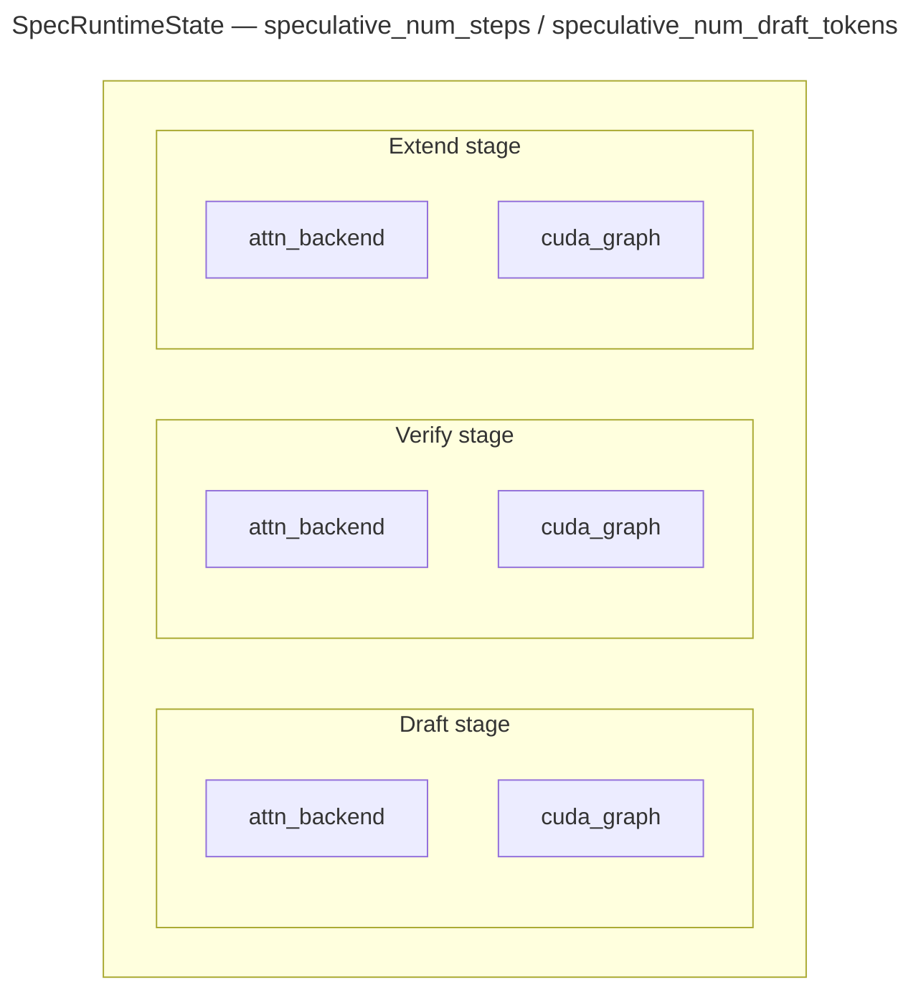
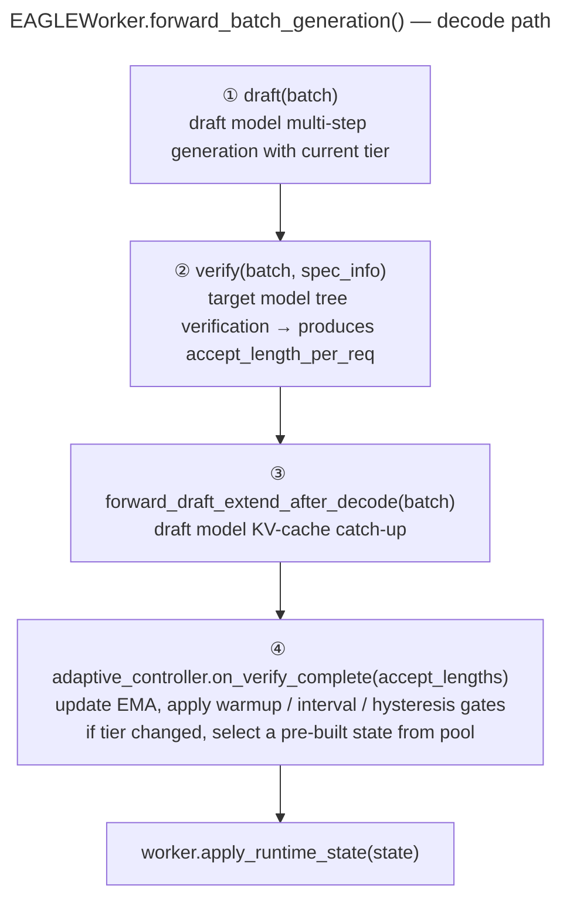

Adaptive speculative decoding lets SGLang adjust `speculative_num_steps/speculative_num_draft_tokens` at runtime instead of keeping a single fixed value for the whole server lifetime.
It is designed for workloads whose accept length changes over time, where one static step count is rarely optimal.

## Current support

- Only `--speculative-algorithm EAGLE`
- Only `--speculative-eagle-topk 1`
- If either condition is not met, SGLang falls back to static speculative settings

## Why adaptive steps help

`speculative_num_steps` controls how many draft-model autoregressive steps run in each speculative round. In practice, the best value depends on the current workload.

- If `num_steps` is too small, the draft model could have produced more accepted tokens, but the round stops too early.
- If `num_steps` is too large, the draft model produces many candidate tokens that the target model rejects, so extra draft work is wasted.

Real traffic often moves between high-acceptance and low-acceptance phases, so one fixed step count is usually a compromise. Adaptive mode tries to follow the workload instead of hard-coding a single global `num_steps`.

## Design overview

The adaptive mechanism has three pieces:

- `AdaptiveSpeculativeParams`: the EMA-based policy
- `SpecRuntimeState`: the per-tier runtime state bundle
- `AdaptiveController`: the coordinator that chooses a tier and activates the matching runtime state

At startup, SGLang pre-builds one runtime state per candidate tier. By default, the candidate tiers are `candidate_steps = [1, 3, 7]`.



This matters because `CudaGraphRunner` is shape-dependent. Each candidate tier owns its own graph and backend state, so runtime switching is a reference swap, not an online graph recapture.

## Runtime flow

The adaptive update happens after verify and affects the next round, not the current one:



> Tier switch happens after the current round completes. Backends and CUDA graphs are never swapped mid-round.

## How the policy decides

After each verify pass, SGLang reads the accepted draft length per request, computes the batch average, smooths it with an exponential moving average (EMA), and switches among the pre-built candidate tiers `[1, 3, 7]` by default.

The decision logic is intentionally conservative:

- `warmup_batches` skips the first few batches
- `update_interval` avoids switching every batch
- `down_hysteresis` and `up_hysteresis` reduce oscillation

Conceptually, the policy probes one step beyond the observed acceptance:

```text
target_steps ≈ clamp(round(ema_accept_len) + 1, min(candidate_steps), max(candidate_steps))
```

So if recent requests consistently accept more drafted tokens, the policy tends to move up. If they start rejecting earlier, it tends to move down.

## Usage

`--speculative-adaptive-config` is optional, but the speculative setup still needs to be valid for adaptive mode.

```bash
python3 -m sglang.launch_server \
    --model meta-llama/Llama-2-7b-chat-hf \
    --speculative-algorithm EAGLE \
    --speculative-draft-model-path lmsys/sglang-EAGLE-llama2-chat-7B \
    --speculative-eagle-topk 1 \
    --speculative-num-steps 3 \
    --speculative-num-draft-tokens 4 \
    --speculative-adaptive
```

If you want to override the defaults, add `--speculative-adaptive-config /path/to/adaptive_spec.json`.

Example config:

```json
{
  "candidate_steps": [1, 3, 7],
  "ema_alpha": 0.2,
  "warmup_batches": 10,
  "update_interval": 5
}
```

## Config file reference

The config file is optional. Any omitted keys use defaults.

<table style={{width: "100%", borderCollapse: "collapse", tableLayout: "fixed"}}>
  <colgroup>
    <col style={{width: "33.33%"}} />
    <col style={{width: "33.33%"}} />
    <col style={{width: "33.33%"}} />
  </colgroup>
  <thead>
    <tr>
      <th>Key</th>
      <th>Default</th>
      <th>Meaning</th>
    </tr>
  </thead>
  <tbody>
    <tr>
      <td><code>candidate_steps</code></td>
      <td><code>[1, 3, 7]</code></td>
      <td>Discrete <code>speculative_num_steps</code> tiers that adaptive mode can switch between</td>
    </tr>
    <tr>
      <td><code>ema_alpha</code></td>
      <td><code>0.2</code></td>
      <td>EMA smoothing factor for accepted draft length</td>
    </tr>
    <tr>
      <td><code>update_interval</code></td>
      <td><code>5</code></td>
      <td>Recompute interval, in verify batches, after warmup</td>
    </tr>
    <tr>
      <td><code>warmup_batches</code></td>
      <td><code>10</code></td>
      <td>Number of verify batches to observe before switching</td>
    </tr>
    <tr>
      <td><code>down_hysteresis</code></td>
      <td><code>-0.25</code></td>
      <td>Extra margin before moving to a smaller step</td>
    </tr>
    <tr>
      <td><code>up_hysteresis</code></td>
      <td><code>0.0</code></td>
      <td>Extra margin before moving to a larger step</td>
    </tr>
  </tbody>
</table>

The initial `--speculative-num-steps` is snapped to the nearest value in `candidate_steps`.

## Monitoring

You can inspect the active tier and acceptance metric via `/server_info`:

```bash
curl -s http://127.0.0.1:30000/server_info | jq '.internal_states[0] | {speculative_num_steps, avg_spec_accept_length}'
```

- `speculative_num_steps` is the current active tier
- `avg_spec_accept_length` helps explain whether the server is likely to move up or down

## Tuning tips

- Start with the default candidate tiers `[1, 3, 7]`
- Use fewer tiers if you want lower startup and graph-memory overhead
- Increase `ema_alpha` to react faster, or lower it for more stability
- Increase `warmup_batches` or `update_interval` if tier switching is too noisy
- If your workload is already stable and one static setting is well tuned, adaptive mode may not help much
