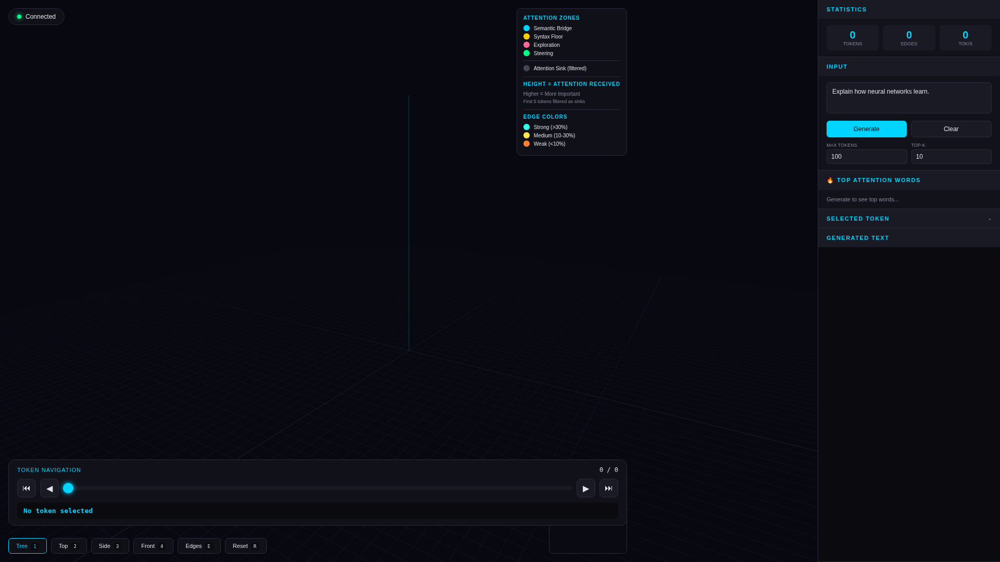
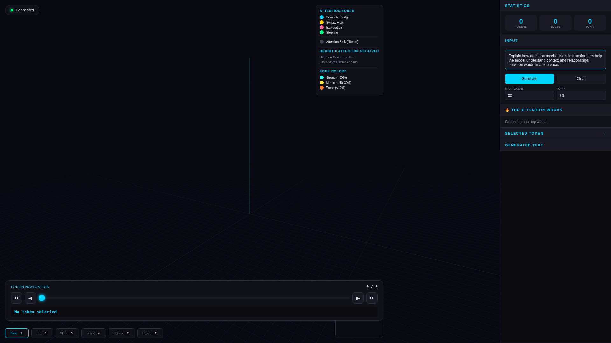
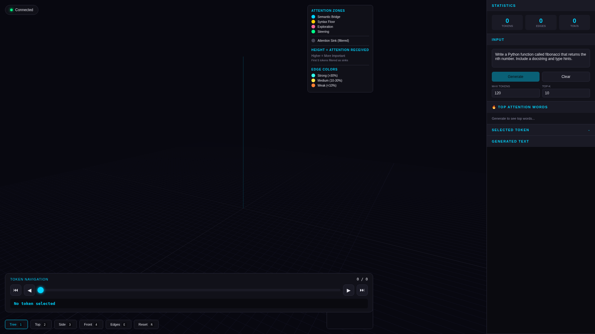
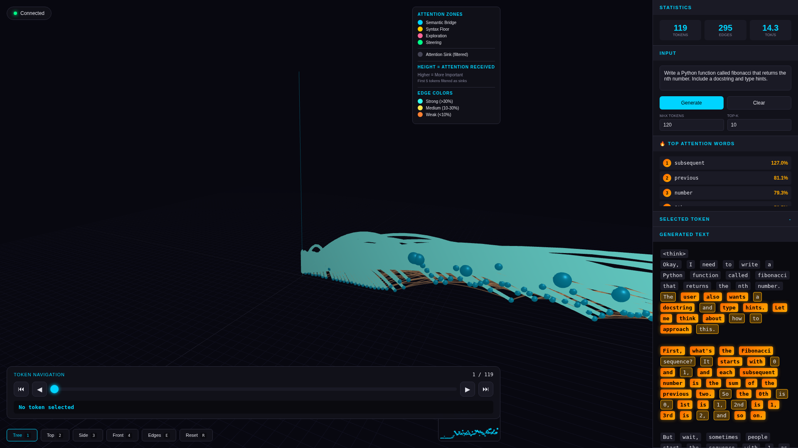
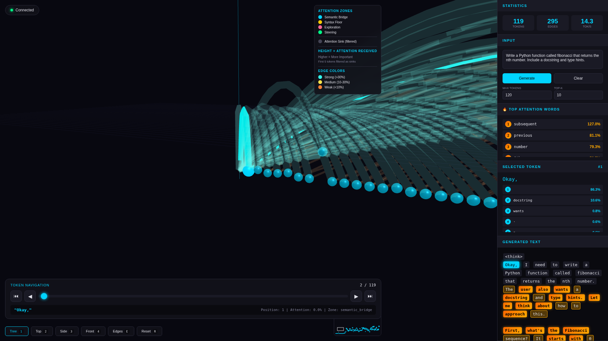
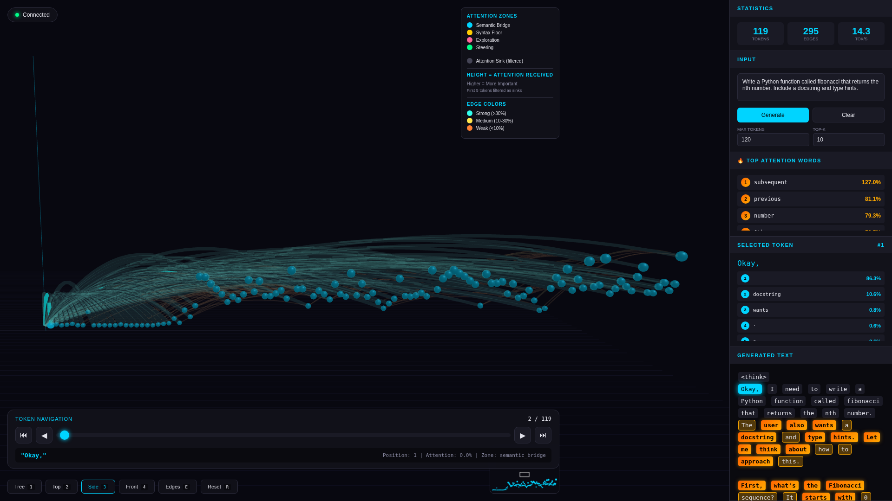
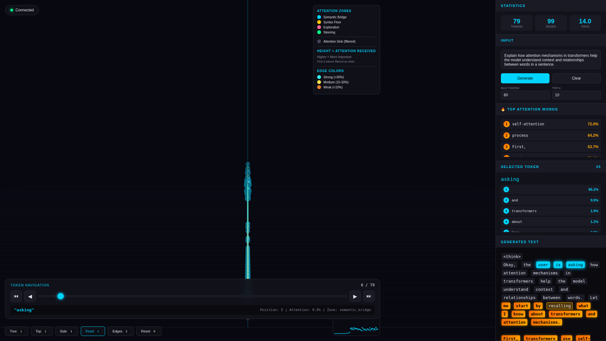
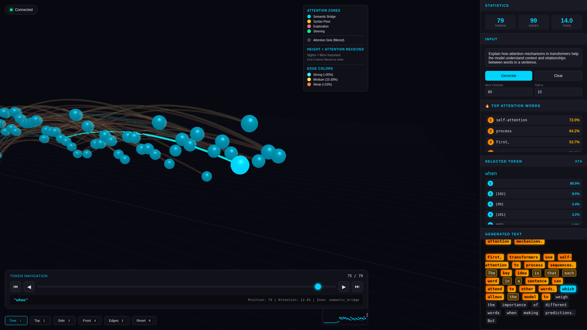
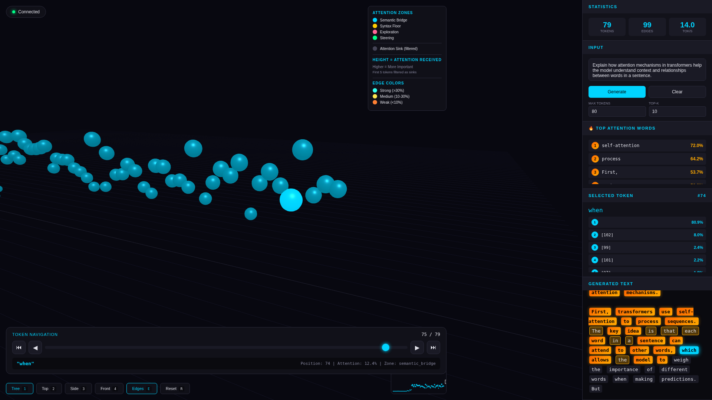
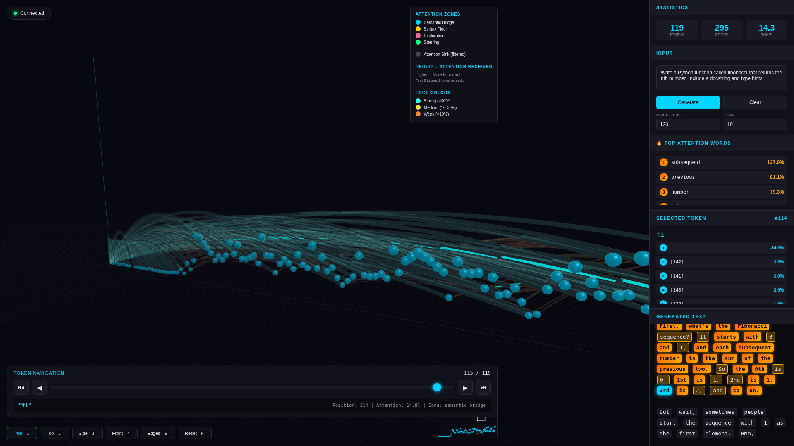

# SGLang 3D Attention Visualization Demo

This folder contains demo recordings of SGLang's 3D attention tree visualization, showing how the model attends to different tokens during text generation.

## Video Demo

**[sglang_3d_attention_demo.mp4](sglang_3d_attention_demo.mp4)** - Full demo showing:
- Real-time 3D tree building as tokens are generated
- Camera view switching (Tree, Top, Side, Front)
- Token navigation with attention highlighting
- Edge toggling for attention flow visualization

## Screenshots

| Initial State | Prompt Entry | Streaming |
|:---:|:---:|:---:|
|  |  |  |

| Early Tree | Complete Tree | Top View |
|:---:|:---:|:---:|
|  |  |  |

| Side View | Front View | Navigation |
|:---:|:---:|:---:|
|  |  |  |

| No Edges | Final View |
|:---:|:---:|
|  |  |

## How It Works

The 3D visualization shows:
- **X-axis**: Token sequence position
- **Y-axis**: Attention received (log scale) - higher = more attended to
- **Node colors**: Manifold zones (semantic_bridge=cyan, syntax_floor=yellow)
- **Edges**: Attention connections between tokens

## Running the Demo

```bash
# Start SGLang server with attention capture
python -m sglang.launch_server \
    --model-path Qwen/Qwen3-4B \
    --return-attention-tokens \
    --attention-tokens-top-k 10 \
    --attention-backend triton

# Start WebSocket bridge
python attention_ws_server.py --sglang-url http://localhost:30000

# Open the 3D explorer
open explorer_3d.html

# Or run the automated demo recording
node record_3d_demo.js
```

## Requirements

- SGLang with attention capture enabled
- Node.js + Playwright for recording
- WebGL-capable browser for 3D visualization
