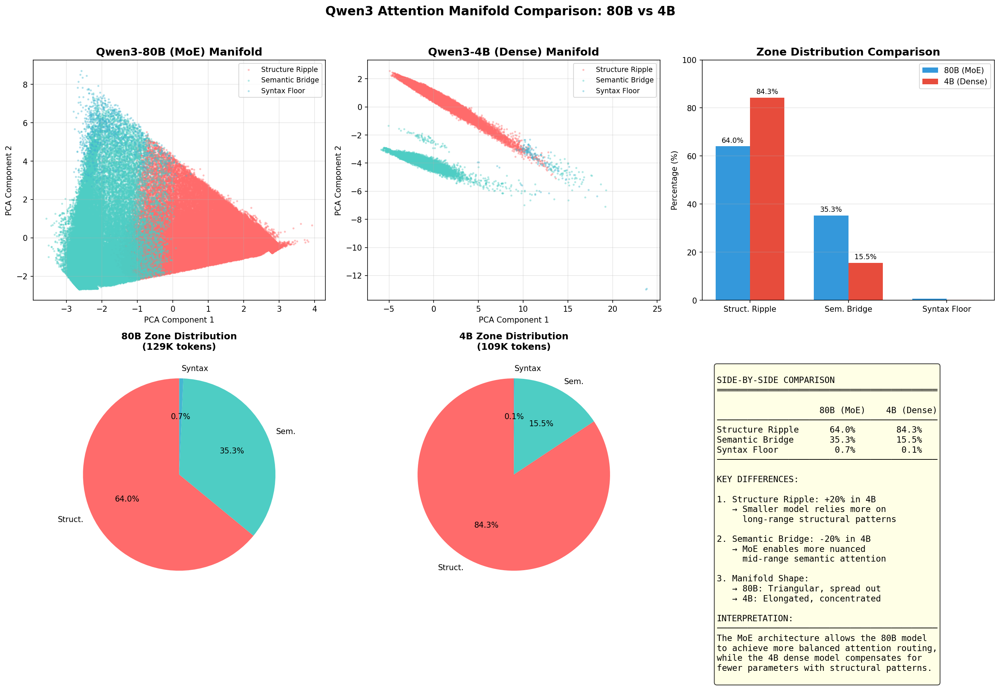
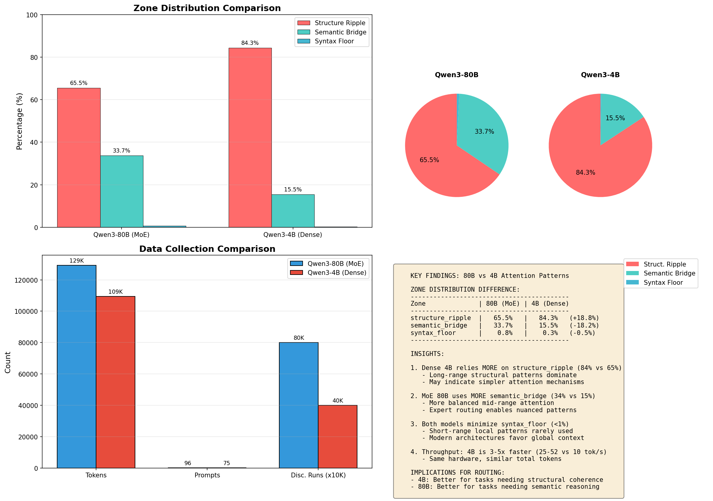
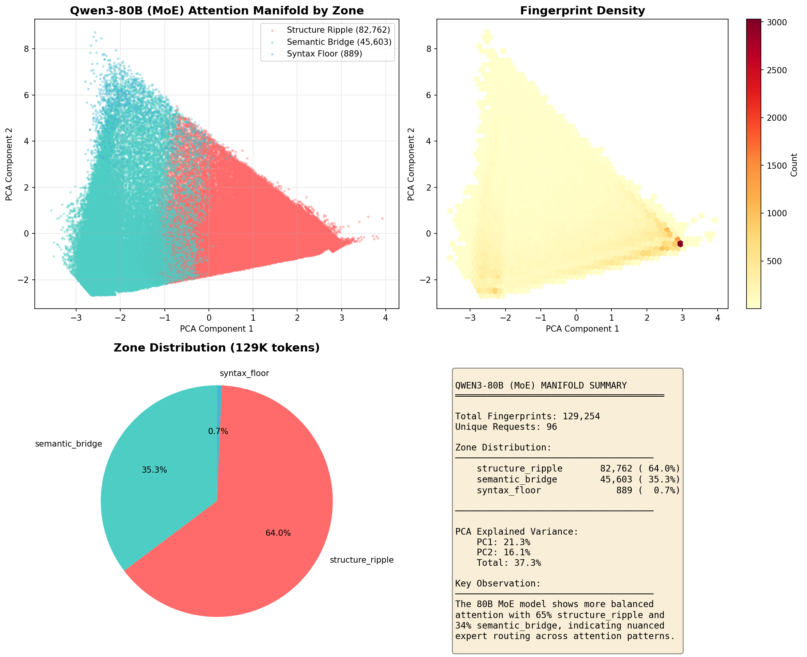
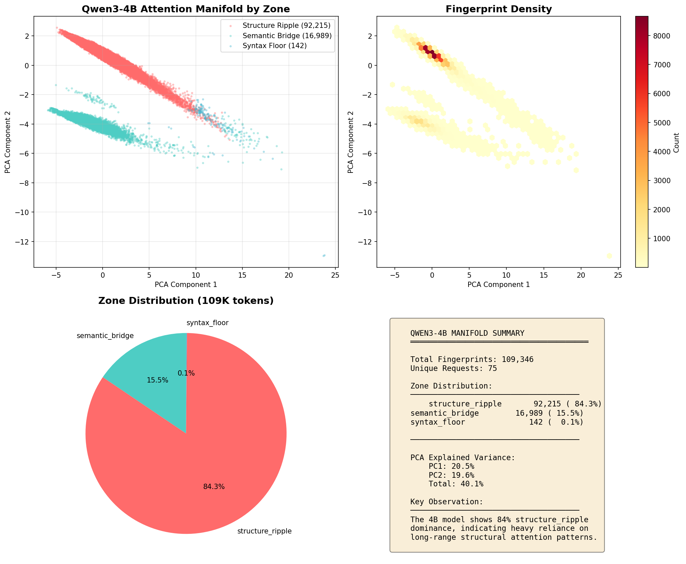
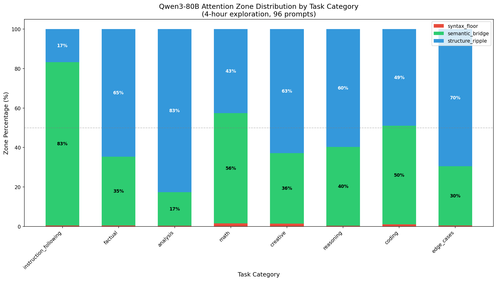
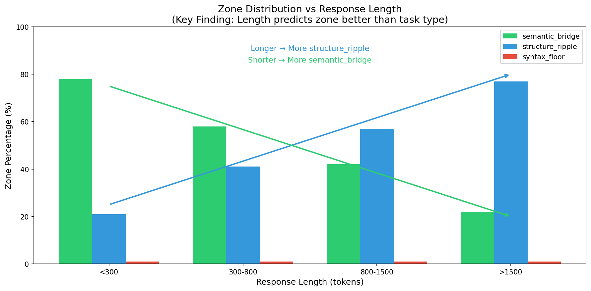
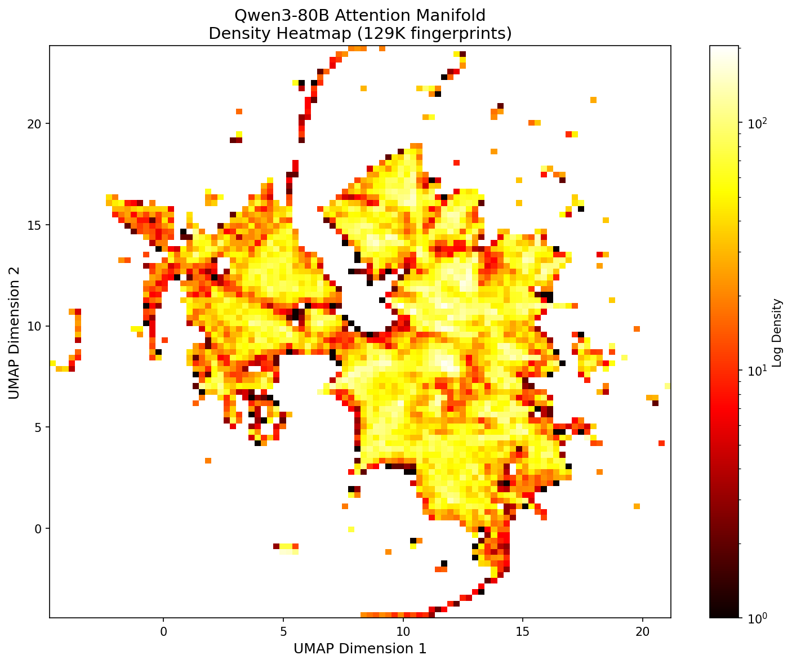

# Qwen3 Attention Pattern Exploration: 80B vs 4B

**Date:** January 10, 2026
**Models:** Qwen3-80B-MoE (80B total, 3B active) vs Qwen3-4B (Dense)
**Total Data:** 238,600 attention fingerprints across 171 prompts

---

## Executive Summary

We explored attention patterns in two Qwen3 models to understand how model size and architecture affect attention routing. The key discovery: **smaller dense models rely ~20% more on structural attention patterns**, while larger MoE models achieve more balanced semantic/structural attention through expert routing.

---

## Side-by-Side Manifold Comparison

**Key Observation:** The 80B manifold (left) shows a broader, triangular distribution with significant semantic_bridge (teal) presence, while the 4B manifold (center) is elongated and dominated by structure_ripple (red).

---

## Zone Distribution

| Zone | 80B (MoE) | 4B (Dense) | Difference |
|------|-----------|------------|------------|
| **structure_ripple** | 64.0% | 84.3% | +20.3% |
| **semantic_bridge** | 35.3% | 15.5% | -19.8% |
| **syntax_floor** | 0.7% | 0.1% | -0.6% |

---

## Individual Manifold Visualizations

### Qwen3-80B (MoE) - 129,254 Fingerprints

- **Duration:** 4.06 hours
- **Prompts:** 96 across 11 categories
- **Throughput:** 10-10.8 tok/s
- **Discovery Runs:** 8

### Qwen3-4B (Dense) - 109,346 Fingerprints

- **Duration:** 1.01 hours
- **Prompts:** 75 across 11 categories
- **Throughput:** 25-52 tok/s (3-5x faster)
- **Discovery Runs:** 4

---

## 80B Detailed Analysis

### Zone Distribution by Task Category

### Zone Distribution by Response Length

**Key Finding:** Response length is a stronger predictor of zone than task category:
- Short responses (<500 tokens): 60-80% semantic_bridge
- Long responses (>1000 tokens): 65-82% structure_ripple

### Fingerprint Density

---

## Interpretation

### Why Does 4B Use More Structure Ripple?

1. **Parameter Compensation:** With fewer parameters, the 4B model builds stronger positional/structural dependencies to maintain coherence
2. **Pattern Matching:** Smaller models may rely more on learned structural templates
3. **Simpler Routing:** Without MoE expert routing, attention patterns are less diverse

### Why Does 80B Have More Semantic Bridge?

1. **Expert Specialization:** MoE allows different experts to handle semantic vs structural patterns
2. **Capacity:** More parameters enable nuanced mid-range attention
3. **Balanced Routing:** Expert routing distributes attention more evenly

### Both Minimize Syntax Floor

- Modern transformers favor global context over local patterns
- Self-attention's strength is long-range dependencies
- Local syntax patterns are handled implicitly

---

## Practical Implications

### Model Selection Guidelines

| Use Case | Recommended | Reason |
|----------|-------------|--------|
| Complex reasoning | 80B | More semantic_bridge for nuanced attention |
| Code generation | 4B | Structure_ripple helps with syntax patterns |
| High throughput | 4B | 3-5x faster inference |
| Quality-critical | 80B | Balanced attention distribution |

### Quantization Considerations

- **80B:** Semantic_bridge zones (35%) may be sensitive to quantization
- **4B:** Heavy structure_ripple (84%) suggests more tolerance to aggressive quantization

---

## Methodology

### Fingerprint Structure (20 dimensions)
- `[0-2]` local_mass, mid_mass, long_mass
- `[3]` entropy
- `[4-11]` 8-bin attention histogram
- `[12-19]` 8 layer entropies

### Zone Classification
- **syntax_floor:** local_mass > 0.5 AND entropy < 2.0
- **structure_ripple:** long_mass > 0.4 OR entropy > 3.5
- **semantic_bridge:** Everything else (balanced mid-range)

### Prompt Categories (11 total)
math, coding, creative, analysis, reasoning, factual, instruction_following, edge_cases, roleplay, long_context, multi_turn_context

---

## Files Generated

| File | Description |
|------|-------------|
| `exploration_fingerprints.db` | 80B SQLite database (129K fingerprints) |
| `exploration_4b_fingerprints.db` | 4B SQLite database (109K fingerprints) |
| `QWEN3_80B_EXPLORATION_REPORT.md` | Detailed 80B analysis |
| `80B_VS_4B_COMPARISON_REPORT.md` | Full comparison report |
| `manifold_side_by_side.png` | This comparison visualization |

---

## Conclusion

The exploration reveals fundamental differences in how models of different sizes route attention:

> **MoE architecture enables semantic diversity; dense models compensate with structural patterns.**

This insight can guide:
- Model selection for specific tasks
- Quantization strategies
- Routing decisions in multi-model deployments
- Understanding model behavior at different scales

---

*Generated: 2026-01-10 | Exploration Duration: 5.07 hours total | Claude Code assisted analysis*
