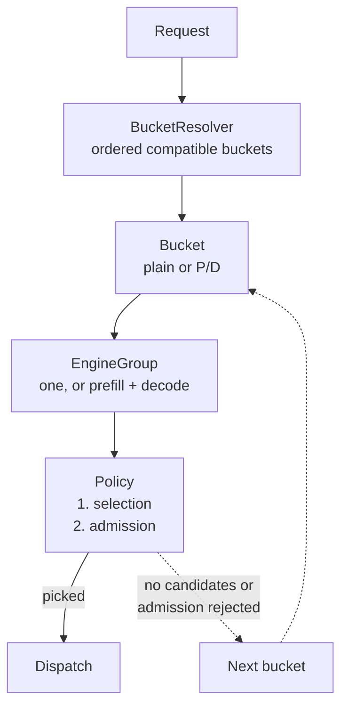
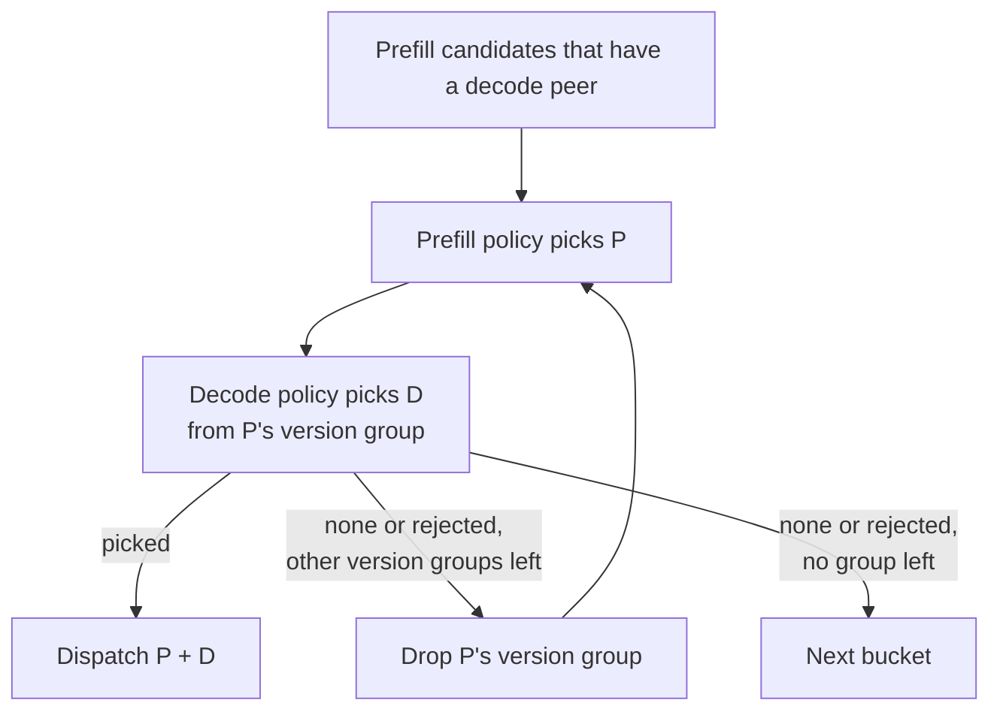
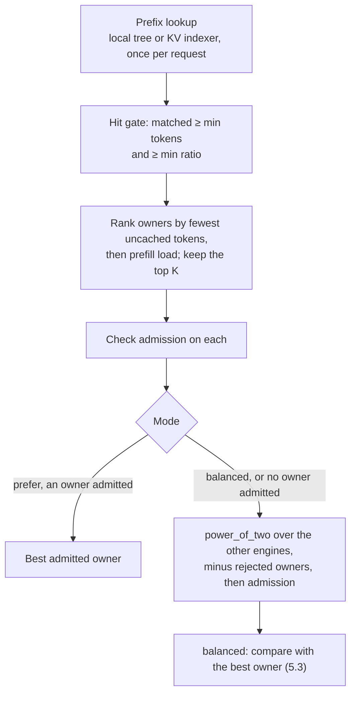

# Routing policies

This document describes how the router picks engines when started with
`--chat-routing reorg`; the default (legacy) routing path is not covered.

- [1. Overview](#1-overview) — architecture, policies at a glance, configuration
- [2. Load signals](#2-load-signals)
- [3. Buckets](#3-buckets)
- [4. Engine groups](#4-engine-groups)
- [5. Policies](#5-policies) — selection, prefer vs balanced, admission
- [6. Failures and retries](#6-failures-and-retries)
- [7. Code map](#7-code-map)
- [Appendix: legacy options](#appendix-legacy-options)

## 1. Overview

### 1.1 Architecture



Three layers, each with one job:

| Layer | Decides | Never | Configured by |
| --- | --- | --- | --- |
| [Bucket](#3-buckets) | Which buckets fit the request's length and SLO; plain vs P/D | Looks at engine load | `--bucket-config` bucket fields |
| [Engine group](#4-engine-groups) | Which live engines are candidates | Ranks engines | `worker_ids` / `worker_services` |
| [Policy](#5-policies) | Which candidate (**selection**) and whether it may take the request (**admission**) | Leaves its candidate set or bucket | `--policy`, group `policy` / `admission` / `affinity` |

Rules that hold everywhere:

1. Both engines of a P/D pair come from the same bucket.
2. The router moves to the next bucket only when a group has no candidates or
   its policy rejects on admission. Any other error stops routing.
3. Nothing is dispatched until a bucket has supplied the complete selection.

Every model-serving endpoint uses this path: `/v1/chat/completions`,
`/v1/completions`, `/generate`, `/v1/embeddings`, `/v1/classify` and `/v1/rerank`.

### 1.2 Policies at a glance

A group's policy has two parts: **selection** picks one engine, **admission**
decides whether that engine may take the request.

| Policy | Part | Stages | [Affinity mode](#53-prefer-vs-balanced) | Reads |
| --- | --- | --- | --- | --- |
| [`power_of_two`](#power_of_two) | selection | all; the default, and always the decode default | — | engine load |
| [`cache_aware`](#cache_aware) | selection | plain, prefill | `prefer` / `balanced` | prefix index + load |
| [`session_aware`](#session_aware) | selection | all | `prefer` / `balanced` | session bindings + load |
| [Admission caps](#54-admission) | admission | all; every group | — | engine load + router in-flight |

`cache_aware` and `session_aware` are **affinity policies**: they have a preferred
engine (a prefix owner or the bound session engine) and fall back to
`power_of_two` when it is missing or rejected.

### 1.3 Configuration

Precedence: **group JSON field > CLI flag > built-in default**. Without
`--bucket-config` there are two default buckets covering every engine, `plain`
(rank 0) and `pd` (rank 1); discovery decides which one has candidates.

**Routing**

| Flag | Default | Group JSON key |
| --- | --- | --- |
| `--chat-routing reorg` | `legacy` | — |
| `--policy` | `power_of_two` | `policy`: `power_of_two` or the `--policy` value |
| `--bucket-config <file>` | default buckets | — |
| `--retry-max-attempts` | 1 (no retry) | — |

**Admission**: each cap is unset (not checked) by default. See [5.4](#54-admission).

| Flag | Group JSON key (`admission.*`) |
| --- | --- |
| `--max-in-flight N` | `max_inflight_requests` |
| `--max-waiting-requests N` | `max_waiting_requests` |
| `--max-pending-prefill-tokens N` | `max_pending_prefill_tokens` |
| `--max-running-usage F` | `max_running_usage` |
| `--max-kv-usage F` | `max_kv_usage` |

**Affinity** (`cache_aware`, `session_aware`). See [5.3](#53-prefer-vs-balanced).

| Flag | Default | Group JSON key (`affinity.*`) |
| --- | --- | --- |
| `--affinity-mode` | `prefer` | `mode` |
| `--affinity-balanced-by` | `prefill-tokens` | `balanced_by` (`prefill_tokens` / `running_requests`) |
| `--affinity-load-factor` | 2 (must be ≥ 1) | `load_factor` |
| `--affinity-load-gap` | 1024 tokens or 4 requests | `load_gap` |

The last three require balanced mode.

**Cache-aware** (global; no group override)

| Flag | Default |
| --- | --- |
| `--cache-affinity-min-matched-tokens` | 1024 |
| `--cache-affinity-min-match-ratio` | unset |
| `--cache-candidate-min-workers` / `-ratio` / `-max-workers` | 8 / 0.05 / 32 |
| `--kv-indexer-endpoint` | unset: use the router-local radix tree |

**Session-aware** (global): `--session-id-header` (default `x-session-id`),
`--session-idle-secs` (600), `--session-eviction-interval-secs` (60).

**Example A: CLI only.** Default buckets, cache-aware prefill:

```bash
sgl-router --chat-routing reorg --policy cache_aware \
  --affinity-mode prefer \
  --cache-affinity-min-match-ratio 0.2 \
  --max-waiting-requests 16 --max-in-flight 56 ...
```

- A prefill engine is a prefix owner if it holds ≥ 1024 matched tokens **and**
  ≥ 20% of the prompt.
- `prefer` sends the request to the best owner that passes admission.
- Every engine in every group, decode included, is rejected while it reports
  ≥ 16 waiting requests or this router has ≥ 56 requests in flight to it.

**Example B: bucket file** (with `--policy cache_aware`, which prefill groups
inherit). A short P/D tier with a TTFT estimate, and a long tier:

```json
{
  "ttft_slo": "slo_first",
  "buckets": [
    {
      "id": "short",
      "max_input_tokens": 4096,
      "max_context_tokens": 8192,
      "ttft_ms": 300,
      "prefill": {
        "worker_services": ["inference/prefill-short"],
        "admission": {"max_pending_prefill_tokens": 32768},
        "affinity": {"mode": "balanced", "load_factor": 1.5}
      },
      "decode": {
        "worker_services": ["inference/decode-short"],
        "admission": {"max_kv_usage": 0.9}
      }
    },
    {
      "id": "long",
      "rank": 1,
      "max_context_tokens": 131072,
      "prefill": {"worker_services": ["inference/prefill-long"]},
      "decode": {"worker_services": ["inference/decode-long"]}
    }
  ]
}
```

Each bucket sets `plain`, or both `prefill` and `decode`. Group admission fields
left unset (or `null`) inherit the CLI caps; to cap only some groups, leave the
CLI flag unset. Startup rejects duplicate or empty IDs, a bucket that is neither
plain nor P/D, inverted token ranges, empty membership lists, both membership
fields at once, usages outside (0, 1], zero counts, `affinity` on a
`power_of_two` group, and a policy its stage cannot serve.

## 2. Load signals

Policies and admission read the same per-engine numbers.

| Signal | Source | Used by |
| --- | --- | --- |
| Running requests | Engine report (any version) | ranking, `max_running_usage`, balanced `running_requests` |
| Waiting requests | Engine report (any version) | ranking, `max_waiting_requests` |
| Waiting uncached tokens | Engine report (native) | ranking, `max_pending_prefill_tokens`, balanced `prefill_tokens` |
| KV used / KV capacity | Engine report (native) | decode ranking, `max_kv_usage` |
| Max running requests | Engine report (native) | `max_running_usage` |
| Estimated prefill queue time | Engine report (native; needs two samples) | prefill ranking |
| In-flight requests | Router-local counter | ranking tie-break and fallback, `max_inflight_requests` |

- A report is **fresh** when every DP rank of the engine reported within 5 s;
  ranks are summed. Otherwise the reported values are *unknown*, never zero.
- An unknown value lets its admission cap pass (fail open) and makes ranking
  fall back to in-flight requests.
- Each pick takes one snapshot, used by both selection and admission. Nothing is
  reserved, and reports lag dispatches by up to one report interval.

**Ranking** (lower wins), used by `power_of_two` and to order cache owners:

| Stage | Order |
| --- | --- |
| plain / prefill | est. prefill queue time (when both have it) → waiting uncached tokens → waiting requests → running requests → in-flight |
| decode | waiting requests → running requests → KV usage % → KV used tokens → in-flight |
| either engine lacks a fresh native report | in-flight only |

Example: prefill A reports a 120 ms queue and 9k waiting uncached tokens; B
reports 80 ms and 12k. B wins on queue time. Without B's queue estimate, A would
win on uncached tokens.

## 3. Buckets

A bucket owns token limits, optional SLO estimates, a rank, and either one plain
group or a prefill + decode pair. `BucketResolver::resolve` returns every
compatible bucket, in order:

1. **Input range**: `min_input_tokens ≤ input ≤ max_input_tokens`.
2. **Context**: expected peak (input + requested output, or input when output is
   unknown) ≤ `max_context_tokens`.
3. **SLO tiers** (optional): with `ttft_slo` / `tps_slo` set to `slo_first`,
   buckets that meet the request's `x-sgl-ttft-slo-ms` (estimate ≤ target) or
   `x-sgl-tps-slo` (estimate ≥ target) come first; `best_effort` puts them last.
   Each unmet preference adds one tier. A header is ignored while its preference
   is disabled.
4. **Within a tier**: smaller input capacity, then lower `rank`, then ID.

Example (Example B): 4k input with a 16k expected peak exceeds `short`'s 8k
context, so only `long` is returned. With an 8k peak and
`x-sgl-ttft-slo-ms: 200`, both fit; neither meets 200 ms, so they share a tier
and `short` comes first on capacity. If `short`'s groups are full, `long` is
tried next.

## 4. Engine groups

**Membership**: set at most one of these.

- *Omitted*: every engine of the group's role.
- `worker_ids`: exact identities. The URL for static discovery;
  `namespace/pod-UID` for Kubernetes, which changes when a pod is replaced.
- `worker_services`: Kubernetes `namespace/service` names, matched through the
  EndpointSlice `kubernetes.io/service-name` label. Survives pod replacement.

**Candidates** are the live engines for the model that are healthy, have the
group's role, match membership, and are not excluded by a
[retry](#6-failures-and-retries). The group rejects any policy result outside
this set.

**P/D pairing.** A prefill engine only hands KV to a decode engine in its own
version group (`--pd-version-group-label`):



## 5. Policies

### 5.1 Contract

```rust
pub trait Policy: Send + Sync + Debug {
    fn pick<'a>(&'a self, engines: &'a [Arc<Worker>], request: &'a PickRequest<'a>)
        -> BoxFuture<'a, Result<Pick, PickError>>;
}
```

- `PickRequest` carries request facts only: model, stage, bucket ID, input token
  counts, token IDs and session key.
- A policy owns its state handles (load table, prefix index, session store) and
  checks admission itself.
- `Pick` is one engine plus a reason string, such as `cache_candidate` or
  `session_rebound`.

| Result | Meaning | Router action |
| --- | --- | --- |
| `Pick` | An admitted engine from the candidates | Dispatch (after both P/D picks) |
| `NoCandidates` | Empty candidate set | Next bucket |
| `AdmissionRejected` / `NoAdmissibleEngine` | The chosen engine(s) failed admission | Next bucket |
| `InvalidSignal` / `InvalidConfiguration` / `OutsideCandidates` | Bad input or a bug | Stop with 500 |

### 5.2 Selection

#### power_of_two

Sample two distinct candidates, keep the one that [ranks](#2-load-signals) lower,
and check admission on it **once**. A rejection is returned as is; the other
sample is not tried. A single candidate is taken directly.

Example: decode D1 (0 waiting, 40 running) vs D2 (2 waiting, 10 running): D1
wins, because waiting requests are compared first.

#### cache_aware



- **K** = min(candidates, max workers, max(min workers, ⌈ratio × candidates⌉)).
  With the defaults that is at most 8 until a group exceeds 160 engines.
- If no owner is admitted and the fallback pick is rejected, the policy returns a
  rejection and the router moves to the next bucket.
- An unavailable indexer counts as a miss; a query the indexer rejects is an error.

Example: a 10k-token prompt with `--cache-affinity-min-match-ratio 0.2` and
`--max-waiting-requests 16`:

| Engine | Cached | Owner? | Uncached | Waiting | Result |
| --- | --- | --- | --- | --- | --- |
| E1 | 8,000 (80%) | yes | 2,000 | 16 | rejected by the cap |
| E2 | 3,000 (30%) | yes | 7,000 | 3 | **picked** (prefer) |
| E3 | 500 (5%) | no: below 1024 and 20% | 9,500 | 0 | fallback pool only |

#### session_aware

Bindings are keyed by **stage + model + bucket + session ID** (read from
`--session-id-header`) and expire after `--session-idle-secs` without use.

| Situation | Behavior | Reason |
| --- | --- | --- |
| No session header | `power_of_two` + admission; nothing is bound | `no_session` |
| No binding, or the bound engine is no longer a candidate | `power_of_two` + admission, then bind | `assigned` |
| Bound engine admitted, `prefer` | Bound engine | `session_primary` |
| Bound engine admitted, `balanced` | Compare with a `power_of_two` alternative ([5.3](#53-prefer-vs-balanced)) | `session_primary` or `session_rebound` |
| Bound engine rejected | `power_of_two` over the other engines + admission, then rebind | `session_rebound` |

Bindings are written during selection, after admission; a later dispatch failure
does not undo them. When two first requests race, the first binding wins and the
second request checks admission on it. If the fallback is also rejected, the old
binding is kept.

### 5.3 Prefer vs balanced

This applies to `cache_aware` and `session_aware`. The **affinity engine** (A) is
the best admitted prefix owner, or the admitted bound engine.

| | `prefer` (default) | `balanced` |
| --- | --- | --- |
| A admitted | Use A | Sample B with `power_of_two` from the other admitted engines; use B only if A is clearly busier |
| A missing or rejected | `power_of_two` fallback | same |
| What moves traffic off A | Admission caps only | Admission caps, or the load comparison |

Balanced switches from A to B only when **both** hold:

```text
load(A) > load_factor × load(B)      default 2
load(A) − load(B) > load_gap         default 1024 tokens or 4 requests
```

| `balanced_by` | load(engine) | Effect |
| --- | --- | --- |
| `prefill_tokens` (default) | reported waiting uncached tokens + this request's uncached tokens on that engine | cache-aware: A pays only for its uncached suffix. session-aware: both pay for the full prompt |
| `running_requests` | reported running requests | the request is not counted |

A missing report on either engine, or a tie, keeps A.

Examples (cache-aware, 10k prompt, A caches 8k, B caches nothing):

- `prefill_tokens`: A has 30k waiting, so load(A) = 30k + 2k = 32k. B has 4k waiting,
  so load(B) = 4k + 10k = 14k. 32k > 28k and the gap 18k > 1024, so **B**.
  With 20k waiting on A, load(A) = 22k < 28k, so **A**.
- `running_requests`: A 10 vs B 4: 10 > 8 and 6 > 4, so **B**. A 7 vs B 4: 7 < 8, so **A**.

### 5.4 Admission

Admission is a set of per-engine caps (`AdmissionLimits`). The CLI flags set the
default for **every group**, decode included; a group's `admission` overrides it
field by field.

| Cap | Rejects when | Unit |
| --- | --- | --- |
| `max_inflight_requests` | router in-flight ≥ cap | requests |
| `max_waiting_requests` | reported waiting ≥ cap | requests |
| `max_pending_prefill_tokens` | reported waiting uncached tokens ≥ cap | tokens |
| `max_running_usage` | running ÷ max running ≥ cap | share in (0, 1] |
| `max_kv_usage` | KV used ÷ KV capacity ≥ cap | share in (0, 1] |

- An unset cap is not checked, and an unknown value passes.
- The incoming request is not counted, so an engine just below a cap still takes it.
- Admission observes load but never reserves it; concurrent requests can pass
  against the same snapshot.

Where each policy checks:

| Policy | Engines checked | On rejection |
| --- | --- | --- |
| `power_of_two` | the one it picked | return the rejection |
| `cache_aware` | each of the top-K owners, then the fallback pick | skip rejected owners; if the fallback is rejected, return the rejection |
| `session_aware` | the bound engine, then the fallback pick | rebind to an admitted fallback; otherwise return the rejection and keep the binding |

## 6. Failures and retries

| After trying every bucket | HTTP |
| --- | --- |
| No bucket fits the length | 400 |
| At least one group rejected on admission | 503 (policy selection failed) |
| Only empty groups | 503 (no healthy, prefill or decode workers) |
| Invalid signal, configuration or foreign pick | 500, immediately |

With `--retry-max-attempts` above 1, a dispatch that fails before any response
reaches the client (transport error, 5xx or 429) reruns selection from the first
bucket with the failed engine excluded. A response the client has started to
receive is never retried.

## 7. Code map

Paths are under `experimental/sgl-router/src/`.

| File | Contents |
| --- | --- |
| `buckets_reorg.rs` | `BucketResolver`, `Bucket`, `EngineGroup`, P/D pairing |
| `policies_reorg/mod.rs` | `Policy`, `PickRequest`, `Pick`, `PickError` |
| `policies_reorg/power_of_two.rs` | `PowerOfTwoPolicy` |
| `policies_reorg/cache_aware.rs` | `CacheAwarePolicy`, `CacheSource`, `PrefixMemo` |
| `policies_reorg/session_aware.rs` | `SessionAwarePolicy` |
| `policies_reorg/affinity.rs` | prefer / balanced decision |
| `policies_reorg/admission.rs` | `AdmissionLimits`, `EngineMetrics` |
| `policies_reorg/factory.rs` | `--bucket-config` schema, validation, policy construction |
| `server/routes/chat/reorg.rs` | bucket loop and error mapping |
| `state/load_monitor/` | engine reports, freshness, ranking |
| `state/kv_events/` | router-local prefix index |
| `state/affinity_store.rs` | session bindings and expiry |

## Appendix: legacy options

Settings shared with the legacy path keep their meaning: cache source and indexer
options, cache hit and candidate bounds, and the session header and timeouts.
These are rejected at startup with `--chat-routing reorg`:

- `--policy` values other than `power_of_two`, `cache_aware` and `session_aware`,
  including `fused_score`, `score_policy` and `--fuse`.
- `--decode-policy` values other than `power_of_two`.
- Legacy `--bucket-config` files; P/D pairs must be written explicitly in the new schema.
- `--filter` values other than `overloaded`, which maps to `max_inflight_requests`.
- `--stable-pair`, `--session-affinity-mode` other than `bucket`, and
  `--affinity-mode soft` / `strict`.
- `--min-load-choices` other than 2, `--worker-queue-limit`,
  `--saturation-queue-floor` and `--cache-switch-margin-tokens`; use
  [balanced mode](#53-prefer-vs-balanced) instead.
