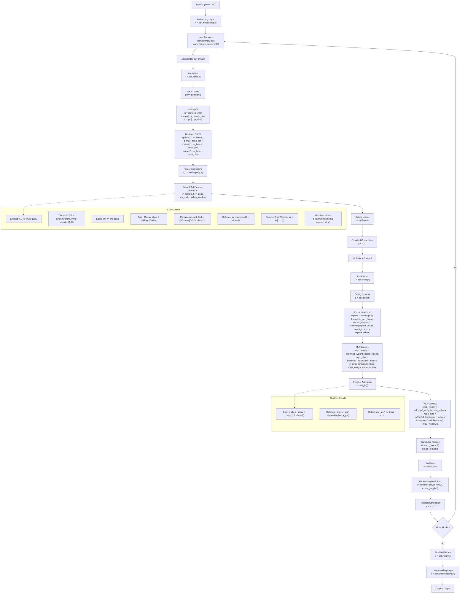

```mermaid
flowchart TD
    A["Input: x (token_ids)"] --> B["Embedding Layer<br/>x = self.embedding(x)"]
    
    B --> C["Loop: For each TransformerBlock<br/>(num_hidden_layers = 36)"]
    
    C --> D["AttentionBlock Forward"]
    D --> D1["RMSNorm<br/>t = self.norm(x)"]
    D1 --> D2["QKV Linear<br/>qkv = self.qkv(t)"]
    D2 --> D3["Split QKV<br/>q = qkv[:, :q_dim]<br/>k = qkv[:, q_dim:qk_dim]<br/>v = qkv[:, qk_dim:]"]
    D3 --> D4["Reshape Q,K,V<br/>q.view(-1, kv_heads, q_mult, head_dim)<br/>k.view(-1, kv_heads, head_dim)<br/>v.view(-1, kv_heads, head_dim)"]
    D4 --> D5["Rotary Embedding<br/>q, k = self.rope(q, k)"]
    D5 --> D6["Scaled Dot-Product Attention<br/>t = sdpa(q, k, v, sinks, sm_scale, sliding_window)"]
    D6 --> D7["Output Linear<br/>t = self.out(t)"]
    D7 --> D8["Residual Connection<br/>x = x + t"]
    
    D8 --> E["MLPBlock Forward"]
    E --> E1["RMSNorm<br/>t = self.norm(x)"]
    E1 --> E2["Gating Network<br/>g = self.gate(t)"]
    E2 --> E3["Expert Selection<br/>experts = torch.topk(g, k=experts_per_token)<br/>expert_weights = softmax(experts.values)<br/>expert_indices = experts.indices"]
    E3 --> E4["MLP Layer 1<br/>mlp1_weight = self.mlp1_weight[expert_indices]<br/>mlp1_bias = self.mlp1_bias[expert_indices]<br/>t = einsum('beck,bk->bec', mlp1_weight, t) + mlp1_bias"]
    E4 --> E5["SwiGLU Activation<br/>t = swiglu(t)"]
    E5 --> E6["MLP Layer 2<br/>mlp2_weight = self.mlp2_weight[expert_indices]<br/>mlp2_bias = self.mlp2_bias[expert_indices]<br/>t = einsum('beck,bek->bec', mlp2_weight, t)"]
    E6 --> E7["Distributed Reduce<br/>(if world_size > 1)<br/>dist.all_reduce(t)"]
    E7 --> E8["Add Bias<br/>t += mlp2_bias"]
    E8 --> E9["Expert Weighted Sum<br/>t = einsum('bec,be->bc', t, expert_weights)"]
    E9 --> E10["Residual Connection<br/>x = x + t"]
    
    E10 --> F{"More Blocks?"}
    F -->|Yes| C
    F -->|No| G["Final RMSNorm<br/>x = self.norm(x)"]
    
    G --> H["Unembedding Layer<br/>x = self.unembedding(x)"]
    H --> I["Output: Logits"]
    
    subgraph "SDPA Details"
        S1["Expand K,V for multi-query"]
        S2["Compute QK = einsum('qhmd,khmd->hmqk', Q, K)"]
        S3["Scale: QK *= sm_scale"]
        S4["Apply Causal Mask + Sliding Window"]
        S5["Concatenate with Sinks: QK = cat([QK, S], dim=-1)"]
        S6["Softmax: W = softmax(QK, dim=-1)"]
        S7["Remove Sink Weights: W = W[..., :-1]"]
        S8["Attention: attn = einsum('hmqk,khmd->qhmd', W, V)"]
    end
    
    subgraph "SwiGLU Details"
        G1["Split: x_glu, x_linear = chunk(x, 2, dim=-1)"]
        G2["Gate: out_glu = x_glu * sigmoid(alpha * x_glu)"]
        G3["Output: out_glu * (x_linear + 1)"]
    end
    
    D6 -.-> S1
    E5 -.-> G1
```