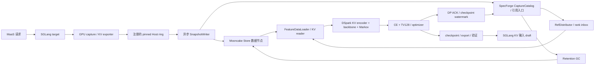
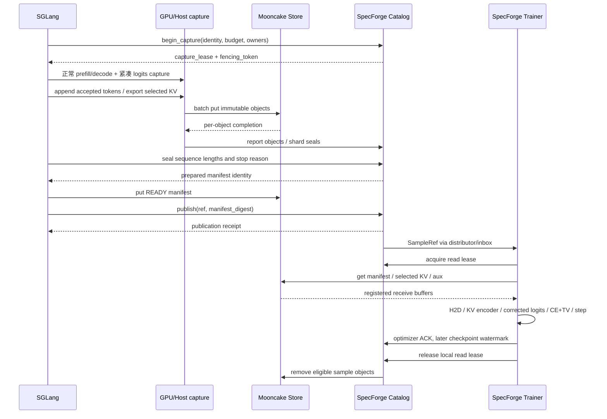

# SGLang、Mooncake 与 SpecForge 协同训练 DSpark 的完整设计

状态: RFC / 实现进行中。日期: 2026-09-30。当前进度与验收证据见 [IMPLEMENTATION_STATUS.md](IMPLEMENTATION_STATUS.md)。

本文定义在线 MaaS 请求采集、Mooncake 数据交换、SpecForge 训练及 SGLang 部署的完整协议。本文中的新增类、配置、HTTP 路由和 schema 描述完整实现目标，不代表上游已有这些能力。初始交付为设计与协议示例；后续实现和实际验证范围以进度文档为准，未通过对应验收的部分仍为待实现目标。

## 0. 目标与阅读顺序

最终流程是:

```text
MaaS 用户请求
  -> SGLang 正常 target prefill/decode
  -> 采集指定层 target KV、tokens、response mask、teacher top-128/LSE
  -> Mooncake Store 中提交完整、不可变的 TrainingSample
  -> SpecForge 独立消费，训练 KV 输入版 DSpark，使用 CE + TV128
  -> 导出带输入契约的 draft checkpoint
  -> SGLang 使用相同 KV 编码器进行 speculative decoding
```

训练进程不运行 target decoder，不重新 prefill，不从 target hidden 重算 teacher logits，缺数据时也不调用 MaaS 补算。允许加载冻结的 target embedding/lm_head，供 draft 自己的前向使用。

建议阅读顺序:

1. 第 1–4 节: 现有能力、职责、数据流和不可违反的约束。
2. 第 5–8 节: 数据格式、位置对齐、SGLang 采集和 Mooncake 写入。
3. 第 9–12 节: 控制接口、SpecForge 适配、KV 输入模型和 loss。
4. 第 13–18 节: 分布式、生命周期、容量、配置、故障和部署。
5. 第 19–22 节: 实施拆分、验收、待定参数和源码依据。

配套文件:

- [manifest.schema.json](training-data-contract/manifest.schema.json): READY manifest 的 JSON Schema。
- [manifest.example.json](training-data-contract/manifest.example.json): 小型样本的完整描述符示例，使用合成 ID 和示意 checksum，不包含真实训练数据。

## 1. 需求、现状与关键决策

### 1.1 已确认需求

| 项目 | 本方案约定 |
| --- | --- |
| 数据来源 | 在线 MaaS 正常请求的 target forward |
| draft | DSpark，新增 `input_mode=target_kv` |
| 上下文输入 | target 指定 attention 层的原始 K/V，不默认导出全部层 |
| 序列 | 完整 prompt + 最终接受的 response token IDs |
| mask | 当前请求 prompt=0、response=1，用于 loss |
| teacher | 每个 response token 的 top-128 原始 logits + 全词表 token IDs |
| 额外必需字段 | full-vocabulary logsumexp、绝对位置、KV 有效范围、版本与布局 |
| loss | token CE + `lambda_tv * TV128`，定义见第 12 节 |
| 训练取数 | SpecForge 直接读取 Mooncake Store |
| 缺失数据 | 显式失败、重试已有副本或跳过，不补跑 target |
| 训练产物 | 可被新增 SGLang KV 输入路径加载的 checkpoint |

“原始 logits”指保留模型定义的输出变换，例如 head scaling/soft cap，但尚未经过服务侧 grammar、bias、penalty、temperature、top-k/top-p。保存的是在线模型实际产生的分数，转成 FP32 存储不能恢复低精度计算已经损失的信息。

### 1.2 源码基线

| 组件 | 阅读基线 | 证据边界 |
| --- | --- | --- |
| SGLang | `b3bffef70aa17733b48af91e4b529e72c913bc6e` | 本地导出的相关源码 |
| Mooncake | `76bd234d7ae072edd3aed6ff595f94c85b635c2f` | 本地官方浅克隆 |
| SpecForge | `3cb0510f0bd0e8c195ac6e9c5c62f6b50580ff83` | GitHub API 确定 commit，读取该 commit 的契约、provider、Store、模型及集成说明 |

SpecForge 当前集成说明默认针对打过 capture patch 的 SGLang `v0.5.18`，另有特定 fork patch。它不是上述 SGLang 快照的兼容性承诺。实施第一步必须选定一组实际部署版本，再移植 capture hook；不能直接假定三个 main 可以组合运行。源码链接集中在第 22 节。

### 1.3 现有能力与缺口

| 能力 | 已存在 | 本方案需要新增或修改 |
| --- | --- | --- |
| SGLang KV 管理 | GPU token pool、Host pool、Radix/HiCache | 请求级选层快照、尾页、采集期间引用保护 |
| SGLang logits | target logits 和外部 logprob 输出 | 采样处理前 raw top-128/LSE，decode/verify 对齐 |
| SpecForge SGLang capture patch | prefill aux/last hidden，后台写 Mooncake，返回引用 | MaaS 自然流量全生命周期采集，KV + raw teacher 数据 |
| Mooncake 数据传输 | registered buffer put/get、批量传输、RDMA/TCP | 业务协议使用现有 SDK；V1 不要求新增 Master tensor 字段 |
| SpecForge 数据契约 | `SampleRef`、`FeatureSpec`、`TrainBatch`、`FeatureHandle` | 新 payload 类型、manifest 解析、分块 KV、teacher top-k 字段 |
| SpecForge 在线训练控制 | RefDistributor、rank inbox、consumer ledger、DP ACK | 外部 MaaS ref 接入、独立保留策略、checkpoint 与 GC 的协调 |
| DSpark | hidden 输入、Markov head、训练 provider | 可微 KVContextEncoder、缓存 teacher objective、服务端同构注入 |
| 权重发布 | checkpoint/export 基础模块 | KV 输入兼容信息、配对验证、发布与回滚流程 |

SpecForge 现有在线 producer 会主动请求外部 SGLang capture 服务；其 capture 集成会用唯一 `extra_key` 使训练样本执行完整 prefill。这与复用 MaaS 自然请求不同。本方案的 `external_maas` 来源不启动这条 prompt rollout 流程，不通过关闭 prefix cache 获得完整特征。

### 1.4 关键决策

1. **每次生成是样本所有者。** mask、teacher 行和停止原因不能挂到共享 Radix 节点。
2. **KV 输入是新的模型变体。** 当前 DSpark 的 target hidden 投影成 draft KV，不等于直接使用 target attention KV。
3. **Mooncake 承载 tensor 字节，SpecForge 控制面承载引用。** 不在 HTTP/队列里传 tensor 或大数组。
4. **先写对象，最后提交 manifest，再发布 ref。** batch put 不作为跨 key 事务。
5. **保留与提交由应用管理。** pin 防淘汰不等于持久化，不等于消费事务。
6. **现有数据格式向后兼容。** 新的 target-KV 契约单独版本化，旧 hidden 模式继续走原 provider。
7. **训练和上线共同交付。** 只改训练器而不改 SGLang 的输入路径，不能完成目标。

### 1.5 支持范围

| 阶段 | 支持范围 | 上线要求 |
| --- | --- | --- |
| V1 正确性 | 文本、dense MHA/GQA、full attention、普通 autoregressive、TP=PP=1 | 建立完整数据与训练闭环 |
| V1.1 集群 | 目标部署使用的 TP/PP、正常 prefix 命中、overlap/CUDA graph | 每种拓扑通过对应验收 |
| V1.2 MaaS 覆盖 | speculative verify、PD、retract 等实际启用路径 | 缺一条实际服务路径，不能宣称全量覆盖 |
| 独立扩展 | MLA、量化 KV、SWA、混合状态、VLM、特殊位置编码 | 专用 codec、输入模型和验证集 |

这些是交付次序，不是忽略线上路径的理由。不支持的 target/layout 在启动时拒绝；运行中不支持的请求被明确排除或标记采集失败。不会静默改成缺字段样本。

## 2. 组件职责与进程边界



`CaptureCatalog` 是拟新增的 SpecForge 控制面能力，可独立进程部署，但不是新增第四个模型或存储框架。它保存小型事务元数据，不代理 tensor 流量。

| 所有者 | 责任 | 不应承担的职责 |
| --- | --- | --- |
| SGLang scheduler | 样本位置、accepted tokens、KV 生命周期、采集准入 | 等待 trainer 完成训练 |
| SGLang model worker | raw logits 归约、选层 KV 导出、CUDA event | 决定训练 optimizer commit |
| SGLang writer | buffer 注册、Store 写入、对象摘要、manifest 准备 | 改共享 KV 页的 loss mask |
| Mooncake Master | key/replica/位置与传输协调 | 理解 token、TV loss 或训练事务 |
| Mooncake Store/TE | tensor 字节存储与搬运 | 推断 tensor layout |
| SpecForge Catalog | 幂等发布、保留租约、训练资格、待删除对象 | 计算 teacher logits |
| SpecForge loader | 校验、预取、重组 shard、batch/anchor 构造 | 将缺失 teacher 当成零监督 |
| SpecForge model/strategy | 可微 forward、CE/TV128、反传 | 调用 target decoder 补数据 |
| SpecForge trainer | DP 调度、optimizer step、checkpoint、ACK | 直接删除仍被其他 consumer 使用的对象 |

## 3. 完整时序



SGLang 可以在正常响应已发出后完成 Store flush；用户响应成功和训练样本成功是独立状态。请求尾部只需保障采集数据不被复用，网络写入由后台完成。

若容量不足，优先停止接纳新采集；已选请求的采集也可失败，MaaS 推理继续。采集失败必须有原因、计数和清理记录，不能发布不完整 READY。

## 4. 身份、状态与强约束

### 4.1 身份

```text
dataset_id       数据集/租户隔离边界
sample_id        一次生成的全局唯一 ID，不复用 req_pool_idx
generation_id    重试产生新内容时的新 ID
capture_attempt  网络/进程级重试号，内容不变时不改变 generation
object_id        sample generation 内的稳定 tensor/chunk ID
contract_id      producer 与 consumer 共同接受的语义版本
teacher_id       权重、adapter、tokenizer、模型输出定义的不可变指纹
```

同 key 幂等重试仅限相同内容和摘要。内容变化时生成新 generation。客户端超时后不能用旧 key 写新字节。

### 4.2 状态

```text
Capture:  ADMITTED -> COLLECTING -> SEALING -> PREPARED -> READY
             |            |           |           |
             +------------+-----------+-----------+-> FAILED -> GC_PENDING

Consume:  AVAILABLE -> LEASED -> STEP_ACKED -> CHECKPOINTED -> GC_PENDING -> DELETED
                       |            |
                       +-> RETRY    +-> retained until recovery policy permits GC
```

Capture 与 Consume 是两条独立状态轴。读取不把不可变 manifest 改成 LEASED；消费状态在 Catalog/ledger 中维护。多个训练 run 有独立 consumption 记录。

### 4.3 强约束

- `READY` 表示所有必需对象和 shard 已写入，摘要、形状、覆盖范围与 seal 一致；不是永不丢失的承诺。
- `token_ids[i]` 的 teacher 行预测位置是 `i`，它自己的 KV 位置也是 `i`，但二者通常在相邻 forward 产生。
- 所有 response token 都有 teacher 行，包括被策略排除 loss 的 EOS；token 是否监督与是否完整采集分开。
- 最后一个 token 没有自己的 KV 可以是合法状态；缺中间 KV 或缺 teacher 行不是合法尾部状态。
- 所有异步任务绑定不可变的位置映射，不读取已被下一轮 scheduler 改写的 batch 长度。
- GPU 源数据只保护到 D2H 完成；Host 源 buffer 保护到 Store 写完成；Store 对象保护到消费/恢复策略允许删除。
- future KV 不得泄漏进 draft 窗口，见第 6 节。
- 模型、adapter、tokenizer、层序、RoPE/位置、dtype 不匹配时拒绝样本，不做猜测性兼容。
- target 热更新不能使单一样本混合两版权重。capture 持有模型版本身份；版本变化时先 drain，或使跨版本采集失败并新建 generation。

## 5. 数据协议

### 5.1 逻辑样本

记 `P=prompt_length`、`R=response_length`、`N=P+R`。V1 mask 在 loss 层可排除 EOS，但采集包含所有 accepted output。

| 字段 | dtype / shape | 含义 |
| --- | --- | --- |
| `token_ids` | int32 `[N]` | 真实 token 序列，不从文本重新 tokenize |
| `position_ids` | int64 `[N]` | 模型实际使用的位置；不默认等于数组下标 |
| `loss_mask` | uint8 `[N]` | prompt=0、当前 response=1，EOS 策略显式记录 |
| `kv_valid` | uint8 `[N]` | 本次快照是否具有该 token 的所选层 KV |
| `logits_positions` | int32 `[R]` | 每行预测的样本位置，普通路径为 P 到 N-1 |
| `teacher_topk_ids` | int32 `[R,128]` | 全局 vocab IDs |
| `teacher_topk_logits` | float32 `[R,128]` | raw 分数 |
| `teacher_logsumexp` | float32 `[R]` | 全词表 raw logits 在温度 1 的 LSE |
| `target_k.<layer>` | BF16/FP16 `[Nv,Hkv,Dk]` | 按 chunk/shard 描述，`Nv` 为有效位置数 |
| `target_v.<layer>` | BF16/FP16 `[Nv,Hkv,Dv]` | 同上 |

V1 每个有效位置的所有选定层必须齐全，因而共用 `kv_valid`。未来允许层间不同有效范围时需要升级 schema，不能让一个 bool 掩盖部分层缺失。

`loss_mask`、`kv_valid`、attention mask、padding mask 和 `mask_token_id` 是五种不同含义，不互相替代。

### 5.2 物理格式

V1 沿用 SpecForge 的 raw tensor 对象思路，**一个对象保存一个连续 tensor chunk**，不使用 pickle/torch.save 作为网络格式。shape、dtype、字节数、位置和摘要放在 manifest。这样无需再维护自定义二进制 header。

- aux: 每个字段一个对象，按整个样本保存；Host 缓冲受样本长度上限约束。
- KV: 每个选定层、owner、component、连续 token chunk 一个对象。
- 所有 tensor 为 little-endian、C-contiguous；BF16 保留 16-bit 编码。
- `token_range=[start,end)` 与 `head_range=[start,end)` 均左闭右开。
- 存储 chunk 大小与 SGLang KV page_size 分开配置；聚合多页可减少小对象。
- 描述符包含 `name/key/dtype/shape/nbytes/sha256/owner_id`；KV 另含层号、component、位置范围及 head 范围。
- V1 的 aux 默认由唯一 owner 生产；TP KV shard 可由不同 rank 各自写入。
- 读取端校验 `nbytes = product(shape) * element_size`，检查整数溢出、最大 tensor 尺寸、重叠/缺失范围及 key 命名空间。

原始 pool 的物理页地址、stride、req_pool_idx 不跨进程保存。导出器负责把非连续池布局转成协议要求的连续布局，manifest 记录的是导出格式。

键格式:

```text
draft-data/<dataset_id>/<sample_id>/<generation_id>/aux/<field>
draft-data/<dataset_id>/<sample_id>/<generation_id>/kv/<layer>/<owner>/<chunk>/<k-or-v>
draft-data/<dataset_id>/<sample_id>/<generation_id>/manifest
```

Mooncake `batch_put_from_multi_buffers` 可以将多个源 buffer 拼成一个对象，但 V1 不因此引入另一套不透明 tensor 打包格式。先用 batch put 批量写独立对象；如需合并对象，升级描述符的 offset 协议并提供迁移测试。

### 5.3 manifest 元数据

manifest 至少覆盖以下内容，精确字段以配套 schema 为准:

| 分类 | 必需内容 |
| --- | --- |
| 协议 | schema_version、contract_id、input_mode、state |
| 身份 | dataset/sample/generation、teacher 指纹、创建时间 |
| teacher | model/weights/adapter/tokenizer revision、vocab_size、输出分数语义 |
| 序列 | P/R/N、stop_reason、EOS/loss 策略 |
| KV | 选层顺序、每层 head geometry、dtype、K norm/RoPE 阶段、codec |
| 位置 | position_ids 对象、RoPE 参数/指纹、位置原点 |
| 并行 | TP/PP、实际 owner 列表、每个对象的逻辑 shard 范围 |
| teacher rows | top_k=128、temperature=1、全词表 LSE、预测位置约定 |
| 完整性 | 所有对象列表、字节数、checksum、kv_valid 与 teacher 行覆盖 |
| 来源 | capture 模式、采样配置、producer build、trace ID |

数据 manifest 不固定 `lambda_tv`、训练 run 或 draft 参数版本。同一份冻结数据可用于多个 draft 实验。gamma、Markov 类型、loss 权重、anchor 策略属于训练/checkpoint 合约；Catalog 将数据兼容条件与训练 run 绑定。

### 5.4 schema 与语义验证的边界

JSON Schema 检查字段、类型和单对象格式，不能完整表达跨对象张量关系。Reader 还必须执行:

1. `N=P+R`，teacher 行数等于 R，positions 严格递增且覆盖 response。
2. top-k ID 唯一、在有效词表内；raw logits/LSE 有限，top-k 概率总质量不超过 `1+epsilon`。
3. aux 的完整字段集合与 shape 正确；V1 不允许只剩部分 response 行。
4. 所有有效位置具有全部选层 K/V 和全部逻辑 heads，范围无重叠歧义。
5. 对象总字节数、摘要和 owner seal 一致。
6. 模型/KV codec/词表/position 定义符合当前训练 run 的 compatibility predicate。

schema 不证明远端 key 存在。配套示例的 checksum 是占位内容，不能直接用于训练或证明数据可读。

正常 manifest 不得设置示例专用 `extensions.example_only=true`；consumer 必须拒绝此类 fixture。示例只用于 schema 和描述符验证。

## 6. 位置对齐与 DSpark 窗口

### 6.1 一轮 forward 的含义

```text
teacher[i] = target 在上下文 x[:i] 下预测 x[i] 的分布
KV[i]      = x[i] 自己通过 target 后生成的 K/V
```

| target forward | 新增 KV | teacher 行预测 | 输出 |
| --- | --- | --- | --- |
| prompt | prompt 所有位置 | response A | A |
| A | A 的位置 | response B | B |
| B | B 的位置 | response C | C |

得到 C 后停止时，C 的 teacher 行存在，C 自己的 KV 通常不存在。因此 `kv_valid[-1]=0` 合法，不为补它额外执行 target。第一条 teacher 来自最后一个有效 prefill chunk，中间 chunk 不产出伪 response。

停止字符串可能导致用户看到的文本和内部 accepted token 序列不同。以 scheduler 的 token 序列为准，记录 stop policy；不能按输出字符串长度反推位置。

### 6.2 本项目规范化窗口

为避免不同版本的 `block_size` 和 gamma 命名差异，本协议使用 `prediction_count=G`。对 anchor 位置 a:

```text
target context:    selected KV[0:a]，不含 anchor 的 target KV
backbone IDs:      [x[a], MASK, ..., MASK]，共 G 个位置
backbone positions: position_ids[a:a+G]，尾部按合法位置规则补齐
labels:            x[a+1:a+G+1]
teacher rows:      logits_positions = a+1 ... a+G
Markov prev IDs:   x[a:a+G]
```

所有 query 共享同一 target KV 边界 `j<a`。后面的 query 不能访问 `KV[a]` 或未来的真实 target KV。只设置 `j<label_position` 仍然泄漏信息。

严格跟随 prefill 后服务状态时，最早 anchor 为 `a=P`，即第一个 response token；首个 draft label 是第二个 response token。`R=1` 的样本完整但没有严格模式训练窗口，记录为 `NO_VALID_WINDOW`。

末尾不足 G 个 labels 时用独立 label-valid mask。不能把 padding 的 token ID 用作有效 CE，也不能把它作为后续有效 Markov 条件。

### 6.3 版本适配必须显式完成

本地 SGLang DSpark 用 gamma 个 `[anchor,MASK,...]` 位置；所读 SpecForge draft 文件存在 `block_size-1` 的 proposal slice。**禁止仅令两个同名参数相等就宣称对齐。** 新 target-KV provider 以本节定义为基准，导出器保存 `prediction_count`、input 长度、label shift、anchor inclusion 与所适配 serving revision。

实施时用位置标号构造 golden trace，逐步比对: context_end、输入位置、输出行、Markov prev IDs、verify 长度和 accepted 长度。旧 hidden provider 的 offset 保持自身语义，不通过全局改常量适配新模式。

### 6.4 attention 与泄漏测试

target context 仅包含已知前缀；draft block 内 causal/full attention 配置与部署版本一致。不同样本 attention 完全隔离，loss_mask=0 的 prompt 仍保留在 context 中。

固定 anchor 后改动 `KV[a:]`，输出必须不变。修改 labels 不得改变 backbone base logits；其变化可以按设计影响 Markov head 后续 prev-token 条件。

## 7. SGLang 新增采集能力

### 7.1 模块分工

以下目录是建议落点，需按最终基线的模块组织调整:

```text
python/sglang/srt/training_capture/
    config.py             CapturePolicy 与兼容性检查
    context.py            RequestCaptureContext / 绝对位置账本
    teacher.py            raw top-k/LSE 与结果映射
    kv_exporter.py        选层、选 token、布局转换、源引用保护
    host_pool.py          有界 pinned + registered buffers
    snapshot_writer.py    异步 Store 写入 / 对象收据
    coordinator.py        多 owner seal / manifest / Catalog client
```

### 7.2 内部接口

以下为语义签名，不要求采用某种 Python 数据类实现:

```python
admit(req_identity, model_identity, capture_policy) -> CaptureHandle | Rejected
capture_teacher(raw_logits, immutable_row_map, ready_event) -> TeacherBatchHandle
commit_tokens(handle, accepted_positions, token_ids, teacher_row_ids) -> None
export_kv(handle, layer_ids, token_ranges, slot_mapping, source_refs) -> ExportTicket
seal_sequence(handle, prompt_length, output_length, stop_reason) -> SealTicket
abort_capture(handle, reason, retryable) -> None
poll_completions(max_items) -> list[CaptureCompletion]
```

每个 Ticket 只在所属进程内含 buffer 地址/CUDA event。跨进程消息只携带稳定 ID、范围、owner、摘要和状态。

`immutable_row_map` 至少有 `(sample_id,generation_id,forward_id,prediction_position)`。推测路径另带 verify row/path；源请求对象的当前长度不作为后台作业的定位依据。

### 7.3 raw logits hook

普通路径在 `ModelRunner.sample()` 调用 `_preprocess_logits()` 之前采集:

```python
values, ids = torch.topk(raw_logits, k=128, dim=-1)
lse = torch.logsumexp(raw_logits.float(), dim=-1)
capture = TeacherBatchHandle(ids.to(torch.int32), values.float(), lse, row_map)
# 完成读 raw logits 后，才允许 grammar/bias/temperature 等原地写入。
```

- 全词表可见时直接归约；过滤 padded vocab，vocab<128 在 V1 拒绝。
- capture 与 sampler 在同 stream 保证顺序；跨 stream 显式等待 event。
- CUDA graph 输出会复用，紧凑 capture 结果必须有独立存活期。
- 不将完整词表 logits 搬到 CPU；不在 scheduler 热路径 `.tolist()`。
- 扩展 `GenerationBatchResult` 的紧凑 capture 字段，沿 `copy_to_cpu`、overlap、PP 结果路径传播。
- decode、prefill、abort、请求恰在 prefill 完成等路径都要在 release 前处理。
- `return_logprob/top_logprobs_num` 不能代替本接口；DSpark 某些服务路径还明确拒绝外部 logprob。

实现中的 CUDA FP16/BF16/FP32 路径复用 SGLang 现有 `row_logsumexp`，
按 FP32 累积并将 `(max, log_sum)` 合成为协议要求的完整词表 LSE；
top-128 默认使用 `torch.topk`，不使用只支持小 k 的融合 top-k kernel。
CPU 与其他浮点 dtype 保留上述 Torch 参考路径。紧凑结果仍独立持有内存，
采样器修改与 graph buffer 复用不能改变已取得的数据。

可选配置 `teacher_topk_backend="flashinfer"` 在非空 CUDA FP32 输入、
去除 padding 后词表至少 32768 时使用锁定版本 FlashInfer 0.6.17 的 top-k dispatch。
其他情况回退 Torch。每次调用独立持有 1 MiB scratch，避免公共接口的设备级
共享 scratch 被并发 stream 覆盖；输入必要时转为连续张量，返回值仍为独立
存储的 raw logits 和 int32 ID。相同分值的边界 token 允许不同于 Torch 的
选择，但值与对应 ID 必须精确匹配源 logits，LSE 保持完整词表归一化。
AR、speculative verify 与 P/D 首行使用相同配置，启动预热和分布式配置投票
包含所选后端。内部库接口的版本约束、验证和复现命令见
[`experiments/TEACHER_TOPK.md`](experiments/TEACHER_TOPK.md)。

服务 logits 为 FP32。采集工厂在绑定 target contract 时预热该 dtype，
发生在任何请求准入及 P worker 的提前返回之前；分布式编译失败进入已有
binding 阶段投票。启动阶段只同步本设备的当前 stream，热路径不新增同步。
这项优化的数值范围、微基准与服务测量见
[`experiments/TEACHER_LSE.md`](experiments/TEACHER_LSE.md)。

普通 AR 与 P/D 首行采集把 CPU 已知的行号列表直接传入 teacher 提取。
连续行使用 logits 切片，省去索引 H2D 和完整词表 gather；非连续、重复或
重排列表仍使用原有索引路径，speculative verify 的 tensor 映射保持原有处理。
切片仅作为提取输入，返回的 top-128 与 LSE 独立持有内存；同 stream 的后续
采样修改不能影响这些结果。验证和测量范围见
[`experiments/TEACHER_SELECTION.md`](experiments/TEACHER_SELECTION.md)。

`RequestCaptureContext` 每次追加 teacher 行时检查位置连续性；在裁剪到最终
接受前缀后，由 `seal()` 一次写入 `logits_positions = P ... N-1`，避免逐 token
创建和复制 CPU 位置 tensor。该字段使用现有 Host buffer，格式不变；实际 forward
的 `position_ids` 仍按原路径采集，CUDA 完成事件和发布前内容校验保持不变。

#### 7.3.1 当前 prefill CUDA Graph 验收

现有采集钩子在 graph replay 返回后、sampler 修改 logits 之前运行，使用本轮真实
request 长度与 canonical KV slots；graph 的 token/request padding 不进入样本。
`test_training_capture_prefill_graph.py` 已在 H100/Qwen3-0.6B/FlashInfer 上验证
Full 同步、Full overlap、Breakable overlap 和默认 `tc_compiler=eager` 的
torch.compile piecewise overlap，四组均同时开启 Full decode graph。

测试包含 128-token 分块、271-token 前缀命中、19→32 token padding、
三请求 113→128 token padding、Full 的空 request slots，以及不同 replay
复用同一输入 buffer。每组服务退出后，新 Store client 逐张量读回并校验，
共 36 个样本的 KV、raw top128、vocab ID、LSE、token、loss mask 和位置均通过。
原始分数来自实际线上 forward 的测试观测，不额外运行 target 补算。

观测代码仅用于测试，会同步并复制完整 logits 到 CPU，不计入生产采集实现或性能验收。
此结果限定单卡普通 AR 和 MHA，分布式 prefill graph、MLA 专用前缀图、
mixed batch 和 Inductor 仍需分别验证。复现步骤与边界见
[`experiments/PREFILL_CAPTURE.md`](experiments/PREFILL_CAPTURE.md)，原始结果见
[`experiments/capture-prefill-graph.json`](experiments/capture-prefill-graph.json)。

KV 输入版 DSpark 现已通过相同四组 prefill graph 配置的独立验收，并同时开启
Full target-verify graph。prefill runner 按已解析的输入需求选择 hidden capture，
该 checkpoint 默认使用 NULL；hidden 输入的 DFlash/DSpark target 仍使用 FULL，
显式 server return mode 和 Breakable EAGLE 的选择逻辑有回归覆盖。

四组共 40 个 speculative 样本通过服务退出后的精确读回，覆盖完整接受、拒绝、
末尾裁剪、分块、前缀命中、padding、buffer 复用，以及 16-row teacher/KV D2H
batching。测试直接检查实际 prefill replay 的 hidden output 为空，并独立核对
target KV 到 draft KV 的投影。overlap 的 verify 记录包含领先尚未交付结果的
3 个 token，不能套用普通 AR 固定领先 1 个 token 的假设。

该新增范围仍限定单卡 Qwen3 MHA、静态 KV-input DSpark、FlashInfer target、
Triton draft、TCP Store 和 Catalog test double。合成 draft 用于正确性测试，
不证明训练质量；其他推测模式、分布式 prefill graph、RDMA 组合及性能仍需验证。
复现与证据见 [`experiments/DSPARK_PREFILL_CAPTURE.md`](experiments/DSPARK_PREFILL_CAPTURE.md)
和 [`experiments/dspark-prefill-capture.json`](experiments/dspark-prefill-capture.json)。

分布式 prefill 现已扩展到 TP1/PP2 同步和 TP2/PP1 overlap。每种拓扑均通过
AR、静态 KV-input DSpark 与 Full/Breakable/tc_piecewise 的六项组合，共
120 个 graph 样本，另有每种拓扑各 10 个独立 eager 基线样本。所有 rank 必须
实际 replay；生成 token 与 eager 一致，服务退出后的 Mooncake 读回仍须逐张量
验证 KV、原始 top128/ID/LSE、token、mask、位置及终止有效性。

PP prefill 的 activation 由 runner 自己持有，按 token 轴复制、清零 padding，
输出裁剪后再发送到下一 stage。layer discovery 保留远端层占位，确保 attention
使用全局 layer ID。Full/Breakable 在捕获的 body 内 clone；piecewise 使用每轮
刷新的固定地址 buffer，因为在 compiled model 外新建 clone 会让子图读到旧地址。
这个问题由无 bias 的 eager 对照实际发现，修复后还通过了输入地址断言。

该验证使用默认 eager compiler、真实 TCP Store 和测试 Catalog，不证明混合
TP/PP、P/D prefill graph、Inductor、RDMA 组合或服务性能。复现和完整记录见
[`experiments/DISTRIBUTED_PREFILL_CAPTURE.md`](experiments/DISTRIBUTED_PREFILL_CAPTURE.md)
和 [`experiments/distributed-prefill-capture.json`](experiments/distributed-prefill-capture.json)。

P/D prefill graph 另已通过 TP1/PP1 的九项组合：AR 的 Full 同步/overlap、
Breakable/piecewise；仅 D 加载 target-KV DSpark 时的 P Full；P/D 都加载时的
Full 同步/overlap、Breakable/piecewise。P 实际回放图并交接首条 raw teacher，
D 从接收的 target KV 导出完整样本。测试在 D target forward 入口禁止额外
prefill，要求所有生成 token 与独立 eager 基线一致。

九项共 90 个 graph 样本，另有 10 个 eager 基线样本，均核对线上原始 KV、
top128/ID/LSE、token、mask、位置和末尾有效性；两端退出后由新 Store client
校验所有对象摘要。每项还验证 missing/stale handoff 和取消请求不发布样本，
三个故障探针本身必须走 P prefill graph。正确性测试在采集配额就绪后发请求，
并要求 13 次准入、10 次发布和零 admission backpressure；它不代表饱和负载性能。

该新增验收使用同一 H100 上的两个独立进程、FlashInfer target、Triton draft、
真实 TCP transfer/Store 和测试 Catalog。分布式 P/D prefill、RDMA 组合、
训练质量和服务 SLO 仍需分别验证。复现和证据见
[`experiments/PD_PREFILL_CAPTURE.md`](experiments/PD_PREFILL_CAPTURE.md) 和
[`experiments/pd-prefill-capture.json`](experiments/pd-prefill-capture.json)。

分布式 P/D prefill 进一步覆盖两端匹配的 TP2/PP1 overlap 和 TP1/PP2 同步。
每种拓扑均通过 AR、静态 target-KV DSpark 与 Full/Breakable/tc_piecewise
的六项组合。成功请求和 missing/stale/abort 探针都必须在每个 P rank 上实际
回放，只有 P 最后一级提供 teacher；PP 中间输出的所有 tensor 行数必须等于
真实 token 数。D 仍不额外执行 target prefill。

两种拓扑共验证 120 个 graph 样本和 20 个 eager 基线样本，生成 token 与
各自基线一致，所有 140 个完整快照均通过线上源数据对照及服务退出后的 Store
读回。PP0 的本地 READY 计数可以为零，因为最后一级 auxiliary owner 才发布
全局 manifest；发布成功以 Catalog 记录与真实对象读回共同确认。

该验证仍是同节点 TCP transfer/Store、Qwen3-0.6B BF16、合成 draft 和测试
Catalog，不覆盖混合 TP/PP prefill、非对称 P/D prefill、跨节点 RDMA 组合或
生产性能。临时两卡实例在验收后释放。复现和证据见
[`experiments/DISTRIBUTED_PD_PREFILL_CAPTURE.md`](experiments/DISTRIBUTED_PD_PREFILL_CAPTURE.md)
与 [`experiments/distributed-pd-prefill-capture.json`](experiments/distributed-pd-prefill-capture.json)。

#### 7.3.2 Mixed-Chunk 采集

普通 AR 采集现允许 `--enable-mixed-chunk`。同一 forward 内可包含新请求的
prefill chunk 和已有请求的 decode。采集沿用逐请求 `extend_seq_lens_cpu`
计算 position 切片偏移，按各自的完整 prompt 长度决定是否保存 teacher 行。
未完成 prompt 的 chunk 只保存 KV，同批 decode 仍保存 raw top128/LSE；
未被采集的请求也参与偏移计算，不能将后续请求的 KV 或 logits 行错位。

这条路径复用已有的 owned Host/device staging、overlap 提交账本和 Mooncake
发布协议，不新增 Store 字段。单 H100/Qwen3-0.6B 验收覆盖同步与 overlap、
decode CUDA graph，以及 Full/Breakable/piecewise prefill graph；逐配置比较
关闭/开启采集的输出，并在服务退出后校验完整 Store 样本。测试还包含同批
超长排除请求、单 token 回复和 prefix cache 命中。

后续真实 H100 验收加入 TP2/PP1、TP1/PP2、TP2/PP2，新增 14 个分布式配置，
并重新运行 7 个单卡配置。各 rank 的 mixed batch 请求顺序、prefix/extend 长度
必须一致，分别检查 partial/final prompt chunk、graph replay、teacher 归属和
Host 资源回收；前级 PP 不得产生 teacher 行。全部 21 个配置通过，服务退出后
读回 105 份完整快照，126 个 capture-off 请求的输出与 capture-on 完全一致。
这轮复用现有生产采集、分片发布与 Store 实现，增加逐 rank 观测和 CI 回归。
PP 使用同步调度，piecewise 使用 eager compile debug mode，Store 使用 TCP 和
HTTP 测试 Catalog。混合 speculative 仍由启动检查拒绝，混合 P/D、RDMA 与
生产性能需单独验证。复现与证据见
[`experiments/MIXED_CHUNK_CAPTURE.md`](experiments/MIXED_CHUNK_CAPTURE.md)。

### 7.4 选层 KV 导出

`SelectedLayerKVExporter` 接收 request logical positions 到物理 slot 的映射，以及当前 target KV pool。它只导出 contract 中明确选择的层和有效位置。

1. prefill/前缀命中后导出所需完整 context；decode 每新增有效 token 增量导出。
2. 源可能来自共享前缀、L2/L3 命中恢复或本轮计算；从实际有效 pool 读取。
3. 在释放、retract 或 slot 复用前取得源引用，并记录 producer stream event。
4. 对非连续 slots 做 layout-aware gather；K/V 按协议排列。
5. D2H 完成即可释放 GPU 引用，后台网络完成后再释放 Host slot。
6. 结束时 flush 非整页尾部；不使用 Radix 的 page-aligned 长度裁掉训练数据。

当前 Host backup 有 `backup_from_device_all_layer`，MHA 页元数据可能横跨全部本地层。不能只减少长度实现选层。V1 实现明确的 gather/pack，再评估 scatter/gather 优化。

可选 `kv_export_backend="hicache"` 复用现有 HiCache JIT 的指针表拷贝 kernel，
仅绑定 contract 选择的 K/V 层，直接写入采集专用 pinned Host buffer，或写入已有
KV staging。它不启用 serving L2，也不将训练快照纳入 HiCache 的 LRU 管理。
每个槽位独占 GPU 指针表与目标位置表，连同 KV/teacher staging 计入
`max_device_bytes`；资源初始化阶段检查布局、编译 kernel 并完成绑定后才准入。
源索引保留异步越界检查，跨 stream 和异常回收沿用 completion/quarantine 约束。
默认仍为 Torch；使用要求、测量方法和边界见
[KV 导出说明](experiments/KV_HICACHE.md)。

使用独占临时 buffer 填尾部 padding，或只写有效范围；不能修改共享 Host KV 页，也不能将邻接请求的无效槽位写入对象。

### 7.5 生命周期与背压

```text
GPU:  REF_HELD -> CAPTURE/D2H -> D2H_EVENT_DONE -> RELEASE_SOURCE
Host: RESERVED -> FILLING -> READY -> STORE_WRITING -> WRITE_DONE -> REUSABLE
Store: WRITTEN -> SAMPLE_READY -> LEASED/RETAINED -> GC_ELIGIBLE -> REMOVED
```

配置限制: 最大采集比例、请求长度、inflight requests、GPU hold bytes、Host pinned bytes、未提交 bytes、Store retention bytes。准入可按最大长度保守预留，也可分块续租；续租失败时整个采集失败。

单 rank producer 的 Catalog 配额在后台补充至有界 Host 槽位容量，每次成功申请
之后重新检查租约、暂停与关闭状态，再继续申请。writer 归还槽位后唤醒补充线程；
满池或暂停时保留 100ms 维护轮询，Catalog 申请失败另设至少 100ms 重试间隔，
释放槽位的唤醒不能绕过该间隔或 adaptive cooldown。隔离槽位不进入补充容量。
这不保证 `sample_ratio=1` 能采集所有请求：写入速度、池容量和服务负载仍决定
实际采集率。分布式 cohort 的集体准入循环独立运行，性能结论需分别测量。

TP/PP cohort 的每个 rank 在后台持续观测本地 Host 占用、writer 阻塞和
adaptive cooldown，再通过现有控制组投票取最低采样比例。最后一个 PP stage
的 publisher 阻塞时，入口 rank 即使已写完自己的 KV 分片，也必须暂停新请求
采集和新 Catalog 配额申请。恢复同样不依赖新请求；不能把全组最低比例作为
本地压力反馈，否则全组降到零后可能无法恢复。已发出的 ticket 在 adaptive
暂停期间仍可绑定；在途采集、续租和传输完成回收继续进行。
内部 cohort 控制协议升至 v5，在现有 int64 状态帧中携带精确 binary64
采样概率；非法、非有限或高于配置上限的值进入全组失败投票。所有 rank
必须运行相同协议版本，snapshot manifest 格式不变。
观测接口增加 `local_effective_ratio` 与 `cohort_effective_ratio`，
`effective_ratio` 和对应 Prometheus 指标反映全组门控后的实际准入概率。
TP2、PP2 和 TP2/PP2 的真实 Store 可控 manifest 阻塞验证已通过：33 个请求中
24 个在发布阻塞期间正常完成，解除阻塞后无需新流量即可恢复采样，服务退出后
读回 9 份完整快照。另有 284 项单元测试和 AR/DSpark P/D 控制回归通过。
这不代表饱和 RDMA 吞吐或生产 SLO 验收；复现与证据见
[分布式背压验证](experiments/COHORT_BACKPRESSURE.md)。

分布式请求选择发生在 ingress router，需通过独立的
`sglang:training_capture_routing_events_total{event=...}` 导出。
`selected`、`sampled_out`、`excluded`、`backpressure` 等决定只在入口 rank
计数；`attached`、`bound` 和 `cancelled` 是逐 rank 的同一 ticket 生命周期，
不能跨 rank 求和后当成独立样本数。`sampled_out` 包含全组门控和人工暂停，
不单独证明 adaptive 限流。原有 coordinator `events_total` 保持语义，
完整数据集数量仍以 Catalog 状态为准；仪表盘分别展示入口与逐 rank 事件。

网络错误或 CUDA 错误后，只有确认传输停止才可回收注册 buffer。不能仅因 Future 抛错就假设 DMA/RDMA 不再访问内存；需要 transport completion 或 quarantine 队列。

关闭采集资源时，调用方先停止所有采集线程，再由 `CaptureResources.close()`
等待绑定设备上的 CUDA 工作完成，随后关闭 Store transport 和 journal。
逐请求 event 创建或等待失败时，不能仅凭 Store close 就认为 D2H/设备 staging
已经结束。KV owner 从 exporter 绑定设备，aux-only owner 从 source pool
绑定设备，准备阶段固定 CUDA index；CPU/inactive 资源不初始化 CUDA。
CUDA 或 Store 屏障失败时保留完整资源引用及 journal lock，允许显式重试，
最终以进程退出兜底。该设备同步只用于关闭，不加入逐 token 采集路径；复现见
[CUDA 关闭屏障](experiments/CUDA_STOP_BARRIER.md)。

紧凑 teacher 回传可通过 `teacher_d2h_batch_tokens` 单独启用批量 D2H，
默认值 1 保持逐次回传。aux owner 为每个 inflight slot 分配有界 GPU 缓冲，
与 KV staging 共用 `max_device_bytes` 预算，并在注册 Host buffer 前校验总量。
ID、原始 top-128 logits 和全词表 LSE 立即复制到独占缓冲；满批和 seal 尾部
在 producer stream 回传。P/D 首行 teacher 已在 Host 时直接写入并推进相同行号。
abort/retract 不发布剩余缓冲，跨 stream 复用和尾部 flush 都受 completion
事件约束；最终 manifest 只包含已提交 token 对应的行。

多 worker 进程不能直接使用其他进程的 Python tensor 地址。V1 writer 放在持有/注册 Host buffer 的同一进程；独立进程 writer 需要共享内存映射和该进程注册流程，另行实现。

#### 7.5.1 当前自动 KV 容量回收验收

`test_training_capture_ar_pressure.py` 已在 H100 上验证普通 AR 的同步/overlap
与 eager/Full decode graph 四种组合。四条请求合计需要 384-token KV，实际池为
256 tokens；关闭 debug retract，不调用 pause API，也不修改 allocator 的判断。
实际两次回收分别观察到可用容量 0<4 和 1<3，释放后增加 64 和 69 个 token。

被回收请求继续生成完全部回复，其原 capture 则立即脱离 request，最终进入 Catalog
`FAILED`；恢复生成不重开 capture，也不发布不完整样本。测试检查原 capture ID、
请求 retraction 计数、服务 metrics、后续成功请求对释放 slot 的复用，以及四个
采集 reservation 恢复可用。每组再提交一个新请求验证采集准入恢复。

四组共排除 8 份中断采集，12 份有效样本在服务退出后由新 Store client 完整读回，
KV/raw top128/ID/LSE/token/mask/position/validity 均与实际在线来源一致。
上述单卡验收使用 Qwen3 MHA、Triton、TCP Store 和 Catalog test double；不包含
CUDA allocator 异常、分布式压力、prefill graph 与容量压力的组合或生产 SLO。
复现与原始数据见 [`experiments/AR_PRESSURE.md`](experiments/AR_PRESSURE.md) 和
[`experiments/capture-ar-memory-pressure.json`](experiments/capture-ar-memory-pressure.json)。

后续分布式验收将普通 AR 扩展至 TP2、PP2 与 TP2/PP2，并重跑单卡回归；最终
12 组全部通过。PP 使用同步调度与两请求 microbatch，逐 rank 确认四个 capture
context 同时存活，不能把一个 microbatch 的大小当作全局并发数。每个 rank 都
验证原 capture ID、一致的回收计数、容量恢复、成功请求复用释放 slot 和准入恢复。
teacher 与 KV 均使用 16-token D2H staging；只有末级 PP stage 持有 teacher。

60 条请求完成 3,888 个输出 token，24 份中断采集进入失败状态，36 份完整样本
在 producer 退出后读回，校验 828 个 tensor object / 33,032,352 bytes。分布式
graph 用例覆盖 PP 的一请求/两请求 decode replay，非 PP 覆盖三请求 replay；
TP overlap 用例逐 rank 检查 pending-result lookahead。未改变生产 scheduler、
capture 或 Store 逻辑。详细证据见
[`experiments/capture-ar-distributed-pressure.json`](experiments/capture-ar-distributed-pressure.json)。
此扩展仍使用 Qwen3-0.6B、Triton、TCP Store 与 HTTP test Catalog；P/D AR 的
后续验收见第 13.3.1 节。非对称拓扑、跨节点 RDMA 压力、饱和回压和生产 SLO
仍需单独验收。

## 8. Mooncake 接入与存储协议

### 8.1 复用的接口

| 现有 Mooncake 能力 | 本方案用途 |
| --- | --- |
| `MooncakeDistributedStore.setup` | producer/consumer 各自初始化客户端 |
| `register_buffer` / `unregister_buffer` | 长寿命 Host ring 和 receive pool 注册 |
| `put_from` / `batch_put_from` | raw tensor 写入 |
| `batch_put_from_multi_buffers` | 可选多源 buffer 写入，不改变 tensor 语义 |
| `get_into` / `batch_get_into` | 读取到 consumer 自有注册内存 |
| `batch_get_into_multi_buffers` | 已验证尺寸协议下的多 buffer 接收 |
| `ReplicateConfig.with_hard_pin` | 防止未消费训练对象被容量淘汰 |
| replica 配置 | 节点故障容错，实际可用性需验收 |
| `remove(key, force=...)` | 最终按对象清理，force 仅限已证明无读者 |

SDK 各接口的成功返回值可能是状态码或传输字节数。adapter 必须按安装版本逐对象检查，不能统一把 `rc==0` 当作所有 put/get 成功条件。启动时探测必需能力并记录 wheel/build 版本。

V1 strict retention 要求 hard pin 可用。SpecForge 现有 Store 对旧客户端有兼容降级，但本模式不能静默降级为可淘汰训练样本。

当前 producer 将一份快照或一个 owner 的 payload 使用 `batch_is_exist` 和
`batch_put_from` 合并提交。先校验所有源的注册范围、摘要及 key 唯一性，再逐一
读回验证已存在的对象，仅把缺失对象交给批量写入。每项返回值必须为整数 0；
明确失败的项隔离其所在注册 arena，返回缺项/非法结果或抛异常则隔离整批未确认
的源。失败后不能立即重用缓冲区或转为单对象重试。只有 SDK 缺少批量能力时才
沿用原单对象路径，hard pin 要求不变。所有 payload 成功之后才报告 WRITTEN，
manifest 仍单独最后写入；批量 RPC 本身不提供跨对象发布事务。

适配层新增 `get_tensors([(key, shape, dtype, sha256), ...])`，使用原生
`batch_get_into` 读取到各自拥有的 CPU tensor。提交前校验全部 shape 和整批
接收字节预算，逐项要求返回字节数精确匹配，再校验摘要。负值结果隔离对应
接收区；整批异常、缺项或返回类型错误隔离所有未确认接收区。其余已完成
接收区即使遇到其他项失败也执行注销。仅缺少批量方法时回退到单项读取。

`verify_tensors` 按接收预算和每批最多 64 个对象分组，校验后立即丢弃该批，
用于幂等写入读回和 journal/分区发布恢复；任何一项失败都不能发布 READY。
消费者仍负责 Catalog read lease、跨调用的预取总预算与后续 H2D 生命周期。
这不替代第 10 节的 SpecForge manifest/window loader；接口和传输验收见
[批量读取记录](experiments/BATCH_STORE_READS.md)。

原生批量接口已在跨物理节点 RDMA 上完成正确性验证。探针检查混合已存在/缺失
对象的幂等写入、producer 关闭并覆写源内存后的独立读取，以及部分读取失败时
仅隔离失败接收区。真实 Qwen3-0.6B 的 AR 与 target-KV DSpark eager/graph
四组用例通过，最终独立进程使用 23 次 payload batch 读回 23 份快照、418 个
tensor 对象，共 16,960,108 字节。每份快照另行读取 manifest；这不替代训练端
按 anchor 选择 KV 页的 loader。复现和证据见
[批量 RDMA 记录](experiments/BATCH_STORE_RDMA.md)。本次 P/D 交接仍使用 TCP，
不据此声称吞吐提升、生产保留策略或训练质量已验收。

### 8.2 RDMA 路径

```text
SGLang GPU KV/logits summary
  -- CUDA D2H --> pinned Host ring，已向 Mooncake 注册
  -- Store put --> Master 分配/查询对象位置
  -- TransferEngine RDMA WRITE --> Store 数据节点 registered memory

SpecForge registered Host receive pool
  <-- Store get / TransferEngine -- Store 对象
  -- CUDA H2D --> trainer GPU
```

Master 承担控制元数据，不是所有 tensor 的中转站。RDMA 只能依据已注册地址及长度搬字节，token/layer/head 的逻辑映射由上下游完成。

“直接读 Mooncake”是训练端独立读取数据，不承诺 V1 已实现 GPUDirect。GPU 直读是可选优化，需要验证 GPU buffer 注册、NIC/GPU 拓扑、SDK staging 行为、CUDA 可见性与错误时资源释放。

当前已完成跨物理节点的 Host registered-buffer RDMA 验证：A 节点运行真实 Qwen3
采集服务，B 节点独占 Store 数据段；所有 producer/reader 的 `global_segment_size=0`，
指定 `protocol=rdma`、HCA 和 GID，并禁用本机 memcpy 路径。普通 AR 与 target-KV
DSpark 的 eager/graph 四组用例通过，服务退出后由新进程读回全部 23 份样本
（22 份正式测试样本及 1 份构造未训练 draft 的种子样本）。选层 KV、原始 top-128
分数及 vocab IDs 与在线独立观测精确一致；全词表 LSE 使用 `rtol=atol=1e-6`。
12 个 missing/stale handoff 或取消请求没有发布训练样本。
上述 Store 独立测试的 P/D 本身在 A 节点使用 TCP 交接 KV，其证据仅覆盖 Store。
部署步骤见 [RDMA.md](experiments/RDMA.md)，证据见
[capture-rdma-store.json](experiments/capture-rdma-store.json)。
另外，第 13.3.1 节的独立双节点用例已验证 P→D 的 RDMA KV 交接，以及随后 D→Store
的 RDMA 样本提交；不能把这两个传输完成事件合并处理。

### 8.3 提交协议

1. Catalog 先登记 capture lease、owner 集合、预算和 generation，拿到 fencing token。
2. 写对象前登记不可变 object_id/key；写完回报 dtype/shape/nbytes/checksum 与 receipt。
3. 各 owner seal 本地范围，sequence owner seal P/R/N、tokens 和 stop reason。
4. Coordinator 校验逻辑覆盖、全部对象成功和 retention 预算，形成 PREPARED 记录。
5. 写不可变 READY manifest，取得 byte digest；manifest 本身也纳入 retention。
6. Catalog 原子提交 publication 记录和 outbox 事件，幂等地对接 RefDistributor。
7. Reader 仍需验证实际对象；节点丢失可能发生在 READY 之后。

PREPARED、publication 与 outbox 存在应用元数据中；不是 Mooncake 多 key 事务。manifest digest 对精确 UTF-8 bytes 计算，重试发送同一组 bytes，不重新排序 JSON 后复用旧摘要。

单 rank 采集在 D2H 完成后调用 `RequestCaptureContext.prepare_snapshot()`，
生成独占 Host 视图的 descriptor、checksum 和 manifest。准备阶段验证结构与覆盖，
checksum 不能证明 token/mask、raw top-128、LSE 或 KV 内容符合训练协议。
`SnapshotWriter.write()` 必须在第一次 REGISTERED 之前完整验证内容；线上路径
不再同时在构造函数重复执行这次扫描。供直接消费者使用的 `build_snapshot()`
和 `RequestCaptureContext.snapshot()` 仍返回经过完整校验的结果。

writer 完成内容校验后，单 rank coordinator 再检查 context 仍为 SEALED、
请求未失效、本地 lease 未到期且未超过采集时限，才允许登记对象。这个检查不能
代替后续每个 Catalog 操作的 fencing，也不能撤销已发布样本。journal 恢复继续
使用持久化 manifest、Store 内容和 Catalog 状态，不依赖已退出请求的回调。
分布式 owner 准备与组装路径保持独立。`snapshot_built` 仅表示描述准备完成，
不表示内容校验通过；阶段指标 `validation` 包含上述校验后状态检查。

BF16/FP16/FP32 的有限性检查复用计算 SHA-256 的 little-endian Host 字节
视图，以无符号整数检查全 1 指数位，拒绝所有 NaN 和正负无穷；不转换或修改
浮点内容。每次扫描最多 262,144 个元素，位运算与比较的临时数组最多占用
1.25 MiB，该上限不包括其他语义校验和保留的 payload。完整校验仍保留摘要、
位置、mask、top-128 唯一性/排序与 LSE 归一化检查。真实服务测量中校验耗时
下降约一半，但请求吞吐未提高；复现和适用边界见
[有界有限性检查](experiments/BOUNDED_FINITE_VALIDATION.md)。

### 8.4 故障窗口

| 中断位置 | 恢复方式 |
| --- | --- |
| 对象写一半 | 没有 READY；有界重试或等待 capture lease 过期回收 |
| 对象完成、manifest 未写 | 根据 PREPARED 和 receipts 重建同一 manifest |
| manifest 已写、Catalog publish 超时 | 用幂等键查询/重试 publish，不重采 target |
| Catalog 已提交、消息未送达 | outbox 重发，consumer 去重 |
| consumer 重复收到 ref | 以 dataset/sample/generation/run 去重 |
| READY 后数据节点丢失 | 读取现有副本；无法恢复则标记 sample lost |

不要依赖遍历 Mooncake 全部 keys 查找训练样本。Catalog 的 objects 表负责追踪孤儿对象、未完成 capture 和清理重试。

### 8.5 HiCache 与训练快照

业务 key 使用独立 namespace 和容量配额。服务 HiCache 可继续按热度淘汰，训练对象按 sample retention 管理。

V1 复制选层 KV 成样本专属对象，接受重复前缀的容量成本。以后去重需内容身份、跨样本引用计数和租约，且要覆盖 adapter、位置、量化和模型版本。已有 L3 HiCache key 被引用不等于得到训练保留承诺。

## 9. 跨组件控制接口

### 9.1 所有权与实现选择

扩展 SpecForge 控制面，实现 `CaptureCatalog` 与 `ExternalMaaSRefSource`。已有 `DataFlowController`、consumer ledger、RefDistributor 继续负责训练消费；Catalog 负责多个 serving 实例产生的样本及其远端对象保留。

Catalog 不能与现有 `MooncakeFeatureStore.release()` 同时拥有删除权。新模式中，FeatureHandle release 释放本地读取租约；远端删除统一交给 Catalog Retention GC。原 hidden consume-once 模式维持现状。

单实例 prototype 可用单写者 SQLite WAL；跨机器 producer 通过 HTTP 调单个 Catalog，不直接共享写 SQLite 文件。生产需要 HA 时接入现有事务数据库，不能把 NFS 上的多写者 SQLite 作为集群一致性方案。

### 9.2 拟新增内部 HTTP API

以下 `/v1/training-data` 是应用层接口，与 Mooncake Master RPC 分开。鉴权由内部服务身份完成，consumer 不能通过请求字段切换未授权 dataset。

| 方法与路径 | 调用方 | 主要输入 | 输出/效果 |
| --- | --- | --- | --- |
| `GET /capabilities` | producer/consumer | 无 | schema/codec/SDK/retention 能力 |
| `POST /captures` | SGLang | identity、contract、owners、budget、idempotency_key | capture lease、fencing token、object prefix |
| `POST /captures/{id}/renew` | SGLang | lease token、fence、progress | 延长 capture lease，检查预算 |
| `POST /captures/{id}/objects` | writer | 预登记 descriptor 或写完成 receipts | 幂等登记对象 |
| `POST /captures/{id}/seal` | owner | owner、final ranges、sequence seal | owner 完成状态 / PREPARED |
| `POST /samples:publish` | coordinator | manifest key、digest、generation、fence | 幂等 publication receipt |
| `POST /captures/{id}/fail` | SGLang | error code、最后已登记对象 | 终止并进入清理 |
| `POST /consumers:register` | SpecForge rank 0 | run、兼容条件、DP quantum、保留模式 | subscription 与 cursor |
| `POST /samples:claim` | distributor | subscription、cursor、count/bytes budget | refs、claim token、cursor |
| `POST /leases:renew` | reader/trainer | sample generations、opaque lease tokens | 更新消费租约 |
| `POST /steps:ack` | DP authority | attempt、step、sample IDs、step digest | 单次事务 ACK |
| `POST /checkpoints:commit` | trainer authority | checkpoint URI/digest、step、sample watermark | 更新恢复和删除边界 |
| `POST /samples:fail` | consumer | sample generation、reason、retryable | 重试/隔离/丢失状态 |
| `POST /leases:release` | reader | lease token、fence | 本地读取完成，不自动删除远端 |
| `GET /status` | 运维 | dataset/run | backlog、bytes、失败和 GC 状态 |

claim/filter 在记录分发前执行，避免 incompatible sample 占住一个 DP window。控制 payload 限制大小，tensor 只走 Store。

publish 请求的具体结构示例，所有 ID/digest 为示意值:

```json
{
  "dataset_id": "synthetic-demo",
  "sample_id": "sample-001",
  "generation_id": "gen-001",
  "capture_id": "capture-001",
  "fencing_token": 7,
  "manifest_key": "draft-data/synthetic-demo/sample-001/gen-001/manifest",
  "manifest_sha256": "0000000000000000000000000000000000000000000000000000000000000000",
  "contract_id": "maas-target-kv-top128-v1",
  "idempotency_key": "publish-sample-001-gen-001"
}
```

成功返回 `publication_id/state=AVAILABLE/catalog_cursor`。claim 返回 metadata-only refs、consumer lease 与过期时间；ref 的 `metadata` 携带 manifest key/digest、generation 和 payload_format。Catalog 不让 producer 填入任意 trainer run_id: data 身份与 run 绑定由 subscription/ingress 完成。

### 9.3 幂等、租约和错误

```text
publish idempotency = (dataset_id, sample_id, generation_id, manifest_digest)
step ack identity   = (run_id, consumer_attempt_id, optimizer_step)
lease identity      = opaque_token + generation + monotonic fencing_token
```

相同 step 重试时 sample 集合和 digest 必须相同，否则返回 conflict。迟到 producer、旧 consumer 的 fence 不得续租、提交或删除新 attempt 的对象。

| 返回 | 语义 | 调用方动作 |
| --- | --- | --- |
| 200/201 | 已完成或相同幂等结果 | 继续 |
| 409 | 内容冲突、过期 fence、错误状态转换 | 终止当前 attempt，保留诊断 |
| 410 | 已过期或已回收 | 标记 lost/skip，不调用 target |
| 422 | schema、版本或覆盖错误 | 非重试失败 |
| 429 | capture/retention 预算不足 | 停止准入，按 retry_after 退避 |
| 503 | 暂时不可用 | 有界重试，相同幂等身份 |

租约时钟由 Catalog 判定，客户端使用 renew deadline，不依赖机器墙钟完全同步。每种 lease 有最长存活时间，避免 hard-pin 孤儿无限保留。

### 9.4 需要持久化的元数据

```text
captures(identity, generation, state, owners, fence, deadline, reserved_bytes)
objects(capture_id, object_id, key, digest, bytes, owner, write_state)
samples(identity, manifest_key, digest, compatibility, published_at, retention)
outbox(event_id, sample_identity, delivery_state)
consumptions(run_id, attempt, sample_identity, claim, step, checkpoint, state)
leases(sample_identity, owner, fence, expiry)
gc_tasks(sample_identity, object_keys, retries, last_error)
```

schema 版本、KV codec 和 teacher 指纹都参与兼容过滤；字符串模型名称不够。

## 10. SpecForge 的具体改造

### 10.1 沿用现有训练主线

```text
ExternalMaaSRefSource
  -> RefDistributor
  -> per-rank InboxChannel / StreamingRefQueue
  -> FeatureDataLoader
  -> TrainerController / TrainerCore
  -> DSpark target-KV strategy
  -> DPAckController
```

不创建与已有 trainer 并行的另一个训练循环。新增来源替换 producer 输入，新增 feature/provider/model 分支接入既有生命周期。

### 10.2 契约扩展

| 现有文件/契约 | 拟修改 |
| --- | --- |
| `runtime/contracts.py: TargetRepr` | 增加明确的 `topk_logits_lse` 表示；不冒充完整 `logits` |
| `FeatureSpec` | 支持新字段名、KV codec 元数据；分块详情放 manifest |
| `SampleRef` | metadata 增加 payload_format、manifest_key/digest、contract_id、generation |
| `TrainBatch` | 载入 aux、选层 KV、位置、anchor/label 映射 |
| `FeatureHandle` | 新模式 release 仅归还读取资源，由 Catalog 统一 GC |
| `algorithms/dspark/providers.py` | 新 target-KV feature contract/provider 与 resume contract |
| `algorithms/model_providers.py` | 构建 KV 输入模型与 cached-teacher objective |
| `runtime/data_plane/mooncake_store.py` | 复用连接/receive pool，新增 manifest-aware reader |
| `runtime/data_plane/feature_dataloader.py` | ragged KV collator、预取和容量预算 |
| `runtime/data_plane/ref_distributor.py` | 外部流、兼容过滤、全局 window 失败协商 |
| `export/to_sglang.py` | 新输入模式与 checkpoint 兼容信息 |

现有 DSpark provider 的必需 tensor 为 `input_ids/loss_mask/hidden_states/target_last_hidden_states`，本模式要用新 feature set 取代它们中的 hidden 项。只新增几个可选 metadata 字段而保留旧 required_tensors，不会得到可用训练路径。

新协议使用独立 `payload_format=maas_target_kv_v1`。若修改 SampleRef wire format，升级其 schema 并保留旧 reader；payload schema 版本与 SpecForge 全局 `SCHEMA_VERSION` 不能混为一个数字。

manifest reader 必须使用描述符中的实际 keys。现有 `MooncakeFeatureStore` 有自己的 per-feature `_tkey` 命名和 release 逻辑，不能把外部 manifest ref 直接交给旧 `adopt/get/remove` 并假定 key 相同。新增 adapter 复用底层客户端/receive pool，同时实现 manifest key 解析和 Catalog 管理的 release。

### 10.3 Loader 接口

```python
validate_ref(ref, consumer_contract) -> ValidatedSampleRef
read_manifest(ref, read_lease) -> TrainingManifest
load_aux(manifest, receive_budget) -> AuxTensors
load_target_kv(manifest, layers, prefix_end, receive_budget) -> KVPrefix
make_windows(aux, prediction_count, anchor_policy, seed) -> WindowPlan
collate_kv_windows(prefixes, windows) -> TrainBatch
release_read(handle, completion_event) -> None
```

`prefix_end` 是样本下标，不是 RoPE position 值。Reader 可以读覆盖前缀的完整 chunk，但 model 只接收 `j<a` 的 view/mask。

同一样本多个 anchors 可在 trainer 本地复用原始 KV。限制每批最大 prefix tokens、KV bytes 和 anchors，不能只按 sample 数做 batch size。必要时一个样本只选有限 anchors。

### 10.4 tensor 设备与类型

Store 保存 int32 IDs，进入 embedding/gather 前转为 PyTorch long。SpecForge 当前 receive path 可能将整数 tensor 留在 Host，新 collator 必须把 model/loss 所需 IDs、positions、mask 显式搬到对应 device。

异步 get 完成后才 H2D；H2D event 完成后才回收 Host slot。KV 的源 tensor 不需要梯度；encoder/backbone 的输出需要梯度。不能从 serving 的 `inference_mode` tensor 直接构造训练图而不检查 autograd 约束。

### 10.5 按需读取与预取

先读小 manifest/aux，验证并选 anchors，再确定所需 KV 前缀页，批量读取。避免为一个短 anchor 把整个长回复 KV 都搬到 GPU。

prefetch 上限用 bytes 与批次数双重限制。每个进程独立初始化 Store 客户端及注册内存，不在创建 CUDA/传输线程后任意 fork 复用客户端。

V1 把同一 sample 选中的有限 anchors 归入同一个消费单元，完成该单元后再 ACK。若将其拆到多个 microbatch/step，必须增加 window_id 与未完成窗口引用计数，不能首个窗口 ACK 后删除其他窗口还需要的原始 KV。anchor plan 和 seed 随恢复账本保存。

## 11. KV 输入版 DSpark

### 11.1 模型结构

当前 dense DSpark 路径是 selected target hidden -> projection -> draft context KV。新路径:

```text
frozen target selected K/V[0:a]
  -> codec decode / 明确的 K 位置变换
  -> 每个 token 拼接选层 K/V features
  -> KVContextEncoder: Linear(F, draft_hidden) + RMSNorm
  -> 每层 draft context K/V projection + 对应 norm/RoPE
  -> DSpark backbone(anchor + MASK block)
  -> frozen shared lm_head -> base logits
  -> Markov head(prev token, hidden/state) -> corrected logits
```

`F = sum_l Hkv_l * (Dk_l + Dv_l)`。不同 layer 的几何可不同，特征拼接顺序由 checkpoint 固定。

可训练参数: KVContextEncoder、draft context projections、backbone、Markov head。V1 冻结 shared embedding/lm_head；target KV 和 teacher 数据常量化。

### 11.2 RoPE 与 codec

V1 推荐 encoder 消费 pre-RoPE K 特征，保留 target 已做过的 K norm。源 pool 常为 post-RoPE，支持标准可逆 RoPE 时按准确 position IDs 和参数逆变换。

不能猜测 rotary_dim、interleaving、scaling、norm 顺序或多轴 position。不可逆压缩/特殊 RoPE 要么新增 codec，要么在前向额外采集定义明确的表示。量化数据反量化无法恢复原始精度。

codec 声明 `source_k_stage/source_k_norm/feature_k_stage/rope_config_hash`，训练与 serving 用同一数学实现和测试向量。完成特征编码后，仅对 draft 自身 K 应用 draft 的 norm/RoPE。

直接把 target K/V 当 draft attention memory 是另一种架构，需要 head/basis/尺度兼容，不作为本方案的隐式优化。

### 11.3 梯度与缓存

每次 forward 使用当前 encoder/projection 参数生成 context KV。不能将可训练投影结果永久 detach 缓存到下一个 optimizer step，否则梯度消失或输入过期。

同一 forward 内多个 anchors 可以共享带计算图的前缀结果，但必须验证 view/mask 和 autograd 生命周期。训练内存成本包含 encoder 与 context projection 激活，不能只用落盘 KV 大小估算显存。

服务时参数冻结，允许增量缓存 projected context KV。每次 draft checkpoint 切换必须使旧 projected KV 失效。

### 11.4 Markov 与 confidence

Markov teacher forcing 的 prev IDs 是 `[x[a],...,x[a+G-1]]`；backbone 仍只看到 anchor+MASK。RNN head 按块初始化并逐步更新状态，不能作为逐 token 独立 bias。

CE 与 TV 都作用于 corrected logits。V1 按用户目标仅优化 CE+TV128，显式关闭额外 confidence objective；若上线依赖学习式 confidence scheduling，必须单独设计监督、校准和验收。不能保留随机 confidence head 却开启自适应调度。

同理，现有 `dspark_l1_loss_alpha`、loss decay 等选项不能仅凭名称代替本方案 TV 定义。新 objective 有自己的标识和公式，resume 校验包含这些语义。

## 12. CE + Top-128 TV 的精确定义

对有效 label 位置 i，`S_i` 为 teacher top-128 vocab IDs，`z_i` 为保存的 raw 分数，`Z_i` 为保存的全词表 LSE，`d_i` 为 draft corrected logits:

```text
p_i(v) = exp(z_i(v) - Z_i),                         v in S_i
q_i(v) = exp(d_i(v) - logsumexp(d_i over full V)),   v in full V
CE_i = -log q_i(x_i)
TV128_i = 0.5 * sum_{v in S_i} abs(p_i(v) - q_i(v))
m_i = response_loss_mask_i AND label_valid_i
L = sum_i m_i * (CE_i + lambda_tv * TV128_i) / sum_i m_i
```

teacher row 完整性在进入 model 前验证，缺失 row 使样本失败；不能靠给它 `m=0` 静默吞掉采集错误。

解释性伪代码:

```python
def ce_tv128_sums(corrected_logits, labels, ids, values, teacher_lse, valid, weight):
    # 先选有效行，避免 padding ID 越界或无效行 NaN 污染求和。
    d = corrected_logits[valid].float()
    y = labels[valid].long()
    s = ids[valid].long()
    p = (values[valid].float() - teacher_lse[valid, None].float()).exp().detach()
    log_z = torch.logsumexp(d, dim=-1)
    ce = log_z - d.gather(-1, y[:, None]).squeeze(-1)
    q_top = (d.gather(-1, s) - log_z[:, None]).exp()
    tv = 0.5 * (p - q_top).abs().sum(-1)
    return (ce + weight * tv).sum(), ce.sum(), tv.sum(), valid.sum()
```

空有效行由 trainer 以所有 rank 一致的方式处理，不能某个 rank 独自跳过 collective。上述为全词表可见的 reference，TP 训练头需要分布式 LSE/gather 与等价梯度。

注意:

- 这是截断 TV，是真正 full-vocabulary TV 的下界，不是精确完整 TV。
- 128 项求和，不求均值；求均值会使 lambda 尺度差 128 倍。
- teacher 和 draft 都按完整词表归一化；分别 softmax128 得到另一个目标。
- label 不在 teacher top128 内仍正常计算 CE，不替换第 128 个 teacher ID。
- teacher temperature 固定为 1；改变温度需采集对应 LSE，不能从旧 LSE 推出。
- FP32 计算概率与累积 loss，拒绝非有限有效行；tiny 舍入误差只按明确容差处理。

可选 tail bucket 默认为 false:

```text
TV128_tail = TV128 + 0.5 * abs((1-sum p_top128) - (1-sum q_top128))
```

它仍不能恢复 tail 内各 token 的分布。是否启用写入训练配置和 checkpoint，不能默认替用户加入。

### 12.1 分布式归一化

对一个 optimizer accumulation window，先得到所有 rank/microbatch 的有效 token 总数 D。若 DDP 默认将梯度按 world_size W 平均，则每个 local loss sum 乘 `W/D`；同时避免框架再次按 accumulation_steps 除一次。

可先准备完整 global window 统计 D，再进行 microbatch forward/backward。若使用不同梯度归约策略，按实际 reducer 重新推导。不能将每个 rank 的局部 mean 再平均，长短样本会得到错误权重。

lambda、位置加权、anchor 采样概率和 dropout seed 均随训练状态保存。默认每个有效监督位置等权，不沿用未声明的现有 loss decay。

## 13. TP、PP、PD 与推测采集

### 13.1 词表 TP

如果 raw logits 已汇聚到一个 owner，直接 top-k/LSE。否则每个 shard 排除 padding 后:

```text
m = all_reduce(MAX, local_max)
s = all_reduce(SUM, sum(exp(local_logits - m)))
global_lse = m + log(s)
global_top128 = top128(all_gather(local_top128_values, global_vocab_ids))
```

集合相同 logits tie 时允许不同等值 ID，但测试要核对排序策略或用 tie-aware 比较。所有相关 ranks 即使没有选中请求也要按同一 collective 序列参与，避免 deadlock。

### 13.2 KV TP/PP

每个 owner 导出实际拥有的层和 logical KV heads；TP 下 replicated KV heads 只选一个 canonical owner，或明确 duplicate 后在 reader 校验，不能把重复头当新增 head 拼接。

PP 最后一阶段的指定 rank 写 aux；选层可能分布在其他 PP stages，coordinator 按 expected owners 汇总。rank 0 不天然持有所有 KV 或 logits。

writer receipts 包含 layer/head/token 范围，reader 根据逻辑范围重组，不依赖 rank 编号排序恰好正确。

### 13.3 PD

P 端产生 prompt KV 和首条 response teacher；D 端产生后续 KV/teacher。新增 `CaptureTransferContext` 随交接传递:

```text
sample/generation/contract/capture lease
prompt_length / position origin / next expected logits position
prefill teacher receipt 或紧凑 buffer 描述
已写 KV 范围与 owners / source-retention handshake
```

两种实现可选: P 自己写 prompt snapshot 并交 receipts，或 D 在完整接收 prompt KV 后负责统一导出。V1.2 先选一种作为部署配置；不得两端都以为对方负责首条 teacher。

PD 的 TransferEngine KV 交接不是 Store 样本提交，两个完成事件分开定义。P 失败时不能发布只有 decode 部分的 READY。

#### 13.3.1 当前实现: D 统一导出与发布

`pd_capture.py` 实现 D 统一导出路径。当前接入 Mooncake backend、DP=1，
普通 AR 支持 TP 分片与 PP；静态 target-KV DSpark 推测采集也已接通同步 PP P/D。
真实模型已覆盖 TP1 的 P2/D2 与 P2/D1，以及两端匹配的 TP2/PP2 AR 和静态
target-KV DSpark eager/graph；跨节点 PP 仍需验证。
hidden-input/confidence-scheduled PP 仍未支持。TP=PP=1 的普通 AR 和
target-KV DSpark 已通过跨节点 P/D RDMA 的 eager/graph 验证；跨节点 Store RDMA
的独立验收范围见第 8.2 节。
AR 的 P/D TP 数可以不同，模型必须满足全局 teacher/KV 契约。
PP 遵守现有 Mooncake 传输约束：P/D 的 PP 数相同，或 D 的 PP 数为 1；
P=PP1、D=PP2 等展开拓扑仍不受底层传输支持。
不允许 optimistic prefill，因为 P 必须在 forward 前收到 D 的采集上下文。

合设服务已另行接通静态 target-KV DSpark 的同步 PP 调度：先转发请求，再进入
处理请求或投影所需的 collective；最后一级决定 proposal/acceptance，各阶段
按自己的物理 KV 槽位提交。超时采用首 rank 的统一请求列表，取消与撤回沿用
cohort 失败和资源回收流程。PP CUDA graph 的 activation 按 token 数分配与
截取，并在执行前刷新提前规划时尚未收到的数据。两张 H100 上的 Qwen3-0.6B
TP1/PP2 eager/graph 已验证输出、KV、raw top-128、mask、取消和自然显存压力。
四张 H100 上的 TP2/PP2 也通过相同流程；各 TP/PP rank 分别核对源 KV 与
draft 投影，完整样本在服务进程树退出后仍能从 Store 读取。
组合拓扑的范围与复现见 [TP/PP runbook](experiments/COMBINED_TP_PP.md)。
异步 microbatch、host-tier cache 或训练质量仍需单独验证。
合设实现和复现范围见 [PP serving runbook](experiments/PIPELINE_SERVING.md)。

P/D 的同步 PP 路径新增 `DSparkPDQueueCoordinator`，在各阶段消费 bootstrap、
传输或撤回队列前，统一请求顺序、bootstrap room、就绪状态和可用资源额度。
某一级传输失败时，需等各级传输都进入终态才能统一释放，避免提前复用仍被访问的
buffer。P 端最后一级的 TP0 在 sampled-token D2H 完成后广播首条 teacher；
各级验证同一 capture context，再由原有结果处理发送最后一段 KV。D 使用收到的
target KV 投影 draft context，不执行 target prefill。完整实现与边界见
[PP P/D runbook](experiments/PIPELINE_PD.md)。

P/D 的自然容量压力验收使用 512-token KV pool，同时生成四条 208-token 路径。
PP1 覆盖同步/overlap 与 eager/graph 四种组合，TP1/PP2 和 TP2/PP2
覆盖同步 eager/graph。撤回计数按每个 TP/PP rank 独立核对，避免把同一请求
在多个 TP rank 的指标相加后重复计数。
撤回前独立保存目标模型全部 28 层的本地 K/V，CPU 备份恢复到新槽位后逐元素比较；
各阶段还必须清空旧 draft context 并重新投影。被撤回请求的原始 capture ID
必须在 Catalog 进入 FAILED，恢复生成不能重新采集这份不完整样本。
正常存活请求与随后新增请求仍可发布，P/D 进程树退出后再次校验全部样本。
测试关闭 debug retract，并等待单 rank 后台采样租约准备完毕后才发送初始批次。
cohort 允许本地撤回与先收到 peer 失败两种时序，但必须对应同一个失败租约。

普通 AR 的 P/D 容量压力也已通过 12 项 H100 验收：单 rank 与 TP2 的
同步/overlap、eager/Full decode graph，以及 PP2 与 TP2/PP2 的同步
eager/graph。每个 D rank 都检查四个 capture context 同时存活、相同的原
capture ID、真实容量不足与回收计数、失败租约及后续新请求准入。测试仅在
初始 ready queue 等待四条 KV 传输到齐，allocator 和撤回判断不作替换。

这 12 项共撤销 24 份采集，执行 48 次 rank 本地 CPU KV 恢复，覆盖全部
28 层 K/V 的逐值相等检查。36 份完整样本、1,260 个 tensor object 和
68,874,144 bytes 在 P/D producer 退出后由新 Store client 校验。AR 使用
16-token teacher/KV D2H staging，并启用原有 decode radix cache。复现入口见
[`experiments/PD_MEMORY_PRESSURE.md`](experiments/PD_MEMORY_PRESSURE.md)。
同一加强后的测试框架还通过 8 项 DSpark 回归；合计 20 项、80 次 rank 本地
恢复与 60 份完整快照，原始命令、计数及源码摘要见
[`experiments/pd-ar-memory-pressure.json`](experiments/pd-ar-memory-pressure.json)。
此结果仍限于匹配 TP/PP、Qwen3-0.6B、Triton、TCP 与测试 Catalog；不证明
非对称或跨节点压力、生产数据保留、训练质量或服务 SLO。
详细检查、测试观测的开销和未覆盖范围见
[P/D memory-pressure runbook](experiments/PD_MEMORY_PRESSURE.md)。

1. D 在发布 KV 接收地址前，通过原有 Host 配额与 Catalog reservation 申请采集。
   `begin_pd_transfer(req)` 生成有界 MessagePack `CaptureTransferContext`，作为
   `MooncakeKVReceiver.send_metadata(..., training_capture_context=...)` 的可选尾帧。
   未选中的请求保留原有十帧 wire 格式。
2. 上下文绑定 capture ID、fencing token、dataset/sample/generation ID、bootstrap room、
   teacher/KV 契约摘要、prompt token 摘要及长度、采样参数摘要。P 校验后只持有
   首条 teacher 的独立 top-128 IDs、FP32 raw logits 和全词表 LSE，不申请 Catalog
   lease、不建立 Store client，也不为 prompt 分配整块采集 Host KV。
   采样摘要忽略 `max_new_tokens`，允许 router 把 P 请求限制为一个生成 token。
3. P 在采样器运行前采集 raw row，在最终 KV chunk 入队前调用 `finish_handoff(req)`。
   `PrefillTeacherHandoff` 回传上下文和 P 实际生成的首 token；单条消息最多 16 KiB。
   Mooncake 在原有 ZMQ 控制连接上先发送 `TRAINING_CAPTURE_V1`，再发送 KV 成功通知。
   注册的 KV/aux buffer 布局不变。
4. D 只有在原有 KV/metadata 完成检查通过后才消费 handoff，校验完整上下文、首 token
   与 teacher 行。`accept_pd_handoff(req, payload)` 从 D 的 canonical slots 导出完整
   prompt KV，包括已有的有效缓存前缀；首条 teacher 对齐绝对位置 `prompt_length`。
   后续 decode 复用 AR 或 DSpark accepted-path 采集与 manifest-last 发布。只有一个回复 token 时也必须
   完成这一交接；未计算的最后 token KV 仍以 `kv_valid=0` 表示。
5. 缺失、损坏、过期代次或不匹配的 handoff 使该采集失败，正常生成继续。相同重复
   控制消息幂等；冲突重复消息使 handoff 无效；房间清理后的迟到消息不重新建立状态。
   abort/retract/lease invalidation 使用 D 现有失败与资源回收流程。

TP 场景复用 D 的 `CaptureRequestRouter` 和 cohort：请求在 TP 广播前绑定共享
reservation，所有 rank 使用同一个 capture ID、fencing token 和 generation ID。
`CohortDecodeCaptureCoordinator` 与单 rank coordinator 共用首条 teacher 导入逻辑。
各 KV owner 从自己的 canonical slots 导出所属 head 范围；只有 aux owner 保存
positions、token IDs、loss mask 和 teacher。复制 KV heads 只由 canonical owner 写入，
无 payload 的 rank 仍推进 token/KV ledger，参与全体一致性检查。
对象写入和 manifest 发布复用现有分片 receipts 协议；任一 rank 失败时整份样本失败。
Catalog 对分布式失败记录 `cohort_failed`，具体原因保留在各 rank 的采集计数器中。

P 的 raw logits 必须已完成全词表 TP gather。P 对所有非 dummy 接收端的采集上下文
检查一致性，随后沿正常 KV 传输对应关系发送同一 handoff。P1→D2 时两个 D rank
各自导入首条边界；P2→D1 时 D 的 mailbox 对相同 handoff 去重，冲突 handoff 作废。
teacher/KV 契约摘要使用全局模型身份与 KV 几何，不包含 P/D 本地 TP 分片布局。

PP 场景中只有 P 的最后一级持有 raw logits。`pack_pp_handoffs(batch, next_token_ids)`
将选中请求的有界 teacher 消息附加到现有 sampled-output 环路；其他级在
`accept_pp_handoffs(batch, payloads)` 中检查 batch 对齐、完整上下文和消息一致性。
各级最终发送 KV 时再检查首 token，一起交给对应 D 级。消息编码后释放 GPU teacher，
重新执行 final prefill 时重建消息，不沿用旧分数。这个环路不引入新的通信组或
额外 Store client，也不改变已注册的 serving KV/aux buffer 布局。

D 的 PP 完成共识必须包含 metadata readiness：先在 attention TP/CP 组中检查
bootstrap-room 元数据已经落地，再求 PP 交集，之后才允许各级消费请求。
否则先完成的级会移除请求，元数据晚到的级无法再次形成交集，造成采集与生成停滞。
D 各级只导出所属全局层，最后一级的 aux owner 保存 teacher；完整分片收齐后发布。
PP 的 CUDA Graph 路径仍遵守 serving 要求，关闭 overlap schedule。

DSpark 的 D 使用 `pd_speculative_accepted_target_path` 标记 provenance；
cohort factory 为这一模式创建 `CohortDecodeCaptureCoordinator`。首条 teacher 来自 P，
后续 teacher 来自 D 的真实 target verify；只提交 accepted path，最终按实际 EOS/长度
边界裁剪 token、teacher 和 KV。不为采集额外运行 D prefill 或补算最后 token。
未 forward 的 bonus token 标记 `kv_valid=0`；若终止 token 已在接受窗口中 forward，
其 KV 可以有效。两种情况都不能把窗口中被截掉的 token 写入最终样本。

`BaseSpecWorker.disaggregation_draft_kv_pool` 声明需要随 target KV 传输的 draft pool，
默认沿用 `primary_draft_kv_pool`。target-KV DSpark 返回 `None`，因此 P 无需加载同一个
draft，也不发送已投影 draft KV。D 在 proposal 前从收到的 canonical target prefix
调用现有 `ensure_context()`，按 checkpoint encoder 投影为本地 draft KV；后续只追加
已接受 verify token 的投影。这个过程读取目标层 KV，不重新执行目标模型 prefill。
P 若加载 target-KV draft，也跳过 prefix 投影和 legacy hidden-input 的 pruning。
已有 hidden-input DSpark 保留 P 投影并传输 draft KV 的路径，需要兼容的 P/D draft。

PD decode radix cache 与推测解码的现有 serving 校验仍生效：DSpark 的 D 使用 chunk
cache，P 保留 radix 前缀复用。独立验证在 P 实际发送 KV 前观察 canonical 槽位，包括
采集上下文绑定前发生的 cached-prefix early send；原始 teacher 仍在 forward 后、采样
处理前观察。不能用 radix 插入之前的重算 KV 作为实际传输值的参考。
target-KV v1 checkpoint 仍限定 static verify；legacy hidden-input draft 的
cap-accept/compact 按原有 ragged verify 布局采集。

两端均传入 `--training-capture-config`，teacher identity、选层和 KV 契约必须一致；
`journal_directory` 可按 P/D 使用不同本地目录。只有 D 实际连接配置中的 Catalog
与 Mooncake Store。旧 P 不提供 handoff 时，新 D 不发布该样本；旧 D 不发送上下文时，
新 P 不采集 teacher。健康检查的 Fake transfer 不参与采集。

`test_training_capture_pd.py`、`test_training_capture_pd_tp.py`、
`test_training_capture_pd_tp_expand.py` 和 `test_training_capture_pd_tp_reduce.py`
分别覆盖 P1→D1、P2→D2、P1→D2、P2→D1，均使用真实 P/D 进程和独立 Store reader。
`test_training_capture_pd_pp.py` 和 `test_training_capture_pd_pp_reduce.py`
分别覆盖 PP2→PP2 与 PP2→PP1 的 eager/graph 执行，包含首 token、chunked prefill、
缓存复用、实际 decode batch、单级 stale handoff 与取消。
测试用 observer 在在线 forward 中按 rank 保存完整原始分数与 source KV，
不重跑 target 作为回读 oracle。指定的双请求在测试服务器的 ready queue 会合后
再调度，以保证实际 batch 覆盖；这个约束不进入生产调度器。
Catalog 在该测试中仍是 test double，不能据此宣称生产保留策略或训练消费已验收。

`test_training_capture_pd_rdma.py` 将 P 与 Store 数据段放在 B 节点，D 与 reader 放在
A 节点。P 保持 overlap 与 radix cache，D 分别运行 AR、target-KV DSpark 的
eager/graph 路径；P/D KV 交接显式使用 RDMA，首条 teacher 继续使用有界控制消息。
P 不连接 Catalog/Store，D 的 Store client 不挂载本地数据段。四组用例发布 22 份
正式样本及 1 份 draft fixture 种子样本，排除 12 个故障或取消请求；在线 KV、raw
top-128 IDs/logits、LSE、mask、位置与 accepted-path 边界沿用相同独立 oracle。
在两端 serving 进程均退出后，新进程通过 RDMA 完整回读 23 份样本。共享目录仅用于
测试配置、在线 source 观测和 manifest 引用，不承担 serving KV 或 Store payload
传输。部署步骤与证据见 [PD_RDMA.md](experiments/PD_RDMA.md) 和
[capture-pd-rdma.json](experiments/capture-pd-rdma.json)。

### 13.4 speculative verify

采集 target verification 的 raw 分数，在 grammar/采样处理前取紧凑结果。只有最终 accepted path 上的行进入样本，排除 draft proposals、rejected branches 和 padding。

commit 接口接收 `accepted token -> target verify row -> absolute prediction position` 映射。correction/bonus token 的 teacher 应是相同上下文的 target 原始分布，不是 speculative rejection 使用的修正采样分布。

KV 导出只能取最终 committed prefix 的 canonical slots，不能把 rejected branch KV 带到下一轮上下文。多 token 一次提交时，KV valid 长度根据实际计算/commit 情况确定，不硬编码每轮增 1。

### 13.5 retract、prefix 命中与会话

retract 重算相同 token 前缀可以填补尚未写出的范围；已提交内容如不一致则失败或新 generation，不覆写已发布对象。abort 默认使采集失败；需要训练部分回复时另定义 `partial_completed` 契约，不借用正常 finished 状态。

多轮对话里历史 response 已属于本请求 prompt，mask=0；只把当前生成区设为 1。完整命中前缀仍需导出真实 KV；拿不到所需层则采集失败，不让 trainer 去恢复 target 计算。

## 14. 消费、checkpoint 与数据保留

### 14.1 区分四种确认

| 确认 | 表示什么 | 是否足够删数据 |
| --- | --- | --- |
| inbox ACK | 引用/本次 microbatch 已交付 | 否 |
| read lease release | 本地 DMA/模型不再读这份接收 buffer | 否 |
| optimizer ACK | 样本已进入某个 optimizer step | 取决于恢复策略 |
| checkpoint commit | 对应模型、optimizer、RNG、cursor 已持久保存 | 满足其他租约后可进入 GC |

SpecForge 当前在线 consumer 已有 optimizer-boundary DP ACK，且现有恢复要求 checkpoint step 与 durable ACK 对齐；二者不匹配会拒绝恢复。本模式若要求从最近 checkpoint 恢复，需要增加下面的保留策略，不能仅复用“消费后删除”。

### 14.2 推荐恢复策略

默认 `retain_until_checkpoint`:

1. rank 0 为唯一消费账本写者，分发完整 global optimizer window。
2. step 完成后记录 STEP_ACKED，但保留自上次 checkpoint 后的对象与窗口清单。
3. checkpoint 保存 model/optimizer/scaler/RNG/anchor seed/step/cursor/window ledger revision。
4. checkpoint 先完成持久写入和原子发布，再向 Catalog commit watermark。
5. GC 只删除 watermark 之前、无活跃 lease、无其他 run/replay 保留需求的对象。
6. 恢复时从最后 committed checkpoint 重播之后的 retained windows，先 fencing 旧 attempt，再重新分配读取租约。

这提供 checkpoint 一致的 replay，不承诺跨任意模型更新和外部系统的 exactly-once 事务。随机数、顺序、anchor plan 与数据仍可读是恢复前提。

可选简化模式 `consume_once_fail_closed` 沿用当前严格恢复约束，并明确 ACK 超前 checkpoint 时该 attempt 不能恢复。生产需要哪一种由 run config 固定，不在故障后临时切换。

### 14.3 DP 不齐与坏样本

现有在线分发要求 `quantum=DP_size * batch_size * accumulation_steps`。外部 MaaS 流是持续流，按完整 quantum 发出；低流量时等待超时策略为暂停/有诊断地失败，不让某个 rank 提前退出。

样本读取失败发生在分发后时，各 rank 协商整个窗口重试/重建。训练中间出现坏样本不能仅本 rank `continue`，否则 collective 次序不一致。允许 masked dummy window 的扩展必须明确全局分母和 step 语义，V1 不默认使用。

### 14.4 多 epoch 与 GC

在线 consume-once channel 不能当成可再次遍历的数据集。多 epoch/replay 需 retention catalog 的固定 snapshot 或持久化数据集导出，并让 lease/refcount 覆盖所有 run。

GC 先将样本标记不可再 claim，确认读者和传输都已结束，再逐 key 删除。remove 失败保留待清理任务，不能丢弃 key 列表。`force=True` 只在应用能证明无其他 reader 时使用。

hard pin 不能抵抗掉电或所有副本丢失。若要求长期可复现，多副本与持久化导出属于必需部署能力；只有 DRAM 的模式必须声明可接受的数据丢失窗口。

## 15. 容量、成本与性能预算

### 15.1 数据量

本协议显式保存 int64 position_ids，aux 大小约:

```text
aux_bytes = 14 * N + 1032 * R
14 = token_id 4 + position_id 8 + loss_mask 1 + kv_valid 1
1032 = top128 IDs 512 + raw logits 512 + logits_position 4 + LSE 4

selected_KV_bytes_per_token = sum_l Hkv_l * (Dk_l + Dv_l) * dtype_bytes
```

例如 4 层、8 KV heads、Dk=Dv=128、BF16: 16 KiB/token。N=8192、R=4096 时，KV 约 128 MiB，aux 约 4.14 MiB，总计约 132.14 MiB/样本，未计 manifest/对齐/副本和未计算末 token。

10 个这种样本/秒对应约 1.29 GiB/s 单份写入；两份副本加上 trainer 读取会进一步占用网络。保留 10 分钟的逻辑数据约 774 GiB，两份副本约 1.51 TiB。数据量按完整 prompt+response 计算，不能只乘 response tokens。

### 15.2 预算与准入

```text
retention_bytes >= selected_samples_per_second * avg_sample_bytes * hold_seconds
host_ring_bytes >= peak_export_bytes_per_second * write_tail_latency + burst_margin
recovery_hold_bytes >= ingestion_bytes_per_second * checkpoint_interval
```

设置容量高/低水位和迟滞，降低采集率后等待 backlog 降到低水位再恢复。完整采集指选中请求的字段和范围完整，不表示不计成本采集所有流量。

### 15.3 优化顺序

1. 正确的选层导出与 token 范围，避免全层复制。
2. 复用 pinned/registered pool，合并连续 token chunks 和 batch RPC。
3. prefix 按需读取、原始 KV 本地复用、有界 prefetch。
4. 融合 top-k/LSE、优化训练 full-vocab head 的 chunked objective。
5. 验证 GPUDirect、压缩 KV、内容去重等更高复杂度方案。

`TV128` 只需要 draft 在 128 IDs 的分子，但 draft 全词表分母仍需计算，CE 也需完整归一化。不能声称保存 top128 后 draft lm_head 计算自动只剩 128 类。

## 16. 配置与兼容性握手

下列为拟新增配置示例，不能直接传给当前上游 CLI。`REQUIRED` 字段必须在实施前填入具体不可变版本；数值是试验起点，不是性能结论。

```yaml
capture:
  source: external_maas
  dataset_id: dspark-maas-v1
  contract_id: maas-target-kv-top128-v1
  model_revision: REQUIRED
  tokenizer_revision: REQUIRED
  kv_source_layer_ids: REQUIRED
  codec: dense_bf16_post_rope_v1
  top_k: 128
  logits_dtype: float32
  lse_temperature: 1.0
  sample_ratio: 0.01
  max_sample_tokens: 8192
  storage_chunk_tokens: 256
  max_inflight_bytes: 2147483648
  failure_policy: fail_sample_continue_inference
  allow_teacher_recompute: false

store:
  backend: mooncake
  protocol: rdma
  hard_pin_required: true
  replica_num: 2
  receive_mode: pinned_host_then_h2d

catalog:
  endpoint: REQUIRED_INTERNAL_ENDPOINT
  capture_lease_seconds: 120
  renew_every_seconds: 20
  max_retention_bytes: REQUIRED
  retention_policy: retain_until_checkpoint

training:
  strategy: dspark
  input_mode: target_kv
  payload_format: maas_target_kv_v1
  target_decoder_enabled: false
  teacher_recompute_on_miss: false
  context_encoder: kv_linear_rmsnorm_v1
  feature_k_stage: pre_rope
  prediction_count: REQUIRED
  markov_head_type: REQUIRED
  anchor_policy: response_bonus_only
  objective: ce_plus_tv128_full_vocab_v1
  lambda_tv: REQUIRED
  temperature: 1.0
  tv_include_tail_bucket: false
  confidence_objective_enabled: false
  freeze_target_embedding_and_head: true
```

连接参数/鉴权 secret 通过部署配置或 secret 管理注入，不写入每个样本。数据中的 revision 和 codec 为语义事实，不能通过 consumer config 覆盖。

握手校验: schema range、teacher/tokenizer 指纹、layer order/head geometry、K stage、position/RoPE、logits semantics、全局 vocab、缺失回退禁用、hard-pin 支持、protocol/device。任何不匹配在启动或 claim 时失败。

## 17. 错误处理与可观测性

### 17.1 错误分类

| 错误 | 默认处理 |
| --- | --- |
| 不支持的模型/layout/位置编码 | 启动时拒绝 capture/consumer contract |
| Host/Store 超预算 | 拒绝新采集；在途失败则无 READY |
| KV 已回收或 slot epoch 不匹配 | 整个 sample 失败 |
| 缺少首条或中间 teacher | 整个 sample 失败 |
| 合法最后 token 无 KV | 接受，kv_valid=0 |
| checksum/shape/词表越界 | 隔离样本，非重试语义错误 |
| put/get 暂时断连 | 有界退避重试，保留 buffer 到传输确实终止 |
| 对象不存在/副本全部丢失 | 标记 lost，通知 DP window 协调 |
| 迟到消息/过期 lease | fence 拒绝，不影响新 attempt |
| trainer 崩溃 | 按 checkpoint/retention 策略恢复 |
| Catalog 不可用 | 停止新采集，已有 capture 有界 flush/retry |
| 删除失败 | durable GC task 重试并告警 |

### 17.2 指标

| 层面 | 必需指标 |
| --- | --- |
| MaaS | TTFT/TPOT p50/p95/p99、吞吐、采集开关/比例、用户请求成功率 |
| capture | top-k/LSE GPU 时间、D2H bytes/time、源 KV hold bytes、Host ring 占用、尾页数量 |
| 数据质量 | selected/READY/failed/lost、失败原因、每层覆盖、raw top128 mass、EOS/长度分布 |
| Mooncake | put/get 带宽/延迟、注册内存、对象数、pin bytes、副本失败、GC backlog |
| 消费 | compatible backlog、claim/ready lag、prefetch bytes、read retry、DP window wait |
| 训练 | token-weighted CE/TV、每步有效 tokens、encoder 梯度、分位置准确率、接受长度 |
| 恢复 | step ACK watermark、checkpoint watermark、retained bytes、stale fence 拒绝次数 |

sample_id/trace_id 用于日志关联，不作为高基数指标 label。日志不输出 token 内容、原始 logits 大数组或内存地址。

SGLang 后台 writer 在 `stage_timings` 中提供固定阶段的累计调用数、异常数、
墙钟时间和历史最大值，并通过现有 `/metrics` 导出。阶段区分排队、拷贝完成等待、
快照构造与校验、Store payload/manifest 写入、Catalog 请求、journal 保存/清理和
恢复读回。单进程与分布式 owner 使用相同统计口径；分布式统计属于当前 rank，
不等同于全局样本数。计时不增加 CUDA event 或同步，`copy_wait` 不能解释为完整
D2H 时间，Store 阶段也包含 SDK 之外的校验与重试读回。进行中的操作尚未计入
阶段累计值，应结合 `writer_age_seconds` 判断阻塞。基准报告记录扣除 warmup 的
阶段增量，并在客户端计时结束后验证真实 `/metrics` 导出。

采集专用 GPU arena 的容量由 `device_allocated_bytes/device_limit_bytes` 表示，
包含 KV/teacher staging 和 HiCache 导出元数据，不包含服务端模型 KV pool。
旧 `kv_staging_*` 指标保留为兼容别名。可选 HiCache 导出器另提供
`kv_export_enqueued_bytes_total{destination="host|device"}`：Host 表示映射到
固定页内存的 kernel stores，device 表示 D2H flush 前的 staging gather。
该计数包含 overlap lookahead 和后来取消的工作，仅表示已提交字节，不证明
传输完成、READY 样本量或 RDMA 线上带宽；默认 Torch 导出器的该计数为零。
实时监控验收使用真实 Prometheus 查询和 Grafana 浏览器渲染，不能仅以 JSON
导入成功代替。复现实验见 `experiments/CAPTURE_MONITORING.md`。

多租户训练必须沿用 MaaS 的数据授权和 dataset 隔离配置。KV/tokens 同属样本数据，删除/保留策略覆盖二者；只删文本而保留 KV 不算样本删除。

## 18. checkpoint 导出与回到 SGLang

### 18.1 产物合约

```text
model weights: KVContextEncoder + draft backbone/projections + Markov head
config: input_mode, architecture_revision, selected_layer_order, head geometry
codec: source/feature K stage, K norm, RoPE hash, position semantics
sequence: prediction_count, anchor convention, label_shift, mask_token_id
teacher: weights/adapter/tokenizer fingerprints, shared-head identity
training: objective version, lambda_tv, tail policy, confidence policy
compatibility: supported SGLang revision/capabilities, SpecForge producer revision
validation: golden fixtures digest, parity tolerances, acceptance benchmark report
```

不把整个在线 target decoder 保存进 draft checkpoint。shared embedding/lm_head 的引用或副本需明确版本，head scaling 不能重复应用。

SGLang 已提供 `export_target_kv_checkpoint(config, weights, golden_fixture=...,
output_dir=..., acceptance_report=None)`，接收已停止修改、完成全局汇总的训练
state dict。配置使用实际 Hugging Face 解析结果，必须显式声明 KV-input 架构、
model_type、dtype 和三方契约。导出检查完整参数集合、全局形状、数值有限性及
目标 dtype 溢出；支持完整 QKV/MLP 融合权重或分片，统一输出 HF 风格分片，
保留 vanilla/gated/RNN Markov head。不会静默丢弃 target decoder、共享 head
或旧 hidden-input 权重。

golden fixture 按原字节复制并匹配契约摘要，所有文件在私有临时目录完成后才
发布到新目录。`export.json` 标记必须重新做 fixed-input parity，不继承旧的
通过报告。CLI 读取 safetensors，不解析任意 trainer pickle。SpecForge 仍需在
checkpoint manager 的全局汇总边界接入此 API；接口和复现见
[export runbook](experiments/TARGET_KV_EXPORT.md)。

### 18.2 SGLang 需要新增的服务接口

```python
validate_target_kv_draft_contract(target_config, draft_config, pool_codec) -> None
inject_target_kv(req, committed_prefix_end, source_ranges, draft_weight_version) -> Event
invalidate_projected_context(req, reason, new_weight_version) -> None
```

prefill 注入已提交 prefix；verify 后增量注入 accepted/committed token KV；rejected KV 不注入。与原 `TargetHiddenKvInjector` 分支并列，通过 input_mode 选择，不悄悄改变旧 checkpoint 的行为。

### 18.3 发布流程

先完成离线 fixed-input parity，再做 speculative 质量/吞吐测试，然后新服务实例加载或 drain 后切换。旧 projected KV 与新权重不能混用。

SGLang 提供 `audit_target_kv_checkpoint(directory, require_acceptance=False)`
作为导出/部署系统的产物校验入口，也可通过
`python -m sglang.srt.speculative.dspark_components.dspark_target_kv_artifact`
加 `--checkpoint` 调用。它读取已完成的 parity 报告，绑定当前配置、权重和
golden fixture 的字节哈希，检查全部层与 logits 的覆盖、误差阈值、dtype 以及
有限且非零的训练梯度。产物被替换、报告过期或不完整时返回失败；数值 parity
命令在成功返回前也执行该检查，不能留下与当前产物不一致的通过报告。

当前 parity 产物采用单个 `model.safetensors`，审计拒绝额外权重分片或索引。
若 contract 声明 `acceptance_report_sha256`，则要求
`validation/acceptance.json` 与之匹配；`--require-acceptance` 进一步要求必须
声明该报告。哈希匹配只证明报告绑定，不解释质量或 SLO 是否达标。审计不执行
target prefill，也不替代数值验证、生产 exporter、当前运行环境兼容性和在线
加载检查。部署目录应保持不可变，具体接口见
[checkpoint audit runbook](experiments/CHECKPOINT_ARTIFACT_AUDIT.md)。

通过 acceptance length、TPOT、总吞吐及目标生成质量门槛后扩大流量。回滚同时恢复 draft 权重和输入配置，并清理对应 projected KV；target 本身可以继续普通 decode。

权重 registry/hot update 不是所读 SpecForge 控制面的现成能力。V1 可用已有模型发布系统或人工受控部署，本文要求的是版本可追踪、兼容检查和可回滚，不虚构现有自动上线功能。

## 19. 实施拆分与依赖

| 工作包 | 主要仓库 | 交付内容 | 依赖/完成条件 |
| --- | --- | --- | --- |
| P0 基线与契约 | 三方 | 版本 lock、具体 target/layers、golden positions、schema fixture | 不运行不兼容组合 |
| P1 元数据与生命周期 | SpecForge | Catalog、external ref source、outbox、lease/fence、GC | fake Store 故障测试 |
| P2 teacher capture | SGLang | raw top128/LSE、result 传播、token 对齐 | prefill/decode 独立验收 |
| P3 KV snapshot | SGLang | 选层 gather、prefix/tail、Host pool、引用保护 | 源页复用压测无损坏 |
| P4 Store 协议 | SGLang/SpecForge | writer、READY manifest、reader、校验、租约 | TCP 跨进程 roundtrip |
| P5 训练输入 | SpecForge | KV provider、ragged collator、KVContextEncoder | 可微 reference 与防泄漏测试 |
| P6 objective | SpecForge | cached-teacher CE+TV128、Markov、DP 归一化 | 数学与梯度对照 |
| P7 消费恢复 | SpecForge | optimizer ACK、checkpoint watermark、replay/GC | crash injection 测试 |
| P8 serving parity | SGLang/SpecForge | exporter、KV injector、checkpoint contract | 训练/服务逐层与 logits 对齐 |
| P9 真实部署拓扑 | 三方 | TP/PP、speculative、PD、RDMA | 实际 MaaS 配置逐项通过 |
| P10 性能与灰度 | 三方 | capture ratio 自动限流、仪表盘、rollback | 约定 SLO 与训练收益 |

Mooncake 核心修改不作为 P0–P8 的默认依赖。若锁定 SDK 缺少 strict pin、批量 buffer 能力或正确 completion 语义，再开明确的 SDK/backport 工作包；不为每个训练字段修改 Master。

PR 按数据协议、SGLang producer、SpecForge consumer/model、serving parity 分拆，每个 PR 说明现有模式兼容性。新增接口先落 capability gate，再启用数据生产。

## 20. 验收与测试矩阵

### 20.1 正确性

| 测试 | 必须满足 |
| --- | --- |
| prompt+A+B+C | teacher one-token shift、首条 prefill、末 token KV invalid 正确 |
| R=1 / 恰好整页 / 非整页 | 完整采集，合法零训练窗口，尾部不丢失 |
| 相同前缀不同请求角色 | KV 可相同，mask/response 边界独立 |
| temperature/bias/grammar/penalty | 同一固定上下文的 raw capture 不受采样处理污染 |
| teacher 对照 | 开发测试用一次性 reference target 验证 logits/LSE/top-k；不是生产训练补算 |
| KV 对照 | 每个 layer/head/position 与源 pool 对齐，codec 变换正确 |
| 未来信息扰动 | 改未来 KV 不改变当前窗口输出 |
| Markov | vanilla/gated/RNN 与逐步 reference 一致，RNN 每块重置 |
| CE/TV | 与小词表手算一致，0.5、sum128、full-vocab 分母正确 |
| 梯度 | encoder/context projections/backbone/Markov 有正确梯度，target 无梯度 |
| DP 长短 batch | 等价于全局 valid-token reference loss/gradient |
| schema/大小校验 | 拒绝非法 shape、缺 owner、冲突范围、异常大分配 |

### 20.2 故障与生命周期

- 在 D2H 中复用请求 ID、触发 abort/retract、CUDA graph 下一轮覆盖，结果不串样本。
- 在 object put、manifest put、publish、claim、optimizer step、checkpoint、remove 各边界注入崩溃。
- producer 超时重试不产生内容覆盖；旧 fence 不能修改新状态。
- 缺 aux、缺 KV shard、digest 错误、短读和超时不被识别为完整样本。
- 不完整 global window 不导致某个 rank 卡在 collective。
- 原有 hidden-input DSpark 和其他 SpecForge strategy 回归测试通过。
- hard-pin 孤儿有期限和可重试清理记录；active reader 不被强制删除。

### 20.3 无 target 重算的硬验收

训练进程不构建 target decoder，不配置 capture-server rollout client。以已有完整 Store 样本运行 forward/backward，并在 trainer 环境阻断所有 SGLang 推理 endpoint，训练仍成功。

删除一个必需对象后，观察显式 sample fail/retry/skip 和 DP 协商；SGLang 请求计数必须不增加。SpecForge teacher path 中不能用 cached final hidden 再做 teacher lm_head。

draft 自身调用共享 lm_head 是允许的，测试要区分 draft logits 与 teacher logits 计算。

### 20.4 性能与模型验收

先测 capture=off 基线，再对相同输入分布测 0.1%、1%、目标采集率。报告 TTFT/TPOT、吞吐、GPU kernel overhead、D2H/RDMA bytes 和完整样本率。

性能实验可启用 `benchmark_training_capture.py --request-details`，在原生
streaming 客户端内记录每请求时延，并在 producer 退出、Store 内容校验通过后，
按 manifest 的 `provenance.trace_id` 关联已发布样本。客户端按 completion token
计数推进 TTFT/ITL，避免空文本 token 漏计；TPOT 保持原生的
`(E2E - TTFT) / (output_tokens - 1)` 口径。分组统计必须与原生聚合指标一致，
但已采集/未采集分组本身不证明因果关系，同一 serving batch 可能共享采集开销。
详见 [D2H 与请求时延实验](experiments/D2H_LATENCY.md)。

SLO 阈值由实际服务基线制定，未测之前不给出“低于某个百分比”的承诺。上线 gate 同时要求完整性、服务 SLO 和缓存消费可持续，不只看训练 loss 下降。

模型比较至少包含 hidden-input DSpark 基线、新 KV 输入版的 CE/TV、各 block 位置准确率、真实接受长度及端到端加速。KV 表示不同于 hidden，能省数据生成计算不代表训练效果自动相等。

训练/验证按会话或稳定业务来源分组切分，并固定评估时间窗与 teacher 版本。共享前缀和重复请求不能简单随机拆到两边后当作独立泛化结果；采样率、长度上限、失败样本和短回复过滤造成的分布变化需要报告。

### 20.5 采集暂停与回滚

SGLang 增加 `POST /control_training_capture`，请求为
`{"action":"pause"}`、`{"action":"resume"}` 或 `{"action":"abort"}`。
接口沿用服务的管理鉴权，要求启动时已经配置 capture；非法操作和未配置
capture 返回 HTTP 400。它不暂停 target 推理，也不修改 teacher 身份或采样率。

- `pause` 停止新样本准入和后台补充预留，已经准入的样本继续采集、续租和发布。
- `resume` 只解除人工暂停，保留故障禁用、自适应限流和冷却状态；不恢复已作废
  的样本，也不从请求中间开始补采。
- `abort` 同时暂停准入、作废仍在采集的样本及未绑定的分布式 ticket。缓冲区
  仍等 D2H/Store completion 后才能回收；已经交给 writer 的完整快照可以继续
  发布。READY 撤销和对象删除仍属于 Catalog/GC 协议，不由此接口执行。

控制请求通过现有 scheduler 通信传到 TP/PP 各 rank，不新增推理线程上的
Catalog/Store RPC 或 collective。HTTP 响应是回复 scheduler 的控制结果，
不是所有 rank 排空或 Store 清理完成的屏障。`admission_paused` 与故障禁用
分别通过状态接口和 Prometheus 暴露，跨 rank 的最终结果仍由 Catalog 和各
rank 指标确认。已存在的 Host arena 与 lease 不因暂停立即释放。

P/D 分别控制两个服务端点：先暂停 D，保留 P 完成已有 handoff，再暂停 P；
恢复时先 P 后 D。紧急终止向两端发送 `abort`。P 使用本地代次检查，防止
终止前留下的 teacher 状态在恢复后进入 handoff。具体复现和验证范围见
[采集控制实验](experiments/CAPTURE_CONTROL.md)。后续的
[P/D 控制矩阵](experiments/PD_CAPTURE_CONTROL.md) 已验证单卡 TP1/PP1 下
两个独立 HTTP 端点的 AR 与静态 target-KV DSpark，包括 eager、decode graph
和 overlap、分块 prefill 期间暂停、abort/resume 后迟到的 teacher handoff、
解码期间只终止采集，以及两端退出后的 32 份 Store 样本校验。
后续[双卡控制矩阵](experiments/DISTRIBUTED_PD_CAPTURE_CONTROL.md) 已覆盖
两端匹配的 TP2/PP1 与 TP1/PP2，AR 和静态 target-KV DSpark 的八组运行，
每次控制均核对各 rank 状态，并在两端退出后校验 64 份完整样本。PP2 graph
使用同步调度，TP2 graph 同时覆盖 overlap。`resume` 返回仍可能早于后台
ticket 恢复可用；分布式 `abort` 除当前请求外还会作废未绑定预留。
这些测试不改变 HTTP 响应的异步语义，也不替代混合/非对称拓扑、跨节点控制、
生产 SLO、真实灰度流程或训练收益验收。

## 21. 待定参数与研究风险

以下不影响协议设计，但实施前必须写入 P0 lock/config:

| 参数 | 决策依据 |
| --- | --- |
| target 型号、权重/adapter/tokenizer | 实际 MaaS 版本与词表 |
| selected layer IDs / 顺序 | draft 效果与导出带宽实验 |
| 原始 KV codec | target pool 的 dtype、K norm、RoPE、压缩方式 |
| prediction_count、draft 深度、Markov 类型 | 部署 DSpark 版本和速度/质量目标 |
| lambda_tv / tail bucket | 验证集及真实接受率；默认无 tail bucket |
| chunk size、采样率、保留时间 | Store 容量、网络和 trainer 消费能力 |
| TP/PP/PD/speculative | 真实生产配置决定必须完成的工作包 |
| checkpoint/replay 保留策略 | 可容忍失败窗口与容量预算 |

主要研究风险是 target 原始 KV 可能丢失 draft 原 hidden 输入需要的信息。先用同一批数据比较输入变体；若效果不达标，可以另采 selected hidden 作为对照协议，但不能在缺失 KV 时静默改输入。

线上采样受温度、grammar、业务分布影响；token CE 学习实际输出，raw TV 学习模型未加业务约束的分布，两者可能存在张力。保留采样配置用于分层评估，不擅自把 raw teacher 改为 post-processed 分布。

本方案用真实 prev token 训练 Markov。推理用自身采样 token，存在训练/推理条件差异；scheduled sampling 或闭环训练是单独实验，改变上下文后继续用旧 teacher 分布只能视为近似。

## 22. 固定版本源码依据

以下是现有实现的阅读入口；本文新增接口不能从这些链接推断为已经实现。

### SGLang

- [ModelRunner: sample 与 logits 预处理](https://github.com/sgl-project/sglang/blob/b3bffef70aa17733b48af91e4b529e72c913bc6e/python/sglang/srt/model_executor/model_runner.py#L1722)
- [GenerationBatchResult: 异步结果复制](https://github.com/sgl-project/sglang/blob/b3bffef70aa17733b48af91e4b529e72c913bc6e/python/sglang/srt/managers/utils.py#L44)
- [Scheduler: 结果提交及 KV release](https://github.com/sgl-project/sglang/blob/b3bffef70aa17733b48af91e4b529e72c913bc6e/python/sglang/srt/managers/scheduler_components/batch_result_processor.py)
- [CacheController: all-layer backup](https://github.com/sgl-project/sglang/blob/b3bffef70aa17733b48af91e4b529e72c913bc6e/python/sglang/srt/managers/cache_controller.py#L696)
- [MHA Host pool: page buffer metadata](https://github.com/sgl-project/sglang/blob/b3bffef70aa17733b48af91e4b529e72c913bc6e/python/sglang/srt/mem_cache/pool_host/mha.py#L605)
- [HiCache Mooncake adapter](https://github.com/sgl-project/sglang/blob/b3bffef70aa17733b48af91e4b529e72c913bc6e/python/sglang/srt/mem_cache/storage/mooncake_store/mooncake_store.py#L1294)
- [DSpark hidden 到 draft context KV](https://github.com/sgl-project/sglang/blob/b3bffef70aa17733b48af91e4b529e72c913bc6e/python/sglang/srt/models/dspark.py#L587)
- [DSpark anchor/MASK forward](https://github.com/sgl-project/sglang/blob/b3bffef70aa17733b48af91e4b529e72c913bc6e/python/sglang/srt/speculative/dspark_components/dspark_draft.py)
- [DSpark target hidden injector](https://github.com/sgl-project/sglang/blob/b3bffef70aa17733b48af91e4b529e72c913bc6e/python/sglang/srt/speculative/dspark_components/dspark_kv_inject.py)

### Mooncake

- [RealClient: registered buffer API](https://github.com/kvcache-ai/Mooncake/blob/76bd234d7ae072edd3aed6ff595f94c85b635c2f/mooncake-store/include/real_client.h)
- [RealClient: batch put/get 实现](https://github.com/kvcache-ai/Mooncake/blob/76bd234d7ae072edd3aed6ff595f94c85b635c2f/mooncake-store/src/real_client.cpp)
- [ReplicateConfig: hard pin、replica、group](https://github.com/kvcache-ai/Mooncake/blob/76bd234d7ae072edd3aed6ff595f94c85b635c2f/mooncake-store/include/replica.h#L104)
- [Store Client: allocation、transfer、finalize](https://github.com/kvcache-ai/Mooncake/blob/76bd234d7ae072edd3aed6ff595f94c85b635c2f/mooncake-store/src/client_service.cpp)

### SpecForge

- [契约: SampleRef / FeatureSpec / TrainBatch / FeatureHandle](https://github.com/sgl-project/SpecForge/blob/3cb0510f0bd0e8c195ac6e9c5c62f6b50580ff83/specforge/runtime/contracts.py)
- [DSpark provider: 当前必需特征与 resume contract](https://github.com/sgl-project/SpecForge/blob/3cb0510f0bd0e8c195ac6e9c5c62f6b50580ff83/specforge/algorithms/dspark/providers.py)
- [Model provider: DSpark model 与冻结 embedding/head](https://github.com/sgl-project/SpecForge/blob/3cb0510f0bd0e8c195ac6e9c5c62f6b50580ff83/specforge/algorithms/model_providers.py)
- [DSpark draft: Markov、confidence 与 proposal slice](https://github.com/sgl-project/SpecForge/blob/3cb0510f0bd0e8c195ac6e9c5c62f6b50580ff83/specforge/modeling/draft/dspark.py)
- [MooncakeFeatureStore: raw buffer、pin、adopt、receive pool、release](https://github.com/sgl-project/SpecForge/blob/3cb0510f0bd0e8c195ac6e9c5c62f6b50580ff83/specforge/runtime/data_plane/mooncake_store.py)
- [控制面: DP ACK、quantum、checkpoint 恢复约束](https://github.com/sgl-project/SpecForge/blob/3cb0510f0bd0e8c195ac6e9c5c62f6b50580ff83/specforge/runtime/control_plane/DESIGN.md)
- [SGLang capture patch 的版本、prefill 范围与写入流程](https://github.com/sgl-project/SpecForge/blob/3cb0510f0bd0e8c195ac6e9c5c62f6b50580ff83/specforge/inference/sglang_patch_inventory.md)

引用使用固定 commit，方便设计评审。上述版本尚未形成经过联调的兼容矩阵；P0/P9 验收完成前，文档描述的是实现目标。
