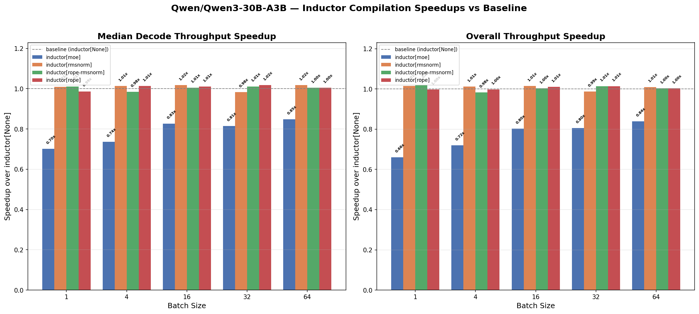

# Qwen3-30B-A3B — Inductor Compilation Profile

## Setup

- **Model:** `Qwen/Qwen3-30B-A3B`
- **MoE backend:** auto (flashinfer\_trtllm)
- **Weights:** real (HuggingFace)
- **Dataset:** ShareGPT, output sequence length 8192
- **TP:** 1
- **Device:** GB200
- **SGLang commit:**: `cb8105fe282fc373b5baed63d5df38682418a373`
- **`sgl_kernel` version:**: `0.3.21` 
- **`torch` commit:**: `cb8105fe282fc373b5baed63d5df38682418a373` (version nightly `2.12`)

## Notes

- `inductor[moe]` total time is misleading: prefill still uses the `triton_kernel` MoE backend, not `flashinfer_trtllm`.
- `inductor[rope]` uses the fallback fused q,k norm + rope path compiled by Inductor. Inductor can fuse the KV-cache update into the rotary embedding graph, while standard SGLang must fire 2 separate kernels because the SWA KV-cache type prevents fusion. The `SWAKVPool` uses dual addressing — SWA layers write to `out_cache_loc_swa`, non-SWA layers to `out_cache_loc` — which the JIT rope kernel doesn't handle. Inductor compiles the pure-PyTorch `forward_native` path where this dual addressing is expressed as `index_put_` ops that get fused into the rope graph.
- `inductor[rope-rmsnorm]` does **not** use Inductor for the pre-attention q,k normalization — only the rotary embedding and the layer-level RMSNorm are compiled.
- **RMSNorm** is compiled with no dynamic shapes, so Inductor can specialize on the fixed decode batch sizes used by SGLang's CUDA graphs. This means efficient code with only slightly higher startup times.
- **RotaryEmbedding** is compiled with dynamic shapes due to the KV-cache update (`index_put_` with variable `cache_loc`), which limits Inductor's ability to specialize and adds overhead.

## bench\_one\_batch Speedup Charts

The charts below were generated with `bench_one_batch.py`, which measures raw single-batch latency and throughput at various batch sizes (1, 4, 16, 32, 64) with input length 1024 and output length 8192. The baseline is `inductor[None]` (no Inductor compilation).

```bash
python profiles/plot_speedup.py profiles/Qwen/Qwen3-30B-A3B
```



**Key observations:**
- `inductor[moe]` significantly hurts decode throughput (~0.70x at bs=1), likely due to the triton\_kernel prefill overhead bleeding into measured totals.
- `inductor[rmsnorm]`, `inductor[rope-rmsnorm]`, and `inductor[rope]` are all roughly at parity with the baseline for decode throughput (1.00–1.02x).
- Overall throughput shows similar trends: the non-moe configs hover around 1.00x, while `inductor[moe]` drags overall throughput to ~0.65x at bs=1.

## bench\_offline\_throughput (Real Engine)

These benchmarks use `bench_offline_throughput.py`, which runs the full SGLang engine (scheduler, radix cache, continuous batching) to better reflect production serving performance.

**Note:** Piecewise CUDA graphs are automatically disabled for this model due to the `flashinfer_trtllm` MoE backend, so baseline and Inductor configs run under the same conditions.

```bash
python3 -m sglang.bench_offline_throughput \
  --model-path Qwen/Qwen3-30B-A3B \
  --trust-remote-code \
  --cuda-graph-bs <cg-bs> \
  --tp-size 1 \
  --sharegpt-output-len 8192 \
  --num-prompts <N> \
  --dataset-name sharegpt \
  --result-filename "" \
  [--enable-torch-compile --torch-compile-override-layers <layers> --torch-compile-scope local]
```

### 1 prompt, cuda-graph-bs 1

| Config | Output tok/s | Total tok/s | Total tok/s vs Baseline |
|--------|-------------|-------------|------------------------|
| Baseline (no Inductor) | 363 | 363 | — |
| Inductor — RotaryEmbedding + RMSNorm | 372 | 373 | **+2.5%** |

### 32 prompts, cuda-graph-bs 16

| Config | Output tok/s | Total tok/s | Total tok/s vs Baseline |
|--------|-------------|-------------|------------------------|
| Baseline (no Inductor) | 737 | 765 | — |
| Inductor — RotaryEmbedding + RMSNorm | 761 | 790 | **+3.2%** |

### 128 prompts, cuda-graph-bs 128

| Config | Output tok/s | Total tok/s | Total tok/s vs Baseline |
|--------|-------------|-------------|------------------------|
| Baseline (no Inductor) | 7,019 | 7,338 | — |
| Inductor — RotaryEmbedding + RMSNorm | 6,992 | 7,310 | −0.4% |
| Inductor — RotaryEmbedding | 7,010 | 7,329 | −0.1% |
| Inductor — RMSNorm | 7,012 | 7,331 | −0.1% |

### Summary

| Scenario | Config | Total tok/s | Total tok/s vs Baseline |
|----------|--------|-------------|-------------|
| 1 prompt, cg-bs 1 | RotaryEmbedding + RMSNorm | 373 | **+2.5%** |
| 32 prompts, cg-bs 16 | RotaryEmbedding + RMSNorm | 790 | **+3.2%** |
| 128 prompts, cg-bs 128 | RotaryEmbedding + RMSNorm | 7,310 | −0.4% |
| 128 prompts, cg-bs 128 | RotaryEmbedding | 7,329 | −0.1% |
| 128 prompts, cg-bs 128 | RMSNorm | 7,331 | −0.1% |

Inductor compilation of `RotaryEmbedding` + `RMSNorm` yields measurable gains at low concurrency: **+2.5%** at B=1 (363 → 373 tok/s) and **+3.2%** at B=32 (765 → 790 tok/s). At higher concurrency (128 prompts), all Inductor configs are within noise of the baseline (~7,330 tok/s) — the kernel overhead is amortized by the larger batch sizes and the bottleneck shifts elsewhere.